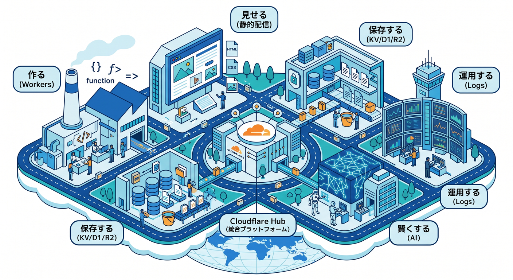
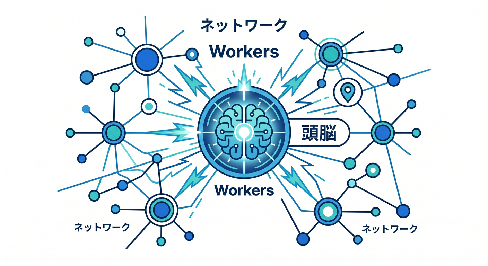
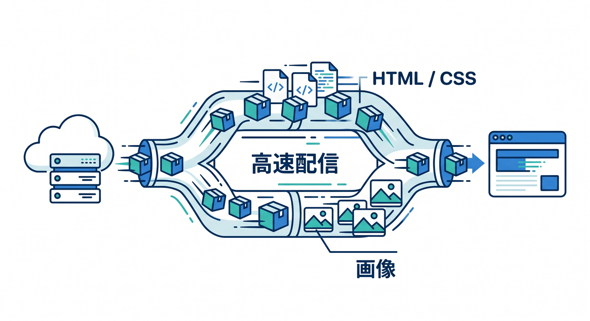
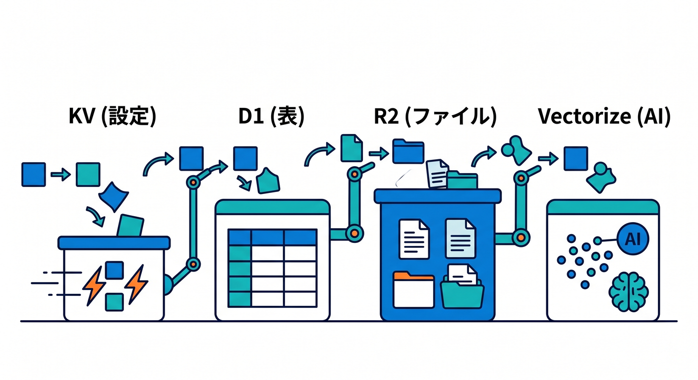
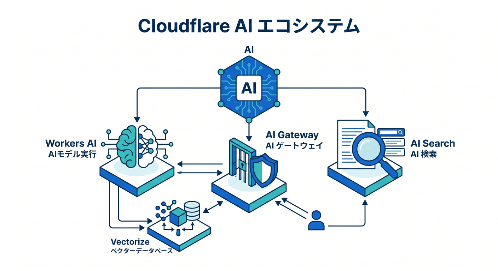
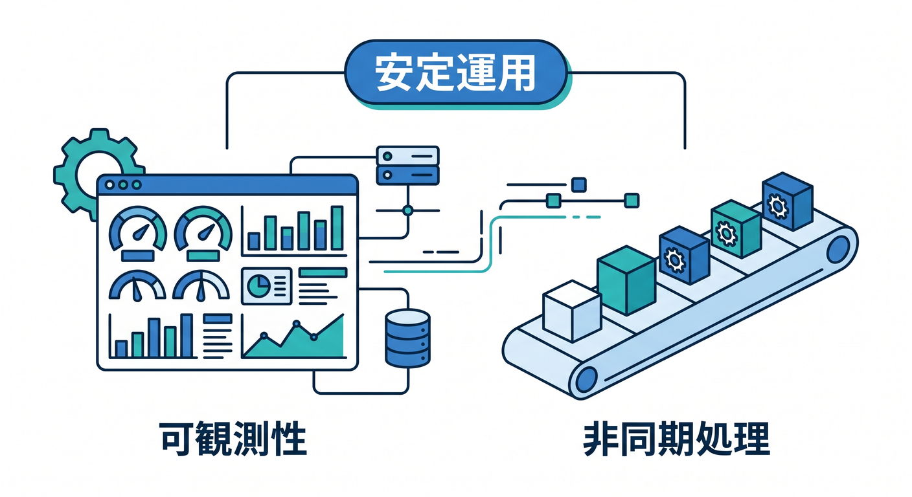

# 第01章：CloudflareとTypeScriptの地図を描こう 🌍🗺️

最初の章では、Cloudflareを「機能が多すぎて正体不明のサービス」として見るのをやめて、まずは全体の地図を頭に入れます😊
Cloudflare Workers は、世界中で動くサーバーレス実行基盤として、フルスタックアプリの構築、複数言語対応、そして標準での可観測性までまとめて案内されています。しかも静的アセット配信、データ保存、AI、非同期処理まで、周辺機能がかなり自然につながる設計です。 ([Cloudflare Docs][1])

この章のゴールは3つです✨
1つ目は、「Cloudflareは何を担当する場所なのか」をざっくり言えるようになること。
2つ目は、「なぜこの教材でTypeScriptを重視するのか」を納得すること。
3つ目は、「この先の章で、何をどんな順番で身につけるのか」を安心して見渡せるようになることです😊

---

## 1. まず最初に：Cloudflareは“ひとつの箱”ではなく、“役割がつながった街”です 🏙️☁️

Cloudflareを最初から細かいサービス名で覚えようとすると、かなり混乱しやすいです💦
でも見方を変えて、「作る」「見せる」「保存する」「賢くする」「安定運用する」という5つの役割で分けると、一気に分かりやすくなります。Cloudflare公式でも、Workers は単なる小さなAPI実行環境ではなく、React や Next などのフレームワークを使ったフルスタック開発まで含む土台として説明されています。 ([Cloudflare Docs][1])

つまり、この教材ではCloudflareを次のように整理して学びます👇

* 作る場所 → Workers
* 見せる場所 → 静的アセット配信、SPA、画面公開
* 保存する場所 → KV、D1、R2
* 賢くする場所 → Workers AI、Vectorize、AI Gateway、AI Search
* 安定運用する場所 → Observability、Queues、Workflows

この整理ができると、「あの機能は何のためにあるの？」がかなり減ります😊

---

## 2. Cloudflareの中心は Workers です 🚀

まず真ん中にあるのが Workers です。
Workers は Cloudflare のグローバルネットワーク上でアプリを動かすサーバーレス基盤で、React、Vue、Svelte、Next、Astro などのフレームワークにも対応し、JavaScript や TypeScript を含む複数言語を扱えます。さらに、アプリの状態確認や原因調査に使う observability も最初から強く意識された構成です。 ([Cloudflare Docs][1])

ここでいちばん大事なのは、Workers を「APIだけを書く場所」と思い込まないことです🙆
最近のCloudflare公式導線では、画面を見せる静的アセットも Worker と一緒に扱えますし、既存のフレームワークプロジェクトも Wrangler が自動検出して Cloudflare 向けに構成してくれる流れがかなり整っています。 ([Cloudflare Docs][2])

なので、最初の理解としてはこう覚えるとラクです✨
「Workers は、Cloudflare 上でアプリの頭脳になる場所」

---

## 3. “見せる”担当：静的サイトや画面公開も Cloudflare の大事な仕事です 🌐🎨

Webアプリは、裏側のAPIだけでは完成しません。
HTML、CSS、画像、JavaScript などの静的アセットを速く届けることも大事です。Cloudflare の公式ドキュメントでは、これらの静的アセットを Worker の一部としてアップロードでき、Cloudflare がキャッシュと配信を担当すると説明されています。React SPA と API Worker をまとめて始める導線も用意されています。 ([Cloudflare Docs][2])

さらに料金面でも、Workers の pricing ドキュメントでは「静的アセットへのリクエストは無料かつ無制限」と明記されています。つまり、静的配信が多いサイトは、Cloudflare の強みをかなり受けやすい設計です。 ([Cloudflare Docs][3])

ここでの理解はシンプルです😊
「Cloudflareは、アプリを動かすだけでなく、見せる部分もかなり得意」

---

## 4. “保存する”担当：データの置き場所は1つではありません 🗂️📦🧾

Cloudflareでは、保存先を1種類だけで考えません。
データの性質に合わせて置き場所を変えるのが基本です。Workers からは binding を通じて各サービスに自然につながる設計で、Cloudflare公式でも binding は REST API より高性能かつ制約が少ない方法として案内されています。 ([Cloudflare Docs][4])

ざっくり言うと、こんな地図です👇

* KV → グローバルなキー・バリュー保存。設定値や読み取り中心のデータ向き。 ([Cloudflare Docs][5])
* D1 → SQLite系の考え方で使えるサーバーレスSQLデータベース。表形式データ向き。 ([Cloudflare Docs][6])
* R2 → 画像、PDF、動画などの大きめのファイル向きのオブジェクトストレージ。高額な外向き通信料が発生しにくいのが強みです。 ([Cloudflare Docs][7])
* Vectorize → ベクトル検索向けのデータベース。AI検索や意味検索の土台になります。 ([Cloudflare Docs][8])

初心者さん向けに一言でまとめるなら、こうです✨
「Cloudflareでは、保存先を“用途別に選ぶ”」

これを最初に知っておくと、あとで「全部D1に入れるの？」「画像もSQLなの？」みたいな混乱が減ります😊

---

## 5. “賢くする”担当：CloudflareはAIもかなり前に出ています 🤖✨

2026年のCloudflareは、AIを“おまけ機能”ではなく、ちゃんと主要な柱として育てています。
Workers AI は、Cloudflare のネットワーク上のサーバーレスGPUでモデルを実行できる仕組みで、Workers、Pages、または API から呼び出せます。 ([Cloudflare Docs][9])

さらにAIまわりは、1サービスだけで終わりません👇

* Workers AI → モデルを実行する場所 🤖 ([Cloudflare Docs][9])
* Vectorize → 埋め込みや類似検索の置き場 🧠 ([Cloudflare Docs][8])
* AI Gateway → AIアプリのログ、分析、キャッシュ、レート制限、リトライ、モデル切替などを管理する場所 🛡️📊 ([Cloudflare Docs][10])
* AI Search → WebサイトやR2バケットや文書をつないで自然言語検索を作る場所 🔎 ([Cloudflare Docs][11])

しかも本日時点の最新情報として、AI Search の公式ページでは「2026年4月16日以降に作成された新規インスタンスには managed storage、vector index、web crawling が含まれる」と案内されています。AI系機能は特に更新が速いので、この教材でも“CloudflareはAIの土台まで持っている”という理解を最初から持っておくのが大事です。 ([Cloudflare Docs][11])

この章では細かいAPI呼び出しはまだやりません。
でも、先に全体像だけはつかみます😊
「Cloudflareは、アプリを動かす土台とAIの土台が近い」

これはかなり大きな特徴です🌟

---

## 6. “安定運用する”担当：作って終わりではありません 🔍📈⏳

初心者のうちは、「まず動けばOK」と思いがちです。
でも実際の開発では、「遅い」「落ちた」「たまに失敗する」「あとでまとめて処理したい」がすぐ出てきます。Cloudflare Workers には observability があり、アプリの状態把握や問題の切り分けを支える機能が公式に用意されています。 ([Cloudflare Docs][12])

また、Queues はメッセージを確実に届けたり、重い処理をリクエスト本体から切り離したりするための仕組みです。Workflows は複数ステップの処理をつなぎ、失敗時の自動再試行や状態保持まで面倒を見てくれます。 ([Cloudflare Docs][13])

つまりCloudflareは、
「画面を見せる」→「APIを動かす」→「保存する」だけでなく、
「あとで処理する」→「失敗を追う」→「長い手順を安全に回す」まで、つながっているんです😊

---

## 7. では、なぜ TypeScript を重視するの？ ✍️💡

ここがこの教材の核心です🔥
Cloudflare Workers の公式ドキュメントでは、TypeScript は first-class language として扱われ、Workers のAPIは fully typed、しかも型定義は open-source runtime である workerd から直接生成されると説明されています。さらに Cloudflare は、Worker 向け型生成として「wrangler types」の利用を推奨しています。 ([Cloudflare Docs][14])

これを初心者向けにやさしく言い換えると、TypeScriptのうれしさは次の3つです😊

* 入力ミスを早めに見つけやすい ✨
* エディタ補完がかなり気持ちいい 🎯
* Cloudflare特有の binding や env を安全に触りやすい 🔐

Cloudflareでは、KV、D1、R2、Queues などを env 経由の binding で使います。しかも binding は Workers から使うときに REST API より有利だと公式に案内されています。だからこそ、「ただJavaScriptが書ける」だけより、「Cloudflare向けの型が見えている」ほうがずっと安心です。 ([Cloudflare Docs][4])

この教材でTypeScriptを重視する理由は、
「難しい型パズルをやるため」ではありません🙅
「Cloudflareを安全に、気持ちよく使うため」です😊

---

## 8. JavaScriptでもいいのに、なぜあえてTypeScript？ 🤔🧩

もちろん、Workers は JavaScript でも書けます。
でもCloudflareの世界では、Request、Response、env、binding、JSON、外部APIレスポンスなど、“形”を意識したい場面がとても多いです。Workers のAPIが型付きで提供され、Cloudflare自身が runtime に合った型生成をおすすめしているのは、そのほうが実務で事故が減るからです。 ([Cloudflare Docs][14])

特に初心者さんがつまずきやすいのは、こんな場面です💦

* 受け取ったJSONの中身を思い込みで扱う
* env にあると思っていた binding 名を打ち間違える
* 返すデータの形が毎回ずれる
* あとから自分のコードを読んだときに意味が分からなくなる

TypeScriptは、こういう“地味だけど痛いミス”を減らしてくれます。
だからこの教材では、TypeScriptを「難しい理論」ではなく、「Cloudflareを安心して使うための手すり」として扱います🪜✨

---

## 9. AI時代の学び方：Copilot と MCP をどう見るか 🧠💬🛠️

2026年時点では、学習のしかた自体も変わっています。
GitHub公式では、GitHub MCP Server を VS Code で利用でき、リモート構成が多くのユーザーに推奨されています。VS Code の拡張ビューで「@mcp github」と検索して導入する流れや、リポジトリ単位で「.vscode/mcp.json」を置いて MCP サーバーを共有するやり方も案内されています。 ([GitHub Docs][15])

そしてCloudflare側も、AIにCloudflareを教える導線をかなり整えています。
Workers の prompting ドキュメントでは、agent や editor に Cloudflare Docs の MCP サーバーをつなぐ方法や、observability 用 MCP サーバーをつないでログ確認や例外調査に使う方法が案内されています。Cloudflare自身も、API、Docs、Bindings、Observability、AI Gateway、AI Search などの managed remote MCP servers を提供しています。 ([Cloudflare Docs][16])

つまり、これからの学び方はこうです😊

* 自分で考える 🧠
* Copilotに説明させる 💬
* MCPで公式情報や実環境に近い文脈を渡す 🔌
* 最後に自分で意味を確認する ✅

AIは“丸投げ先”ではなく、“理解を早める相棒”として使うのがいちばん強いです🌟

---

## 10. この教材での Copilot の使いどころ ✨🤝

この章の時点では、Copilotに難しいコード生成を大量に頼む必要はありません。
むしろ最初は、説明役として使うのがとてもおすすめです😊

たとえば、こんな聞き方が向いています👇

* 「Cloudflare Workersって、Node.jsのサーバーとどう違うの？」
* 「bindingって何？ envって何？」
* 「D1とR2とKVの違いを、初心者向けに例え話で説明して」
* 「この教材の学習順で、今は何を理解すれば十分？」
* 「Workers AI と AI Gateway と AI Search の役割を図なしで整理して」

Cloudflare公式は、AIツールに使うための Workers 向け base prompt や、Cloudflare Docs MCP サーバーの活用まで明示しています。なので、AIを使うこと自体が寄り道ではなく、かなり“公式寄りの学習スタイル”になってきています。 ([Cloudflare Docs][16])

---

## 11. 第1章の時点で覚えるべきキーワード 🧠📚

ここで全部暗記する必要はありません🙅
でも次の言葉は、ふわっと意味を持っておくと先がラクです。

* Workers
  Cloudflare上でアプリやAPIを動かす中心基盤。フルスタック開発の土台にもなる。 ([Cloudflare Docs][1])

* Static Assets
  HTML、CSS、画像、JSなどの配信対象。Workerと一緒に扱える。 ([Cloudflare Docs][2])

* Binding
  Worker から KV や D1 や R2 などへつながる入口。env で使う。 ([Cloudflare Docs][4])

* D1
  SQLite系の感覚で使うサーバーレスSQLデータベース。 ([Cloudflare Docs][6])

* R2
  ファイル置き場として使いやすいオブジェクトストレージ。 ([Cloudflare Docs][7])

* Workers AI
  Cloudflare上でAIモデルを動かす仕組み。 ([Cloudflare Docs][9])

* AI Gateway
  AIアプリの観測・制御の入口。 ([Cloudflare Docs][10])

* Observability
  ログや挙動を見て原因を追うための基盤。 ([Cloudflare Docs][12])

* Queues / Workflows
  後ろで動かす処理、複数段階の処理、自動再試行などを支える仕組み。 ([Cloudflare Docs][13])

* MCP
  AIと外部ツールや情報源をつなぐ標準。Cloudflare上でもMCPサーバーを作れます。 ([Cloudflare Docs][17])

---

## 12. よくある勘違いを、この章で先にほどいておこう 😊🪄

**勘違い①：CloudflareはCDNだけでしょ？**
もうその理解では足りません。公式の Workers 概要でも、アプリ構築、複数フレームワーク対応、複数言語対応、observability までまとめて扱う開発基盤として位置づけられています。 ([Cloudflare Docs][1])

**勘違い②：TypeScriptは上級者向けでしょ？**
もちろん高度な型の世界もあります。ですがこの教材で使うのは、Cloudflareを安全に触るための実用的な範囲が中心です。Cloudflare自身が TypeScript を first-class として扱い、wrangler types を推奨している時点で、むしろ“初心者こそ恩恵を受けやすい”面があります。 ([Cloudflare Docs][14])

**勘違い③：AIはあとでいいでしょ？**
今のCloudflareは、Workers AI、Vectorize、AI Gateway、AI Search までつながっていて、AIが周辺機能ではなくプラットフォームの一部です。早い段階で地図だけ見ておく価値があります。 ([Cloudflare Docs][9])

**勘違い④：運用は完成してから考えればいいでしょ？**
Observability、Queues、Workflows が初学者向けの導線にも出てくるのは、作る段階から“あとで困らない設計”が大事だからです。 ([Cloudflare Docs][12])

---

## 13. この章のミニ演習 📝🌟

気楽にやってみましょう😊
まだ正解を完璧に言えなくても大丈夫です。

**演習1**
「Cloudflareって何？」と聞かれたら、次の5語を使って2〜3文で説明してみましょう。
Workers / 静的配信 / データ保存 / AI / 運用

**演習2**
次の用途を、どこに置くと自然そうか考えてみましょう。

* サイトのロゴ画像
* ブログ記事一覧
* ユーザー設定値
* AIによる要約機能
* 重い後処理
  答えを厳密に当てるより、「なぜそう思ったか」を言葉にできればOKです😊

**演習3**
Copilot に次のように聞いてみましょう。
「Cloudflare Workers を中心にした開発地図を、初心者向けに100文字ずつで説明して」
AIの説明をそのまま信じるのではなく、「自分が読んで意味が通るか」を確認してください✨

---

## 14. まとめ：この章で“地図”が描けていれば成功です 🗺️🎉

この章で本当に持ち帰ってほしいのは、細かなコマンドではありません。
次の感覚です👇

* Workers が中心にある ☁️
* 静的配信も一緒に考えられる 🌐
* 保存先は用途で分ける 🗂️
* AI機能がかなり近い場所にある 🤖
* 運用や観測まで最初から視野に入る 🔍
* だから TypeScript が効く ✍️✨

この地図が頭に入ると、次章から出てくる C3、Wrangler、env、binding、D1、R2、Workers AI といった言葉が、バラバラの単語ではなく“同じ街の中の住人”に見えてきます😊

---

## 15. 次章へのつなぎ 🔜🛠️

次は、実際に VS Code で開発の入口に立ちます。
C3 でプロジェクトを作り、Wrangler が何をしているかを見て、「Cloudflareの開発ってこう始まるのか」を手で触っていきます。現在の公式導線でも、新規作成には C3 の利用が案内され、既存プロジェクトには Wrangler の自動検出・自動構成が用意されています。 ([Cloudflare Docs][18])

必要なら次の返答で、このまま続けて
「第2章　VS Codeで開発準備！C3・Wrangler・Copilotに慣れよう 🛠️✨」
の詳細版も同じ調子で作れます。

[1]: https://developers.cloudflare.com/workers/ "Overview · Cloudflare Workers docs"
[2]: https://developers.cloudflare.com/workers/static-assets/ "Static Assets · Cloudflare Workers docs"
[3]: https://developers.cloudflare.com/workers/platform/pricing/ "Pricing · Cloudflare Workers docs"
[4]: https://developers.cloudflare.com/workers/runtime-apis/bindings/ "Bindings (env) · Cloudflare Workers docs"
[5]: https://developers.cloudflare.com/kv/?utm_source=chatgpt.com "Cloudflare Workers KV"
[6]: https://developers.cloudflare.com/d1/ "Overview · Cloudflare D1 docs"
[7]: https://developers.cloudflare.com/r2/ "Overview · Cloudflare R2 docs"
[8]: https://developers.cloudflare.com/vectorize/ "Overview · Cloudflare Vectorize docs"
[9]: https://developers.cloudflare.com/workers-ai/ "Overview · Cloudflare Workers AI docs"
[10]: https://developers.cloudflare.com/ai-gateway/ "Overview · Cloudflare AI Gateway docs"
[11]: https://developers.cloudflare.com/ai-search/ "Cloudflare AI Search · Cloudflare AI Search docs"
[12]: https://developers.cloudflare.com/workers/observability/ "Observability · Cloudflare Workers docs"
[13]: https://developers.cloudflare.com/queues/ "Overview · Cloudflare Queues docs"
[14]: https://developers.cloudflare.com/workers/languages/typescript/ "Write Cloudflare Workers in TypeScript · Cloudflare Workers docs"
[15]: https://docs.github.com/copilot/how-tos/provide-context/use-mcp-in-your-ide/set-up-the-github-mcp-server "Setting up the GitHub MCP Server - GitHub Docs"
[16]: https://developers.cloudflare.com/workers/get-started/prompting/ "Prompting · Cloudflare Workers docs"
[17]: https://developers.cloudflare.com/agents/model-context-protocol/ "Model Context Protocol (MCP) · Cloudflare Agents docs"
[18]: https://developers.cloudflare.com/pages/get-started/c3/?utm_source=chatgpt.com "Create projects with C3 CLI"