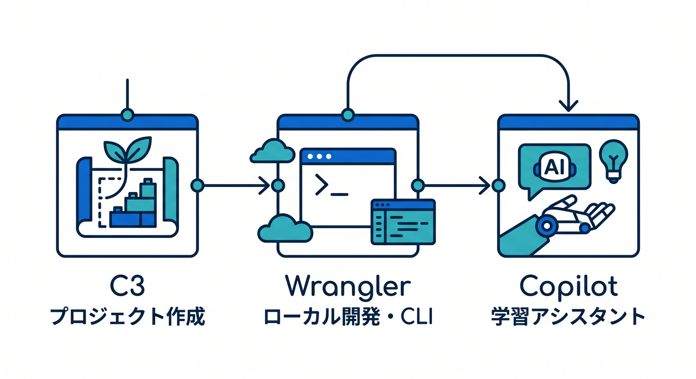
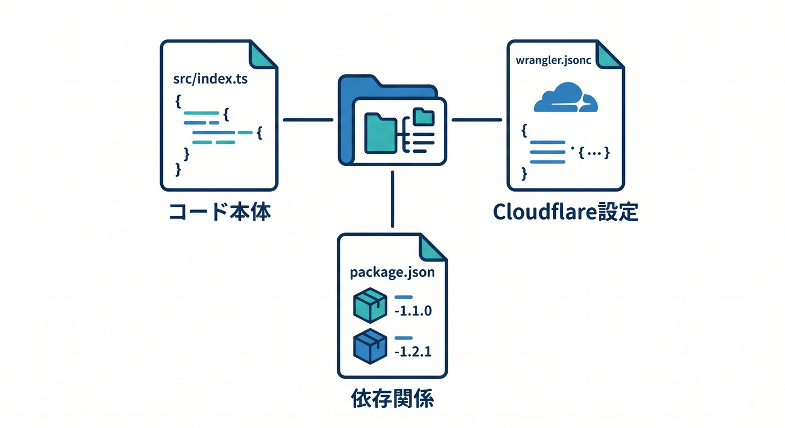
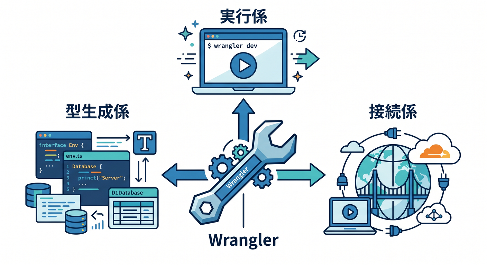
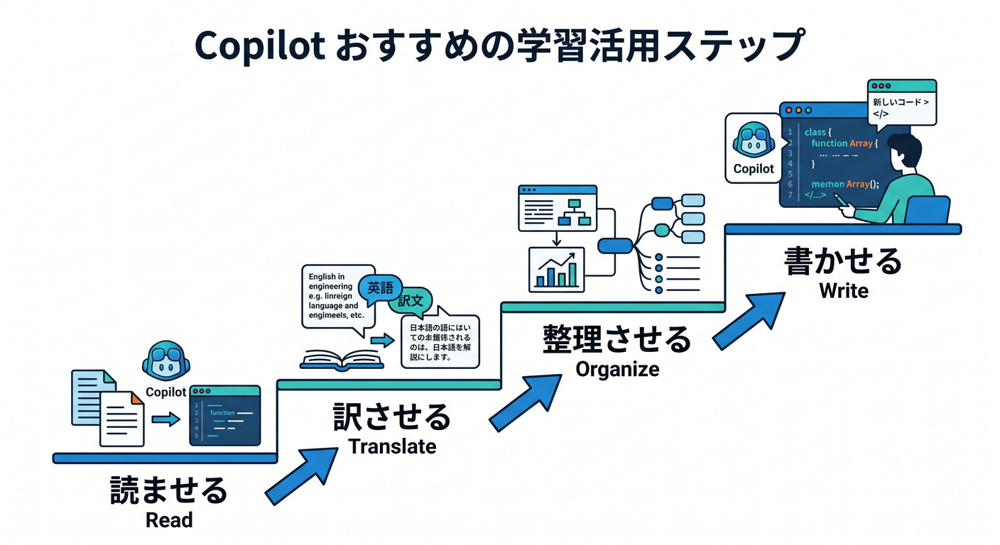
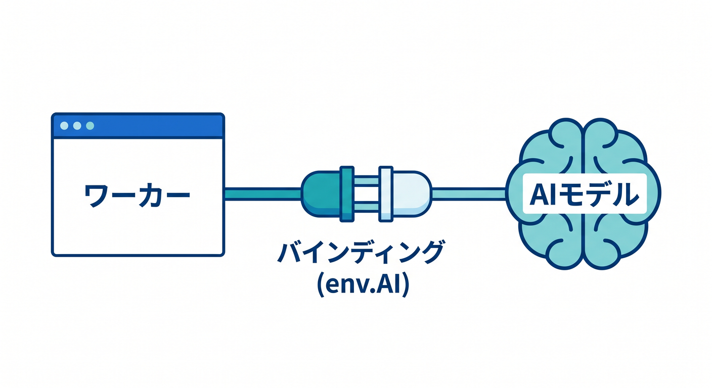

# 第02章：VS Codeで開発準備！C3・Wrangler・Copilotに慣れよう 🛠️✨

この章では、**「Cloudflareの開発を始める前に、まず道具に慣れる」**ことを目標にします😊
2026年4月17日時点の公式情報では、Cloudflare開発の出発点は **C3（create-cloudflare）でプロジェクトを作る → Wranglerでローカル開発する → 必要に応じて型生成やAI bindingを足す** という流れがかなり素直です。Workers は TypeScript を第一級で扱い、React や Next.js などの主要フレームワークともつながります。 ([Cloudflare Docs][1])

---

## この章のゴール 🎯

この章が終わるころには、次の状態を目指します✨

* C3 が何をしてくれる道具なのか説明できる
* Wrangler が何を担当するCLIなのか説明できる
* VS Code で Cloudflare プロジェクトを開いて、最低限のファイルを読める
* `wrangler dev` でローカル実行できる
* `wrangler types` の意味がわかる
* Copilot Chat に「設定を説明して」「エラーの意味を教えて」と自然に聞ける
* AI binding を後で足す入口だけは見えている 🤖

---

## 1. まずは3人組を覚えよう ☁️🧰🤝



最初に覚えるのは、この3つです。

**C3** は、Cloudflare公式のプロジェクト作成CLIです。新しい Workers / Pages プロジェクトを素早く作れます。しかも、ただ雛形を置くだけではなく、**公式テンプレート**や**各フレームワーク向けのセットアップ導線**を使ってくれるので、最初の形が崩れにくいのが強みです。 ([Cloudflare Docs][1])

**Wrangler** は、Cloudflare Developer Platform のCLIです。ローカル開発、デプロイ、ロールバック、リソース操作など、実務で使う中心コマンドがここに集まっています。Cloudflare開発では、**Wranglerに慣れる = Cloudflareに慣れる** と考えてかなり近いです。 ([Cloudflare Docs][1])

**GitHub Copilot** は、この章では「コード自動生成マシン」ではなく、**学習アシスタント**として使います💡
たとえば「この `wrangler.jsonc` を初心者向けに説明して」「このエラー文をやさしく訳して」「このTypeScriptの型エラー、原因を3つに分けて」と聞く使い方がとても相性いいです。さらにVS CodeのCopilotは、最新の機能マトリックスで **Agent mode** と **MCP** をサポートしています。 ([GitHub Docs][2])

---

## 2. まずは C3 で最初の Worker を作ろう 🚀

この教材では、最初の1個目は **Worker only + TypeScript** で始めるのがいちばんわかりやすいです😊
Cloudflare公式の Workers AI 入門でも、C3 で新規 Worker を作るときに **Hello World example → Worker only → TypeScript → git は Yes → deploy は No** の流れが案内されています。しかもそのとき、C3 は Wrangler も一緒に入れてくれます。 ([Cloudflare Docs][3])

実際の開始コマンドはこんな感じです👇

```bash
npm create cloudflare@latest -- hello-ai
```

対話の途中では、こんな選び方で進めると学習向きです👇

* What would you like to start with? → `Hello World example`
* Which template would you like to use? → `Worker only`
* Which language do you want to use? → `TypeScript`
* Do you want to use git for version control? → `Yes`
* Do you want to deploy your application? → `No`

この「いったん deploy しない」が大事です🌱
最初は**作る・読む・動かす**に集中したほうが理解が速いからです。なお Pages を Git 連携前提で使うときは、C3直後に `yes` で直接アップロードしてしまうと、あとからその Pages プロジェクトを Git リポジトリ連携できなくなるので注意です。 ([Cloudflare Docs][3])

---

## 3. VS Codeで開いたら、最初に見るファイルはこの3つ 👀📁



C3 で作った直後は、まず次の3つだけ見れば十分です✨

* `src/index.ts`
* `wrangler.jsonc`
* `package.json`

Cloudflare公式の生成内容でも、最初のプロジェクトには **`src/index.ts` の Hello World Worker** と **`wrangler.jsonc`** が入ります。ここで大事なのは、**「コード本体」と「Cloudflare側の設定」を分けて考える**ことです。
`src/index.ts` は「何を返すか」を書く場所、`wrangler.jsonc` は「この Worker をどんな条件で動かすか」を書く場所です。 ([Cloudflare Docs][3])

最初の `src/index.ts` は、だいたいこんな気持ちで読めばOKです😊

```ts
export default {
  async fetch(): Promise<Response> {
    return new Response("Hello Cloudflare + TypeScript! ☁️");
  },
};
```

ここでは文法を全部理解しなくて大丈夫です。
見るべきポイントは2つだけです。

1つ目は、**`fetch` が入口**だということ。
2つ目は、**最後に `Response` を返す**ということ。

この感覚があれば、第6章の Worker 本編にすごく入りやすくなります🌈

---

## 4. Wrangler は「実行係・接続係・型生成係」だと思おう 🧩



Wrangler は単なるデプロイ用コマンドではありません。
Cloudflare公式では、Wrangler で **ローカル開発**もでき、Cloudflareリソースとの接続や型生成にも深く関わります。ローカル開発の基本コマンドは `wrangler dev` です。 ([Cloudflare Docs][1])

まずはVS Codeのターミナルで、これを打ってみましょう👇

```bash
npx wrangler dev
```

Cloudflare公式の現在の挙動では、`wrangler dev` を動かすと、**Workerのコード自体は自分のローカルマシンで動き**、`wrangler.jsonc` に書かれた binding は **基本的にローカルでシミュレーション**されます。つまり、最初の学習では「いきなり本番クラウドに全部投げる」のではなく、**手元でかなり安全に試せる**わけです。 ([Cloudflare Docs][4])

しかも公式ガイドでは、ほとんどの開発では **ローカル開発を基本にして、必要な binding だけ remote に切り替える**形が効率的だとされています。最初から `--remote` に頼りきる必要はありません。 ([Cloudflare Docs][4])

---

## 5. `wrangler.jsonc` は「Cloudflare向けの設定ノート」📘☁️

この章では `wrangler.jsonc` を全部覚える必要はありません🙆
でも、**Cloudflare開発ではこのファイルが超大事**です。

ここに書くのは、たとえばこんな情報です。

* Worker名
* compatibility date
* AI や KV や R2 などの binding
* 環境ごとの設定
* secrets の宣言

特に大事なのは、**binding を足したら TypeScript 側の型も追従させる**ことです。Cloudflare公式では、Workers の型は `workerd` から生成され、`wrangler types` によって **その Worker の設定に合った型**を生成するのが推奨されています。 ([Cloudflare Docs][5])

なので、初心者のうちはこれをクセにしましょう👇

```bash
npx wrangler types
```

`wrangler.jsonc` を変えたあとにこれを打つ。
たったこれだけで、**`env` に何が生えているか**、**今の設定で使えるランタイムAPIは何か**が型として見えやすくなります✨
CloudflareのAI bindingのドキュメントでも、Wrangler設定を変更したら `wrangler types` を回すよう案内されています。 ([Cloudflare Docs][5])

---

## 6. Copilot は「書かせる」より先に「読ませる」がおすすめ 🤖📖



この章でのCopilotのおすすめ運用は、次の順番です。

**① 設定ファイルを読ませる**
**② エラー文を訳させる**
**③ 次に何をすべきか整理させる**
**④ それから必要最小限だけ書かせる**

この順番がかなり大事です😊
いきなり「全部作って」と丸投げすると、Cloudflare特有の設定を理解しないまま進みがちです。まずは **理解の補助輪** として使うのが一番伸びます。

たとえば、Copilot Chat にはこんなふうに聞けます👇

* 「この `wrangler.jsonc` を初心者向けに1行ずつ説明して」
* 「この `fetch()` の流れを図で説明して」
* 「このエラー、原因候補を3つに分けて」
* 「このTypeScriptエラーを直す前に、何がズレてるか教えて」
* 「Cloudflare Workerの `env` って何？」

こういう質問は、**学習速度をかなり上げます**✨

---

## 7. Copilot の Agent mode と MCP は、Cloudflare学習と相性がいい 🧠🔌

ここは2026年らしいポイントです🎉
GitHub公式では、VS Code版 Copilot は **Agent mode** と **MCP** をサポートしています。さらに GitHub MCP server は VS Code から使え、拡張ビューで `@mcp github` と検索して導入する案内があります。 ([GitHub Docs][2])

つまり、Copilotをただの補完機能として使うだけでなく、**ツールに触れるAIアシスタント**として使いやすくなっています。
そしてCloudflare側も、**cloudflare-docs MCP server** や **cloudflare-observability MCP server**、さらに **Cloudflare API MCP server** を公開しています。Cloudflare API MCP server は、DNS・Workers・R2・Zero Trust などを含む **2,500超のAPIエンドポイント**に `search()` / `execute()` で触れる作りです。 ([Cloudflare Docs][6])

ここで大事なのは、**「CopilotがCloudflareを自動で全部わかってくれる」わけではない**ことです⚠️
でも、CopilotはMCPに対応し、Cloudflareは公式MCPサーバー群を用意しているので、**ちゃんとつなげると、Cloudflareの知識・ドキュメント・API操作をAIに寄せやすい環境**になっています。これはかなり強いです。 ([GitHub Docs][7])

---

## 8. AIもここで少しだけ触っておこう 🤖☁️✨



この教材では Cloudflare のAIを積極的に使っていくので、第2章でも入口だけ見ておきます。
Cloudflare公式では、Workers AI を Worker につなぐには **AI binding** を追加し、その binding はコード側で `env.AI` として使います。 ([Cloudflare Docs][3])

`wrangler.jsonc` に足す形はこんなイメージです👇

```json
{
  "ai": {
    "binding": "AI"
  }
}
```

そして設定を変えたら、忘れずに型生成です👇

```bash
npx wrangler types
```

このあと `env.AI.run(...)` を呼べば、Workerの中からAIモデルを使えます。CloudflareのAI Gateway連携ドキュメントでは、`env.AI.run()` で Workers AI モデルだけでなく一部のサードパーティモデルにも触れられる案内があります。 ([Cloudflare Docs][8])

ただし、ここは初心者がハマりやすい注意点があります⚠️
Cloudflare公式のWrangler設定ドキュメントでは、**Workers AI はローカル開発中でもCloudflareアカウントにアクセスして実行され、課金対象になる**と明記されています。しかも AI binding は **1 Worker project につき1つ**です。
つまり、AIを試すときは「ローカルだから完全無料で雑に叩いてよい」と思わないことが大事です💰 ([Cloudflare Docs][9])

---

## 9. VS Codeでのおすすめ作業リズム 🪄💻

この章のおすすめリズムは、かなりシンプルです😊

1. C3 で土台を作る
2. VS Code で開く
3. `src/index.ts` を読む
4. `wrangler.jsonc` を読む
5. `npx wrangler dev` で動かす
6. Copilot に設定やエラーを説明させる
7. binding を足したら `npx wrangler types`
8. 必要になったら AI binding へ進む

この順番にすると、**Cloudflareの開発が「黒魔術」じゃなく「整理された手順」**に見えてきます🌟

---

## 10. つまずきやすいポイントを先に潰そう 🩹

**その1：`wrangler.jsonc` を変えたのに、型が追いつかない**
→ `npx wrangler types` を忘れていることが多いです。binding追加後はほぼ毎回これを意識しましょう。 ([Cloudflare Docs][5])

**その2：ローカル実行なのに挙動がクラウドっぽく見えない**
→ それで正常です。`wrangler dev` ではコードはローカルで動き、binding は基本ローカルシミュレーションです。Cloudflare特有の挙動を深く見るのは、必要になってから remote binding や `--remote` を考えればOKです。 ([Cloudflare Docs][4])

**その3：AIをちょっと試しただけで課金が気になる**
→ それも正常な警戒です。Workers AI はローカル開発中でもリモート実行で、課金対象になりえます。小さく試しましょう。 ([Cloudflare Docs][9])

**その4：秘密情報を設定ファイルにそのまま書いてしまう**
→ Cloudflare公式では、ローカル開発用の秘密情報は `.dev.vars` または `.env` に置き、**Git にコミットしない**よう明記されています。 `vars` に機密情報を置かないのも大事です。 ([Cloudflare Docs][9])

---

## 11. この章のミニ演習 🧪🎓

### 演習1：最初の Worker を作る

`hello-ai` という名前でプロジェクトを作り、VS Codeで開いてみましょう。

### 演習2：Copilot に読ませる

Copilot Chat にこう聞いてみましょう。

* 「この `wrangler.jsonc` を中学生でもわかるように説明して」
* 「この `src/index.ts` で `Response` を返している意味を教えて」

### 演習3：ローカル実行する

`npx wrangler dev` を実行して、ブラウザで動作確認しましょう。

### 演習4：型生成してみる

`npx wrangler types` を実行して、型生成の流れを体験しましょう。

### 演習5：AI binding の形だけ見る

まだ本格利用しなくてOKです。`wrangler.jsonc` に AI binding をどう足すかだけ読んで、`env.AI` という入口を覚えましょう。 ([Cloudflare Docs][8])

---

## 12. この章のまとめ 🌈📦

この章でいちばん大事なのは、**Cloudflare開発の最初の景色をシンプルにすること**です😊

* **C3** で最初の形を作る ☁️
* **Wrangler** で動かす・つなぐ・型をそろえる 🔧
* **Copilot** で読む・質問する・理解を加速する 🤖
* **AI binding** は早めに存在だけ知っておく ✨

ここまで入れば、次章からの TypeScript 基礎や、その先の Worker 本編がかなり入りやすくなります。
特に2026年の今は、**CopilotのMCP対応**と**Cloudflareの公式MCPサーバー群**があるので、学び方そのものが昔よりずっと強くなっています。環境づくりの章だけど、実はこの章がかなり大事です🔥 ([GitHub Docs][10])

次の第3章では、この環境を使って **「型って何がうれしいの？」** を気持ちよく体感していきます ✍️💡

[1]: https://developers.cloudflare.com/learning-paths/workers/get-started/c3-and-wrangler/ "C3 & Wrangler · Cloudflare Learning Paths"
[2]: https://docs.github.com/ja/enterprise-cloud%40latest/copilot/reference/copilot-feature-matrix?tool=vscode "Copilot 機能マトリックス - GitHub Enterprise Cloud Docs"
[3]: https://developers.cloudflare.com/workers-ai/get-started/workers-wrangler/ "Get started - Workers and Wrangler · Cloudflare Workers AI docs"
[4]: https://developers.cloudflare.com/workers/development-testing/ "Development & testing · Cloudflare Workers docs"
[5]: https://developers.cloudflare.com/workers/languages/typescript/ "Write Cloudflare Workers in TypeScript · Cloudflare Workers docs"
[6]: https://developers.cloudflare.com/workers/get-started/prompting/ "Prompting · Cloudflare Workers docs"
[7]: https://docs.github.com/en/copilot/concepts/context/mcp "About Model Context Protocol (MCP) - GitHub Docs"
[8]: https://developers.cloudflare.com/ai-gateway/integrations/worker-binding-methods/ "Workers Bindings · Cloudflare AI Gateway docs"
[9]: https://developers.cloudflare.com/workers/wrangler/configuration/ "Configuration - Wrangler · Cloudflare Workers docs"
[10]: https://docs.github.com/en/copilot/how-tos/provide-context/use-mcp-in-your-ide/use-the-github-mcp-server "Using the GitHub MCP Server in your IDE - GitHub Docs"