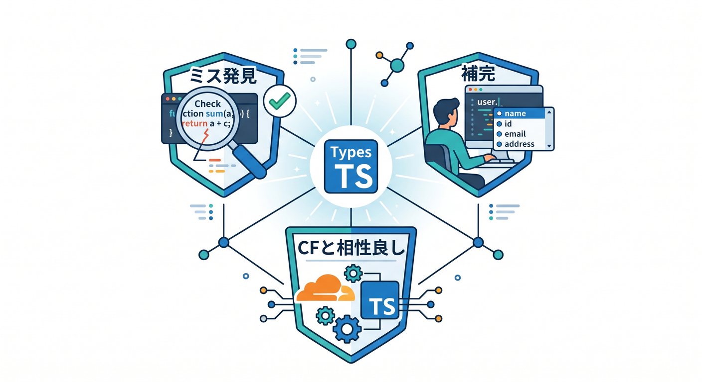
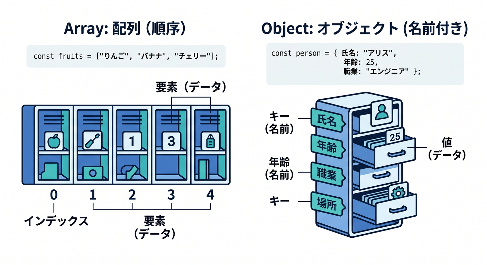
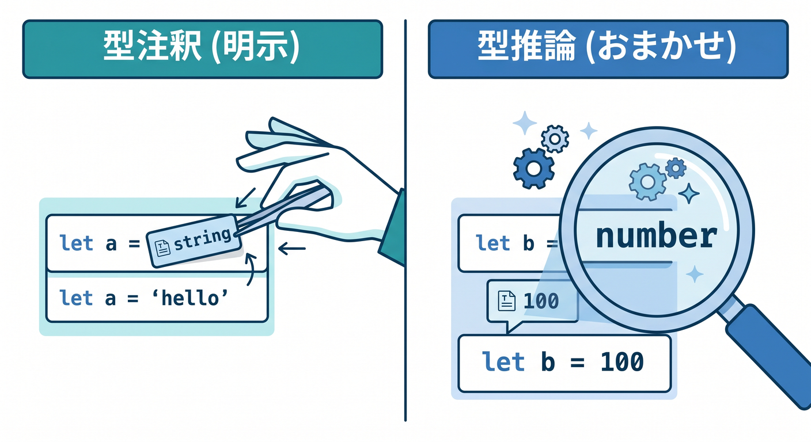

# 第03章：TypeScriptの超基本：「型って何がうれしいの？」を体感しよう ✍️💡

この章では、TypeScriptを**暗記科目**としてではなく、**「ミスを早く見つけて、Cloudflare開発をラクにする道具」**としてつかみます 😊
本日時点の Cloudflare 公式では、TypeScript は Workers の **first-class language** とされ、Workers の API は fully typed です。さらに、Cloudflare 側は `wrangler types` による型生成を推していて、型は compatibility date・compatibility flags・bindings・module rules に応じて変わる、と案内しています。つまり Cloudflare では、型は飾りではなく**実行環境そのものと結びつく情報**です。 ([Cloudflare Docs][1])

---

## この章のゴール 🎯📘

この章を終えるころには、こんな感覚がつかめていればOKです ✨

* `string`、`number`、`boolean` の違いがわかる
* 配列とオブジェクトを、こわがらずに読める
* 「型注釈」と「型推論」の違いがわかる
* VS Code の補完やエラー表示が気持ちよく感じられる
* 「これ、Cloudflare Workers や Workers AI で役立つやつだな」とつながる

---

## 1. そもそも「型」って何？ 🤔📦

まず超ざっくり言うと、**型 = その値がどんな種類のデータかを表す札**です。

たとえば、

* `"hello"` は文字列
* `123` は数値
* `true` は真偽値

という感じです。

TypeScript 公式の基本説明でも、JavaScript の値にはそれぞれできる操作があり、たとえば文字列なら `toLowerCase()` のような操作ができます、と説明されています。TypeScript はそこに「この値は何者か」を明示・推論して、変な操作を早めに止めてくれます。 ([TypeScript][2])

たとえばこんなコードを見てください 👀

```ts
const message = "Hello Cloudflare";
console.log(message.toLowerCase());
```

これはOKです 👍
`message` は文字列なので、文字列用のメソッドを呼べます。

でもこうすると…

```ts
const message = "Hello Cloudflare";
console.log(message.toFixed(2));
```

これはダメです ❌
`toFixed()` は数値向けの機能なので、文字列には使えません。

JavaScript だけだと、実行して初めて「あ、やらかした」と気づく場面があります。
TypeScript だと、**書いている途中で VS Code が止めてくれる**ことが多いです。これが最初のうれしさです ✨

---

## 2. 型がうれしい理由を、先に3つだけつかもう 🌈🛟



型のうれしさは、最初は次の3つで十分です。

### ① ミスを早く見つけやすい 🔎

スペルミスや、文字列に数値用メソッドを使うようなミスを、保存前や実行前に見つけやすくなります。

### ② 補完がかなり気持ちいい ✨⌨️

値の型がわかっていると、VS Code が「この値にはこういうプロパティやメソッドがありますよ」と補完しやすくなります。

### ③ Cloudflare では特に効く ☁️

Cloudflare Workers では API が fully typed で、さらに `wrangler types` により、自分の Worker 設定に合った型を生成する運用が推奨されています。つまり TypeScript を使うほど、**Cloudflare の runtime と editor が噛み合いやすい**です。 ([Cloudflare Docs][1])

---

## 3. まず覚える型はこれだけでOK ✋📚

この章では、次の5種類を最優先にします。

* `string`
* `number`
* `boolean`
* 配列
* オブジェクト

これだけで、かなり戦えます 💪

---

## 4. `string`・`number`・`boolean` を体で覚えよう 🧪


### 文字列 `string` 📝

文字です。

```ts
const siteTitle: string = "Cloudflare Study";
const greeting = "こんにちは";
```

文字列は、文章・名前・URL・検索語・プロンプト文などに使います。

Cloudflare 開発でも、

* リクエストURL
* JSON のメッセージ
* AI への prompt
* KV に保存するキー

など、文字列は本当によく出ます ☁️

### 数値 `number` 🔢

数字です。

```ts
const port: number = 3000;
const price = 980;
const score = 87.5;
```

件数・金額・ページ番号・レート制御の値などに使います。

### 真偽値 `boolean` ✅❌

`true` / `false` の2択です。

```ts
const isPublished: boolean = true;
const isAdmin = false;
```

オン・オフ、公開・非公開、成功・失敗のような状態にぴったりです。

---

## 5. 配列は「同じ仲間を並べた箱」📦📦📦

配列は、値を順番に並べたものです。

```ts
const tags: string[] = ["cloudflare", "typescript", "workers"];
const scores: number[] = [80, 90, 100];
```

`string[]` は「文字列の配列」です。
つまり `tags` の中には、文字列だけが入るイメージです 😊

こんなのもOKです。

```ts
const flags = [true, false, true];
```

この場合、TypeScript は中身を見て「これは `boolean[]` っぽいね」と推論してくれます。
これを**型推論**といいます ✨

---

## 6. オブジェクトは「名前つきのデータのまとまり」🏷️🧱



Web開発では、オブジェクトは超重要です。
JSON も、かなりの部分はオブジェクトとして考えるとわかりやすいです。

```ts
const user = {
  name: "Komiyanma",
  age: 20,
  isStudent: true,
};
```

この `user` には、

* `name`
* `age`
* `isStudent`

という**名前つきの情報**が入っています。

型を明示するとこう書けます。

```ts
const user: {
  name: string;
  age: number;
  isStudent: boolean;
} = {
  name: "Komiyanma",
  age: 20,
  isStudent: true,
};
```

最初はちょっと長く見えますが、やっていることはシンプルです。

* `name` は文字列
* `age` は数値
* `isStudent` は真偽値

と宣言しているだけです 🌱

---

## 7. 「型注釈」と「型推論」の違いをつかもう 🧭



### 型注釈

自分で型を書くことです。

```ts
const title: string = "はじめてのWorkers";
```

### 型推論

TypeScript に「見ればわかるよね」と任せることです。

```ts
const title = "はじめてのWorkers";
```

この場合も `title` は文字列として扱われます。

初心者のうちは、こんな使い分けがおすすめです 👍

* **見れば明らか**なものは推論に任せる
* **オブジェクトや関数の入口**は意識して型を書く
* **後で読み返して迷いそう**な場所は型を書く

---

## 8. VS Codeで「型のありがたみ」を体感しよう 🖥️✨

VS Code では、TypeScript のよさがかなり見えやすいです。

たとえば次のコードを書いてみてください。

```ts
const article = {
  title: "Cloudflare入門",
  likes: 12,
  published: true,
};

article.
```

この `article.` のあとで補完候補が出るはずです 🎉
`title`、`likes`、`published` などが見えて、「あ、今この箱には何が入っているのか」が一瞬でわかります。

逆に、存在しないものを書くと…

```ts
article.author
```

「そんなプロパティないよ」と教えてくれやすくなります。

この**補完の気持ちよさ**が、TypeScript を続ける最大のごほうびの1つです 🍰

---

## 9. Cloudflare だと、なぜさらに気持ちいいの？ ☁️💙


Cloudflare Workers の TypeScript ページでは、Workers の API は fully typed で、型定義は open-source runtime である `workerd` から直接生成される、と説明されています。さらに Cloudflare は `wrangler types` の利用を推奨していて、生成される型には `Env` や runtime API が含まれます。 ([Cloudflare Docs][1])

つまり、後の章でこんなコードを書き始めると…

```ts
export default {
  async fetch(request: Request): Promise<Response> {
    const url = new URL(request.url);

    return Response.json({
      pathname: url.pathname,
      ok: true,
    });
  },
};
```

* `request.url` が使える
* `new URL(...)` の補完が効く
* `Response.json(...)` の形が読みやすい

というふうに、**Web標準APIと型が自然につながる**感じを体感できます 😊

しかも Cloudflare 公式では、型は Worker の compatibility date・compatibility flags・bindings・module rules に応じて変わると説明されています。なので、Cloudflare では「型が現実とずれる」と地味に困ります。ここが普通の学習用 TypeScript より、Cloudflare 文脈のほうが型を大事にしたい理由です。 ([Cloudflare Docs][1])

---

## 10. ここでひとつ大事な最新メモ 📝⚠️

本日時点の公式情報では、**Cloudflare 全体の推奨は `wrangler types` 寄り**です。
一方で、Cloudflare の React SPA + API チュートリアルでは、worker 用の `tsconfig.worker.json` に `@cloudflare/workers-types` を入れる例もまだ掲載されています。なので現状は「公式の主軸は `wrangler types`、ただし一部のフレームワーク系チュートリアルには従来スタイルも残っている」と理解するのがいちばん安全です。教材としては、第7章で `wrangler types` を本命として整理するのが自然です。 ([Cloudflare Docs][1])

---

## 11. Workers AI と型はどうつながるの？ 🤖✨


この章では AI をまだ本格実装しませんが、**TypeScript の基本はそのまま Workers AI に直結**します。

Cloudflare 公式では、Workers AI は Worker に AI binding をつないで使え、Wrangler では `ai.binding` を設定すると Worker 内では `env.AI` として使えます。さらに `env.AI.run()` は、**第1引数にモデル名、 第2引数にオブジェクト**を渡して呼びます。 ([Cloudflare Docs][3])

つまり後で AI を使うときも、結局はこういう感覚です。

* `prompt` は文字列だよね 📝
* オプションはオブジェクトだよね 📦
* 配列で候補を返すこともあるよね 📚
* 戻り値の形を雑に扱うと危ないよね ⚠️

たとえば、AI 用の入力データを先に手で型っぽく整理すると、かなり見通しがよくなります。

```ts
const aiInput = {
  prompt: "この文章を3行で要約して",
  maxChars: 120,
  includeTitle: true,
};
```

ここではまだ型注釈を書いていませんが、

* `prompt` は `string`
* `maxChars` は `number`
* `includeTitle` は `boolean`

と頭の中で整理できています。
この「入力データの形を意識する力」が、そのまま AI 開発の安全性になります 🌟

なお Workers AI は Cloudflare の公式上、Free / Paid の両プランで利用でき、50+ の open-source models を model catalog 経由で使える案内になっています。AI を後で本格的に触る章でも、型で入力と出力を整理できる人ほど楽です。 ([Cloudflare Docs][4])

---

## 12. Copilot をこの章でどう使うとお得？ 🧑‍🏫🤖

GitHub Copilot Chat は公式に VS Code などの IDE で使え、コードの説明、バグ修正案、テスト生成などを会話形式で支援できます。さらに MCP を使うと、VS Code の Copilot Chat で Agent モードを選び、設定した MCP server の tools や resources を使えます。 ([GitHub Docs][5])

この章では、Copilot にはこんな聞き方がかなりおすすめです ✨

### Copilotに聞く例①

「このコードの中で、string / number / boolean を初心者向けに色分けして説明して」

### Copilotに聞く例②

「このオブジェクトに型注釈をつけて。難しい書き方は使わないで」

### Copilotに聞く例③

「このエラーを、中学生にもわかる言い方で説明して」

### Copilotに聞く例④

「Cloudflare Worker で後で使いやすいように、このデータ構造を整理して」

MCP を使える環境なら、将来的には docs や repo 情報を文脈に足して学習を深める流れも相性がいいです。ただしこの章では、まずは**AIに丸投げするより、自分で型の意味を1回言葉にしてから聞く**のが大事です 🌱

---

## 13. まずはこれだけ手を動かそう！練習ミニセット 🏃‍♂️💨

### 練習1：基本の型を見分ける

次の変数が何型か考えてみましょう。

```ts
const appName = "My Worker App";
const retryCount = 3;
const isLogin = false;
```

答えはこうです。

* `appName` → `string`
* `retryCount` → `number`
* `isLogin` → `boolean`

### 練習2：配列を読めるようになる

```ts
const categories = ["news", "tips", "ai"];
const pageNumbers = [1, 2, 3, 4];
```

* `categories` は `string[]`
* `pageNumbers` は `number[]`

### 練習3：オブジェクトを読めるようになる

```ts
const post = {
  title: "TypeScriptって便利！",
  views: 250,
  published: true,
};
```

これは

* `title: string`
* `views: number`
* `published: boolean`

を持つオブジェクトです。

### 練習4：型注釈を書いてみる

```ts
const siteName: string = "Cloudflare Lab";
const memberCount: number = 12;
const isOpen: boolean = true;
```

最初はこれだけで十分です 🙌

---

## 14. Cloudflareっぽいミニ練習 ☁️🧪

次の JSON レスポンスを返すつもりで、中身の型を読んでみましょう。

```ts
const responseData = {
  service: "workers-ai",
  success: true,
  tokensUsed: 128,
  tags: ["summary", "ja", "demo"],
};
```

読めるようになってほしいポイントはこれです。

* `service` は `string`
* `success` は `boolean`
* `tokensUsed` は `number`
* `tags` は `string[]`

この力がつくと、後で `Response.json(...)` の中身や、AI の返り値の整形がかなりラクになります 😊

---

## 15. よくあるつまずきポイント 😵‍💫🩹

### ① 文字列の数字を数値だと思いこむ

```ts
const price = "1000";
```

これは文字列です。数値ではありません。

### ② 配列の中身が何型か意識していない

```ts
const items = ["a", "b", "c"];
```

これは文字列配列です。
ここにいきなり `123` を混ぜたくなったら、一度立ち止まりましょう ✋

### ③ オブジェクトをただの“ぐちゃっとした箱”だと思う

オブジェクトは「名前つきのデータ集合」です。
`title`、`count`、`enabled` のように、**意味がある名前で整理する**のがコツです。

### ④ `any` に逃げたくなる

今はまだ `any` を無理に覚えなくてOKです。
初心者のうちは、まず

* 文字列
* 数値
* 真偽値
* 配列
* オブジェクト

を丁寧に読むほうが大事です 🌱

---

## 16. この章の小さな実践課題 ✍️🎒

次の条件で `profile` オブジェクトを作ってみましょう。

* 名前
* 年齢
* 学習中かどうか
* 好きな技術を3つ

例はこちらです。

```ts
const profile = {
  name: "Hanako",
  age: 19,
  isLearning: true,
  favoriteTech: ["TypeScript", "Cloudflare", "React"],
};
```

できたら次に、型注釈つきでも書いてみましょう。

```ts
const profile: {
  name: string;
  age: number;
  isLearning: boolean;
  favoriteTech: string[];
} = {
  name: "Hanako",
  age: 19,
  isLearning: true,
  favoriteTech: ["TypeScript", "Cloudflare", "React"],
};
```

ここまでできればかなり良い感じです 🎉

---

## 17. 章末まとめ 🏁✨

この章でいちばん大事なのは、次の3つです。

* **型は「値の種類」を表す**
* **型があると、ミス発見と補完がかなりラク**
* **Cloudflare では型が runtime 設定や bindings と強くつながる**

Cloudflare 公式は、Workers における TypeScript を first-class と位置づけ、`wrangler types` による runtime に合った型生成を重視しています。さらに Workers AI も binding 経由で `env.AI` を使う設計なので、型の基本を早い段階でつかんでおくほど、後の章がどんどん楽になります。 ([Cloudflare Docs][1])

---

## 次章へのつながり 🔜📦

次の第4章では、この章で覚えた

* 文字列
* 数値
* 真偽値
* 配列
* オブジェクト

を土台にして、**関数・引数・返り値・オブジェクト設計**へ進みます。
そこで初めて、「あ、Workers の `fetch(request, env)` が読める！」になっていきます 😊

必要ならこのまま続けて、同じトーンと粒度で**第4章**もそのまま作れます。

[1]: https://developers.cloudflare.com/workers/languages/typescript/ "Write Cloudflare Workers in TypeScript · Cloudflare Workers docs"
[2]: https://www.typescriptlang.org/docs/handbook/2/basic-types.html "TypeScript: Documentation - The Basics"
[3]: https://developers.cloudflare.com/workers-ai/configuration/bindings/ "Workers Bindings · Cloudflare Workers AI docs"
[4]: https://developers.cloudflare.com/workers-ai/ "Overview · Cloudflare Workers AI docs"
[5]: https://docs.github.com/en/copilot/concepts/chat "About GitHub Copilot Chat - GitHub Docs"