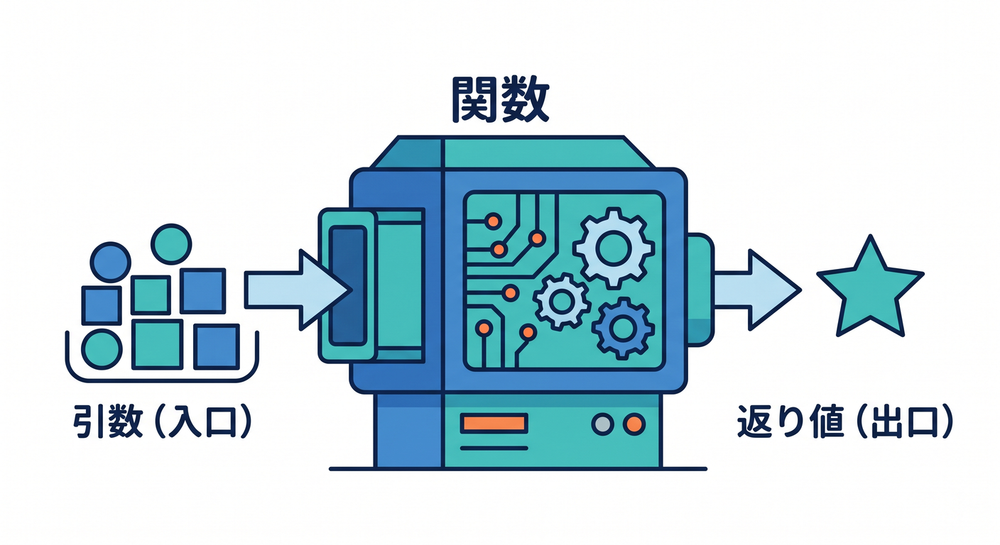
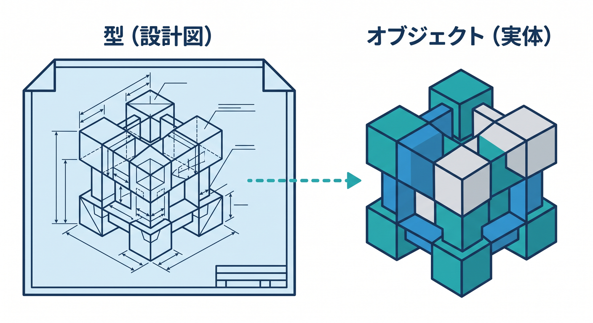
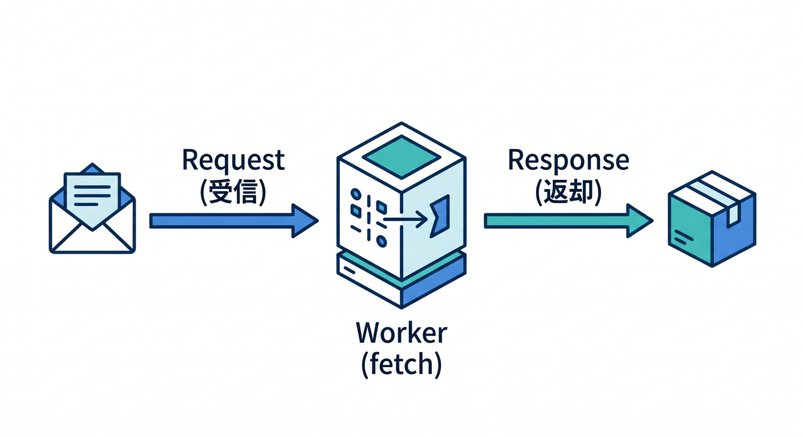
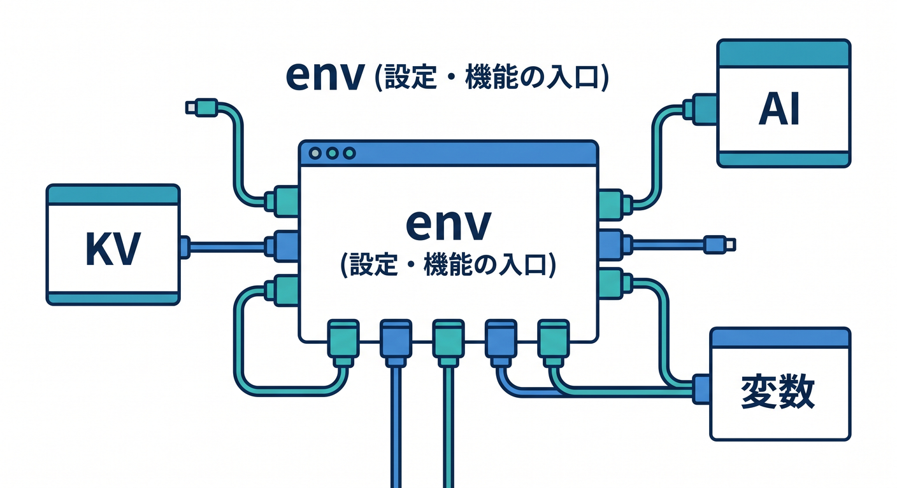
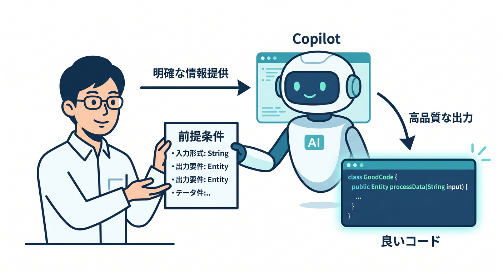

# 第04章：関数・引数・返り値・オブジェクトを、Cloudflare向けに覚えよう 📦🔧

この章では、TypeScriptの基礎の中でも **Cloudflare Workersを書くときに特によく出る形** にしぼって学びます😊
Cloudflare Workers では、HTTPリクエストが `fetch()` ハンドラーに `Request` として渡され、そこから `Response` を返すのが基本です。CloudflareはTypeScriptを第一級で扱っていて、型定義は `workerd` に由来し、公式も `wrangler types` による型生成を強く勧めています。だからこの章で「関数」と「オブジェクト」の型に慣れておくと、あとで Worker のコードがかなり読みやすくなります✨ ([Cloudflare Docs][1])

---

## この章でできるようになること 🎯

この章を終えると、こんなことができるようになります🙌

* 関数の引数に型を書ける
* 返り値の型を書ける
* オブジェクトの形を型で表せる
* 同じ型を何度も使うために `type` を使える
* Cloudflare Workers の `fetch(request, env, ctx)` という形を見ても、びっくりしなくなる
* AI向けの入力オブジェクトや設定オブジェクトを、落ち着いて組み立てられる

---

## 1. まずは「関数」をつかもう 📦



TypeScriptの世界でも、関数はアプリの基本パーツです。TypeScript公式でも、関数はアプリの基本的な構成要素であり、「どう呼ばれるか」を型で表せることが大事だと説明されています。 ([TypeScript][2])

いちばんシンプルな形から見てみましょう👇

```ts
function makeGreeting(name: string): string {
  return `こんにちは、${name}さん！`;
}
```

ここで見てほしいのは2つです😊

* `name: string`
  → この関数は、`name` という引数を受け取るよ、しかも文字列だよ、という意味
* `): string`
  → この関数は、最後に文字列を返すよ、という意味

TypeScript公式でも、関数の型では「引数の型」と「返り値の型」を表すのが基本になっています。 ([TypeScript][2])

---

## 2. 引数は「受け取り口のルール」だと思えばOK ✍️📥

関数の引数は、**関数の入口** です。
「何を受け取ってよいか」を決めておくと、間違った値を早めに見つけやすくなります✨

```ts
function addTax(price: number, taxRate: number): number {
  return price + price * taxRate;
}
```

この関数は、

* `price` は数値
* `taxRate` も数値
* 結果も数値

というルールでできています。

TypeScript公式では、関数型の書き方として `(a: string) => void` のような形も紹介されていて、**引数の型と返り値の型をきちんと書く** のが基本です。 ([TypeScript][2])

たとえば「関数そのものを変数に入れる」書き方もあります👇

```ts
type MessageBuilder = (name: string) => string;

const buildMessage: MessageBuilder = (name) => {
  return `ようこそ、${name}さん！`;
};
```

これは少し先の話にもつながりますが、**「関数の型に名前を付ける」** こともできる、というイメージだけ持っておけば十分です😊 ([TypeScript][2])

---

## 3. 返り値は「出口のルール」🎁📤

関数は、受け取って終わりではなく、何かを返すことが多いです。
その返り値にも型を書いておくと、コードがかなり読みやすくなります✨

```ts
function createStatusMessage(ok: boolean): string {
  if (ok) {
    return "成功しました";
  }

  return "失敗しました";
}
```

返り値が文字列なら `: string`、数値なら `: number`、何も返さないなら `: void` のように書けます。TypeScript公式でも、関数型の説明の中で「引数がこうで、返り値はこう」という見方が中心です。 ([TypeScript][2])

Cloudflare Workersでも、この「返り値の型」はとても大事です。
なぜなら Worker の `fetch()` は、**最終的に `Response` を返す関数** だからです。Cloudflare公式の fetch handler ドキュメントでも、Worker は `Request` を受け取り、`Response` を返す形で説明されています。 ([Cloudflare Docs][1])

---

## 4. オブジェクト型は「データの設計図」🧱📘



JavaScriptでは、データをまとめる基本の形がオブジェクトです。TypeScript公式でも、データをまとめて受け渡す基本はオブジェクトであり、それを **object types** で表すと説明されています。 ([TypeScript][3])

たとえば、サイト設定をまとめたいとします👇

```ts
const siteConfig = {
  siteName: "Kumo Note",
  enableAI: true,
  itemsPerPage: 10,
};
```

TypeScriptでは、この形に「こういう設計図ですよ」と型を付けられます👇

```ts
type SiteConfig = {
  siteName: string;
  enableAI: boolean;
  itemsPerPage: number;
};
```

そして、この設計図を使って関数を書くと、かなり読みやすくなります✨

```ts
function showConfig(config: SiteConfig): string {
  return `${config.siteName} / AI: ${config.enableAI} / 件数: ${config.itemsPerPage}`;
}
```

TypeScript公式でも、オブジェクト型はその場で直接書くこともできるし、`type` や `interface` で名前を付けることもできます。さらに `type` は「型に名前を付ける」ための仕組みとして説明されています。 ([TypeScript][3])

---

## 5. `type` を使うと、同じ形を何回も使えてラク 🌟

毎回こう書くのはしんどいです👇

```ts
function saveUser(user: { id: number; name: string; isAdmin: boolean }): string {
  return `${user.name} を保存しました`;
}
```

なので、型に名前を付けます👇

```ts
type User = {
  id: number;
  name: string;
  isAdmin: boolean;
};

function saveUser(user: User): string {
  return `${user.name} を保存しました`;
}

function deleteUser(user: User): string {
  return `${user.name} を削除しました`;
}
```

TypeScript公式でも、`type Point = { ... }` のように書いて、同じ型を何度も使い回すのが普通の流れとして紹介されています。 ([TypeScript][4])

このあと Cloudflare の学習が進むと、

* APIの返却データ
* 設定オブジェクト
* フォーム入力
* AIへの入力データ

みたいな「同じ形を何度も使うデータ」がたくさん出てきます。
だから `type` はかなり大事です😊

---

## 6. Cloudflare Workersの形に近づけてみよう ☁️🚀



ここからは、いよいよ Cloudflare っぽい形で見ていきます。

Cloudflare Workers の基本は、`fetch(request, env, ctx)` のようなハンドラーです。Cloudflare公式では、HTTPリクエストは `Request` として渡され、そこから `Response` を返すのが基本です。さらに、最新の React SPA + API チュートリアルでは `satisfies ExportedHandler` を使った TypeScript 例が案内されています。 ([Cloudflare Docs][1])

まずはとても小さい例です👇

```ts
export default {
  async fetch(request: Request): Promise<Response> {
    const url = new URL(request.url);
    const name = url.searchParams.get("name") ?? "ゲスト";

    return Response.json({
      message: `こんにちは、${name}さん！`,
    });
  },
} satisfies ExportedHandler;
```

このコードで見てほしいのはここです✨

* `request: Request`
  → リクエストを受け取る
* `: Promise<Response>`
  → 最後に `Response` を返す
* `Response.json(...)`
  → JSONを返す
* `satisfies ExportedHandler`
  → 「Cloudflareのハンドラーとして正しい形ですよ」とチェックしてもらう感じ

Cloudflare公式のチュートリアルでも、`pathname` を見て `Response.json(...)` を返す Worker が紹介されています。 ([Cloudflare Docs][5])

---

## 7. `env` は「設定や機能の入口」だと思おう 🔑🧩



Cloudflareのコードで最初に戸惑いやすいのが `env` です。
でも、考え方はそんなに難しくありません😊

Cloudflare公式では、**bindings** は Worker が Cloudflare Developer Platform 上の各種リソースに触るための仕組みで、REST API を直接たたくより高性能で制約も少ないと説明されています。さらに、環境変数は binding の一種として `env` パラメータから利用でき、`vars` には文字列やJSON値を定義できます。 ([Cloudflare Docs][6])

たとえば、学習用にシンプル化するとこんなイメージです👇

```ts
type PublicConfig = {
  siteName: string;
  enableAI: boolean;
};

function buildPublicConfig(siteName: string, enableAI: boolean): PublicConfig {
  return {
    siteName,
    enableAI,
  };
}

type Env = {
  SITE_NAME: string;
  FEATURE_FLAGS: {
    enableAI: boolean;
  };
};

export default {
  async fetch(request: Request, env: Env): Promise<Response> {
    const config = buildPublicConfig(
      env.SITE_NAME,
      env.FEATURE_FLAGS.enableAI,
    );

    return Response.json(config);
  },
} satisfies ExportedHandler<Env>;
```

ここでは、

* `env.SITE_NAME` は文字列
* `env.FEATURE_FLAGS` はオブジェクト
* その値を受け取って `buildPublicConfig()` が整えたオブジェクトを返す

という流れです✨

ただしここは超大事です⚠️
Cloudflare公式の最新ベストプラクティスでは、**本番用の `Env` を手書きしないで、`wrangler types` で生成する** ことが勧められています。設定とコードのズレをコンパイル時に見つけやすくするためです。なので、上の `type Env = ...` はあくまで「学習用の見本」と考えてください。 ([Cloudflare Docs][7])

---

## 8. AIでも「オブジェクトを組み立てる力」がそのまま効く 🤖✨


CloudflareのAI機能でも、オブジェクトの考え方はそのまま使えます。
Workers AI の binding は `env.AI` から使え、`env.AI.run()` は **第1引数にモデル名、第2引数にオブジェクト** を渡す形です。AI Gateway 経由の `env.AI.run()` でも同じく `env.AI` が入口になります。 ([Cloudflare Docs][8])

なので、この章では「AIを呼ぶこと」より前に、**AIに渡すためのオブジェクトを正しく作る** ところに慣れておくのが大切です😊

```ts
type SummaryInput = {
  title: string;
  body: string;
};

function buildSummaryPrompt(input: SummaryInput): { prompt: string } {
  return {
    prompt: `次の記事を短く要約してください。
タイトル: ${input.title}
本文: ${input.body}`,
  };
}
```

この `buildSummaryPrompt()` の感覚がつくと、あとで Workers AI を触るときにかなりラクになります🙌
「AIだから特別」ではなく、**結局は関数にオブジェクトを渡して、返り値を受け取る** だけなんだ、と考えるのがコツです。

---

## 9. Copilotに聞くと学習がかなり速くなる 💬⚡



GitHub公式では、MCP はアプリとLLMがコンテキストを共有するためのオープン標準で、Copilot を他のツールやデータソースとつなぐために使えます。さらに GitHub MCP サーバーは GitHub によって提供され、VS Code の Copilot Chat では Agent モードから利用できます。 ([GitHub Docs][9])

この章でCopilotに投げると相性がいい質問は、こんな感じです👇

* 「この関数に返り値の型を付けて」
* 「このオブジェクトを type alias に切り出して」
* 「Cloudflare Worker向けに `Request` と `Response` を使う形へ書き換えて」
* 「この `env` の使い方を初心者向けに説明して」
* 「この JSON の形に合う TypeScript の型を作って」

Copilotを使うときも、ただ丸投げするより、

* 何を受け取る関数なのか
* 何を返したいのか
* オブジェクトの形をどうしたいのか

を自分の言葉で先に整理してから聞くと、かなり精度が上がります✨

---

## 10. この章でやりがちなミス 😵‍💫🧯

## ミス1：引数をバラバラで受けるか、オブジェクトで受けるかがぐちゃぐちゃ

小さい関数なら引数を並べてもいいですが、項目が増えてきたらオブジェクトで受けた方がわかりやすいです。

```ts
// だんだんつらい書き方
function createPost(title: string, body: string, author: string, published: boolean) {
  // ...
}
```

```ts
type PostInput = {
  title: string;
  body: string;
  author: string;
  published: boolean;
};

function createPost(input: PostInput) {
  // ...
}
```

後者のほうが、CloudflareでJSONを受け取るAPIにもつなげやすいです😊

---

## ミス2：返り値の形を途中で変えたのに、型を書かない

関数の返り値をはっきり決めると、「どんなJSONを返す関数なのか」が見えやすくなります。

```ts
type ApiResult = {
  ok: boolean;
  message: string;
};

function createResult(message: string): ApiResult {
  return {
    ok: true,
    message,
  };
}
```

APIっぽいコードでは、この「返り値の形を固定する」クセがかなり効きます✨

---

## ミス3：`any` に逃げる

`any` は便利に見えますが、学習初期ほど使いすぎない方が安全です。
この章では、まず

* `string`
* `number`
* `boolean`
* オブジェクト
* `type`

の組み合わせで乗り切る感覚をつけるのがおすすめです🌱

---

## ミス4：Cloudflareの `Env` を本番でも手書きしてしまう

これは将来かなり起きやすいです⚠️
Cloudflare公式の最新ベストプラクティスでは、`Env` は手書きせず `wrangler types` で生成するのが推奨されています。 binding 名の変更漏れを減らせるからです。 ([Cloudflare Docs][7])

---

## 11. ミニ実践問題 ✍️🧪

## 練習1

次の条件で関数を書いてみましょう。

* 引数は `name: string`
* 返り値は `{ message: string }`
* `こんにちは、〇〇さん！` を返す

答えの形の例👇

```ts
function createHello(name: string): { message: string } {
  return {
    message: `こんにちは、${name}さん！`,
  };
}
```

---

## 練習2

次のオブジェクト型を `type` で作ってみましょう。

* `siteName` は文字列
* `enableAI` は真偽値
* `maxItems` は数値

答えの例👇

```ts
type AppSettings = {
  siteName: string;
  enableAI: boolean;
  maxItems: number;
};
```

---

## 練習3

Cloudflare Worker っぽく、JSONを返す形を書いてみましょう。

```ts
export default {
  async fetch(request: Request): Promise<Response> {
    return Response.json({
      ok: true,
      message: "Cloudflare Worker is running!",
    });
  },
} satisfies ExportedHandler;
```

Cloudflare公式の fetch handler や React SPA + API チュートリアルでも、こうした `Response` / `Response.json()` ベースの書き方が基本になっています。 ([Cloudflare Docs][1])

---

## 12. この章のまとめ 🎉☁️

この章のいちばん大事なポイントは、**関数は「受け取って返すもの」**、**オブジェクトは「まとまったデータの設計図」** という感覚です😊
TypeScript公式では、関数の型付けとオブジェクト型、そして `type` による再利用が基本として整理されています。Cloudflare側では、その感覚がそのまま `fetch(request, env, ctx)`、bindings、JSONレスポンス、Workers AI の入力オブジェクトにつながっていきます。さらに公式は `wrangler types` による runtime / binding 型生成を推しているので、学習の早い段階から「型は飾りではなく、Cloudflareで安全に書くための道具」と思っておくのがとても大切です✨ ([TypeScript][2])

次の第5章では、この章で作った「関数」と「オブジェクト」の感覚を使って、**JSONをどう安全に読むか** に進むと、とてもきれいにつながります 📬🔎

[1]: https://developers.cloudflare.com/workers/runtime-apis/handlers/fetch/ "Fetch Handler · Cloudflare Workers docs"
[2]: https://www.typescriptlang.org/docs/handbook/2/functions.html "TypeScript: Documentation - More on Functions"
[3]: https://www.typescriptlang.org/docs/handbook/2/objects.html "TypeScript: Documentation - Object Types"
[4]: https://www.typescriptlang.org/docs/handbook/2/everyday-types.html "TypeScript: Documentation - Everyday Types"
[5]: https://developers.cloudflare.com/workers/vite-plugin/tutorial/ "Tutorial - React SPA with an API · Cloudflare Workers docs"
[6]: https://developers.cloudflare.com/workers/runtime-apis/bindings/ "Bindings (env) · Cloudflare Workers docs"
[7]: https://developers.cloudflare.com/workers/best-practices/workers-best-practices/ "Workers Best Practices · Cloudflare Workers docs"
[8]: https://developers.cloudflare.com/workers-ai/configuration/bindings/ "Workers Bindings · Cloudflare Workers AI docs"
[9]: https://docs.github.com/en/copilot/concepts/context/mcp "About Model Context Protocol (MCP) - GitHub Docs"