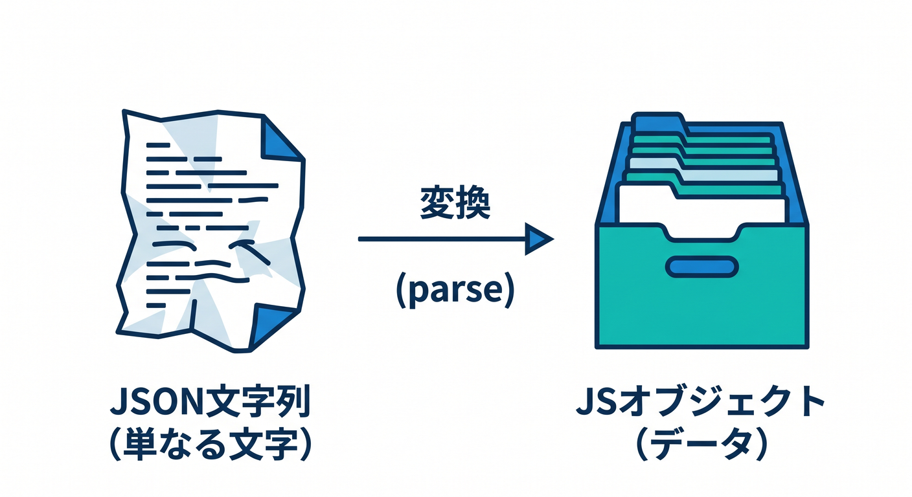
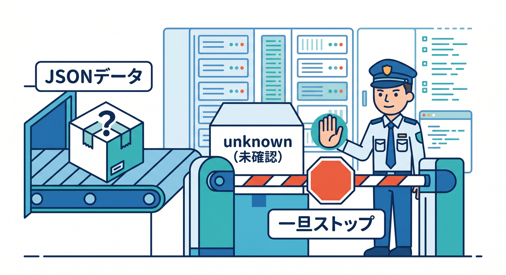
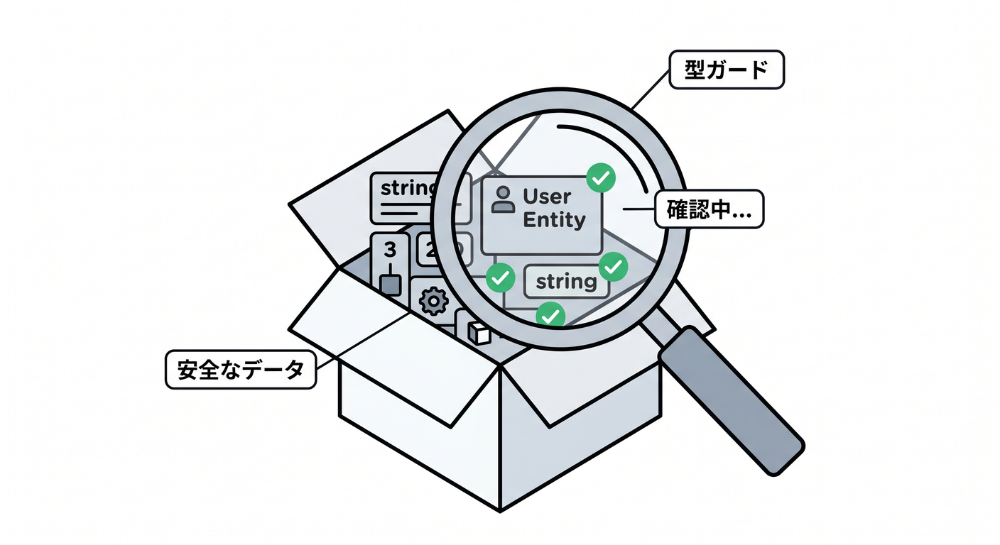
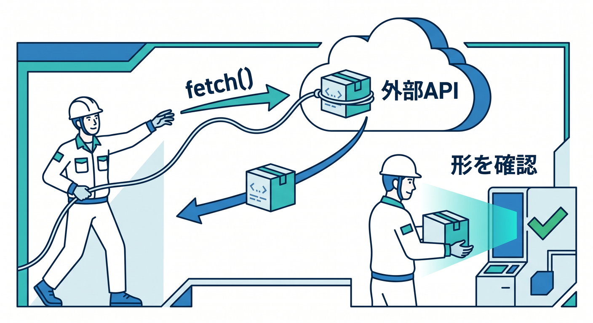
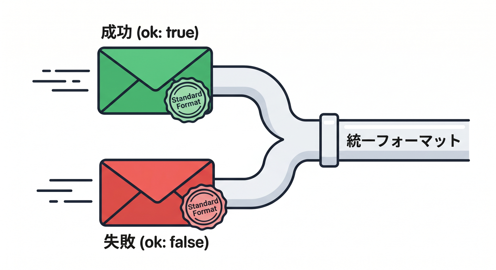
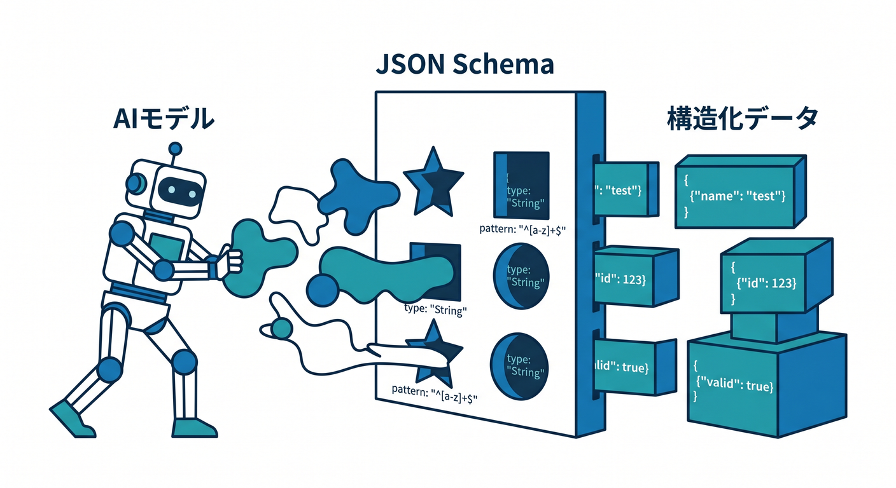

# 第05章：JSONを怖がらない！APIのデータを安全に読もう 🔎📨

この章では、Cloudflare開発で何度も出てくる **JSONの受け取り・確認・返却** を、やさしく実務っぽく身につけます😊
Workers では受信した `Request` も、外へ投げる `fetch()` の返り値 `Response` も Fetch API ベースで、`json()` や `text()` を使って本文を読みます。外部API連携も基本は `fetch()` です。さらに Workers AI には **JSON Mode** があり、AIの返答も JSON Schema に寄せて受け取れます。つまり JSON を安全に読む力は、**Worker API・外部API・AI連携** をまとめて支える土台です。 ([Cloudflare Docs][1])

Cloudflare の最新公式では、Workers は TypeScript を第一級で扱い、API も型付きです。加えて、`Env` や runtime の型は `wrangler types` で生成する流れが強く推されています。Wrangler の設定ファイルも、現在は JSON / TOML の両方に対応しつつ、**新規プロジェクトでは `wrangler.jsonc` 推奨** です。JSONに慣れる章として、この流れとも相性がとてもいいです✨ ([Cloudflare Docs][2])

---

## この章のゴール 🎯

この章を終えるころには、こんなことができるようになるのが目標です。

* JSON文字列とJavaScriptオブジェクトの違いが分かる 😊
* `request.json()` を読んだあと、**いきなり信用しない** 習慣がつく 🛡️
* `unknown` と簡単な型ガードで、最低限安全に扱える 👀
* 外部APIのJSONを受け取るときも、同じ考え方で読める 🌍
* Workers AI の返答も、**できるだけ JSON で固定して扱う** 発想が持てる 🤖

---

## 1. まずは「JSONって何者？」を整理しよう 🧩



JSON は、ざっくり言うと **データをやり取りするための書き方** です。
ただし、学習の最初で混ざりやすいのが次の2つです。

* JSON文字列
  例: `"{"name":"Aki","age":20}"`
* JavaScript / TypeScript のオブジェクト
  例: `{ name: "Aki", age: 20 }`

Workers では、`Request` や `Response` の本文はまず「中身」です。そこから `json()` を呼ぶと、本文を JSON として読んでくれます。Cloudflare の Request / Response ドキュメントでも、どちらも Body 系メソッドとして `json()`・`text()`・`formData()` などを持つ形で案内されています。 ([Cloudflare Docs][1])

ここで大事なのはひとつだけです👇

**`json()` で読めた = 自分が期待した形だ、ではない** 😌

たとえば、あなたはこういうデータを期待しているかもしれません。

```ts
type UserInput = {
  name: string;
  age: number;
};
```

でも、実際に飛んでくるJSONはこんなことがあります。

* `age` が文字列 `"20"` になっている 😵
* `name` が無い 😵
* 全体が配列になっている 😵
* そもそも壊れたJSONで parse できない 😵

だからこの章では、**読む → 形を見る → 使う** の順番を徹底します 💪

---

## 2. `any` で受けない。まずは `unknown` で受ける ✋🧠



この章のいちばん大事な癖はここです。

JSONを読んだ直後の値は、まず **`unknown` として受ける** のがおすすめです。

```ts
const body: unknown = await request.json();
```

こうしておくと、TypeScript が
「その値、本当に `name` を持ってるの？」
「その `age`、本当に number なの？」
と止めてくれます 👍

逆に `any` にしてしまうと、雑に `body.name.toUpperCase()` のようなことを書けてしまい、実行時に落ちやすくなります💥

この章では、`unknown` を **“まだ正体不明の荷物”** みたいに扱います📦
箱を開ける前に、中身確認をするイメージです。

---

## 3. いちばん基本の形：受け取ったJSONを安全に確認する Worker 📬✨

まずは、ブラウザや React 側から POST された JSON を読む Worker を作ってみます。

想定したい入力はこれです。

```ts
type CreateProfileInput = {
  name: string;
  age: number;
  bio?: string;
};
```

そして、実際の Worker ではこう書きます。

```ts
type JsonRecord = Record<string, unknown>;

function isJsonRecord(value: unknown): value is JsonRecord {
  return typeof value === "object" && value !== null && !Array.isArray(value);
}

type CreateProfileInput = {
  name: string;
  age: number;
  bio?: string;
};

function isCreateProfileInput(value: unknown): value is CreateProfileInput {
  if (!isJsonRecord(value)) return false;
  if (typeof value.name !== "string") return false;
  if (typeof value.age !== "number") return false;

  if ("bio" in value && value.bio !== undefined && typeof value.bio !== "string") {
    return false;
  }

  return true;
}

export default {
  async fetch(request: Request): Promise<Response> {
    if (request.method !== "POST") {
      return Response.json(
        { ok: false, error: "POSTで送ってください" },
        { status: 405 },
      );
    }

    let body: unknown;

    try {
      body = await request.json();
    } catch {
      return Response.json(
        { ok: false, error: "JSONの形式が壊れています" },
        { status: 400 },
      );
    }

    if (!isCreateProfileInput(body)) {
      return Response.json(
        { ok: false, error: "name(string), age(number), bio?(string) が必要です" },
        { status: 400 },
      );
    }

    const profile = {
      name: body.name.trim(),
      age: body.age,
      bio: body.bio ?? "",
      createdAt: new Date().toISOString(),
    };

    return Response.json(
      { ok: true, profile },
      { status: 201 },
    );
  },
} satisfies ExportedHandler;
```

このコードの流れは、かなり大事です 🌟

1. まず HTTPメソッドを確認する
2. `request.json()` を読む
3. 壊れたJSONなら `400` を返す
4. 形が違うなら `400` を返す
5. 形が合ってから初めて値を使う

Cloudflare の Request ドキュメントでは `request.json()` が本文を JSON として読むメソッドとして案内され、Response 側も `json()` を持ちます。また最新の Best Practices では `Response.json(...)` を使った明示的なレスポンス作成や、構造化された扱いが多くの例で示されています。 ([Cloudflare Docs][1])

---

## 4. 「型ガード」って、要するに何？ 🔍



さっきの `isCreateProfileInput()` が、いわゆる **型ガード** です。

難しく考えなくて大丈夫です🙆
やっていることは、

* オブジェクトか？
* `name` は文字列か？
* `age` は数値か？
* `bio` があるなら文字列か？

を、手で順番に見ているだけです。

最初はこれで十分です。
むしろ最初のうちは、**すごい便利ライブラリより、手で確認する感覚** を持つほうが強いです💪

---

## 5. `request.json<T>()` は便利。でも「保証」だと思いすぎない 🙋‍♂️

Cloudflare の TypeScript 例では、`request.json<{ seatId: string; userId: string }>()` のように、型引数つきで読む書き方も登場します。これは補完や読みやすさの面でかなり便利です。 ([Cloudflare Docs][3])

たとえば、こんな書き方です。

```ts
const body = await request.json<CreateProfileInput>();
```

これは **エディタ上では気持ちよく書ける** ので、あとからコードを読むときにも助かります✨

でも、この章では次の考え方をおすすめします。

**`request.json<T>()` は「こういう形だと私は思っている」という宣言。
本当にその形かどうかの確認は、別でやる。**

つまり、教材としてはこうです👇

* 小さなサンプルでは `request.json<T>()` を使ってもOK
* でも、入力境界では **実行時チェック** を残す
* とくにフォーム入力・外部API・AI返答は油断しない

この癖がつくと、第9章のフォーム保護や、第10章の保存処理でもかなり効いてきます😊

---

## 6. 外部APIのJSONも、まったく同じ考え方で読む 🌍📡



Cloudflare の公式でも、サードパーティAPI連携は `fetch()` を使い、`response.json()` でデータを読む流れが基本です。Tips として Cache API の活用も案内されています。 ([Cloudflare Docs][4])

でも、ここでも大事なのは
**外から来たJSONは、やっぱりそのまま信用しない**
です。

例を見てみましょう。

```ts
type WeatherInfo = {
  city: string;
  tempC: number;
  summary: string;
};

function isJsonRecord(value: unknown): value is Record<string, unknown> {
  return typeof value === "object" && value !== null && !Array.isArray(value);
}

function isWeatherInfo(value: unknown): value is WeatherInfo {
  if (!isJsonRecord(value)) return false;
  return (
    typeof value.city === "string" &&
    typeof value.tempC === "number" &&
    typeof value.summary === "string"
  );
}

async function getWeather(city: string): Promise<WeatherInfo | null> {
  const response = await fetch(
    `https://api.example.com/weather?city=${encodeURIComponent(city)}`,
    {
      headers: {
        "Accept": "application/json",
      },
    },
  );

  if (!response.ok) {
    return null;
  }

  let raw: unknown;

  try {
    raw = await response.json();
  } catch {
    return null;
  }

  if (!isWeatherInfo(raw)) {
    return null;
  }

  return raw;
}
```

ここでも流れは同じですね 😊

* `response.ok` を確認
* `response.json()` を読む
* `unknown` として受ける
* 必要なプロパティを確認する
* 合格したら使う

この形にしておくと、APIがちょっと壊れても、アプリ全体が巻き添えで落ちにくくなります🛡️

---

## 7. ここで一歩進める：返すJSONも「形」をそろえよう 📤✨



受け取るJSONだけでなく、**返すJSONの形をそろえる** のもすごく大事です。

おすすめは、レスポンスの基本形をそろえることです。

```ts
type OkResponse<T> = {
  ok: true;
  data: T;
};

type ErrorResponse = {
  ok: false;
  error: string;
};

type ApiResponse<T> = OkResponse<T> | ErrorResponse;
```

たとえばこんな返し方です。

```ts
function success<T>(data: T, status = 200): Response {
  const body: OkResponse<T> = { ok: true, data };
  return Response.json(body, { status });
}

function failure(message: string, status = 400): Response {
  const body: ErrorResponse = { ok: false, error: message };
  return Response.json(body, { status });
}
```

こうしておくと React 側でも扱いやすくなります ⚛️
`if (!result.ok)` で分岐しやすいからです。

---

## 8. Cloudflareらしい最新ポイント：`wrangler types` を早めに習慣化しよう 🧠⚙️

最新の Cloudflare 公式では、Workers の型は `wrangler types` で生成するのが基本導線です。TypeScript ページでも Best Practices でも、**`Env` を手書きしないこと**、binding を追加・変更したら `wrangler types` を再実行することが勧められています。 ([Cloudflare Docs][2])

なので、この章の時点で軽く覚えておくと後が楽です✨

```bash
npx wrangler types
```

AI binding や KV、D1、R2 を足したあとに型生成しておくと、

* `env.AI`
* `env.MY_KV`
* `env.DB`

みたいな binding が補完されやすくなります。
JSONを扱う章だけど、**JSONを安全に触る環境づくり** まで意識するとかなり強いです💪

---

## 9. AIでもJSONを雑に扱わない。Workers AIの JSON Mode を使おう 🤖🧾



ここ、2026年っぽくてかなり大事です✨

Cloudflare の Workers AI では、Worker に AI binding をつけて `env.AI.run()` でモデルを呼べます。さらに JSON Mode では、`response_format` に `json_object` / `json_schema` を指定でき、`json_schema` には有効な JSON Schema を渡せます。 ([Cloudflare Docs][5])

AI binding の設定はこんな感じです。

```jsonc
{
  "ai": {
    "binding": "AI"
  }
}
```

そして、binding を変えたら `wrangler types` を走らせるのが最新のおすすめです。AI Gateway の binding ドキュメントでも、その流れが明示されています。 ([Cloudflare Docs][6])

では、問い合わせ文を AI に分類させる例を書いてみます。

```ts
type TicketInput = {
  message: string;
};

type TicketDecision = {
  category: "bug" | "question" | "feedback";
  urgency: "low" | "medium" | "high";
  needsReply: boolean;
  shortReply: string;
};

function isJsonRecord(value: unknown): value is Record<string, unknown> {
  return typeof value === "object" && value !== null && !Array.isArray(value);
}

function isTicketInput(value: unknown): value is TicketInput {
  return isJsonRecord(value) && typeof value.message === "string";
}

function isTicketDecision(value: unknown): value is TicketDecision {
  if (!isJsonRecord(value)) return false;

  const categoryOk =
    value.category === "bug" ||
    value.category === "question" ||
    value.category === "feedback";

  const urgencyOk =
    value.urgency === "low" ||
    value.urgency === "medium" ||
    value.urgency === "high";

  return (
    categoryOk &&
    urgencyOk &&
    typeof value.needsReply === "boolean" &&
    typeof value.shortReply === "string"
  );
}

export default {
  async fetch(request: Request, env: Env): Promise<Response> {
    let body: unknown;

    try {
      body = await request.json();
    } catch {
      return Response.json(
        { ok: false, error: "JSONの形式が壊れています" },
        { status: 400 },
      );
    }

    if (!isTicketInput(body)) {
      return Response.json(
        { ok: false, error: "message(string) が必要です" },
        { status: 400 },
      );
    }

    const aiRaw: unknown = await env.AI.run("@cf/moonshotai/kimi-k2.5", {
      messages: [
        {
          role: "system",
          content:
            "ユーザー文を分類してください。必ず schema に従う JSON だけを返してください。",
        },
        {
          role: "user",
          content: body.message,
        },
      ],
      response_format: {
        type: "json_schema",
        json_schema: {
          type: "object",
          properties: {
            category: {
              type: "string",
              enum: ["bug", "question", "feedback"],
            },
            urgency: {
              type: "string",
              enum: ["low", "medium", "high"],
            },
            needsReply: {
              type: "boolean",
            },
            shortReply: {
              type: "string",
            },
          },
          required: ["category", "urgency", "needsReply", "shortReply"],
          additionalProperties: false,
        },
      },
    });

    if (!isTicketDecision(aiRaw)) {
      return Response.json(
        { ok: false, error: "AIの返答形式が想定外でした" },
        { status: 502 },
      );
    }

    return Response.json({ ok: true, result: aiRaw });
  },
} satisfies ExportedHandler<Env>;
```

ここで大事なのは、**AIにJSONで返させても、最後にもう一度こちらで形を見る** ことです 👀
JSON Mode はかなり便利ですが、実務では「AIも外部入力の一種」と考えると安定します。

なお、現行の Cloudflare AI 関連ドキュメントでは、`env.AI.run()` による呼び出しや、`@cf/moonshotai/kimi-k2.5` のようなモデル利用例、structured outputs を持つモデル案内も確認できます。 ([Cloudflare Docs][6])

---

## 10. JSONログの発想も、早めに持っておくと強い 📘🪵

最新の Workers Best Practices では、文字列ベタ書きのログより、**構造化された JSON ログ** が検索・絞り込みしやすい形として示されています。 ([Cloudflare Docs][7])

たとえばこんな感じです。

```ts
console.log(
  JSON.stringify({
    message: "incoming request",
    method: request.method,
    path: new URL(request.url).pathname,
  }),
);
```

この章では軽く触れるだけでOKですが、
「データを返すだけでなく、ログも JSON に寄せると後で助かる」
という感覚を持っておくと、第14章の Logs や運用にもつながります📈

---

## 11. Copilot をどう使うと、この章と相性がいい？ 🤝✨

GitHub 公式では、VS Code 上の Copilot Chat から GitHub MCP Server を使える流れが案内されています。さらに Cloudflare 側も、`cloudflare-docs` MCP サーバーや `cloudflare-observability` MCP サーバーを agent に接続する使い方を公式に案内しています。 ([GitHub Docs][8])

この章で相性がいい頼み方は、たとえばこんな感じです👇

* 「この JSON の shape から TypeScript の型を作って」 ✍️
* 「この型に対応する型ガード関数を書いて」 🛡️
* 「この Worker のエラーレスポンスを統一して」 🧹
* 「この JSON Schema から `type` を起こして」 🤖
* 「AI の返答を検証する関数を追加して」 🔍

つまり Copilot は、**JSONそのものを理解する先生** というより、
**型・ガード・整形を一緒に書く相棒** として使うとかなり強いです😊

---

## 12. この章のハンズオン課題 🧪🎉

### 課題1：プロフィール受付APIを完成させよう

次の入力を受け取る Worker を作ってみましょう。

```json
{
  "name": "Komiyanma",
  "age": 22,
  "favoriteCastle": "姫路城"
}
```

条件はこの3つです。

* `name` は文字列
* `age` は数値
* `favoriteCastle` は文字列

不正なら `400`、成功なら `201` を返しましょう✨

### 課題2：外部APIの結果を整形しよう

外部APIから受け取った JSON のうち、必要な項目だけに絞って返す関数を書いてみましょう。
「全部そのまま返す」のではなく、**自分のアプリに必要な形へ変換する** のがポイントです🎯

### 課題3：AIに分類させてJSONで返させよう

ユーザーの文章を

* `praise`
* `question`
* `complaint`

の3分類にして、`response_format` + `json_schema` 付きで返させる Worker を書いてみましょう 🤖

---

## 13. よくあるつまずきポイント 😵‍💫

### つまずき1：`request.json()` のあとすぐ `body.name` を触る

→ まだ本当にその形か分からないです。
**まず `unknown`、次に確認** が基本です。

### つまずき2：`age: "20"` を number だと思い込む

→ JSONでは文字列と数値は別物です。
フォームから来る値は、とくに文字列混入に注意です。

### つまずき3：外部APIのレスポンスを全部信用する

→ 仕様変更や不具合は普通に起きます。
`response.ok` と shape チェックは入れておくと安心です。

### つまずき4：AIが返したJSONをそのままDBへ入れる

→ 便利そうに見えて危険です⚠️
**schema で寄せる → こちらでも確認する** の二段構えが安定です。Workers AI の JSON Mode は structured output を作りやすくしますが、アプリ側の扱いまで自動保証してくれるわけではない、と考えておくと安全です。 ([Cloudflare Docs][9])

---

## 14. まとめ 🌈

この章でいちばん大事なのは、次の一言です。

**JSONは“読めたら終わり”ではなく、“形を確かめてから使う”もの。** 🛡️

Cloudflare の最新導線では、Workers は TypeScript と相性がよく、`wrangler types` による型生成、`fetch()` を使った外部API連携、AI binding の `env.AI.run()`、JSON Schema ベースの JSON Mode まで、**JSONを中心に全部つながる** 形になっています。 ([Cloudflare Docs][2])

なので第5章の到達点は、ただの文法理解ではありません😊

* 雑に `any` へ逃げない
* `unknown` から入る
* 小さく shape を確認する
* 返すJSONの形もそろえる
* AIの返答も JSON で寄せる

ここまで身につけば、第6章の `Request` / `Response` 体験がかなりラクになります🚀
次の章では、いよいよ Worker 本体の流れに入っていけます✨

必要ならこのまま続けて、**第5章の「練習問題の模範解答つき完全版」** まで作れます。

[1]: https://developers.cloudflare.com/workers/runtime-apis/request/ "Request · Cloudflare Workers docs"
[2]: https://developers.cloudflare.com/workers/languages/typescript/ "Write Cloudflare Workers in TypeScript · Cloudflare Workers docs"
[3]: https://developers.cloudflare.com/durable-objects/best-practices/rules-of-durable-objects/ "Rules of Durable Objects · Cloudflare Durable Objects docs"
[4]: https://developers.cloudflare.com/workers/configuration/integrations/apis/ "APIs · Cloudflare Workers docs"
[5]: https://developers.cloudflare.com/workers-ai/configuration/bindings/ "Workers Bindings · Cloudflare Workers AI docs"
[6]: https://developers.cloudflare.com/ai-gateway/integrations/worker-binding-methods/ "Workers Bindings · Cloudflare AI Gateway docs"
[7]: https://developers.cloudflare.com/workers/best-practices/workers-best-practices/ "Workers Best Practices · Cloudflare Workers docs"
[8]: https://docs.github.com/en/copilot/how-tos/provide-context/use-mcp-in-your-ide/use-the-github-mcp-server "Using the GitHub MCP Server in your IDE - GitHub Docs"
[9]: https://developers.cloudflare.com/workers-ai/features/json-mode/ "JSON Mode · Cloudflare Workers AI docs"