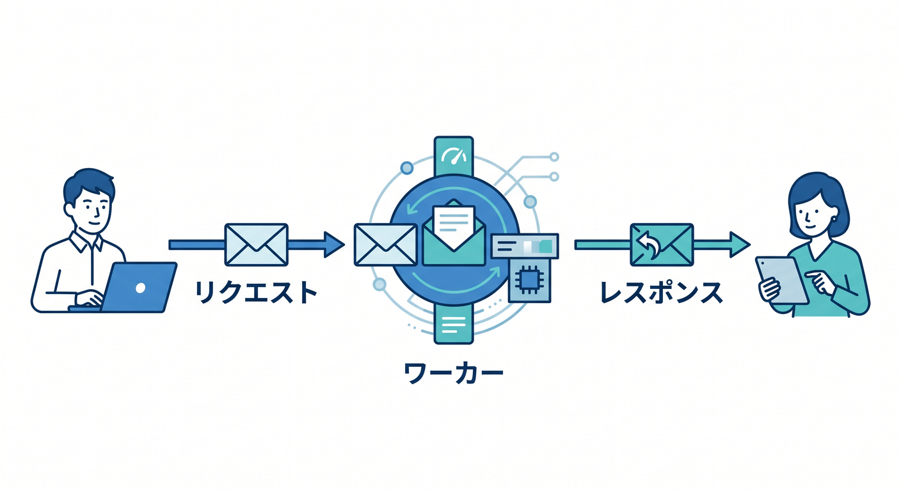
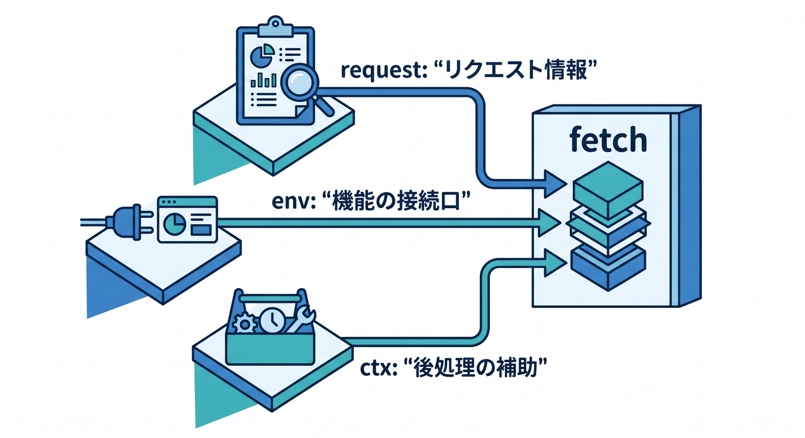
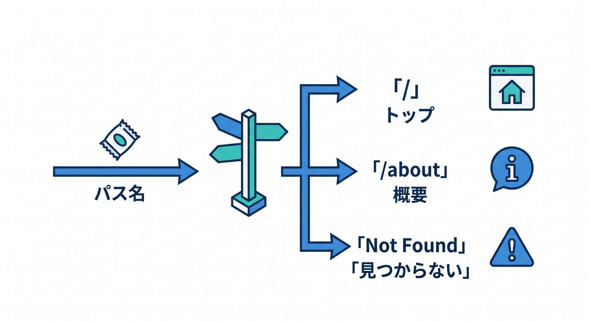
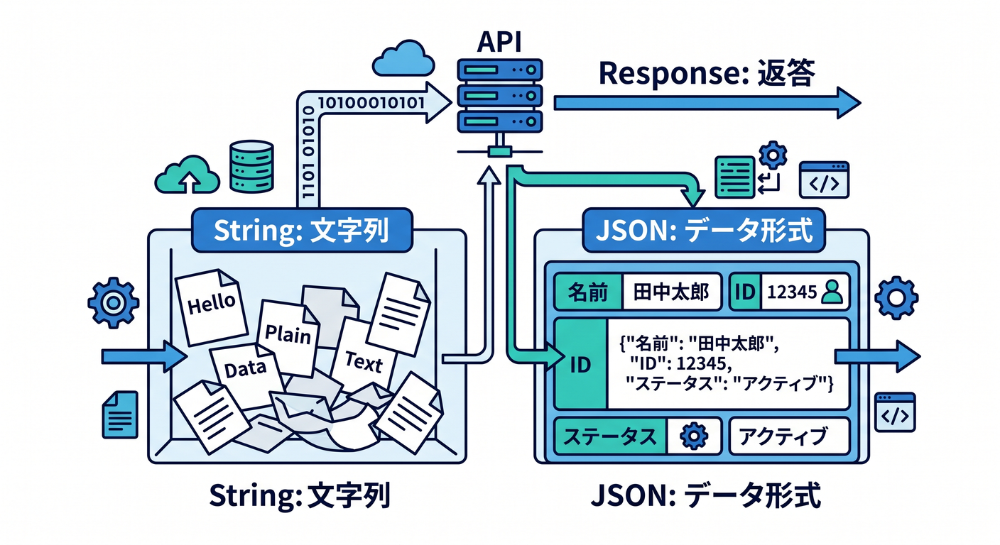

# 第06章：いよいよWorker！RequestとResponseの基本をやさしく体験しよう 🚀📬

この章では、Cloudflare Workers のど真ん中である `fetch(request, env, ctx)` を、できるだけやさしくつかみます 😊
Workers は Cloudflare のグローバルネットワーク上でアプリを作って動かすためのサーバーレス基盤で、実行時は Web 標準寄りの API を強く採用しています。つまり、いきなり「Cloudflare独自の何か」を大量に覚えるより、まずは `Request` と `Response` を読めるようになるのが最短コースです。 ([Cloudflare Docs][1])

---

## この章でできるようになること 🎯

この章のゴールは、次の3つです。

1. ブラウザや `curl` から来たリクエストを Worker で受け取れる
2. 文字列や JSON をレスポンスとして返せる
3. URL やメソッド、送信データを見て、返事を変えられる

ここができると、「Cloudflare 上で API を1本書けた！」という手応えが出ます ✨
次章以降の bindings、React連携、Workers AI にもスムーズにつながります。`fetch()` ハンドラには `request`、`env`、`ctx` が入り、返り値は `Response` です。これが Workers の基本形です。 ([Cloudflare Docs][2])

---

## 1. Worker は何をしているの？ ☁️📨➡️📬

まず感覚的にいうと、Worker は「届いた HTTP リクエストを見て、HTTP レスポンスを返す小さなプログラム」です。

Cloudflare Docs でも、受信した HTTP リクエストは `fetch()` ハンドラに `Request` オブジェクトとして渡され、返す側は `Response` オブジェクトを返す、という形で説明されています。 ([Cloudflare Docs][2])

たとえば、ブラウザでページを開く、フォームを送る、JavaScript で `fetch()` する、こうした操作は全部 HTTP リクエストです。
Worker はその「お願い」を受け取って、「はい、これが返事です」と `Response` を返します。文字列を返してもいいし、JSON を返してもいいし、後で画像や AI の結果を返すこともできます。Workers はバックエンド API も、静的配信も、AI 呼び出しも同じ土台で扱えます。 ([Cloudflare Docs][1])

---

## 2. `fetch(request, env, ctx)` を3つに分けて理解しよう 🧩

Workers の基本形はこれです。


```
export default {
  async fetch(request, env, ctx) {
    return new Response("Hello World!");
  },
};
```

これは公式の基本形そのものです。`request` は受信した HTTP リクエスト、`env` は binding 群、`ctx` は Worker のライフサイクル管理用です。`ctx.waitUntil()` や `ctx.passThroughOnException()` もここから使えます。 ([Cloudflare Docs][2])

この章では、まず `request` と `Response` に集中すれば十分です 🙆
`env` は「KV や D1 や AI などの接続口」、`ctx` は「返事を返した後にも少し仕事を続ける仕組み」くらいの理解で OK です。`ctx.waitUntil()` はレスポンスを返すのを待たずに非同期処理を続けられる仕組みとして公式に説明されています。 ([Cloudflare Docs][3])

---

## 3. まずは最小の Hello Worker を動かそう 🌱

すでに前章まででプロジェクトがある前提なら、まずは `src/index.ts` などの Worker 本体をこうしてみましょう。

```
export default {
  async fetch(request: Request): Promise<Response> {
    return new Response("こんにちは、Cloudflare Workers！🎉", {
      headers: {
        "content-type": "text/plain; charset=UTF-8",
      },
      status: 200,
    });
  },
};
```

`Response` コンストラクタには本文と設定オブジェクトを渡せます。設定側には `status` や `headers` を入れられます。Cloudflare の `Response` は Fetch API ベースで、本文・ヘッダー・ステータスを組み立てる基本は Web 標準の感覚で扱えます。 ([Cloudflare Docs][4])

ローカル確認は `wrangler dev` が基本です。Cloudflare 公式の CLI ガイドでも、Worker 作成後は `npx wrangler dev` でローカルサーバーを立てて開発する流れが案内されています。 ([Cloudflare Docs][5])

```
npx wrangler dev
```

これでブラウザを開いてアクセスすると、文字列レスポンスが見えます。
ここで大事なのは、「自分でサーバーっぽい返事を返せた！」という成功体験です 😊 ([Cloudflare Docs][5])

---

## 4. `Request` は“届いた手紙”だと思えばOK 💌

`Request` は HTTP リクエストそのものです。Cloudflare Docs でも、`Request` は Fetch API の一部であり、もっともよく出会うのは `fetch()` ハンドラの引数としてだと説明されています。さらに、受け取った `request` は immutable、つまりそのまま書き換えられない扱いです。変更したいときは `new Request(...)` で作り直します。 ([Cloudflare Docs][6])

初心者のうちは、まず次の3つを見れば十分です ✨

* URL はどこに来たか
* メソッドは `GET` か `POST` か
* body に何が入っているか

Cloudflare Workers の `Request` では、メソッドや body を扱えますし、`json()` や `text()` で本文を読み取れます。GET / HEAD では body を持てない点も公式に明記されています。 ([Cloudflare Docs][6])

---

## 5. URL を見て返事を変えてみよう 🛣️

実際の Worker は、「どの URL に来たか」で処理を分けることが多いです。

そのため、`request.url` を `new URL()` に入れて pathname を見る書き方に慣れるのがとても大切です。Workers は Web 標準寄り runtime なので、こういう URL 処理もブラウザ寄りの感覚で書けます。 ([Cloudflare Docs][7])

```
export default {
  async fetch(request: Request): Promise<Response> {
    const url = new URL(request.url);

    if (url.pathname === "/") {
      return new Response("トップページです 🏠");
    }

    if (url.pathname === "/about") {
      return new Response("これは about ページです 📘");
    }

    return new Response("Not Found", { status: 404 });
  },
};
```

この時点で、もう「ルーティングの入口」を体験しています。
フレームワークなしでも、URL を見て条件分岐すれば API や簡単なページ返却は普通に作れます。バックエンドアプリを Workers で作れる、という Cloudflare の説明ともきれいにつながります。 ([Cloudflare Docs][1])

---

## 6. JSON を返すと、いよいよ API っぽくなる 📦✨

文字列を返すだけでも Worker ですが、JSON を返すと一気に API 感が出ます。

`Response` はヘッダーを付けられるので、`content-type: application/json` を付けて、`JSON.stringify()` したデータを返します。 `Response` の設定オブジェクトにヘッダーやステータスを入れられるのは公式仕様どおりです。 ([Cloudflare Docs][4])

```
type MessageResponse = {
  message: string;
  time: string;
};

export default {
  async fetch(request: Request): Promise<Response> {
    const data: MessageResponse = {
      message: "こんにちは！これは JSON API です ✨",
      time: new Date().toISOString(),
    };

    return new Response(JSON.stringify(data), {
      headers: {
        "content-type": "application/json; charset=UTF-8",
      },
      status: 200,
    });
  },
};
```

この書き方に慣れると、次章以降で React から `fetch()` して画面表示する流れがすごく楽になります。
Cloudflare Workers は full-stack アプリや API の土台として案内されていて、ここで作っているのはまさにその最小形です。 ([Cloudflare Docs][1])

---

## 7. クエリ文字列も見てみよう 🔍

URL には `?name=komiyanma` のようなクエリ文字列を載せられます。
これを使うと、同じ URL でも少しだけ返事を変えられます。HTTP リクエストは URL を含む `Request` として Worker に渡されるので、`request.url` を読むだけで対応できます。 ([Cloudflare Docs][6])

```
export default {
  async fetch(request: Request): Promise<Response> {
    const url = new URL(request.url);
    const name = url.searchParams.get("name") ?? "ゲスト";

    return new Response(
      JSON.stringify({
        message: `こんにちは、${name} さん 👋`,
      }),
      {
        headers: {
          "content-type": "application/json; charset=UTF-8",
        },
      }
    );
  },
};
```

これは小さいですが、とても重要な一歩です。
「URL を受け取って、内容を見て、返す内容を変える」という、API の基本の基本がここに詰まっています 😊

---

## 8. `POST` を受け取って、送られてきた JSON を読む 📨

次は受け取る側です。`Request` には `json()` と `text()` などのメソッドがあり、本文を読み取れます。Cloudflare Docs でも `request.json()` は JSON 表現を返し、`request.text()` は文字列を返すと説明されています。 ([Cloudflare Docs][6])

```
type InputData = {
  name?: string;
};

type OutputData = {
  ok: boolean;
  message: string;
};

export default {
  async fetch(request: Request): Promise<Response> {
    if (request.method !== "POST") {
      return new Response("Method Not Allowed", { status: 405 });
    }

    const body = (await request.json()) as InputData;
    const name = body.name?.trim() || "ゲスト";

    const result: OutputData = {
      ok: true,
      message: `${name} さん、POST ありがとう！🎉`,
    };

    return new Response(JSON.stringify(result), {
      headers: {
        "content-type": "application/json; charset=UTF-8",
      },
    });
  },
};
```

ここでの学びは2つあります。
1つ目は、`GET` と `POST` を分けること。2つ目は、受け取った JSON をそのまま盲信しないことです。Cloudflare Workers の `Request` は HTTP メソッドや body を扱え、GET / HEAD に body は持てません。そういう HTTP の基本を守るだけでもコードがかなり整います。 ([Cloudflare Docs][6])

---

## 9. `request` は書き換えず、必要なら作り直す 🛠️

Cloudflare Docs では、`fetch()` ハンドラに入ってきた `request` は immutable なので、変更したいときは新しい `Request` を作るよう案内されています。これは後で外部 API へ転送したり、ヘッダーを書き換えて再利用したりするときに効いてきます。 ([Cloudflare Docs][6])

たとえば「URL だけ差し替えて転送したい」なら、こんな雰囲気です。

```
export default {
  async fetch(request: Request): Promise<Response> {
    const newRequest = new Request("https://example.com/api", request);
    const response = await fetch(newRequest);
    return response;
  },
};
```

この発想はかなり大事です。
「元の request をいじる」のではなく、「新しい request を組み立てる」。この感覚に早めに慣れると、プロキシ・外部API連携・認証ヘッダー付け替えが理解しやすくなります。非同期の `fetch()` は request context の中で実行する必要がある点も、Cloudflare は明記しています。 ([Cloudflare Docs][6])

---

## 10. `ctx` は今は“あとで仕事する係”くらいでOK ⏳

この章では深追いしませんが、`ctx` は無視していい飾りではありません。
Cloudflare Docs によると `ctx.waitUntil()` は、レスポンス返却をブロックせずに、返却後も Promise を実行し続けられる仕組みです。ログ送信やキャッシュ保存などでよく使われます。 ([Cloudflare Docs][3])

つまり、今はこう覚えれば十分です。

* `request` = お客さんから届いた内容
* `env` = Cloudflare の機能へつなぐ接続口
* `ctx` = 返事のあとに続ける仕事の補助

この3つがそろって、Worker は本格的なアプリになります 😊 ([Cloudflare Docs][2])

---

## 11. ミニ発展：Workers AI を“返事の中身”に使う入口 🤖✨

この章の主役は Request / Response ですが、Cloudflare らしさを先に少し味見しておきましょう。

Workers AI は Cloudflare のグローバルネットワーク上でサーバーレスに AI モデルを実行でき、Workers から binding 経由で呼べます。Cloudflare 公式では、Workers AI は Workers・Pages・API から呼べると説明されています。 ([Cloudflare Docs][8])

binding は Wrangler 設定に追加します。公式の binding 例では `ai.binding = "AI"` と設定し、Worker 側から `env.AI` で使います。 ([Cloudflare Docs][9])

```
{
  "ai": {
    "binding": "AI"
  }
}
```

そのうえで Worker の中では、こんな感じで AI を呼べます。

```
type Env = {
  AI: Ai;
};

export default {
  async fetch(request: Request, env: Env): Promise<Response> {
    const result = await env.AI.run("@cf/meta/llama-3.1-8b-instruct", {
      prompt: "Cloudflare Workers を 1 行で説明して",
    });

    return new Response(JSON.stringify(result), {
      headers: {
        "content-type": "application/json; charset=UTF-8",
      },
    });
  },
};
```

`env.AI.run()` でモデル名と入力を渡して結果を受け取り、その結果を `Response` で返す。
つまり、AI API ですら「Request を受ける → AI を呼ぶ → Response を返す」という第6章の型にきれいに乗ります。これが見えると、後の第12章がかなり楽になります 🌈 ([Cloudflare Docs][9])

---

## 12. Copilot をこの章でどう使うと強い？ 🧠💬

2026年時点では、GitHub Copilot は MCP を通して外部の文脈やツールを IDE に持ち込めます。GitHub Docs では、MCP は Copilot を他のシステムとつなげるための仕組みで、IDE・Copilot CLI・GitHub.com 上の agent など主要な Copilot surface で使えると説明されています。 ([GitHub Docs][10])

さらに Cloudflare 自身も、Workers 用の docs MCP サーバーとして `https://docs.mcp.cloudflare.com/mcp`、observability 用 MCP サーバーとして `https://observability.mcp.cloudflare.com/mcp` を案内しています。GitHub Copilot Chat 側では、MCP サーバーをつないだあと、VS Code で Agent モードから使ったり、`Add Context...` → `MCP Resources` で文脈を追加したりできます。 ([Cloudflare Docs][11])

この章なら、Copilot にはたとえばこんな聞き方が相性いいです ✨

* 「この Worker の `request` と `Response` の流れを初心者向けに説明して」
* 「このコードを 404 対応つきに直して」
* 「POST の JSON 受信でバリデーションを追加して」
* 「Cloudflare docs を参照して `ctx.waitUntil` の使いどころを説明して」

“丸投げ”より、“今あるコードを説明・改善させる”使い方が特にハマります 😊

---

## 13. この章のおすすめ練習メニュー 🏋️‍♂️

ここまで来たら、次の順番で練習するとかなり身につきます。

**練習1**
`/` にアクセスしたら `"hello"` を返す Worker を作る

**練習2**
`/api/time` なら現在時刻を JSON で返す

**練習3**
`/api/greet?name=○○` なら名前つきメッセージを返す

**練習4**
`POST /api/echo` で送られた JSON をそのまま返す

**練習5**
存在しない URL は 404 を返す

この5本を作れれば、第6章としてはかなり強いです 💪
なぜなら、Request の受信、URL 判定、メソッド判定、body 読み取り、Response 返却という基本セットを全部なぞれるからです。 ([Cloudflare Docs][2])

---

## 14. 初心者がハマりやすいポイント ⚠️

**その1：JSON を返しているのにヘッダーを付けていない**
動くことはありますが、API としては `content-type` を付けたほうが親切です。`Response` ではヘッダーを設定できます。 ([Cloudflare Docs][4])

**その2：`GET` でも body を読もうとする**
公式でも GET / HEAD に body は持てないとされています。まずは `request.method` を見てから処理を分けましょう。 ([Cloudflare Docs][6])

**その3：トップレベルで勝手に `fetch()` する**
Cloudflare Docs では、非同期タスクは request context の中で動かす必要があり、ハンドラ外の不適切な場所では例外になります。 ([Cloudflare Docs][6])

**その4：受け取った JSON を全部信用する**
これは第5章の復習です。`request.json()` で読めても、型や中身が正しいとは限りません。最初は最低限のチェックを入れるクセをつけましょう 😊 ([Cloudflare Docs][6])

---

## 15. この章のまとめ 🏁

第6章で本当に覚えたいのは、たったこれだけです。

* Worker は `Request` を受け取って `Response` を返す
* 基本形は `fetch(request, env, ctx)`
* URL・メソッド・body を見れば API は作れる
* JSON を返せば API らしくなる
* Workers AI も結局はこの流れの上に乗る

Cloudflare Workers は Web 標準寄りの runtime なので、`Request` / `Response` を理解すると、その後の学習が一気に進みます。しかも Workers は API、静的配信、AI、背景処理まで同じ基盤で広げられるので、この章は小さく見えてかなり重要です。 ([Cloudflare Docs][7])

---

## 章末ミニ課題 📘✨

最後に1本、総合問題です。

**お題**
次の仕様の Worker を作ってみましょう。

* `GET /` → `"Worker 起動中です"` を文字列で返す
* `GET /api/hello?name=Taro` → `{"message":"こんにちは、Taroさん"}` を返す
* `POST /api/hello` → body の JSON を読み、`name` を使って同じ形式の JSON を返す
* それ以外 → 404

この1本が自力で書けたら、第6章はかなりいい感じです 🎉

必要ならこの続きで、そのまま**「第6章の演習問題集」版**や、**「教材としてそのまま貼れる完成原稿版」**に整えてお渡しできます。

[1]: https://developers.cloudflare.com/workers/ "Overview · Cloudflare Workers docs"
[2]: https://developers.cloudflare.com/workers/runtime-apis/handlers/fetch/ "Fetch Handler · Cloudflare Workers docs"
[3]: https://developers.cloudflare.com/workers/runtime-apis/context/ "Context (ctx) · Cloudflare Workers docs"
[4]: https://developers.cloudflare.com/workers/runtime-apis/response/ "Response · Cloudflare Workers docs"
[5]: https://developers.cloudflare.com/workers/get-started/guide/ "Get started - CLI · Cloudflare Workers docs"
[6]: https://developers.cloudflare.com/workers/runtime-apis/request/ "Request · Cloudflare Workers docs"
[7]: https://developers.cloudflare.com/workers/runtime-apis/ "Runtime APIs · Cloudflare Workers docs"
[8]: https://developers.cloudflare.com/workers-ai/ "Overview · Cloudflare Workers AI docs"
[9]: https://developers.cloudflare.com/workers-ai/configuration/bindings/ "Workers Bindings · Cloudflare Workers AI docs"
[10]: https://docs.github.com/en/copilot/concepts/context/mcp "About Model Context Protocol (MCP) - GitHub Docs"
[11]: https://developers.cloudflare.com/workers/get-started/prompting/ "Prompting · Cloudflare Workers docs"