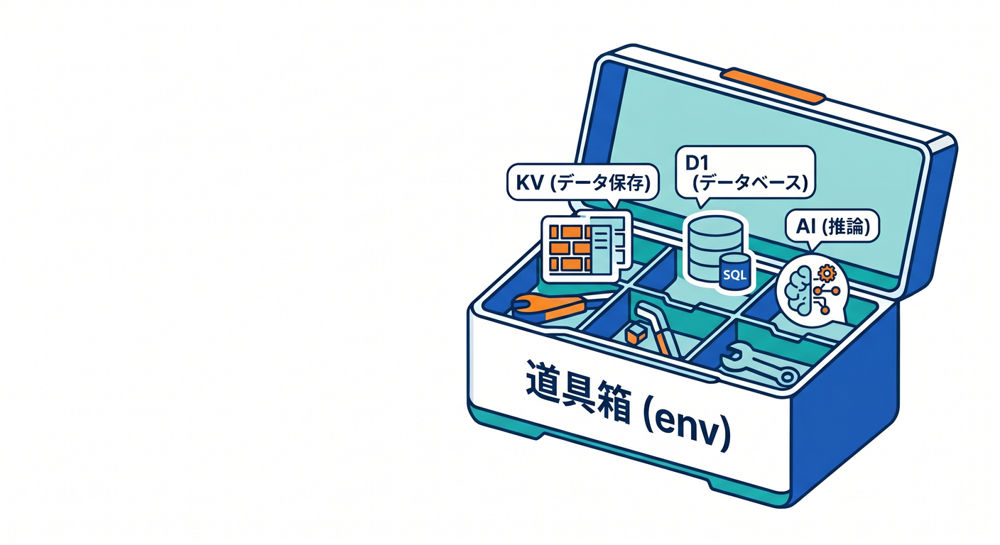
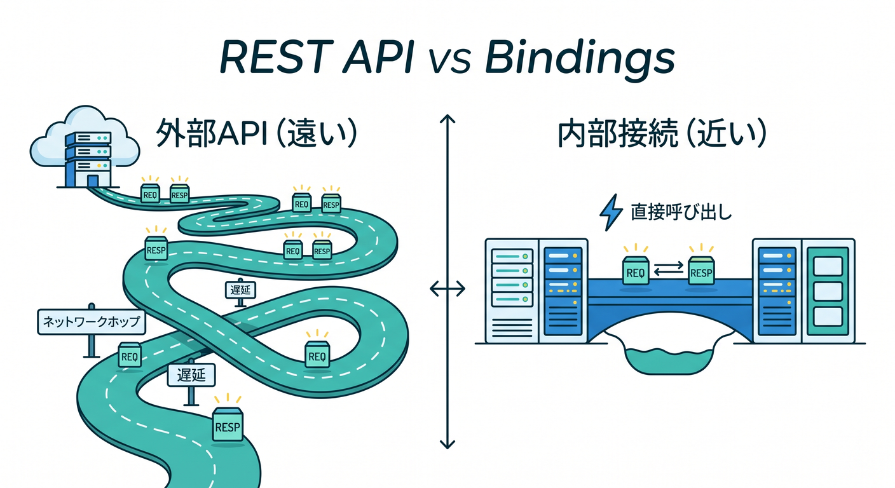
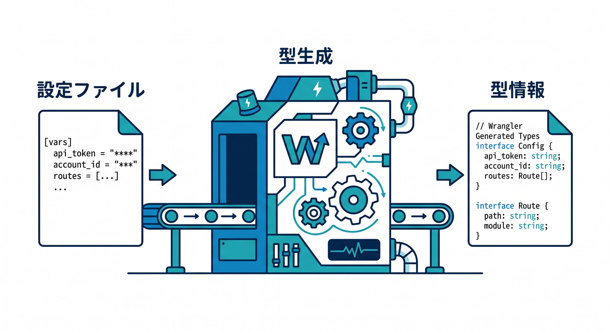
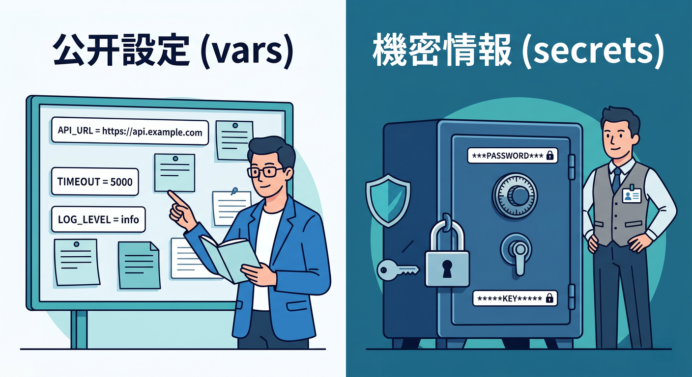
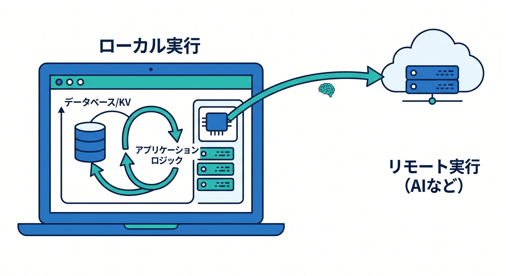

# 第07章：Env・Bindings・wrangler typesで“Cloudflareらしい型付け”を覚えよう 🔐🧩

この章では、Cloudflareでいちばん「Cloudflareっぽい」型の世界に入っていきます😊
ふつうのTypeScript入門だと、変数や関数の型だけで終わりがちです。ですがCloudflareでは、KV・D1・R2・Workers AI・Service bindings などを **`env` 経由で使う** のが大きな特徴です。そして本日時点の公式導線では、`@cloudflare/workers-types` を手で持つより、**`wrangler types` で runtime 型と `Env` 型を自動生成する** 流れが強く推されています。生成される型は `compatibility_date` や compatibility flags に合うように出力されます。 ([Cloudflare Docs][1])

---

## この章のゴール 🎯📘

この章で目指すのは、次の3つです ✨

* `env` が「Cloudflareの機能を受け取る入口」だとわかる
* bindings を `wrangler.jsonc` 側で定義し、コード側で安全に使える
* `wrangler types` を使って、**設定ファイルとコードのズレを減らす** 感覚をつかむ

ここを理解すると、次の章で React から Worker を呼ぶときも、KV や D1 を使うときも、AI を組み込むときも、かなりラクになります 🚀

---

## 7-1. まずは `env` を超ざっくりイメージしよう 🧰🌈

`env` は、Worker に渡される **道具箱** みたいなものです 😊

第6章では `request` と `response` を見ましたが、`request` が「届いた依頼」なら、`env` は「その Worker に使わせてもらえるCloudflare機能のセット」です。

たとえばこんな感じです 👇

* `env.MY_KV` → KV 名前空間
* `env.DB` → D1 データベース
* `env.FILES` → R2 バケット
* `env.AI` → Workers AI
* `env.API_HOST` → 環境変数
* `env.AUTH_SERVICE` → 別 Worker への Service binding

Cloudflare の公式ドキュメントでも、bindings は Worker が Cloudflare の各種リソースとやり取りするための仕組みで、コード上では `env` オブジェクトから触る形として説明されています。 ([Cloudflare Docs][2])

---

## 7-2. bindings って何がそんなに大事なの？ 🔗⚡

bindings は、Cloudflare のサービスを Worker から使うための **正式ルート** です。

しかも本日時点のベストプラクティスでは、**Cloudflareサービスを Worker から使うなら REST API ではなく bindings を使う** ことがはっきり勧められています。理由はシンプルで、bindings は **直接・同一プロセス的に近い形で扱える** ので、余計なネットワーク hop や認証処理、追加レイテンシがいらないからです。 ([Cloudflare Docs][3])

つまり感覚としてはこうです 💡

* 外部の天気APIを呼ぶ → `fetch()` を使う 🌍
* Cloudflare の KV / D1 / R2 / AI を使う → binding を使う ☁️

この切り分けがわかるだけで、設計がかなりスッキリします ✨

---

## 7-3. 「手で `Env` を書けばいいのでは？」に答えよう ✍️🤔

昔ながらの書き方だと、こういう `Env` を自分で書きたくなります。

```typescript
interface Env {
  API_HOST: string;
  DB: D1Database;
  AI: Ai;
}
```

もちろんこれは概念理解には役立ちます 👍
でも実務では、**設定ファイルとコードのズレ** が起こりやすいです。

たとえば……

* `wrangler.jsonc` では `binding: "DATABASE"` にしたのに、コードで `env.DB` と書いてしまう 😇
* staging だけ secret が違うのに、型は同じだと思い込む 😵
* `compatibility_date` を更新したのに、runtime の型が古いまま 😵‍💫

そこで今の公式は、**`wrangler types` で型を生成しよう** という流れです。
Cloudflare Docs では、`wrangler types` は Worker の `compatibility_date` と compatibility flags に合わせて runtime 型を生成し、さらに binding から `Env` 型も作ってくれると案内されています。なお `@cloudflare/workers-types` 自体は引き続き公開され、**ライブラリや共有パッケージの型付けには推奨** とされています。 ([Cloudflare Docs][1])

ここ、かなり大事です 🔥
**アプリ本体は `wrangler types`、共有ライブラリは `@cloudflare/workers-types` も選択肢**、この整理で覚えると混乱しにくいです。

---

## 7-4. まずは `wrangler.jsonc` で「使えるもの」を宣言しよう 🛠️📄

Cloudflare では、コードより先に **設定ファイルで binding を宣言** します。
宣言したものが `env` に出てくる、という順番です 😊

たとえばこんなイメージです。

```jsonc
{
  "$schema": "./node_modules/wrangler/config-schema.json",
  "name": "chapter7-env-demo",
  "main": "src/index.ts",
  "compatibility_date": "2026-04-17",

  "vars": {
    "APP_NAME": "Cloudflare Env Demo",
    "PUBLIC_API_BASE": "https://example.com"
  },

  "secrets": {
    "required": ["ADMIN_TOKEN"]
  },

  "kv_namespaces": [
    {
      "binding": "CACHE_KV",
      "id": "xxxxxxxxxxxxxxxxxxxxxxxxxxxxxxxx"
    }
  ],

  "d1_databases": [
    {
      "binding": "DB",
      "database_name": "chapter7-demo",
      "database_id": "xxxxxxxx-xxxx-xxxx-xxxx-xxxxxxxxxxxx"
    }
  ],

  "r2_buckets": [
    {
      "binding": "FILES",
      "bucket_name": "chapter7-files"
    }
  ],

  "ai": {
    "binding": "AI"
  }
}
```

この章では、まず「**binding 名が `env` のプロパティ名になる**」と覚えればOKです 🙆‍♂️
Cloudflare の設定例でも、KV は `kv_namespaces[].binding`、D1 は `d1_databases[].binding`、R2 は `r2_buckets[].binding`、Workers AI は `ai.binding` で指定します。AI binding は Worker コード上では `env.AI` として使います。 ([Cloudflare Docs][4])

---

## 7-5. `wrangler types` を実行して、型を自動生成しよう 🤖🧾

設定が書けたら、次は型生成です ✨


```bash
npx wrangler types
```

これで、デフォルトでは `worker-configuration.d.ts` が生成されます。
このファイルには、

* Worker runtime の型
* `Env` の型
* compatibility date / flags に合った型情報

が入ります。さらに公式では、**設定ファイルを変えたら `wrangler types` を再実行** するよう案内されています。 ([Cloudflare Docs][1])

次に `tsconfig.json` 側で、生成された型を読み込ませます。

```json
{
  "compilerOptions": {
    "types": ["./worker-configuration.d.ts"]
  }
}
```

もし `nodejs_compat` を使うなら、`@types/node` も追加するのが公式案内です。 ([Cloudflare Docs][1])

---

## 7-6. コード側では `Env` をどう使うの？ 🧠💻

いちばんわかりやすい形はこれです 👇

```typescript
export default {
  async fetch(request, env, ctx): Promise<Response> {
    const url = new URL(request.url);
    const mode = url.searchParams.get("mode") ?? "hello";

    if (mode === "hello") {
      return Response.json({
        appName: env.APP_NAME,
        apiBase: env.PUBLIC_API_BASE
      });
    }

    if (mode === "kv") {
      await env.CACHE_KV.put("message", "こんにちは Cloudflare!");
      const message = await env.CACHE_KV.get("message");
      return Response.json({ message });
    }

    if (mode === "db") {
      const row = await env.DB.prepare("select 1 as ok").first();
      return Response.json({ row });
    }

    if (mode === "ai") {
      const result = await env.AI.run("@cf/meta/llama-3.1-8b-instruct", {
        prompt: "Cloudflare bindings を小学生にもわかるように一言で説明して"
      });
      return Response.json(result);
    }

    return new Response("Not Found", { status: 404 });
  }
} satisfies ExportedHandler<Env>;
```

ここでのポイントは3つです ✨

* `env.APP_NAME` は `vars` から来る
* `env.CACHE_KV` や `env.DB` や `env.AI` は bindings から来る
* `satisfies ExportedHandler<Env>` をつけると、Worker の形と `Env` のつじつまを合わせやすい

Workers AI の公式ガイドでも、AI binding を `env.AI` から呼ぶ形が案内されています。AI binding は 1 Worker project あたり 1つに制限されています。さらに AI はローカル開発でも常にリモートで動き、利用量は課金対象です。Workers AI の料金ページでは、本日時点で Free / Paid どちらの Workers plan にも含まれ、1日 10,000 Neurons までは無料、超過分は 1,000 Neurons あたり $0.011 と案内されています。 ([Cloudflare Docs][5])

---

## 7-7. `vars` と secrets の違いは絶対に押さえよう 🔐🚨

ここ、初学者がかなりハマりやすいです 💥


## `vars`

* 文字列や JSON を設定する
* **機密情報には使わない**
* `wrangler.jsonc` に普通に書く

## secrets

* APIキー、トークン、パスワードなどの秘密情報向け
* Cloudflare 側では値が見えない形で扱われる
* ローカルでは `.dev.vars` か `.env` を使う

Cloudflare Docs でも、**平文の environment variables に機密情報を入れないで、secrets または Secrets Store を使う** と明記されています。ローカル開発では `.dev.vars` か `.env` のどちらかを使い、両方を混在させないこと、そしてそれらのファイルは Git に commit しないことが案内されています。 ([Cloudflare Docs][6])

たとえばローカルならこんな感じです。

```dotenv
ADMIN_TOKEN="super-secret-token"
```

さらに最近かなり便利なのが `secrets.required` です ✨
これを Wrangler 設定に書くと、

* 必要な secret 名を宣言できる
* `wrangler types` がその宣言をもとに型生成できる
* `wrangler deploy` 時に不足 secret を検証してくれる

という動きになります。これは今どきの Cloudflare らしい、かなり良い仕組みです。 ([Cloudflare Docs][4])

---

## 7-8. `env.staging` / `env.production` で環境を分けよう 🧪🏁

実務では、開発用・検証用・本番用で値を分けたくなります。
Wrangler では `env.staging` や `env.production` を使って、環境ごとの設定を分けられます。 ([Cloudflare Docs][6])

たとえばこんなイメージです。

```jsonc
{
  "name": "my-worker",
  "vars": {
    "API_HOST": "api.example.com"
  },
  "env": {
    "staging": {
      "vars": {
        "API_HOST": "staging.example.com"
      }
    },
    "production": {
      "vars": {
        "API_HOST": "production.example.com"
      }
    }
  }
}
```

ここで超重要なのは、**bindings は environment 間で自動継承されない** ことです。
Cloudflare Docs でも、`vars` や `kv_namespaces` のような bindings は inheritable ではなく、**環境ごとに明示的に定義が必要** とされています。 ([Cloudflare Docs][4])

つまり、

* top-level に `kv_namespaces` を書いた
* でも `env.staging` に書き忘れた

となると、「staging だけ `env.MY_KV` がない」みたいな事故が起こります 😵
このズレを減らしてくれるのが、まさに型生成です ✨

---

## 7-9. local 開発ではどう見えるの？ 🧪🖥️

Cloudflare の最近のローカル開発はかなり便利です 😊

公式では、`wrangler dev` や Cloudflare Vite plugin のローカル実行は Miniflare ベースで、**デフォルトでは binding はローカルでシミュレート** されます。つまり、KV・R2・D1 などは本番に触らずにローカルで試しやすいです。 ([Cloudflare Docs][7])

ただし例外もあります 👀
**AI bindings は常にリモート実行** です。つまり Worker 本体をローカルで動かしていても、AI だけは Cloudflare 側の実リソースに行きます。さらに binding ごとに `remote: true` を使えば、本番リソースに接続する remote bindings に切り替えることもできます。 ([Cloudflare Docs][7])

この章では、まずこう覚えれば十分です ✅

* ふつうは `wrangler dev` でOK
* KV / D1 / R2 はローカルで試しやすい
* AI はリモート前提
* 「本番データに触るかどうか」は意識する

---

## 7-10. Service binding も `env` の仲間だよ 🤝☁️

bindings というと KV や D1 を思いがちですが、**別 Worker を `env` 経由で呼ぶ** Service binding もかなり大事です。
Cloudflare Docs では、Service bindings により **公開URLを経由せず** に Worker A から Worker B を呼べると説明されています。しかも HTTP だけでなく、RPC 方式でメソッド呼び出しもできます。ベストプラクティスでも Worker 間通信には Service bindings が勧められています。 ([Cloudflare Docs][8])

設定イメージはこんな感じです。

```jsonc
{
  "services": [
    {
      "binding": "AUTH_SERVICE",
      "service": "auth-worker"
    }
  ]
}
```

するとコード側では、

```typescript
const response = await env.AUTH_SERVICE.fetch("https://internal/check");
```

のように使えます。
将来的に「認証用 Worker」「課金用 Worker」「AI 要約用 Worker」を分けたくなったときに、とても効いてきます 🌟

---

## 7-11. テストでも `Env` を意識すると強い 🧪📚

Cloudflare は本日時点で、Workers / Pages Functions のテストに **Workers Vitest integration** を推しています。これは Vitest を Workers runtime の中で動かせる仕組みです。 ([Cloudflare Docs][9])

さらに Test APIs では `cloudflare:workers` から `env` を使えます。
TypeScript では `ProvidedEnv` を ambient module で定義したり、既存の `Env` を継承させたりできます。つまり、**本番コードとテストコードで `Env` の考え方をそろえやすい** です。 ([Cloudflare Docs][10])

この章では、まず思想だけつかめば十分です 😊

* 本番コードだけ型がある、ではなく
* テストでも `Env` を同じ発想で扱える
* だから binding のミスを早めに見つけやすい

---

## 7-12. Copilot と VS Code をどう絡めると学習が速い？ 🤖🪄

この章は、Copilot との相性がかなり良いです ✨

VS Code では MCP サーバーを追加・管理でき、MCP サーバーはツールだけでなく resources / prompts / interactive apps も提供できます。さらに GitHub Docs では、Copilot cloud agent の MCP 設定に **VS Code で使っている MCP 設定を流用しやすい** ことが案内されています。 ([Visual Studio Code][11])

学習中は、Copilot にこんなふうに頼むとかなり便利です 👇

* 「この `wrangler.jsonc` から、`env` に何が生えるか説明して」
* 「`wrangler types` 生成後の `Env` を初心者向けに解説して」
* 「`vars` と secret の違いを、セキュリティ視点で整理して」
* 「この Worker の `env.AI` 呼び出しを、失敗時も考慮して書き直して」

つまり Copilot は、**型生成そのものを置き換える道具ではなく、生成された型を読む補助役** として使うのがすごく相性いいです 👍

---

## 7-13. この章のおすすめ学習順 🪜😊

迷ったら、この順で進めるとわかりやすいです。

1. `env` は Worker の道具箱、と覚える 🧰
2. `wrangler.jsonc` に binding を書く 📄
3. `npx wrangler types` を実行する 🤖
4. `tsconfig.json` に generated types を入れる 🧾
5. `env.APP_NAME` や `env.DB` をコードで使う 💻
6. `vars` と secrets を分ける 🔐
7. `env.staging` で環境差分を体験する 🧪
8. 余裕があれば `env.AI` と Service binding に触る ☁️✨

---

## 7-14. 章末ミニ演習 ✍️🎓

## 演習1：いちばん小さい `env`

* `vars` に `APP_NAME` を入れる
* Worker で `env.APP_NAME` を JSON 返却する

## 演習2：型生成を体験

* `wrangler types` を実行する
* `APP_NAME` を `APP_TITLE` に変更して、コードのエラーを確認する

## 演習3：secret を混ぜる

* `secrets.required` に `ADMIN_TOKEN` を追加
* `.dev.vars` に値を書く
* `env.ADMIN_TOKEN` を使って簡単な認証分岐を作る

## 演習4：AI binding に触る

* `ai.binding = "AI"` を設定
* `env.AI.run(...)` で一言説明 API を作る
* 「ローカル実行でも AI はリモート」という感覚を確認する

---

## 7-15. この章の落とし穴まとめ ⚠️😇

最後に、ハマりやすいポイントを一気に整理します。

* `Env` を手書きし続けて、設定ファイルとズレる
* `vars` に APIキーを書いてしまう
* `wrangler.jsonc` を変えたのに `wrangler types` を再実行しない
* `env.staging` に bindings を書き忘れる
* AI binding がローカル専用だと思い込む
* Cloudflare のサービス連携でも REST API を叩こうとしてしまう

このへんを避けられるだけで、かなり「Cloudflare慣れ」して見えます 😎☁️

---

## まとめ 🎉📦

この章の核心は、たった一言でいうとこれです。

**Cloudflare では、使える機能を `wrangler.jsonc` で宣言し、`env` で受け取り、`wrangler types` で安全に扱う。** ✨

この考え方が入ると、

* Worker のコードが読みやすくなる
* 環境差分に強くなる
* AI や DB やストレージを自然に足せる
* React 側とつなぐときも迷いにくくなる

という形で、あとあと全部効いてきます 🙌

次章では、この `Env` / bindings の土台の上で、**React から Worker API を呼ぶ流れ** がグッとわかりやすくなります ⚛️🌈☁️

必要ならこのまま続けて、**第7章のあとに置く「確認テスト10問」** や **「講師用の補足メモ版」** も作れます。

[1]: https://developers.cloudflare.com/workers/languages/typescript/ "Write Cloudflare Workers in TypeScript · Cloudflare Workers docs"
[2]: https://developers.cloudflare.com/workers/runtime-apis/bindings/ "Bindings (env) · Cloudflare Workers docs"
[3]: https://developers.cloudflare.com/workers/best-practices/workers-best-practices/ "Workers Best Practices · Cloudflare Workers docs"
[4]: https://developers.cloudflare.com/workers/wrangler/configuration/ "Configuration - Wrangler · Cloudflare Workers docs"
[5]: https://developers.cloudflare.com/workers-ai/get-started/workers-wrangler/ "Get started - Workers and Wrangler · Cloudflare Workers AI docs"
[6]: https://developers.cloudflare.com/workers/configuration/environment-variables/ "Environment variables · Cloudflare Workers docs"
[7]: https://developers.cloudflare.com/workers/development-testing/ "Development & testing · Cloudflare Workers docs"
[8]: https://developers.cloudflare.com/workers/runtime-apis/bindings/service-bindings/ "Service bindings - Runtime APIs · Cloudflare Workers docs"
[9]: https://developers.cloudflare.com/workers/testing/vitest-integration/ "Vitest integration · Cloudflare Workers docs"
[10]: https://developers.cloudflare.com/workers/testing/vitest-integration/test-apis/ "Test APIs · Cloudflare Workers docs"
[11]: https://code.visualstudio.com/docs/copilot/customization/mcp-servers "Add and manage MCP servers in VS Code"