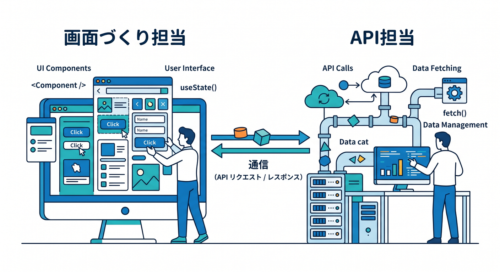
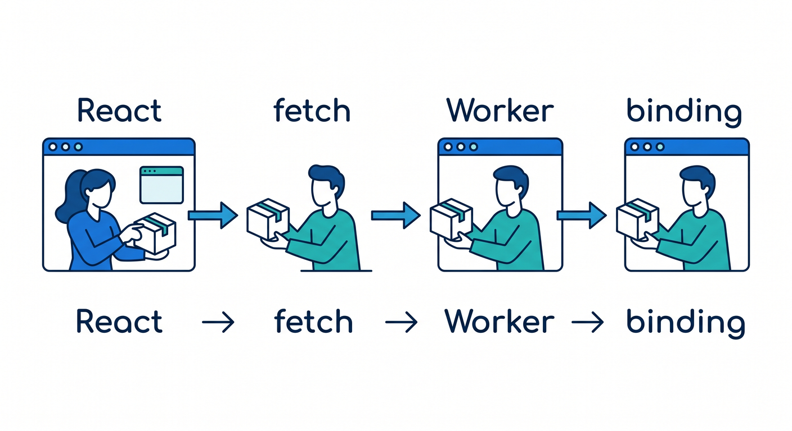
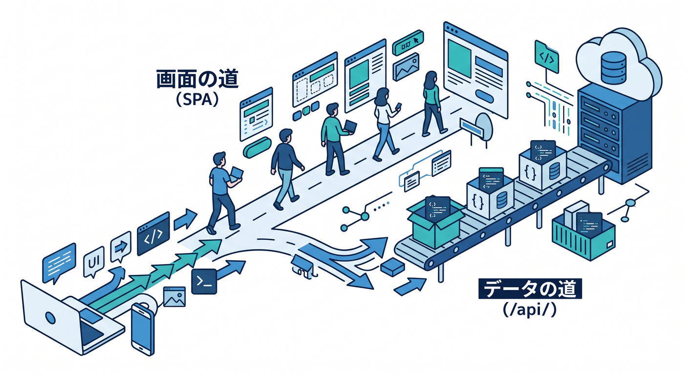
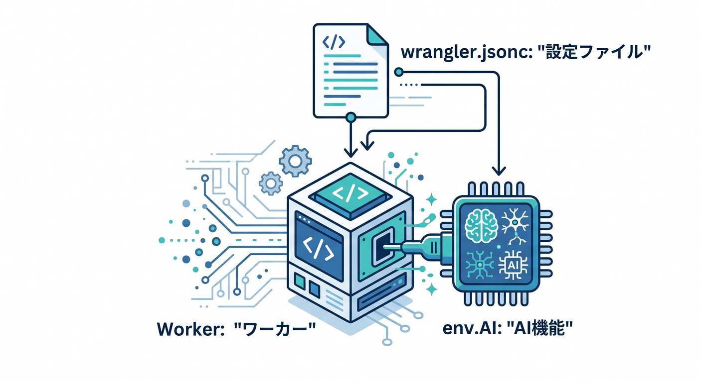
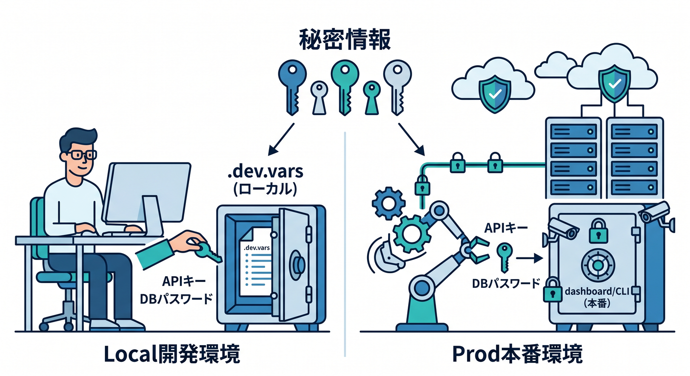

# 第08章：Reactとつないで、画面からWorkerを呼ぼう ⚛️🌈

この章では、Reactを「画面づくり担当」、Cloudflare Workerを「API担当」としてつなぎます😊



2026年4月17日時点の公式導線では、**C3でReact雛形を作る → Cloudflare Vite pluginで開発する → Worker APIを同じプロジェクトで動かす**流れがかなり自然です。Cloudflare Vite plugin は Vite と Workers runtime をしっかりつなぎ、ローカルでも **workerd** 上で本番に近い動きを試せます。さらに React 向けの公式ガイド自体が、**React SPA + Worker API** を前提にした構成になっています。([Cloudflare Docs][1])

この章のいちばん大事な気づきは、
**「ReactからCloudflareのbindingを直接さわる」のではなく、「React → fetch → Worker → binding」という流れで考える**ことです✨



Cloudflare公式も、Reactアプリは binding を直接使わず、**Worker を経由して fetch でやり取りする**形を案内しています。([Cloudflare Docs][1])

---

## この章のゴール 🎯

* Reactで入力フォームと結果表示を作れる
* ボタンを押して Worker API を呼べる
* Worker から JSON を返せる
* その先の発展として、Worker から **Workers AI** も呼べる
* 「画面」と「サーバー役」の役割分担がわかる

---

## この章で作るミニ作品 🧪✨

作るのはこんな小さなアプリです。

1. 画面にテキストボックスを置く
2. ボタンを押す
3. React が Worker にリクエストを送る
4. Worker が返した結果を画面に表示する
5. 発展版では、Worker が Workers AI を呼んで、入力文をやさしく説明して返す 🤖

この章では、Reactを深掘りしすぎません。
あくまで **Cloudflareを触るための見やすい入口** として React を使います 😊

---

## まずは全体像をつかもう 🗺️

役割はこの3つです。

* **React**
  入力・ボタン・表示を担当
* **Worker**
  APIの入口、JSON生成、binding利用を担当
* **Cloudflareの各サービス**
  AI、KV、D1、R2 などを binding 経由で使う担当

C3 の React ガイドで作られる雛形も、だいたいこの分担です。
公式の簡略ファイル構成では **src/App.tsx** がReact画面、**worker/index.ts** がWorker API、**wrangler.jsonc** がCloudflare設定、**vite.config.ts** がVite plugin設定という並びになっています。さらに SPA 向けには **assets.not_found_handling = "single-page-application"** が設定され、React側のルートは Worker ではなく SPA として扱われます。([Cloudflare Docs][1])

---

## 章の導入トーク 🗣️☁️

Node.js を少し知っている人は、最初こう思いがちです。

「React からそのまま AI や DB を呼べばよくない？ 🤔」

でも、そこは分けたほうが安全です。
なぜなら、**binding や秘密情報の管理は Worker 側に寄せる**ほうが自然だからです。React 画面はあくまで「見た目と操作」、Worker は「クラウドとの会話役」と覚えると、ぐっと整理しやすくなります 🌸

---

## 1. プロジェクトを作ろう 🚀

Cloudflare の React ガイドでは、React 向け雛形を **C3** で作る方法が用意されています。C3 は **npm create cloudflare** で起動でき、フレームワーク利用時はそのフレームワーク側の生成コマンドも使うため、比較的最新の構成に乗りやすいです。なお Pages を明示したいときは **--platform=pages** が必要ですが、この章の React + Worker の流れは Workers 側の React ガイドで十分進められます。([Cloudflare Docs][2])

教材では、こんな始め方がわかりやすいです。

```bash
npm create cloudflare@latest -- my-react-app --framework=react
cd my-react-app
npm run dev
```

公式 React ガイドでもこの作り方が案内されていて、ローカル開発では **npm run dev**、デプロイでは **npm run deploy** が基本です。Cloudflare Vite plugin によって、ローカルでも Workers runtime に近い形で開発できます。([Cloudflare Docs][1])

---

## 2. 「ReactからWorkerを呼ぶ」最小形を作ろう 📬⚛️

最初は AI を入れず、まずは **React → Worker → JSON** の流れだけ体験しましょう。
ここで成功すると、この後の D1 も KV も AI も、考え方がほぼ同じになります 🙌

## Worker 側

```ts
export default {
  async fetch(request: Request): Promise<Response> {
    const url = new URL(request.url)

    if (url.pathname === "/api/hello") {
      const name = url.searchParams.get("name") ?? "ゲスト"
      return Response.json({
        ok: true,
        message: `こんにちは、${name}さん！ Cloudflare Workerから返事しています ☁️`,
      })
    }

    return new Response("Not Found", { status: 404 })
  },
} satisfies ExportedHandler
```

Cloudflare の React + Vite / React SPA with an API の公式例でも、**/api/** で始まるパスに対して Worker が JSON を返し、React 側がそれを取りにいく形が基本です。([Cloudflare Docs][3])

## React 側

```tsx
import { useState } from "react"

type ApiResult = {
  ok: boolean
  message: string
}

export default function App() {
  const [name, setName] = useState("")
  const [result, setResult] = useState("まだ返事は来ていません 😊")
  const [loading, setLoading] = useState(false)

  async function callHello() {
    setLoading(true)

    try {
      const res = await fetch(`/api/hello?name=${encodeURIComponent(name)}`)
      const data = (await res.json()) as ApiResult
      setResult(data.message)
    } catch {
      setResult("通信に失敗しました 😢")
    } finally {
      setLoading(false)
    }
  }

  return (
    <main style={{ maxWidth: 720, margin: "40px auto", padding: 16 }}>
      <h1>React + Worker おためし 🌈</h1>

      <p>名前を入れて、Workerからメッセージを受け取ってみましょう ✨</p>

      <input
        value={name}
        onChange={(e) => setName(e.target.value)}
        placeholder="たとえば こみやんま"
        style={{ width: "100%", padding: 12, fontSize: 16 }}
      />

      <button
        onClick={callHello}
        disabled={loading}
        style={{ marginTop: 12, padding: "10px 16px", fontSize: 16 }}
      >
        {loading ? "通信中..." : "Workerを呼ぶ"}
      </button>

      <div style={{ marginTop: 20, padding: 16, border: "1px solid #ccc" }}>
        {result}
      </div>
    </main>
  )
}
```

ここでのポイントは、**React は fetch するだけ**でいいことです。
Cloudflare の binding や AI のことは、まだ React に考えさせません 👍

---

## 3. SPAルーティングの感覚をここで覚えよう 🛣️

Cloudflare の React ガイドでは、SPAとして使う場合に **not_found_handling = "single-page-application"** を使う案内があります。これによって、静的アセットに一致しないパスであっても、React の **index.html** に返して SPA として処理できます。Cloudflare はまず静的アセットを見にいき、それに当たらないと Worker を呼ぶ流れです。Reactガイドでは、SPAとして処理されるルートは Worker に行かず、無料扱いになる説明もあります。([Cloudflare Docs][1])

教材では、ここをこんなふうに説明すると伝わりやすいです。

> 画面のページ移動は React にまかせる 🚶
> API の入口は **/api/** にそろえる 📦
> すると「画面の道」と「データの道」が分かれて迷子になりにくい 😊



必要なら、明示的に **/api/** を Worker 優先にしたい場面では **run_worker_first** も使えます。公式チュートリアルでも **"/api/*"** を明示する例があります。([Cloudflare Docs][3])

---

## 4. ここで AI をつないでみよう 🤖✨

ここからがこの教材らしい、おいしい部分です 🍰
Cloudflare の **Workers AI** は、Worker から binding として使えます。公式では Wrangler 設定に AI binding を追加すると、Worker 内で **env.AI** として利用でき、**env.AI.run()** でモデルを実行できます。Workers AI 自体は現在 GA で、テキスト生成だけでなく、画像分類や埋め込みなども扱えます。([Cloudflare Docs][4])

## wrangler.jsonc に AI binding を追加



```jsonc
{
  "$schema": "./node_modules/wrangler/config-schema.json",
  "name": "my-react-app",
  "compatibility_date": "2026-04-17",
  "main": "./worker/index.ts",
  "assets": {
    "not_found_handling": "single-page-application"
  },
  "ai": {
    "binding": "AI"
  }
}
```

公式ドキュメントでも、Workers AI binding はこの形で追加し、Worker から **env.AI** で触ります。([Cloudflare Docs][4])

## AIつき Worker にしてみる

下の例では、React から送った文章を、Worker が AI に渡して「やさしく説明」して返します 😊

```ts
export interface Env {
  AI: Ai
}

type AiResponse = {
  response?: string
}

export default {
  async fetch(request: Request, env: Env): Promise<Response> {
    const url = new URL(request.url)

    if (url.pathname === "/api/hello") {
      const name = url.searchParams.get("name") ?? "ゲスト"
      return Response.json({
        ok: true,
        message: `こんにちは、${name}さん！ Cloudflare Workerから返事しています ☁️`,
      })
    }

    if (url.pathname === "/api/explain" && request.method === "POST") {
      const body = (await request.json()) as { text?: string }
      const text = body.text?.trim() ?? ""

      if (!text) {
        return Response.json(
          { ok: false, error: "説明してほしい文章を入れてください。" },
          { status: 400 },
        )
      }

      const result = (await env.AI.run("@cf/meta/llama-3.1-8b-instruct-fast", {
        messages: [
          { role: "system", content: "あなたはやさしく説明する先生です。" },
          { role: "user", content: `次の文を大学生向けにやさしく説明してください: ${text}` },
        ],
      })) as AiResponse

      return Response.json({
        ok: true,
        aiText: result.response ?? "うまく生成できませんでした。",
      })
    }

    return new Response("Not Found", { status: 404 })
  },
} satisfies ExportedHandler<Env>
```

Cloudflare の Workers AI ドキュメントでは **env.AI.run()** の利用例があり、ストリーミングにも対応しています。さらに現行のモデルページでは、たとえば **@cf/meta/llama-3.1-8b-instruct-fast** に対して **messages** を渡し、返り値 JSON の **response** に生成文が入る例が示されています。([Cloudflare Docs][4])

---

## 5. React から AI API を呼んで画面に出そう 🌟

```tsx
import { useState } from "react"

type ExplainResult = {
  ok: boolean
  aiText?: string
  error?: string
}

export default function App() {
  const [text, setText] = useState("")
  const [result, setResult] = useState("ここにAIの説明が出ます 🤖")
  const [loading, setLoading] = useState(false)

  async function explainText() {
    setLoading(true)

    try {
      const res = await fetch("/api/explain", {
        method: "POST",
        headers: {
          "Content-Type": "application/json",
        },
        body: JSON.stringify({ text }),
      })

      const data = (await res.json()) as ExplainResult

      if (!data.ok) {
        setResult(data.error ?? "エラーです")
        return
      }

      setResult(data.aiText ?? "結果が空でした")
    } catch {
      setResult("通信エラーです 😢")
    } finally {
      setLoading(false)
    }
  }

  return (
    <main style={{ maxWidth: 720, margin: "40px auto", padding: 16 }}>
      <h1>React + Worker + AI ✨</h1>

      <p>文章を入れて、Cloudflare Worker経由でAIに説明してもらいましょう 🌈</p>

      <textarea
        value={text}
        onChange={(e) => setText(e.target.value)}
        rows={8}
        placeholder="ここに説明してほしい文章を入れてください"
        style={{ width: "100%", padding: 12, fontSize: 16 }}
      />

      <button
        onClick={explainText}
        disabled={loading}
        style={{ marginTop: 12, padding: "10px 16px", fontSize: 16 }}
      >
        {loading ? "AIに相談中..." : "AIで説明する"}
      </button>

      <section style={{ marginTop: 20, padding: 16, border: "1px solid #ccc" }}>
        <h2>結果</h2>
        <p style={{ whiteSpace: "pre-wrap" }}>{result}</p>
      </section>
    </main>
  )
}
```

この形にしておくと、あとで **要約・分類・タイトル生成・説明文生成** にすぐ広げられます 😊
つまり React 側は「入力欄と結果表示」を少し変えるだけ、Worker 側は「どのAI処理を呼ぶか」を変えるだけ、という分業になります。

---

## 6. ローカル確認とデプロイの流れ 👀

Cloudflare の Vite plugin では、**npm run dev** で開発し、**npm run build** でビルドし、**npm run preview** で build 出力を Workers runtime に近い形で確認できます。公式チュートリアルでも、preview は build 出力をローカルで本番に近く試せる手順として案内されています。([Cloudflare Docs][3])

教材としては、次の順で確認させると安心です。

```bash
npm run dev
npm run build
npm run preview
npm run deploy
```

公式の React ガイドでも **npm run deploy** が基本デプロイ導線です。([Cloudflare Docs][1])

---

## 7. Copilot をどう混ぜると学習効率が上がる？ 🤝✨

この章では GitHub Copilot をかなり相性よく使えます。
特におすすめなのは、**「コードを書かせる」より「理解を助けてもらう」**使い方です。

たとえばこんな聞き方が良いです。

* 「この fetch の流れを小学生にもわかるように説明して」
* 「この useState は何を覚えているの？」
* 「この Worker が返す JSON の型を提案して」
* 「このエラーが起きそうな場所を3つ教えて」
* 「この POST API を try/catch つきで書き直して」

さらに発展トピックとして、GitHub Docs には **Copilot cloud agent を MCP で拡張する例**があり、その具体例として **Cloudflare MCP server** も載っています。Cloudflare サービスの文脈を Copilot 側に渡す話として、章末コラムに軽く紹介する価値は高いです。([GitHub Docs][5])

---

## 8. この章で入れておきたい「実務っぽい注意」⚠️

## その1：React から秘密情報を直接持たせない 🔐



秘密情報は Worker 側に置きましょう。
Cloudflare の Vite plugin では、ローカル開発用の秘密情報は **.dev.vars** で与えられ、デプロイ済み Worker では dashboard や Wrangler CLI で設定します。なお **vite build** 時に関連する **.dev.vars** は preview 用に出力へコピーされますが、デプロイされるわけではありません。([Cloudflare Docs][6])

## その2：AIのローカル試験も無料枠・制限を意識する 💸

Workers AI は Free / Paid の Workers プランで使え、現行の料金ページでは **1日10,000 Neurons の無料枠**、超過分は **$0.011 / 1,000 Neurons** です。また limits ページでは、**Wrangler を使ったローカルモードの推論も制限にカウントされる**と案内されています。教材では「遊びすぎ注意 😆」をひとこと入れておくと親切です。([Cloudflare Docs][7])

## その3：AIを本気で運用するなら Gateway の存在を早めに知る 🌉

Cloudflare の **AI Gateway** は、AIアプリに対して **分析・ログ・キャッシュ・レート制限・リトライ・フォールバック** をまとめてかけられる仕組みです。第8章では深追いしなくていいですが、「後でちゃんと運用するときの入口」として一言あると、かなり2026年っぽい教材になります。([Cloudflare Docs][8])

## その4：OpenAI SDK に慣れている人には互換APIもある 🔁

Workers AI には **OpenAI compatible endpoints** があり、**/v1/chat/completions** と **/v1/embeddings** に対応しています。つまり将来、「OpenAI SDK の書き味に寄せたい」という人には別ルートもあります。第8章では binding 直呼びを主役にして、章末の発展欄でこの互換APIを紹介するのがおすすめです。([Cloudflare Docs][9])

---

## 9. この章のおすすめ練習問題 ✍️🎓

教材としては、次の順がきれいです。

1. **あいさつAPI** を作る
   名前を受け取って返すだけ

2. **POST API** に変える
   URLパラメータではなく JSON で受け取る

3. **AI説明API** を作る
   文章をやさしく言い換えて返す

4. **ローディング表示** を入れる
   「通信中…」「AI考え中…」を見せる

5. **失敗表示** を入れる
   空入力・通信失敗・AI失敗を分ける

6. **履歴表示** を入れる
   過去3件だけ画面に残す

この順番だと、React の state、fetch、Worker、JSON、AI までが自然につながります 🌸

---

## 10. この章で学ぶべき言葉を、やさしく一言で 😊

* **SPA**
  画面遷移っぽく見えるけど、基本は1つのページで動くアプリ

* **Worker API**
  Cloudflare 上で動く、軽くて速いサーバー役

* **binding**
  Worker から Cloudflare の機能を使うための接続口

* **Workers AI**
  Worker から呼べる Cloudflare の AI 機能

* **Vite plugin**
  ローカル開発と本番の差を小さくしてくれる橋

---

## 11. この章のまとめ 🎉☁️⚛️

第8章の主役は React ではなく、
**「Reactの画面から Cloudflare Worker を自然に呼べるようになること」**です。

ここでつかんでほしいのは、たったこの一行です。

**画面は React、クラウドとの会話は Worker。** ✨

この形に慣れると、次の章でフォーム送信や Turnstile に進んでも混乱しにくいですし、さらに先では KV・D1・R2・AI にもそのまま伸ばせます。Cloudflare の現行公式導線も、React SPA と Worker API を同じ土台で育てる流れをかなり強く後押ししています。([Cloudflare Docs][1])

必要なら次に、この第8章をそのまま教材ページへ貼れるように、
**「導入文 → 本文 → まとめ → 練習問題 → 小テスト」まで完成形の章原稿**として整えて出します。

[1]: https://developers.cloudflare.com/workers/framework-guides/web-apps/react/ "React + Vite · Cloudflare Workers docs"
[2]: https://developers.cloudflare.com/pages/get-started/c3/ "Create projects with C3 CLI · Cloudflare Pages docs"
[3]: https://developers.cloudflare.com/workers/vite-plugin/tutorial/ "Tutorial - React SPA with an API · Cloudflare Workers docs"
[4]: https://developers.cloudflare.com/workers-ai/configuration/bindings/ "Workers Bindings · Cloudflare Workers AI docs"
[5]: https://docs.github.com/en/copilot/how-tos/use-copilot-agents/cloud-agent/extend-cloud-agent-with-mcp "Extending GitHub Copilot cloud agent with the Model Context Protocol (MCP) - GitHub Docs"
[6]: https://developers.cloudflare.com/workers/vite-plugin/reference/secrets/ "Secrets · Cloudflare Workers docs"
[7]: https://developers.cloudflare.com/workers-ai/platform/pricing/ "Pricing · Cloudflare Workers AI docs"
[8]: https://developers.cloudflare.com/ai-gateway/ "Overview · Cloudflare AI Gateway docs"
[9]: https://developers.cloudflare.com/workers-ai/configuration/open-ai-compatibility/ "OpenAI compatible API endpoints · Cloudflare Workers AI docs"