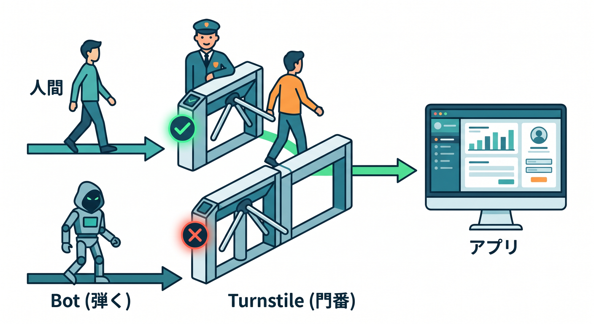
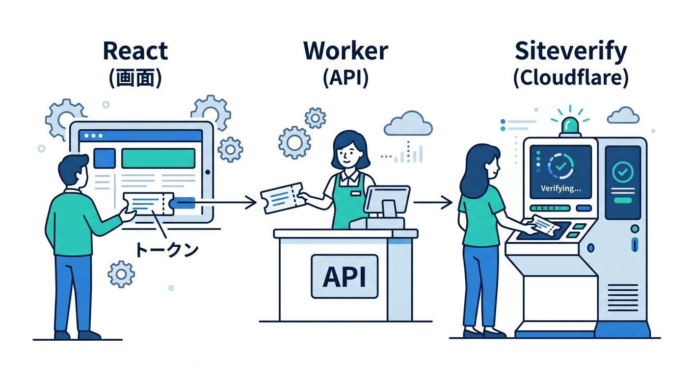
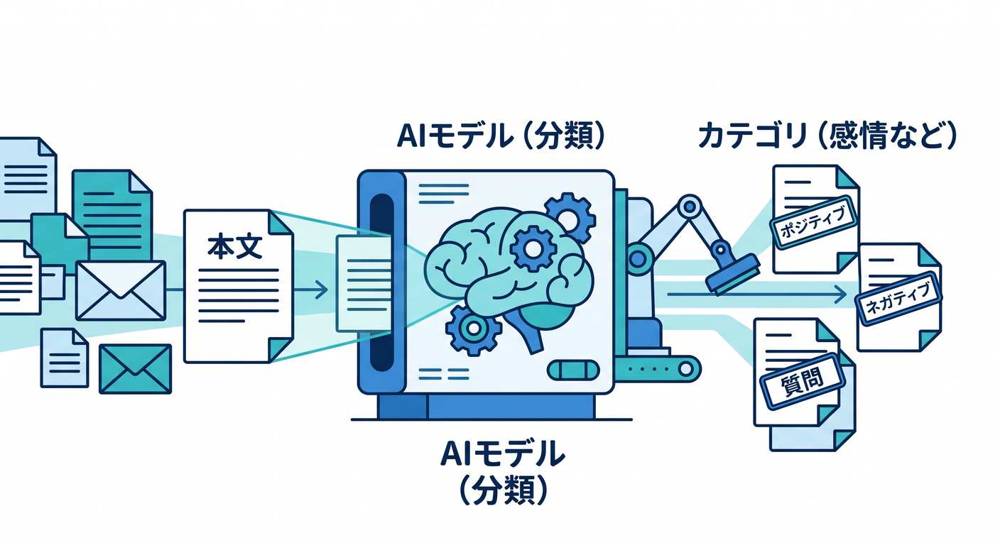
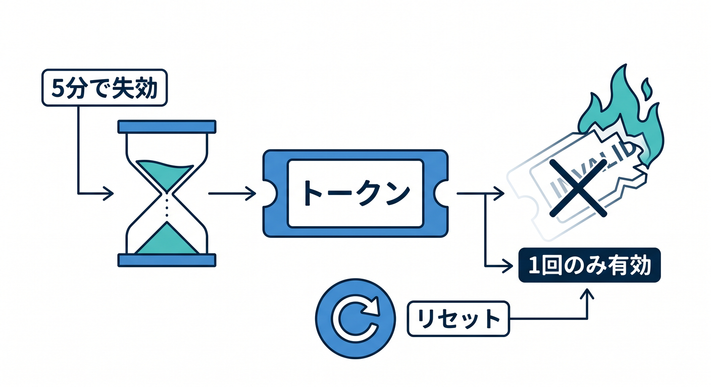
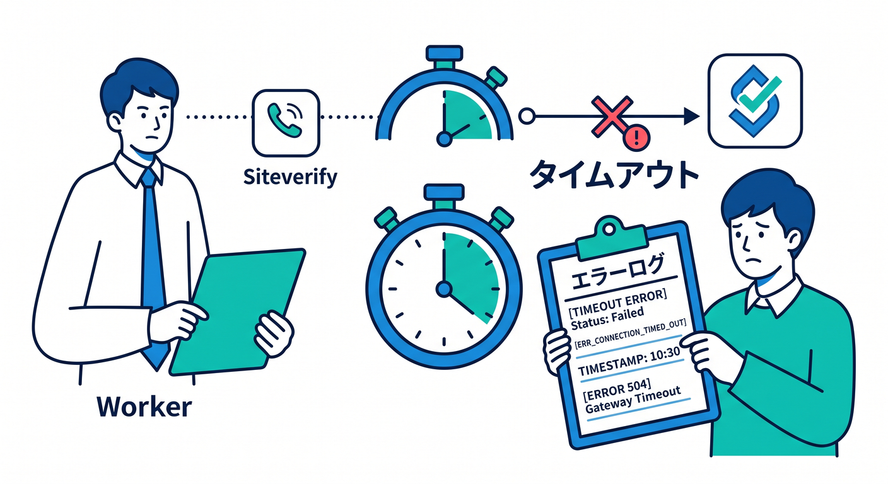

# 第09章：フォーム送信を作りながら、Turnstileでやさしく守ろう 🛡️✉️

この章では、第8章でつないだ React 画面と Worker API を使って、**「送れるフォーム」から「ちゃんと守られたフォーム」へ進化させる**のがテーマです 😊
本日時点の Cloudflare 公式情報では、Turnstile は **SPA では explicit rendering が向いていて**、**サーバー側での Siteverify 検証が必須**、さらに **トークンは 1 回限り・5 分で失効** という前提で実装するのが大事です。React SPA + API Worker の流れ自体も、Cloudflare 公式の React SPA with API チュートリアルと Vite plugin の導線にきれいにつながります。([Cloudflare Docs][1])

---

## この章のゴール 🎯

この章を終えると、こんなことができるようになります ✨

* React の問い合わせフォームから Worker に送信できる
* Turnstile のトークンをフロントで受け取れる
* Worker 側で Siteverify を呼んで、本当に通してよい送信かを判定できる
* そのうえで、Cloudflare の AI を使ってメッセージを軽く分類できる
* 「作る」と「守る」を一緒に考える感覚がつく

---

## まず知っておきたいこと 🧠

Turnstile は Cloudflare の CAPTCHA 代替で、**Cloudflare の CDN を使っていないサイトにも埋め込める**仕組みです。しかも、昔ながらの「文字を読ませる」「画像を選ばせる」流れだけに頼らず、かなり自然な体験で人間確認を入れられます。([Cloudflare Docs][2])

また、Turnstile のウィジェットには **Managed / Non-Interactive / Invisible** の 3 モードがあり、公式では **Managed mode が推奨** です。Managed は、必要に応じてだけ追加の確認を出すので、初心者の教材としてもいちばん扱いやすいです。([Cloudflare Docs][3])

この章では、**Managed mode + React で explicit rendering + Worker で検証**、といういちばん理解しやすくて実務にもつながりやすい形で進めます。Cloudflare は explicit rendering を、**動的サイトや SPA、ウィジェット生成タイミングを自分で制御したいケース**に勧めています。([Cloudflare Docs][4])

---

## この章で作るもの 🧩

作るものは、とてもシンプルです ✍️

1. 名前・メール・本文を入力するフォーム
2. そのフォームに Turnstile を表示
3. React がトークンを受け取る
4. React が本文とトークンを Worker の `/api/contact` に送る
5. Worker が `siteverify` に問い合わせる
6. 通ったら送信成功、ついでに Workers AI で本文を軽く分類する

ここで大事なのは、**Turnstile は見た目を置いただけでは完成しない**ことです。公式ドキュメントでも、**クライアント側のウィジェットだけでは保護にならず、バックエンドから Siteverify を呼ぶ必要がある**とはっきり書かれています。([Cloudflare Docs][5])

---

## フォーム保護の全体像 👀

流れを言葉で描くと、こうです 🌈



* ブラウザで Turnstile が動く
* 人間確認が完了するとトークンが発行される
* React はそのトークンをフォームデータと一緒に Worker に送る
* Worker だけが秘密鍵を使って Siteverify に問い合わせる
* `success: true` なら処理を続行、`false` なら拒否する

このとき、**秘密鍵は絶対にフロント側へ出しません**。Turnstile の widget には公開用の sitekey と、サーバー側検証用の secret key があり、secret key はバックエンド専用です。Cloudflare も、Siteverify は **バックエンド環境からだけ呼ぶこと**を強く求めています。([Cloudflare Docs][6])

---

## 第8章の続きとしての位置づけ 🔗

第8章で React から Worker API を呼べるようになっていれば、この章はそこへ **守りの層を 1 枚足す**だけです。Cloudflare の Vite plugin は、Vite と Workers runtime を密につなぎ、**workerd 上でローカル実行できる**ので、本番に近い感覚で React + Worker を一緒に育てられます。公式チュートリアルでも React SPA と API Worker を同じ流れで扱っています。([Cloudflare Docs][7])

---

## 事前に用意するもの 🔑

必要なのは次の 4 つです。

* Turnstile widget の **sitekey**
* Turnstile widget の **secret key**
* React 側で使う `VITE_TURNSTILE_SITE_KEY`
* Worker 側で使う `TURNSTILE_SECRET_KEY`

Turnstile の各 widget には **固有の sitekey / secret key ペア**があります。sitekey はブラウザ側、secret key はサーバー側です。さらに Worker の秘密情報はソースコードや `vars` に直書きせず、**secret として管理**するのが Cloudflare の推奨です。ローカル開発では `.dev.vars` または `.env` を使えます。([Cloudflare Docs][3])

本番用の secret を Worker に入れるなら、Wrangler の `secret put` が使えます。([Cloudflare Docs][8])

```bash
npx wrangler secret put TURNSTILE_SECRET_KEY
```

---

## まずは front-end 側を作ろう ⚛️

React では、SPA 向けに **explicit rendering** を使うのが素直です。
また、Turnstile の script は **必ず公式の正確な URL** から読み込みます。プロキシやキャッシュを挟むと、将来の更新時に壊れることがあると Cloudflare が警告しています。([Cloudflare Docs][1])

まず `index.html` に script を追加します。

```html
<script
  src="https://challenges.cloudflare.com/turnstile/v0/api.js"
  async
  defer
></script>
```

次に、TypeScript で `window.turnstile` を扱いやすくするため、型を軽く足します。

```ts
// src/turnstile.d.ts
declare global {
  interface Window {
    turnstile?: {
      render: (
        container: string | HTMLElement,
        options: {
          sitekey: string;
          callback?: (token: string) => void;
          "expired-callback"?: () => void;
          "error-callback"?: (errorCode?: string) => void;
          "timeout-callback"?: () => void;
        }
      ) => string;
      reset: (widgetId?: string) => void;
    };
  }
}

export {};
```

そして、フォーム本体です。
ここでは **成功時 callback** で token を受け取り、**expired / error / timeout** で token を消します。公式ドキュメントでも callback 群が用意されていて、成功 callback の token は **サーバーで検証する前提**です。([Cloudflare Docs][9])

```tsx
// src/components/ContactForm.tsx
import { useEffect, useRef, useState } from "react";

const siteKey = import.meta.env.VITE_TURNSTILE_SITE_KEY;

type ContactFormState = {
  name: string;
  email: string;
  message: string;
};

export function ContactForm() {
  const hostRef = useRef<HTMLDivElement | null>(null);
  const widgetIdRef = useRef<string | null>(null);

  const [form, setForm] = useState<ContactFormState>({
    name: "",
    email: "",
    message: "",
  });
  const [token, setToken] = useState("");
  const [status, setStatus] = useState("");

  useEffect(() => {
    const timer = window.setInterval(() => {
      if (!hostRef.current) return;
      if (!window.turnstile) return;
      if (widgetIdRef.current) return;

      widgetIdRef.current = window.turnstile.render(hostRef.current, {
        sitekey: siteKey,
        callback(token) {
          setToken(token);
          setStatus("人間確認が完了しました ✅");
        },
        "expired-callback"() {
          setToken("");
          setStatus("認証の有効期限が切れました。もう一度お願いします ⏳");
        },
        "error-callback"() {
          setToken("");
          setStatus("認証でエラーが発生しました。再度お試しください ⚠️");
        },
        "timeout-callback"() {
          setToken("");
          setStatus("認証がタイムアウトしました。もう一度お願いします ⌛");
        },
      });

      window.clearInterval(timer);
    }, 200);

    return () => window.clearInterval(timer);
  }, []);

  function update<K extends keyof ContactFormState>(key: K, value: ContactFormState[K]) {
    setForm((prev) => ({ ...prev, [key]: value }));
  }

  async function onSubmit(event: React.FormEvent<HTMLFormElement>) {
    event.preventDefault();

    if (!token) {
      setStatus("先に人間確認を完了してください 🙏");
      return;
    }

    setStatus("送信中です… 📮");

    const response = await fetch("/api/contact", {
      method: "POST",
      headers: {
        "Content-Type": "application/json",
      },
      body: JSON.stringify({
        ...form,
        token,
      }),
    });

    const data = await response.json();

    if (!response.ok) {
      setStatus(data.message ?? "送信に失敗しました。");
      setToken("");
      window.turnstile?.reset(widgetIdRef.current ?? undefined);
      return;
    }

    setStatus(`送信できました 🎉 AIラベル: ${data.sentiment}`);
    setForm({
      name: "",
      email: "",
      message: "",
    });
    setToken("");
    window.turnstile?.reset(widgetIdRef.current ?? undefined);
  }

  return (
    <form onSubmit={onSubmit} className="space-y-4">
      <div>
        <label>お名前</label>
        <input
          value={form.name}
          onChange={(e) => update("name", e.target.value)}
        />
      </div>

      <div>
        <label>メールアドレス</label>
        <input
          type="email"
          value={form.email}
          onChange={(e) => update("email", e.target.value)}
        />
      </div>

      <div>
        <label>お問い合わせ本文</label>
        <textarea
          rows={6}
          value={form.message}
          onChange={(e) => update("message", e.target.value)}
        />
      </div>

      <div ref={hostRef} />

      <button type="submit">送信する</button>

      <p>{status}</p>
    </form>
  );
}
```

---

## 次は Worker 側で検証しよう ☁️

ここがこの章の本丸です 🔥
Turnstile の token は **Worker で Siteverify に送って確認**します。



Cloudflare の公式では、Siteverify は `POST https://challenges.cloudflare.com/turnstile/v0/siteverify` に送信し、`application/json` でも `FormData` でも受け付けると説明されています。さらに token は **300 秒で失効**し、**1 回しか使えません**。再利用すると `timeout-or-duplicate` になります。([Cloudflare Docs][5])

まず、Workers AI binding も一緒に有効にしておきます。Cloudflare では bindings 経由の利用が基本で、`AI` binding を作ると Worker から `env.AI` で使えます。Bindings は REST API 直叩きより性能面や制約面で有利だと案内されています。([Cloudflare Docs][10])

```jsonc
// wrangler.jsonc
{
  "name": "chapter9-contact-form",
  "main": "src/index.ts",
  "compatibility_date": "2026-04-17",
  "ai": {
    "binding": "AI"
  }
}
```

Worker 本体はこんな感じです。

```ts
// src/index.ts
export interface Env {
  TURNSTILE_SECRET_KEY: string;
  AI: Ai;
}

type ContactBody = {
  name: string;
  email: string;
  message: string;
  token: string;
};

type TurnstileResult = {
  success: boolean;
  "error-codes"?: string[];
};

async function validateTurnstile(
  secret: string,
  token: string,
): Promise<TurnstileResult> {
  const formData = new FormData();
  formData.append("secret", secret);
  formData.append("response", token);

  const response = await fetch(
    "https://challenges.cloudflare.com/turnstile/v0/siteverify",
    {
      method: "POST",
      body: formData,
    },
  );

  return await response.json<TurnstileResult>();
}

async function classifyMessage(env: Env, message: string) {
  const result = await env.AI.run("@cf/huggingface/distilbert-sst-2-int8", {
    text: message,
  }) as Array<{ label: string; score: number }>;

  const top = result[0];
  return top ? `${top.label} (${top.score.toFixed(2)})` : "UNKNOWN";
}

function badRequest(message: string, details?: unknown) {
  return Response.json(
    { ok: false, message, details },
    { status: 400 },
  );
}

export default {
  async fetch(request, env): Promise<Response> {
    const url = new URL(request.url);

    if (request.method === "POST" && url.pathname === "/api/contact") {
      const body = await request.json<ContactBody>();

      if (!body.name || !body.email || !body.message || !body.token) {
        return badRequest("入力不足です。");
      }

      const verification = await validateTurnstile(
        env.TURNSTILE_SECRET_KEY,
        body.token,
      );

      if (!verification.success) {
        return badRequest("Turnstile 検証に失敗しました。", verification["error-codes"]);
      }

      // ここでは保存の代わりに、AI で本文の雰囲気を軽く分類
      const sentiment = await classifyMessage(env, body.message);

      return Response.json({
        ok: true,
        message: "送信成功",
        sentiment,
      });
    }

    return new Response("Not found", { status: 404 });
  },
} satisfies ExportedHandler<Env>;
```

このコードのポイントは 3 つです 😊

* **Turnstile に通ったら即 OK ではなく、Worker 側で明示的に判定している**
* **secret key は `env.TURNSTILE_SECRET_KEY` から読む**
* **検証成功後にだけ AI 処理へ進む**

この順番にすることで、**まず bot 対策、その次に AI 処理**という整理された流れになります。Cloudflare の公式 docs でも、AI は binding 経由で Worker に組み込みやすく、TypeScript なら `Env` に `AI: Ai` を足すのが基本形です。([Cloudflare Docs][10])

---

## この章で AI をどう絡めるか 🤖✨

ここは大事です。
**Turnstile は「人間確認」**、**Workers AI は「本文の理解」**です。役割が違います。



たとえば今回のような問い合わせフォームなら、

* Turnstile で bot 送信を減らす
* Workers AI で本文を軽く分類する
* 将来は「営業っぽい」「質問っぽい」「感情が強い」などで仕分ける

という流れが作れます。Workers AI では binding を作って `env.AI.run(...)` でモデルを呼べますし、今回使った `@cf/huggingface/distilbert-sst-2-int8` は **テキスト分類モデル**で、出力は **`label` と `score` を持つ配列**です。([Cloudflare Docs][10])

ここでの注意点は、**AI 分類はセキュリティの代わりではない**ことです。
守りの本体はあくまで Turnstile の token 検証です。AI は、その後の整理や補助判断に使うと気持ちよくハマります 👍

---

## トークンの期限切れをどう扱う？ ⏳

Turnstile の token は **5 分で失効**し、**1 回しか使えません**。



なので、次の 2 つを必ず意識してください。

* 送信失敗後は `turnstile.reset()` で取り直す
* `expired-callback` が来たら token を消して再認証を促す

公式 docs でも、期限切れ時には widget をリセットして新しい token を取り直す前提になっています。timeout や expired に関する callback も用意されています。([Cloudflare Docs][5])

---

## 実務っぽい改善ポイント 🌟

この章の最小実装ができたら、次はここを強くしていくと実務感が出ます。

### 1. エラーコードをログに残す 📝

`verification["error-codes"]` をログへ残しておくと、
「期限切れなのか」「重複なのか」「設定ミスなのか」が見えやすいです。([Cloudflare Docs][5])

### 2. Siteverify にタイムアウトを入れる ⏱️

Cloudflare は、Siteverify に対して **無限に待たず、適切な timeout を入れる**ことを勧めています。



サンプルでも `AbortController` と timeout の考え方が出ています。([Cloudflare Docs][5])

### 3. 二重送信対策を入れる 🔁

公式のサンプルには `idempotency_key` の話もあります。フォームの二重送信が気になるなら、送信ごとに識別キーを付ける発想も覚えておくと強いです。([Cloudflare Docs][5])

### 4. 秘密情報をソースに書かない 🔐

本番 secret は `wrangler secret put`、ローカルは `.dev.vars` または `.env`。この分離は早いうちにクセにしておくと後が楽です。([Cloudflare Docs][11])

---

## テストの考え方 🧪

E2E テストでは、Selenium / Cypress / Playwright のような自動テストが bot と見なされやすいので、Cloudflare は **専用の testing sitekey / secret key** を案内しています。つまり、E2E のときは「本番の人間確認を無理やり通す」のではなく、**テスト用キーで検証フローだけ確認する**のが正攻法です。([Cloudflare Docs][12])

この章の学習段階なら、まずは次の順で十分です 😊

* 手動で 1 回送る
* token を消した状態で送って 400 になるか見る
* 期限切れメッセージが出るか見る
* テスト用キーで自動テストへ進む

---

## Copilot をどう使うと学習効率が上がる？ 🚀🤝

GitHub Copilot は、この章とかなり相性がいいです。
GitHub 公式 docs では、Copilot Chat は **MCP で外部のコンテキストやツールをつなげられ**、VS Code では **Agent モード**から MCP サーバーを使えます。ツールアイコンから利用可能な MCP サーバーを見る流れも案内されています。([GitHub Docs][13])

この章でおすすめの聞き方はこんな感じです 💬

* 「この `ContactForm.tsx` で Turnstile token の期限切れ処理を改善して」
* 「この Worker の Siteverify 呼び出しに timeout を追加して」
* 「この `error-codes` を見やすい日本語メッセージに変換して」
* 「この実装を `fetch` エラーハンドリング込みで安全に書き直して」

特に初学者には、**“丸投げ”より“この部分だけ改善して”** と聞くほうが学びやすいです ✨

---

## 発展：Cloudflare の AI をもっと実務寄りに使うなら 🌈

この章では Workers AI を軽く使いましたが、将来フォーム送信後に **AI 自動返信** や **要約** を入れたくなったら、AI Gateway も相性がいいです。AI Gateway は **分析・ログ・キャッシュ・レート制限・リトライ・モデル fallback** などをまとめて扱えるので、AI 機能が育ってきたときに効いてきます。([Cloudflare Docs][14])

さらに Guardrails を使うと、**ユーザー入力と AI 応答の両方**を安全チェックできます。Guardrails は Workers AI 上で動き、危険な内容の flag / block をかけられます。ただし、追加レイテンシがあり、Cloudflare docs では **典型的に約 500ms 程度**の増加があると説明されています。なので、この第9章ではまだ無理に入れず、**第12章〜第13章の AI 本格章で本命**として扱うのが自然です。([Cloudflare Docs][15])

---

## 発展：Turnstile をもっと強くする方向 🛡️🛡️

もっと先へ進むと、Turnstile にはこういう発展機能もあります。

* **Pre-clearance**
  Cloudflare 保護下のドメイン間で clearance cookie を使う構成。SPA や複数サブドメイン運用で役立つことがあります。([Cloudflare Docs][16])

* **Ephemeral IDs**
  IP ローテーションを使う攻撃者対策として有効な短命デバイス識別子です。ただし、現時点の docs では **Enterprise レベル向けで自己有効化はできない**とされています。([Cloudflare Docs][17])

このあたりはまだ初心者向けの本筋ではないので、**「こういう伸びしろがあるんだな」くらいで十分**です 😊

---

## この章のまとめ 🎉

第9章で本当に覚えてほしいのは、この 4 つです。

* **Turnstile は置くだけでは終わらない**
* **SPA の React では explicit rendering が扱いやすい**
* **Worker 側で Siteverify を必ず呼ぶ**
* **AI は守りの代わりではなく、その後の整理や補助に使う**

この章まで来ると、もうただの「Hello World」ではありません ☁️
**React で画面を作り、Worker で受け取り、Turnstile で守り、Workers AI で意味を足す。**
かなり Cloudflare らしいアプリの入り口に立てています 🙌✨

---

## 章末ミニ課題 📚

1. フォームに「件名」を追加して、Worker 側でも必須チェックする
2. Turnstile 検証失敗時の `error-codes` を画面にやさしく表示する
3. AI の分類結果に応じて、`normal / warning` の表示を出し分ける
4. `turnstile.reset()` のタイミングを、自分の言葉で説明してみる
5. Copilot に「この実装の弱点を3つ挙げて」と聞いて改善する

必要なら次に、このまま続けて **第9章を教材本文としてそのまま貼れる完成原稿版** に整えて出します。

[1]: https://developers.cloudflare.com/turnstile/get-started/client-side-rendering/ "Embed the widget · Cloudflare Turnstile docs"
[2]: https://developers.cloudflare.com/turnstile/?utm_source=chatgpt.com "Overview · Cloudflare Turnstile docs"
[3]: https://developers.cloudflare.com/turnstile/concepts/widget/ "Turnstile widgets · Cloudflare Turnstile docs"
[4]: https://developers.cloudflare.com/turnstile/get-started/client-side-rendering/?utm_source=chatgpt.com "Embed the widget · Cloudflare Turnstile docs"
[5]: https://developers.cloudflare.com/turnstile/get-started/server-side-validation/ "Validate the token · Cloudflare Turnstile docs"
[6]: https://developers.cloudflare.com/turnstile/get-started/?utm_source=chatgpt.com "Get started · Cloudflare Turnstile docs"
[7]: https://developers.cloudflare.com/workers/vite-plugin/tutorial/ "Tutorial - React SPA with an API · Cloudflare Workers docs"
[8]: https://developers.cloudflare.com/workers/wrangler/commands/workers/?utm_source=chatgpt.com "Workers"
[9]: https://developers.cloudflare.com/turnstile/get-started/client-side-rendering/widget-configurations/ "Widget configurations · Cloudflare Turnstile docs"
[10]: https://developers.cloudflare.com/workers-ai/get-started/workers-wrangler/ "Get started - Workers and Wrangler · Cloudflare Workers AI docs"
[11]: https://developers.cloudflare.com/workers/best-practices/workers-best-practices/?utm_source=chatgpt.com "Workers Best Practices"
[12]: https://developers.cloudflare.com/turnstile/troubleshooting/testing/ "Test your Turnstile implementation · Cloudflare Turnstile docs"
[13]: https://docs.github.com/ja/copilot/how-tos/provide-context/use-mcp-in-your-ide/extend-copilot-chat-with-mcp "モデル コンテキスト プロトコル (MCP) サーバーを使用した GitHub Copilot Chatの拡張 - GitHubドキュメント"
[14]: https://developers.cloudflare.com/ai-gateway/ "Overview · Cloudflare AI Gateway docs"
[15]: https://developers.cloudflare.com/ai-gateway/features/guardrails/ "Guardrails · Cloudflare AI Gateway docs"
[16]: https://developers.cloudflare.com/turnstile/additional-configuration/hostname-management/pre-clearance/ "Pre-clearance configuration · Cloudflare Turnstile docs"
[17]: https://developers.cloudflare.com/turnstile/additional-configuration/ephemeral-id/ "Ephemeral IDs · Cloudflare Turnstile docs"