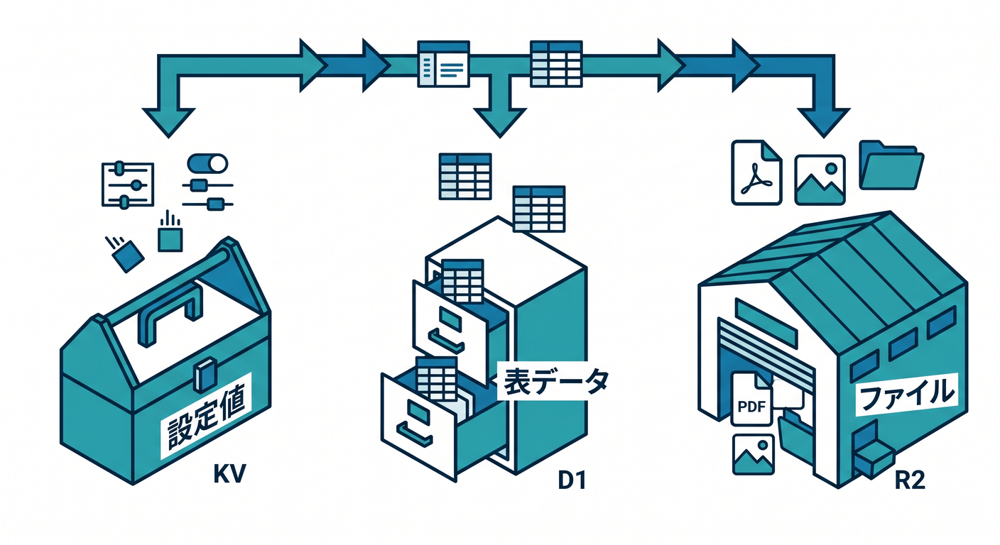
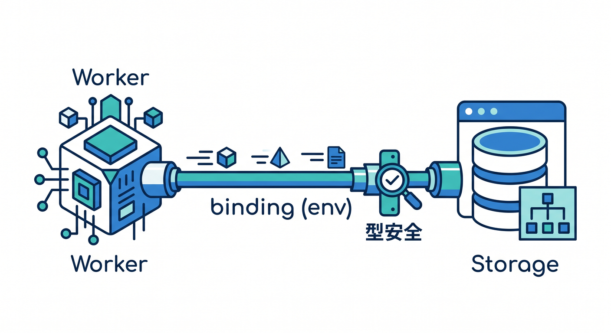
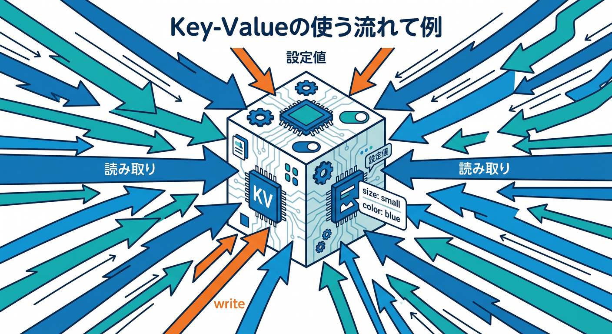
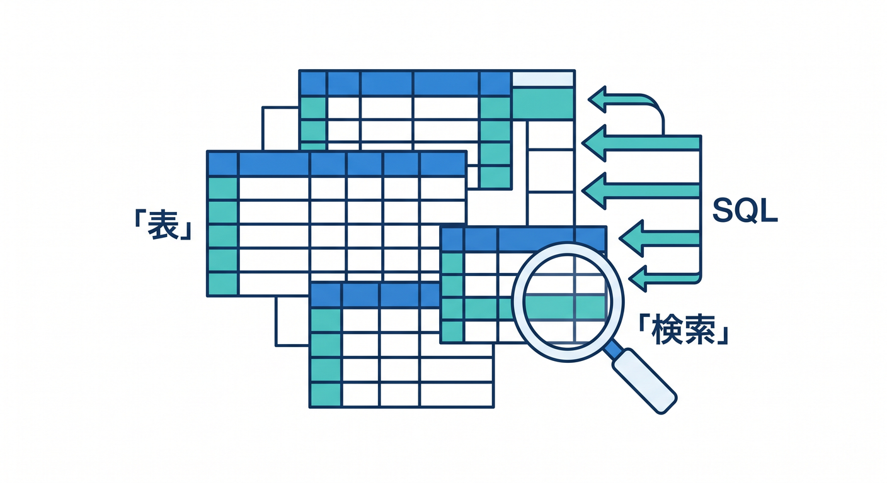
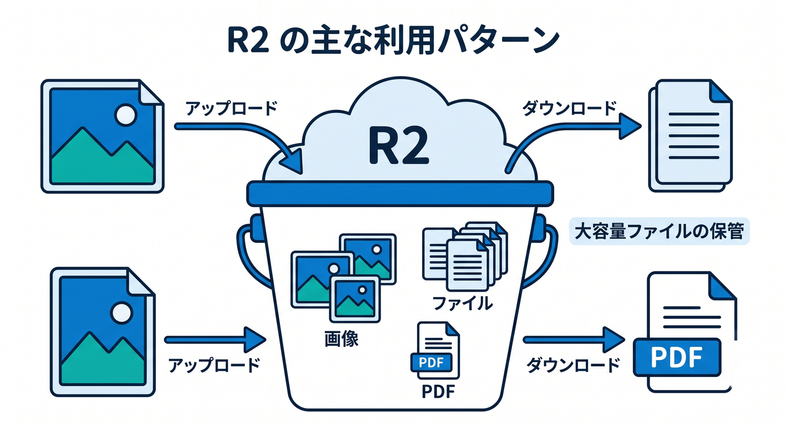
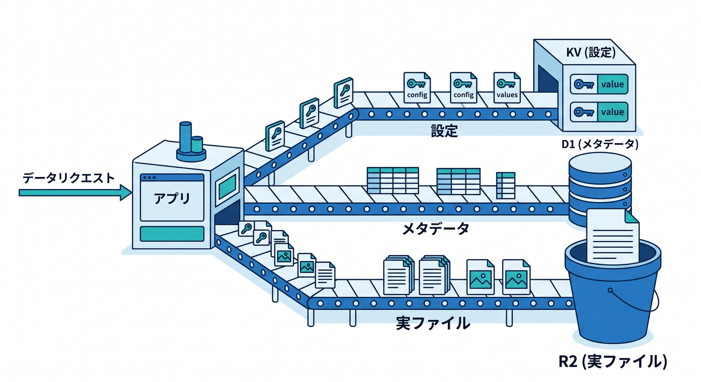

# 第10章：KV・D1・R2を“型を意識しながら”さわってみよう 🗂️🗝️🧾🖼️

この章では、Cloudflare の保存先を「機能ごとに別々に覚える」のではなく、**何をどこに置くと自然か**という地図として覚えていきます 😊
しかも今の Cloudflare では、KV・D1・R2 をただ使うだけでなく、**Worker の binding と TypeScript の型で安全に触る**のがかなり大事です。公式でも、Cloudflare サービスへは REST API より binding を使うほうが高速で、認証の手間も減るとして案内されています。さらに TypeScript は Workers の第一級言語で、`wrangler types` による型生成が推奨されています。 ([Cloudflare Docs][1])

---

## この章のゴール 🎯

この章を終えるころには、こんな感覚がついている状態を目指します ✨

* **設定値やフラグは KV**
* **表っぽいデータは D1**
* **画像や PDF などのファイルは R2**
* そして、**それらを `env` 経由で型付きで触る**

Cloudflare 公式でも、KV はグローバルな key-value ストア、D1 は SQLite 系のサーバーレス SQL データベース、R2 は大きな非構造データ向けのオブジェクトストレージとして整理されています。 ([Cloudflare Docs][2])

---

## 10-1. まずは「どこに何を置くか」の地図を作ろう 🗺️



最初に結論です。初心者のうちは、こう考えるとかなり迷いにくいです 😊

**KV** は「ちいさくて、よく読むもの」に向いています。たとえば、表示設定、機能フラグ、軽いキャッシュ、ユーザーごとの簡単な設定などです。Workers KV は Cloudflare のグローバルネットワーク上でキャッシュされる、**eventually consistent** な key-value ストアで、特に read-heavy な用途や TTL を使いたい用途に向いています。 ([Cloudflare Docs][2])

**D1** は「表形式で管理したいもの」に向いています。たとえば、記事一覧、タスク、問い合わせ履歴、ファイルのメタデータ、ユーザーごとのレコードなどです。D1 は Cloudflare の managed / serverless な SQL データベースで、SQLite の SQL セマンティクスを持ち、Workers から binding で使えます。さらに 2026年4月時点の公式では、1データベース 10GB を前提に、複数の小さめデータベースへ水平分割していく設計も案内されています。 ([Cloudflare Docs][3])

**R2** は「ファイル置き場」です。画像、PDF、音声、動画、バックアップ、AI用の元データなど、**大きめの非構造データ**を入れるときに自然です。R2 は S3 互換のオブジェクトストレージで、no egress fees が大きな特徴で、公式では web assets、user-generated content、機械学習の成果物やデータセットにも向くと説明されています。しかも R2 は **strongly consistent** です。 ([Cloudflare Docs][2])

ここで大事なのは、**KV は「速いけど何でも向き」ではない**ことです。KV は eventually consistent なので、同じキーを秒間何十回も更新するような書き込み寄りの用途には不向きです。公式でも、同じキーへの競合書き込みでは最後の書き込みが勝ちやすく、そういうケースでは Durable Objects を検討するよう案内されています。 ([Cloudflare Docs][4])

---

## 10-2. この章の主役は「binding」と「型」だよ 🔗🧠



今の Cloudflare では、KV・D1・R2 を触るとき、**`env.APP_KV` / `env.DB` / `env.FILES` のような binding 経由で扱う**のが基本です。公式でも、bindings は Worker から Cloudflare の各リソースへ直接つながる仕組みで、REST API より性能面でも制約面でも有利だと説明されています。 ([Cloudflare Docs][5])

そして TypeScript 側では、`wrangler types` を使って **Worker の設定に合った `Env` 型を生成する**のが推奨です。生成される型は、compatibility date、compatibility flags、bindings、module rules に合わせて作られます。さらに 2026年1月13日からは、`wrangler types` が Wrangler 設定内の**全 environment の bindings をまとめて型生成**するようになりました。環境ごとに違う KV や R2 を使っていても、型が欠けにくくなっています。 ([Cloudflare Docs][6])

たとえば、設定ファイルのイメージはこんな感じです 👇

```jsonc
{
  "$schema": "./node_modules/wrangler/config-schema.json",
  "name": "chapter10-storage-demo",
  "main": "src/index.ts",
  "compatibility_date": "2026-04-17",

  "kv_namespaces": [
    {
      "binding": "APP_KV",
      "id": "xxxxxxxxxxxxxxxxxxxxxxxxxxxxxxxx"
    }
  ],

  "d1_databases": [
    {
      "binding": "DB",
      "database_name": "chapter10-db",
      "database_id": "xxxxxxxx-xxxx-xxxx-xxxx-xxxxxxxxxxxx"
    }
  ],

  "r2_buckets": [
    {
      "binding": "FILES",
      "bucket_name": "chapter10-files"
    }
  ]
}
```

KV の `binding`、D1 の `binding`、R2 の `binding` は、どれも **有効な JavaScript 変数名**である必要があります。そして Worker では `env.<BINDING_NAME>` として見えるようになります。 ([Cloudflare Docs][7])

型生成はこうです 👇

```bash
npx wrangler types
```

公式では、このコマンドで `.d.ts` ファイルが既定では `worker-configuration.d.ts` として生成され、bindings に基づく `Env` 型も含まれると説明されています。さらに `tsconfig.json` の `compilerOptions.types` に追加し、**設定変更のたびに `wrangler types` を再実行する**のが勧められています。 ([Cloudflare Docs][6])

```json
{
  "compilerOptions": {
    "types": ["./worker-configuration.d.ts"]
  }
}
```

---

## 10-3. KV を触ってみよう 🗝️📦



KV は、**「ちいさくて、読み取りが多くて、多少の伝播遅れを許せるデータ」**にぴったりです。たとえば「このユーザーはダークモード？」「AI要約は short と long のどっち？」みたいな設定値です。公式でも user configuration、routing data、A/B testing configurations、authentication tokens などが代表例として挙げられています。 ([Cloudflare Docs][8])

こんな感じで使うと、かなりわかりやすいです 👇

```ts
type UserSettings = {
  theme: "light" | "dark";
  summaryMode: "short" | "long";
  aiTone: "simple" | "detailed";
};

async function saveSettings(env: Env, userId: string, settings: UserSettings) {
  await env.APP_KV.put(`settings:${userId}`, JSON.stringify(settings));
}

async function loadSettings(env: Env, userId: string): Promise<UserSettings | null> {
  const raw = await env.APP_KV.get(`settings:${userId}`);
  if (!raw) return null;

  try {
    return JSON.parse(raw) as UserSettings;
  } catch {
    return null;
  }
}
```

このコードで大事なのは、**保存先は KV でも、アプリ側では型を持って扱う**ことです。KV 自体は schema を持たないので、TypeScript 側で「この JSON はこういう形」と決めておくと、あとで画面や API とつなぐときに事故が減ります 😊

ただし、たとえば「いいね数」を同じキーに短時間で何度も書く、みたいな用途は KV ではつらいです。KV は eventually consistent で、同じキーへの競合書き込みでは最後の書き込みが勝つ形になりやすいからです。**設定・キャッシュ・フラグ**くらいの役目から始めるのが安全です。 ([Cloudflare Docs][9])

ローカル開発でも初心者がハマりやすい点があります。`wrangler dev` では、KV は**デフォルトでローカル版**が使われるので、本番や実リソースの値がそのまま見えるとは限りません。実 namespace を使いたいときは binding 側で `remote: true` を使います。 ([Cloudflare Docs][7])

---

## 10-4. D1 を触ってみよう 🧾🗃️



D1 は、**「列がある」「並び替えたい」「検索したい」「一覧にしたい」**ときに強いです。たとえば、投稿一覧、アップロード履歴、問い合わせ管理、メモ帳、TODO、ファイルのメタデータ管理などですね ✨
公式では、D1 は Workers から binding 経由で使う serverless SQL データベースで、SQLite の SQL セマンティクスを採用しています。 ([Cloudflare Docs][3])

まずは「ファイルの情報だけ D1 に持つ」発想がすごく大事です。たとえば実ファイルは R2 に置き、D1 には `id`、`title`、`file_key`、`created_at` だけ置く、という形です。こうすると、**一覧は軽く SQL で出せて、実体ファイルは必要なときだけ R2 から取れる**ようになります 😊

D1 の公式導線でも、binding を貼って `prepare()` → `bind()` → 実行、という流れが基本です。しかも TypeScript では、`run()` / `raw()` / `first()` に**行の型をジェネリクスで渡せる**ので、結果の型までかなりきれいにできます。 ([Cloudflare Docs][10])

```ts
type NoteRow = {
  id: string;
  title: string;
  file_key: string | null;
  created_at: string;
};

async function listNotes(env: Env): Promise<NoteRow[]> {
  const result = await env.DB
    .prepare(`
      SELECT id, title, file_key, created_at
      FROM notes
      ORDER BY created_at DESC
      LIMIT 20
    `)
    .run<NoteRow>();

  return result.results;
}

async function getNote(env: Env, id: string): Promise<NoteRow | null> {
  return await env.DB
    .prepare(`
      SELECT id, title, file_key, created_at
      FROM notes
      WHERE id = ?
    `)
    .bind(id)
    .first<NoteRow>();
}
```

ここでかなり大切なのが、**文字列連結で SQL を作らず、`bind()` を使う**ことです。教材では早い段階からこの癖をつけておくと、あとで入力フォームや検索とつなぐときにぐっと安全になります 😊
また、複数 SQL をまとめたいときは `batch()` もあり、公式ではレイテンシ削減に効くと説明されています。 ([Cloudflare Docs][11])

D1 はローカル開発もしやすいです。公式では、D1 は local development をフルサポートしており、Cloudflare がグローバルで動かしているものと同じ D1 をローカルで扱えると案内されています。`wrangler dev` はローカルモードが既定です。初心者にとっては、**いきなり本番 DB を触らず練習しやすい**のがかなり助かります。 ([Cloudflare Docs][12])

さらに D1 は、2026年4月時点の公式では **Time Travel** に対応していて、production backend の DB なら**過去30日以内の任意の分単位**へ復元でき、しかも有効化は不要で常時オンです。学習中に migration をミスっても、こういう安全装置があるのは安心材料です。 ([Cloudflare Docs][13])

---

## 10-5. R2 を触ってみよう 🖼️📁☁️



R2 は、**画像・PDF・CSV・音声・動画・バックアップ**みたいなファイルの置き場です。Worker からは binding でつながり、`put` / `get` / `delete` / `list` などの操作を行います。公式でも、R2 bucket は Worker から READ / LIST / WRITE / DELETE ができると説明されています。 ([Cloudflare Docs][14])

たとえば、アップロードされたファイルを保存するならこんな感じです 👇

```ts
async function uploadFile(env: Env, file: File) {
  const key = `uploads/${crypto.randomUUID()}-${file.name}`;

  await env.FILES.put(key, file.stream(), {
    httpMetadata: {
      contentType: file.type
    }
  });

  return key;
}

async function readFile(env: Env, key: string) {
  const object = await env.FILES.get(key);
  if (!object) return null;

  return new Response(object.body, {
    headers: {
      "Content-Type": object.httpMetadata?.contentType ?? "application/octet-stream"
    }
  });
}
```

このときの設計は、**ファイル本体は R2、説明やタイトルや所有者 ID は D1**、という分担にするとすごくきれいです。R2 はオブジェクトストレージなので、「一覧表示したい属性まで全部ここで管理しよう」とすると、あとで UI 側がつらくなりやすいです。

R2 の公式では、`wrangler dev` 時は **既定でローカルストレージ**を使います。実 bucket に向けて試したいときだけ `remote: true` を使います。KV と同じで、最初はローカルで安全に試せるのがうれしいところです。 ([Cloudflare Docs][14])

それから、ここは実務っぽい大事ポイントです ⚠️
もし Worker の route を通して R2 操作を公開するなら、**認可ロジックを自分で書かないと危ない**です。公式サンプルでも、公開された route のままだと誰でも bucket を触れる形になりうるので、秘密鍵やヘッダでの制御を入れるよう案内されています。秘密情報は平文の `vars` ではなく、**Secrets binding** で管理するのが公式の基本です。 ([Cloudflare Docs][14])

---

## 10-6. 3つを組み合わせると、急に“アプリらしく”なる 🌈



ここで、かなり大事な設計パターンを覚えましょう 😊

たとえば「AIメモ保管アプリ」を作るなら、こう分けると自然です。

* **KV**: ユーザーごとの表示設定、要約の長さ、実験中フラグ
* **D1**: メモ一覧、タイトル、タグ、R2 キー、生成済み要約の状態
* **R2**: 元の PDF、画像、音声、添付ファイル本体

この分担にすると、「何を検索したいのか」「何を大量保存したいのか」がはっきりして、コードも UI も整理しやすくなります ✨

しかも Cloudflare の AI 系ともつながりやすいです。Vectorize の公式チュートリアルでは、**実世界のアプリでは R2 や D1 から内容を読み、それを Workers AI に渡して埋め込み生成する**流れが示されています。つまり、第10章のストレージ設計は、あとで第12章・第13章の AI 学習へ、そのまま橋になります。 ([Cloudflare Docs][15])

R2 自体も、公式では web assets や user-generated content だけでなく、**machine learning model artifacts や datasets** の保存先として挙げられています。なので「AIをやるから保存設計は後回し」ではなく、**AIをやるほど保存設計が大事**なんです 🤖📦 ([Cloudflare Docs][16])

---

## 10-7. Copilot と AI をどう混ぜると学びやすい？ 🤖💬

この章では、GitHub Copilot を**コードの自動生成機**としてだけでなく、**型と設計を説明してくれる家庭教師**みたいに使うのがおすすめです 😊

たとえば VS Code 上で、こんな聞き方がかなり相性いいです。

* 「この `wrangler.jsonc` の binding を初心者向けに説明して」
* 「この D1 の SQL を `bind()` つきに書き換えて」
* 「R2 本体と D1 メタデータを分ける理由を 3 行で説明して」
* 「この KV の JSON を TypeScript 型付きで扱う helper を作って」

さらに本日時点の公式情報を見ると、GitHub Copilot Chat は **VS Code 1.99+ で MCP サーバーを構成可能**です。一方 Cloudflare 側は、Workers の docs MCP サーバーや、**storage / AI / compute primitives を扱う Workers Bindings MCP サーバー**を公開しています。なので、この2つを組み合わせれば、**Copilot Chat に最新の Cloudflare 文脈を与えながら学ぶ構成も取りやすい**と考えてよいです。これは公式情報を組み合わせた実践的な読み方です。 ([GitHub Docs][17])

Cloudflare 公式自身も、Workers 開発では VS Code を含むエディタやエージェントに対して prompt ベースでアプリを作る流れや、docs MCP で Workers を教える流れを案内しています。2026年の学習では、**人が全部暗記する**より、**型・binding・公式文脈を AI にちゃんと渡して相談する**のがかなり自然です。 ([Cloudflare Docs][18])

---

## 10-8. この章のミニ課題 🧪🎓

最後に、この章の理解を固めるためのおすすめ課題です ✨

**課題1：KV だけで設定保存**
「ダークモード」「AI要約は short / long」「新機能ON/OFF」を KV に保存する。

**課題2：D1 でメモ一覧**
`notes` テーブルを作って、一覧・1件取得・追加だけ作る。

**課題3：R2 にファイル保存**
アップロードしたテキストか画像を R2 に保存し、D1 に `file_key` を記録する。

**課題4：3つを連携**
「一覧は D1」「表示設定は KV」「添付ファイルは R2」の1本の小さな Worker API を作る。

この順番で進めると、**保存先をサービス名で暗記する勉強**ではなく、**設計の理由ごと理解する勉強**になります 😊

---

## まとめ 🌟

この章で一番大事なのは、次の3つです。

* **KV は“軽い設定・キャッシュ・フラグ”**
* **D1 は“表で持ちたいデータ”**
* **R2 は“ファイル本体”**

そして、その全部を **binding + 型付き `Env`** で扱うことです。Cloudflare の最新公式でも、bindings 利用と `wrangler types` による型生成がかなり強く推されています。ここを押さえると、第11章の Node.js 互換の話にも、第12章以降の Workers AI / Vectorize / AI Search にも、すごくきれいにつながります 🚀✨ ([Cloudflare Docs][1])

必要なら次に、このまま続けて **第10章の「実習コード一式」版** も作れます。

[1]: https://developers.cloudflare.com/changelog/post/2026-02-15-workers-best-practices/ "New Best Practices guide for Workers · Changelog"
[2]: https://developers.cloudflare.com/workers/platform/storage-options/ "Choosing a data or storage product. · Cloudflare Workers docs"
[3]: https://developers.cloudflare.com/d1/ "Overview · Cloudflare D1 docs"
[4]: https://developers.cloudflare.com/kv/concepts/how-kv-works/ "How KV works · Cloudflare Workers KV docs"
[5]: https://developers.cloudflare.com/workers/runtime-apis/bindings/ "Bindings (env) · Cloudflare Workers docs"
[6]: https://developers.cloudflare.com/workers/languages/typescript/ "Write Cloudflare Workers in TypeScript · Cloudflare Workers docs"
[7]: https://developers.cloudflare.com/kv/concepts/kv-bindings/ "KV bindings · Cloudflare Workers KV docs"
[8]: https://developers.cloudflare.com/kv/get-started/?utm_source=chatgpt.com "Getting started · Cloudflare Workers KV docs"
[9]: https://developers.cloudflare.com/kv/reference/faq/ "FAQ · Cloudflare Workers KV docs"
[10]: https://developers.cloudflare.com/d1/worker-api/ "Workers Binding API · Cloudflare D1 docs"
[11]: https://developers.cloudflare.com/d1/worker-api/d1-database/ "D1 Database · Cloudflare D1 docs"
[12]: https://developers.cloudflare.com/d1/best-practices/local-development/ "Local development · Cloudflare D1 docs"
[13]: https://developers.cloudflare.com/d1/reference/time-travel/ "Time Travel and backups · Cloudflare D1 docs"
[14]: https://developers.cloudflare.com/r2/api/workers/workers-api-usage/ "Use R2 from Workers · Cloudflare R2 docs"
[15]: https://developers.cloudflare.com/vectorize/get-started/embeddings/ "Vectorize and Workers AI · Cloudflare Vectorize docs"
[16]: https://developers.cloudflare.com/r2/ "Overview · Cloudflare R2 docs"
[17]: https://docs.github.com/ja/copilot/how-tos/provide-context/use-mcp-in-your-ide/extend-copilot-chat-with-mcp "モデル コンテキスト プロトコル (MCP) サーバーを使用した GitHub Copilot Chatの拡張 - GitHubドキュメント"
[18]: https://developers.cloudflare.com/workers/get-started/prompting/ "Prompting · Cloudflare Workers docs"