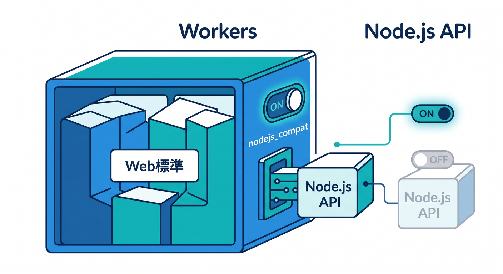
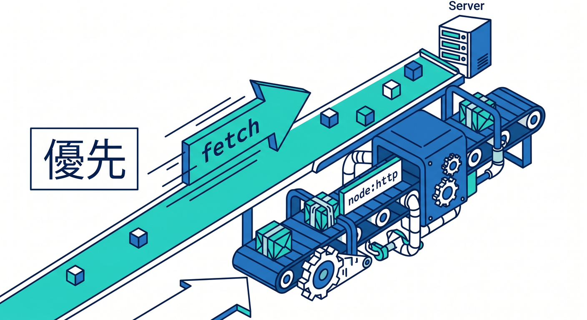
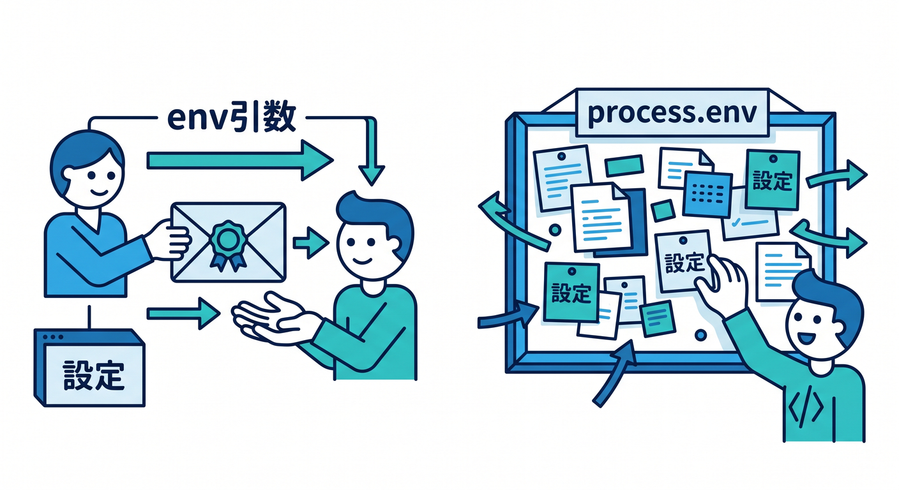
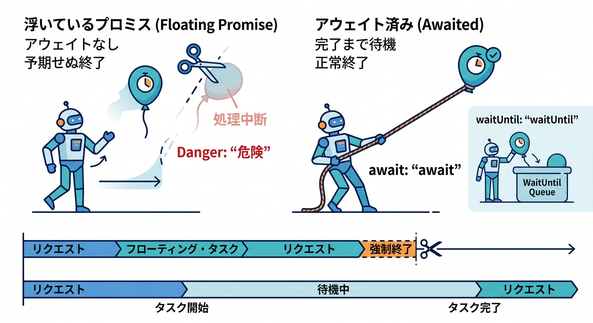
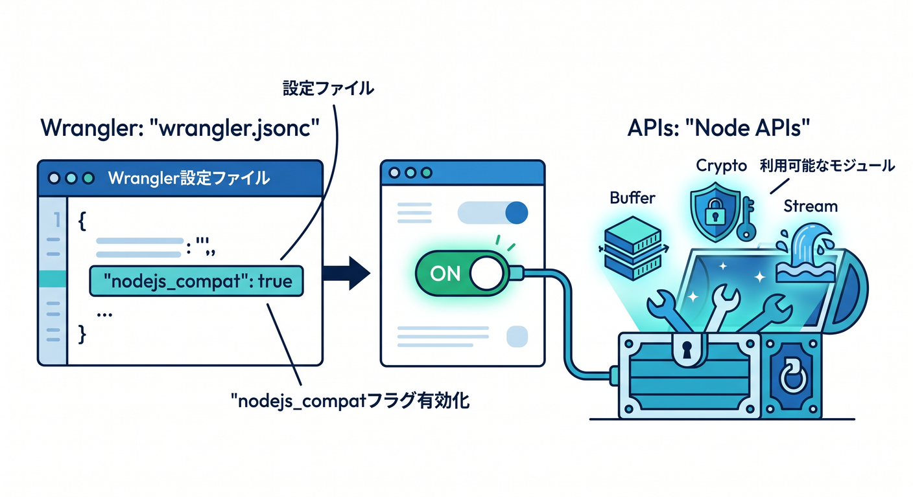
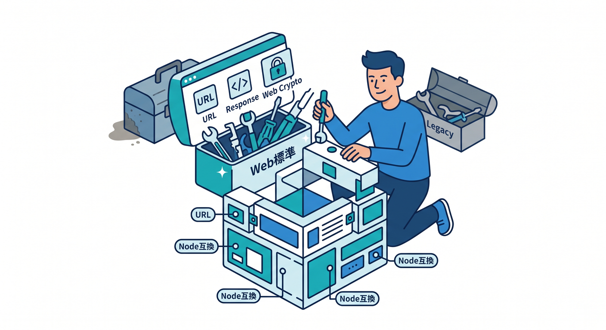

# 第11章：Node.js感覚との違いを知ろう！nodejs_compatはどこで使う？ 🔌📦

この章では、**「Cloudflare Workers は Node.js そのものではない」**という大事な感覚を、やさしく体で覚えていきます😊
Cloudflare Workers の実行環境は、できるだけ **Web 標準ベース** で作られていて、そのうえで **Node.js API の一部を使えるようにする仕組み** が用意されています。2026年4月時点の公式案内でも、まずは Web 互換な考え方をベースにしつつ、必要なら **nodejs_compat** を有効化する流れが中心です。 ([Cloudflare Docs][1])

この章のゴールは、次の4つです✨
1つ目は、**Node.js の常識がそのまま全部は通らない**ことを理解すること。
2つ目は、**どんなときに nodejs_compat が必要か**を判断できること。
3つ目は、**Web 標準で書ける部分は素直に Web 標準で書く**こと。
4つ目は、**npm パッケージを導入するときの見極め力**をつけることです。 ([Cloudflare Docs][1])

---

## 1. まず最初に結論です 🎯



いちばん大事なのは、**Workers は「Node.js サーバー」ではなく、「Web 標準寄りのサーバーレス実行環境」**だと考えることです🌍
Cloudflare 公式は Workers runtime を **JavaScript standards compliant / web-interoperable** と説明していて、Node.js API は「必要なものを一部互換提供する」という位置づけです。つまり、頭の中の優先順位は **fetch / Request / Response / URL / Web Crypto が先、Node.js API は後** がいちばん自然です。 ([Cloudflare Docs][1])

この考え方を先に持っておくと、あとでかなりラクです😊
たとえば「HTTP通信だから node:http を使うはず」「設定値は process.env から読むはず」「非同期処理は投げっぱなしでもなんとかなるはず」という発想が、Workers ではズレることがあります。逆に、**ブラウザ寄りの感覚**で見ると「なるほど、これは fetch で書けばいいのか」とすんなり理解できます。 ([Cloudflare Docs][2])

---

## 2. Node.js感覚のままだと、どこでつまずくの？ 😵‍💫

### 2-1. HTTP通信は、まず fetch で考えるのが自然 📮



Workers では、HTTP の基本は **fetch / Request / Response** です。
Node.js の **http.get** や **http.request** も互換機能として使えますが、Cloudflare 公式でもそれらは **内部的に fetch のラッパー** と説明されていて、さらに **ハンドラーの外では使えない** など、Node 本家と同じ気分で雑に使うと混乱しやすいです。 ([Cloudflare Docs][2])

つまり初心者目線では、こう覚えるのが安全です💡
**自分で新しく書くコードは fetch を使う。**
**既存の npm ライブラリや Node 資産を動かしたいときに node:http 系を受け入れる。**
この順番だと、Cloudflare らしい書き方と Node 互換の使い分けがきれいに整理できます。 ([Cloudflare Docs][2])

### 2-2. 設定値は、まず env を見る 👀



Workers では、環境変数や各種バインディングは **fetch ハンドラーの env 引数**から受け取るのが基本です。Cloudflare の環境変数ドキュメントでも、環境変数は **env parameter** に渡されると案内されています。 ([Cloudflare Docs][3])

一方で **process.env** は、Node.js の本物のプロセス環境そのものではありません。Cloudflare の process ドキュメントでは、Workers には **process-level environment がない**ので、デフォルトでは **process.env は空オブジェクト**だと説明されています。そのうえで、**nodejs_compat** と **nodejs_compat_populate_process_env** により、互換目的で環境変数や secrets が **process.env** に入る仕組みがあります。しかもこの populate は、**2025-04-01 以降の compatibility date では既定有効**です。 ([Cloudflare Docs][4])

なので実務的には、こう考えると迷いません✨
**自分のアプリ本体では env を主役にする。**
**Node系ライブラリ互換のために process.env が必要なら使う。**
この考え方が、いちばん事故りにくいです。これは公式の env / process の仕様を踏まえた、かなり安全な運用ルールです。 ([Cloudflare Docs][3])

### 2-3. リクエストごとの値をグローバル変数に置かない 🚫

Workers は **isolate を再利用**します。
Cloudflare の Best Practices では、**リクエスト単位の状態をグローバルスコープに置くと、次のリクエストへ漏れる**可能性があり、データ混線や I/O エラーの原因になるとはっきり書かれています。 ([Cloudflare Docs][5])

Node.js のローカル開発ではたまたま動いて見えても、Workers では「前の人の値が残ってる😨」みたいな事故につながることがあります。
だから、**ユーザーID・トークン・フォーム入力・途中結果**みたいな値は、関数の引数やローカル変数で受け渡す癖をつけましょう。 ([Cloudflare Docs][5])

### 2-4. Promiseの投げっぱなしはダメ 🙅‍♂️



Cloudflare の Best Practices では、**await も return も waitUntil もされていない Promise** を floating promise として明確に注意しています。Workers runtime は、その Promise が終わる前に isolate を終了することがあり、**結果が消える・エラーが握りつぶされる・処理が途中で終わる** ことがあります。 ([Cloudflare Docs][5])

Node.js の「まあそのうち終わるでしょ」感覚を持ち込まず、
**返答前に必要な処理は await**、
**返答後に続けたい処理は ctx.waitUntil()**、
この2択で整理するとすごく分かりやすいです✨ ([Cloudflare Docs][5])

### 2-5. ボディはストリーミング。読み直せないことがある 🌊

Workers runtime は、リクエストボディやレスポンスボディを **バッファせず、ストリーミングで扱う** と公式に説明されています。そのため、すでに消費したボディをエラー時にもう一度使いたくても、そのままでは無理なケースがあります。 ([Cloudflare Docs][6])

ここも Node.js の感覚と少しズレやすいところです。
「あとでもう一回読もう」は危険なので、必要なら **clone** する、または **読んだらすぐ処理を終える** という流れを意識すると安定します。 ([Cloudflare Docs][6])

---

## 3. nodejs_compat って結局なに？ 🧩

**nodejs_compat** は、Cloudflare Workers に **Node.js の組み込み API とポリフィル**を追加して、Node 寄りの npm パッケージを動かしやすくするための compatibility flag です。公式では、これを有効にすると **built-in Node APIs** と **Wrangler による polyfill** の両方が使えるようになると説明されています。 ([Cloudflare Docs][7])

2026年4月時点の公式では、**compatibility date を 2024-09-23 以降**にし、Wrangler 設定へ **nodejs_compat** を追加するのが基本です。さらに Cloudflare の compatibility flags ドキュメントでは、**nodejs_compat を有効にすると nodejs_compat_v2 も有効になる** と案内されています。 ([Cloudflare Docs][7])

ただし、ここで大事なのは「有効にすれば全部 Node そのものになる」わけではないことです⚠️
公式には、Workers が提供する Node API には **フル実装のもの**もあれば、**部分実装**や **import はできるけど実行するとエラーになる stub** もあるとはっきり書かれています。Polyfill された API は、呼ぶと **[unenv] ～ is not implemented yet!** のようなエラーになることもあります。 ([Cloudflare Docs][7])

つまり、**nodejs_compat は魔法のスイッチではなく、互換性をかなり広げてくれる実用的な補助輪**だと思うのがちょうどいいです😊 ([Cloudflare Docs][7])

---

## 4. どんなときに nodejs_compat を使うの？ 🤔



初心者向けに、かなり実用的な判断ルールを先に置いておきます👇

* **新しく自分で書く Worker が、fetch / Request / Response / URL / Web Crypto だけで足りる**
  → まず **nodejs_compat なし** で始めるのがおすすめです。Workers runtime は Web 標準寄りで、Cloudflare も Web 互換性を前面に出しています。 ([Cloudflare Docs][1])

* **導入したい npm パッケージが node:buffer / node:crypto / node:stream / process / path などを前提にしている**
  → **nodejs_compat を有効にする価値が高い**です。Cloudflare の Best Practices でも、nodejs_compat はこれらの built-in modules 由来の import エラー回避に役立つと案内されています。 ([Cloudflare Docs][8])

* **既存の Node.js コード資産を持ち込みたい**
  → **nodejs_compat を前提に移植**するのが現実的です。Cloudflare 公式には Express.js を Workers 上で動かすチュートリアルもあり、そこでも **nodejs_compat が必要**だと案内されています。 ([Cloudflare Docs][9])

* **AsyncLocalStorage だけ欲しい**
  → フルの互換ではなく **nodejs_als** だけ有効化する方法もあります。公式ドキュメントにも専用フラグが載っています。 ([Cloudflare Docs][7])

この章では、いちばん覚えてほしい合言葉をひとつだけ置いておきます🌟
**「まず Web 標準、必要なら nodejs_compat」**
これでかなり迷いが減ります。 ([Cloudflare Docs][1])

---

## 5. まずは設定してみよう 🛠️

Cloudflare 公式の現在の導線では、**nodejs_compat** を使うなら Wrangler 設定に compatibility flag を書き、compatibility date を現在日付に近いものへ保つのが基本です。さらに TypeScript では、**wrangler types** で runtime 型を生成し、**nodejs_compat を使うなら @types/node を追加**する流れが推奨されています。 ([Cloudflare Docs][7])

## 5-1. wrangler.jsonc の例

```jsonc
{
  "$schema": "./node_modules/wrangler/config-schema.json",
  "name": "chapter11-node-compat",
  "main": "src/index.ts",
  "compatibility_date": "2026-04-17",
  "compatibility_flags": ["nodejs_compat"],
  "vars": {
    "APP_MODE": "dev"
  }
}
```

## 5-2. 型を生成するコマンド

```bash
npx wrangler types
npm i -D @types/node
```

## 5-3. tsconfig.json の例

```json
{
  "compilerOptions": {
    "target": "ES2022",
    "module": "ESNext",
    "moduleResolution": "Bundler",
    "strict": true,
    "types": ["./worker-configuration.d.ts", "node"]
  }
}
```

この流れにしておくと、**Cloudflare runtime の型**と**Node 互換 API の型**の両方が VS Code で補完されやすくなります。
とくに **wrangler types** は、compatibility date や compatibility flags に合わせて型を生成してくれるので、2026年の公式方針としてかなり重要です。 ([Cloudflare Docs][10])

---

## 6. まずは「nodejs_compat なし」で書けるコードを見よう 🌱



ここが超大事です😊
Workers では、下のようなコードは **Node.js 互換なし** でも自然に書けます。URL 解析、JSON 応答、外部 HTTP 通信、ランダム ID 発行など、かなり多くの場面で **Web 標準 API だけで十分**です。Cloudflare の Best Practices でも、セキュアな乱数生成は **Web Crypto** を使う例が前面に出ています。 ([Cloudflare Docs][5])

```ts
export default {
  async fetch(request: Request, env: Env): Promise<Response> {
    const url = new URL(request.url);

    if (url.pathname === "/token") {
      return Response.json({
        sessionId: crypto.randomUUID(),
        mode: env.APP_MODE,
        now: new Date().toISOString()
      });
    }

    const upstream = await fetch("https://example.com/");
    return new Response(await upstream.text(), {
      headers: { "content-type": "text/html; charset=utf-8" }
    });
  }
} satisfies ExportedHandler<Env>;
```

この時点で、「あれ、思ったより Node.js いらないかも 😳」と感じられたら大成功です。
Cloudflare Workers は最初から **fetch / URL / Request / Response / Web Crypto** が強いので、まずここを自分のホームポジションにしておくと学習効率が上がります。 ([Cloudflare Docs][1])

---

## 7. 次に「nodejs_compat あり」で書くコードを見よう 🔧

では、Node 互換を有効にしたときの例です。
たとえば **Buffer** や **process.env** を使うライブラリ互換を意識したいとき、こんな感じで書けます。Workers では process 周りに独自の事情があるので、ここは「使えるけど、本物の Node プロセスと同一ではない」と意識しておくのがポイントです。 ([Cloudflare Docs][4])

```ts
import { Buffer } from "node:buffer";
import * as process from "node:process";
import path from "node:path";

export default {
  async fetch(request: Request, env: Env): Promise<Response> {
    process.env.APP_MODE ??=
      typeof env.APP_MODE === "string" ? env.APP_MODE : "unknown";

    const url = new URL(request.url);

    if (url.pathname === "/decode") {
      const encoded = url.searchParams.get("text") ?? "";
      const decoded = Buffer.from(encoded, "base64").toString("utf8");

      return Response.json({
        decoded,
        mode: process.env.APP_MODE,
        examplePath: path.join("/bundle", "data", "sample.txt")
      });
    }

    return new Response("OK");
  }
} satisfies ExportedHandler<Env>;
```

この例で学んでほしいのは3つです✨
1つ目は、**Buffer や path のような Node 文化の API が使える**こと。
2つ目は、**process.env は互換用に見えるけど、アプリ本体では env を基準にしたほうが安全**なこと。
3つ目は、**使える = 何でも Node.js 流で書くべき、ではない**ことです。 ([Cloudflare Docs][4])

---

## 8. node:http を使うと、なぜ少し不自然に感じるの？ 🌊➡️📦

Cloudflare の **node:http** 実装はかなり便利ですが、公式ドキュメントを読むと、**内部的には fetch のラッパー**であり、**ハンドラーの外で使えない**、**Promise をきちんと待たないと早く終了しうる** など、Workers の流儀に合わせた注意が必要です。 ([Cloudflare Docs][2])

たとえばこんな感じです。

```ts
import { get } from "node:http";

export default {
  async fetch(): Promise<Response> {
    const { promise, resolve, reject } = Promise.withResolvers<Response>();

    get("http://example.org", (res) => {
      let data = "";
      res.setEncoding("utf8");
      res.on("data", (chunk) => {
        data += chunk;
      });
      res.on("end", () => {
        resolve(new Response(data));
      });
      res.on("error", reject);
    }).on("error", reject);

    return promise;
  }
} satisfies ExportedHandler;
```

もちろん動く場面はあります👍
でも、**新規コードなら普通の fetch のほうが短く、読みやすく、Workers っぽい**です。
この章では、あえてこの違いを見せることで、**互換 API は「移植の助け」**であって、**新規実装の第一選択とは限らない**と理解してもらうのが狙いです。 ([Cloudflare Docs][2])

ちなみに、Cloudflare の compatibility flags ドキュメントでは、**node:http / node:https モジュールは 2025-09-01 以降の compatibility date なら nodejs_compat と一緒に自動有効**と案内されています。 ([Cloudflare Docs][11])

---

## 9. 2026年時点で「かなり使えるもの」と「まだ注意がいるもの」 📚

Cloudflare の Node.js compatibility 一覧では、**Buffer / Crypto / DNS / File system / HTTP / HTTPS / Net / Path / Process / Stream / Timers / URL / Utilities / Zlib** などが supported として載っています。ここは 2026年時点でかなり実用的です。 ([Cloudflare Docs][7])

一方で、**child_process / cluster / HTTP2 / readline / REPL / UDP(datagram) / VM / V8** などは **partially supported** もしくは **non-functional** とされています。さらに **Node の test runner は未対応**、**node:sqlite は not yet supported** です。
なので、npm パッケージを見たときは「import できるか」だけでなく、**中でどの Node API を本当に呼んでいるか**を見る癖が大切です。 ([Cloudflare Docs][7])

ここは授業で必ず口にしたいひとことです🗣️
**「import が通った = そのライブラリが完全対応、ではない」**
この感覚があるだけで、ハマり方がかなり減ります。 ([Cloudflare Docs][7])

---

## 10. node:fs は使えるの？ 使えます。でも“普通のサーバーのディスク”ではありません 📁

2026年時点の Cloudflare 公式では、**node:fs** は **nodejs_compat** を有効にし、**compatibility date が 2025-09-01 以降**なら既定で利用できます。これはかなり大きな進化です。 ([Cloudflare Docs][12])

ただし、ここでも **Node.js のローカルディスクそのもの** と考えると危険です⚠️
Cloudflare の fs ドキュメントには、**watch 系が未対応**、**glob API が未実装**、**タイムスタンプは常に Unix epoch**、**権限や所有者は未対応** などの制限が明記されています。process のドキュメントでも **cwd は /bundle** と説明されています。 ([Cloudflare Docs][12])

なので授業では、こう教えると分かりやすいです😊
**R2 や KV や D1 の代わりに fs を使う章ではない。**
**「Node ライブラリ互換のために /bundle 内のファイルが読める場面がある」**
このくらいの理解で十分です。 ([Cloudflare Docs][12])

---

## 11. process.env は便利そう。でも主役にしないほうがいい理由 🌿

もう一度ここを整理します。
Cloudflare 公式では、Workers には本来 **process-level environment がない** とされています。そのため、**env 引数**こそが本来の設定入口です。 ([Cloudflare Docs][4])

それでも **process.env** が重要なのは、**Node 前提ライブラリの互換**です。
たとえば「この SDK は process.env.API_KEY を読みにいく」みたいなケースでは助かります。
でも自分の授業コードまで全部 process.env 寄りにすると、Workers 本来の設計から少し離れてしまいます。だからこの教材では、**自分で書くコードは env、中継や互換で必要なときだけ process.env** という教え方を採用するのが自然です。 ([Cloudflare Docs][4])

---

## 12. Express や古い Node 資産を持ってきたいときは？ 🚚

Cloudflare 公式には、**Express.js を Workers 上で動かすチュートリアル**があり、そこで **nodejs_compat が必要**だと案内されています。また **http.createServer** と **httpServerHandler** によって、Node.js の HTTP サーバーパターンを Workers の request model へ橋渡しする仕組みもあります。 ([Cloudflare Docs][9])

つまり、昔ながらの Node コードを全部捨てる必要はありません🙌
ただし学習順としては、
**最初から Express に寄せる** より、
**まず Workers ネイティブを理解し、その後で互換レイヤーとして使う**
この順番のほうが、圧倒的に理解しやすいです。 ([Cloudflare Docs][2])

---

## 13. ローカル開発とテストでも「Workersとして動かす」意識が大事 🧪

Cloudflare の **Vite plugin** は、ローカルでも Worker コードを **workerd** の中で動かし、本番挙動へ近づける仕組みです。公式にも「production behavior as closely as possible」とあります。 ([Cloudflare Docs][13])

また、テストでは Cloudflare は **Workers Vitest integration** を推奨していて、**@cloudflare/vitest-pool-workers** により **Workers runtime の中でテスト**を回せます。さらにローカル開発時は、**wrangler dev や vite dev で KV / D1 / R2 などのローカル版リソースが自動で作られる** と案内されています。 ([Cloudflare Docs][14])

この章ではここもとても大事です✨
**npm パッケージが Workers で本当に動くか** は、普通の Node テストだけでは見抜けないことがあります。
だから「Node で通った」より、**Workers runtime で通った**を信じる癖をつけるのが強いです。 ([Cloudflare Docs][14])

---

## 14. Copilot と AI を、この章でどう使う？ 🤖💬

GitHub の公式ドキュメントでは、**MCP は Copilot を外部ツールやデータソースとつなぐための仕組み**です。さらに GitHub MCP server は GitHub 提供で、**VS Code では remote 構成が推奨**されています。 ([GitHub Docs][15])

また Cloudflare 公式には、**Workers の API とベストプラクティスを前提に AI へ渡すための base prompt** まで公開されています。
つまり 2026年の学習では、
**「Copilot に Node ライブラリの依存 API を洗わせる」**
**「Cloudflare 公式の文脈を与えて Workers 向けに書き換えさせる」**
という使い方がかなり実践的です。 ([Cloudflare Docs][16])

この章で Copilot へ投げると効果的な質問例も置いておきます💡

* 「この npm パッケージは node:buffer / process / child_process のどれに依存していますか？」
* 「このコードを Cloudflare Workers 向けの Web 標準 API 中心に書き換えてください」
* 「この import 群のうち、nodejs_compat が必要なものだけ挙げてください」
* 「Workers runtime で危ない global state や floating promise がないか点検してください」

こういう聞き方をすると、ただコードを書かせるよりずっと勉強になります😊
Cloudflare 側も AI 活用のための prompting ガイドを用意しているので、**AIに丸投げする**より **Cloudflare 文脈を渡して一緒に直す** ほうが、かなり精度が上がります。 ([Cloudflare Docs][16])

---

## 15. CloudflareのAIサービスもここで軽くつないでおこう 🚀🤖

この章の主役は互換性ですが、Cloudflare の AI サービスとも相性がいいです。
Cloudflare の Workers AI は、**Wrangler で AI binding を追加すると env.AI から使える**仕組みで、**Workers からそのまま AI モデルを呼べる**ようになっています。公式では、Workers AI は **serverless GPUs** 上でモデルを動かす形として案内されています。 ([Cloudflare Docs][17])

なので、この章の終わりではこんな発想を持てると最高です✨
**「この npm パッケージの README を Workers AI に要約させ、Node依存っぽい記述を抜き出す」**
**「import 一覧を AI に渡して、Web標準だけで置き換えられるか判定させる」**
こういう“学習補助AI”の発想は、次章の Workers AI へつながるきれいな橋になります。 ([Cloudflare Docs][17])

---

## 16. この章でやるハンズオン案 ✍️🎮

### ハンズオン1：Web標準だけの Worker を作る 🌐

* URL からクエリを読む
* Response.json で返す
* crypto.randomUUID で ID を作る
* 外部 API を fetch する

この課題の狙いは、**「あ、Nodeなしでもかなり書ける」** を体感することです。 ([Cloudflare Docs][1])

### ハンズオン2：nodejs_compat を有効にして Buffer を使う 📦

* base64 をデコードする
* path.join を触る
* process.env と env の違いを観察する

この課題の狙いは、**互換 API の便利さ**と**Workers独自の作法**の両方を知ることです。 ([Cloudflare Docs][4])

### ハンズオン3：わざと危ないコードを書いて直す 🔥

* グローバル変数にユーザーIDを入れる
* await なしで fetch する
* request body を2回読もうとする

この課題の狙いは、**Workers でやってはいけないこと**を早めに経験することです。 ([Cloudflare Docs][5])

### ハンズオン4：npm パッケージ適性チェック 🕵️

* 1つは軽いユーティリティ系ライブラリ
* 1つは Node色が強いライブラリ
* Copilot に依存 API を洗い出させる
* 実際に Workers runtime で動かしてみる

この課題の狙いは、**nodejs_compat を使う / 使わないの判断力**を鍛えることです。 ([Cloudflare Docs][7])

---

## 17. よくあるエラーと考え方 💥

**「node:crypto が解決できない」**
→ まず **nodejs_compat** が有効か、**compatibility date** が十分新しいかを確認します。TypeScript なら **wrangler types** と **@types/node** も見直します。 ([Cloudflare Docs][7])

**「import は通るのに実行すると [unenv] not implemented」**
→ その API は polyfill されているだけで、実動作は未対応の可能性があります。**別ライブラリへ変える**か、**Web 標準 API へ書き換える**発想が必要です。 ([Cloudflare Docs][7])

**「process.env に値がない」**
→ 本来の入口は **env 引数**です。互換の process.env は補助と考え、必要なら flag と compatibility date を確認します。 ([Cloudflare Docs][4])

**「await していない fetch の結果が消える」**
→ Workers では floating promise が危険です。**await** するか **ctx.waitUntil()** を使います。 ([Cloudflare Docs][5])

**「例外時に request body が再利用できない」**
→ Workers は body をバッファしません。必要なら **clone** して扱います。 ([Cloudflare Docs][6])

---

## 18. この章のまとめ 🌈

この章のいちばん大事な学びは、**Cloudflare Workers を Node.js の置き換えとしてだけ見るのではなく、Web 標準ベースの別ランタイムとして理解すること**です。Workers runtime は Web 互換を重視しつつ、2026年時点では **nodejs_compat** によってかなり多くの Node.js API を実用的に扱えるようになっています。 ([Cloudflare Docs][1])

ただし、互換性は強くなっていても、**global state の扱い**、**floating promises**、**streaming body**、**process.env の意味**など、Workers 独自の考え方はちゃんと残っています。ここを先に整理しておくと、第12章の **Workers AI** でも、第13章以降の実用機能でも、かなりスムーズに登れます😊 ([Cloudflare Docs][5])

この章の合言葉を最後にもう一度だけ置いておきます🎉
**まず Web 標準。必要なら nodejs_compat。**
これでいきましょう ☁️⚛️📦🤖

必要なら次に、そのまま続けて **第11章の「演習問題セット」「確認テスト10問」「教材用サンプルプロジェクト構成」までまとめて作成**します。

[1]: https://developers.cloudflare.com/workers/runtime-apis/ "Runtime APIs · Cloudflare Workers docs"
[2]: https://developers.cloudflare.com/workers/runtime-apis/nodejs/http/ "http · Cloudflare Workers docs"
[3]: https://developers.cloudflare.com/workers/configuration/environment-variables/ "Environment variables · Cloudflare Workers docs"
[4]: https://developers.cloudflare.com/workers/runtime-apis/nodejs/process/ "process · Cloudflare Workers docs"
[5]: https://developers.cloudflare.com/workers/best-practices/workers-best-practices/ "Workers Best Practices · Cloudflare Workers docs"
[6]: https://developers.cloudflare.com/workers/runtime-apis/context/ "Context (ctx) · Cloudflare Workers docs"
[7]: https://developers.cloudflare.com/workers/runtime-apis/nodejs/ "Node.js compatibility · Cloudflare Workers docs"
[8]: https://developers.cloudflare.com/workers/best-practices/workers-best-practices/?utm_source=chatgpt.com "Workers Best Practices"
[9]: https://developers.cloudflare.com/workers/tutorials/deploy-an-express-app/?utm_source=chatgpt.com "Deploy an Express.js application on Cloudflare Workers"
[10]: https://developers.cloudflare.com/workers/languages/typescript/ "Write Cloudflare Workers in TypeScript · Cloudflare Workers docs"
[11]: https://developers.cloudflare.com/workers/configuration/compatibility-flags/ "Compatibility flags · Cloudflare Workers docs"
[12]: https://developers.cloudflare.com/workers/runtime-apis/nodejs/fs/ "fs · Cloudflare Workers docs"
[13]: https://developers.cloudflare.com/workers/vite-plugin/?utm_source=chatgpt.com "Vite plugin · Cloudflare Workers docs"
[14]: https://developers.cloudflare.com/workers/testing/vitest-integration/?utm_source=chatgpt.com "Vitest integration - Workers"
[15]: https://docs.github.com/en/copilot/concepts/context/mcp "About Model Context Protocol (MCP) - GitHub Docs"
[16]: https://developers.cloudflare.com/workers/get-started/prompting/ "Prompting · Cloudflare Workers docs"
[17]: https://developers.cloudflare.com/workers-ai/configuration/bindings/?utm_source=chatgpt.com "Workers Bindings · Cloudflare Workers AI docs"