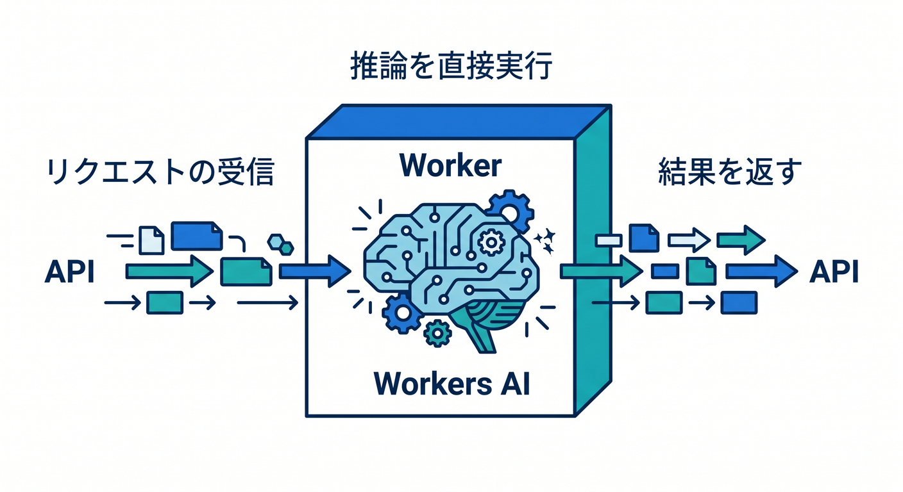
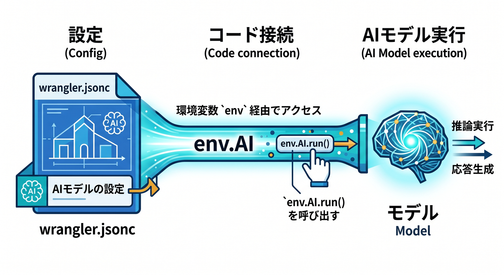
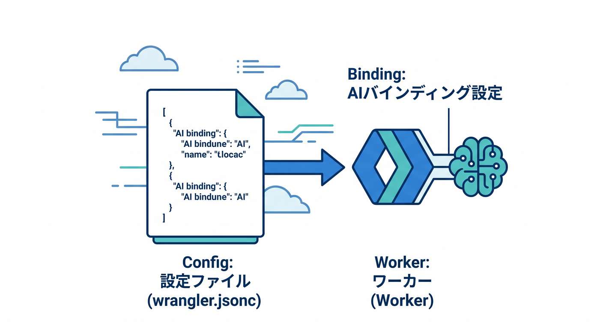
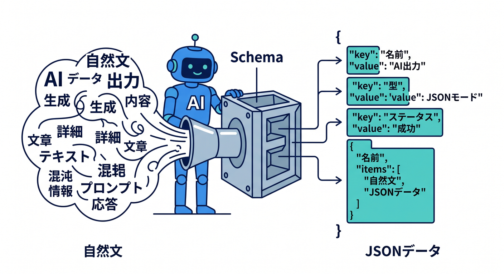
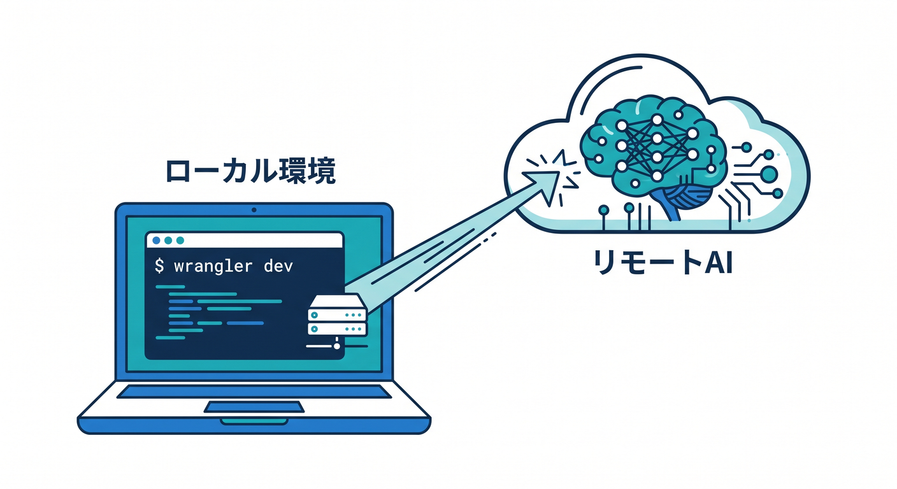
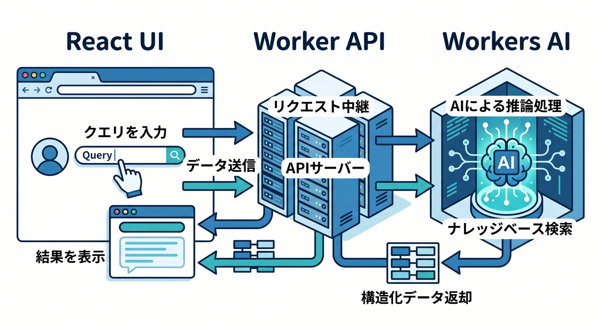
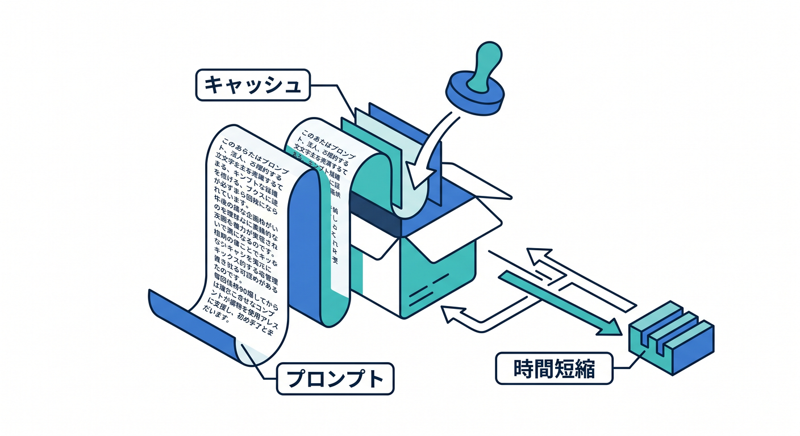

# 第12章：Workers AIで、AIつきAPIを1本作ろう 🤖✨

この章では、CloudflareのAI機能を「ちょっと触ってみた」で終わらせず、**ちゃんと1本のAPIとして動く形**まで持っていきます 💪
本日時点の公式導線では、Workers AI は Worker に **AI binding** を追加して、コード側から **env.AI.run()** でモデルを呼ぶ形が基本です。設定ファイルは **wrangler.jsonc** が推奨され、型は **wrangler types** で生成する流れが中心です。さらに、Workers AI のモデルカタログには、テキスト生成だけでなく、要約・分類・埋め込み・画像・音声など幅広いタスクが並んでいます。([Cloudflare Docs][1])

この章のゴールは、**文章を受け取って、要約・分類・キーワード抽出を返すAI API** を作ることです 📬🧠
ただ「AIに聞いて返す」だけだと、返答の形が毎回ブレやすいです。なので今回は、Cloudflare公式でも案内されている **JSON Mode** を使って、**決まった形のJSONを返すAI API** にします。ここが実用の第一歩です。([Cloudflare Docs][2])

---

## 1. この章でできるようになること 🎯

この章を終えるころには、こんなことができるようになります ✨

* Worker から Workers AI を呼べる
* AI binding の意味がわかる
* AIの返答を自然文ではなくJSONで受け取れる
* TypeScriptでAIレスポンスを安全に扱える
* ローカルで試してからデプロイできる
* Reactの画面からAI APIを呼ぶ入口が見える

---

## 2. まずは全体像をつかもう 🗺️☁️



今回作るものの流れは、とてもシンプルです 😊

1. ブラウザやReact画面から文章を送る
2. Worker がその文章を受け取る
3. Worker の中で Workers AI を呼ぶ
4. AI が「要約」「分類」「キーワード」をJSONで返す
5. Worker がそのJSONをそのままフロントへ返す

つまり、**AIは単体で使うのではなく、Workerの中の1機能として使う**、という考え方です 💡
Cloudflare Workers は API の土台として使え、Workers AI はその中で推論を呼ぶ形なので、「バックエンドAPI + AI」をひとつの場所でまとめやすいのが大きな強みです。([Cloudflare Docs][3])

---

## 3. Workers AIのここが大事！最初に覚える3つ 🧩🤖

## 3-1. AI binding が入口 🚪



Workers AI を Worker から使うには、まず設定ファイルに **AI binding** を足します。
公式ドキュメントでも、これが最初の接続手順です。binding を追加すると、Worker の中で **env.AI** として使えるようになります。([Cloudflare Docs][4])

## 3-2. モデルは env.AI.run() で呼ぶ ▶️

実際の推論は **env.AI.run()** で行います。
最初の引数がモデル名、2つ目の引数が入力です。まずは単純な **prompt** でもよいですし、実用寄りなら **messages** を使うと会話っぽく整理しやすいです。ストリーミング応答も使えます。([Cloudflare Docs][5])

## 3-3. 型は wrangler types で合わせる 🧷

Cloudflare Workers では TypeScript が第一級で扱われていて、公式でも **wrangler types** による型生成が推されています。
しかも 2026年1月以降は、**wrangler types が全環境の bindings をまとめて型生成する** 動きになっていて、環境差分で型がズレにくくなっています。([Cloudflare Docs][6])

---

## 4. 先に完成イメージを見よう 👀✨

今回のAPIは、たとえばこんな入力を受けます。

「Cloudflare Workers AI を使うと、エッジ上でAI推論をAPIとしてまとめやすい。フロントエンドとバックエンドの距離が近く、試作が速い。」

すると、こんなJSONを返します。

* summary: 短い要約
* category: tech / study / life などの分類
* keywords: 重要語を3〜5個

ここでのポイントは、**AIの返答を“文章”ではなく“データ”として扱う**ことです 📦
これができると、React画面にも載せやすいし、あとでD1やKVに保存するのもラクになります。

---

## 5. 設定ファイルを用意しよう ⚙️📝



Cloudflare は新規プロジェクトで **wrangler.jsonc** を推奨しています。
新しめの機能の一部は JSON 設定前提になっているので、この教材でも JSONC ベースで進めるのが自然です。([Cloudflare Docs][1])

まずは **wrangler.jsonc** をこんな感じにします。

```jsonc
{
  "$schema": "node_modules/wrangler/config-schema.json",
  "name": "chapter12-workers-ai",
  "main": "src/index.ts",
  "compatibility_date": "2026-04-17",
  "ai": {
    "binding": "AI"
  }
}
```

この設定で、Worker の中から **env.AI** が見えるようになります。
設定を変更したら、型を合わせるために次も実行します。([Cloudflare Docs][4])

```bash
npx wrangler types
```

---

## 6. まずは“最小版”でAIが動くのを確認しよう 🚀

いきなり本番っぽいコードに行くと、初心者には少し重いです。
なので最初は、「AIを呼べた！」を確認するための超最小版から始めます 😊

**src/index.ts**

```ts
export default {
  async fetch(_request, env) {
    const result = await env.AI.run("@cf/meta/llama-3.1-8b-instruct", {
      prompt: "Cloudflare Workers AIを30文字くらいで日本語説明してください。"
    });

    return Response.json(result);
  }
} satisfies ExportedHandler<Env>;
```

Cloudflare公式の入門導線でも、まずは AI binding をつなぎ、**Llama 3.1系モデルを env.AI.run() で呼ぶ**流れが案内されています。最初の一歩としてはこれで十分です 👍 ([Cloudflare Docs][5])

---

## 7. いよいよ実用版！JSONで返すAI APIを作ろう 🧠📦

ここからがこの章の本番です 🔥
今度は **POST /api/analyze** に文章を送ると、要約・分類・キーワードをJSONで返すようにします。

## 7-1. なぜJSON Modeを使うの？ 🤔



普通の生成AIは、返答が毎回少し揺れます。
でもアプリでは、毎回バラバラの文章だと困りますよね。

Cloudflare Workers AI の **JSON Mode** では、**response_format** に JSON Schema を渡して、返答の形を固定しやすくできます。公式でも OpenAI 互換の考え方で案内されています。([Cloudflare Docs][2])

## 7-2. 実装コード ✍️

**src/index.ts**

```ts
type AnalyzeData = {
  summary: string;
  category: "tech" | "study" | "life" | "other";
  keywords: string[];
};

function isAnalyzeData(value: unknown): value is AnalyzeData {
  if (typeof value !== "object" || value === null) return false;

  const v = value as Record<string, unknown>;

  const validCategory =
    v.category === "tech" ||
    v.category === "study" ||
    v.category === "life" ||
    v.category === "other";

  return (
    typeof v.summary === "string" &&
    validCategory &&
    Array.isArray(v.keywords) &&
    v.keywords.every((item) => typeof item === "string")
  );
}

export default {
  async fetch(request, env) {
    const url = new URL(request.url);

    if (url.pathname === "/") {
      return Response.json({
        ok: true,
        message: "Workers AI chapter 12 API is running"
      });
    }

    if (url.pathname !== "/api/analyze") {
      return Response.json(
        { ok: false, error: "Not Found" },
        { status: 404 }
      );
    }

    if (request.method !== "POST") {
      return Response.json(
        { ok: false, error: "POSTで送信してください" },
        { status: 405 }
      );
    }

    let body: unknown;

    try {
      body = await request.json();
    } catch {
      return Response.json(
        { ok: false, error: "JSONの形式が不正です" },
        { status: 400 }
      );
    }

    const text =
      typeof (body as { text?: unknown })?.text === "string"
        ? (body as { text: string }).text.trim()
        : "";

    if (!text) {
      return Response.json(
        { ok: false, error: "text が空です" },
        { status: 400 }
      );
    }

    if (text.length > 4000) {
      return Response.json(
        { ok: false, error: "text が長すぎます。まずは4000文字以内で試してください" },
        { status: 400 }
      );
    }

    const aiResult = await env.AI.run("@cf/meta/llama-3.1-8b-instruct", {
      messages: [
        {
          role: "system",
          content:
            "あなたは日本語の文章を要約して分類するアシスタントです。必ず指定されたJSONだけを返してください。"
        },
        {
          role: "user",
          content: `次の文章を読んで、要約・分類・キーワード抽出をしてください。\n\n${text}`
        }
      ],
      response_format: {
        type: "json_schema",
        json_schema: {
          type: "object",
          properties: {
            summary: {
              type: "string"
            },
            category: {
              type: "string",
              enum: ["tech", "study", "life", "other"]
            },
            keywords: {
              type: "array",
              items: {
                type: "string"
              },
              minItems: 3,
              maxItems: 5
            }
          },
          required: ["summary", "category", "keywords"],
          additionalProperties: false
        }
      }
    });

    const data = (aiResult as { response?: unknown }).response;

    if (!isAnalyzeData(data)) {
      return Response.json(
        { ok: false, error: "AIの返答形式が想定外でした" },
        { status: 500 }
      );
    }

    return Response.json({
      ok: true,
      data
    });
  }
} satisfies ExportedHandler<Env>;
```

このコードの学習ポイントは3つです 😊

* **request の入力チェック** をしている
* **AIにJSON Schemaを渡している**
* **返ってきたJSONをTypeScriptで軽く検証している**

ここがとても大事です。
AIは便利ですが、**「AIが返したから絶対正しい」ではなく、アプリ側でも少し受け身チェックをする**のが安全です。JSON Mode は構造化出力に向いていますが、最終的な品質確認はアプリ側でも持つほうが実務的です。([Cloudflare Docs][2])

---

## 8. Windowsでローカル確認しよう 🪟🧪



ローカル確認は **wrangler dev** でOKです。
Cloudflare公式では、**wrangler dev** でローカルサーバーを起動し、**localhost:8787** にアクセスして Worker を試せると案内されています。([Cloudflare Docs][7])

```bash
npx wrangler dev
```

Windowsなら、PowerShell でこんな感じに送れます 👇

```powershell
$body = @{
  text = "Cloudflare Workers AIは、Workerの中からAIモデルを呼び出して、要約や分類のような処理をAPI化しやすい。"
} | ConvertTo-Json

Invoke-RestMethod `
  -Uri "http://localhost:8787/api/analyze" `
  -Method Post `
  -ContentType "application/json" `
  -Body $body
```

もし結果が返ったら、もうこの章の核はつかめています 🎉

---

## 9. React画面から呼ぶと、ぐっと“作品感”が出るよ ⚛️🌈



第8章でReact連携をやっているので、この章では軽くつなぐだけで十分です。
Cloudflareの現行導線では、**React SPA + Workers API + Cloudflare Vite plugin** という組み合わせが自然で、Vite plugin は **workerd** 上でコードを動かし、本番にかなり近い形で開発しやすいです。([Cloudflare Docs][8])

たとえば、React側はこんな最小形で呼べます。

```tsx
import { useState } from "react";

type AnalyzeData = {
  summary: string;
  category: "tech" | "study" | "life" | "other";
  keywords: string[];
};

export default function App() {
  const [text, setText] = useState("");
  const [result, setResult] = useState<AnalyzeData | null>(null);
  const [loading, setLoading] = useState(false);

  async function analyze() {
    setLoading(true);
    setResult(null);

    const res = await fetch("/api/analyze", {
      method: "POST",
      headers: {
        "content-type": "application/json"
      },
      body: JSON.stringify({ text })
    });

    const json = await res.json();
    setLoading(false);

    if (json.ok) {
      setResult(json.data);
    } else {
      alert(json.error ?? "エラーが発生しました");
    }
  }

  return (
    <main style={{ maxWidth: 720, margin: "40px auto", fontFamily: "sans-serif" }}>
      <h1>第12章 Workers AI デモ 🤖</h1>

      <textarea
        value={text}
        onChange={(e) => setText(e.target.value)}
        rows={10}
        style={{ width: "100%" }}
        placeholder="ここに文章を入力"
      />

      <button onClick={analyze} disabled={loading} style={{ marginTop: 12 }}>
        {loading ? "解析中..." : "AIで解析する"}
      </button>

      {result && (
        <section style={{ marginTop: 24 }}>
          <h2>結果 ✨</h2>
          <p><strong>要約:</strong> {result.summary}</p>
          <p><strong>分類:</strong> {result.category}</p>
          <p><strong>キーワード:</strong> {result.keywords.join(" / ")}</p>
        </section>
      )}
    </main>
  );
}
```

これだけでも、**「AI API を作った」から「AIアプリを作った」** に一段階進んだ感じが出ます 😆

---

## 10. 料金と回数制限は最初にざっくり知っておこう 💰📏

学習段階でも、料金感覚はゼロより少し知っておいたほうが安心です 😊
Workers AI は Free / Paid の Workers プランで利用でき、**無料枠は1日 10,000 Neurons**、それを超えると **1,000 Neurons あたり 0.011ドル** です。また、レート制限はタスクごとに異なり、たとえばドキュメント上では **Text Generation が 300 rpm**、**Text Classification が 2000 rpm** などになっています。([Cloudflare Docs][9])

なので第12章では、まずはこんな運用感覚で十分です 👍

* 長文を何十回も投げない
* まずは短い文章で試す
* 返答をJSONで絞って無駄を減らす
* 後で必要になったら AI Gateway やキャッシュを考える

---

## 11. もう一歩だけ先の話：stream と prompt caching 🌟



この章では必須ではないですが、今どきのAIアプリらしい要素として、次の2つを知っておくといいです。

## stream

Workers AI の binding では、**stream: true** でストリーミング応答を返せます。
チャットUIや「生成中です…」演出を入れたいときに便利です。([Cloudflare Docs][4])

## prompt caching

Workers AI には **prompt caching** があり、共通部分の長いプロンプトを何度も使うケースで、**TTFT短縮やスループット改善** が見込めます。長い system 指示を繰り返すAIアプリで効きやすいです。([Cloudflare Docs][10])

第12章ではまだ深追いしません。
でも、「最初のAPIが作れたあとに速さや使い勝手を上げる道がある」と知っておくと、次章につながりやすいです 😊

---

## 12. Copilotを前提にした勉強の進め方 🤝🤖

2026年の学習では、Copilotを使わない手はありません ✨
GitHub公式では、VS Code の Copilot Chat で **Agent モード** を使い、**MCP server** のツールを見ながら操作できる流れが案内されています。Cloudflare側も、**cloudflare-docs MCP server** や **cloudflare-observability MCP server** を使って、Workersの知識やログ確認をAIエージェントに渡す導線を案内しています。([GitHub Docs][11])

この章でCopilotに頼むと相性がいいのは、たとえばこんな内容です 💡

* 「この JSON Schema に対応する TypeScript の型を作って」
* 「この Worker の 400系エラー処理を整理して」
* 「このAIレスポンスを画面に表示するReactコンポーネントを書いて」
* 「このコードを初心者向けに1行ずつ説明して」

さらにCloudflareは、AIツール向けに **Workers用のベースプロンプト** も公開していて、GitHub Copilot なら **.github/copilot-instructions.md** に置く使い方も案内しています。
ただし、Cloudflare自身も「生成されたコードはレビューとテストをしてから使ってね」と明記しています。ここは本当に大事です 🙏 ([Cloudflare Docs][12])

---

## 13. この章でハマりやすいポイント 😵‍💫🩹

## 13-1. Envの型が合わない

原因はだいたい **wrangler types を実行していない** ことです。
binding を追加・変更したら、まず型を更新しましょう。([Cloudflare Docs][6])

## 13-2. AIの返答が思った形にならない

自然文のまま受けていると起きやすいです。
**JSON Mode + 軽い型チェック** に寄せるとかなり安定します。([Cloudflare Docs][2])

## 13-3. 文章をそのまま全部AIに渡してしまう

最初は楽ですが、コストや速度の面で重くなりやすいです。
まずは短めの入力で完成させ、そのあと必要なら要約前処理や分割を考えるのがおすすめです。料金やレート制限の考え方とも相性がいいです。([Cloudflare Docs][9])

## 13-4. AIだけで全部やろうとする

アプリとしては、**AIは“判断”や“生成”が得意**、**通常コードは入力チェックや画面制御や保存が得意**です。
役割分担すると、コードが一気に読みやすくなります 😊

---

## 14. 練習問題 ✍️🎓

この章の最後に、こんな練習をすると理解が深まります。

## 練習1

category を **news / tech / study / life / other** の5種類に増やしてみよう

## 練習2

keywords を3個固定ではなく、**3〜5個** にしてみよう

## 練習3

要約だけでなく、**「やさしさ度」** や **「専門度」** のような追加項目をJSONに足してみよう

## 練習4

React画面に「元の文章」「要約」「分類」をカード表示してみよう

## 練習5

APIが失敗したときに、フロント側で赤いエラーメッセージを出してみよう

---

## 15. この章のまとめ 🎉☁️🤖

第12章でいちばん大事なのは、これです。

**AIを“会話相手”として使うだけでなく、“アプリの部品”として使えるようになること。**

Cloudflareの今の公式導線では、

* Worker に AI binding をつける
* env.AI.run() でモデルを呼ぶ
* wrangler types で型を合わせる
* wrangler dev でローカル検証する
* 必要なら JSON Mode で返答構造を固定する

という流れが、とても素直で学びやすい形になっています。さらにモデルカタログも幅広く、React + Vite + Workers API の導線も整っています。([Cloudflare Docs][5])

つまりこの章は、
**「AIを試した」から「AI APIを作れた」へ進む章** です 🌈

次の第13章では、この土台の上に
**AI Gateway・Vectorize・AI Search** を重ねて、もっと“実用AIアプリっぽい形”へ進めます 🚀

必要なら続けて、このまま同じ文体・同じ粒度で **第13章** も作れます。

[1]: https://developers.cloudflare.com/workers/wrangler/configuration/ "Configuration - Wrangler · Cloudflare Workers docs"
[2]: https://developers.cloudflare.com/workers-ai/features/json-mode/ "JSON Mode · Cloudflare Workers AI docs"
[3]: https://developers.cloudflare.com/workers/?utm_source=chatgpt.com "Overview · Cloudflare Workers docs"
[4]: https://developers.cloudflare.com/workers-ai/configuration/bindings/ "Workers Bindings · Cloudflare Workers AI docs"
[5]: https://developers.cloudflare.com/workers-ai/get-started/workers-wrangler/ "Get started - Workers and Wrangler · Cloudflare Workers AI docs"
[6]: https://developers.cloudflare.com/workers/languages/typescript/ "Write Cloudflare Workers in TypeScript · Cloudflare Workers docs"
[7]: https://developers.cloudflare.com/workers/wrangler/commands/workers/ "Workers · Cloudflare Workers docs"
[8]: https://developers.cloudflare.com/workers/framework-guides/web-apps/react/ "React + Vite · Cloudflare Workers docs"
[9]: https://developers.cloudflare.com/workers-ai/platform/pricing/ "Pricing · Cloudflare Workers AI docs"
[10]: https://developers.cloudflare.com/workers-ai/features/prompt-caching/ "Prompt caching · Cloudflare Workers AI docs"
[11]: https://docs.github.com/en/copilot/how-tos/provide-context/use-mcp-in-your-ide/use-the-github-mcp-server "Using the GitHub MCP Server in your IDE - GitHub Docs"
[12]: https://developers.cloudflare.com/workers/get-started/prompting/ "Prompting · Cloudflare Workers docs"