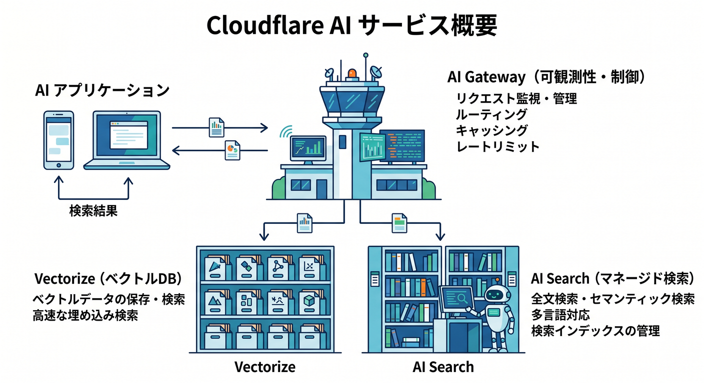
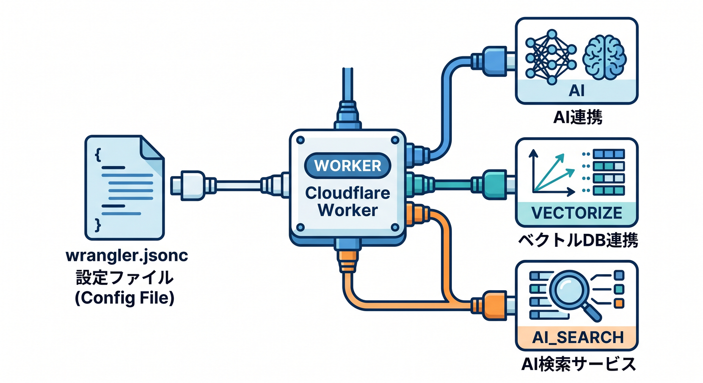
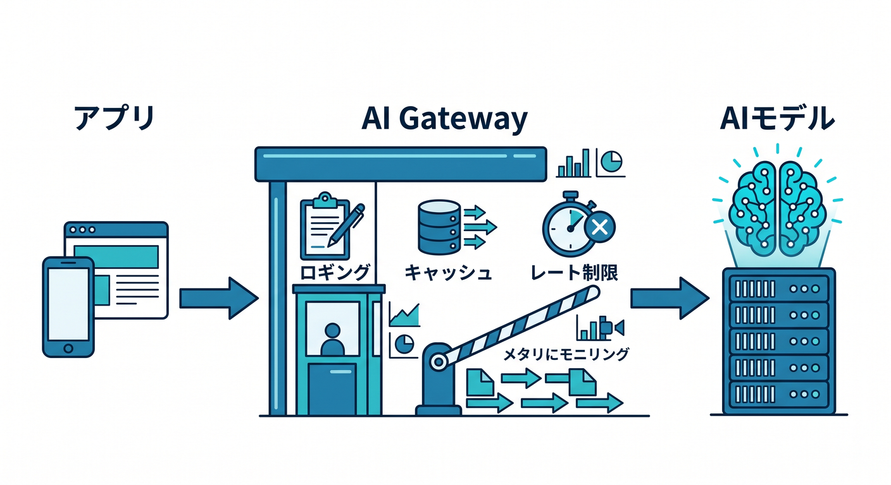
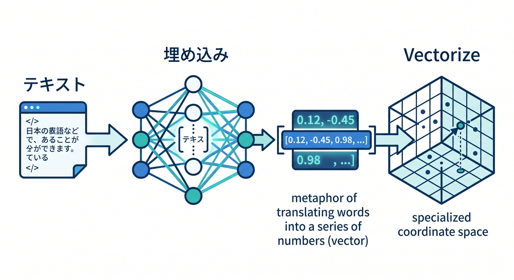
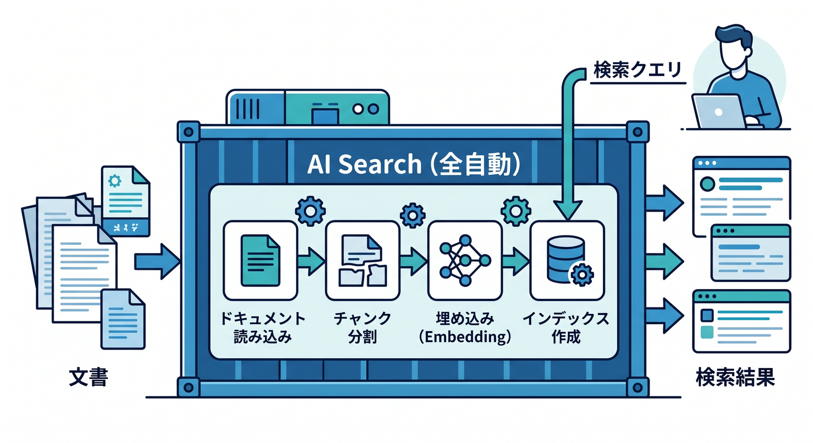
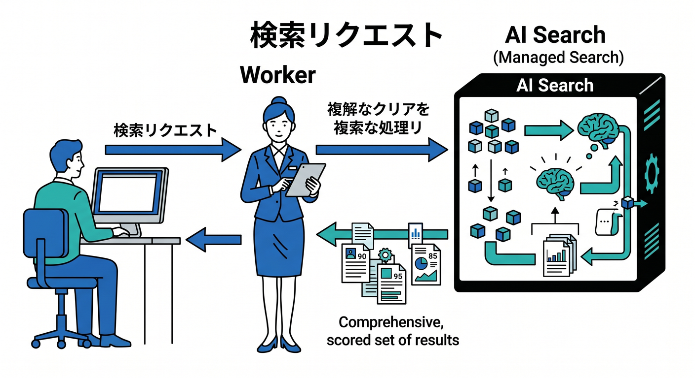
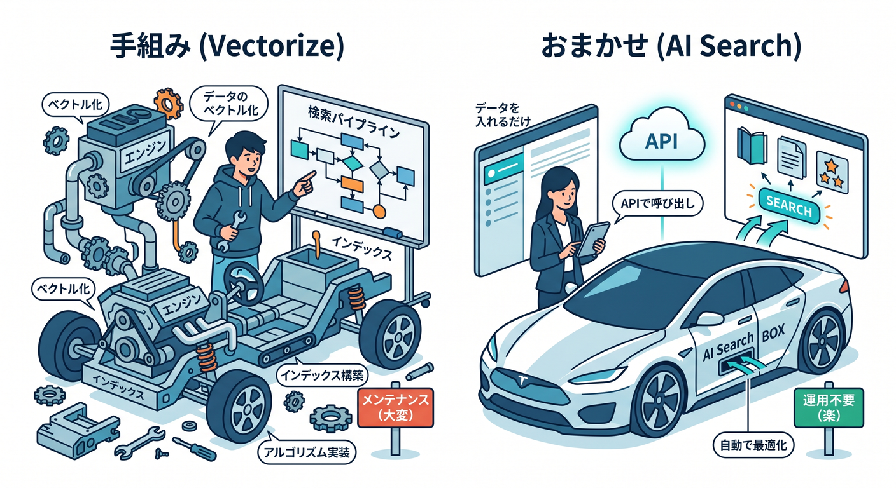

# 第13章：AI Gateway・Vectorize・AI Searchで“実用AIっぽさ”を出そう 🧠🔍

この章では、前章の「AIを1回呼ぶAPI」から一歩進んで、**AIを呼ぶだけでなく、観測する・探す・育てる**ところまで入ります😊
Cloudflareの今の役割分担で見ると、**Workers AI はモデル実行**、**AI Gateway は観測と制御**、**Vectorize はベクトルデータベース**、**AI Search は検索基盤をまとめて持ってくれる managed search**です。しかも **AI Search は 2026年4月16日以降に作った新規インスタンスで managed storage・built-in vector index・web crawling を含む新構成**になっています。([Cloudflare Docs][1])

この章のゴールは、次の3つです ✨
**① AI Gateway が何を守ってくれるのか分かること**、**② Vectorize で埋め込み検索の基本を体験すること**、**③ AI Search を見て「自分で全部組む場合」と「まとめて任せる場合」の違いをつかむこと**です。AI Search は現在 **Overview Beta** として案内されつつ、全プランで使え、検索やエージェント向けの土台として位置づけられています。([Cloudflare Docs][2])

---

## 13-1. まずは地図を描こう 🗺️😊



ひとことで整理すると、こんな感じです。

**AI Gateway** は、AIリクエストの「通り道」をまとめて管理する場所です。Cloudflare公式では、**analytics / logging / caching / rate limiting / retry / model fallback** をまとめて使えるものとして説明されています。しかも Workers AI だけでなく、Anthropic、Google Gemini、OpenAI など複数プロバイダを扱えます。([Cloudflare Docs][3])

**Vectorize** は、意味の近さで検索するための **vector database** です。Cloudflare公式でも、**semantic search / recommendation / classification / anomaly detection / LLMへの文脈提供** に使うと整理されています。Workers AI と組み合わせて埋め込みを作り、Worker から index に upsert / query する流れが基本です。([Cloudflare Docs][4])

**AI Search** は、検索をかなりまとめて面倒見てくれる **managed search service** です。Webサイト、R2、アップロードした文書をつなぐと、自然言語検索のために自動で index を作ってくれます。さらに **hybrid search、query rewriting、reranking、generation** まで持てるので、検索UIやRAGの土台を早く作りたいときにかなり便利です。([Cloudflare Docs][5])

なので、初心者向けにざっくり言うとこうです 😄
**AI Gateway = 見る・制御する**、**Vectorize = 自分で検索基盤を組む**、**AI Search = 検索基盤をまとめて借りる**、です。これは Cloudflare の各製品説明を学習順に並べ直した理解です。([Cloudflare Docs][3])

---

## 13-2. この章で作るミニ題材 📚🤖

題材は、**「学習ノート検索ミニアプリ」**にします ✍️
流れはとても素直です。

1. ノート本文を埋め込みベクトルにする
2. Vectorize に保存する
3. 質問文も埋め込み化して近いノートを探す
4. 必要なら生成モデルで説明文を作る
5. そのAI呼び出しを AI Gateway 経由にして、あとでログやコストを見る

この作り方は、Cloudflare公式の **Workers AI + Vectorize** の導線と、AI Gateway の **Worker binding** 導線をつないだ学習用の最小構成です。([Cloudflare Docs][6])

---

## 13-3. 先に設定ファイルを整えよう ⚙️🧩



Cloudflareは現在、**新規プロジェクトでは `wrangler.jsonc` を推奨**しています。さらに、Wrangler設定ファイルを **source of truth** として扱うのがベストプラクティスです。binding を増やしたら **`wrangler types` を再実行**して、`Env` 型を runtime に合わせるのが大事です。([Cloudflare Docs][7])

```jsonc
{
  "$schema": "./node_modules/wrangler/config-schema.json",
  "name": "chapter13-ai-app",
  "main": "src/index.ts",
  "compatibility_date": "2026-04-17",

  "ai": {
    "binding": "AI"
  },

  "vectorize": [
    {
      "binding": "VECTORIZE",
      "index_name": "study-notes-index"
    }
  ],

  "ai_search_namespaces": [
    {
      "binding": "AI_SEARCH",
      "namespace": "default"
    }
  ]
}
```

この設定で、Worker から **`env.AI` / `env.VECTORIZE` / `env.AI_SEARCH`** を使えるようになります。Cloudflare公式でも、binding は REST API より **高性能で制約が少ない**アクセス方法として案内されています。([Cloudflare Docs][8])

そのあとで、型を更新します 👇

```bash
npx wrangler types
```

`wrangler types` は、**compatibility date・compatibility flags・bindings** に合わせた型を生成してくれるので、この教材ではこちらを基本にします。([Cloudflare Docs][9])

---

## 13-4. AI Gateway は「AIの呼び出しを見える化する入口」👀🚪



まずは、普通の生成APIを **AI Gateway 経由**で呼ぶイメージをつかみましょう。
Cloudflare公式の Worker binding では、**`env.AI.run()` の第3引数に `gateway` オプション**を渡せます。ここで **`id` / `cacheTtl` / `collectLog` / `metadata`** などを指定できます。([Cloudflare Docs][10])

```ts
export default {
  async fetch(request, env): Promise<Response> {
    const messages = [
      { role: "system", content: "あなたはやさしい先生です。" },
      { role: "user", content: "AI Gatewayを初心者向けに短く説明して" }
    ];

    const response = await env.AI.run(
      "@cf/zai-org/glm-4.7-flash",
      { messages },
      {
        gateway: {
          id: "chapter13-gateway",
          cacheTtl: 60,
          collectLog: true,
          metadata: { route: "intro" }
        }
      }
    );

    return Response.json(response);
  }
} satisfies ExportedHandler<Env>;
```

ここで大事なのは、「AI Gateway はモデルそのものではない」という点です 🙂
**モデルを動かすのは Workers AI など**で、**AI Gateway はその前後を観測・制御**します。公式の説明でも、**requests / tokens / cost の analytics**、**logging**、**cache**、**rate limiting**、**retry / fallback** が主役です。([Cloudflare Docs][3])

なので実務感覚では、
**「まず動いた！」で終わらず、あとで “何回呼ばれた？ いくらかかった？ 失敗した？” を見たいなら AI Gateway を通す**、と覚えるとかなりしっくりきます 😊([Cloudflare Docs][3])

ちなみに AI Gateway binding には、**直前のログIDを取る `env.AI.aiGatewayLogId`** や、**ログに feedback / score / metadata を後付けする `patchLog()`** もあります。将来、「この回答よかった 👍 / いまいち 👎」を記録したいときに相性がいいです。([Cloudflare Docs][10])

---

## 13-5. Vectorize で「意味で探す」を自分で作ろう 🔎🧠



ここからが検索の本体です。
Cloudflare公式の Vectorize チュートリアルでは、Worker から **embedding を作って upsert し、query で近いベクトルを探す**流れが案内されています。([Cloudflare Docs][6])

今回は埋め込みモデルに **`@cf/google/embeddinggemma-300m`** を使います。
このモデルは **100以上の言語で学習された multilingual embedding model** で、検索や類似度判定向けに説明されています。さらに 2026年4月の Cloudflare changelog では、**768次元ベクトル**で **低レイテンシ埋め込み向け**と案内されています。([Cloudflare Docs][11])

だから index 作成時は、**次元数を 768 に合わせる**のが大事です。

```bash
npx wrangler vectorize create study-notes-index --dimensions=768 --metric=cosine
```

Vectorize の公式チュートリアルでも、**index 作成時に dimensions と metric を固定し、後から変えられない**こと、そして **binding 経由で Worker に接続する**ことが説明されています。([Cloudflare Docs][6])

次に、埋め込み作成 → upsert → query の最小コードです ✨

```ts
interface EmbeddingResponse {
  shape: number[];
  data: number[][];
}

const NOTES = [
  {
    id: "note-1",
    title: "AI Gatewayとは",
    body: "AI GatewayはAIアプリの利用状況を分析し、ログ、キャッシュ、レート制限、リトライ、フォールバックを扱いやすくする。"
  },
  {
    id: "note-2",
    title: "Vectorizeとは",
    body: "Vectorizeは意味検索のためのベクトルデータベースで、埋め込みを保存して類似検索に使う。"
  },
  {
    id: "note-3",
    title: "AI Searchとは",
    body: "AI SearchはCloudflareのmanaged searchで、文書の取り込み、chunking、embedding、検索、生成までまとめて扱いやすい。"
  }
];

export default {
  async fetch(request, env): Promise<Response> {
    const url = new URL(request.url);
    const path = url.pathname;

    if (path === "/insert") {
      const embeddings = await env.AI.run(
        "@cf/google/embeddinggemma-300m",
        {
          text: NOTES.map((note) => note.body)
        }
      ) as EmbeddingResponse;

      const vectors: VectorizeVector[] = NOTES.map((note, i) => ({
        id: note.id,
        values: embeddings.data[i],
        metadata: {
          title: note.title,
          body: note.body
        }
      }));

      const result = await env.VECTORIZE.upsert(vectors);
      return Response.json(result);
    }

    if (path === "/search") {
      const q = url.searchParams.get("q") ?? "";

      const queryEmbedding = await env.AI.run(
        "@cf/google/embeddinggemma-300m",
        { text: [q] },
        {
          gateway: {
            id: "chapter13-gateway",
            collectLog: true,
            metadata: { route: "vector-search" }
          }
        }
      ) as EmbeddingResponse;

      const matches = await env.VECTORIZE.query(queryEmbedding.data[0], {
        topK: 3,
        returnMetadata: "all"
      });

      return Response.json(matches);
    }

    return new Response("OK");
  }
} satisfies ExportedHandler<Env>;
```

このコードで見てほしいポイントは3つです 😊

まず、**embedding モデルの返り値は `shape` と `data` を持つ**ので、`data[i]` を Vectorize にそのまま流し込めます。これは EmbeddingGemma の API schema にも出ています。([Cloudflare Docs][11])

次に、**保存するときは `upsert()` を使う**のが実務では楽です。Cloudflare公式でも、**同じ id を更新したいときは insert ではなく upsert** を使うよう案内されています。([Cloudflare Docs][4])

最後に、**query 側の embedding 生成も AI Gateway を通しておく**と、検索機能がどれくらい呼ばれているか見やすくなります。つまり **Vectorize が検索の中身**、**AI Gateway がその運転記録**、という感じです。([Cloudflare Docs][3])

なお、公式の cosine 例では、**score が 1 に近いほど似ている**という感覚で見ていけます。([Cloudflare Docs][6])

---

## 13-6. AI Search は「自分で全部組まない」ための選択肢 🪄📚



ここで AI Search を見ると、「あ、これは **検索まわりをかなりまとめて持ってくれる**んだな」と分かります。
Cloudflare公式の説明では、AI Search は **website / R2 / uploaded files** をつなぐと、自然言語検索用に index を作ってくれる managed search service です。([Cloudflare Docs][5])

しかも中でやっている処理もかなり明確です。
公式の “How AI Search works” では、indexing 側で **data ingestion → Markdown conversion → chunking → embedding → keyword indexing → storage**、query 側で **query rewriting → embedding → vector search → keyword search → fusion → reranking → content retrieval → generation** という流れが説明されています。([Cloudflare Docs][12])

つまり、さっき自分でやった **「文書を分ける」「埋め込みを作る」「Vectorizeへ入れる」「検索結果を並べ替える」** のかなりの部分を、AI Search はまとめて肩代わりしてくれます 😌
特に **hybrid search** や **reranking** を最初から持てるのが強いです。([Cloudflare Docs][2])

しかも本日時点の最新情報では、**AI Search の各インスタンスには built-in MCP endpoint と embeddable search components** まであります。なので将来、**AI agent に検索を開放する**とか、**サイト内検索UIをすばやく置く**方向にもつなげやすいです。([Cloudflare Docs][2])

---

## 13-7. AI Search を Worker から呼ぶとこんな感じ 💬🔧



AI Search の current binding では、**旧 `env.AI.autorag()` は非推奨**で、今は **`ai_search` / `ai_search_namespaces` binding** を使う形が推奨です。namespace binding なら、**instance の get / create / list / delete** まで runtime で扱えます。さらに最新更新では、**namespace binding と cross-instance search** が追加されました。([Cloudflare Docs][13])

まずは 1つの instance に対して検索する例です。

```ts
export default {
  async fetch(request, env): Promise<Response> {
    const instance = env.AI_SEARCH.get("study-notes");

    const results = await instance.search({
      messages: [{ role: "user", content: "AI Gatewayって何？" }]
    });

    return Response.json(results);
  }
} satisfies ExportedHandler<Env>;
```

この `search()` は、**関連 chunk を scored results として返す**ための入口です。公式でも namespace binding 経由の exact な使い方が案内されています。([Cloudflare Docs][13])

生成まで一気にやりたいなら、`chatCompletions()` を使います。streaming もできます。

```ts
export default {
  async fetch(request, env): Promise<Response> {
    const instance = env.AI_SEARCH.get("study-notes");

    const stream = await instance.chatCompletions({
      messages: [{ role: "user", content: "AI GatewayとVectorizeの違いを説明して" }],
      stream: true
    });

    return new Response(stream, {
      headers: {
        "content-type": "text/event-stream",
        "cache-control": "no-cache"
      }
    });
  }
} satisfies ExportedHandler<Env>;
```

Cloudflare公式でも、**AI Search binding から `search()` と `chatCompletions()`** を使え、`stream: true` の SSE 応答にも対応しています。([Cloudflare Docs][13])

さらに namespace binding なら、**複数 instance をまたいで 1回で検索**できます。
たとえば「製品ドキュメント」と「自分のメモ」をまとめて探す、みたいな構成もできます。

```ts
const results = await env.AI_SEARCH.search({
  messages: [{ role: "user", content: "Cloudflareとは？" }],
  ai_search_options: {
    instance_ids: ["product-docs", "customer-abc123"]
  }
});
```

公式では、namespace-level search / chat completions で **`instance_ids` を最大 10件まで指定**でき、結果 chunk に **`instance_id`** も入ると案内されています。([Cloudflare Docs][13])

---

## 13-8. Vectorize と AI Search、どう選ぶの？ 🤔⚖️



ここは初心者がかなり迷いやすいです。でも考え方はシンプルです 🌱

**Vectorize を選ぶ場面**は、
「chunk の切り方も metadata も query の流れも、**自分で細かく設計したい**」ときです。Worker の中で自由に組めるぶん、構成が見えやすく、学習にも向いています。([Cloudflare Docs][4])

**AI Search を選ぶ場面**は、
「まずは **検索体験を早く作りたい**」「取り込み・chunking・reranking までまとめて任せたい」ときです。Cloudflare公式でも AI Search は retrieval infrastructure を丸ごと持たなくてよい検索基盤として説明されています。([Cloudflare Docs][2])

**AI Gateway はどちらでも入れる価値がある**、と考えてください。
Vectorize 手組みでも、AI Search でも、最終的には embedding / generation / provider call の監視や制御が欲しくなるからです。([Cloudflare Docs][3])

実務ではこんな感覚でOKです 😄

* **学習用・仕組みを理解したい** → まず Vectorize
* **すばやく検索を形にしたい** → AI Search
* **利用状況・コスト・失敗を見たい** → AI Gateway を追加

これは Cloudflare の各製品の役割から見た、かなり自然な選び方です。([Cloudflare Docs][3])

---

## 13-9. 2026年時点で知っておきたい “最新の注意点” 🆕⚠️

ここはかなり大事です。

まず **AI Search は新旧インスタンスで挙動と見え方が違う**可能性があります。
**2026年4月16日以降の新規 instance** は **built-in storage / built-in vector index / web crawling** を持つ新構成ですが、それ以前の instance は **R2 / Vectorize / Workers AI / AI Gateway / Browser Run** など、基盤サービスの上に載る旧構成です。ダッシュボード画面や料金の見え方が違っても不思議ではありません。([Cloudflare Docs][14])

次に、**新しい AI Search は open beta 中は制限付きで無料**ですが、**Workers AI と AI Gateway の利用分は別 billing** です。ここは「AI Search 本体は無料っぽく見えるのに、推論側は別で動く」ので、あとで戸惑いやすいです。([Cloudflare Docs][14])

さらに、AI Search の model 設定では、**Workers AI を使うのが基本**ですが、**OpenAI や Anthropic など他社モデルを使いたいときは AI Gateway に provider keys を登録して接続**できます。**generation model は per-request override** もできます。([Cloudflare Docs][15])

---

## 13-10. Copilot をどう混ぜると学習が速い？ 🤝✨

2026年の学習では、Copilot を「コード補完」だけに使うのはもったいないです 😊
GitHub公式では、**MCP は AI と外部ツールをつなぐ open standard** で、**Copilot Chat は MCP server で拡張**できます。VS Code では **GitHub MCP server の remote 構成が推奨**です。([GitHub Docs][16])

Cloudflare側もこの流れにかなり寄っています。
AI Search には **built-in MCP endpoint** があり、Cloudflare自身も **managed remote MCP servers** をカタログとして提供しています。さらに Cloudflare API MCP server まで用意されています。([Cloudflare Docs][2])

つまり、学習の現場ではこんな使い方がかなり相性いいです 💡

* Copilot Chat に **`wrangler.jsonc` の binding の意味を説明させる**
* Copilot に **`/insert` と `/search` のテストケースを作らせる**
* **「この embedding model なら index の次元数はいくつ？」** を確認させる
* **「Vectorize版とAI Search版の責務の違いを図にして」** と頼む

しかも Cloudflare公式も、Workers アプリを **VS Code や Codex などのAIツールから prompt ベースで作る流れ**をすでに案内しています。なので「AIを使いながらCloudflareを学ぶ」は、今の公式導線ともかなり噛み合っています。([Cloudflare Docs][17])

---

## 13-11. この章でハマりやすいポイント 😵‍💫🛠️

**その1：index の次元数ミス**
EmbeddingGemma-300M を使うのに Vectorize index を 1024 次元で作る、みたいなズレはかなり起きやすいです。**embedding model の次元と index 作成時の `--dimensions` は必ず合わせる**、が鉄則です。([Cloudflare Docs][18])

**その2：binding を変えたのに `wrangler types` を回していない**
この教材では `Env` を型安全に使うので、config 変更後の `wrangler types` はほぼ必須です。([Cloudflare Docs][9])

**その3：insert で更新しようとしてしまう**
既存 id の更新は `insert()` ではなく **`upsert()`** です。([Cloudflare Docs][4])

**その4：古い AI Search 記事を見て `env.AI.autorag()` を真似する**
今の docs では **旧 binding は非推奨**です。学習では current binding を使って進めた方が混乱しません。([Cloudflare Docs][13])

---

## 13-12. 練習課題 🎓🔥

1つめは、**ノートを3件から20件に増やす**こと。
`metadata` に `category` や `level` を入れて、「TypeScriptだけ」「Cloudflareだけ」で絞る設計を考えてみましょう。

2つめは、**検索結果をそのまま返す版**と、**生成モデルで説明文にする版**を分けること。
「検索」と「回答生成」は別工程だと体感できるようになります。

3つめは、**AI Search 版を追加**して、同じ質問で **Vectorize手組み版と AI Search版の返り方**を比べること。
ここで「自由度」と「速さ」の差がかなり見えます 👀

---

## 13-13. この章のまとめ 🌈🏁

この章でつかんでほしい核は、これです。

**Workers AI** はモデル実行の中心。**AI Gateway** はその呼び出しを見える化・制御する入口。**Vectorize** は意味検索の土台。**AI Search** はその検索土台をかなりまとめて持ってくれる managed service。Cloudflareの現行ドキュメントも、だいたいこの役割分担で読むとすごく整理しやすいです。([Cloudflare Docs][1])

学習順としては、
**まず Vectorize で仕組みを理解する → 次に AI Gateway で観測する → そのあと AI Search で “まとめて持つ” 感覚を覚える**、この順がとても自然です 😊
次章では、こうしたAI機能を「作って終わり」にせず、**Queues / Workflows / Logs** の世界へつないで、運用に強い作りへ進めます。

[1]: https://developers.cloudflare.com/workers-ai/ "Overview · Cloudflare Workers AI docs"
[2]: https://developers.cloudflare.com/ai-search/ "Cloudflare AI Search · Cloudflare AI Search docs"
[3]: https://developers.cloudflare.com/ai-gateway/ "Overview · Cloudflare AI Gateway docs"
[4]: https://developers.cloudflare.com/vectorize/get-started/intro/ "Introduction to Vectorize · Cloudflare Vectorize docs"
[5]: https://developers.cloudflare.com/ai-search/get-started/ "Get started with AI Search · Cloudflare AI Search docs"
[6]: https://developers.cloudflare.com/vectorize/get-started/embeddings/ "Vectorize and Workers AI · Cloudflare Vectorize docs"
[7]: https://developers.cloudflare.com/workers/wrangler/configuration/ "https://developers.cloudflare.com/workers/wrangler/configuration/"
[8]: https://developers.cloudflare.com/workers-ai/configuration/bindings/ "https://developers.cloudflare.com/workers-ai/configuration/bindings/"
[9]: https://developers.cloudflare.com/workers/languages/typescript/ "https://developers.cloudflare.com/workers/languages/typescript/"
[10]: https://developers.cloudflare.com/ai-gateway/integrations/worker-binding-methods/ "Workers Bindings · Cloudflare AI Gateway docs"
[11]: https://developers.cloudflare.com/workers-ai/models/embeddinggemma-300m/ "embeddinggemma-300m (Google) · Cloudflare AI docs · Cloudflare Workers AI docs"
[12]: https://developers.cloudflare.com/ai-search/concepts/how-ai-search-works/ "How AI Search works · Cloudflare AI Search docs"
[13]: https://developers.cloudflare.com/ai-search/usage/workers-binding/ "Workers binding · Cloudflare AI Search docs"
[14]: https://developers.cloudflare.com/ai-search/platform/limits-pricing/ "Limits & pricing · Cloudflare AI Search docs"
[15]: https://developers.cloudflare.com/ai-search/configuration/models/ "Models · Cloudflare AI Search docs"
[16]: https://docs.github.com/copilot/customizing-copilot/using-model-context-protocol/extending-copilot-chat-with-mcp "Extending GitHub Copilot Chat with Model Context Protocol (MCP) servers - GitHub Docs"
[17]: https://developers.cloudflare.com/workers/get-started/prompting/?utm_source=chatgpt.com "Prompting - Workers"
[18]: https://developers.cloudflare.com/changelog/post/2026-04-09-new-workers-ai-models/ "New Workers AI models for text generation and embedding in AI Search · Changelog"