# 第14章：Queues・Workflows・Logsで“動かしっぱなし”に強くなろう ⏳📈

この章では、**「画面に返事を返す処理」**と、**「あとで裏で進める処理」**を分けて考えられるようになるのがゴールです 😊
Cloudflare 公式では、Queues は**非同期処理・保証付き配信・バッファ/バッチ**に向いた仕組み、Workflows は**複数ステップをつないで自動再試行し、状態を保ったまま長く動ける durable execution**、Workers Logs / Traces は**原因調査と可視化**の土台として案内されています。さらに 2026 年時点では、Queues は Free プランでも使え、Workers Logs は新規 Worker で observability が既定有効、Observability ダッシュボードや検索機能もかなり強化されています。 ([Cloudflare Docs][1])

---

## この章でできるようになること 🎯

* **重い処理をその場でやらず、Queues に逃がす**
* **順番・待機・再試行が必要な処理を Workflows に分ける**
* **ログを「あとで読むメモ」ではなく、運用の道具として残す**
* **Workers AI を使う処理でも、詰まりにくい流れを設計する**

Cloudflare の公式ドキュメントでも、Queues は request から仕事を切り離す用途、Workflows は R2 後処理や Workers AI embeddings → Vectorize のような**複数段階のバックグラウンド処理**、Observability は**Logs / Real-time logs / Tail Workers / Traces**を使い分ける流れで整理されています。 ([Cloudflare Docs][1])

---

## 1. まずは地図から 🗺️

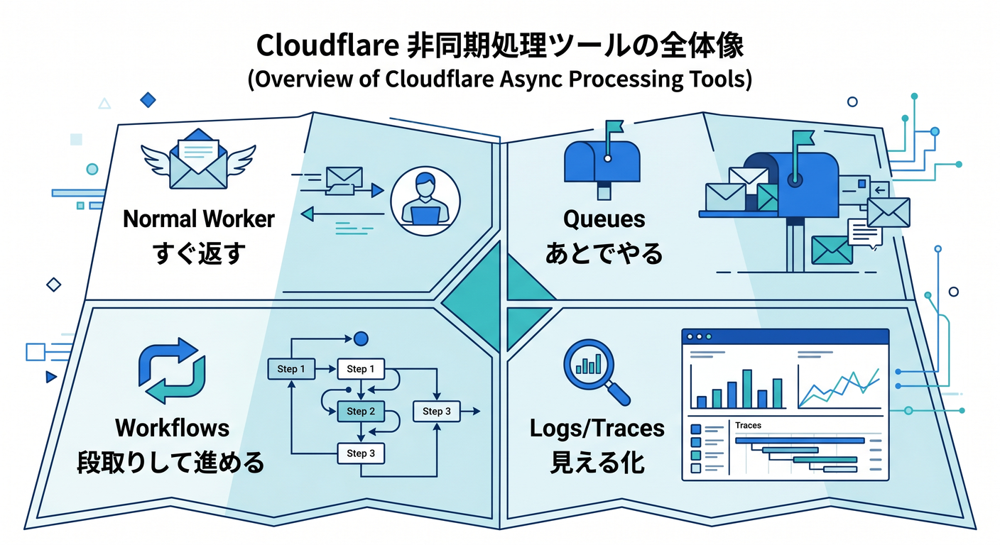

### 「すぐ返す」「あとでやる」「段取りして進める」を分けよう

初心者のうちは、何でも `fetch()` の中で一気にやりたくなります 🤯
でも実運用では、**レスポンスを早く返したい処理**と、**時間がかかってもいい処理**を分けるだけで、アプリがかなり安定します。Cloudflare の考え方に寄せると、ざっくりこうです。 ([Cloudflare Docs][1])

* **通常の Worker**
  すぐ返事を返す担当 ✉️
* **Queues**
  「今は受け取ったよ、続きはあとでやるね」を実現する担当 📮
* **Workflows**
  「A をやって、終わったら B、失敗したら再試行、30分後に C」を実現する担当 🔁
* **Logs / Traces**
  「何が起きたの？」を見えるようにする担当 🔍

この分担は、特に **画像生成・要約・埋め込み生成・外部 API 連携**のような、時間差や失敗を前提にした処理で効きます。Workflows の公式例でも、**R2 アップロード後の後処理**や**Workers AI embeddings 生成**のような題材が挙げられています。 ([Cloudflare Docs][2])

---

## 2. Queues って何？ 📮

### 「その場でやらない」ための箱

Cloudflare Queues は、**メッセージを一度キューに積んで、あとから consumer Worker が処理する**仕組みです。公式では、**guaranteed delivery**、**request からの仕事の切り離し**、**buffer / batch** が中心価値として説明されています。メッセージは、書き込み成功後は失われず、**consumer が正常に処理するまでは削除されません**。 ([Cloudflare Docs][1])

たとえば問い合わせフォームなら、送信直後に
**「保存しました」だけ返す** → **通知メール送信や AI 分析は queue 側で実施**
という形にできます ✨

これをやると、ユーザーは待たされにくくなり、外部 API が少し不安定でも本体画面が巻き添えを受けにくくなります。Cloudflare 公式も、Queues を**非同期処理・Worker 間連携・バッチ処理**のための基本部品として位置づけています。 ([Cloudflare Docs][1])

---

## 3. Queues の最小イメージ 🧩

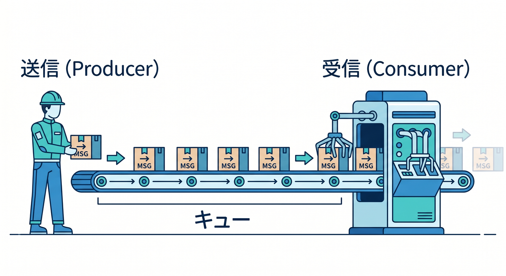

Cloudflare の get started では、producer Worker が `env.<QUEUE>.send(...)` でメッセージを送り、consumer Worker が `queue(batch, env, ctx)` ハンドラで受け取ります。consumer 側では `max_batch_size` と `max_batch_timeout` を設定でき、**10 件たまったら処理**または**5 秒たったら処理**のような動きにできます。さらに **1 つの queue には 1 つの consumer Worker** を接続します。 ([Cloudflare Docs][3])

#### 送信する側のイメージ ✉️

```
export interface Env {
  MY_QUEUE: Queue;
}

export default {
  async fetch(request: Request, env: Env): Promise<Response> {
    const body = await request.json();

    await env.MY_QUEUE.send({
      type: "contact-form",
      email: body.email,
      message: body.message,
      createdAt: new Date().toISOString(),
    });

    return Response.json({
      ok: true,
      message: "受け付けました。続きはバックグラウンドで処理します。",
    });
  },
};
```

#### 受け取る側のイメージ 📥

```
export interface Env {
  AI: Ai;
}

type ContactMessage = {
  type: "contact-form";
  email: string;
  message: string;
  createdAt: string;
};

export default {
  async queue(batch: MessageBatch<ContactMessage>, env: Env): Promise<void> {
    for (const message of batch.messages) {
      console.log(JSON.stringify({
        level: "info",
        event: "queue.received",
        type: message.body.type,
        email: message.body.email,
      }));

      // ここで通知、保存、AI分類などを行う
    }
  },
};
```

ここで大事なのは、**HTTP の返事と本処理を分けた**ことです 😊
問い合わせを受けた瞬間に全部やろうとせず、まず queue に渡す。この 1 手だけで「動かしっぱなし」に強い設計へ近づきます。 ([Cloudflare Docs][3])

---

## 4. Queues で覚えておくべき 4 つのポイント 🧠

### 4-1. バッチで届く 📦

Queues の consumer は、**1 件ずつではなく batch で届く**前提で考えるのがコツです。Cloudflare は `max_batch_size` と `max_batch_timeout` を用意していて、**ためてからまとめて処理**できます。これはログ集計や AI 分類のような処理と相性が良いです。 ([Cloudflare Docs][3])

### 4-2. 再試行がある 🔁

Queue の配送失敗時は、既定で**3 回まで再試行**されます。必要なら `max_retries` を変えられます。つまり、consumer 側コードは「1 回だけ来る」と思わず、**重複しても壊れない書き方**を意識したほうが安全です。 ([Cloudflare Docs][4])

### 4-3. DLQ を用意できる 🚨

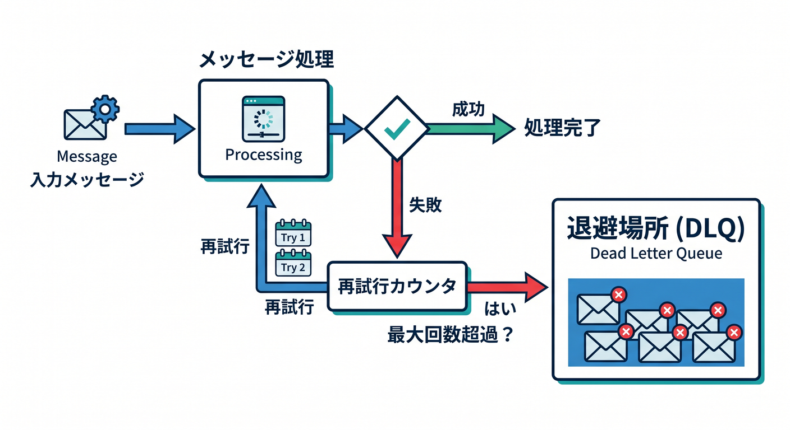

再試行しきっても失敗したメッセージは、**Dead Letter Queue（DLQ）** に逃がせます。DLQ を付けないと、再試行上限に達したメッセージは**永久削除**です。運用では、**失敗を捨てずに隔離する**のがとても大事です。 ([Cloudflare Docs][5])

### 4-4. Free プランでも触れる 👍

2026 年 2 月から、Queues は Workers Free plan に入りました。Free では 1 日 10,000 operations が含まれ、**最大保持期間は 24 時間**です。Paid ではより長い保持ができます。学習用にかなり試しやすくなりました。 ([Cloudflare Docs][6])

---

## 5. Queue の設定例を見てみよう ⚙️

Cloudflare 公式の基本形に沿うと、producer binding と consumer 設定はこんな雰囲気です。 ([Cloudflare Docs][3])

```
{
  "queues": {
    "producers": [
      {
        "queue": "contact-jobs",
        "binding": "MY_QUEUE"
      }
    ],
    "consumers": [
      {
        "queue": "contact-jobs",
        "max_batch_size": 10,
        "max_batch_timeout": 5,
        "dead_letter_queue": "contact-jobs-dlq"
      }
    ]
  }
}
```

この章の学びとしては、設定値の暗記よりも、

* **binding 名でコードから触る**
* **batch で受ける**
* **DLQ を考える**
* **HTTP リクエストの中で重い処理を抱え込まない**

この 4 つを押さえるのが先です 🌱
`max_batch_size` と `max_batch_timeout`、`dead_letter_queue`、`message-retries`、`max-concurrency` などは Wrangler 側でも扱えます。 ([Cloudflare Docs][3])

---

## 6. Workflows って何？ 🔄

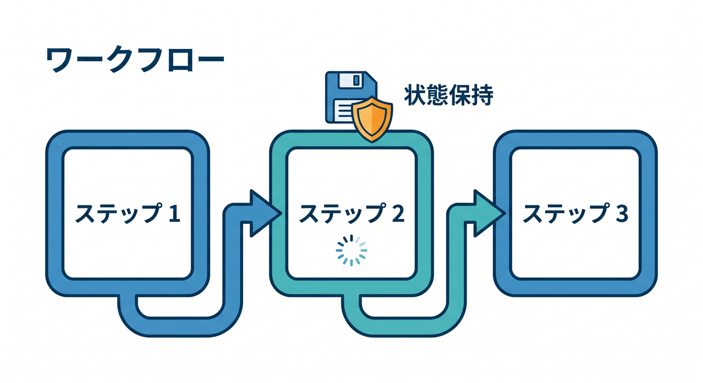

### Queue より「段取り」が得意

Queues は「後ろに回す箱」でした。
一方 Workflows は、**複数のステップを順番に進め、失敗時に自動再試行し、状態を保持したまま長く走れる**仕組みです。Cloudflare はこれを durable execution と説明しています。 minutes / hours / weeks にまたがる実行や、外部 API と連携する長い処理を、インフラ管理なしで作れます。 ([Cloudflare Docs][7])

つまりイメージはこうです 😊

* **Queues**
  「あとでやる」
* **Workflows**
  「あとで、順番つきで、失敗したら再試行しながらやる」

たとえば、R2 に画像が届いたあとに
**1. サムネイル作成 → 2. AI 要約 → 3. Vectorize 登録 → 4. 完了通知**
のような流れを作るなら、Workflows がかなり向いています。Cloudflare 公式の例でも、**R2 後処理**や**Workers AI embeddings を Vectorize へ流す処理**が紹介されています。 ([Cloudflare Docs][2])

---

## 7. Workflows の最小コードを読もう 👀

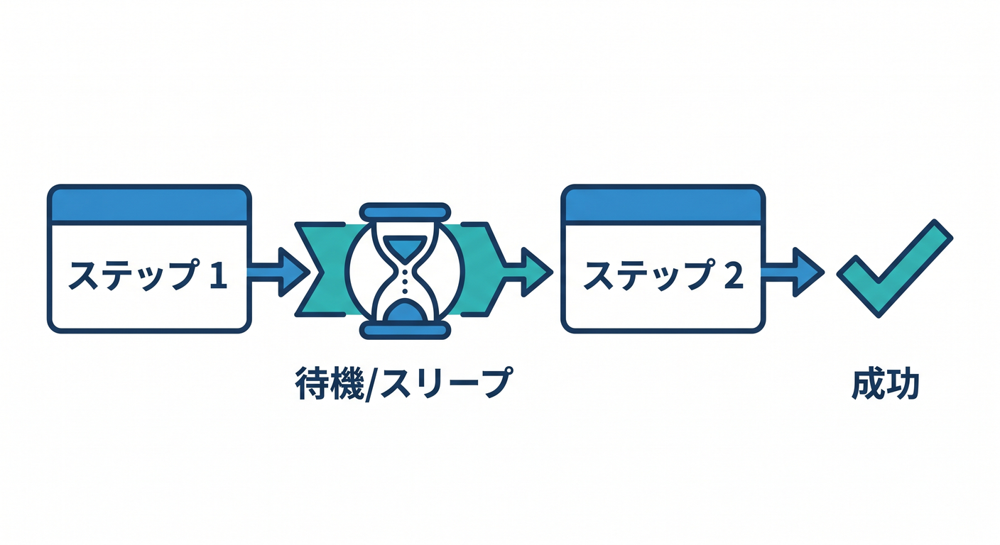

Cloudflare の基本形では、Workflow は `WorkflowEntrypoint` を継承したクラスとして書き、`run(event, step)` の中で `step.do()` や `step.sleep()` を使います。`step.do()` は**結果を永続化し、途中で止まっても成功済みステップをやり直さず再開**できます。 `step.do()` には retry 設定も渡せます。 ([Cloudflare Docs][2])

```
import { WorkflowEntrypoint, WorkflowStep } from "cloudflare:workers";
import type { WorkflowEvent } from "cloudflare:workers";

type Params = {
  jobId: string;
  text: string;
};

export class AnalyzeWorkflow extends WorkflowEntrypoint<Env, Params> {
  async run(event: WorkflowEvent<Params>, step: WorkflowStep) {
    const input = await step.do(
      "normalize-input",
      async () => {
        return {
          jobId: event.payload.jobId,
          text: event.payload.text.trim(),
        };
      }
    );

    const result = await step.do(
      "ai-summary",
      {
        retries: {
          limit: 5,
          delay: "10 seconds",
          backoff: "exponential",
        },
        timeout: "5 minutes",
      },
      async () => {
        // ここで Workers AI を呼ぶ想定
        return {
          summary: `summary for: ${input.text}`,
        };
      }
    );

    await step.sleep("wait-before-notify", "30 seconds");

    await step.do("save-result", async () => {
      console.log(JSON.stringify({
        level: "info",
        event: "workflow.completed",
        jobId: input.jobId,
      }));

      return result;
    });

    return result;
  }
}
```

このコードで見てほしいのは、**関数の中で長い仕事を頑張る**のではなく、**名前つきの step に切っている**ところです ✨
ステップごとに意味を持たせると、失敗箇所も追いやすくなり、あとでダッシュボードやインスタンス情報を見たときにも理解しやすくなります。Cloudflare 公式でも、step は**self-contained で individually retryable**にすることが勧められています。 ([Cloudflare Docs][8])

---

## 8. Workflows で超大事な考え方

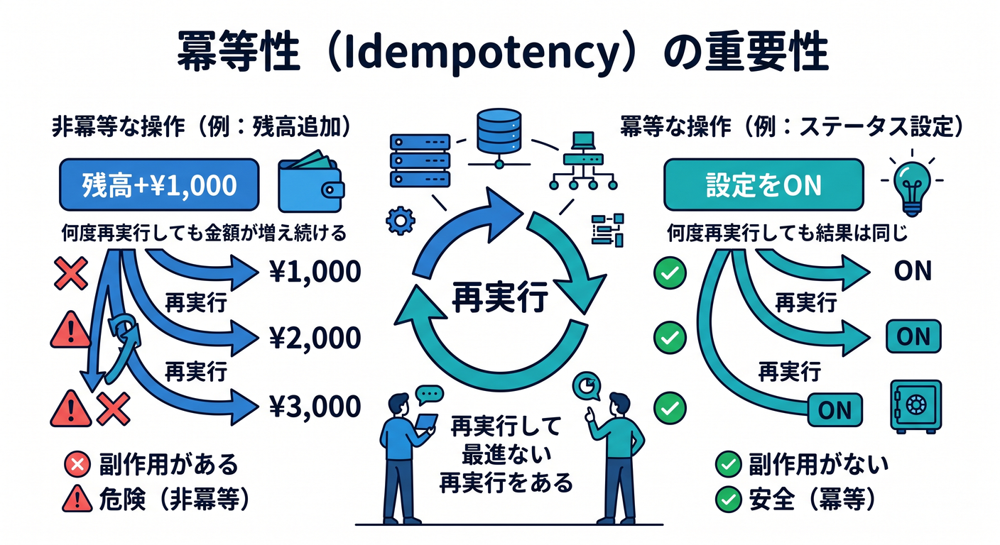

### 冪等性（idempotency）を意識しよう 🛡️

Workflows は再試行できます。便利です。
でもそのぶん、**同じ step が複数回走る可能性**を前提にしないと危険です。Cloudflare の Rules of Workflows でも、**外部 API や binding 呼び出しは idempotent に**と強く案内されています。たとえば課金 API を呼ぶ前に「もう処理済みか」を先に確認する、という考え方です。 ([Cloudflare Docs][8])

初学者向けに言い換えると、

* メール送信
* 決済
* DB への書き込み
* 外部 API 更新

こういう**副作用あり処理**は、
「2 回走っても大丈夫？」を考えてから step に入れる、です 💡

これは Queues 側でも同じで、**再試行と重複**を前提にした設計が運用ではとても大切です。 ([Cloudflare Docs][4])

---

## 9. Queues と Workflows の使い分け 🔀

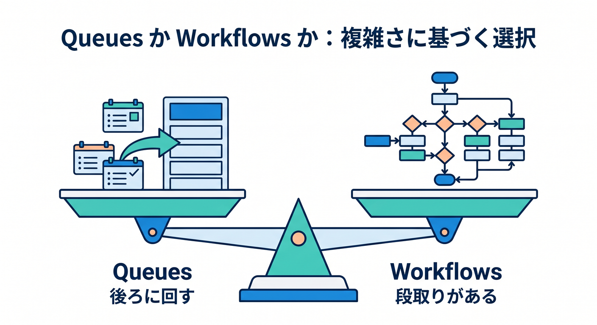

ここは試験にも実務にも効くポイントです ✨

### Queues を選びやすい場面

* とにかく**リクエストから切り離したい**
* 処理は比較的シンプル
* まとめて流したい
* consumer 側で順番や再処理を組み立てやすい

### Workflows を選びやすい場面

* **複数段階**ある
* **待機**が必要
* **途中結果を保持**したい
* **失敗時の再試行**を step 単位で持ちたい
* **長時間かかる AI / 外部連携**を丁寧に扱いたい

Cloudflare 公式でも、Queues は async processing / batching、Workflows は chained steps / retries / persisted state / long-running execution と整理されています。 ([Cloudflare Docs][1])

### 迷ったらこう考える 🤔

* **「ただ後ろに回したい」** → Queues
* **「段取りがある」** → Workflows
* **「両方使う」** → かなり普通

実際には、
**HTTP リクエスト → Queue → consumer Worker → Workflow 起動**
という並べ方も自然です。Workflows の event には queue 由来のメッセージを渡せます。 ([Cloudflare Docs][9])

---

## 10. ローカル開発はどうする？ 💻

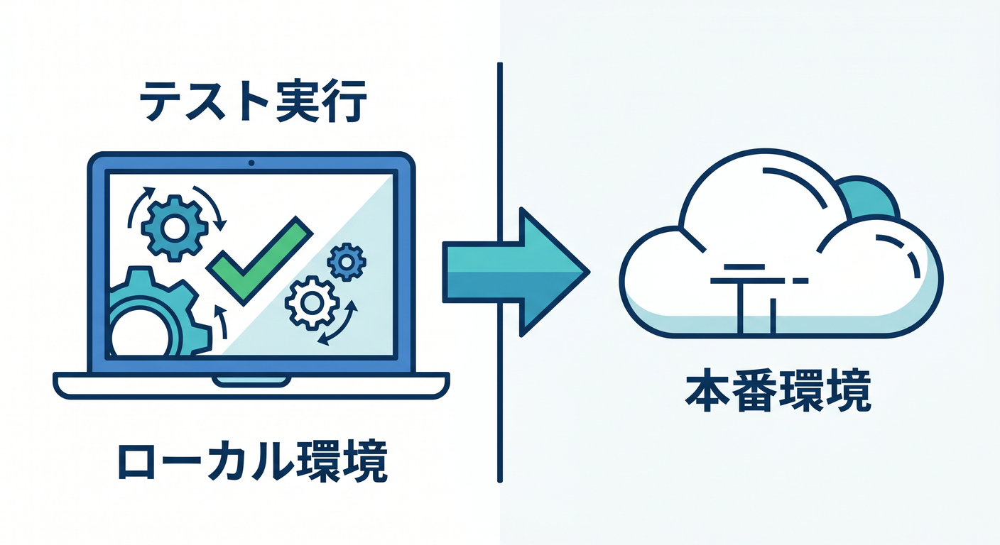

Queues も Workflows も、Wrangler でローカル開発できます。Queues のローカル開発では、Wrangler は**本番と同じバージョンの Queues**をローカルで動かし、producer と consumer を一緒に試せます。consumer concurrency はローカルでは未対応です。 ([Cloudflare Docs][10])

Workflows も Wrangler でローカル開発でき、2026 年 4 月時点では **すべての `wrangler workflows` コマンドが `--local` に対応**しています。インスタンスの list / describe / pause / resume / restart / terminate / send-event までローカルで管理できます。 ([Cloudflare Docs][11])

たとえば、こんな流れです 👇

```
npx wrangler dev
npx wrangler workflows list --local
npx wrangler workflows trigger analyze-workflow --local
npx wrangler workflows instances describe analyze-workflow latest --local
```

これはかなり大きい進化です 🎉
以前より「デプロイしてから様子を見る」ではなく、**ローカルで運用っぽい確認**がしやすくなっています。 ([Cloudflare Docs][12])

---

## 11. Logs は「console.log の置き場」ではない 🔍

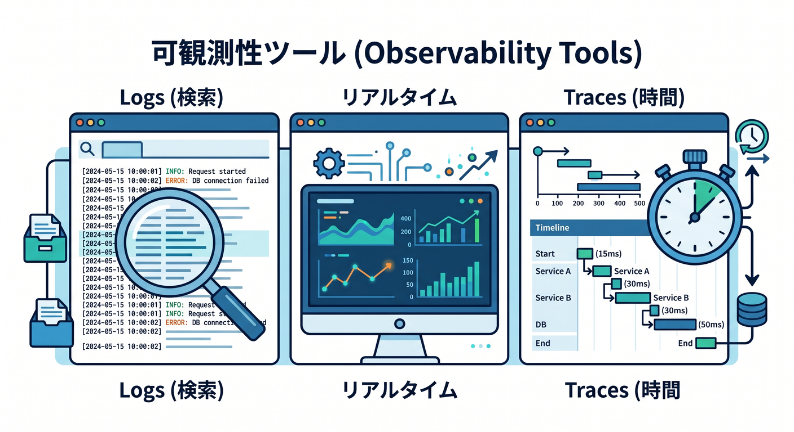

### 運用の命綱です

Cloudflare Workers の observability には、主に次の選択肢があります。公式の Observability ページでもこの整理です。 ([Cloudflare Docs][13])

* **Workers Logs**
  自動収集・保存・検索・分析 📚
* **Real-time logs**
  ほぼリアルタイム確認 ⚡
* **Tail Workers**
  ログを加工して外部へ送る上級者向け 🚚
* **Traces**
  リクエスト全体の流れやボトルネックを見る 🧵

### Workers Logs

Workers Logs は、**invocation logs / custom logs / errors / uncaught exceptions** を Cloudflare アカウント内に保存し、ダッシュボードから検索できます。新規 Worker は **observability がデフォルト有効**です。 ([Cloudflare Docs][14])

### Real-time logs

Real-time logs は、**今起きていることをすぐ見る**のに向いています。ダッシュボードの Live 表示や `npx wrangler tail` で確認できます。ただし高トラフィック時には sampling が入り、**一部ログが落ちることがある**ので、永続保存には向きません。保存したいなら Workers Logs を使います。 ([Cloudflare Docs][15])

### Tail Workers

Tail Workers は、別 Worker として**ログを受け取り、加工し、外部へ送る**仕組みです。Cloudflare は Tail Workers を**advanced-mode**寄りと案内していて、Sentry や Grafana などへ送るだけなら OTEL export のほうが向く場合もあるとしています。なお Tail Workers は Paid / Enterprise 向けです。 ([Cloudflare Docs][16])

### Traces

Traces は、**どこで時間がかかったか**を見るための道具です。Cloudflare 公式では、subrequest や KV / R2 呼び出しにどれだけ時間がかかったか、といった観点の把握に使えると説明しています。 ([Cloudflare Docs][17])

---

## 12. observability の設定を入れよう 🛠️

Cloudflare の best practices では、**本番投入前に Logs と Traces を有効化しておくべき**と明記されています。 intermittent な不具合は、起きたあとに慌ててログを入れても遅いからです。さらに sampling rate も設定できます。 ([Cloudflare Docs][18])

```
{
  "observability": {
    "enabled": true,
    "logs": {
      "head_sampling_rate": 1
    },
    "traces": {
      "enabled": true,
      "head_sampling_rate": 0.01
    }
  }
}
```

Workers Logs の設定例としては `head_sampling_rate` が使えます。best practices の例では、logs は 100%、traces は 1% という書き方が示されています。 ([Cloudflare Docs][14])

---

## 13. ログは「文章」より「構造化」で残そう 🧱

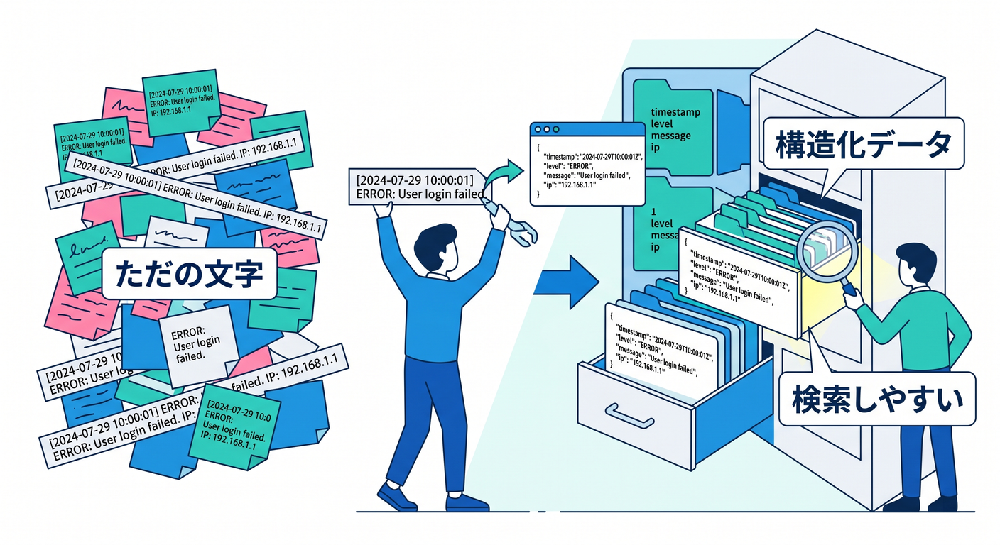

Cloudflare の best practices では、検索しやすいように**structured JSON logs** を推しています。2026 年 2 月には Observability に**構造化クエリ言語**も入り、検索バーから `status = 500` や `$workers.wallTimeMs > 100` のような条件で絞れるようになりました。 ([Cloudflare Docs][18])

なので、教材ではこういう書き方をおすすめします 👇

```
console.log(JSON.stringify({
  level: "info",
  event: "contact.accepted",
  requestId: crypto.randomUUID(),
  email: "user@example.com",
  route: "/api/contact"
}));
```

この形なら、あとでダッシュボードで

* `event = "contact.accepted"`
* `level = "error"`
* `route = "/api/contact"`

のように追いやすくなります 🔎
文字列をベタ書きするより、**あとで機械的に探せる**のが大きいです。 ([Cloudflare Docs][19])

---

## 14. 2026年時点で覚えておきたい「運用まわりの新しめポイント」 🆕

2026 年の Cloudflare まわりでは、この章に関係する変化がいくつかあります。教材として押さえる価値があります。 ([Cloudflare Docs][20])

### 14-1. Observability ダッシュボードが強化された 📊

Workers Observability ダッシュボードでは、**可視化の作成、JSON/CSV エクスポート、イベント/トレース共有リンク、列カスタマイズ**が可能になりました。チームで障害を共有しやすくなっています。 ([Cloudflare Docs][20])

### 14-2. 検索バーで構造化クエリが書ける ✍️

検索バーは free text だけでなく、**field query / functions / boolean logic** を扱えるようになりました。これは運用学習の教材にかなり向いています。 ([Cloudflare Docs][19])

### 14-3. Workflow を図で見られる 👀

Workflows には、**sequenced steps / parallel steps / loops / conditionals** を図で見られる visualizer があり、JavaScript / TypeScript Workflows で beta 提供されています。初心者が「自分の処理の流れ」を掴むのにとても便利です。 ([Cloudflare Docs][21])

### 14-4. Workflow のローカル管理がかなり便利になった 🧪

`wrangler workflows` の各種コマンドに `--local` が付き、**ローカルの instance を pause / resume / restart / terminate** までできるようになりました。学習効率がかなり上がっています。 ([Cloudflare Docs][12])

---

## 15. この章らしいミニ作品案 🤖📮🔄

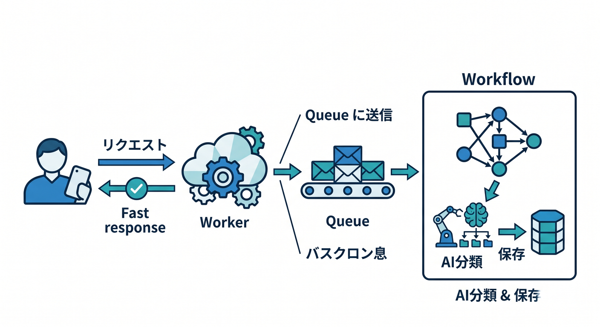

ここでは Cloudflare AI もちゃんと絡めましょう ✨
おすすめは **「問い合わせ本文を AI で分類して、危険度やカテゴリを付ける小さな運用アプリ」** です。

### 流れ

1. React フォームから Worker API へ送信
2. Worker はすぐ 200 を返す
3. 本文を Queue に送る
4. consumer で Workflow を起動
5. Workflow の step で

   * 文章整形
   * Workers AI で分類
   * 必要なら embeddings 生成
   * 保存
   * 完了ログ出力
6. Workers Logs / Traces で追跡する

Workflows の公式例には Workers AI embeddings → Vectorize がありますし、Queues は Worker から Worker へ非同期に仕事を渡すための基盤です。Logs / Traces はその実行結果の調査役です。つまりこの流れは、Cloudflare の各サービスの役割分担にかなり沿っています。 ([Cloudflare Docs][1])

---

## 16. Copilot の使いどころ 💬✨

この章では Copilot に丸投げするより、**役割の違いを言語化させる**のがうまい使い方です。

たとえばこんな聞き方が有効です 😊

* 「この処理は Queue 向きですか、Workflow 向きですか。理由も説明して」
* 「この Worker に構造化ログを追加して」
* 「再試行を前提にした idempotent な書き方へ直して」
* 「この `console.log` を Workers Logs で検索しやすい JSON に変えて」

Cloudflare 側でも observability・structured logging・retry-aware な実装が重要視されているので、Copilot には**コード生成だけでなく設計レビュー相手**になってもらうのが効果的です。 ([Cloudflare Docs][18])

---

## 17. ハマりやすいポイント集 ⚠️

### 17-1. Queue に入れたら「終わり」だと思う

違います 🙅
consumer が落ちることもあるし、DLQ に流れることもあります。**失敗後の置き場**まで考えて初めて運用です。 ([Cloudflare Docs][4])

### 17-2. Workflow の step で副作用を雑に実行する

再試行で二重送信・二重課金の原因になります。**idempotency** を意識しましょう。 ([Cloudflare Docs][8])

### 17-3. ログを文字列だけで残す

後で探しにくくて苦労します。**構造化ログ**に寄せるのがおすすめです。 ([Cloudflare Docs][18])

### 17-4. Real-time logs だけで安心する

Real-time logs は便利ですが、高トラフィック時は sampling されることがあります。**保存して分析したいなら Workers Logs**です。 ([Cloudflare Docs][15])

### 17-5. 本番に出してから observability を考える

Cloudflare の best practices は、**本番前に Logs / Traces を有効化**するよう勧めています。先に見える化しておきましょう。 ([Cloudflare Docs][18])

---

## 18. 練習問題 ✍️🎓

### 練習1

問い合わせフォーム API を想定して、
**「その場で返す部分」** と **「Queue に逃がす部分」** を文章で分けてみましょう。

### 練習2

次の処理を Queue 向き / Workflow 向き / 両方 に分類してみましょう。

* 画像アップロード後のサムネイル作成
* AI 要約結果を 1 回だけ返す処理
* 外部 API を 5 回まで再試行しつつ、30 分後に再確認する処理
* アクセスログをまとめて保存する処理

### 練習3

`console.log("error!")` を、検索しやすい構造化ログへ書き換えてみましょう。

### 練習4

Workflow の step 名を、あとで Observability で見たときに意味がわかるように 5 個考えてみましょう。

これらの練習は、Cloudflare が提供している **Queues の batching / retry / DLQ**, **Workflows の step / retry / sleep**, **Observability の構造化検索**を頭で整理するのに効きます。 ([Cloudflare Docs][1])

---

## 19. この章のまとめ 🎉

第14章の本質は、**「動くコード」から「運用できるコード」へ進むこと**です。

* **Queues** は、重い処理を後ろへ回す 📮
* **Workflows** は、段取り・待機・再試行つきで進める 🔄
* **Logs / Traces** は、何が起きたか見えるようにする 🔍

この 3 つが揃うと、Cloudflare 上で
**作る → 流す → 追う → 直す**
のサイクルが回せるようになります 😊

そして 2026 年時点の Cloudflare は、Queues の Free plan 対応、Workflows のローカル管理強化、Workflow 可視化、Workers Observability の UI / 検索強化などで、**学習段階でも運用感を体験しやすい状態**になっています。第14章は、その入口としてかなり重要です。 ([Cloudflare Docs][6])

---

## 20. 次章へのつながり 🌈

この章まで来ると、
**「Cloudflare で API を作る」** から、
**「Cloudflare で小さな本番システムを回す」** に視点が変わってきます ✨

次の章では、Next.js を主役にしすぎず、**Cloudflare の土台にどう乗るのか**を軽く見つつ、ここまでの

* TypeScript
* Worker
* bindings
* React
* AI
* Queues / Workflows / Logs

を作品としてまとめていく流れに入ると、とてもきれいです 😊

必要なら次に、そのまま続けて
**「第14章の教材ページ完成版」として、もっと記事調に清書した版**
または
**「第14章のハンズオン課題つき版」**
のどちらかへ整えます。

[1]: https://developers.cloudflare.com/queues/ "Overview · Cloudflare Queues docs"
[2]: https://developers.cloudflare.com/workflows/get-started/guide/ "Build your first Workflow · Cloudflare Workflows docs"
[3]: https://developers.cloudflare.com/queues/get-started/ "Getting started · Cloudflare Queues docs"
[4]: https://developers.cloudflare.com/queues/configuration/batching-retries/?utm_source=chatgpt.com "Batching, Retries and Delays - Queues"
[5]: https://developers.cloudflare.com/queues/configuration/dead-letter-queues/ "Dead Letter Queues · Cloudflare Queues docs"
[6]: https://developers.cloudflare.com/changelog/post/2026-02-04-queues-free-plan/ "Cloudflare Queues now available on Workers Free plan · Changelog"
[7]: https://developers.cloudflare.com/workflows/ "Overview · Cloudflare Workflows docs"
[8]: https://developers.cloudflare.com/workflows/build/rules-of-workflows/ "Rules of Workflows · Cloudflare Workflows docs"
[9]: https://developers.cloudflare.com/workflows/build/events-and-parameters/?utm_source=chatgpt.com "Events and parameters - Workflows"
[10]: https://developers.cloudflare.com/queues/configuration/local-development/ "Local Development · Cloudflare Queues docs"
[11]: https://developers.cloudflare.com/workflows/build/local-development/ "Local Development · Cloudflare Workflows docs"
[12]: https://developers.cloudflare.com/workers/wrangler/commands/workflows/ "Workflows · Cloudflare Workers docs"
[13]: https://developers.cloudflare.com/workers/observability/ "Observability · Cloudflare Workers docs"
[14]: https://developers.cloudflare.com/workers/observability/logs/workers-logs/ "Workers Logs · Cloudflare Workers docs"
[15]: https://developers.cloudflare.com/workers/observability/logs/real-time-logs/ "Real-time logs · Cloudflare Workers docs"
[16]: https://developers.cloudflare.com/workers/observability/logs/tail-workers/ "Tail Workers · Cloudflare Workers docs"
[17]: https://developers.cloudflare.com/workers/observability/traces/ "Traces · Cloudflare Workers docs"
[18]: https://developers.cloudflare.com/workers/best-practices/workers-best-practices/ "Workers Best Practices · Cloudflare Workers docs"
[19]: https://developers.cloudflare.com/changelog/post/2026-02-24-observability-query-language/ "Write structured queries to filter and search your Workers logs and traces · Changelog"
[20]: https://developers.cloudflare.com/changelog/post/2026-02-06-observability-ui-refresh/ "Visualize data, share links, and create exports with the new Workers Observability dashboard · Changelog"
[21]: https://developers.cloudflare.com/workflows/build/visualizer/ "Visualize Workflows · Cloudflare Workflows docs"