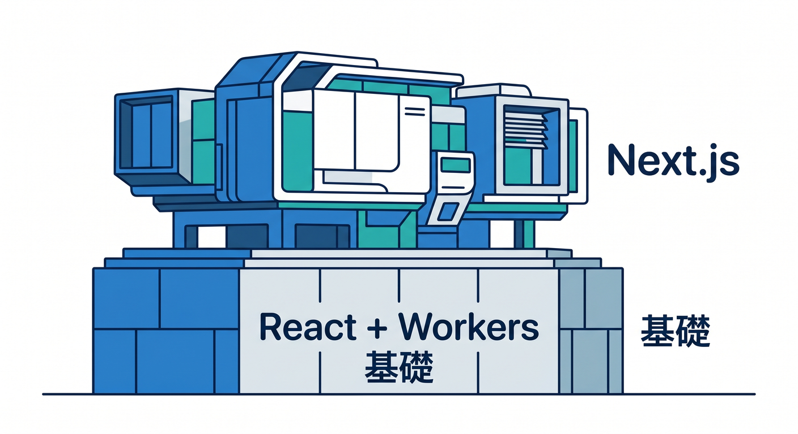
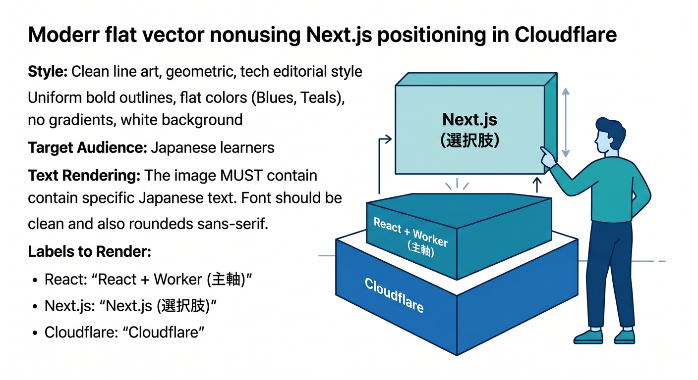
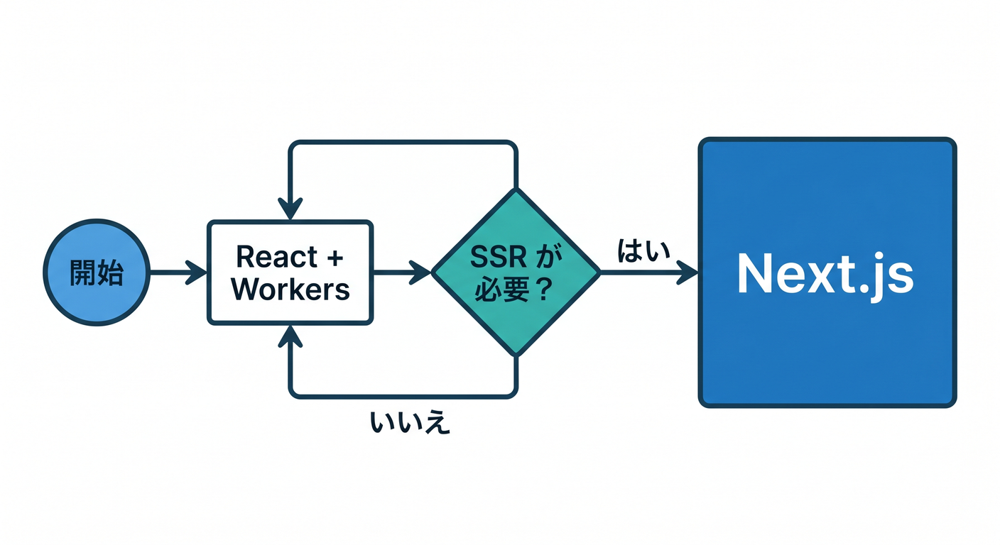
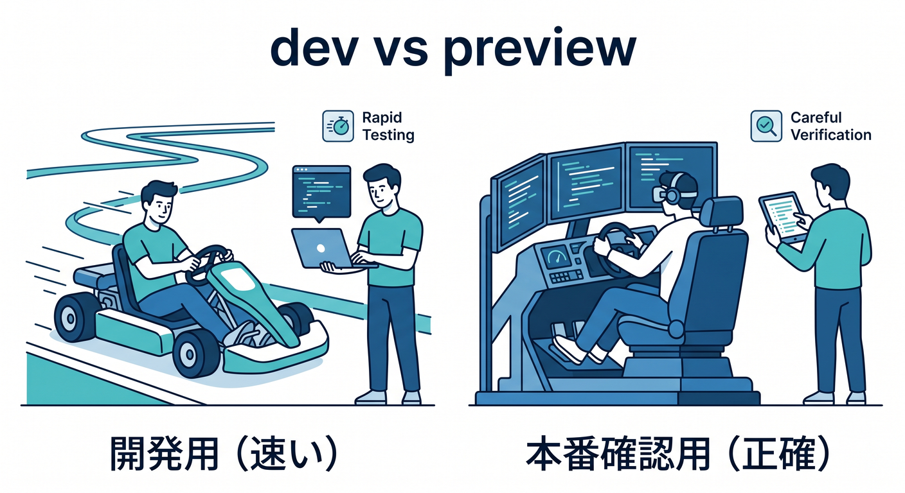
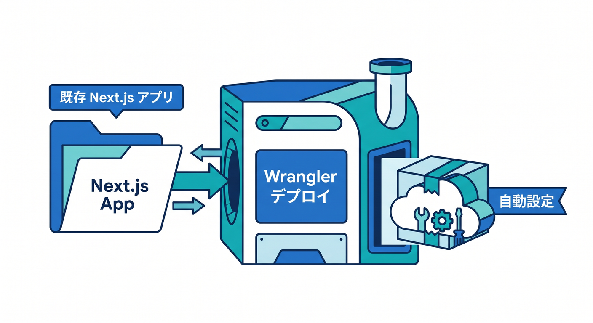
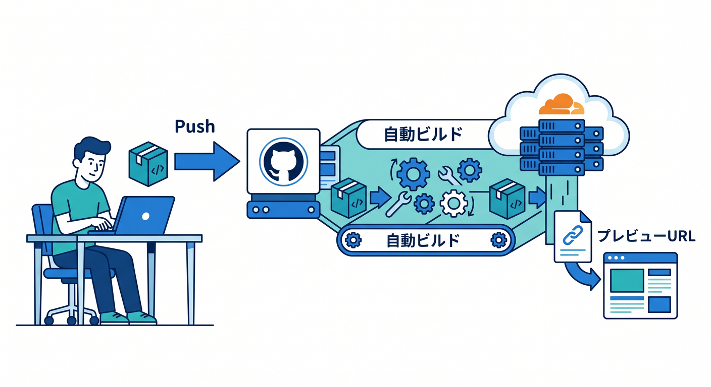
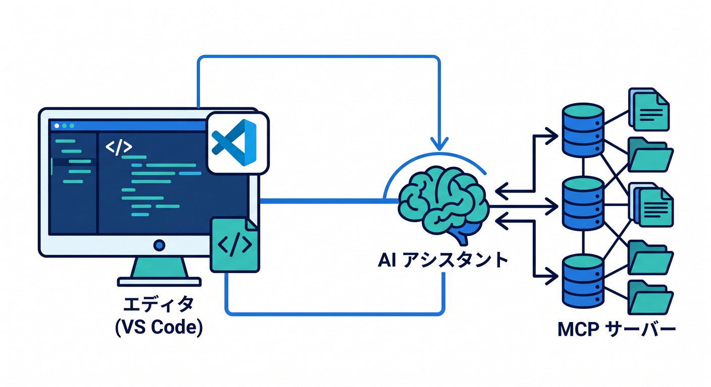
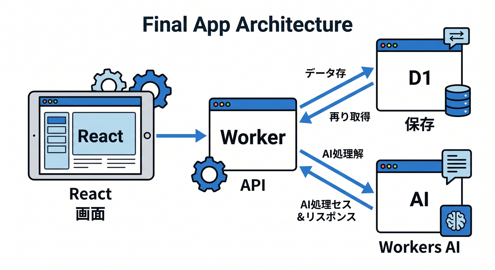
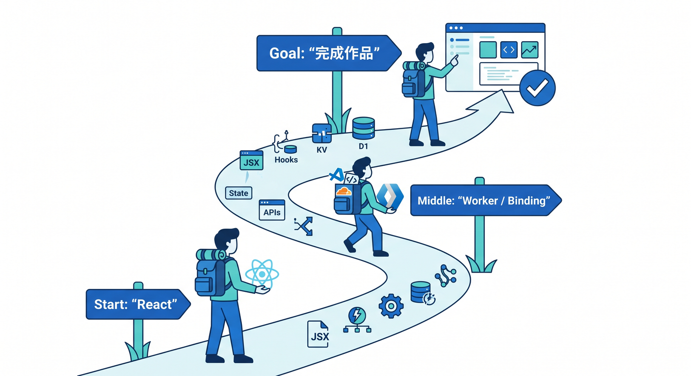

# 第15章：Next.jsはどう関わるの？を軽く見て、最後に作品へまとめよう 🏁🎉

ここは「Next.jsをマスターする章」ではありません😊
この章の役目は、**Cloudflare学習の中で Next.js がどこにいるのか**をやさしく整理して、最後に**小さな完成作品**へつなげることです。React と Workers を中心に進めてきた人が、「あ、Next.js はこういう時に使えばいいのね✨」と分かれば大成功です。

## この章でできるようになること 🎯

* Next.js を必要以上にこわがらなくなる
* React中心の学習で十分な場面と、Next.js を使うと嬉しい場面を見分けられる
* Cloudflare で Next.js を動かす最短ルートを理解できる
* 最終作品の設計を、自分の言葉で説明できる

---

## 15-1. まず結論です 😊☁️



本日時点のCloudflare公式導線で見ると、**学習の主軸は React + Workers でもまったく問題ありません**。Cloudflare には React SPA + Workers API + Cloudflare Vite plugin の公式導線があり、Vite plugin はローカルでも Workers runtime にかなり近い形で動かせます。一方で、**フルスタックな Next.js は Cloudflare Workers 上で OpenNext adapter を使って動かす**、という位置づけです。さらに Cloudflare Pages の Next.js 案内でも、**フルスタックSSRの Next.js は Workers ガイドを見る**ように誘導されています。つまり、学習の順番としては「React と Workers を先にしっかり」→「必要なら Next.js」を選ぶ流れが自然です。 ([Cloudflare Docs][1])

---

## 15-2. Next.js が入ると、何が増えるの？ 🤔⚛️➡️🚀



Cloudflare の Next.js ガイドでは、OpenNext adapter により **App Router、Pages Router、Route Handlers、React Server Components、SSG、SSR、ISR、Server Actions、Response streaming、`next/after`、Middleware** まで広くサポートされています。画像最適化は **Cloudflare Images** 経由で扱えます。さらに **PPR** と **`use cache`** もサポート対象ですが、これは Next.js 側で experimental 扱いです。注意点として、**Next.js 15.2 で導入された Node.js in Middleware はまだ未対応**です。なので、「かなり使えるけれど、全部が何でも完全同一というわけではない」と理解しておくのがちょうどいいです。 ([Cloudflare Docs][2])

ここで大事なのは、**Next.js は React の“上に乗る選択肢”**だということです😊
React を知らないまま Next.js に入ると、「React の話」なのか「Next.js の話」なのかが混ざってしまいがちです。逆に、ここまでの章で React と Workers の役割が見えていれば、Next.js は「より大きめのアプリを整理しやすくする道具🧰」として理解しやすくなります。

---

## 15-3. じゃあ、React中心のままでいいの？ それとも Next.js？ 🧭✨



最初の答えは、**まずは React中心で十分**です。Cloudflare 公式の React + Vite 導線は、React SPA と Workers API をひとつのプロジェクトで扱いやすく、Vite plugin によってローカル開発も本番の Workers runtime にかなり近い形で進められます。初学者にとっては、この「画面」と「API」のつながりが見えやすいのがとても大きいです。 ([Cloudflare Docs][1])

Next.js を選びたくなるのは、たとえばこんな場面です🌟

* ページ単位の構造が大きくなってきた
* SSR や ISR を使って表示や更新の考え方を整理したい
* App Router ベースの設計に触れたい
* もともとチームや既存案件が Next.js 前提
* 将来、Cloudflare 上で Next.js 案件を扱う可能性が高い

つまり、**「Reactでは不足」になったら Next.js**、くらいの気持ちでOKです。
学習用としては、React + Worker で完成作品を1本作り、そのあと「同じ題材を Next.js 版にしてみる」と理解がかなり深まります ✨

---

## 15-4. Cloudflare で Next.js を試す最短ルート 🛠️⚡



新規作成の最短導線は、公式どおり **C3** を使う形です。Cloudflare の公式ガイドでは、Next.js 用に次のコマンドが案内されています。C3 は内部で Next.js の公式セットアップを呼びつつ、Cloudflare 用の設定まで整えてくれます。 ([Cloudflare Docs][2])

```bash
npm create cloudflare@latest -- my-next-app --framework=next
cd my-next-app
npm run dev
npm run preview
npm run deploy
```

この4つのコマンドの意味は、かなり大事です 👀

* `npm run dev`
  Next.js の開発サーバーで動かします。更新が速く、書いてすぐ確認しやすいです。 ([Cloudflare Docs][2])
* `npm run preview`
  こちらは **Workers 側の `workerd` runtime** に寄せた確認です。本番により近い挙動を見るなら、こちらが大切です。Cloudflare 公式も、**integration test や本番前確認では preview を使うべき**と案内しています。 ([Cloudflare Docs][2])
* `npm run deploy`
  `*.workers.dev` やカスタムドメインへ配備できます。CI/CD からも使えます。 ([Cloudflare Docs][2])

この「**dev は気持ちよく作る用、preview は本番に寄せて確かめる用**」という区別は、かなり重要です 😊

---

## 15-5. 既存の Next.js プロジェクトを持ってくるとき 📦☁️



既存プロジェクトでも、Cloudflare 側の導線はかなり親切です。**Wrangler 設定がまだない Next.js プロジェクトで `wrangler deploy` を実行すると、自動検出して必要な設定を生成してくれる**よう案内されています。生成される設定例には、`.open-next/worker.js`、`.open-next/assets`、`nodejs_compat`、observability 有効化、`@opennextjs/cloudflare` などが含まれます。 ([Cloudflare Docs][2])

しかも自動設定では、**R2 が有効なアカウントなら Next.js のキャッシュ用に R2 を自動セットアップ**してくれます。これは ISR などのキャッシュ機能に効いてきます。 ([Cloudflare Docs][3])

手動で構成したい場合は、Cloudflare 公式では **`@opennextjs/cloudflare`** の導入、`wrangler` の追加、`nodejs_compat` の有効化、`compatibility_date` の設定、`open-next.config.ts` の作成、そして `preview` / `deploy` / `cf-typegen` スクリプトの追加が案内されています。特に `cf-typegen` は **`cloudflare-env.d.ts` を生成して env の型を作る**ため、ここまで学んできた「型付き bindings」の流れを Next.js 側でも続けられます。 ([Cloudflare Docs][2])

---

## 15-6. GitHub連携・プレビュー確認まで入れると、かなり実戦っぽいです 🌈🔁



Cloudflare Workers には **Git integration / Workers Builds** があり、GitHub や GitLab のリポジトリをつなげると、**push で自動ビルド・自動デプロイ**できます。新規接続でも既存 Worker でも設定できます。さらに、Wrangler 設定がまだない場合は **autoconfig が走ってPRを作り、プレビュー環境まで用意してからマージ**という流れも取れます。 ([Cloudflare Docs][4])

プレビュー確認もかなり強いです✨
Cloudflare の **Preview URLs** では、バージョンごとの一意URLや、読みやすい別名URLを使えます。PRごとの確認やチーム内レビューに向いていて、必要なら **Cloudflare Access で認証をかけて限定公開**もできます。非本番ブランチのビルドでは、デフォルトで `wrangler versions upload` を使ってプレビューURLを出す流れも案内されています。 ([Cloudflare Docs][5])

---

## 15-7. GitHub Copilot と MCP は、ここでかなり活きます 🤖💬🧠



GitHub 公式では、**VS Code の Copilot Chat で Agent モードを選び、GitHub MCP server を使う**流れが案内されています。これにより、Copilot Chat から **Issue 作成、PR 一覧、リポジトリ情報の取得**などを実行できます。学習中でも「このPRの差分を要約して」「この issue を教材タスクに分解して」みたいな使い方がしやすいです。 ([GitHub Docs][6])

Cloudflare 側も、2026年時点ではかなり **AI支援前提**の導線を出しています。Workers の公式ドキュメントには、**VS Code を含む各種エディタ/エージェントからプロンプトで Workers アプリを作る**案内があり、さらに **`cloudflare-docs` MCP server** や **`cloudflare-observability` MCP server** をつないで、ドキュメント理解やログ確認に使う方法まで書かれています。加えて Cloudflare 自身の MCP server 群として、**Cloudflare API MCP server** も提供されています。 ([Cloudflare Docs][7])

この章での Copilot 活用例としては、たとえばこんな聞き方が相性よいです ✨

* 「この Next.js プロジェクトで Cloudflare 固有の設定はどれ？」
* 「`npm run dev` と `npm run preview` の違いを、初心者向けに説明して」
* 「この `wrangler.jsonc` の binding を型付きで使う最小コードを書いて」
* 「このエラーは Next 側？ Cloudflare 側？ どっちが原因っぽい？」
* 「このPRの変更点を、第15章の学習ポイントに言い換えて」

---

## 15-8. ここまでの総仕上げ：完成作品を1本つくろう 🏯✨🤖



この教材の締めとしておすすめなのは、**「城めぐりメモAI」** みたいな小さな作品です 😊
テーマは何でもいいですが、題材が好きなものだと続きやすいので、ここでは少し楽しくしてあります。

**作品のイメージ**

* 行った場所のメモを登録できる
* ひとこと感想を書ける
* AI が「要約」「タグ付け」「紹介文づくり」をしてくれる
* あとから検索できる
* GitHub 連携で preview URL を出して、友だちに見せられる

**おすすめ構成**

* 画面: React か Next.js
* API: Cloudflare Workers
* 保存: D1
* AI機能: Workers AI
* AIの観測と制御: AI Gateway
* 検索拡張: 必要なら AI Search
* 配布: Workers Builds + Preview URLs

この構成は Cloudflare の binding を中心にきれいに組めます。Workers の bindings は REST API 直呼びより制約が少なく、性能面でも有利で、**「権限」と「API」が一体になっている**のがポイントです。秘密鍵をコードに直接入れなくてよいので、学習用でも実戦用でも扱いやすいです。D1 は Worker binding API で `env` から触れ、TypeScript では `wrangler types` と generic 型でクエリ結果まで型付けできます。Workers AI も binding でつなげます。AI Gateway はログ、分析、キャッシュ、レート制限、リトライ、モデルfallbackなどをまとめて扱えます。さらに AI Search は自然言語検索を追加しやすく、MCP endpoint まで持っています。 ([Cloudflare Docs][8])

**作る順番**はこのくらいがちょうどいいです 👣

1. まずは一覧画面を作る
2. Worker で `/api/memos` を作る
3. D1 に保存する
4. Workers AI で要約ボタンを付ける
5. AI Gateway を前段に入れてログを見る
6. 余裕があれば AI Search で自然文検索を付ける
7. GitHub 連携して Preview URL で確認する

この順番だと、「画面 → API → 保存 → AI → 運用」の流れが見えて、とてもきれいです ✨

---

## 15-9. 章末ミニ課題 📝🌟


**課題A**
「自分は React + Workers のままで進むか、Next.js を入れるか」を、3行で理由つきで書いてみましょう。

**課題B**
`dev` と `preview` の違いを、友だちに説明するつもりで書いてみましょう。

**課題C**
完成作品の設計メモを作ってみましょう。
最低でもこの4つを書けたらOKです。

* 画面で何を入力するか
* Worker API を何本作るか
* D1 に何を保存するか
* AI に何をやらせるか

---

## まとめ 🎉☁️



この章のいちばん大事な結論は、**Next.js は“必須科目”ではなく、“必要になったら使える選択肢”**ということです。Cloudflare の公式導線でも、React + Vite + Workers はとても学びやすい道として整っていて、Next.js は OpenNext adapter によって Workers 上でしっかり使える、という立ち位置です。だから学習としては、**React と Workers と bindings と AI を自分の手で1本つなげること**が先です。そのうえで Next.js に進むと、かなり理解しやすくなります。 ([Cloudflare Docs][1])

必要なら次に、同じ調子で
**「Cloudflare × TypeScript 学習教材 15章アウトライン」の全15章ぶんを、トーンと粒度をそろえて一覧化できる完成版テンプレート**
として整えてお渡しできます。

[1]: https://developers.cloudflare.com/workers/framework-guides/web-apps/react/ "React + Vite · Cloudflare Workers docs"
[2]: https://developers.cloudflare.com/workers/framework-guides/web-apps/nextjs/ "Next.js · Cloudflare Workers docs"
[3]: https://developers.cloudflare.com/workers/framework-guides/automatic-configuration/ "Deploy an existing project · Cloudflare Workers docs"
[4]: https://developers.cloudflare.com/workers/ci-cd/builds/ "Builds · Cloudflare Workers docs"
[5]: https://developers.cloudflare.com/workers/configuration/previews/ "Preview URLs · Cloudflare Workers docs"
[6]: https://docs.github.com/en/copilot/how-tos/provide-context/use-mcp-in-your-ide/use-the-github-mcp-server "Using the GitHub MCP Server in your IDE - GitHub Docs"
[7]: https://developers.cloudflare.com/workers/get-started/prompting/ "Prompting · Cloudflare Workers docs"
[8]: https://developers.cloudflare.com/workers/runtime-apis/bindings/ "Bindings (env) · Cloudflare Workers docs"