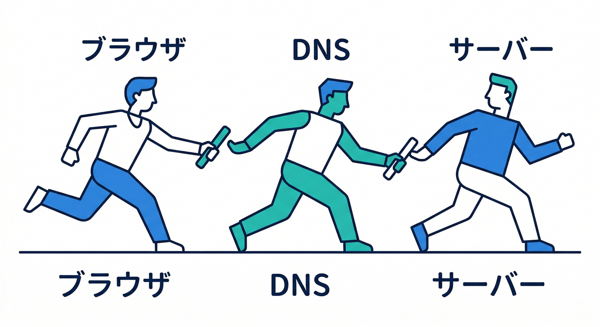
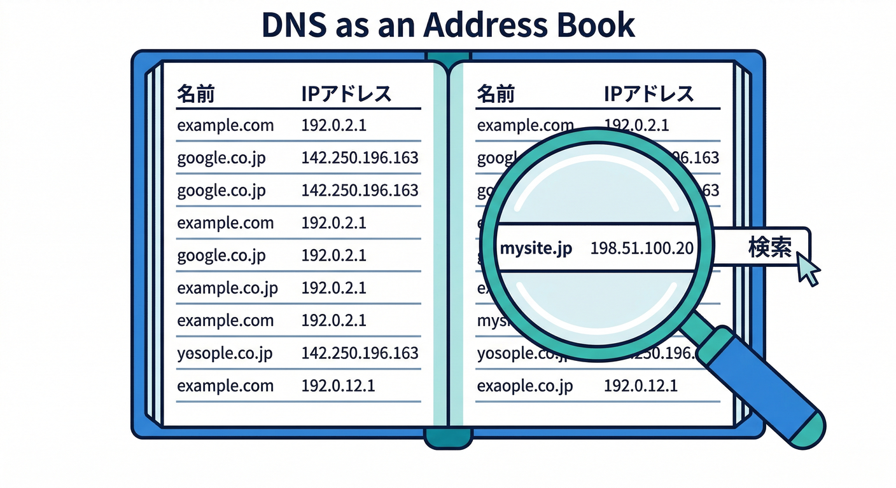
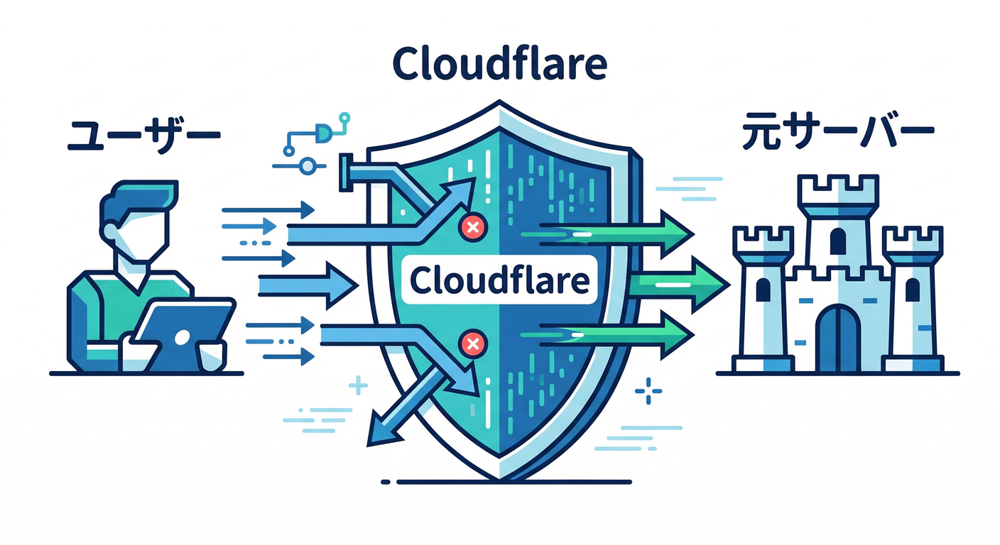
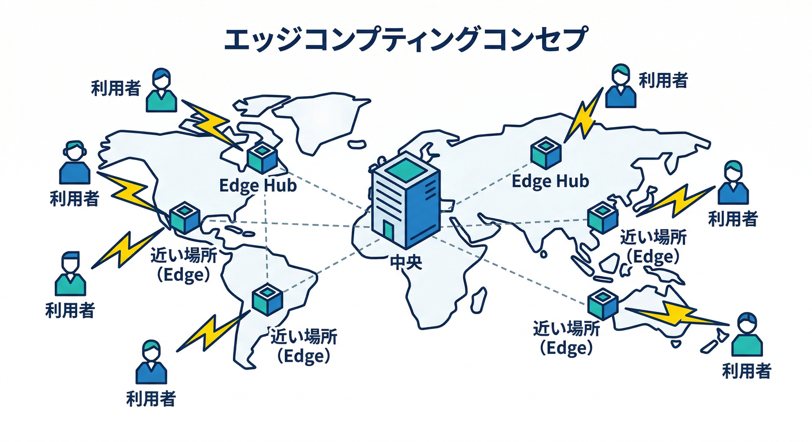

# Webとクラウドの超基礎を先に押さえよう 🧭 15章アウトライン 🧭☁️✨

## 第01章：インターネットって、そもそも何が起きているの？🌍

最初は、ブラウザでURLを開いたときに何が起きるのかを、できるだけやさしく見ていきます。
「サイトを見る」という当たり前の動作の裏で、名前を調べて、相手を探して、通信して、ページを受け取る流れがあることをつかみます。
この章では専門用語を覚えるよりも、**Webには“順番”がある**と感じてもらうことが大事です。
ここがわかると、Cloudflareの機能がただの便利機能ではなく、流れの中の役割として見えるようになります。 ([Cloudflare Docs][3])

## 第02章：ドメインって何？ URLって何？📛

この章では、ドメイン名とURLの違いをやさしく整理します。
「住所みたいなもの」とよく言われるけれど、どこまでが住所で、どこからがページ指定なのかを、例を使って理解します。
ここで `https://example.com/news` のような形を読めるようになると、後のDNSやHTTPSがとても楽になります。
Webの入口になる言葉を、ここでふんわりではなく、ちゃんと読める状態にします。 ([Cloudflare Docs][1])

## 第03章：DNSは“ネットの住所録”ってどういう意味？📚

DNSを、ただの難しい仕組みではなく、**名前から行き先を調べる案内係**として学びます。
Cloudflare公式も Fundamentals の中で、DNS explained、DNS provider、reverse proxy という流れで基礎を整理しています。
この章では A レコードや CNAME を暗記するより先に、**なぜDNSがないとサイトにたどり着けないのか**を理解します。
「URLを入れたらすぐ表示される」の裏で、ちゃんと名前解決が起きていることをつかむ章です。 ([Cloudflare Docs][1])

## 第04章：Cloudflare DNSは普通のDNSと何が違うの？☁️📍

ここでは、Cloudflareが単に名前を引くだけでなく、**DNS provider と reverse proxy の両方の顔を持つ**ことを学びます。
Cloudflareにドメインを載せると、名前解決だけでなく、その先の通信の通り道にも関わるようになります。
この違いがわかると、「なぜCloudflareで速くなるの？」「なぜ守れるの？」が一気につながります。
Cloudflareを使う意味が、ここで初めて“構造として”見えてきます。 ([Cloudflare Docs][1])

## 第05章：サーバーって何者なの？🖥️

この章では、サーバーを「特別な魔法の箱」ではなく、**リクエストに答える側のコンピューターや仕組み**として理解します。
あわせて、ブラウザはお願いする側、サーバーは返す側、という関係を整理します。
後でWorkerを学ぶためにも、「サーバーがある世界」と「サーバーを強く意識しなくてよい世界」の違いを感じる土台を作ります。
クラウド学習でつまずきやすい“サーバー恐怖症”を、ここでかなり減らす章です。 ([Cloudflare Docs][3])

## 第06章：HTTPとHTTPSは何が違うの？🔒

この章では、HTTPを「Webで会話するための約束」、HTTPSを「それを暗号化して守る仕組み」として学びます。
CloudflareのSSL/TLS docs では、**訪問者↔Cloudflare** と **Cloudflare↔origin** の2本の接続をはっきり分けて説明しています。
この考え方は初心者にとても大事で、「HTTPSだから全部同じ」ではないとわかるだけで理解がかなり深まります。
後の証明書やSSLモードの話へ、きれいにつながる基礎章です。 ([Cloudflare Docs][4])

## 第07章：Edgeって何？ なぜCloudflareでよく出てくるの？🌐⚡

Edge を「利用者の近く側で処理する考え方」として、やさしく紹介します。
Cloudflareの強みは、単にどこかのクラウド上で動かすことではなく、**global network 上で近い場所から届けたり処理したりできること**にあります。
この章では「中央のサーバーだけに全部集める世界」と「近い場所でさばく世界」の違いをイメージでつかみます。
Workers や CDN の理解が、ここからかなり楽になります。 ([Cloudflare Docs][5])

## 第08章：CDNとキャッシュの超基礎 🍪🚀

CDN を「近くにある受け渡し拠点」、キャッシュを「すぐ返せるように持っておく控え」として説明します。
Cloudflareを触ると必ず出てくる言葉なので、ここで怖くない状態にしておきます。
「なぜ速くなるのか」「なぜ元サーバーの負担が減るのか」を、数字ではなく感覚で理解する章です。
この章が入るだけで、Cloudflareがただの開発サービスではなく、Web配信の会社でもあることが見えてきます。 ([Cloudflare Docs][3])

## 第09章：クラウドって結局どういう考え方なの？☁️

ここではクラウドを、「自分で全部の機械を抱え込まず、必要な仕組みをサービスとして使う考え方」として理解します。
そのうえで、Cloudflare Workers のようなサーバーレス実行基盤が、なぜ初心者にやさしいのかを見ていきます。
Cloudflare Workers は公式でも、**インフラ管理を強く意識せずにアプリを作って配備できる実行基盤**として案内されています。
クラウドを“巨大で難しいもの”ではなく、“作ることに集中しやすい形”としてつかむ章です。 ([Cloudflare Docs][5])

## 第10章：Webサイト公開の流れを1本の道で理解しよう 🛣️

この章では、「ドメイン取得 → DNS設定 → Cloudflare経由 → HTTPS設定 → 配信」という流れを一本道で整理します。
Cloudflareのドメイン導入ガイドでも、**onboard → nameserver 更新 → SSL/TLS setup** という順番が明確です。
初心者はこの順番が頭の中で混ざりやすいので、作業の前にまず流れを言葉で説明できるようにします。
設定画面の操作より先に、**公開までのストーリー**を理解する章です。 ([Cloudflare Docs][6])

## 第11章：Cloudflareが“間に入る”と何がうれしいの？🛡️

この章では、Cloudflareが通信の途中に立つことで、**速くする・守る・見える化する**が同時にやりやすくなることを学びます。
DNSだけの会社ではなく、reverse proxy として振る舞うことで多くの価値が生まれる、という点をやさしく整理します。
この考え方が入ると、後のWAF、Rate Limiting、Turnstile、Workersまで、全部が1本につながります。
「Cloudflareは何をしてくれるの？」への答えが、かなり具体的になる章です。 ([Cloudflare Docs][1])

## 第12章：ここで初めてWorkersを見る ⚙️✨

基礎章の後半では、Cloudflare上でコードが動く世界を少しだけのぞきます。
Workers は Cloudflare の global network 上で動く serverless platform で、API やアプリの処理を載せられます。
ここではまだ本格実装には入らず、「サーバーを借りる」感覚とは違う世界があるんだな、と体感するところまでにとどめます。
基礎編の最後にこれを見ることで、前半のネットワーク知識が「開発にどうつながるか」が見えてきます。 ([Cloudflare Docs][5])

## 第13章：開発の入口はどう変わったの？ VS Code・Vite・Wrangler・Copilot 🛠️🤖

この章では、今どきのCloudflare開発の入り口をやさしく紹介します。
Cloudflare公式は、**新規では `wrangler.jsonc` 推奨**、**Cloudflare Vite plugin はデフォルトでほぼ無設定**、さらに **Wrangler 4.68.0 以降では既存フレームワークの自動検出**も案内しています。
GitHub Copilot 側では `.github/copilot-instructions.md` を使って、プロジェクトに沿った応答を出しやすくする導線も公式化されています。
つまり今の基礎学習は、CLIだけを丸暗記するより、**AI込みの開発導線を見渡す**ほうが自然です。 ([Cloudflare Docs][2])

## 第14章：AI時代のWeb基礎：CloudflareのAIサービスを地図で見る 🧠☁️

ここでは、AIを別世界にせず、Webとクラウドの延長として理解します。
Cloudflareでは **Workers AI がモデル実行**、**AI Gateway がキャッシュ・レート制御・リトライ・フォールバック**、**Vectorize がベクトルDB**、**AI Search が検索基盤**という形でつながっています。
「AIは外部APIを呼ぶだけ」と考えるより、Cloudflareの中で構成できる部品として見るほうが、今の全体像に合っています。
基礎編の段階でこの地図を持っておくと、後のAI章にとても入りやすくなります。 ([Cloudflare Docs][7])

## 第15章：次の時代の入口：Browser Rendering・Tunnel・MCPまで見て終わろう 🚪✨

最後は少しだけ先の世界を見ます。
Cloudflareは Browser Rendering で headless browser を global network 上で動かせて、さらに Playwright MCP や managed remote MCP servers も用意しています。
Tunnel は公開IPなしで安全にCloudflareへつなぐ仕組みとして案内されており、これも「クラウドとつながる」の現代版としてとても象徴的です。
この章は深掘り用ではなく、「Web基礎を学ぶと、もうAIエージェント時代の入口まで見えるんだ」と感じてもらう締めの章です。 ([Cloudflare Docs][8])

---

## この15章のねらい 🎯

この構成の狙いは、
**DNS・ドメイン・HTTPS・サーバー・Edge・クラウド**を、ただ用語集として並べるのではなく、**Cloudflareの世界観に自然につながる順番**で理解してもらうことです。

特に今回は、

* ネットの仕組みをやさしく知る 🌍
* Cloudflareがどこで何をしているかを見る ☁️
* WorkersやAIへつながる入口まで見渡す 🤖
* そのうえで次章以降に進みやすくする 🚀

という流れを強く意識しています。Cloudflareの公式ドキュメント群も、Fundamentals、Workers、AI、Browser Rendering、Agents を横断して見ると、この流れで理解するのがかなり自然です。 ([Cloudflare Docs][1])

[1]: https://developers.cloudflare.com/fundamentals/concepts/how-cloudflare-works/ "How Cloudflare DNS works · Cloudflare Fundamentals docs"
[2]: https://developers.cloudflare.com/workers/wrangler/configuration/ "Configuration - Wrangler · Cloudflare Workers docs"
[3]: https://developers.cloudflare.com/fundamentals/concepts/traffic-flow-cloudflare/ "Traffic flow through Cloudflare · Cloudflare Fundamentals docs"
[4]: https://developers.cloudflare.com/ssl/origin-configuration/ssl-modes/ "Encryption modes · Cloudflare SSL/TLS docs"
[5]: https://developers.cloudflare.com/workers/?utm_source=chatgpt.com "Overview · Cloudflare Workers docs"
[6]: https://developers.cloudflare.com/fundamentals/manage-domains/add-site/ "Onboard a domain · Cloudflare Fundamentals docs"
[7]: https://developers.cloudflare.com/workers-ai/platform/glossary/?utm_source=chatgpt.com "Glossary - Workers AI"
[8]: https://developers.cloudflare.com/browser-rendering/ "Browser Rendering · Cloudflare Browser Rendering docs"
