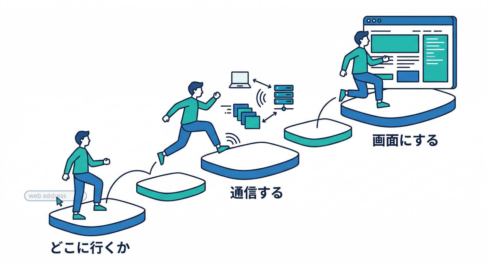
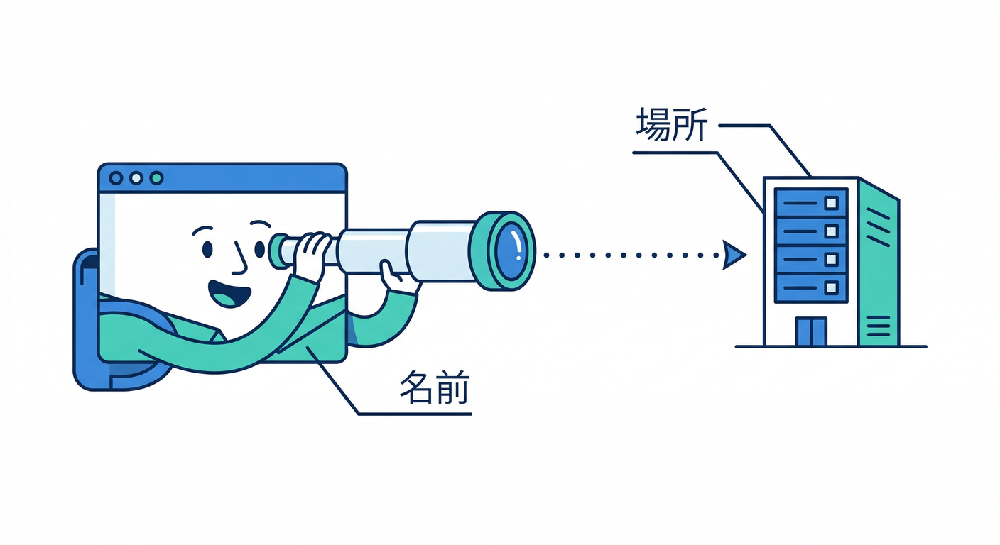
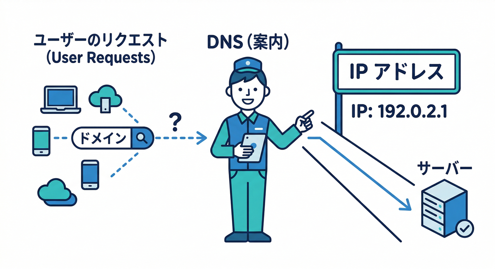
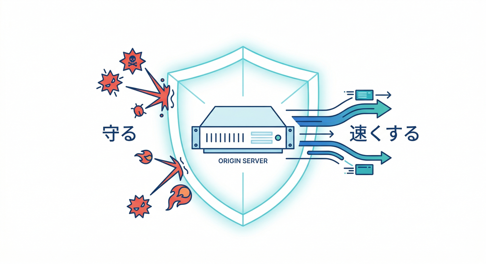
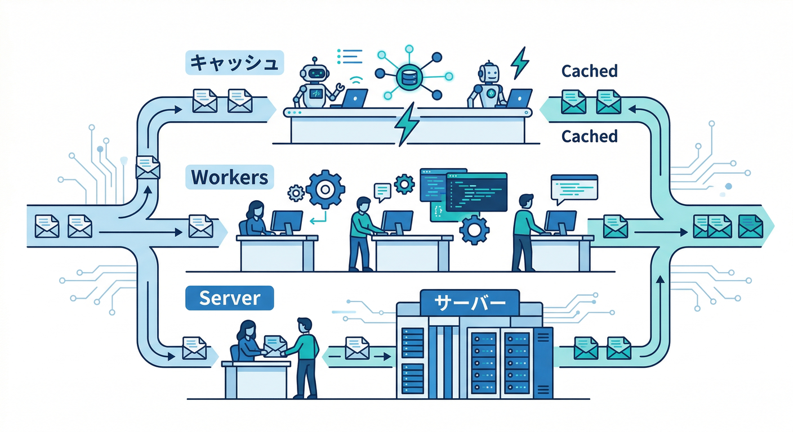
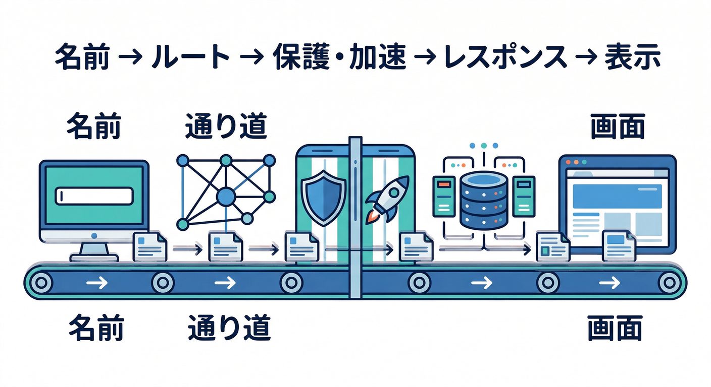

# 第01章：インターネットって、そもそも何が起きているの？🌍

この章では、ブラウザでサイトを開いたときに裏側で何が起きているのかを、むずかしい専門語をできるだけ減らして、1本の流れとしてつかんでいきます 😊
2026年4月時点のCloudflare公式ドキュメントでも、Webの流れを理解する土台として「DNS」「Cloudflareが前に立つ仕組み」「通信がCloudflareのネットワークに入って出ていく流れ」が整理されています。まずはここをやさしくつかむのが近道です。 ([Cloudflare Docs][1])

## この章のゴール 🎯

この章を読み終えるころには、次の4つがふんわりではなく言えるようになるのが目標です。

* サイト表示には、ちゃんと順番がある
* ブラウザは、いきなりページを見つけているわけではない
* Cloudflareは「途中に入って助ける存在」として理解するとわかりやすい
* 後で出てくる Workers や AI も、この流れの上に乗っている

---

## まずは結論です。サイト表示は「一瞬」ではなく「小さなリレー」です 🏃‍♀️🏃‍♂️💨

私たちはふだん、URLを開いてページが出たら「見えた」で終わりがちです。ですが実際には、ざっくり言うと「名前を調べる → どこへ送るか決める → 通信する → 返事を受け取る → ブラウザが画面にする」という順番があります。Cloudflareの公式でも、DNS が名前をIPアドレスへ変換し、条件によっては Cloudflare が reverse proxy としてその通信の前に立つ、という流れで説明されています。 ([Cloudflare Docs][2])

ここでいちばん大事なのは、用語を丸暗記することではありません 🙆
**Webには順番がある**、そして **Cloudflareはその順番の途中に自然に入ってくる**、この2つが見えれば、この先の学習がかなり楽になります。 ([Cloudflare Docs][2])

---

## 1. ブラウザは、まず「どこに行くか」を知りたがる 🔎

あなたがブラウザにサイトの名前を入れたとき、ブラウザは最初からそのサイトの場所を知っているわけではありません。
人間は `example.com` のような名前を読むのが得意ですが、ネットワークの世界では最終的にIPアドレスのような「数字の行き先」が必要です。Cloudflare公式でも、DNS はドメイン名をIPアドレスへ変換する仕組みとして説明されています。 ([Cloudflare Docs][2])

つまり最初の一歩は、「ページそのものを取りに行く」ではなく、**その名前の相手がどこにいるのかを調べる**ことなんですね 📚✨
この感覚があるだけで、あとでDNSを学ぶときに「住所録っぽいってこういうことか」とつながりやすくなります。 ([Cloudflare Docs][2])

---

## 2. DNSは、ネットの“案内係”です 📛➡️🔢

Cloudflare公式は DNS を「インターネットの電話帳」のように説明しています。
ドメイン名を、人が読める名前から、通信に必要なIPアドレスへ変換する役目です。DNSクエリは「その場所どこですか？」と道を聞いている感じで、DNSレコードは「その答えが書いてある正解帳」です。 ([Cloudflare Docs][2])

ここで初心者さんがよく誤解するのが、「URLを入れたらそのままページが届く」と思ってしまうことです 😅
でも実際には、かなり早いだけで、裏ではまず名前解決が動いています。だからDNSは、地味に見えてWebの入口そのものなんです。 ([Cloudflare Docs][2])

---

## 3. Cloudflareを使うと、ただ調べるだけでは終わらない ☁️🛡️⚡

Cloudflareは、単なるDNS会社としてだけではなく、**DNS provider** と **reverse proxy** の両方の役割を持てるのが大きな特徴です。Cloudflare公式でも、CloudflareはDNSとCDNを提供し、ドメインへのWebトラフィックを reverse proxy できると説明しています。 ([Cloudflare Docs][2])

そして DNS レコードが `proxied` になっていると、そのHTTP/HTTPS通信は Cloudflare を経由して origin server へ向かいます。Cloudflare公式は、この reverse proxy によってセキュリティ、性能、信頼性の向上、さらにキャッシュや攻撃対策などの利点があると整理しています。 ([Cloudflare Docs][2])

ここはかなり大事です 🌟
Cloudflareは「後から便利機能を足す箱」ではなく、**通信の通り道そのものに入って助ける存在**なんです。だから「速くなる」「守れる」「キャッシュできる」「ルールをかけられる」が全部つながります。 ([Cloudflare Docs][2])

---

## 4. その通信は、Cloudflareの近い場所へ入りやすい 🌐⚡

Cloudflare公式の Traffic flow の説明では、トラフィックが Cloudflare に入ることを on-ramping、出ていくことを off-ramping と呼びます。さらに Anycast によって、通信は近い Cloudflare データセンターへルーティングされる仕組みが説明されています。 ([Cloudflare Docs][1])

この考え方を超ざっくり言うと、利用者が遠い1台の本丸サーバーへ毎回まっすぐ走るのではなく、**まず近いCloudflareの拠点に入りやすい**ということです 🚪
その結果、Cloudflareが途中で守ったり、さばいたり、キャッシュしたりしやすくなります。ここが、後で出てくる Edge という考え方の入口です。 ([Cloudflare Docs][1])

---

## 5. 返事を作るのは、いつも同じ相手とは限りません 🖥️🤖

昔ながらのイメージだと、「ブラウザがサーバーにお願いして、サーバーが返事を返す」で終わりです。これは今でも基本として正しいです。
ただしCloudflareの世界では、返事の出どころが1パターンではありません。origin server が返すこともあれば、Cloudflareのキャッシュが返すこともあり、さらに Cloudflare Workers がその場で処理して返すこともあります。 ([Cloudflare Docs][2])

Cloudflare Workers は、Cloudflare の global network 上でアプリを構築・配備・スケールできる serverless platform として案内されています。しかも React や Next などのフレームワークとも組み合わせられます。つまり、後であなたが TypeScript で API や軽めのフルスタック構成を作るときも、この第1章の通信の流れの上にコードが乗るだけです。 ([Cloudflare Docs][3])

---

## 6. ブラウザは、返ってきたものを“画面”にしている 🪄🖼️

DNSで行き先がわかり、通信が通り、相手から返事が来て、そこでやっとブラウザは「表示」を作れます。Cloudflare公式のDNS説明でも、ブラウザはHTTPによってサイトやアプリを見つけて表示できるようになる、と整理されています。 ([Cloudflare Docs][2])

ここで覚えておきたいのは、**表示は最後**だということです。
私たちが見ているページはゴールであって、スタートではありません。だから表示で困ったときも、「画面が変だ」だけではなく、「その前のどこでつまずいた？」と考えられるようになると、開発でも運用でも強くなれます 💪✨ ([Cloudflare Docs][2])

---

## 7. AI時代でも、流れの基本は同じです 🧠☁️

「AIアプリになると別世界なのでは？」と思いやすいですが、基本の流れは同じです。
Cloudflare Workers AI は、Cloudflare の global network 上で serverless にAIモデルを動かせる仕組みとして案内されていますし、AI Gateway は AI アプリの分析、ログ、キャッシュ、レート制御、リトライ、モデルフォールバックなどを提供します。 ([Cloudflare Docs][4])

つまり AI の時代でも、ブラウザからのリクエストがどこかへ飛び、途中で制御され、どこかが返事を作る、という大筋は変わりません。
ただその「返事を作る担当」が、昔の単純なWebサーバーだけでなく、Workers や Workers AI、あるいは AI Gateway 越しのモデル群まで広がった、と考えると理解しやすいです。 ([Cloudflare Docs][3])

---

## 8. この章でいちばん持って帰ってほしいイメージ 🧭

サイトを見る流れを、ひとことで言うとこうです。

**名前を調べる → 通り道を決める → 途中で守る/速くする → 返事を作る → 画面にする**

Cloudflareを入れると、この「通り道」の部分がとても強くなります。
そして Workers や AI は、その通り道の先や途中で「返事を作る仕事」をより柔らかくしてくれる存在です。Cloudflare公式の Fundamentals、Workers、Workers AI、AI Gateway を横につなげて読むと、この見取り図がかなりきれいに見えてきます。 ([Cloudflare Docs][1])

---

## よくある勘違い 🤔

### 「URLを入れたら、すぐそのサーバーに直接つながってるんでしょ？」

必ずしもそうではありません。Cloudflareのような reverse proxy が前に立つ構成では、HTTP/HTTPS の通信は Cloudflare を経由して origin へ向かいます。 ([Cloudflare Docs][2])

### 「CloudflareってDNSのことだけでしょ？」

それだけではありません。Cloudflare公式は DNS provider と reverse proxy の両方の役割を明確に分けて説明しています。 ([Cloudflare Docs][2])

### 「AIを使うなら、まずAIの勉強から？」

もちろんAIの知識も大切ですが、その前に通信の順番がわかっていると、Workers AI や AI Gateway をどこに置くのかがかなり理解しやすくなります。 ([Cloudflare Docs][4])

---

## ミニ演習 ✍️✨

### 演習1

自分の言葉で、次の流れを説明してみましょう。
「ブラウザでサイトを開く → 名前を調べる → 通信する → 表示される」

### 演習2

次の質問に1文で答えてみましょう。
「Cloudflareは、Webのどの位置で仕事をしているの？」

### 演習3

次の2つの違いをふわっと説明してみましょう。

* ただのサーバー
* Cloudflareが前にいるサーバー構成

ここでは正確な専門用語より、**順番を言えること**が大切です 😊

---

## Copilotの使いどころ 🤖📝

GitHubの公式ドキュメントでは、Copilot に対して「このプロジェクトをどう理解し、どうビルド・テスト・検証するか」という追加コンテキストを与えるための repository custom instructions が案内されていて、Visual Studio Code もその対象に含まれています。 ([GitHub Docs][5])

この章の段階ではまだ設定を作りこまなくて大丈夫ですが、学習中に Copilot へ「URLを開いたときの流れを5段階で説明して」「DNSとreverse proxyの違いを小学生向けに言い換えて」のように聞くと、理解の整理にかなり役立ちます。後でCloudflareプロジェクトを作る段階では、custom instructions に「Worker の役割」「使うコマンド」「ファイル構成」を書いておくと、Copilotの返答を学習教材に寄せやすくなります。 ([GitHub Docs][5])

---

## この章のまとめ 🎉

この章で覚えるべきことは、たった1つです。

**Webは、順番でできている。**

ブラウザは、いきなりページを魔法のように出しているわけではありません。
まず名前を調べて、行き先を決めて、通信して、返事を受け取り、最後に画面にしています。Cloudflareはその流れの中で前に立ち、DNS、reverse proxy、キャッシュ、保護、そして Workers や AI までつなげていける存在です。 ([Cloudflare Docs][2])

次の第2章では、この流れの入口にある **ドメイン** と **URL** を、もっとやさしくほどいていきます 📛🌈

必要ならこのまま続けて、同じ文体・同じ濃さで
**「第2章　ドメインって何？ URLって何？📛」**
もそのまま書きます。

[1]: https://developers.cloudflare.com/fundamentals/concepts/traffic-flow-cloudflare/ "Traffic flow through Cloudflare · Cloudflare Fundamentals docs"
[2]: https://developers.cloudflare.com/fundamentals/concepts/how-cloudflare-works/ "How Cloudflare DNS works · Cloudflare Fundamentals docs"
[3]: https://developers.cloudflare.com/workers/ "Overview · Cloudflare Workers docs"
[4]: https://developers.cloudflare.com/workers-ai/ "Overview · Cloudflare Workers AI docs"
[5]: https://docs.github.com/ja/copilot/how-tos/configure-custom-instructions/add-repository-instructions "GitHub Copilot用のリポジトリカスタム命令の追加 - GitHubドキュメント"
