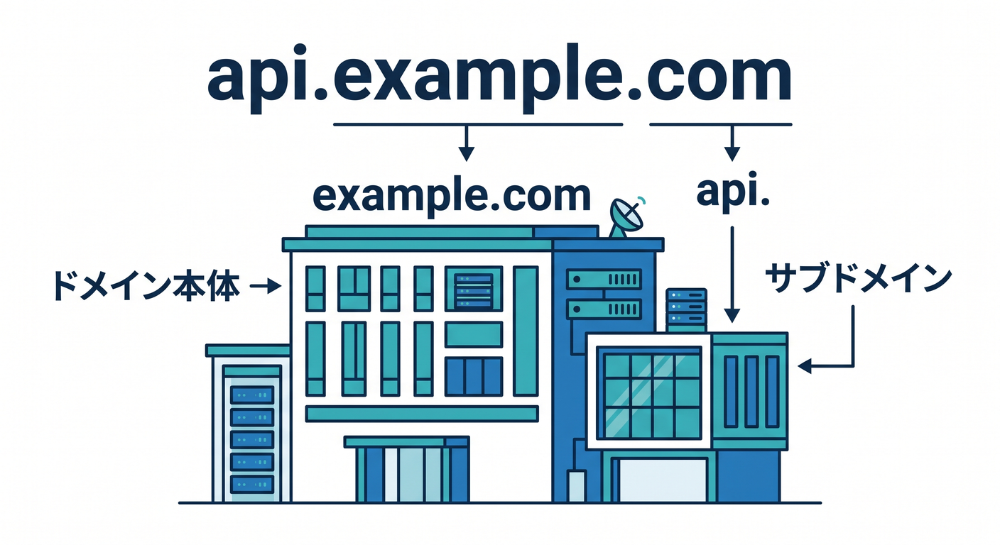
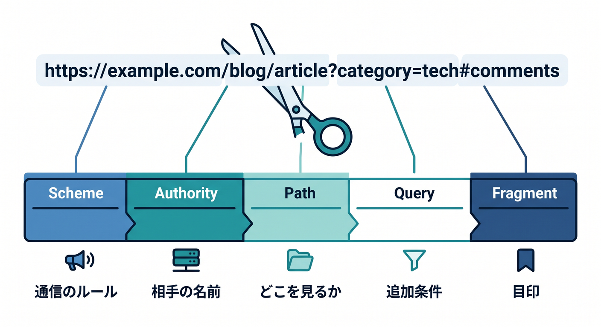
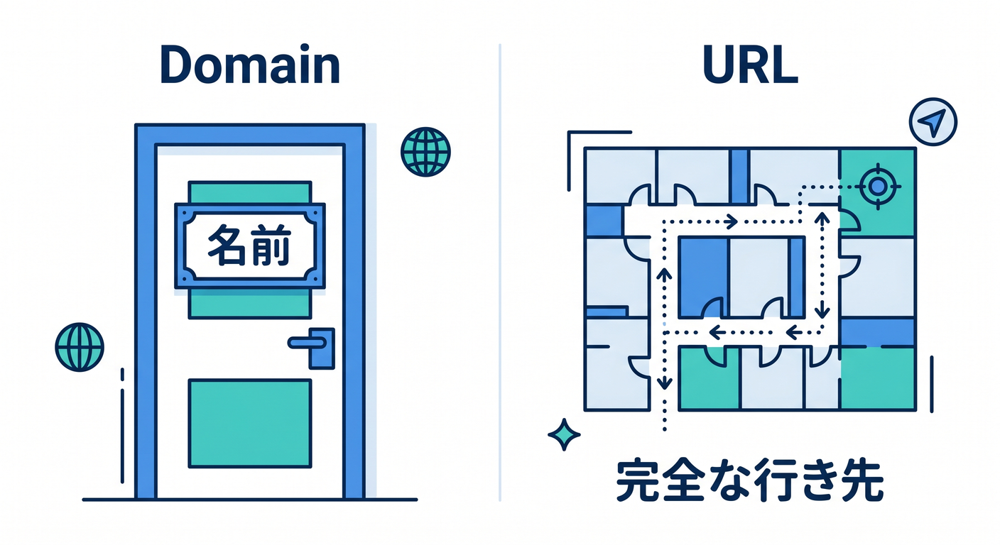
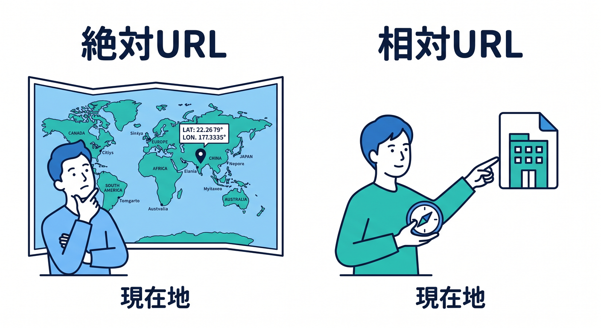
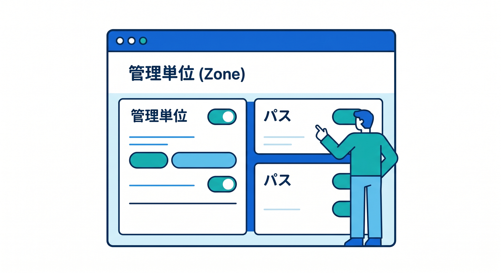
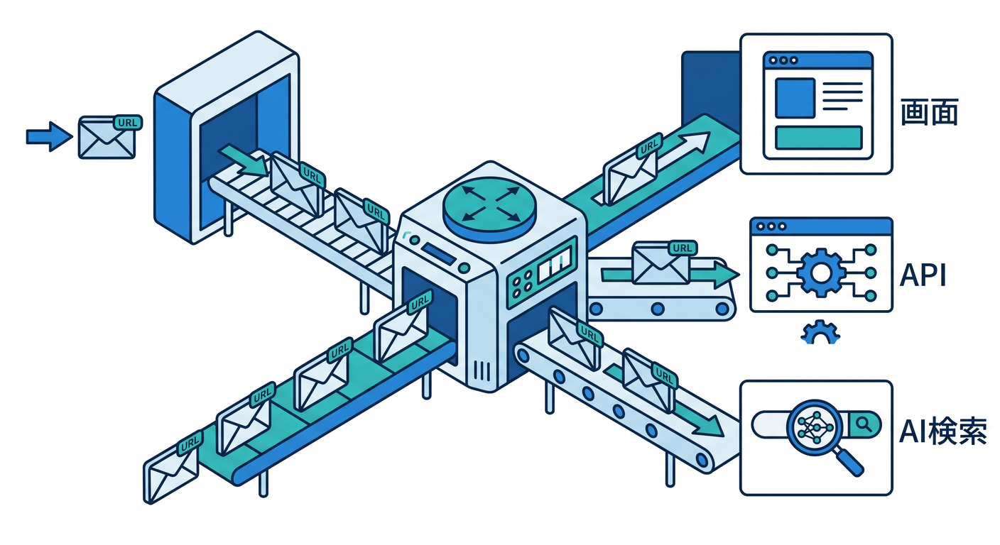
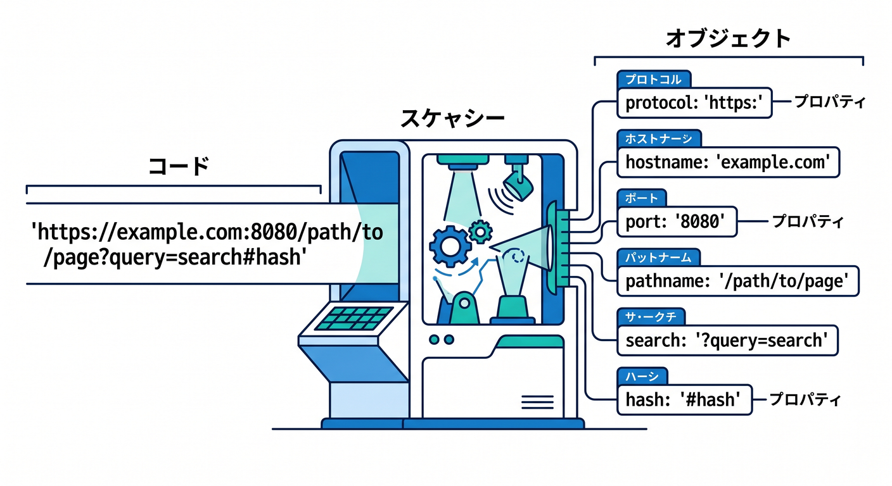

# 第02章：ドメインって何？ URLって何？📛

この章では、Webの入口で毎回出てくる「ドメイン」と「URL」を、ふわっとではなく、ちゃんと読めるようにしていきます 😊
ここが整理できると、次のDNS、HTTPS、Cloudflareの設定画面、Workersのルーティング、AI系のAPIエンドポイントの意味まで、かなりスッと入るようになります。Cloudflare公式では、ドメインをCloudflareに載せると DNS provider と reverse proxy として関わる形になり、Cloudflare上では追加したドメインやサブドメインが zone として扱われます。つまり、この章の用語はあとで全部つながります。 ([Cloudflare Docs][1])

## この章のゴール 🎯

この章を読み終えるころには、こんな状態を目指します。

* ドメインとURLの違いを、自分の言葉で説明できる
* 「https：//example.com/news?id=1#top」を分解して読める
* 「www」「api」「blog」が何者かわかる
* Cloudflareで、なぜドメイン・サブドメイン・パスの区別が大事なのか見えてくる
* ReactやWorkersでURLを扱うとき、何を見ればよいかわかる

---

## 1. まず一言でいうとこうです 🧭

**ドメイン**は「名前」です。
**URL**は「その名前を含んだ、完全な行き先」です。

たとえば「example.com」はドメインです。
でも「https：//example.com/news」はURLです。
後ろに「/news」が付いた時点で、もう「名前だけ」ではなく「どこに取りに行くか」まで指定しています。MDNは URL を「インターネット上の固有のリソースのアドレス」と説明していて、Cloudflareのドメイン関連ドキュメントはドメインそのものとサブドメインの管理を分けて扱っています。 ([MDNウェブドキュメント][2])

ここ、初心者さんがいちばん混ざりやすいポイントです 😌
「example.com/news」を見て「これがドメインだな」と思いがちですが、**ドメインは example.com まで**です。
「/news」はURLの中の**パス**であって、ドメインではありません。URLには、スキーム、ドメイン、パス、引数、アンカーなど複数の部品があります。 ([MDNウェブドキュメント][2])

---

## 2. ドメインって何？📛



ドメインは、サイトやサービスの「人間向けの名前」です。
数字のIPアドレスを人が覚えるのは大変なので、Webではまず「example.com」のような名前を使います。Cloudflareでも、ドメインは購入や移管の対象として扱われていて、既存ドメインをCloudflareへ追加して使う流れが案内されています。 ([Cloudflare Docs][3])

### 2-1. いちばん基本の3つ 🌱

**① apex domain（ルートドメイン）**
「example.com」のように、サブドメインを含まない土台の名前です。Cloudflareの用語集では、apex domain は subdomain part を含まないドメインで、root domain や naked domain とも呼ばれると説明されています。 ([Cloudflare Docs][4])

**② subdomain（サブドメイン）**
「[www.example.com」「api.example.com」「blog.example.com」のように、前に役割名を足したものです。Cloudflare公式でも](http://www.example.com」「api.example.com」「blog.example.com」のように、前に役割名を足したものです。Cloudflare公式でも) blog、support、store のようなサブドメイン例が使われています。 ([Cloudflare Docs][5])

**③ hostname / host の感覚**
実務では「[www.example.com」や「api.example.com」のような“完全な相手名”を見て、「どのホストに向かうか」と考えることが多いです。MDNの](http://www.example.com」や「api.example.com」のような“完全な相手名”を見て、「どのホストに向かうか」と考えることが多いです。MDNの) URL API でも hostname や host を分けて扱っていて、host はポート込み、hostname はドメイン名部分を表します。 ([MDNウェブドキュメント][6])

### 2-2. よくある勘違い 🙋

**「www は本体でしょ？」**
いいえ、**www はサブドメイン**です。
「example.com」も正しいし、「[www.example.com」も正しいです。どちらを使うかはサイト設計しだいです。Cloudflareの公式にも、apex](http://www.example.com」も正しいです。どちらを使うかはサイト設計しだいです。Cloudflareの公式にも、apex) domain から www へ、あるいは www から apex domain へリダイレクトする例があります。つまり、www は必須の飾りではなく、設計上の選択肢です。 ([Cloudflare Docs][5])

**「ドメインを買う場所 = サイトを置く場所？」**
これも別です。ドメインは購入・移管の対象で、Cloudflareでも Registrar が用意されています。一方で、実際のアプリやページの置き場所は別の仕組みになることがあります。あとで Cloudflare Workers や Custom Domains が出てくると、この切り分けがとても大事になります。 ([Cloudflare Docs][3])

---

## 3. URLって何？🌍🔎



URL は、**どの方法で・どこへ・どんな条件でアクセスするか**をまとめて書いたものです。
MDNでは、URL をリソースのアドレスとして説明し、その構造を スキーム、オーソリティ、パス、引数、アンカー という形で分解しています。 ([MDNウェブドキュメント][2])

例として、これを見てみましょう ✨

「https：//api.example.com/v1/chat?q=sengoku#answer」

このURLを、やさしく分けるとこうです。

* 「https」→ 通信のルール
* 「api.example.com」→ 相手の名前
* 「/v1/chat」→ 相手の中のどこを見るか
* 「?q=sengoku」→ 追加条件
* 「#answer」→ ページ内の目印

### 3-1. スキーム 🔐

URLの最初の「https」の部分は**スキーム**です。
MDNは、ここをブラウザーがリソース取得に使うプロトコルとして説明しています。Webでは普通は HTTP または HTTPS を見ます。第6章で詳しくやりますが、今は「通信の種類の名前」くらいで大丈夫です。 ([MDNウェブドキュメント][2])

### 3-2. オーソリティ（相手の名前のかたまり）🏠

次の「api.example.com」のような部分は、MDNの説明では**オーソリティ**です。
ここにはドメインと、必要ならポート番号が入ります。標準ポートの HTTP 80、HTTPS 443 を使う場合は、普通はポートは省略されます。 ([MDNウェブドキュメント][2])

つまり、

* 「example.com」なら土台のドメイン
* 「api.example.com」なら api というサブドメインを含む名前
* 「localhost:3000」ならポート付き

という見方になります 😊
この見方に慣れると、開発中の「localhost:5173」や「localhost:3000」が何者かもわかりやすくなります。MDNの URL API でも、host はドメイン＋ポート、hostname はドメイン名部分、origin はスキーム＋ドメイン＋ポートとして読めます。 ([MDNウェブドキュメント][6])

### 3-3. パス 🗂️

「/v1/chat」や「/news/article」の部分は**パス**です。
昔はサーバー上の物理ファイルっぽい意味合いが強かったのですが、MDNは、今では多くの場合サーバーが処理する抽象的なものだと説明しています。つまり「/news」が本当に news というファイルを指しているとは限りません。React、Next.js、Workers、APIルートでも、この“見た目は道、実体はアプリの処理先”という感覚が大事です。 ([MDNウェブドキュメント][2])

### 3-4. クエリー文字列（引数）🧾

「?q=sengoku」や「?page=2&sort=new」の部分は、**引数**や**クエリー文字列**です。
MDNでは、これはサーバーに追加情報を渡すキーと値の組として説明されています。検索語、ページ番号、並び順、フィルター条件などでよく使われます。 ([MDNウェブドキュメント][2])

### 3-5. フラグメント（アンカー）📌

「#answer」や「#comments」は**フラグメント**です。
ここはとても大事で、MDNは「# の後ろの部分はサーバーへ送られない」と明記しています。これは、ページ内スクロールやタブ位置の目印だと思うとわかりやすいです。つまり「?page=2」はサーバー側の判断に関われますが、「#comments」は基本的にブラウザー側の目印です。 ([MDNウェブドキュメント][2])

---

## 4. ドメインとURLの違いを、1回できっちり整理しよう 🧠✨



ここで一度、混ざりやすいものを並べます。

**例1：example.com**
これはドメインです。URLではありません。
「どの通信方法で行くか」「どのパスを見るか」までは書いていないからです。 ([MDNウェブドキュメント][2])

**例2：https：//example.com**
これはURLです。
スキームも含めて、アクセス先が完成しています。 ([MDNウェブドキュメント][2])

**例3：https：//example.com/news**
これもURLです。
ドメインは example.com、パスは /news です。 ([MDNウェブドキュメント][2])

**例4：https：//[www.example.com/news?id=3#top](http://www.example.com/news?id=3#top)**
これもURLです。
www はサブドメイン、/news はパス、?id=3 は引数、#top はフラグメントです。 ([Cloudflare Docs][5])

この区別ができるようになるだけで、Cloudflareの設定画面で
「この設定はドメイン単位？ サブドメイン単位？ パス単位？」
という見分けがかなりしやすくなります 😊

---

## 5. 絶対URLと相対URLも、ここで軽く押さえよう 🧱



MDNは、URLには**絶対URL**と**相対URL**があると説明しています。
ブラウザーのアドレスバーに入れるときは基本的に絶対URLが必要ですが、HTML文書やアプリの中では、すでに現在地がわかっているので相対URLを使えます。 ([MDNウェブドキュメント][2])

たとえば、

* 「https：//example.com/images/logo.png」→ 絶対URL
* 「/images/logo.png」→ ルート相対
* 「../images/logo.png」→ 相対URL

という感じです。
ReactやNext.jsでも、画像やリンクで相対URLを使う場面はよくありますし、Workersで fetch 先や Request URL を扱うときも、**いま基準がどこか**を意識すると混乱しにくくなります。MDNの URL API では、相対URLとベースURLから完全なURLを作れます。 ([MDNウェブドキュメント][6])

---

## 6. Cloudflare目線で見ると、なぜこの章が大事なの？☁️🛡️



ここから少しだけ Cloudflare 目線に寄せます。
Cloudflareに既存ドメインをオンボードすると、Cloudflareはそのサイトの reverse proxy と DNS provider として動きます。さらに、Cloudflareでは追加したドメインやサブドメインが zone になります。つまり、Cloudflareの管理は「ただの文字列」ではなく、**どのドメインやサブドメインを対象にするか**という単位で進みます。 ([Cloudflare Docs][1])

たとえば、あとで Workers を使うと、**Custom Domains** で Worker をドメインまたはサブドメインに接続できます。Cloudflare公式では、Custom Domains を設定すると Cloudflare が DNS レコードを作り、必要な証明書も発行し、そのドメインまたはサブドメインの**全パス**が Worker に向くと説明しています。ここ、かなり大事です。
「example.com に付けるのか」「api.example.com に付けるのか」で役割が変わるし、付けた先では「/v1/chat」「/search」「/images」などのパスがアプリ設計に直結します。 ([Cloudflare Docs][7])

つまりCloudflare学習では、

* ドメイン単位で何を管理するか
* サブドメイン単位で何を分けるか
* URLのパスで何を処理するか

この3段階で考えるクセがとても大切です 🌟

---

## 7. AI時代っぽく見ると、URL設計はさらに大事になります 🤖✨



CloudflareのAI系サービスを見ても、URLの考え方はそのまま生きます。
Cloudflareの関連ドキュメントでは、Workers AI はグローバルネットワーク上の serverless GPUs でモデル実行、AI Gateway はキャッシュ・レート制御・リトライ・モデルフォールバックなどでAIアプリを制御、Vectorize はベクトルデータベース、AI Search はそれらと組み合わせてフルスタックAIアプリを作る部品として整理されています。 ([Cloudflare Docs][8])

だから、たとえば実務ではこんな切り分けが自然です 😊

* 「app.example.com」→ フロント画面
* 「api.example.com」→ WorkersのAPI
* 「search.example.com」→ 検索系の入口
* 「example.com/docs」→ 通常の公開ページ

この分け方自体は設計例ですが、考え方の芯は同じです。
**どの名前に何の役割を持たせるか**、**どのパスでどの機能を受けるか**。
AIアプリになっても、URLの読み方がそのまま設計力になります 🚀

---

## 8. VS Code・Copilot・今どきのCloudflare開発ともつながるよ 🛠️💡

この章は基礎ですが、後ろの開発章ともちゃんとつながっています。
Cloudflareは新規プロジェクトで wrangler.jsonc を推奨していて、Wrangler 4.68.0 以降では既存フレームワークを自動検出して、設定生成やスクリプト追加まで行えると案内しています。さらに Cloudflare Vite plugin は Vite と Workers runtime を統合し、フロントエンド資産のビルドやフルスタック開発を支えます。Next.js は Cloudflare Workers 上で OpenNext adapter を使ってデプロイできます。 ([Cloudflare Docs][9])

AI補助の流れもかなり公式化されています。
Cloudflareの Workers prompting ドキュメントは GitHub Copilot 利用時に .github/copilot-instructions.md を置く導線を示していて、GitHub公式も同じファイルによるリポジトリ全体のカスタム命令、さらに .github/instructions 配下の path-specific instructions を説明しています。VS Code では GitHub Copilot 初回設定時に必要拡張が自動で入り、Copilot Chat も使えます。Workers のローカル開発では、VS Code の JavaScript Debug Terminal から wrangler dev や vite dev を実行すると、自動接続でデバッグを始められます。 ([Cloudflare Docs][10])

つまり今の学習は、
「URLを読める → どのエンドポイントを触っているか理解できる → Copilotへ正しい文脈を渡せる → Cloudflare上で迷いにくい」
という流れでつながります ✨

---

## 9. TypeScriptでURLを分解してみよう 🧪💻



理屈だけだと眠くなるので、1回コードで見てみましょう。

```ts
const u = new URL("https://api.example.com/v1/chat?q=sengoku#answer");

console.log(u.href);       // URL全体
console.log(u.protocol);   // "https:"
console.log(u.host);       // "api.example.com"
console.log(u.hostname);   // "api.example.com"
console.log(u.pathname);   // "/v1/chat"
console.log(u.search);     // "?q=sengoku"
console.log(u.searchParams.get("q")); // "sengoku"
console.log(u.hash);       // "#answer"
console.log(u.origin);     // "https://api.example.com"
```

MDNの URL API では、URL オブジェクトから protocol、host、hostname、pathname、search、searchParams、hash、origin などを読み取れると説明されています。
この感覚はブラウザー側でも、Web標準寄りの実行環境でもとても役に立ちます。Workersやフロントのコードで URL を扱うときも、まずこの分解で考えると頭が整理しやすいです。 ([MDNウェブドキュメント][6])

ここで特に見てほしいのは 2つです 👀

* **pathname** は「どの場所か」
* **searchParams** は「どんな条件か」

この2つを分けて読めると、API設計や検索画面の理解が一気にラクになります。

---

## 10. 初学者さんがハマりやすいポイント集 😵‍💫➡️😌

### 「/news はフォルダですよね？」

そう見えることは多いですが、今のWebでは必ずしも物理フォルダではありません。
MDNも、パスは今では物理ファイル場所ではなく、サーバーによって処理される抽象的なものが多いと説明しています。Reactのルーティング、Next.jsのルート、Workersのハンドラ、APIエンドポイントはまさにこの感覚です。 ([MDNウェブドキュメント][2])

### 「#comments を付けたらサーバーに渡りますよね？」

渡りません。

## の後ろのフラグメントはブラウザー側の目印で、MDNはサーバーへ送られないと説明しています。ここは「?」との大きな違いです。 ([MDNウェブドキュメント][2])

### 「www がないと正しくないのでは？」

そんなことはありません。
example.com は apex domain、[www.example.com](http://www.example.com) は subdomain です。どちらを正規にするかは設計次第で、Cloudflareでも相互リダイレクト例があります。 ([Cloudflare Docs][4])

### 「ドメインとURLはほぼ同じでしょ？」

似ていますが別です。
ドメインは名前、URLは完全な行き先です。この区別がつくと、DNS、HTTPS、Cloudflare Rules、Workers のルーティングがかなり理解しやすくなります。 ([MDNウェブドキュメント][2])

---

## 11. ミニ演習 ✍️🎓

次のURLを分解してみましょう。

「https：//docs.example.com/tutorial/react?page=2#hooks」

自分で考えてから答えを見てください 😊

**問い**

1. ドメインの土台はどこ？
2. サブドメインはどこ？
3. パスはどこ？
4. クエリー文字列はどこ？
5. フラグメントはどこ？

**答え**

1. example.com
2. docs
3. /tutorial/react
4. ?page=2
5. #hooks

この問題でいちばん大事なのは、**docs.example.com 全体**と、**example.com だけ**をちゃんと区別できることです。
Cloudflareのサブドメイン管理や Workers の Custom Domains を理解するとき、この差が効きます。 ([Cloudflare Docs][5])

---

## 12. この章のまとめ 🌈

この章の核心は、たった2つです。

**① ドメインは名前** 📛
example.com のような土台の名前。
www や api が付くとサブドメインになります。Cloudflareでは apex domain、subdomain、zone という見方があとで重要になります。 ([Cloudflare Docs][4])

**② URLは完全な行き先** 🛣️
https、相手名、パス、引数、フラグメントをまとめたもの。
パスは「どこ」、引数は「条件」、フラグメントは「目印」です。フラグメントはサーバーへ送られません。 ([MDNウェブドキュメント][2])

そして Cloudflare 学習として見ると、

* どのドメインを Cloudflare に載せるのか
* どのサブドメインを何に使うのか
* どのURLパスをどのアプリやWorkerに受けさせるのか

この3つがずっと大事になります ☁️✨
本日時点のCloudflare公式・GitHub公式・MDNの最新情報を踏まえると、2026年の学習導線は「URLとドメインを読めること」が、Workers、Vite plugin、Wrangler、自動設定、Copilot活用、AI Gateway や Workers AI の理解まできれいにつながる土台になっています。 ([Cloudflare Docs][11])

次の第3章「DNSは“ネットの住所録”ってどういう意味？📚」へ入る準備は、これでかなり整っています。

[1]: https://developers.cloudflare.com/fundamentals/manage-domains/add-site/ "Onboard a domain · Cloudflare Fundamentals docs"
[2]: https://developer.mozilla.org/ja/docs/Learn_web_development/Howto/Web_mechanics/What_is_a_URL "URL とは何か - ウェブ開発の学習 | MDN"
[3]: https://developers.cloudflare.com/fundamentals/manage-domains/ "Domains · Cloudflare Fundamentals docs"
[4]: https://developers.cloudflare.com/glossary/ "Glossary | Cloudflare Docs"
[5]: https://developers.cloudflare.com/fundamentals/manage-domains/manage-subdomains/ "Manage subdomains · Cloudflare Fundamentals docs"
[6]: https://developer.mozilla.org/ja/docs/Web/API/URL "URL - Web API | MDN"
[7]: https://developers.cloudflare.com/workers/configuration/routing/custom-domains/ "Custom Domains · Cloudflare Workers docs"
[8]: https://developers.cloudflare.com/workers-ai/ "Overview · Cloudflare Workers AI docs"
[9]: https://developers.cloudflare.com/workers/wrangler/configuration/ "Configuration - Wrangler · Cloudflare Workers docs"
[10]: https://developers.cloudflare.com/workers/get-started/prompting/ "Prompting · Cloudflare Workers docs"
[11]: https://developers.cloudflare.com/workers/vite-plugin/ "Vite plugin · Cloudflare Workers docs"
