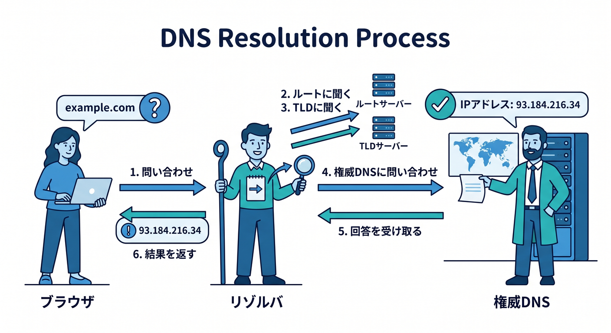
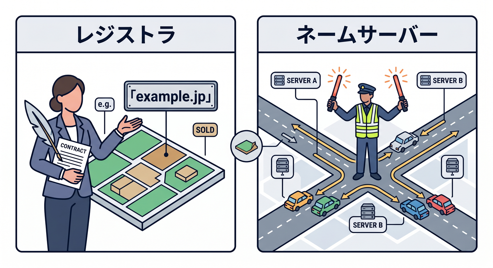
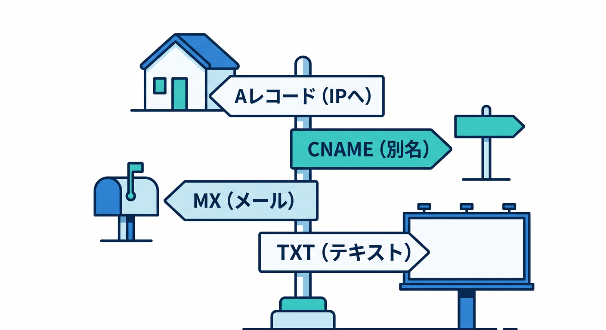
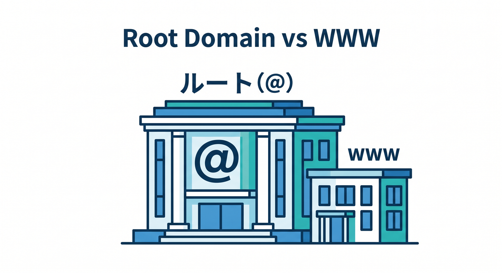
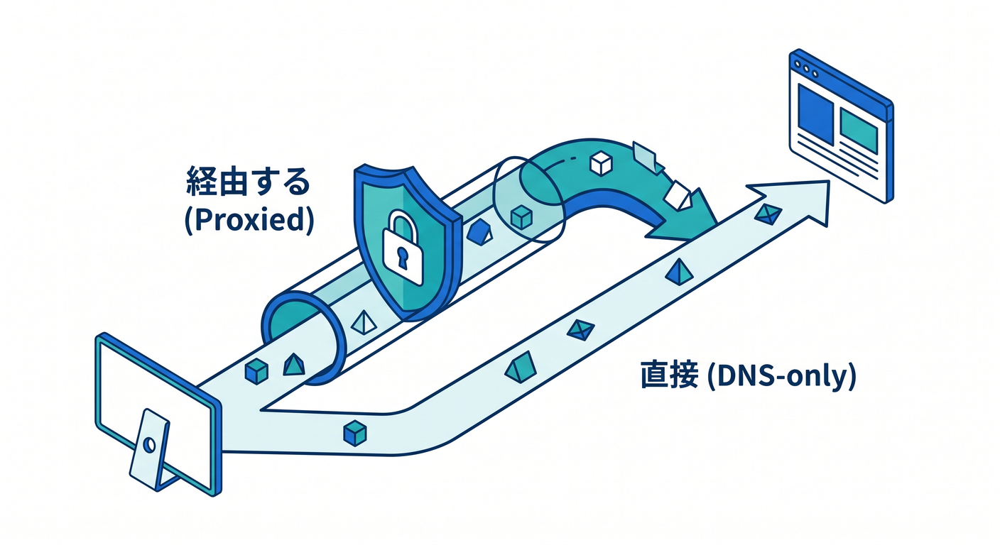

# 第03章：DNSは“ネットの住所録”ってどういう意味？📚

この章では、DNSを「なんとなく聞いたことがある難しい用語」から、「Webサイトにたどり着くための案内係なんだね 😊」に変えるのが目標です。Cloudflare公式でも、DNSはドメイン名をIPアドレスに変換する仕組みとして説明されていて、Cloudflare DNSまわりの用語として `domain`、`registrar`、`nameserver`、`authoritative DNS`、`zone`、`DNS records` などが整理されています。今日はその中でも、初心者が最初につまずきやすいところを、かなりやさしく一本の流れでつなげていきます。 ([Cloudflare Docs][1])

まず最初に大事なことをひとことで言うと、**DNSは「名前から行き先を調べる仕組み」**です ✨
人は `example.com` のような名前でサイトを覚えますが、コンピューターはIPアドレスで相手を見つけます。だからブラウザでURLを開く前に、「この名前はどこにあるの？」を調べるひと手間が必要になります。Cloudflareはこれを「インターネットの電話帳」と表現していますが、実際にはただの一覧表というより、**世界中に分散して置かれた問い合わせシステム**と思うとイメージしやすいです。 ([Cloudflare Docs][1])

---

## この章でできるようになりたいこと 🎯

この章を終えたら、次の状態を目指します。

* DNSが「Web表示の前に必ず通る入口」だと説明できる
* `A`、`AAAA`、`CNAME`、`MX`、`TXT` をざっくり見分けられる
* `レジストラ` と `DNS事業者` と `ネームサーバー` の違いを混同しにくくなる
* CloudflareでDNSを触るとき、`Proxy status` と `TTL` を怖がらずに読める
* 「AI時代でもDNSは土台なんだな」と納得できる

---

## 1. DNSは、なぜ必要なの？🤔

たとえばブラウザに `https://example.com/news` と入れたとします。
このときブラウザは、いきなりページ本文を取りに行っているわけではありません。最初にやるのは、「`example.com` はどの行き先なの？」という確認です。DNSがなければ、ブラウザは相手の場所がわからず、HTTP/HTTPSでページを取りに行くこともできません。つまり、**DNSはWeb表示の“前工程”**なんです。 ([Cloudflare Docs][1])

ここで「住所録」というたとえはたしかに便利です。でも、完全に同じではありません 📚
紙の住所録は自分でめくって終わりですが、DNSは問い合わせを受けたサーバーたちが順に情報をたどって、最後に「この名前の正式な答えはこれです」と返してくれます。Cloudflareの学習資料でも、再帰リゾルバが複数のDNSサーバーに問い合わせて答えを探し、最後は権威ネームサーバーがそのドメインの正式な情報を返す流れとして説明されています。 ([Cloudflare][2])

---

## 2. URLを開いたとき、DNSでは何が起きるの？🚶‍♂️➡️🌍

イメージは次の順番です。

### 2-1. ブラウザやOSが、設定済みのDNSリゾルバに聞く

最初の問い合わせ先は、ふつうはPCやルーターに設定されているDNSリゾルバです。Cloudflareの `1.1.1.1` は、この「公開DNSリゾルバ」の代表例です。ここで超大事なのは、**1.1.1.1 は “利用者側が最初に聞く相手” であって、ドメイン所有者が登録する権威DNSそのものではない**という点です。ここ、初心者がかなり混乱しやすいです 😌 ([Cloudflare][3])

### 2-2. リゾルバが、最終的な答えを持つ権威DNSを探す

リゾルバは必要に応じて階層をたどり、最後にそのドメインの**authoritative nameserver（権威ネームサーバー）**へ行きつきます。Cloudflareの学習資料でも、権威ネームサーバーは解決の「最後の一歩」で、そのドメインについての正式な情報を持っているサーバーとして説明されています。 ([Cloudflare][2])

### 2-3. 権威DNSが「この名前の行き先はこれ」と返す

ここで返るのがDNSレコードです。たとえば `A` レコードならIPv4アドレス、`AAAA` ならIPv6アドレス、`CNAME` なら別名のホスト名が返されます。Cloudflare docs でも、DNSレコードは権威DNSサーバー上にある「命令」で、IPの場所だけでなく、メール配送やドメイン所有確認などいろいろな役割を持つと説明されています。 ([Cloudflare Docs][4])

### 2-4. その後でようやくHTTP/HTTPSの通信が始まる

DNSで行き先がわかったあとに、ブラウザはその相手へHTTPやHTTPSで接続し、HTMLや画像やJavaScriptを受け取ります。つまり、**DNSはページ本文そのものではなく、本文を取りに行くための道案内**なんですね 🚦 ([Cloudflare Docs][1])

---

## 3. まずはこの5人を区別しよう 🧩

DNSまわりは、登場人物を混ぜると一気にわかりにくくなります。まずはこの5つを分けて覚えるのがおすすめです。

### 3-1. ドメイン `domain`

`example.com` みたいな文字列そのものです。Cloudflare DNS docs でも、ブラウザでサイトにアクセスするたびにDNSクエリが起き、ドメインが実際のIPへ対応づけられると説明されています。 ([Cloudflare Docs][4])

### 3-2. レジストラ `registrar`

ドメイン名を予約・登録する会社です。Cloudflare docs でも、まずドメインを持つにはレジストラを使う、と整理されています。つまりレジストラは「ドメインを取る人」であって、必ずしもWeb配信そのものをしている人ではありません。 ([Cloudflare Docs][4])

### 3-3. ネームサーバー `nameserver`

DNS解決に関わるサーバーですが、Cloudflare docs の文脈では特に「Cloudflareの権威ネームサーバー」を指すことが多いです。権威ネームサーバーは、そのドメインの正式な回答を出す最後の地点です。 ([Cloudflare Docs][4])

### 3-4. 権威DNS `authoritative DNS`

「最終的な正解を持つDNSサービス」です。Cloudflare docs では、ホスト名をどのIPへ対応づけるかという最終情報を返すサービスとして説明されています。ここが遅いと、サイト本体が速くても最初の到達がもたつきます。 ([Cloudflare Docs][4])

### 3-5. ゾーン `zone`

ちょっと管理者向けの言葉ですが、**そのドメインをどの単位で管理するか**というまとまりです。Cloudflare docs では、Cloudflareアカウントに追加した各ドメインは zone として扱われると説明されています。 `example.com` を管理しているなら、その一式が1つの zone だと思えば最初は十分です。 ([Cloudflare Docs][4])

---

## 4. DNSレコードは“メモ”ではなく“命令”です 📝⚙️

DNSレコードは、ただのメモ欄ではありません。
Cloudflare docs では、DNSレコードは権威DNSサーバー上にある「instructions（命令）」として説明されています。つまり「この名前に来たらこのIPへ」「このメールはこのサーバーへ」「このTXT文字列で所有確認してね」といった、**動く設定情報**なんです。 ([Cloudflare Docs][4])

初心者のうちは、まずこの5つをざっくり押さえれば十分です 😊

### `A` レコード

ドメイン名をIPv4アドレスへ向けます。たとえば `example.com -> 192.0.2.1` のようなイメージです。Cloudflare docs でも、`A`/`AAAA` はドメイン名をIPv4/IPv6アドレスへ対応づけるレコードとして説明されています。 ([Cloudflare Docs][5])

### `AAAA` レコード

こちらはIPv6版です。今は最初の学習では `A` の兄弟くらいに思えば十分です。 ([Cloudflare Docs][5])

### `CNAME` レコード

「この名前は、別の名前の別名です」と示すレコードです。たとえば `www.example.com` を別ホスト名へ向けたいときによく使います。Cloudflare docs では、CNAMEはターゲットとなるホスト名へ向けるレコードとして説明されています。 ([Cloudflare Docs][5])

### `MX` レコード

メール配送先のメールサーバーを示すレコードです。サイト表示には直接関係しなくても、独自ドメインでメールを使うなら超重要です 📬 ([Cloudflare Docs][5])

### `TXT` レコード

文字列をDNSに置くレコードです。Cloudflare docs では、特にドメイン所有確認や証明書発行前の検証などでよく使うと説明されています。メール認証系でもよく出ます。 ([Cloudflare Docs][5])

---

## 5. `@` と `www` はどう違うの？🏠

Cloudflare docs では、zone apex は「DNS管理の起点になるドメインやサブドメイン」と説明されています。そして zone apex のレコード名には `@` を使います。
つまり `@` は「このドメインそのもの」を表す書き方です。`example.com` の zone なら、`@` は `example.com` 自体、`www` は `www.example.com`、`blog` は `blog.example.com` という感じです。 ([Cloudflare Docs][4])

ここでのコツは、`@` を特別な記号と怖がらないことです。
ただの「ルート本体」を指す省略記号です。Cloudflareダッシュボードでも zone apex のレコード作成に `@` を使う考え方が整理されています。 ([Cloudflare Docs][4])

---

## 6. CloudflareでDNSを見ると、何が“普通のDNS”と少し違うの？☁️🧡

Cloudflareにドメインをオンボードすると、Cloudflareはそのサイトの **DNS provider** と **reverse proxy** の両方の役割を持つようになります。これはCloudflare Fundamentals docs にもはっきり書かれていて、Cloudflareを使うと「名前解決だけ」では終わらず、その先の通信経路にも関わるのがポイントです。 ([Cloudflare Docs][6])

そのためCloudflareのDNS画面には、一般的なDNSの発想に加えて **`Proxy status`** が出てきます。Cloudflareの用語集では、`proxied` だとリクエストがCloudflare経由になり、`DNS-only` だとCloudflareを通さないと整理されています。さらに proxied なレコードでは、Cloudflareが最適化・キャッシュ・保護を適用できます。 ([Cloudflare Docs][7])

Cloudflare docs の作成手順では、`A`、`AAAA`、`CNAME` では `Proxy status` を選べて、`TTL` は「どれくらいDNSリゾルバがこの答えをキャッシュするか」を決める項目として説明されています。TTLが短いと変更が反映されやすく、長いと問い合わせ回数を減らしやすい、という感覚でまずは十分です。 ([Cloudflare Docs][8])

さらに proxied なレコードでは、訪問者にはオリジンサーバーの本来のIPではなく、CloudflareのIPが返ります。Cloudflare docs でも、proxied DNS records のトラフィックはCloudflareを通ってからオリジンへ届くので、オリジン側ではCloudflare IPから来たように見えると説明されています。つまり、**Cloudflareを通す設定にすると、DNSは単なる案内板ではなく“入口の守衛”にもなる**わけです 🛡️ ([Cloudflare Docs][9])

---

## 7. ありがちな勘違いをここで直しておこう 🚫

### 勘違い1. 「DNS = Webページ本体」

ちがいます。DNSは本文そのものではなく、本文を取りに行く前の道案内です。DNSが壊れるとサイト全体が見えなくなることもありますが、DNSが返しているのはHTMLそのものではありません。 ([Cloudflare Docs][1])

### 勘違い2. 「1.1.1.1 を使っている = 自分のドメインをCloudflare DNS管理している」

これもちがいます。`1.1.1.1` はCloudflareの**公開DNSリゾルバ**です。一方で、自分のドメインの正式なDNS情報を持つのは**権威DNS**です。この2つは役割がまったく別です。 ([Cloudflare][3])

### 勘違い3. 「レジストラとDNS事業者は同じもの」

同じ会社が両方やっていることはありますが、役割は別です。レジストラはドメイン登録、権威DNSは名前解決の正式情報を出す係です。Cloudflare docs でも、ドメイン取得とDNS管理は概念として分けて説明されています。 ([Cloudflare Docs][4])

### 勘違い4. 「Aレコードだけわかれば全部OK」

最初の学習ではかなり役立ちますが、実運用では `CNAME`、`MX`、`TXT` もすごくよく出ます。特にメール設定や所有確認では `TXT`、独自ドメインメールでは `MX` が重要です。 ([Cloudflare Docs][5])

---

## 8. AI時代でも、DNSはむしろ大事です 🤖🌐

「AIアプリを作るならDNSは後回しでいいのでは？」と思いがちですが、むしろ逆です。
CloudflareのAI系サービスは、Workers AI がCloudflareのグローバルネットワーク上でモデル実行を担当し、AI Gateway が分析・ログ・キャッシュ・レート制御・リトライ・フォールバックなどを担当し、AI Search は自然言語で引ける検索基盤として Workers AI、AI Gateway、R2、Browser Rendering などと統合されています。こうした構成でも、実際の公開入口は結局ドメイン名やホスト名で表現されることが多く、**AI時代でもDNSは“最初の入口”のまま**です。 ([Cloudflare Docs][10])

たとえば将来、TypeScriptでCloudflare Workers上にAPIを置いて、その前段に独自ドメインをつけ、裏でWorkers AIやAI Gatewayを使う構成に進んだとしても、「どの名前がどこへ向くのか」を整理できないと全体像がぼやけます。だからDNSは昔ながらの基礎ではなく、**今のAIアプリ時代にもそのまま効く基礎**なんです 🚀 ([Cloudflare Docs][10])

---

## 9. Cloudflareダッシュボードで見るときの読み方 👀

CloudflareのDNS Recordsページでは、レコードごとに `Type`、`Name`、`Content`、`TTL`、そして場合によっては `Proxy status` を見ます。Cloudflare docs の管理手順でも、レコード追加は DNS Records ページから行い、レコードタイプを選び、必要な項目を入れて保存する流れになっています。 ([Cloudflare Docs][8])

見方のコツは、いきなり全部理解しようとしないことです 😊
まずは次の3つだけ見ればかなり前進です。

* `Type`：これは何の役割のレコード？
* `Name`：どの名前に対する設定？
* `Content`：どこへ向ける？ 何を示す？

この3つが読めるようになると、DNS画面が「呪文の一覧」から「住所設定の一覧」に変わってきます。Cloudflare docs でも、Type / Name / Content / TTL が基本の見方として整理されています。 ([Cloudflare Docs][11])

さらにCloudflare DNSには Analytics もあり、DNS queries に関するデータをダッシュボードやGraphQL APIで見られます。無料プランを含む各プランでDNS Analyticsの提供があり、ダッシュボードでは Query name、Query type、Response code、Data center などを見られます。学習初期はここまで必須ではないですが、「DNSも観測できるんだ」と知っておくとかなり現代的です 📈 ([Cloudflare Docs][12])

---

## 10. VS Code と GitHub Copilot を使った学び方 🤝💡

この章はブラウザだけでも学べますが、VS Code と GitHub Copilot を使うと理解がかなり速くなります。GitHub公式では、Copilotには継続的な文脈を与える `copilot-instructions.md`、特定タスク向けの prompt files、さらにパス単位の `.instructions.md` などがあり、VS Code / Visual Studio / Copilot cloud agent で使える範囲も整理されています。 ([GitHub Docs][13])

この章でのおすすめの使い方は、**Copilotに答えを丸投げすることではなく、自分の理解を言葉にしてチェックしてもらうこと**です ✍️
たとえばこんな聞き方が学習向きです。

* `AレコードとCNAMEの違いを、中学生向けにたとえて`
* `このDNS設定を見て、サイト表示用・メール用・所有確認用に分類して`
* `1.1.1.1とauthoritative DNSの違いを図解っぽく説明して`
* `CloudflareのProxy statusを、初心者向けに3パターンで説明して`

また、GitHub公式では repository-wide instructions と path-specific instructions を使って、Copilotに「初心者向けに説明する」「TypeScriptの例を優先する」「Windows前提で答える」などの継続方針を与えられます。教材制作や学習メモづくりにはかなり相性がいいです。 ([GitHub Docs][13])

---

## 11. この章のミニ演習 ✍️✨

### 演習1：URLの中で、DNSが関わる部分を見つけよう

`https://blog.example.com/news?id=5` を見て、DNSが直接関わるのはどこかを考えてみましょう。
答えは **`blog.example.com`** です。`https` は通信方式、`/news` はパス、`?id=5` はクエリです。DNSは主にホスト名の解決を担当します。これは第2章とのつながり確認にもなります 🌟

### 演習2：次の用途に合うレコードを考えよう

* Webサイト本体をIPへ向けたい → `A` または `AAAA`
* `www` を別ホスト名へ向けたい → `CNAME`
* 独自ドメインのメール配送先を指定したい → `MX`
* ドメイン所有確認の文字列を置きたい → `TXT`

この4つが自然に出てくるようになれば、かなり良い感じです。Cloudflare docs 上でも、各レコードの役割はこの方向で整理されています。 ([Cloudflare Docs][5])

### 演習3：CloudflareのDNS画面を読む練習

次のような設定があったとします。

* `A` / `@` / `192.0.2.10`
* `CNAME` / `www` / `example.com`
* `MX` / `@` / `mail.example.com`
* `TXT` / `@` / `verification=abc123`

これを日本語で説明してみましょう。
「サイト本体は `example.com` でIPへ向いていて、`www` は本体名の別名。メールは `mail.example.com` が受け持ち、TXTでは所有確認用の文字列が置かれている」というふうに言えればOKです 🙌

### 演習4：Copilotに“自分の理解チェック役”をやってもらう

VS Codeで学習メモを開いて、次のように聞いてみるのがおすすめです。

* `この説明のどこが初心者にわかりにくい？`
* `DNS resolver と authoritative DNS を混同しない説明に書き直して`
* `CloudflareのDNS画面を見たときの初心者向けチェックリストを5個作って`

---

## 12. ミニ成果物 🎁

この章の終わりに、次のどれか1つを作れるとかなり定着します。

* **成果物A**：`DNSとは何か` を200〜300字で説明した自分用メモ
* **成果物B**：`A / CNAME / MX / TXT` の使い分けメモ
* **成果物C**：`1.1.1.1 と authoritative DNS の違い` を図っぽくまとめたノート
* **成果物D**：Cloudflare DNS画面を見たときの「ここから読む」チェックリスト

おすすめは **成果物C** です。ここが整理されると、DNSの理解がかなりスッと通ります ✨

---

## 13. つまずきポイントと回避法 🪤➡️🌈

### つまずきポイント1

`www` と `@` の違いがあいまい
→ `@` はドメイン本体、`www` はその下のホスト名、と声に出して読むのが効きます。 ([Cloudflare Docs][4])

### つまずきポイント2

`1.1.1.1` と Cloudflare DNS 管理を同じものだと思う
→ `1.1.1.1 は利用者側のリゾルバ`、`Cloudflare DNS はドメイン所有者側の権威DNS` と切り分けるのがコツです。 ([Cloudflare][3])

### つまずきポイント3

Cloudflareの `Proxied` を「DNSのON/OFF」だと思う
→ そうではなく、「Cloudflare経由で受けるか、DNSだけ返して直接行かせるか」の違いです。 proxied ではCloudflareが最適化や保護に関わります。 ([Cloudflare Docs][7])

---

## 14. 確認クイズ 🧠✨

### Q1. DNSは何をする仕組み？

A. HTMLを暗号化する
B. ドメイン名を行き先へ対応づける
C. 画像サイズを圧縮する

**答え：B**
DNSはドメイン名をIPアドレスなどへ対応づけ、ブラウザが相手を見つけられるようにします。 ([Cloudflare Docs][1])

### Q2. `MX` レコードは何に使う？

A. メール配送先
B. 画像配信
C. JavaScript圧縮

**答え：A**
MXはメールサーバー配送先の指定です。 ([Cloudflare Docs][5])

### Q3. `TXT` レコードは何に使われやすい？

A. 動画変換
B. ドメイン所有確認や証明書検証
C. CSS読み込み

**答え：B**
TXTは文字列を置くレコードで、所有確認やSSL/TLS関連の検証でも使われます。 ([Cloudflare Docs][5])

### Q4. Cloudflareで `proxied` にするとどうなる？

A. Cloudflareを通らず直接オリジンへ行く
B. Cloudflareを経由して最適化・保護できる
C. DNSが無効になる

**答え：B**
proxied ではCloudflare経由になり、最適化・キャッシュ・保護の対象になります。 ([Cloudflare Docs][7])

---

## 15. この章のまとめ 🌟

DNSは「ネットの住所録」とよく言われますが、実際には**名前から行き先を調べるための分散した問い合わせシステム**です。ブラウザでURLを開くとき、まずDNSでホスト名を解決し、その後にHTTP/HTTPSで本文を取りに行きます。Cloudflareの文脈では、`registrar`、`nameserver`、`authoritative DNS`、`zone`、`DNS record` を区別して考えることがとても大切です。 ([Cloudflare Docs][1])

そしてCloudflareでは、DNSは単なる名前解決で終わりません。オンボード後はCloudflareがDNS providerでありつつ reverse proxy にもなり、`Proxy status` や `TTL`、さらにはDNS Analyticsまで含めて見られるようになります。しかもその先には Workers、Workers AI、AI Gateway、AI Search などがつながっています。だからDNSは「昔の基礎」ではなく、**今のCloudflare開発やAI活用の土台**なんです ☁️🤖🚀 ([Cloudflare Docs][6])

次の章では、このDNSの土台の上に、**Cloudflare DNSは普通のDNSと何が違うの？☁️📍** を進めると、とてもきれいにつながります。

[1]: https://developers.cloudflare.com/fundamentals/concepts/how-cloudflare-works/ "How Cloudflare DNS works · Cloudflare Fundamentals docs"
[2]: https://www.cloudflare.com/learning/dns/dns-server-types/ "DNS server types | Cloudflare"
[3]: https://www.cloudflare.com/th-th/learning/dns/what-is-1.1.1.1/ "What is 1.1.1.1? | Cloudflare"
[4]: https://developers.cloudflare.com/dns/concepts/ "DNS concepts · Cloudflare DNS docs"
[5]: https://developers.cloudflare.com/dns/manage-dns-records/reference/dns-record-types/ "DNS record types · Cloudflare DNS docs"
[6]: https://developers.cloudflare.com/fundamentals/manage-domains/add-site/ "Onboard a domain · Cloudflare Fundamentals docs"
[7]: https://developers.cloudflare.com/fundamentals/reference/glossary/ "Glossary · Cloudflare Fundamentals docs"
[8]: https://developers.cloudflare.com/dns/manage-dns-records/how-to/create-dns-records/ "Manage DNS records · Cloudflare DNS docs"
[9]: https://developers.cloudflare.com/fundamentals/concepts/cloudflare-ip-addresses/ "Cloudflare IP addresses · Cloudflare Fundamentals docs"
[10]: https://developers.cloudflare.com/workers-ai/ "Overview · Cloudflare Workers AI docs"
[11]: https://developers.cloudflare.com/dns/manage-dns-records/ "DNS records · Cloudflare DNS docs"
[12]: https://developers.cloudflare.com/dns/additional-options/analytics/ "Analytics and logs · Cloudflare DNS docs"
[13]: https://docs.github.com/en/copilot/how-tos/configure-custom-instructions "Configure custom instructions for GitHub Copilot - GitHub Docs"
