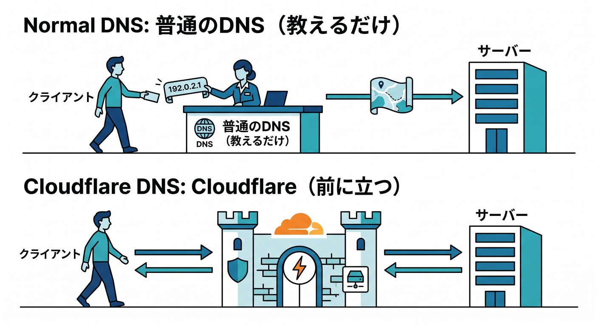
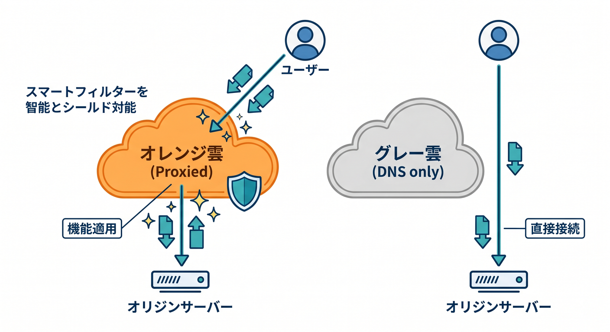
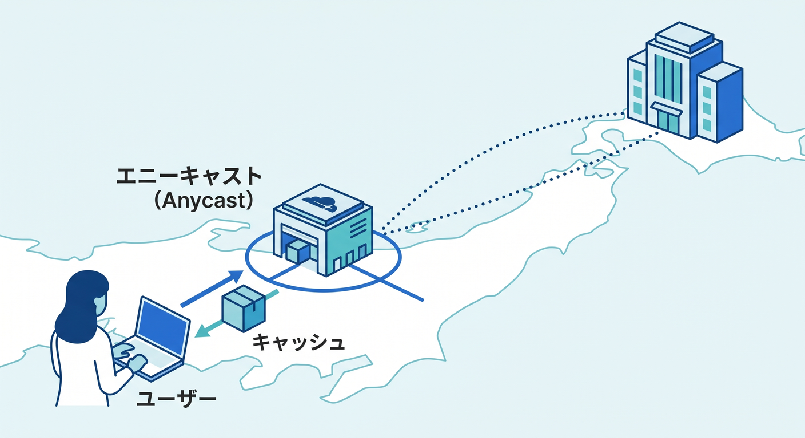
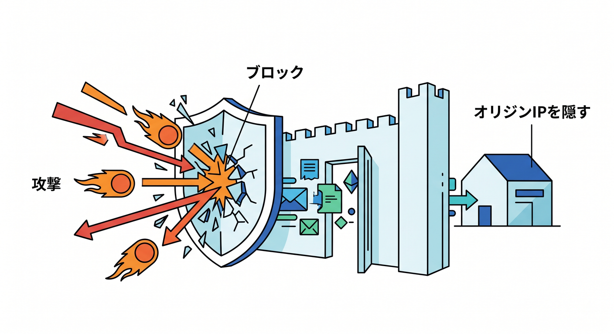
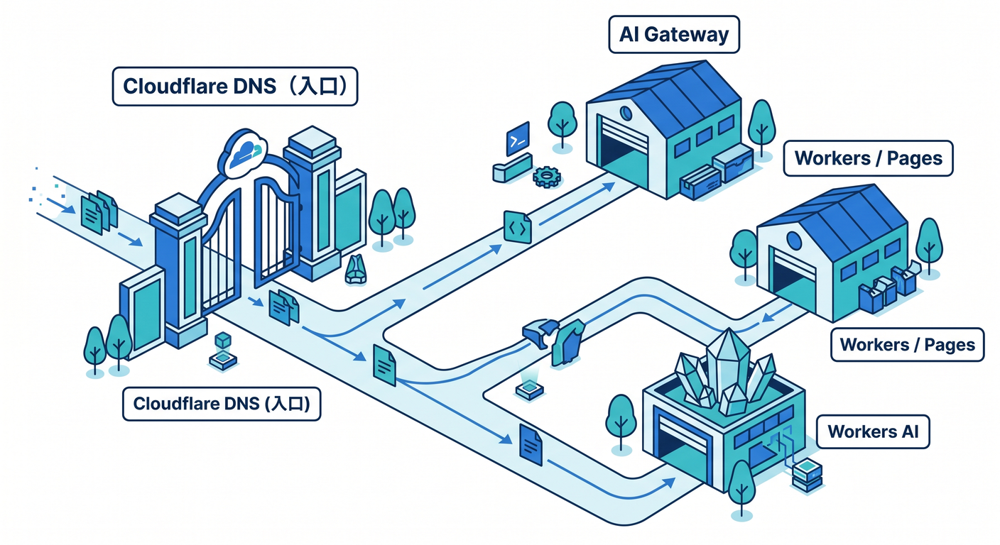

# 第04章：Cloudflare DNSは普通のDNSと何が違うの？☁️📍

この章では、Cloudflare DNS をただの「DNS管理サービス」としてではなく、**必要に応じて通信の前面にも立てるDNS**として理解していきます 😊
いちばん大事なのは、**普通のDNSは“行き先を教える係”が中心**なのに対して、**Cloudflare DNSは“行き先を教える”だけでなく、“その通信をCloudflare経由にする”選択肢を持っている**ことです。Cloudflare公式でも、A / AAAA / CNAME レコードが `proxied` のときは HTTP/HTTPS トラフィックが Cloudflare を通る、と明記されています。 ([Cloudflare Docs][1])

---

## まずは結論から 🎯✨

普通のDNSは、ざっくり言うと「`example.com` はこのIPアドレスですよ」と答える仕組みです。
一方で Cloudflare DNS は、それに加えて **Cloudflare 自身が reverse proxy として前に立てる**のが大きな違いです。つまり、名前解決だけで終わらず、**速くする・守る・設定を効かせる**ところまでつながりやすいのです。 ([Cloudflare Docs][2])

この違いがわかると、
「なんでCloudflareで速くなるの？」🚀
「なんでCloudflareで守れるの？」🛡️
「なんで設定が一か所に集まるの？」🧭
が、ぜんぶ一本につながって見えてきます。 ([Cloudflare Docs][1])

---

## 1. 普通のDNSの役目を、先にすっきり整理しよう 📚

DNS の基本役目は、**名前をIPアドレスに対応づけること**です。
CloudflareのDNS conceptsでも、authoritative DNS は「ホスト名を最終的にどこへ向けるかを答えるサービス」と説明されています。つまり普通のDNSの中心任務は、**最終回答を返すこと**です。 ([Cloudflare Docs][2])

たとえばブラウザが `app.example.com` に行きたいとき、DNSが
「はい、その名前はここです 👉 203.0.113.10」
のように答えるイメージです 😊

この段階では、DNSはあくまで**案内係**です。
通信の中身を高速化したり、WAFを当てたり、キャッシュしたりするのは、普通のDNSの本業ではありません。そこに Cloudflare の面白さがあります。 ([Cloudflare Docs][2])

---

## 2. Cloudflare DNSは“案内係 + 入口管理人”になれる ☁️🚪

Cloudflareにドメインをフルセットアップすると、Cloudflareの nameservers がそのドメインの authoritative nameserver になります。Cloudflare公式の full setup でも、nameservers を切り替えた後は Cloudflare が primary DNS provider になると説明されています。 ([Cloudflare Docs][3])

でも Cloudflare はそこで終わりません。
A / AAAA / CNAME レコードを `Proxied` にすると、DNS応答では**Cloudflare の anycast IP**が返り、その後の HTTP/HTTPS 通信は Cloudflare を通るようになります。これは「ただ住所を返す」より一歩進んで、**Cloudflareが通信の入口に立つ**ということです。 ([Cloudflare Docs][4])

つまり、Cloudflare DNS のすごさは次の二層構造です 🌈

* **DNS provider として答える**
* **reverse proxy として前に立つ**

この二つを同じサービスの中で扱えるから、Cloudflareは「DNSの会社」に見えて、実はそれ以上のことをしてくれるのです。 ([Cloudflare Docs][1])

---

## 3. いちばん重要な分かれ道：オレンジ雲 ☁️🟧 と グレー雲 ☁️⚪

Cloudflare初心者が最初に覚えるべき超重要ポイントがここです 😎

## オレンジ雲 = Proxied

A / AAAA / CNAME レコードを Proxied にすると、Cloudflare はその名前に対して anycast IP を返し、HTTP/HTTPS リクエストを Cloudflare ネットワークで受け取ります。Cloudflare公式は、この状態で DDoS 保護、最適化、キャッシュ、各種Cloudflare製品の設定適用が可能になると説明しています。 ([Cloudflare Docs][4])

## グレー雲 = DNS only

DNS only だと、DNS応答には**本来の origin IP**が返ります。この場合、Cloudflareはその後のHTTP/HTTPS通信の通り道には立たないので、アプリ側の保護やHTTP/HTTPS分析などは効きません。Cloudflare docs でも、DNS only では origin IP が見え、HTTP/HTTPS analytics は使えず、DNS analytics のみになると説明されています。 ([Cloudflare Docs][4])

覚え方はこれです 🧠✨

* **グレー雲** = 「住所を教えるだけ」
* **オレンジ雲** = 「住所を教える + 入口にCloudflareが立つ」

これだけで、この章の半分は勝ちです 🙌

---

## 4. じゃあ、なんで速くなるの？🚀⚡

Cloudflare が Proxied で前に立つと、Cloudflare の anycast ネットワークにまず到達します。Cloudflare公式では、同じIPアドレスを世界中のデータセンターから広報する anycast により、利用者のリクエストが近いデータセンターにルーティングされると説明しています。 ([Cloudflare Docs][5])

さらに reverse proxy として前に立つと、Cloudflare はキャッシュもできます。Cloudflare Fundamentals でも、reverse proxy の利点として caching が挙げられていて、利用者に近い場所から返せるので高速化しやすくなります。 ([Cloudflare Docs][1])

つまり Cloudflare DNS が速さに効くのは、
**DNSの返答が速いからだけ**ではありません。
**その先のWeb通信までCloudflare経由にできるから**です。ここが普通のDNSとの大きな差です。 ([Cloudflare Docs][1])

---

## 5. じゃあ、なんで守れるの？🛡️🔥

Cloudflare が reverse proxy として前に立つと、origin のIPアドレスを直接さらさずに済みます。Cloudflare docs でも、reverse proxy の利点として「origin IP を隠せるため、標的型攻撃やDDoSを受けにくくなる」と説明されています。 ([Cloudflare Docs][1])

また、Cloudflare IP addresses の説明では、proxied DNS records へのトラフィックは Cloudflare を経由して origin に届くため、origin から見ると Cloudflare IP ranges から通信が来る形になります。つまり、守りの前線を Cloudflare 側に置けるわけです。 ([Cloudflare Docs][5])

ここをやさしく言い換えるとこうです 😊

* 普通のDNSだけだと、訪問者はわりと直接 origin に近づく
* Cloudflare DNS を Proxied で使うと、まず Cloudflare が受ける
* だから Cloudflare の保護機能を前段で効かせやすい

この「間に入れる」が、Cloudflare の強みの本体です。 ([Cloudflare Docs][1])

---

## 6. Cloudflare DNSが“ただのDNS管理”で終わらない理由 🧭✨

Cloudflare公式の Proxy status 説明では、オレンジ雲にすると DDoS 保護、最適化、キャッシュ、そして各種Cloudflare製品の設定が適用できるとされています。
つまり DNS レコードの設定が、そのまま **Cloudflare機能を効かせるスイッチ**にもなっているのです。 ([Cloudflare Docs][4])

ここで初心者目線の理解としては、

**普通のDNS**
→ 「名前を引く」ことが主役

**Cloudflare DNS**
→ 「名前を引く」
→ 「Cloudflareを通すか決める」
→ 「速くする・守る・観測する」につなげる

という三段構えで見ると、とてもわかりやすいです 🌟

---

## 7. Cloudflare DNSにも“できること”と“できないこと”がある 🙋‍♂️📌

ここは誤解しやすいので大事です。

Cloudflare で proxy できるのは、基本的に **A / AAAA / CNAME** です。Cloudflare docs でも、proxy 対象は IP address resolution に使うこれらのレコードだと明記されています。 ([Cloudflare Docs][4])

なので、
メール用のレコードやドメイン認証用の一部レコードまで「全部Cloudflare経由で守られる」と思うのは誤解です 😅
Cloudflare自身も、第三者サービスのドメイン確認に使うCNAMEなどは proxied にしないよう案内しています。 ([Cloudflare Docs][4])

つまり、Cloudflare DNS は万能魔法ではなく、
**“Webトラフィックに関わる名前”で真価を出す**
と考えると整理しやすいです。 ([Cloudflare Docs][4])

---

## 8. CNAME flattening も、Cloudflareらしい差分ポイント 🌊

Cloudflare DNS には CNAME flattening があります。Cloudflare docs では、これは zone apex（`example.com` のようなルート）で CNAME を使えるようにし、さらに CNAME 解決を速くする仕組みだと説明されています。 ([Cloudflare Docs][6])

これは初心者にも地味にうれしい機能です 😊
なぜなら「ルートドメインをどこに向けるか」で悩むとき、Cloudflare側がかなり扱いやすくしてくれるからです。Pages の root custom domain にも関係します。 ([Cloudflare Docs][6])

要するに、Cloudflare DNS は
**“ただ記録するだけのDNS”ではなく、運用しやすくする工夫も入っているDNS**
ということです。 ([Cloudflare Docs][6])

---

## 9. 「Cloudflare DNS = 速いDNS」だけで覚えると、ちょっと足りない 🧠

Cloudflare DNS には DNS analytics もあり、ダッシュボードや API から DNS クエリの分析ができます。公式では、クエリ名、クエリタイプ、レスポンスコード、データセンターなどの観点で見られると案内されています。 ([Cloudflare Docs][7])

でも、もっと大事なのは、
**Cloudflare DNS が Web 配信・保護・観測の入口になっている**
という構造です。

だから覚え方としては、
「Cloudflare DNS は速いDNS」
よりも、
**「Cloudflare全体の入口スイッチ」**
と捉えるほうが、後の章までずっと役に立ちます 🚪☁️✨ ([Cloudflare Docs][4])

---

## 10. AIサービスとどうつながるの？🤖☁️

ここ、今どきすごく大事です 👀

たとえば Cloudflare 上で AI アプリを作るとき、
カスタムドメインの入口は Cloudflare DNS が持ち、
アプリ本体は Workers や Pages で動き、
推論は Workers AI、
監視やキャッシュやレート制御は AI Gateway、
検索やRAG系の土台は Vectorize や AI Search、
という形でつながっていきます。Cloudflare公式でも、AI Gateway は analytics / logging / caching / rate limiting / retry / fallback を提供し、Workers AI や各種外部プロバイダと組み合わせられると説明されています。Workers AI / AI Search の関連製品説明でも、Workers・Vectorize・R2・D1 などとの接続が明示されています。 ([Cloudflare Docs][8])

この章のポイントに引きつけると、
**AIアプリでも最初の入口は“どの名前で受けるか”です。**
その入口を Cloudflare DNS + Proxied で持つと、AIアプリにも Cloudflare の前段制御を効かせやすくなります。
つまり DNS の章なのに、もう AI の章へつながっているんです 😆✨ ([Cloudflare Docs][4])

---

## 11. 開発目線で見ると、DNSの理解がそのまま運用の理解になる 🛠️💡

2026年の Cloudflare 開発は、Workers / Vite plugin / Wrangler の導線がかなり強くなっています。Cloudflare公式では、Cloudflare Vite plugin は Workers runtime と Vite を統合し、Workers APIs や bindings に直接アクセスでき、React Router v7 なども公式サポートしています。さらに Wrangler は既存プロジェクトを自動検出し、`wrangler.jsonc` の生成や必要な adapter の導入まで案内できます。 ([Cloudflare Docs][9])

だから実務感覚では、
「React や TypeScript でアプリを作る」
→ 「Cloudflare に載せる」
→ 「カスタムドメインを Cloudflare DNS で受ける」
→ 「オレンジ雲で入口を Cloudflare 化する」
という流れが、とても自然です。 ([Cloudflare Docs][10])

---

## 12. VS Code と Copilot を使うときの、2026年っぽい見方 🧑‍💻🤖

Cloudflare公式 docs では、VS Code での Workers デバッグ方法や、Vite plugin / Wrangler ベースの開発導線が案内されています。つまり、今のCloudflare開発の中心は **VS Code + Wrangler + Vite plugin + runtimeに近いローカル実行** です。 ([Cloudflare Docs][11])

VS Code Marketplace には Cloudflare名義の「Cloudflare Workers Extension」もありますが、説明上は “Manage your Cloudflare Worker's bindings” という位置づけです。なので、学習の主軸としては「拡張ひとつで全部やる」というより、**Wrangler と公式開発フローを土台にしつつ、必要に応じて拡張も使う**という理解が安全です。 ([Visual Studio Marketplace][12])

GitHub Copilot 側は、公式に `.github/copilot-instructions.md` を使ったリポジトリカスタム命令が案内されていて、VS Code を含む各環境で使える形になっています。GitHub docs では、プロジェクトのツール・書き方・検証方法などをこのファイルに書くことで、Copilot の応答品質を上げられると説明しています。 ([GitHub Docs][13])

この章に引きつけると、Copilot にこんな方針を覚えさせると相性がいいです ✨

* Cloudflare では `proxied` と `dns only` を混同しない
* カスタムドメイン設定時は zone apex / subdomain を意識する
* Workers / Pages / AI Gateway / Workers AI を前提に説明する
* TypeScript中心で、Cloudflareの流儀に寄せた提案をする

こういう土台があると、DNSまわりの設定相談でも Copilot の返答がかなり安定しやすくなります。GitHub docs の趣旨とも合っています。 ([GitHub Docs][14])

---

## 13. ここまでを、図なしで頭の中に絵にするとこうなる 🖼️

## 普通のDNS

ブラウザ
→ DNSに聞く
→ origin の IP をもらう
→ そのまま origin に行く

## Cloudflare DNS（Proxied）

ブラウザ
→ DNSに聞く
→ Cloudflare の anycast IP をもらう
→ まず Cloudflare に行く
→ Cloudflare がキャッシュ・保護・最適化・各種設定を適用
→ origin に必要分だけ取りに行く

この差が、Cloudflare DNS を “普通のDNSより一段広い存在” にしています。 ([Cloudflare Docs][4])

---

## 14. よくある誤解をここでつぶそう 🧹

## 誤解1：「Cloudflare DNSにしたら全部の通信がCloudflareを通る」

ちがいます 🙅‍♂️
Cloudflare docs では、proxy 対象は A / AAAA / CNAME などの proxied records で、HTTP/HTTPS トラフィックに対して Cloudflare が前に立つ形です。 ([Cloudflare Docs][4])

## 誤解2：「Cloudflare DNS = ただの速い住所録」

半分だけ正解です 🙆‍♂️
authoritative DNS として答えるだけでなく、reverse proxy として前段に立てるのが本質です。 ([Cloudflare Docs][2])

## 誤解3：「オレンジ雲にすれば何でも良い」

これも危ないです ⚠️
Cloudflare自身が、第三者サービスの検証用CNAMEなどは proxied にしない例を出しています。レコードの役割を見て切り分ける必要があります。 ([Cloudflare Docs][4])

---

## 15. ミニ演習 ✍️🌟

## 演習1

次の2つを言葉で説明してみましょう。

* `app.example.com` が **DNS only** のとき、利用者はどこへ向かうのか
* `app.example.com` が **Proxied** のとき、最初にどこへ向かうのか

## 演習2

次の文が正しいか考えてみましょう。

* 「Cloudflare DNS は名前解決だけをしている」
* 「Cloudflare DNS では、Web用レコードならCloudflareを通信の入口にできることがある」
* 「メール用レコードも基本的にオレンジ雲にすれば守りやすい」

## 演習3

自分の頭の中で、こんな1サービス構成を想像してみてください 🤖

* `chat.example.com` → Cloudflare DNS で受ける
* Frontend/API → Workers または Pages / Workers
* 推論 → Workers AI
* 入口の制御 → AI Gateway

このとき、**Cloudflare DNS がどこで効いているか** をひとことで言えたら、この章はかなり理解できています。 ([Cloudflare Docs][8])

---

## 16. この章のまとめ 📝☁️✨

今日の最重要ポイントは3つです 😊

1. **普通のDNSは、主に“名前から行き先を答える”仕組み**
2. **Cloudflare DNSは、必要に応じてCloudflare自身を通信の入口にできる**
3. **その結果、速さ・保護・観測・AI時代の前段制御までつながる**

Cloudflare DNS を理解するコツは、
**「DNS」単体として見るのではなく、Cloudflare全体への入口として見ること**です。
ここが見えると、第5章以降の「サーバー」「HTTPS」「Edge」「CDN」「Workers」「AI」がかなり自然につながってきます。 ([Cloudflare Docs][4])

必要なら次に、この第4章をそのまま教材ページに貼りやすいように、
**「学習目標・理解チェック問題・ミニ課題・講師向け補足」つき版**へ整えます。

[1]: https://developers.cloudflare.com/fundamentals/concepts/how-cloudflare-works/ "How Cloudflare DNS works · Cloudflare Fundamentals docs"
[2]: https://developers.cloudflare.com/dns/concepts/ "DNS concepts · Cloudflare DNS docs"
[3]: https://developers.cloudflare.com/dns/zone-setups/full-setup/setup/ "Change your nameservers (Full setup) · Cloudflare DNS docs"
[4]: https://developers.cloudflare.com/dns/proxy-status/ "Proxy status · Cloudflare DNS docs"
[5]: https://developers.cloudflare.com/fundamentals/concepts/cloudflare-ip-addresses/ "Cloudflare IP addresses · Cloudflare Fundamentals docs"
[6]: https://developers.cloudflare.com/dns/cname-flattening/ "CNAME flattening · Cloudflare DNS docs"
[7]: https://developers.cloudflare.com/dns/additional-options/analytics/ "Analytics and logs · Cloudflare DNS docs"
[8]: https://developers.cloudflare.com/ai-gateway/ "Overview · Cloudflare AI Gateway docs"
[9]: https://developers.cloudflare.com/workers/vite-plugin/ "Vite plugin · Cloudflare Workers docs"
[10]: https://developers.cloudflare.com/workers/framework-guides/automatic-configuration/ "Deploy an existing project · Cloudflare Workers docs"
[11]: https://developers.cloudflare.com/workers/testing/miniflare/developing/debugger/?utm_source=chatgpt.com "Attaching a Debugger - Workers"
[12]: https://marketplace.visualstudio.com/items?itemName=cloudflare.cloudflare-workers-bindings-extension "
        Cloudflare Workers - Visual Studio Marketplace
    "
[13]: https://docs.github.com/ja/copilot/how-tos/configure-custom-instructions/add-repository-instructions "GitHub Copilot用のリポジトリカスタム命令の追加 - GitHubドキュメント"
[14]: https://docs.github.com/ja/copilot/concepts/prompting/response-customization "GitHub Copilotの応答をカスタマイズする方法 - GitHubドキュメント"
