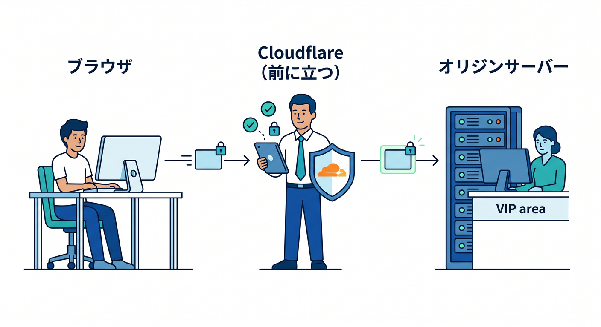
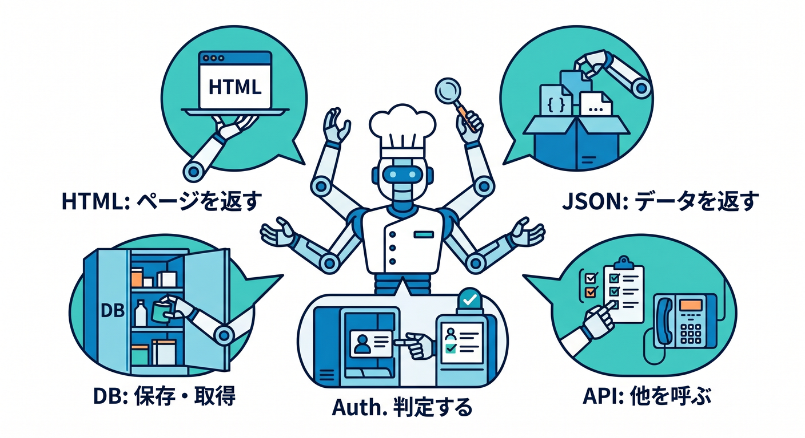
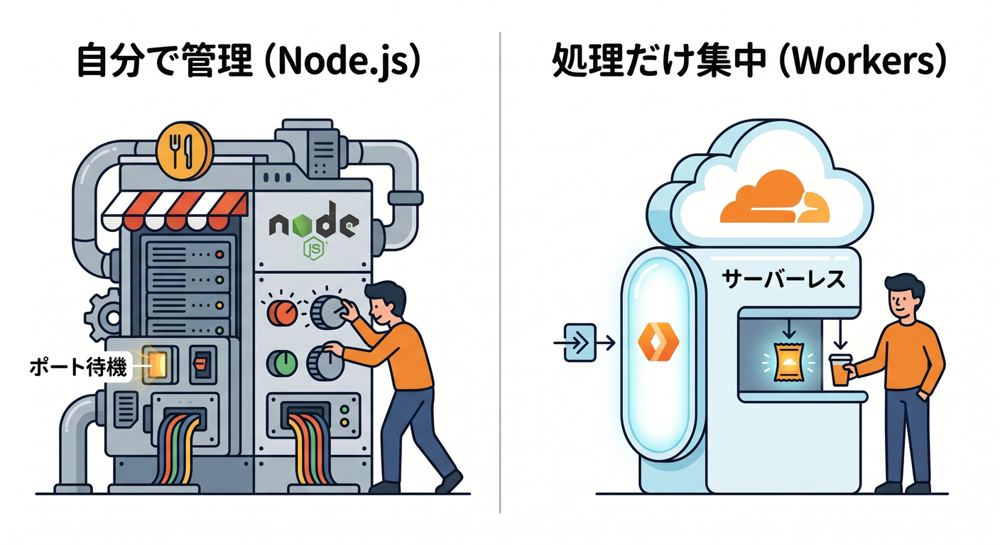
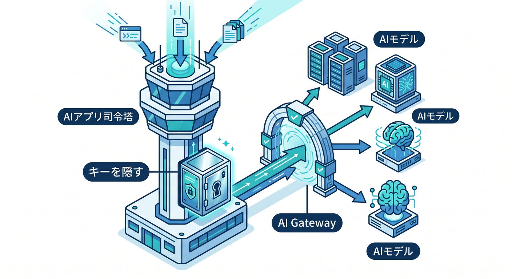

# 第05章：サーバーって何者なの？🖥️

この章では、**サーバー = 何かすごく難しい専用機械**というイメージをいったん外して、**「お願いを受けて、返事を返す側」**としてつかんでいきます 😊
Cloudflareの文脈では、サイトやアプリ本体を置いている **origin server** は「Cloudflareの持ち物ではない、物理または仮想のマシン」で、HTTP/HTTPS の通信は Cloudflare が reverse proxy として前に立ち、その先で origin に渡される形になります。さらに今は Workers が「インフラ管理をほぼ意識せずに動かす」方向、Workers AI が「サーバーレス GPU でAIを動かす」方向を用意していて、サーバー観そのものが少し変わってきています。 ([Cloudflare Docs][1])

---

## この章のゴール 🎯

この章を読み終わるころには、こんな状態を目指します 🌱

* サーバーを「返事をする側」と言葉で説明できる
* ブラウザ・Cloudflare・origin server の役割分担がわかる
* Nodeでサーバーを動かす感覚と、Workersで動かす感覚の違いが見える
* AIアプリの時代に、なぜ「サーバーを全部自分で抱えなくてもよい」のかがわかる

---

## 1. サーバーは「お願いに答える側」だよ 📮➡️📦


まずは超シンプルに考えましょう ✨

ブラウザでページを開くとき、あなたのPC側は「これを見せてください」とお願いしています。
そのお願いを受けて、HTML・画像・JSON・動画・検索結果などを返す側が、サーバーです。

つまり役割で分けるとこんな感じです 👇

* **ブラウザ** … お願いする側
* **サーバー** … 返事する側

ここで大事なのは、**サーバーという言葉は“役割名”でもある**ということです。
特別な見た目の箱だけがサーバーなのではなく、**リクエストを受けてレスポンスを返す仕組み全体**をサーバーと見てよい場面が多いです 😊

---

## 2. サーバーは「1台の黒い箱」とは限らない 💻☁️

初心者のうちは、サーバーという言葉から「データセンターにある大きな専用マシン」を想像しがちです。
もちろんそういう形もあります。けれど今は、もっと広く考えたほうがわかりやすいです。

Cloudflare の公式では origin server を、**Cloudflare の外側にある物理マシンまたは仮想マシンで、アプリの中身をホストするもの**として説明しています。つまり「本体を持っている側」のことですね。 ([Cloudflare Docs][1])

なので、実務では次のどれも「サーバーっぽい役割」を持ちえます 🌈

* 物理マシン
* 仮想マシン
* クラウド上のインスタンス
* コンテナで動くWebアプリ
* サーバーレス実行基盤の処理

ここで気持ちを少し楽にしておくと、後で Workers を学ぶときにかなり助かります。
**“サーバーは必ず自分で1台管理しなければいけない” とは限らない**からです ✨

---

## 3. Cloudflareの世界でいう「origin server」って何？🏠



Cloudflareをはさむと、登場人物が増えます。ここが最初の山です ⛰️
でも、整理するとむしろ簡単です。

### まずは3人だけ覚えましょう 😊

1. **ブラウザ**
   ユーザーのお願いを出す側です。

2. **Cloudflare**
   前に立って受け止める側です。
   Cloudflare は DNS provider と reverse proxy の役割を持ち、proxied なレコードの HTTP/HTTPS 通信は Cloudflare を通ります。 ([Cloudflare Docs][2])

3. **origin server**
   もともとのサイト本体やAPI本体がいる場所です。
   HTML・画像・アプリ処理・DB接続などの“元締め”です。 ([Cloudflare Docs][1])

この3つを区別できるだけで、Cloudflareの理解が急に進みます 🚀

---

## 4. 通信の流れを、やさしく一本で見よう 🛣️

Cloudflareの proxied な通信では、ざっくりこう流れます。

**ブラウザ → Cloudflare → origin server → Cloudflare → ブラウザ**

Cloudflare公式では、Cloudflare の DNS が通信を origin へ直接向けるのではなく、まず Cloudflare のグローバルネットワークへ導くこと、そして reverse proxy が web server の前に立って転送または代行処理することを説明しています。 ([Cloudflare Docs][3])

これがうれしい理由はシンプルです 🌟

* origin を直接むき出しにしにくい
* 負荷を和らげやすい
* 速さ・安全性・安定性を上げやすい

Cloudflare の origin 保護の説明でも、origin にリクエストが集中すると遅延・コスト増・ダウンの原因になると案内されています。 ([Cloudflare Docs][1])

つまり、**Cloudflareは“サーバーを消す”のではなく、“サーバーの前に立って、しんどい部分を肩代わりする”存在**なんですね 🛡️⚡

---

## 5. サーバーがしている仕事を、ふつうの言葉で分けてみよう 🧩



サーバーの仕事を難しく考えすぎなくて大丈夫です。
だいたい次のようなことをしています。

### ページを返す 📰

HTML を返して、ブラウザにページを表示させます。

### データを返す 📦

JSON を返して、フロントエンドから使えるAPIになります。

### 判定する 🔐

ログインしているか、権限があるか、入力が正しいかを見ます。

### 何かを保存・取得する 🗂️

データベース、ファイル、画像、設定値などとやり取りします。

### 他のサービスを呼ぶ 🔗

決済、メール送信、地図API、AIモデルなどを呼びます。

つまりサーバーは、**「画面の裏方」**です。
ユーザーの目には見えないけれど、アプリの中心的な判断や接続をたくさん引き受けています。

---

## 6. Node.jsで見る「サーバーがいる世界」🌐

TypeScript / Node 系に寄せて、まずはサーバーの雰囲気を見てみます。
これは「ポートを開いて、リクエストを受けて、返す」というごく基本の形です。

```ts
import http from "node:http";

const server = http.createServer((_req, res) => {
  res.writeHead(200, {
    "content-type": "text/plain; charset=utf-8",
  });
  res.end("こんにちは、サーバーです 👋");
});

server.listen(3000, () => {
  console.log("http://localhost:3000 で待機中");
});
```

このコードのポイントは3つです 😊

* 自分で待ち受ける
* 自分で返事を書く
* どのポートで動かすかを自分で決める

これが、いわゆる **「サーバーを自分で立てる感覚」** です。

---

## 7. Workersで見る「サーバーを強く意識しなくてよい世界」☁️⚙️



次に Cloudflare Workers の雰囲気です。

```ts
export default {
  async fetch(_request: Request): Promise<Response> {
    return new Response("こんにちは、Workerです 👋", {
      headers: {
        "content-type": "text/plain; charset=utf-8",
      },
    });
  },
};
```

見た目からして、かなり違いますよね 😳

Node 側では「待ち受ける」「ポートを開く」という感覚がありました。
でも Workers では、**「リクエストが来たときに何を返すか」** に意識を集中しやすいです。

Cloudflare Workers は、Cloudflare のグローバルネットワーク上でアプリを build / deploy / scale できる **serverless platform** とされていて、**インフラ管理や複雑な設定を強く意識しなくてよい**のが大きな特徴です。React、Next などのフレームワークも案内されています。 ([Cloudflare Docs][4])

ここが超大事です 💡
**サーバーの知識は必要。でも“サーバー管理の重さ”は必須ではない。**
これがクラウド時代の感覚です。

---

## 8. じゃあ「サーバー」はもう不要なの？🙃

ここは誤解しやすいので、はっきりさせます。

**不要ではありません。**
ただし、**自分で1台ずつ面倒を見る必要が薄れてきた**、が正解に近いです。

Cloudflare でも、proxied な構成なら origin server はまだ存在しうるし、そこで動いているアプリが本体のこともあります。
一方で Workers を使うと、「返事をする処理」の一部または全部を Cloudflare 側へ寄せられます。さらに Workers AI では AI 実行もサーバーレス GPU で扱えます。 ([Cloudflare Docs][1])

なので整理するとこうです 🌿

* **従来型**
  origin server が主役
* **Cloudflare併用型**
  origin はあるけれど Cloudflare が前で支える
* **サーバーレス寄り**
  Worker がかなりの役目を受け持つ
* **AI込みの最新型**
  Worker + Workers AI + AI Gateway で、AI処理まで platform 側に寄せる

---

## 9. AI時代のサーバー観を、Cloudflareでやさしく見る 🤖🌐



AIアプリになると、サーバーの仕事はさらにわかりやすくなります。

たとえばチャットアプリを考えると、裏側ではこんなことをやりたくなります ✨

* APIキーを隠す
* どのモデルを呼ぶか決める
* ログを取りたい
* レート制限したい
* 遅いモデルが落ちたら別モデルへ切り替えたい
* 検索やRAGも混ぜたい

Cloudflare では、Workers AI が **Cloudflare のグローバルネットワーク上のサーバーレス GPU でモデルを動かす仕組み**として提供され、AI Gateway は **analytics / logging / caching / rate limiting / retries / model fallback** などで AI アプリの可視化と制御を助けます。AI Search は、自然言語検索向けの managed search で、Workers AI・AI Gateway・Vectorize・Workers などと連携する形で案内されています。 ([Cloudflare Docs][5])

つまりAI時代の「サーバー」は、ただHTMLを返すだけではありません。
**AIを安全に、速く、安定して使うための司令塔**にもなっています 🧠✨

---

## 10. ReactやNextを使う人ほど、この章が大事です ⚛️

React や Next を触っていると、つい「画面づくり」が中心に見えます。
でも実際には、次のような部分でサーバーの考え方が必ず入ってきます。

* API からデータを取る
* 認証を入れる
* シークレットを守る
* 画像やファイルを扱う
* AI呼び出しを中継する
* 検索やRAGを支える

Cloudflare Workers の公式でも、React や Next を含むフレームワークで full-stack apps を作れることが示されています。だからこそ、先にこの章で **「返事をする側とは何か」** をつかんでおくのが効いてきます。 ([Cloudflare Docs][4])

---

## 11. VS Code と Copilot を使う今どきの学び方メモ 🛠️🤖

この章は基礎章ですが、2026年の学習導線も軽く押さえておくとかなり楽です。

Cloudflare の Vite plugin は、Vite と Workers runtime をしっかりつなぎ、**ローカルの Worker コードを production に近い形で動かしやすい**設計です。Wrangler は既存プロジェクトの framework を自動検出して Cloudflare 向け設定を生成でき、公式では **Wrangler 4.68.0 以上**が必要とされています。さらに Cloudflare は新規プロジェクトで **`wrangler.jsonc` 推奨**を明記しています。 ([Cloudflare Docs][6])

デバッグ面でも、Cloudflare 公式は VS Code の JavaScript Debug Terminal から `wrangler dev` や `vite dev` を動かすと、VS Code が実行中の Worker に接続してブレークポイント debugging できる流れを案内しています。 ([Cloudflare Docs][7])

Copilot 側では、GitHub Docs が **`.github/copilot-instructions.md`** によるリポジトリ全体の指示、**`.github/instructions/**/*.instructions.md`** によるパス別の指示、さらに VS Code 系では **`AGENTS.md`** 系の agent instructions の利用を案内しています。VS Code 自体も agent を local / CLI / cloud など複数の実行形態で扱えるよう整理しています。つまり、Cloudflare 学習はもう「CLIを丸暗記する」だけではなく、**プロジェクトの作法をCopilotやagentに教えながら進める**のがかなり自然です。 ([GitHub Docs][8])

### たとえば、Copilot にこんな方針を覚えさせると便利です ✍️

```md
## .github/copilot-instructions.md

- このリポジトリでは TypeScript を優先する
- Cloudflare Workers 前提で考える
- Node 専用APIを提案するときは代替案も示す
- シークレットはコードに直書きしない
- 可能なら fetch ハンドラ中心で説明する
- 開発コマンドは npm scripts を優先する
```

こういう一枚があるだけで、AI補助のブレがかなり減ります 😊

---

## 12. この章でありがちな誤解を先につぶそう 🧯

### 誤解1：サーバー = すごく高価な専用機

ちがいます。
役割の名前として考えたほうが理解しやすいです。

### 誤解2：フロントエンドだけ学べば十分

あとで必ず詰まりやすいです。
API、認証、AI、シークレット、配信の話でサーバー感覚が必要になります。

### 誤解3：Workersを使うならサーバー知識は不要

これもちがいます。
**管理は軽くなる**けれど、**リクエストとレスポンスの発想**はむしろ大事です。

### 誤解4：AIアプリは外部APIを呼ぶだけ

実際は、ログ、制御、認証、フォールバック、検索統合などの裏方がとても重要です。Cloudflare はその周辺を Workers AI / AI Gateway / AI Search などで組みやすくしています。 ([Cloudflare Docs][5])

---

## 13. ミニ演習 📝✨

### 演習1

次の一文を自分の言葉で完成させてください。

**サーバーとは、____________________________________ である。**

### 演習2

次の役割を分類してみてください。

* ブラウザ
* Cloudflare
* origin server
* Worker

ヒント：
「お願いする側」「前に立つ側」「本体側」「処理を受け持つ側」で考えると整理しやすいです 😊

### 演習3

Node の簡単なHTTPサーバー例を見て、次の2点を書いてください。

* 自分で管理している部分はどこか
* Workers に移ると軽くなる部分はどこか

### 演習4

AIチャットアプリを1つ想像して、サーバー側で必要そうな仕事を3つ書いてみましょう 🤖

例:

* APIキーを隠す
* ログを取る
* レート制限する

---

## 14. ミニ成果物の案 🎁

この章の小さな成果物としては、次のどれか1つがちょうどいいです。

* **「ブラウザ → Cloudflare → origin」の手描き図**
* **Node版とWorker版の“こんにちは”比較メモ**
* **AIチャットの裏側でサーバーがやる仕事メモ**
* **「サーバーとは何か」を100字で説明する文章**

学習初期は、動くものを大量に作るよりも、
**言葉で説明できる状態**を1つずつ増やすほうが強いです 💪✨

---

## 15. この章のまとめ 🌸

この章でいちばん大事なのは、これです。

**サーバーは“返事をする側”である。**

そこから少し広げると、

* origin server はサイト本体を持つ側 🏠
* Cloudflare はその前に立って支える側 🛡️
* Workers はサーバー処理をもっと軽やかにする側 ⚙️
* Workers AI / AI Gateway はAI時代の裏方を助ける側 🤖

という地図が見えてきます。Cloudflare 公式でも、proxied 通信では Cloudflare が origin の前に立ち、Workers はインフラ管理を強く意識せずに動かせる serverless platform、Workers AI は serverless GPUs、AI Gateway は可視化・制御の層として整理されています。 ([Cloudflare Docs][2])

この章が入ると、次の HTTP / HTTPS や Edge、CDN、Workers の理解がかなりスムーズになります 🚀
続けて第6章もこの粒度で作成できます。

[1]: https://developers.cloudflare.com/fundamentals/security/protect-your-origin-server/ "Protect your origin server · Cloudflare Fundamentals docs"
[2]: https://developers.cloudflare.com/fundamentals/concepts/how-cloudflare-works/ "How Cloudflare DNS works · Cloudflare Fundamentals docs"
[3]: https://developers.cloudflare.com/fundamentals/concepts/traffic-flow-cloudflare/ "Traffic flow through Cloudflare · Cloudflare Fundamentals docs"
[4]: https://developers.cloudflare.com/workers/ "Overview · Cloudflare Workers docs"
[5]: https://developers.cloudflare.com/workers-ai/ "Overview · Cloudflare Workers AI docs"
[6]: https://developers.cloudflare.com/workers/vite-plugin/ "Vite plugin · Cloudflare Workers docs"
[7]: https://developers.cloudflare.com/workers/observability/dev-tools/breakpoints/ "Breakpoints · Cloudflare Workers docs"
[8]: https://docs.github.com/copilot/customizing-copilot/adding-custom-instructions-for-github-copilot "Adding repository custom instructions for GitHub Copilot - GitHub Docs"
