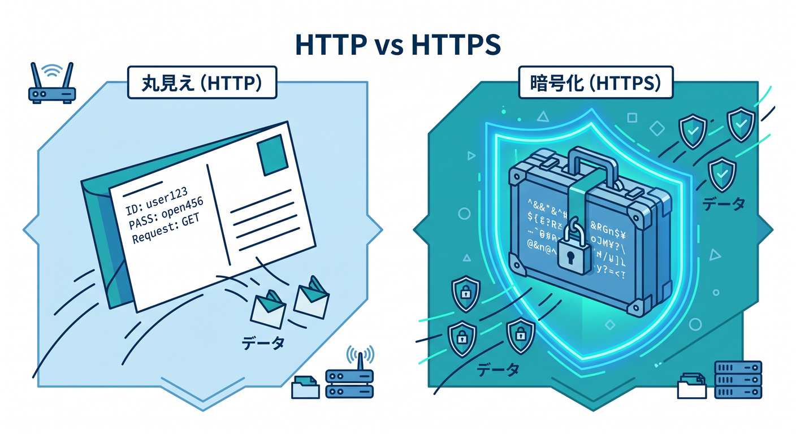
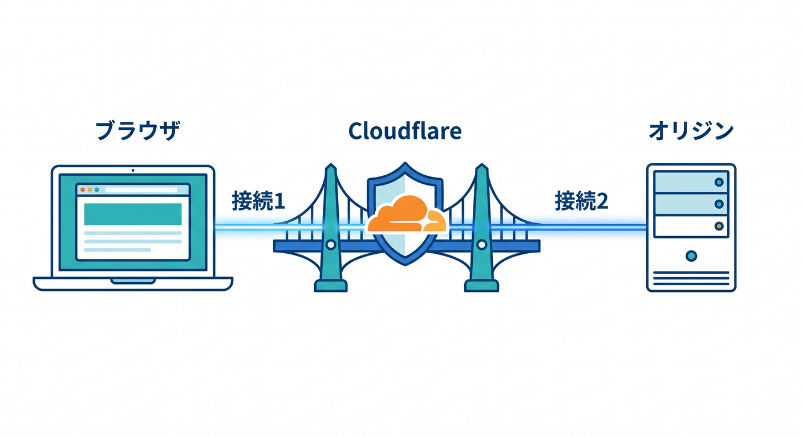
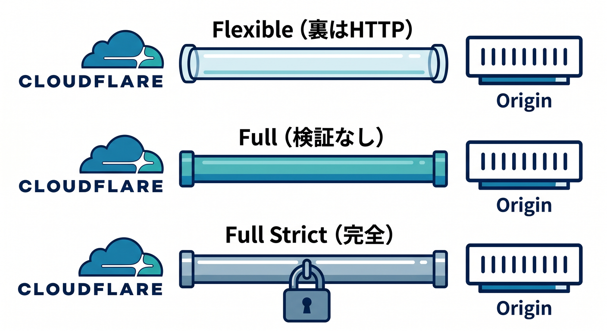
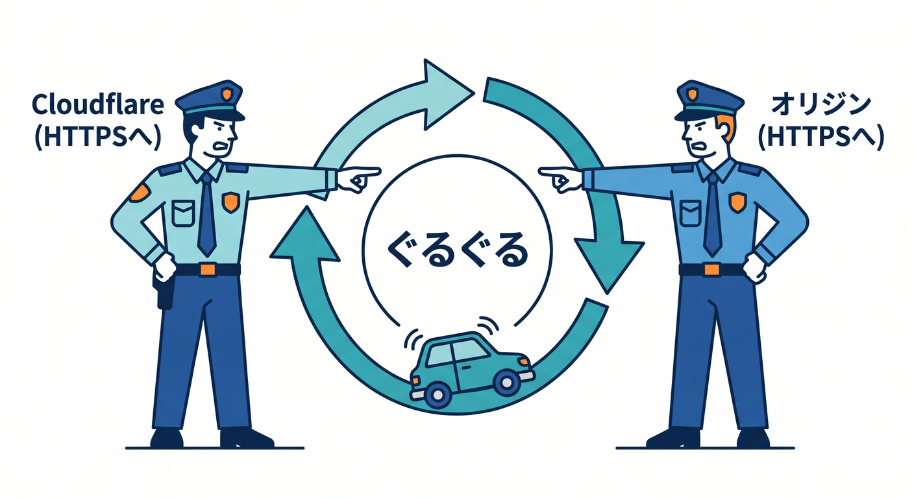
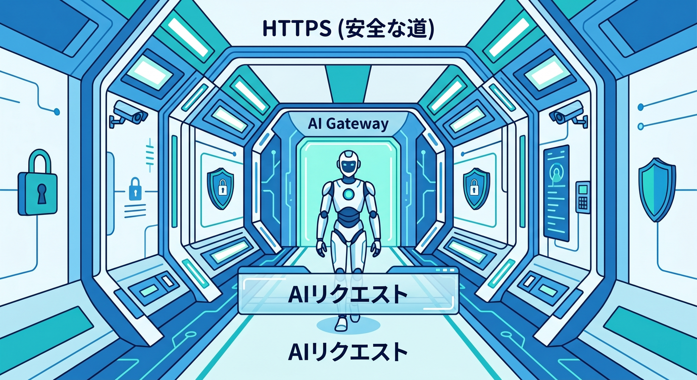

# 第06章：HTTPとHTTPSは何が違うの？🔒

この章では、HTTP を「Webでやり取りするための会話ルール」、HTTPS を「その会話を暗号化して守る仕組み」として、やさしく整理していきます 😊
ここがわかると、Cloudflare の SSL/TLS 設定画面がただの難しい設定集ではなく、「どの区間をどう守るかを決める場所」だと見えるようになります。HTTP は Web のデータ交換の土台で、クライアント・サーバー型のプロトコルです。ブラウザがリクエストを送り、サーバーがレスポンスを返す、という形で会話します。 ([MDN Web Docs][2])

## この章のゴール 🎯

この章を終えるころには、次の4つが言えるようになるのが目標です。

* HTTP は「会話のルール」である
* HTTPS は「HTTP + TLS」である
* Cloudflare では接続が1本ではなく2本ある
* 「鍵マークが出ている = すべて安全」とは限らない

## 1. HTTPは「Webの会話ルール」だよ 💬

まず HTTP です。
HTTP は、HTML や画像や JavaScript などのリソースを取りにいくためのルールです。ページ1枚を開いているように見えても、実際には複数のファイルをそれぞれ HTTP で取りにいって、ブラウザが組み立てています。つまり HTTP は「ページを表示するための言葉づかい」みたいなものです。 ([MDN Web Docs][2])

たとえばブラウザは「このページください」とお願いし、サーバーは「はい、これです」と返します。
この “お願い” がリクエスト、“返事” がレスポンスです。すごく地味に見えますが、Webの基本はほぼこれです 😌 ([MDN Web Docs][3])

## 2. HTTPSは「HTTPをTLSで包んだもの」🔐

HTTPS は、HTTP を TLS で保護したものです。
MDN でも、TLS は「信頼できないネットワーク上でもクライアントとサーバーが安全に通信するためのプロトコル」であり、HTTP を TLS で守ったものが HTTPS だと説明されています。一般的に HTTP は 80 番ポート、HTTPS は 443 番ポートが使われます。 ([MDN Web Docs][4])

ここで大事なのは、HTTPS はただ“見た目がちょっと豪華なHTTP”ではないことです。
TLS によって、通信内容の盗み見、途中での改ざん、相手のなりすましを防ぎやすくなります。ログイン、決済、API 通信、AI アプリのリクエストなど、今の Web では HTTPS がほぼ前提です。 ([MDN Web Docs][4])

## 3. HTTPのままだと、何が困るの？😨

HTTP のままだと、同じネットワークの途中にいる第三者に通信内容を見られたり、書き換えられたりしやすくなります。
特に ID・パスワード・Cookie・フォーム入力・API の送受信などは危険です。だから今は「HTTPS にする」が基本中の基本です。 ([MDN Web Docs][4])

## 4. Cloudflareに入ると、接続は“2本”になる ☁️↔🌐↔🖥️

ここが Cloudflare を理解する超重要ポイントです ✨
Cloudflare の SSL/TLS Encryption Mode は、1本の通信ではなく、次の2本の接続をどう扱うかを決めます。

> ブラウザ ↔ Cloudflare
> Cloudflare ↔ オリジンサーバー

Cloudflare 公式も、Encryption Mode は「訪問者と Cloudflare の接続」と「Cloudflare と origin server の接続」の2つを管理すると明記しています。そして可能なら `Full` または `Full (strict)` を使うよう強く勧めています。 ([Cloudflare Docs][5])

この考え方が入ると、初心者がよく混乱する
「HTTPS なのに安全じゃないことがあるの？」
に答えられるようになります。

## 5. SSL/TLSモードをやさしく整理しよう 🧭

### Flexible 😅

Flexible は、ブラウザ ↔ Cloudflare は HTTPS ですが、Cloudflare ↔ オリジンは HTTP です。Cloudflare 公式も「partially secure（部分的に安全）」と書いています。つまり、利用者から見える表側は暗号化されても、裏側は平文のままです。 ([Cloudflare Docs][6])

### Full 🙂

Full は、Cloudflare とオリジンの間でも HTTPS を使えますが、証明書の正当性までは検証しません。しかも Cloudflare 公式では、訪問者が `http` で来た場合、Cloudflare はオリジンにも平文 HTTP でつなぎにいく、と説明しています。つまり「Flexible よりは良いけれど、まだ油断できない」モードです。 ([Cloudflare Docs][7])

### Full (strict) ✅

Full (strict) は、Cloudflare ↔ オリジンも暗号化し、その証明書が有効で、名前が一致していて、信頼できる CA か Cloudflare Origin CA であることまで確認します。Cloudflare 公式も「best security のために可能なら Full (strict) を選ぶ」と案内しています。初心者向けの結論としては、**最終的に目指すのは基本これ**で大丈夫です。 ([Cloudflare Docs][8])

## 6. 鍵マークが出ていても、安心しきれないことがある 🔍

ここ、かなり大事です。
Cloudflare を挟んでいるサイトでブラウザに鍵マークが出ていても、設定が Flexible なら Cloudflare ↔ オリジンは HTTP のままです。つまり、**利用者から Cloudflare までは安全でも、その先は安全でない**ことがあります。これが「HTTPS なのに、全部が同じじゃない」という意味です。 ([Cloudflare Docs][6])

## 7. 証明書って何をしているの？📜

証明書は、ざっくり言うと「この相手は本物ですよ」と示す身分証みたいなものです。
Cloudflare の SSL/TLS は全プランで利用でき、Universal SSL によって無料の SSL/TLS 保護も提供されています。一方で、Cloudflare Origin CA は **Cloudflare ↔ オリジン間専用** で、`Full (strict)` と組み合わせて使えます。ただしこれはブラウザが直接信頼するための証明書ではないので、Cloudflare を止めたり DNS only にするとブラウザ側で信頼されないことがあります。 ([Cloudflare Docs][1])

## 8. Always Use HTTPS と HSTS はどう違うの？🚦

この2つは似て見えますが、役割が違います。

Always Use HTTPS は、来た HTTP リクエストを HTTPS にリダイレクトする設定です。Cloudflare 公式では、アプリ内のすべてのホスト・サブドメインに対して HTTP → HTTPS へ転送すると説明されています。さらに、オリジンサーバー側で同じことを二重にやるとリダイレクトループの原因になりやすいので、Cloudflare は origin 側でのリダイレクトを推奨していません。 ([Cloudflare Docs][9])

HSTS は、ブラウザに「このサイトには今後 HTTP で来ないでね。必ず HTTPS を使ってね」と覚えさせる仕組みです。Cloudflare 公式と MDN の両方で、HSTS は HTTP を HTTPS に強制し、さらに証明書エラーをユーザーが無視して進むことも防ぐと説明されています。かなり強い設定です。 ([Cloudflare Docs][10])

ただし HSTS は強いぶん、雑に有効化すると危ないです。
Cloudflare 公式は、HSTS を使う前に HTTPS が安定していることを確認し、途中で Cloudflare を外したり、HTTPS を無効にしたり、証明書を壊したりしないよう注意しています。設定後に HTTPS を外すと、Max-Age の期間中、訪問者がサイトに入れなくなることがあります。 ([Cloudflare Docs][10])

## 9. よくあるつまずき3連発 🧱

### つまずき1：リダイレクトループ

Cloudflare 側でもオリジン側でも HTTPS へ飛ばす設定をしていると、ぐるぐる回って `ERR_TOO_MANY_REDIRECTS` になりやすいです。Cloudflare 公式も、Always Use HTTPS を origin 側で重ねるとループの原因になりうると案内しています。 ([Cloudflare Docs][9])

### つまずき2：Mixed Content

ページ本体は HTTPS なのに、画像・CSS・JavaScript の一部が HTTP のままだと Mixed Content になります。MDN では、HTTPS で読み込んだページがサブリソースを HTTP で読み込む状態を Mixed Content と説明していて、安全性を弱めたり、ブラウザにブロックされたりします。 ([MDN Web Docs][11])

### つまずき3：Full と Full (strict) を同じだと思う

この2つは似ていますが違います。Full は暗号化するだけで、オリジン証明書の妥当性は検証しません。Full (strict) は、証明書の期限・発行元・ホスト名一致まで確認します。ここを混同すると、「一応 HTTPS にしたのに、まだ甘かった」が起きます。 ([Cloudflare Docs][7])

## 10. 2026年のCloudflare視点で見た“今っぽい補足” 🆕

Cloudflare の SSL/TLS では、`Automatic SSL/TLS (default)` が段階的に展開されていて、より安全なモードに自動で寄せる仕組みが入っています。Cloudflare 公式によると、この機能はより安全なモードが使えると判断した場合に段階的に切り替えますが、逆に安全性の低いモードへ自動で落とすことはしません。 ([Cloudflare Docs][5])

さらに Cloudflare は、TLS 1.3 系の接続でポスト量子暗号のハイブリッド鍵共有を拡大中です。これは「今盗まれた暗号通信を、未来の計算能力で解読される」リスクへの備えとして進められているもので、HTTPS の世界もじわじわ次世代に進んでいます。 ([Cloudflare Docs][12])

## 11. Cloudflare AI と HTTPS はどうつながるの？🤖🔐

AI アプリでも HTTPS の感覚はそのまま大事です。
Cloudflare Workers AI は、Cloudflare のグローバルネットワーク上でサーバーレスに AI モデルを実行できる仕組みです。そして AI Gateway は、AI アプリへのリクエストに対して分析、ログ、キャッシュ、レート制御、リトライ、モデルフォールバック、セキュリティを加えられます。つまり、AI だから別世界ではなく、**HTTPS で守られた API 通信の延長で AI を扱う**感じです。 ([Cloudflare Docs][13])

この章の視点で言うなら、AI チャットや推論 API も「HTTP/HTTPS で会話するアプリ」のひとつです。だから第6章で HTTP と HTTPS をきちんと理解しておくと、後で Workers AI や AI Gateway を触るときにも、通信・保護・認証・制御の話がかなり自然につながります。 ([Cloudflare Docs][14])

## 12. VS Code・Copilot と学習をどうつなげる？🛠️✨

2026年時点の GitHub Copilot は、VS Code の最近のバージョンで Chat、Agent mode、MCP、workspace indexing などに対応しています。Cloudflare 側も、自社の MCP サーバーを用意していて、設定の読み取り、データの確認、提案、場合によっては変更までできる設計になっています。Copilot も MCP に対応しているので、Cloudflare 学習との相性はかなり良いです。 ([GitHub Docs][15])

また、Cloudflare Vite plugin は Vite と Workers runtime をしっかりつなぎ、ローカルでも `workerd` 上で動かすことで本番に近い挙動を確認しやすくしています。なので、VS Code で Copilot に「HTTP→HTTPS リダイレクトの Worker を作って」「Mixed Content を洗い出す観点を出して」と相談しながら学ぶ流れは、かなり実践的です。 ([Cloudflare Docs][16])

## 13. この章でまず覚える“実務の結論” 🧠

細かい言葉をいったん脇に置くと、覚えることはこれです。

* HTTP は会話ルール、HTTPS はその会話を TLS で守ったもの
* Cloudflare を入れると通信は「利用者側」と「オリジン側」の2区間になる
* `Flexible` は見た目より安全ではない
* 基本の目標は `Full (strict)`
* `Always Use HTTPS` と `HSTS` は似ているけれど役割が違う
* AI アプリでも HTTPS の理解はそのまま効く

## ミニ演習 ✍️

1. 「ブラウザ ↔ Cloudflare ↔ オリジン」の図を、自分の言葉で説明してみましょう。
2. `Flexible` と `Full (strict)` の違いを、1分で誰かに説明するつもりで書いてみましょう。
3. 「鍵マークが出ていても安心しきれない場合がある」の理由を、Cloudflare の2本接続の考え方で説明してみましょう。
4. AI アプリの API 通信でも HTTPS が大事な理由を、一言でまとめてみましょう。

## まとめ 🌈

HTTP は、Webの会話そのもの。
HTTPS は、その会話を守るための仕組みです。
そして Cloudflare を使うと、その会話は「ブラウザとの会話」と「元サーバーとの会話」の2段構えになります。

ここが腹落ちすると、Cloudflare の SSL/TLS 画面がかなり読めるようになります 😊
次の章以降で証明書、暗号化モード、Workers、AI サービスに進んでも、「何を守っているのか」がぶれにくくなります。

必要なら次に、この第6章と同じ調子で
**「第7章 Edgeって何？ なぜCloudflareでよく出てくるの？🌐⚡」**
もそのまま教材本文として続けて作れます。

[1]: https://developers.cloudflare.com/ssl/ "Overview · Cloudflare SSL/TLS docs"
[2]: https://developer.mozilla.org/en-US/docs/Web/HTTP/Guides/Overview "Overview of HTTP - HTTP | MDN"
[3]: https://developer.mozilla.org/en-US/docs/Web/HTTP/Guides/Overview?utm_source=chatgpt.com "Overview of HTTP - MDN Web Docs"
[4]: https://developer.mozilla.org/en-US/docs/Web/Security/Defenses/Transport_Layer_Security "Transport Layer Security (TLS) - Security | MDN"
[5]: https://developers.cloudflare.com/ssl/origin-configuration/ssl-modes/ "Encryption modes · Cloudflare SSL/TLS docs"
[6]: https://developers.cloudflare.com/ssl/origin-configuration/ssl-modes/flexible/ "Flexible - SSL/TLS encryption modes · Cloudflare SSL/TLS docs"
[7]: https://developers.cloudflare.com/ssl/origin-configuration/ssl-modes/full/ "Full - SSL/TLS encryption modes · Cloudflare SSL/TLS docs"
[8]: https://developers.cloudflare.com/ssl/origin-configuration/ssl-modes/full-strict/ "Full (strict) - SSL/TLS encryption modes · Cloudflare SSL/TLS docs"
[9]: https://developers.cloudflare.com/ssl/edge-certificates/additional-options/always-use-https/ "Always Use HTTPS · Cloudflare SSL/TLS docs"
[10]: https://developers.cloudflare.com/ssl/edge-certificates/additional-options/http-strict-transport-security/ "HTTP Strict Transport Security (HSTS) · Cloudflare SSL/TLS docs"
[11]: https://developer.mozilla.org/en-US/docs/Web/Security/Defenses/Mixed_content?utm_source=chatgpt.com "Mixed content - Security - MDN Web Docs - Mozilla"
[12]: https://developers.cloudflare.com/ssl/post-quantum-cryptography/ "Post-quantum cryptography (PQC) · Cloudflare SSL/TLS docs"
[13]: https://developers.cloudflare.com/workers-ai/ "Overview · Cloudflare Workers AI docs"
[14]: https://developers.cloudflare.com/ai-gateway/ "Overview · Cloudflare AI Gateway docs"
[15]: https://docs.github.com/en/copilot/reference/copilot-feature-matrix "Copilot feature matrix - GitHub Docs"
[16]: https://developers.cloudflare.com/workers/vite-plugin/ "Vite plugin · Cloudflare Workers docs"
