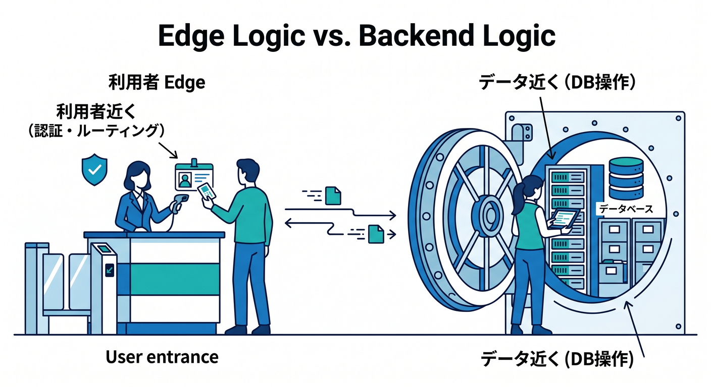
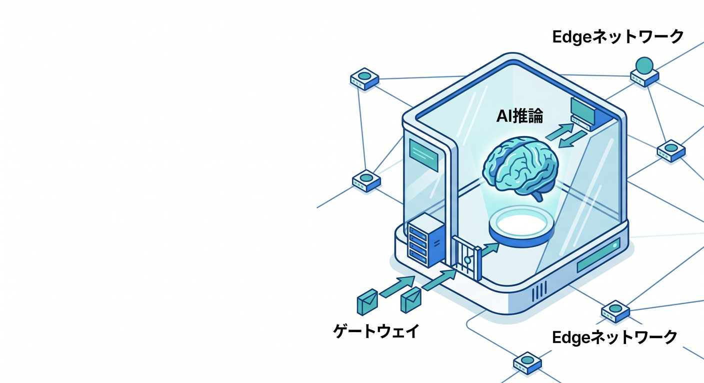

# 第07章：Edgeって何？ なぜCloudflareでよく出てくるの？🌐⚡

この章では、Cloudflareを学ぶうえで超重要な **Edge（エッジ）** を、できるだけやさしくつかみます 😊
2026年4月14日時点で、Cloudflare公式ドキュメント、VS Code公式、GitHub Copilot公式の一次情報を確認したうえで構成しています。Cloudflareは「どこか遠いクラウドで動かす」だけではなく、**グローバルネットワーク上の近い場所で届ける・処理する**ことをかなり強く打ち出しています。 ([Cloudflare Docs][1])

---

## この章のゴール 🎯

この章を読み終えるころには、こんなことが言えるようになるのが目標です ✨

* Edge は「利用者の近く側で受ける・返す・処理する」という考え方だと説明できる
* なぜ Cloudflare が CDN、Workers、AI、セキュリティで強いのかを、1本の流れで話せる
* 「中央のサーバーだけで全部やる世界」と「近い場所でもさばく世界」の違いをイメージできる
* React / Next.js / TypeScript の学習が、なぜ Cloudflare の Edge とつながるのか見えてくる

---

## 1. Edgeって、ひとことで言うと何？ 🤔


Edge は、**処理をできるだけデータ発生源や利用者の近くで行う考え方**です。Cloudflare の Learning Center でも、edge computing は「できるだけ source に近い場所で処理して、遅延や帯域使用を減らす」考え方として説明されています。 ([Cloudflare][2])

ここで大事なのは、Edge を「特別なサーバーの名前」だと思わないことです 🙆
まずは **“近い場所で受ける・近い場所で考える・近い場所で返す” という発想** だと思えばOKです。

たとえば、東京の利用者がページを見に来たとき、毎回すべての処理を遠い中央サーバーまで取りに行くより、近くの拠点で一部を返せたほうが速そうですよね ⚡
この「近くでさばく」が Edge の入り口です。

---

## 2. なぜCloudflareで Edge がそんなに重要なの？ ☁️

Cloudflare は、ただの DNS 設定サービスではありません。Cloudflare がプロキシされた DNS レコードの前に立つと、利用者には Cloudflare の IP が返り、**リクエストは Cloudflare を通ってから origin サーバーへ向かう**形になります。Cloudflare はその途中で、最適化・キャッシュ・保護を行えます。 ([Cloudflare Docs][3])

しかも Cloudflare は **anycast ネットワーク** を使っています。Anycast は、同じ IP を複数拠点で共有し、受信リクエストをいくつかの場所へ振り分けられる方式です。CDN の文脈では、通常は近くて処理可能なデータセンターへ流しやすく、トラフィック集中やネットワーク混雑、DDoS への強さにもつながります。 ([Cloudflare][4])

ただし、「必ず地理的にいちばん近い場所」に行く、とまで思い込まないのも大事です。Cloudflare 公式は、Internet routing や peering は複雑で、**最終的には performance と reliability を優先して流す**ので、期待した地理的位置とは違う場所に届くこともあると説明しています。 ([Cloudflare Docs][5])

つまり Cloudflare における Edge は、
**“近くに見える1台のサーバー” ではなく、“世界中の拠点にまたがって近くから受けやすい仕組み”**
という理解がかなり正確です 🌍✨

---

## 3. 「中央だけで全部やる世界」と「Edgeでさばく世界」の違い 🛣️


イメージで比べるとこんな感じです 👇

## 中央サーバーだけの世界

* すべての利用者が、同じ本拠地サーバーまで見に行く
* 静的ファイルも API も認証前の判定も、全部そこに集まりやすい
* 遠い利用者ほど待ちやすい
* origin が混むと全体がつらくなりやすい

## Edge を活かす世界

* まず近い Cloudflare 側でリクエストを受けやすい
* キャッシュできるものは近くから返せる
* 軽い判定やルーティングは Edge でできる
* 必要なときだけ origin や DB に取りに行く
* 結果として、速さ・保護・負荷分散がやりやすい

Cloudflare Cache の説明でも、キャッシュは **地理的に分散したデータセンター** に頻繁なコンテンツを置き、origin の負荷を減らしつつ性能を上げる仕組みだとされています。 ([Cloudflare Docs][6])

この時点で、「Edge = CDNっぽい話？」と思ったら半分正解です 👍
でも Cloudflare はここで終わりません。**コードも Edge に持っていける**のが大きいです。

---

## 4. Cloudflareの Edge で、実際に何が起こるの？ 🔄

初心者向けにかなり単純化すると、流れはこんな感じです 🌟

1. ブラウザが URL にアクセスする
2. DNS で Cloudflare 側へ向かう
3. 近い Cloudflare 拠点でまず受ける
4. その場でできることをやる

   * キャッシュを返す
   * ルールで防御する
   * Worker で判定する
5. 必要なら origin や DB へ取りに行く
6. 結果を利用者へ返す

Cloudflare Fundamentals でも、Cloudflare は DNS provider であるだけでなく reverse proxy として web traffic の前に立つ形で説明されています。 proxied な通信は Cloudflare を通過し、そこで最適化や保護が可能になります。 ([Cloudflare Docs][7])

この章で覚えたいのは、
**Edge は「origin を消す魔法」ではなく、「origin に行く前に、近くでできることを増やす考え方」**
ということです 🧠✨

---

## 5. Edge と CDN の関係 🍪🚀


Cloudflare を学んでいると、CDN と Edge が混ざりやすいです。ここは分けておくとスッキリします 😊

* **CDN**
  近い場所にコンテンツのコピーを置いて速く返す仕組み
* **Edge**
  近い場所で処理する、もっと広い考え方

つまり、**CDN は Edge 活用の代表例のひとつ** です。
画像・CSS・JS・動画などは CDN / Cache で速くなりやすいですし、そこに加えて Workers を使えば、**「返す前に少し考える」** まで Edge 側でできます。 ([Cloudflare Docs][6])

---

## 6. Edge と Workers はどうつながるの？ ⚙️

Cloudflare Workers は、Cloudflare 公式で **global network 上でアプリを構築・配備・スケールする serverless platform** と説明されています。つまり Workers は、「Edge でコードを動かす」の主役です。 ([Cloudflare Docs][8])

しかも Workers は、Node.js とまったく同じではありません。Cloudflare 公式は、Workers runtime は **V8 エンジン** を使い、**多くのモダンブラウザ標準 API** を実装していると説明しています。Node.js に似ているけれど、考え方は少し違います。 ([Cloudflare Docs][9])

ここが初心者にはすごく大事です 💡
「TypeScript だから Node サーバーと同じでしょ？」と考えると、あとで混乱しやすいです。

## ざっくり整理

* Node.js サーバー寄りの発想
  1台または少数サーバーでアプリを動かす感覚
* Workers / Edge runtime 寄りの発想
  リクエストごとに近い場所で軽快に動く感覚

それでも最近は Node 互換性もかなり整っています。Cloudflare 公式では、`nodejs_compat` フラグを有効にし、compatibility date を 2024-09-23 以降にすると、組み込み Node.js API と polyfill を使えると案内しています。 ([Cloudflare Docs][10])

---

## 7. 「近くで動く」だけじゃない。2026年のEdge設計はもう少し賢い 🧩



2026年時点の Cloudflare 公式では、フルスタック開発では **edge logic** と **back-end logic** を分ける設計が案内されています。たとえば、認証やルーティングは利用者近くの Edge Worker で行い、DB クエリや API 呼び出しは **Smart Placement** でデータベース近くに置いた Worker に任せる、という考え方です。Cloudflare は Service Bindings でそれらをつなぐ案内もしています。 ([Cloudflare Docs][11])

これはかなり重要です 🌟
初心者向けに言い換えると、

**「全部を世界中で同じように動かす」ではなく、
“近くでやるべき処理” と “データの近くでやるべき処理” を分ける時代になっている**
ということです。

なので、Edge を学ぶときは
「なんでも近くでやれば正義」
ではなく、
「どの処理をどこでやると気持ちいいか」
と考えるのがコツです 😊

---

## 8. React / Next.js の人は、Edgeをどう意識するといい？ ⚛️

## React + Vite の場合

Cloudflare の Vite plugin は、Vite と Workers runtime をフル機能で統合し、**ローカルでも `workerd` 上で動かして本番に近い挙動を確認しやすい** と説明されています。React + Vite のガイドでも、Cloudflare Vite plugin を使ったフルスタック構成が案内されています。 ([Cloudflare Docs][12])

## Next.js の場合

Cloudflare 公式は、Next.js を Workers にデプロイするガイドを用意しており、OpenNext adapter を使う流れを案内しています。さらに、`npm run dev` は Next.js の Node.js 開発サーバーで動く一方、**`npm run preview` は `workerd` runtime で確認できるので、本番に近い確認として大事** と明記しています。 ([Cloudflare Docs][13])

この違いは、初学者ほど知っておくと助かります 🙌

* `dev` は開発体験がよい
* `preview` は Cloudflare 本番寄り
* Edge runtime 特有の差を早めに見つけやすい

つまり、React や Next.js を学んでいる人にとって Edge は別世界ではなく、
**「フロントエンドのすぐ隣にある実行環境」**
として捉えるのがいちばん自然です。

---

## 9. CloudflareのAIサービスを Edge 目線で見るとどうなる？ 🤖☁️



ここ、今の Cloudflare を学ぶならかなり面白いところです ✨

Cloudflare Workers AI は、**serverless GPUs powered by Cloudflare’s global network** と説明されていて、Workers や Pages、API から AI モデルを呼び出せます。つまり AI も「どこか遠い外部サービス」ではなく、Cloudflare 側の実行基盤と自然につながります。 ([Cloudflare Docs][14])

さらに AI Gateway は、AI アプリに対して **analytics / logging / caching / rate limiting / retries / model fallback** などを追加できると案内されています。これは「AI を呼ぶ前後の交通整理」を Edge 側の考え方で整えやすい、ということです。 ([Cloudflare Docs][15])

Vectorize は **globally distributed vector database** として Workers と組み合わせる前提で紹介されており、AI Search は Cloudflare の managed search service として、Vectorize、AI Gateway、R2、Browser Rendering、Workers AI などとネイティブ統合すると説明されています。 ([Cloudflare Docs][16])

さらに Browser Rendering では、**headless Chrome を Cloudflare’s global network 上で動かせる** ようになっていて、Quick Actions ならスクリーンショットや PDF、スクレイピングを **コード配備なしの単一 HTTP リクエスト** でも始められます。 ([Cloudflare Docs][17])

要するに、Cloudflare の Edge はもう

* 静的ファイルを近くで返すだけ
* API を近くで動かすだけ

ではありません。今は
**AI 推論・AI ゲートウェイ・検索・ブラウザ自動化まで、Edge 文脈でつながる**
のが大きな特徴です 🚀

---

## 10. VSCode と GitHub Copilot をどう使うと学習しやすい？ 🧠🛠️

VS Code 公式では、Copilot Chat の **custom instructions** を Markdown ファイルで定義して、AI の応答をプロジェクトの方針に合わせられると説明しています。さらに `/init` や `/create-instructions` で、ワークスペースを見て instructions を生成する導線もあります。 ([Visual Studio Code][18])

GitHub 公式でも、リポジトリ全体の instructions を `.github/copilot-instructions.md` に置き、必要に応じて path-specific instructions や `AGENTS.md` を使う方法が案内されています。 ([GitHub Docs][19])

Cloudflare 学習でこれをどう使うかというと、かなり相性がいいです 😊

## たとえばこんな指示を入れると便利

* Cloudflare Workers は TypeScript で書く
* 設定ファイルは `wrangler.jsonc` を優先する
* Node 前提の書き方より Web 標準 API を優先する
* Edge runtime で動くかを意識した回答にする
* 例は Hono か素の Worker を優先する

Cloudflare は新規で `wrangler.jsonc` を推奨していて、Wrangler 設定を source of truth として扱うことも勧めています。 ([Cloudflare Docs][20])

つまり Copilot を使うときも、
**「普通の Node サーバーを書かせる」のではなく、
“Cloudflare Edge で動く前提の癖” を先に教える**
のがコツです ✨

---

## 11. ミニ演習：自分がどの Edge 拠点に届いたか見てみよう 🧪

Edge の感覚は、1回見るとかなり腹落ちします。
Workers の `request.cf` には Cloudflare 側が付けるメタデータが入り、`colo`、`city`、`country`、`timezone` などを読めます。Cloudflare 公式では、`colo` は **そのリクエストが当たったデータセンターの3文字コード** だと説明されています。なお `request.cf` は **Workers ダッシュボードや Playground preview editor では使えない** 点にも注意です。 ([Cloudflare Docs][21])

## 例: `src/index.ts`

```ts
export default {
  async fetch(request: Request): Promise<Response> {
    const cf = (request as Request & {
      cf?: {
        colo?: string;
        city?: string | null;
        country?: string | null;
        timezone?: string;
      };
    }).cf;

    return Response.json({
      message: "Hello from Cloudflare Edge! 🌐",
      colo: cf?.colo ?? null,
      city: cf?.city ?? null,
      country: cf?.country ?? null,
      timezone: cf?.timezone ?? null,
    });
  },
};
```

このコードは、**「いま自分のリクエストがどの Edge で受けられたか」** を見るだけの小さなサンプルです。
すごく地味ですが、Edge の実感を持つにはかなり良い題材です 👍

## 実践の流れ

Cloudflare 公式の CLI ガイドでは、まず Wrangler を使って最初の Worker を作る流れが案内されていて、`npm create cloudflare@latest -- my-first-worker` から始められます。 ([Cloudflare Docs][22])

PowerShell や Windows Terminal で始めるなら、まずはこんな流れで十分です 👇

```powershell
npm create cloudflare@latest -- my-edge-demo
cd my-edge-demo
npm run dev
```

必要に応じてそのあと `src/index.ts` を上の内容に差し替えて、ブラウザで確認してみましょう。
「ただの Hello World」より、**Edge に届いている感覚** がつかみやすいです 🌍

---

## 12. 初心者がハマりやすい誤解 ⚠️

## 誤解1：Edge = キャッシュだけ

ちがいます 🙅
キャッシュは代表例ですが、Workers のように **処理そのもの** も Edge で動かせます。 ([Cloudflare Docs][6])

## 誤解2：Edge = origin が不要になる

これも違います 🙅
動的データ、DB、既存 API、社内システムなど、origin やバックエンドが必要な場面は普通にあります。Cloudflare 公式も、edge logic と back-end logic を分ける構成を案内しています。 ([Cloudflare Docs][11])

## 誤解3：Workers = Node.js サーバーそのもの

かなり似てきていますが、完全同一ではありません。Workers runtime は V8 ベースで、Node.js とブラウザの中間のような感覚で理解するのが安全です。Node 互換が必要なら `nodejs_compat` を明示的に使います。 ([Cloudflare Docs][9])

## 誤解4：Edge は AI と関係ない

今はかなり関係あります 🤖
Workers AI、AI Gateway、Vectorize、AI Search、Browser Rendering まで、Cloudflare は AI 系も Edge 文脈でつなげています。 ([Cloudflare Docs][14])

---

## 13. この章のまとめ 📝✨

この章でいちばん大事なのは、次の1文です。

**Edge とは、利用者に近い側で「受ける・返す・考える」ための発想であり、Cloudflare はそれを DNS、プロキシ、キャッシュ、Workers、AI、Browser Rendering まで一体化している。** ([Cloudflare Docs][3])

Cloudflare で Edge が何度も出てくるのは、流行語だからではありません。
**Cloudflare の速さ・守り・開発体験・AI機能の多くが、Edge という考え方の上に乗っているから** です。 ([Cloudflare Docs][1])

---

## 14. 理解チェック ✅

## Q1. Edge って何？

A. 利用者やデータ発生源の近くで処理する考え方 🌐

## Q2. Cloudflare で Edge が重要なのはなぜ？

A. Cloudflare が proxied traffic の前に立ち、近い場所でキャッシュ・保護・コード実行をしやすいから ☁️⚡ ([Cloudflare Docs][3])

## Q3. CDN と Edge は同じ？

A. 同じではありません。CDN は Edge 活用の代表例のひとつです 🍪

## Q4. React / Next.js 学習と関係ある？

A. かなりあります。Cloudflare は React + Vite や Next.js を Workers 上で扱う公式導線を用意しており、本番寄り確認には `workerd` ベースの preview が重要です。 ([Cloudflare Docs][23])

## Q5. AI とも関係ある？

A. あります。Workers AI、AI Gateway、Vectorize、AI Search、Browser Rendering まで Edge 側の構成に乗せやすいです 🤖 ([Cloudflare Docs][14])

---

次の第8章では、この Edge の考え方が **CDN とキャッシュ** にどうつながるのかを見ると、かなりきれいに理解がつながります。

[1]: https://developers.cloudflare.com/fundamentals/get-started/?utm_source=chatgpt.com "Get started · Cloudflare Fundamentals docs"
[2]: https://www.cloudflare.com/learning/serverless/glossary/what-is-edge-computing/ "What is edge computing? | Benefits of the edge | Cloudflare"
[3]: https://developers.cloudflare.com/fundamentals/concepts/cloudflare-ip-addresses/ "https://developers.cloudflare.com/fundamentals/concepts/cloudflare-ip-addresses/"
[4]: https://www.cloudflare.com/learning/cdn/glossary/anycast-network/ "What is Anycast? | How does Anycast work? | Cloudflare"
[5]: https://developers.cloudflare.com/learning-paths/data-center-protection/configure-tunnels-routes/configure-tunnels/ "https://developers.cloudflare.com/learning-paths/data-center-protection/configure-tunnels-routes/configure-tunnels/"
[6]: https://developers.cloudflare.com/cache/ "Cloudflare Cache · Cloudflare Cache (CDN) docs"
[7]: https://developers.cloudflare.com/fundamentals/concepts/how-cloudflare-works/?utm_source=chatgpt.com "How Cloudflare DNS works"
[8]: https://developers.cloudflare.com/workers/ "Overview · Cloudflare Workers docs"
[9]: https://developers.cloudflare.com/workers/reference/how-workers-works/ "How Workers works · Cloudflare Workers docs"
[10]: https://developers.cloudflare.com/workers/runtime-apis/nodejs/ "Node.js compatibility · Cloudflare Workers docs"
[11]: https://developers.cloudflare.com/workers/configuration/placement/ "Placement · Cloudflare Workers docs"
[12]: https://developers.cloudflare.com/workers/vite-plugin/ "Vite plugin · Cloudflare Workers docs"
[13]: https://developers.cloudflare.com/workers/framework-guides/web-apps/nextjs/ "Next.js · Cloudflare Workers docs"
[14]: https://developers.cloudflare.com/workers-ai/ "Overview · Cloudflare Workers AI docs"
[15]: https://developers.cloudflare.com/ai-gateway/ "https://developers.cloudflare.com/ai-gateway/"
[16]: https://developers.cloudflare.com/vectorize/ "https://developers.cloudflare.com/vectorize/"
[17]: https://developers.cloudflare.com/browser-rendering/ "https://developers.cloudflare.com/browser-rendering/"
[18]: https://code.visualstudio.com/docs/copilot/customization/custom-instructions "Use custom instructions in VS Code"
[19]: https://docs.github.com/copilot/customizing-copilot/adding-custom-instructions-for-github-copilot "Adding repository custom instructions for GitHub Copilot - GitHub Docs"
[20]: https://developers.cloudflare.com/workers/wrangler/configuration/ "https://developers.cloudflare.com/workers/wrangler/configuration/"
[21]: https://developers.cloudflare.com/workers/runtime-apis/request/ "https://developers.cloudflare.com/workers/runtime-apis/request/"
[22]: https://developers.cloudflare.com/workers/get-started/guide/ "https://developers.cloudflare.com/workers/get-started/guide/"
[23]: https://developers.cloudflare.com/workers/framework-guides/web-apps/react/ "https://developers.cloudflare.com/workers/framework-guides/web-apps/react/"
