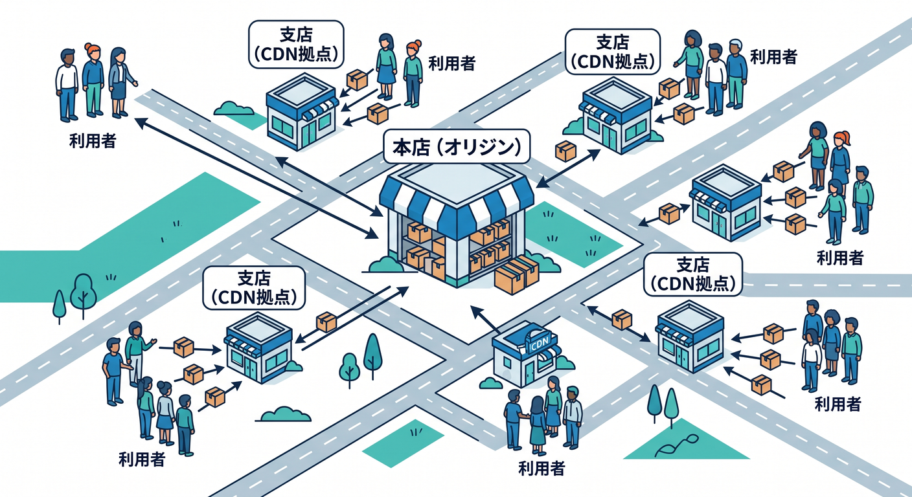
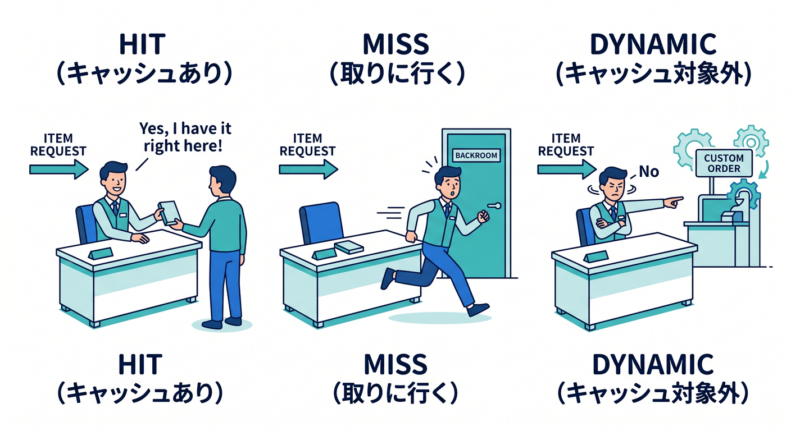
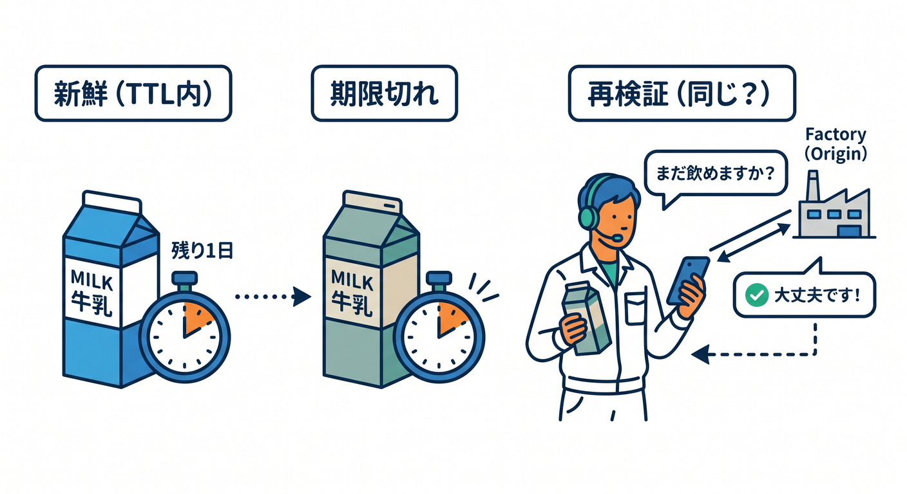
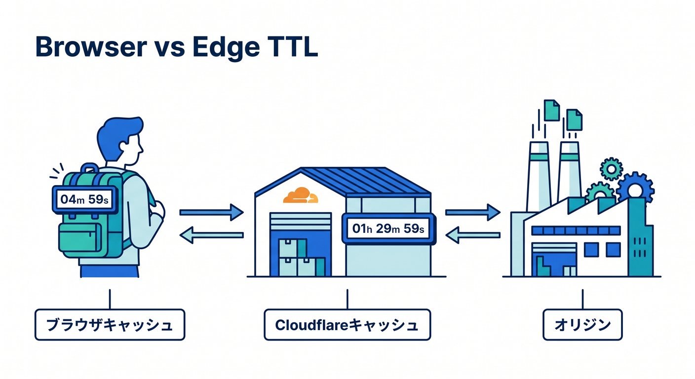
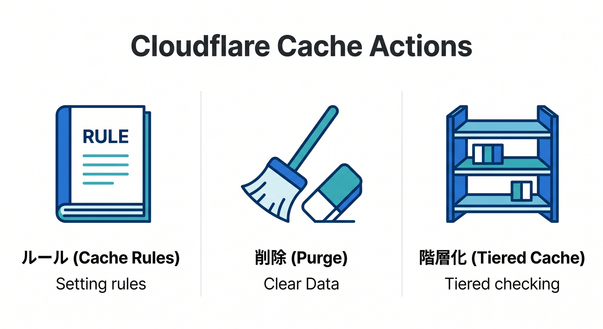

# 第08章：CDNとキャッシュの超基礎 🍪🚀

この章では、Cloudflareを使うとよく出てくる **CDN** と **キャッシュ** を、できるだけやさしくつかみます 😊
ここがわかると、「なぜCloudflareで速くなるの？」「なぜ元サーバーの負担が減るの？」「なぜ更新したのに古い画面が出るの？」が、かなりスッと理解できるようになります。Cloudflare公式でも、Cache は世界中に分散したデータセンターにコピーを置き、利用者に近い場所から返すことで、配信速度の向上とオリジンサーバー負荷の軽減をねらう仕組みとして説明されています。 ([Cloudflare Docs][1])

---

## この章のゴール 🎯

この章を読み終えるころには、次の3つが言えるようになるのが目標です ✨

* CDN は「近くで届ける仕組み」
* キャッシュは「すぐ返せるように控えを持つ仕組み」
* Cloudflare では「何をキャッシュするか」「どれくらい保持するか」「いつ捨てるか」をかなり細かく調整できる

Cloudflare Cache は全プランで使え、Cache Rules、Tiered Cache、Purge などの機能で挙動を調整できます。 ([Cloudflare Docs][1])

---

## 1. CDNって何？🌍📦



CDN は、ひとことで言うと **配る場所を利用者の近くへ寄せる仕組み** です。
オリジンサーバーが1か所だけにあると、遠い地域の人は毎回そこまで取りに行く必要があります。でも Cloudflare のような CDN が間に入ると、世界中のデータセンターにコピーを置いて、近い場所から返しやすくなります。これが「速く感じる」大きな理由です。 ([Cloudflare Docs][1])

イメージとしてはこんな感じです 🍱

* オリジンサーバー = 本店
* Cloudflare の各拠点 = 支店
* キャッシュ = 支店に置いた売れ筋商品の在庫

毎回本店まで取りに行かず、近くの支店で渡せれば速いですよね。CDN はまさにその発想です 😊

---

## 2. キャッシュって何？🧠💾


キャッシュは **「また同じものを求められたら、すぐ返せるように一時的に持っておくこと」** です。
画像、CSS、JavaScript、PDF など、何度も同じ内容が読まれやすいものはキャッシュと相性がとてもいいです。Cloudflare も、よくアクセスされるコンテンツのコピーを近くに保持して返すことで、オリジンへのアクセス回数を減らします。 ([Cloudflare Docs][1])

ここで大事なのは、キャッシュは **永久保存ではない** ということです。
Cloudflare はキャッシュしたものをずっと持つとは限らず、人気が落ちたものは押し出されることがあります。Cloudflare docs では、保持期間そのものは人気度やキャッシュ容量の影響を受け、不要になったものは eviction されると説明されています。 ([Cloudflare Docs][2])

---

## 3. Cloudflareで何が速くなるの？⚡

Cloudflare を通すと速くなる理由は、単に「回線がすごいから」だけではありません。
大きいのは **キャッシュ済みならオリジンまで行かずに返せる** ことです。これにより、通信距離が短くなり、オリジンの処理回数も減ります。さらに Tiered Cache を使うと、下位の拠点がミスしたときでも、いきなり全拠点からオリジンへ行くのではなく、上位層のキャッシュを見に行くので、オリジンへの問い合わせをかなり減らせます。 ([Cloudflare Docs][1])

Tiered Cache は、Cloudflare のネットワーク内に「上のキャッシュ」「下のキャッシュ」という段を作る考え方です。近い拠点に無ければ上位拠点へ聞き、それでも無ければ上位拠点だけがオリジンへ取りに行きます。これで HIT 率が上がり、オリジン接続数も減ります。 ([Cloudflare Docs][3])

---

## 4. 最初に覚えるべき単語はこれだけでOK 🙆‍♂️



### HIT 🟢

Cloudflare のキャッシュにあって、そのまま返せた状態です。いちばんうれしい状態です。 ([Cloudflare Docs][4])

### MISS 🟡

キャッシュに無くて、オリジンサーバーから取りに行った状態です。初回アクセスや、まだ温まっていないときによく見ます。 ([Cloudflare Docs][4])

### DYNAMIC 🔵

そもそも Cloudflare が「これはキャッシュ対象じゃない」と判断して、オリジンから返した状態です。たとえば動的ページや API でよく出ます。 ([Cloudflare Docs][4])

### BYPASS 🟠

オリジンが `Cache-Control: no-cache` や `private` などを返したり、レスポンスに Cookie が付いたりして、Cloudflare がキャッシュを通さなかった状態です。 `Authorization` ヘッダー付きリクエストでも起こりえます。 ([Cloudflare Docs][4])

### UPDATING 🟣

キャッシュは古くなっているけれど、Cloudflare が裏で更新中なので、とりあえず古いものを返している状態です。2026年時点の docs では、`stale-while-revalidate` が非同期で動くため、期限切れ直後の再検証中は `UPDATING` が出るのが通常動作です。 ([Cloudflare Docs][4])

### Age 🕒

レスポンスヘッダーの `Age` は、そのデータが Cloudflare のキャッシュ内に何秒いるかを示します。キャッシュから返されたときだけ付くので、確認用としてかなり便利です。 ([Cloudflare Docs][4])

---

## 5. TTLって何？⌛



TTL は **「この控えを、どれくらい新鮮とみなして使っていいか」** という時間です。
Cloudflare docs では、キャッシュに残っていること自体と、まだ新鮮として使ってよいかは別物として説明されています。前者は retention、後者は freshness です。つまり「まだ残っているけど、もう新鮮ではない」状態もあります。 ([Cloudflare Docs][2])

新鮮さが切れたあと、Cloudflare はオリジンに「これ、まだ同じ内容？」と確認しに行きます。これが **revalidation** です。 `ETag` や `If-Modified-Since` を使って差分確認し、変わっていなければ再利用、変わっていれば新しい内容へ差し替えます。 ([Cloudflare Docs][5])

---

## 6. まず初心者が驚くポイント 😳

## 「HTMLやJSONって、最初から何でもキャッシュされるわけじゃない」

Cloudflare は **ファイル拡張子ベース** で既定のキャッシュ対象を見ています。
そのため、標準では HTML や JSON はデフォルトでキャッシュされません。一方で CSS、JS、画像、PDF など多くの静的ファイルは既定でキャッシュ対象です。さらに `robots.txt` は既定でキャッシュされます。 ([Cloudflare Docs][6])

これは、React や Next.js 系の学習でも大事です 💡
「静的アセットはキャッシュしやすい」「ページ本体や API 応答はそのままだと動的扱いになりやすい」という感覚を持っておくと、あとで設計がかなり楽になります。Cloudflare 側では、HTML を含めて追加でキャッシュしたいなら Cache Rules で対象や TTL を明示的に調整できます。 ([Cloudflare Docs][6])

---

## 7. ブラウザのキャッシュと、Cloudflareのキャッシュは別です 🧩



ここ、かなり重要です 🔥

* **Browser TTL** = 利用者のブラウザにどれくらい持たせるか
* **Edge TTL** = Cloudflare 側にどれくらい持たせるか

Cloudflare では Cache Rules で Browser TTL を尊重・上書き・バイパスできますし、 `Cache-Control` の `max-age` と `s-maxage` を使ってブラウザ向けと共有キャッシュ向けを分ける考え方もあります。 `s-maxage` は共有キャッシュ向けで、ブラウザは無視します。 ([Cloudflare Docs][7])

つまり、ブラウザで古いものが残る問題と、Cloudflare 側で古いものが残る問題は、似ているようで別です。
「Cloudflareでは更新済みなのに自分のブラウザだけ古い」もあれば、その逆もあります。ここを分けて考えられると、かなり強いです 😊

---

## 8. Cache-Control は“キャッシュへの指示書”📜

オリジンサーバーは、レスポンスヘッダーの `Cache-Control` で「どこまで保存してよいか」「何秒もたせるか」「期限切れ後にどう再検証するか」を伝えられます。Cloudflare はこの指示を読み、Free / Pro / Business では Origin Cache Control が既定で有効なので、オリジンの `Cache-Control` を基本的に尊重します。 ([Cloudflare Docs][8])

たとえば代表例はこんな感じです ✍️

* `public` : 共有キャッシュにも保存してよい
* `private` : ブラウザ向けで、Cloudflare のような共有キャッシュには置かない
* `no-store` : 保存しない
* `max-age=秒` : この秒数までは新鮮
* `s-maxage=秒` : 共有キャッシュ向けの TTL
* `stale-while-revalidate=秒` : 期限切れ後もしばらく古いものを返しつつ裏で更新してよい

Cloudflare docs では `stale-while-revalidate` が 2026年時点では fully asynchronous とされ、期限切れ直後の最初のリクエストでも待たせず、裏で更新する挙動が説明されています。 ([Cloudflare Docs][8])

---

## 9. Cloudflareで最初に触る設定はこの3つ 👇



### ① Cache Rules 🎛️

何をキャッシュ対象にするか、どれくらい保持するか、どこでキャッシュするかなどを調整するルールです。Cloudflare ではダッシュボード、API、Terraform から作成できます。しかも全プランで利用できます。 ([Cloudflare Docs][9])

### ② Purge 🔄

更新したのに古いものが残るときの「消して取り直させる」操作です。Cloudflare の Instant Purge では、URL 単位の purge が推奨で、タグ・ホスト名・URL prefix・全部消しなど複数の方法があります。 ([Cloudflare Docs][10])

### ③ Tiered Cache 🏗️

近い拠点に無いときでも、いきなりオリジンへ行かず上位キャッシュを見に行く仕組みです。HIT率改善とオリジン負荷軽減に効きます。 ([Cloudflare Docs][3])

---

## 10. 最近のCloudflareキャッシュで覚えておきたい“新しめの話” 🆕✨

2026年3月24日には **Cache Response Rules** が追加され、オリジンを直接いじらなくても、Cloudflare 側で `Cache-Control` の変更、cache tags の管理、 `Set-Cookie` などキャッシュを妨げるヘッダーの除去をレスポンス段階で行えるようになりました。
これは「オリジンの設定変更が難しい」「別CDNから移行したい」「Cloudflare 側だけでキャッシュ方針を揃えたい」というときにかなり便利です。 ([Cloudflare Docs][11])

初心者段階では「まず Cache Rules を知る」で十分ですが、**“Cloudflare 側だけで後から整える道もある”** と知っておくと安心です 😊

---

## 11. AI時代のキャッシュも、考え方は同じ 🤖☁️


Cloudflare の AI Gateway でも、キャッシュの考え方がそのまま出てきます。
AI Gateway は analytics、logging、rate limiting、retry / fallback に加えて caching を持ち、同じ問い合わせを元プロバイダまで毎回流さず、Cloudflare 側から返せるようにします。これにより速度改善とコスト削減が期待できます。 ([Cloudflare Docs][12])

2026年時点の AI Gateway のキャッシュは、**現在は text / image 応答に対応し、 identical requests のみ対象** です。ヒット確認には `cf-aig-cache-status` を見ます。つまり AI でも、「完全に同じ問い合わせなら近くで返す」という基本発想は Web の CDN キャッシュと同じです。 ([Cloudflare Docs][13])

さらに Workers AI は Cloudflare のグローバルネットワーク上でモデル実行できる位置づけなので、Cloudflare の世界では「Web配信」と「AI実行」がかなり近い地図の上にあります。 ([Cloudflare Docs][12])

---

## 12. VS Code と Copilot をどう絡めると学びやすい？💻🤝🤖

本日時点の Cloudflare docs では、Workers アプリは **VS Code、Codex などのエディタやエージェントから prompt ベースで作れる** と案内されています。さらに Cloudflare docs 用 MCP サーバーや observability 用 MCP サーバーも案内されていて、AI に Cloudflare の文脈を持たせながら開発する流れがかなり前提化してきています。 ([Cloudflare Docs][14])

GitHub Copilot 側では、リポジトリ全体の指示を `.github/copilot-instructions.md` に書けます。GitHub docs では、これにプロジェクトの理解方法、ビルド・テスト方法、検証方法などを書くことで、Copilot にリポジトリ固有の文脈を渡せると説明されています。 ([GitHub Docs][15])

たとえばこの章の学習用リポジトリなら、Copilot への指示としてこんな方針が相性よいです ✨

```md
## copilot-instructions.md

- Cloudflare中心で説明する
- TypeScriptで例を書く
- キャッシュ設定はまずCache-ControlとCache Rulesを優先する
- HTML/JSONはデフォルトでキャッシュされない前提で考える
- 変更時はPurgeやTTL差分も説明する
```

こうしておくと、Copilot に「Cloudflare向けにキャッシュ戦略を説明して」「CF-Cache-Status の見方を教えて」などを頼んだとき、答えがブレにくくなります 😊

---

## 13. VS Codeでの確認もかなりやりやすいです 🔍

Cloudflare Workers 開発では、 `wrangler dev` でローカル実行でき、Cloudflare docs では VS Code の JavaScript Debug Terminal や `launch.json` によるブレークポイントデバッグが案内されています。さらに `wrangler dev` や Vite + Cloudflare Vite plugin では DevTools も使えます。 ([Cloudflare Docs][16])

この章はまだ Workers 本格実装の前ですが、**「ヘッダーを見る」「挙動を観察する」学び方** に VS Code がちゃんと乗っている、と知っておくのは大事です。Cloudflare 側も今は AI・エディタ連携をかなり意識した導線になっています。 ([Cloudflare Docs][14])

---

## 14. まずはこれだけ試すミニ演習 🧪✨

### 演習1：ヘッダーを見る

ブラウザだけでもいいですが、Windows なら次のように `curl.exe` でヘッダーを見ると理解が早いです。

```powershell
curl.exe -I https://example.com/style.css
```

見たいのは主にこのへんです 👀

* `CF-Cache-Status`
* `Age`
* `Cache-Control`

これで「HIT なのか」「MISS なのか」「何秒くらいキャッシュされているのか」を観察します。Cloudflare docs でも `CF-Cache-Status` と `Age` は基本確認ポイントとして説明されています。 ([Cloudflare Docs][4])

### 演習2：静的ファイルと動的レスポンスを見比べる

* 画像や CSS を見る
* HTML を見る
* API の JSON を見る

この3つを見比べると、**静的ファイルはキャッシュされやすく、HTML / JSON は既定ではそうではない** ことが体感しやすいです。 ([Cloudflare Docs][6])

### 演習3：更新後に Purge を意識する

画像や CSS を差し替えたのに古い表示が残ったら、TTL かブラウザキャッシュか Cloudflare キャッシュかを切り分けます。Cloudflare 側なら Purge by URL が基本です。 ([Cloudflare Docs][10])

---

## 15. この章のまとめ 🧭🍀

CDN は **近い場所から届ける仕組み**、キャッシュは **すぐ返せるように控えを持つ仕組み** です。Cloudflare はその両方をかなり強く提供していて、世界中の拠点にコピーを置き、必要に応じて Cache Rules、Tiered Cache、Purge で挙動を調整できます。 ([Cloudflare Docs][1])

初心者のうちは、まずこの4つを覚えれば十分です 👍

* `HIT` はうれしい
* `MISS` はまだ温まっていない
* HTML / JSON は最初から何でもキャッシュされるわけではない
* 更新したら TTL と Purge を疑う

ここまで入ると、次の章以降で Cloudflare の設定画面や Workers に触れたときも、「何のための設定か」がかなり見えやすくなります 😊

続けて第9章もこの調子で、最新情報を当てながら教材化できます。

[1]: https://developers.cloudflare.com/cache/ "Cloudflare Cache · Cloudflare Cache (CDN) docs"
[2]: https://developers.cloudflare.com/cache/concepts/retention-vs-freshness/ "Retention vs Freshness (TTL) · Cloudflare Cache (CDN) docs"
[3]: https://developers.cloudflare.com/cache/how-to/tiered-cache/ "Tiered Cache · Cloudflare Cache (CDN) docs"
[4]: https://developers.cloudflare.com/cache/concepts/cache-responses/ "Cloudflare cache responses · Cloudflare Cache (CDN) docs"
[5]: https://developers.cloudflare.com/cache/concepts/revalidation/ "Revalidation · Cloudflare Cache (CDN) docs"
[6]: https://developers.cloudflare.com/cache/concepts/default-cache-behavior/ "Default Cache Behavior · Cloudflare Cache (CDN) docs"
[7]: https://developers.cloudflare.com/cache/how-to/cache-rules/settings/ "Cache Rules settings · Cloudflare Cache (CDN) docs"
[8]: https://developers.cloudflare.com/cache/concepts/cache-control/ "Origin Cache Control · Cloudflare Cache (CDN) docs"
[9]: https://developers.cloudflare.com/cache/how-to/cache-rules/ "Cache Rules · Cloudflare Cache (CDN) docs"
[10]: https://developers.cloudflare.com/cache/how-to/purge-cache/ "Purge cache · Cloudflare Cache (CDN) docs"
[11]: https://developers.cloudflare.com/changelog/post/2026-03-24-cache-response-rules/ "Cache Response Rules · Changelog"
[12]: https://developers.cloudflare.com/ai-gateway/ "Overview · Cloudflare AI Gateway docs"
[13]: https://developers.cloudflare.com/ai-gateway/features/caching/ "Caching · Cloudflare AI Gateway docs"
[14]: https://developers.cloudflare.com/workers/get-started/prompting/ "Prompting · Cloudflare Workers docs"
[15]: https://docs.github.com/copilot/customizing-copilot/adding-custom-instructions-for-github-copilot "Adding repository custom instructions for GitHub Copilot - GitHub Docs"
[16]: https://developers.cloudflare.com/workers/observability/dev-tools/breakpoints/ "Breakpoints · Cloudflare Workers docs"
