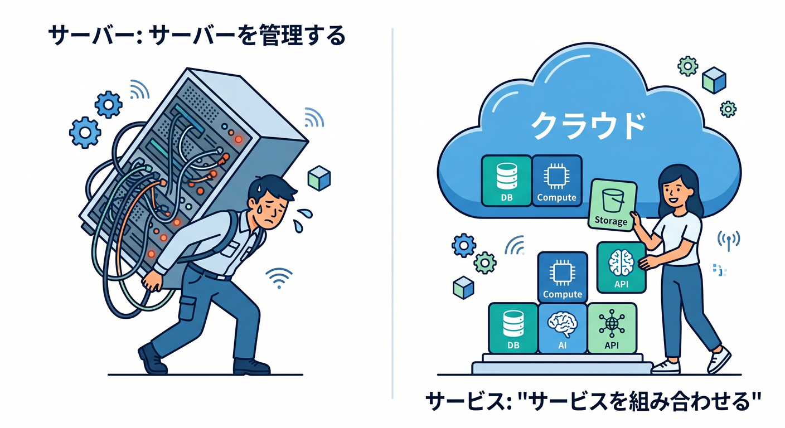
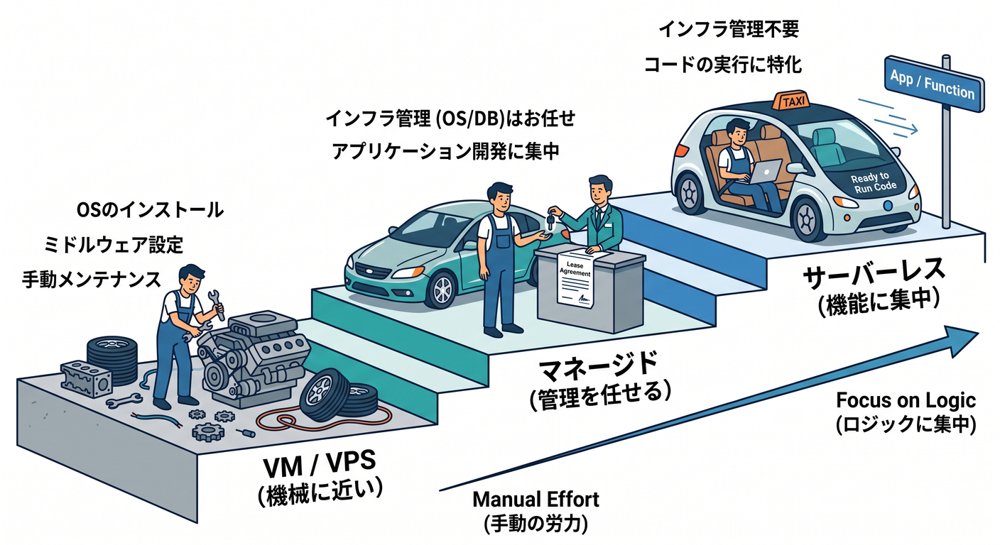
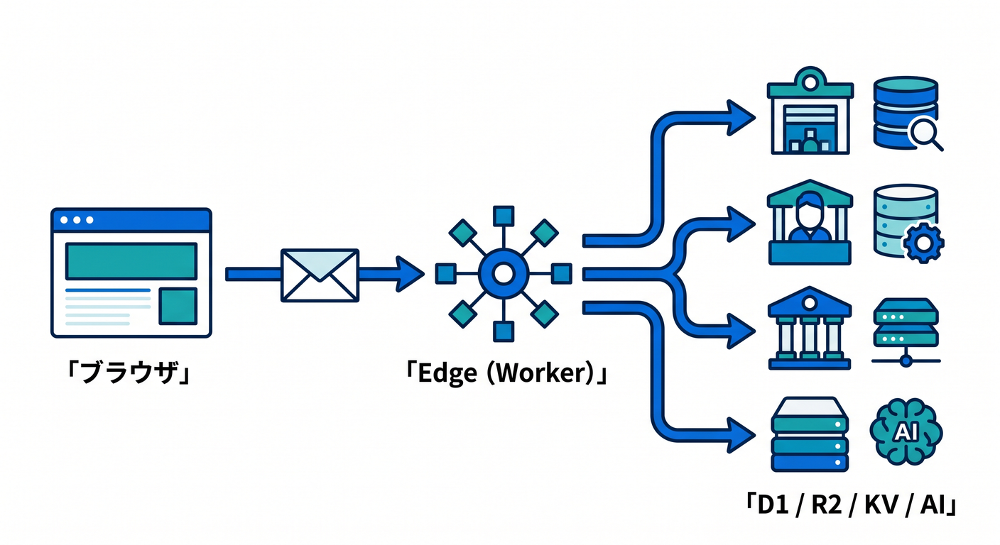
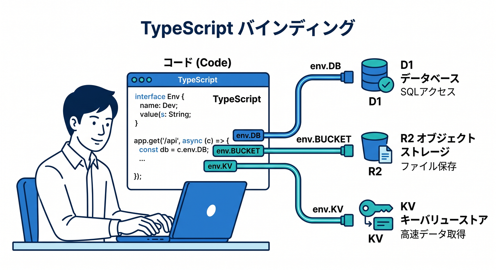
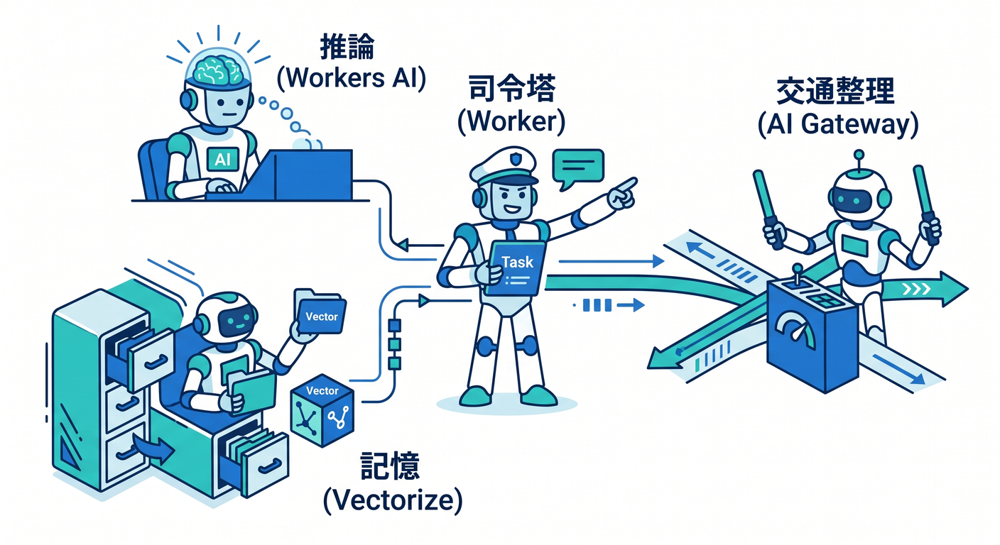
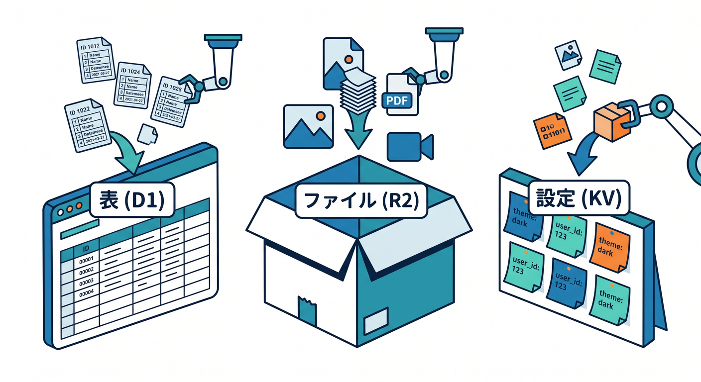

# 第09章：クラウドって結局どういう考え方なの？☁️

この章では、「クラウドって、なんとなく便利そうだけど、結局なにがどう違うの？」をスッと整理していきます 😊
ここで大事なのは、クラウドを“巨大な会社のコンピューターを借りる話”だけで終わらせないことです。
**自分で機械やOSや配線や監視を全部抱え込まず、必要な機能をサービスとして組み合わせ、作ることに集中する考え方**としてつかめると、Cloudflareの見え方が一気に変わります ☁️✨

Cloudflare Workers は、Cloudflare公式でも「Cloudflare のグローバルネットワーク上でアプリを構築・配備・スケールできるサーバーレス基盤」であり、「インフラ管理や複雑な設定を強く意識しなくてよい」形で案内されています。さらに React や Next.js などのフレームワーク、TypeScript などの言語、組み込みの observability も前提にした開発導線が用意されています。 ([Cloudflare Docs][1])

## この章でつかみたいこと 🎯

* クラウドは「どこか遠くのPC」ではなく、**運用の重さを減らす考え方**だとわかる
* Cloudflare では、その考え方が **Workers・D1・R2・KV・AI** にどう分かれているか見える
* 「サーバー管理」より「TypeScriptで機能を作る」ほうへ意識を寄せやすくなる

---

## 1. クラウドは「サーバーが消える魔法」ではない ☁️🪄



まず最初に、よくある誤解を1つだけほどいておきます 🙌

**サーバーレス = サーバーが存在しない**、ではありません。
実際にはちゃんとサーバーやネットワークやストレージがあります。
ただし、そのへんの面倒を開発者が毎回ぜんぶ背負わなくてよい、というのがポイントです。

たとえば昔ながらのやり方だと、

* どのマシンで動かすか
* OSは何か
* 更新はどうするか
* 何台に増やすか
* ログや監視をどう見るか
* どの地域に置くか

みたいなことを、自分でかなり考える必要がありました 😵‍💫

クラウドでは、その一部または大半をサービス側が引き受けてくれます。
そして Cloudflare Workers は、その中でもかなり「作る側」に寄せた形です。公式には single command でデプロイでき、インフラ管理なしでアプリをスケールさせる serverless platform とされています。 ([Cloudflare Docs][1])

---

## 2. クラウドの段階をざっくり分けるとこうなる 🪜☁️



初心者向けにかなり乱暴にまとめると、クラウドには次の3段階があります。

### ① 機械に近い世界

VM や VPS を借りて、OS やミドルウェアも含めて自分で面倒を見る世界です。
自由度は高いですが、学ぶことも増えやすいです 🛠️

### ② 管理をかなり任せる世界

データベースやストレージなどを、マネージドサービスとして使う世界です。
自分で全部インストールしなくてよくなります 📦

### ③ サーバーレスの世界

「このコードを動かしたい」「このデータを保存したい」に集中しやすい世界です。
Cloudflare Workers、D1、R2、KV、Workers AI は、この感覚をかなり強く味わいやすい組み合わせです。Workers は serverless 実行基盤、D1 は serverless SQL database、R2 は S3互換の object storage、KV はグローバルな key-value ストアとして案内されています。 ([Cloudflare Docs][1])

ここでのコツは、
**「クラウド = 仮想マシンを借りること」だけではない**
と理解することです 😊

---

## 3. Cloudflareで見ると、クラウドの考え方がかなりわかりやすい 🌐⚡



Cloudflare を使うと、クラウドの考え方がとても見えやすくなります。
なぜかというと、「計算する場所」「保存する場所」「AIを呼ぶ場所」「観測する場所」が、かなり素直に分かれているからです。

イメージはこんな感じです 👇

**ブラウザ**
↓
**Cloudflare Edge / Worker**
↓
**D1 / KV / R2 / Vectorize / Workers AI**
↓
**レスポンスを返す**

Workers は Cloudflare のグローバルネットワーク上で動き、フロントエンド資産、API、AI推論、バックグラウンド処理まで同じ開発基盤の中で扱えます。Workers docs では front-end applications、back-end applications、serverless AI inference、background jobs まで並べて案内されています。 ([Cloudflare Docs][1])

つまり Cloudflare では、
**「サーバーを1台立てて全部そこへ押し込む」発想より、役割ごとにちょうどよいサービスを組み合わせる発想**
がとても自然です ☁️🧩

---

## 4. なぜサーバーレスは初心者にやさしいの？🌱

初心者がクラウドで疲れやすいのは、アプリ本体より前に、運用まわりの用語がどっと来るからです 😵

* リージョン
* スケーリング
* ロードバランサ
* OS更新
* ランタイム管理
* 監視
* 証明書
* ネットワーク設計

もちろん後では大事です。
でも最初から全部背負うと、**「何を作りたいのか」より「何を設定すればいいのか」** に意識が吸われがちです。

Cloudflare の serverless backends の説明では、Workers はユーザーに最も近い Cloudflare ロケーションでコードが自動実行され、V8 isolates による高速起動、そして自動スケーリングが強みとして案内されています。つまり、最初の学習段階では「まず機能を作る」に集中しやすいわけです。 ([Cloudflare Docs][2])

この感覚は、文系寄りの初学者にもかなり大事です 🌸
**クラウドを学ぶ = いきなりインフラ担当になる** ではありません。
まずは **「コードを書くとネットの近くで動く」** を体感すれば十分です。

---

## 5. TypeScript中心で見ると、Cloudflareはかなり入りやすい 💙



Cloudflare Workers では TypeScript が first-class language とされていて、Workers runtime のAPI型は `workerd` 由来で提供されます。さらに Cloudflare は `wrangler types` を推奨しており、compatibility date、flags、bindings に合った型を生成する流れが公式に案内されています。 ([Cloudflare Docs][3])

これ、初心者にはかなりうれしいです 😊

なぜなら、

* `env.DB` は D1Database
* `env.BUCKET` は R2Bucket
* `env.KV` は KVNamespace
* `env.AI` は AI binding

のように、**「クラウドの部品」が TypeScript の型として見えてくる**からです。
つまり、クラウドがふわっとした概念ではなく、**エディタの補完に出てくる触れる部品**になります ✨

### すごく小さい Worker の雰囲気 🌱

```typescript
export default {
  async fetch(): Promise<Response> {
    return Response.json({
      message: "こんにちは、Cloudflare ☁️",
      idea: "サーバー管理より、まず機能づくりに集中しよう",
    });
  },
};
```

この「まず1ファイルで返せる」感じが、serverless の入口です 🚪✨
ここにあとから D1、R2、KV、AI を足していく発想が、Cloudflare ではかなり自然です。Workers は TypeScript、React、Next.js など複数フレームワーク・言語を前提にした platform として整理されています。 ([Cloudflare Docs][1])

---

## 6. 開発体験も、かなり“クラウドを難しくしない”方向へ進んでいる 🛠️✨

Cloudflare の現在の導線では、新規作成は `create-cloudflare` 系のCLIが入口になっていて、既存プロジェクトでも `wrangler deploy` や `wrangler setup` による自動検出・自動設定がかなり強化されています。公式 docs では、Wrangler 4.68.0 以降なら既存フレームワークを検出し、必要な adapter を入れ、`wrangler.jsonc` を生成し、`package.json` に便利な scripts を足す流れが案内されています。Next.js も対象に含まれます。 ([Cloudflare Docs][4])

また、Cloudflare Vite plugin は Vite と Workers runtime をフル機能でつなぎ、ローカル開発時にもコードを `workerd` 上で動かして、本番に近い挙動で確認しやすい形になっています。Static site、SPA、full-stack app、standalone Worker まで扱え、React Router v7 と TanStack Start の公式サポートもあります。 ([Cloudflare Docs][5])

ここが大きいです 🎉
昔の「クラウド開発」は、ローカルと本番の差で混乱しやすかったのですが、今はかなり
**VS Code で TypeScript を書く → なるべくそのまま Workers runtime へつなぐ**
方向に寄ってきています。React/Vite系に慣れている人ほど、この導線は入りやすいです。 ([Cloudflare Docs][5])

---

## 7. AIを入れると、クラウドの意味がさらにハッキリ見える 🤖☁️✨



Cloudflare のAIまわりを見ると、「クラウドって結局、必要な部品を組み合わせることなんだな」がすごくよく見えます。

Workers AI は、Cloudflare のグローバルネットワーク上で serverless GPUs によりAIモデルを実行できる仕組みで、スケーリングや未使用インフラの維持を強く気にせず使えるよう案内されています。さらに 50+ の open-source models、pay-for-what-you-use pricing、そして Workers / AI Gateway / Vectorize とつながる形で説明されています。 ([Cloudflare Docs][6])

AI Gateway は、AIアプリに対して analytics・logging・caching・rate limiting・request retries・model fallback を提供し、Workers AI だけでなく Anthropic、Google Gemini、OpenAI など複数プロバイダともつなげられます。つまり「AIを呼ぶ」だけでなく、**AIの運用そのものを整理する場所**として使えます。 ([Cloudflare Docs][7])

Vectorize は Cloudflare の globally distributed vector database で、Workers AI が作った embeddings を保存し、semantic search、recommendation、classification、anomaly detection、RAG的な文脈付与へつなげられます。さらに docs では、Vectorize の結果から R2 の画像、KV のドキュメント、D1 のユーザープロファイルへ戻る全体像まで示されています。 ([Cloudflare Docs][8])

AI Search も、Workers AI・AI Gateway・Vectorize・Workers・R2 が関係する形で整理されており、検索と生成を Cloudflare の部品群で組み立てる発想がはっきり見えます。 ([Cloudflare Docs][9])

つまり AI時代のクラウドは、こう考えるとわかりやすいです 👇

* **Workers** = 司令塔
* **Workers AI** = 推論する頭脳
* **AI Gateway** = AIの交通整理と見える化
* **Vectorize** = 意味検索や長期記憶
* **D1** = 構造化データ
* **R2** = ファイル置き場
* **KV** = 軽くて速い設定置き場

この分け方ができると、「AIアプリを作る」ときも、いきなり巨大な仕組みに見えなくなります 😊

---

## 8. データ保存も「役割で分ける」と一気にラクになる 🗂️✨



Cloudflare D1 は managed, serverless database で、SQLite のSQL意味論、disaster recovery、Worker / HTTP API access を持つと案内されています。リレーショナルに扱いたいデータ、たとえばユーザー情報・投稿・履歴・設定テーブルなどに向いています。 ([Cloudflare Docs][10])

Cloudflare R2 は S3-compatible object storage で、no egress fees、strong consistency、高い durability を持つストレージとして説明されています。画像、PDF、バックアップ、生成物、AI用の入力ファイルなど、「ファイル置き場」として考えると理解しやすいです。 ([Cloudflare Docs][11])

Workers KV は global, low-latency な key-value storage で、高読込・低レイテンシ向けに案内されています。ユーザー設定、A/Bテスト設定、ルーティング情報、認証関連の軽い情報などに向いています。 ([Cloudflare Docs][12])

この3つを雑に覚えるなら、こんな感じで十分です 👍

* **D1** = 表で管理したいもの
* **R2** = ファイルそのもの
* **KV** = 軽くてよく読む設定
* **Vectorize** = 意味で探したいもの

この「役割で分ける」感覚こそ、クラウド的な考え方です ☁️🧩

---

## 9. 観測までサービス化されているのも、いまどきのクラウドっぽさ 👀📈

クラウドの学習で見落としやすいのですが、**動かすこと**と同じくらい、**見ること**も大事です。

Cloudflare Workers には observability が組み込まれていて、logs、real-time logs、tail workers、traces、metrics、analytics、query builder、OTLP export まで含む形で案内されています。特に traces は、fetch や KV / R2 / Durable Objects などの binding 操作も自動計測されるので、「どこで遅いのか」を見やすいのが特徴です。 ([Cloudflare Docs][13])

これは初心者にかなり大きいです ✨
なぜなら、クラウド学習は「動いた！」で終わると伸びにくいからです。
**なぜ速いのか、なぜ遅いのか、どこで失敗したのかを見られる**ようになると、一気に実務っぽくなります。

---

## 10. VS Code と GitHub Copilot をどう混ぜると学びやすい？🤝🤖

GitHub Copilot の現行 VS Code docs では、Copilot はエージェントとしてタスクを分解し、複数ファイルを編集し、コマンドを実行し、うまくいかなければ自己修正する流れまで案内されています。さらに Plan agent で実装前に段取りを作る使い方も示されています。 ([Visual Studio Code][14])

また GitHub Docs では、リポジトリ全体向けの `.github/copilot-instructions.md` と、パス別の `.github/instructions/*.instructions.md` を使って、Copilot にプロジェクト固有の方針を伝える方法が公式化されています。 ([GitHub Docs][15])

Cloudflare学習では、ここに次のような方針を書いておくとかなり便利です ✨

```markdown
## Cloudflare project instructions

- TypeScript を優先する
- Cloudflare Workers runtime と bindings を優先して使う
- 設定変更後は wrangler types を前提に型を更新する
- 構造化データは D1、ファイルは R2、設定値は KV、意味検索は Vectorize を優先して検討する
- AI 機能は Workers AI と AI Gateway の併用をまず検討する
- Node 専用 API は、本当に必要なときだけ compatibility flags を確認して使う
- ログとトレースで原因を確認してから修正する
```

これは単なるおまじないではありません 😊
Cloudflare 側は `wrangler types` による型生成を推奨し、Vite plugin や Wrangler の自動設定も整ってきています。Copilot 側は repository custom instructions を正式な入口として用意しています。つまり、**AIに雑に丸投げするより、Cloudflare流の文脈を先に教えておく**ほうが、かなり良い結果になりやすいです。 ([Cloudflare Docs][3])

---

## 11. この章でやると良いミニ演習 ✍️🌟

### 演習1：言葉で説明してみる

次の一文を、自分の言葉で言い換えてみましょう。

> クラウドとは、サーバーを借りることではなく、運用の重さを減らして機能づくりに集中しやすくする考え方である

1回、自分の文章で言えるだけで理解がかなり深まります 😊

### 演習2：役割分担を描いてみる

紙でもメモでもいいので、こう描いてみましょう。

* ブラウザ
* Worker
* D1
* R2
* KV
* Workers AI
* AI Gateway
* Vectorize

そして「このデータはどこに置く？」を書き込んでみてください。
これだけで、クラウドの見え方がかなり整理されます 🗺️

### 演習3：仕分けゲーム

次のデータを D1 / R2 / KV / Vectorize に分けてみましょう。

* ユーザー一覧
* アップロード画像
* サイトのテーマ設定
* FAQの意味検索用ベクトル
* 投稿本文
* 一時的なフラグ
* PDF資料

正解は1つではありませんが、**なぜそこに置くか** を考えるのが大事です 💡

---

## 12. ここでつまずきやすいポイント 😵‍💫➡️😌

### 「クラウドって、結局サーバーを借りるだけでしょ？」

半分だけ正しいです。
でも今の Cloudflare では、compute、database、storage、AI、observability が細かくサービス化されていて、**“1台借りて全部そこに置く” 発想ではない** ところが重要です。 ([Cloudflare Docs][1])

### 「AIを使うなら専用GPUサーバーが必要なんでしょ？」

Cloudflare の Workers AI は serverless GPUs 上でAI推論を提供する形なので、少なくとも学習や小規模な構成では、専用GPU運用を前提にしなくても入りやすいです。 ([Cloudflare Docs][6])

### 「TypeScriptでクラウドは難しそう」

むしろ逆で、Cloudflare は TypeScript を first-class として扱い、`wrangler types` で binding を含めた型を生成する流れがあるので、エディタ補完を活かしやすいです。 ([Cloudflare Docs][3])

---

## 13. この章のまとめ 🧡☁️✨

この章のいちばん大事な結論はこれです。

**クラウドとは、“自分で全部の機械を面倒見ること”から少しずつ離れて、“必要な機能を組み合わせて作ること”へ寄っていく考え方**です。

Cloudflare ではその考え方がかなり見やすくて、

* **Workers** で処理を書く
* **D1 / KV / R2** に保存する
* **Workers AI / AI Gateway / Vectorize / AI Search** でAI機能を足す
* **Observability** で動きを観測する

という形で、部品ごとに整理できます。しかも現行 docs では、Workers は serverless platform、Vite plugin は Workers runtime と直結、Wrangler は既存フレームワークの自動検出、TypeScript は first-class、Copilot は VS Code 上で agent 的に計画・編集・検証できる流れが揃っています。 ([Cloudflare Docs][1])

なので第9章の到達点は、
**「クラウド、なんか難しい」から「Cloudflareの部品をどう組み合わせるか考えればいいんだ」へ進むこと**です 😊🚀

次の章へ進むころには、Web公開やアプリ構成の話が、かなり“地に足のついたもの”として見えてくるはずです。

[1]: https://developers.cloudflare.com/workers/ "Overview · Cloudflare Workers docs"
[2]: https://developers.cloudflare.com/use-cases/web-apps/serverless-backends/?utm_source=chatgpt.com "Build serverless backends · Cloudflare use cases"
[3]: https://developers.cloudflare.com/workers/languages/typescript/ "Write Cloudflare Workers in TypeScript · Cloudflare Workers docs"
[4]: https://developers.cloudflare.com/workers/framework-guides/automatic-configuration/ "Deploy an existing project · Cloudflare Workers docs"
[5]: https://developers.cloudflare.com/workers/vite-plugin/ "Vite plugin · Cloudflare Workers docs"
[6]: https://developers.cloudflare.com/workers-ai/ "Overview · Cloudflare Workers AI docs"
[7]: https://developers.cloudflare.com/ai-gateway/ "Overview · Cloudflare AI Gateway docs"
[8]: https://developers.cloudflare.com/vectorize/ "Overview · Cloudflare Vectorize docs"
[9]: https://developers.cloudflare.com/ai-search/ "Cloudflare AI Search · Cloudflare AI Search docs"
[10]: https://developers.cloudflare.com/d1/ "Overview · Cloudflare D1 docs"
[11]: https://developers.cloudflare.com/r2/how-r2-works/ "How R2 works · Cloudflare R2 docs"
[12]: https://developers.cloudflare.com/kv/?utm_source=chatgpt.com "Cloudflare Workers KV"
[13]: https://developers.cloudflare.com/workers/observability/ "Observability · Cloudflare Workers docs"
[14]: https://code.visualstudio.com/docs/copilot/overview "GitHub Copilot in VS Code"
[15]: https://docs.github.com/copilot/customizing-copilot/adding-custom-instructions-for-github-copilot "Adding repository custom instructions for GitHub Copilot - GitHub Docs"
