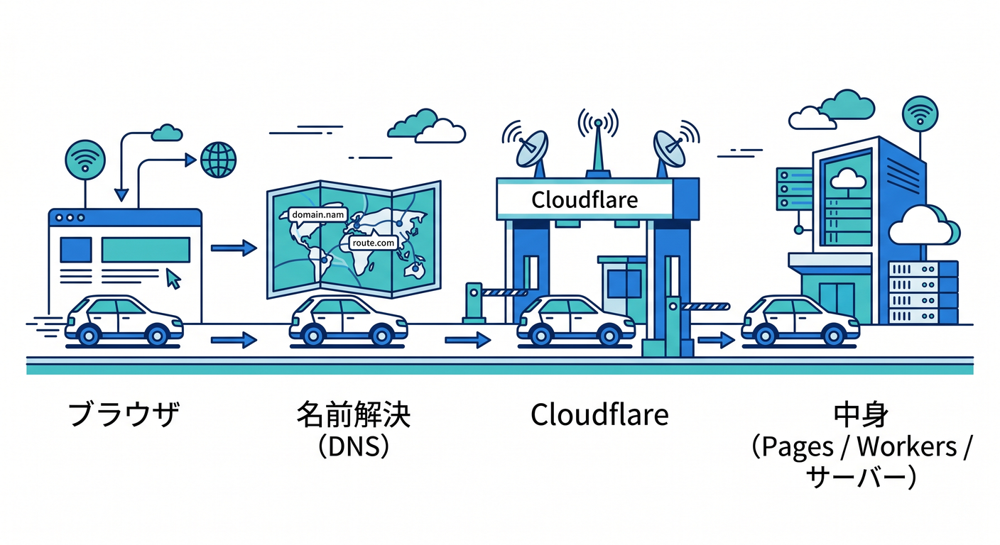
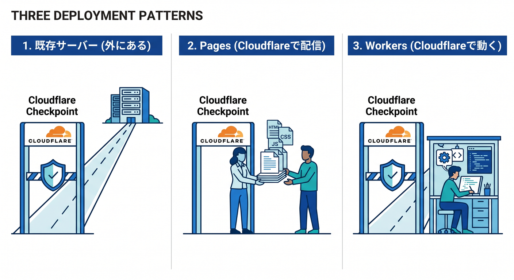
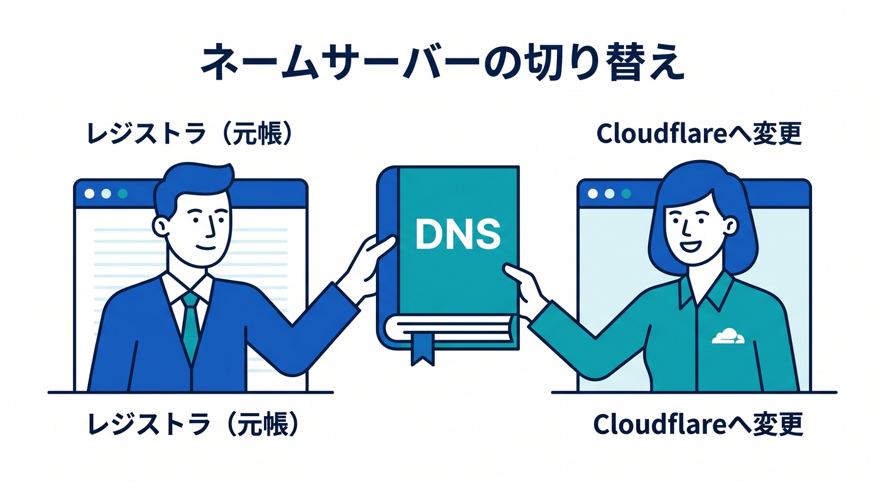
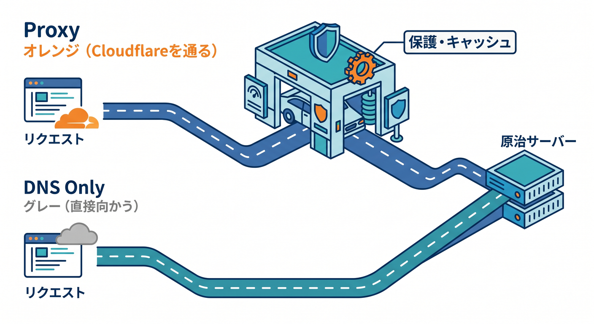
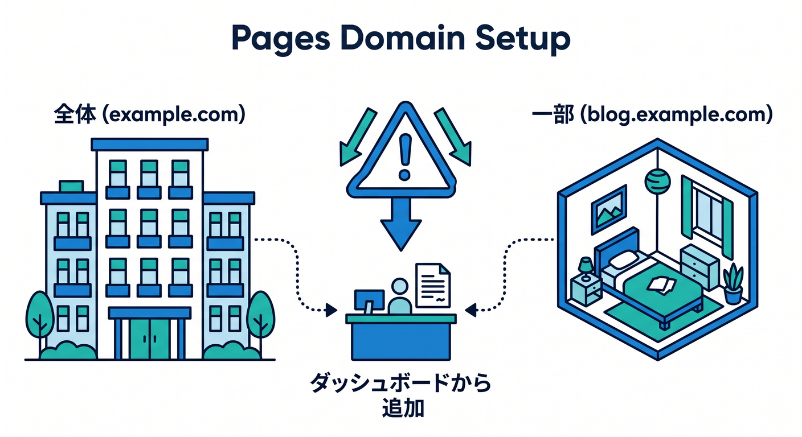
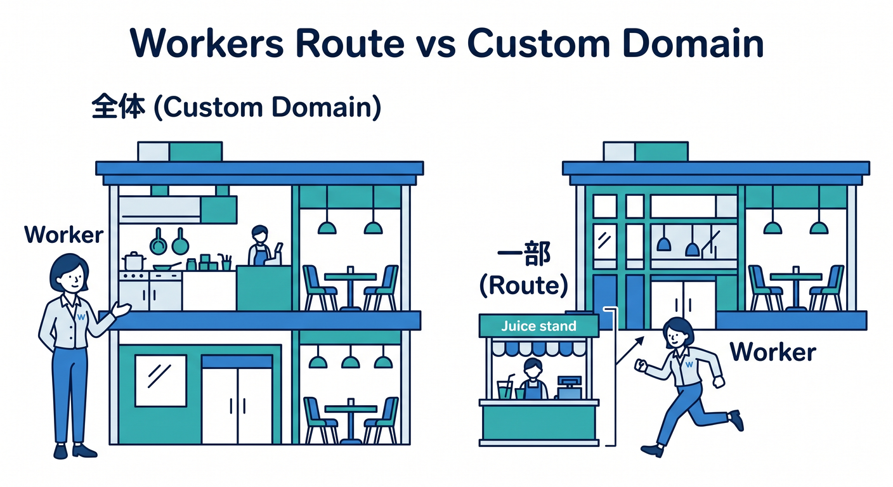
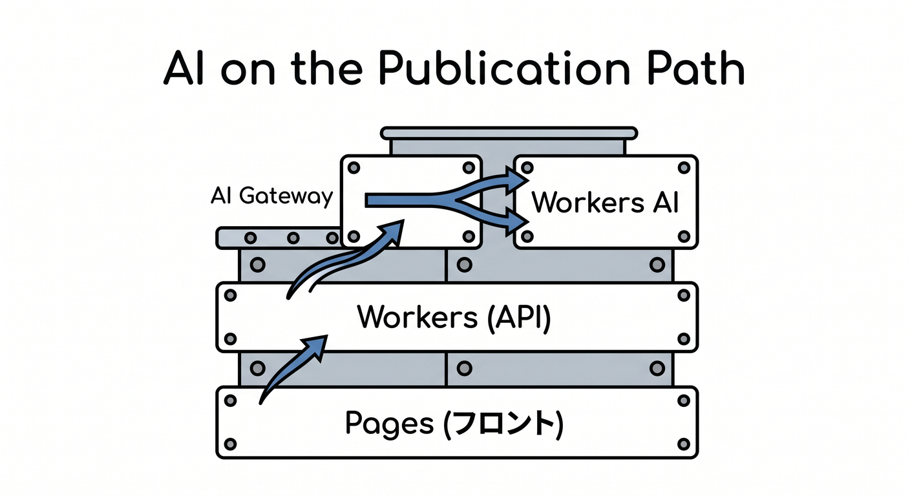

# 第10章：Webサイト公開の流れを1本の道で理解しよう 🛣️

この章では、「サイト公開って、結局どの順番で何をやっているの？」を、1本の道として理解していきます 😊
画面を触る前にこの流れが見えていると、Cloudflareの管理画面で迷いにくくなります。逆にここがぼんやりしたままだと、「DNSをいじる前にSSLを見る」「Pagesなのに通常サーバーのつもりで考える」みたいに、頭の中で順番がぐちゃっとなりやすいです。Cloudflare公式も、ドメイン追加からネームサーバー更新、DNS確認、SSL/TLS設定までを段階的に案内しています。 ([Cloudflare Docs][1])

## この章のゴール 🎯

この章を終えるころには、次のことが言えるようになるのが目標です ✨

1. サイト公開は「ファイルを置くだけ」ではなく、「名前をつなぐ」「通信を通す」「安全にする」が必要だとわかる。
2. Cloudflareが「DNSの会社」でもあり、「通信の途中に入る存在」でもあるとわかる。
3. Pages・Workers・既存サーバーの3パターンで、公開の流れが少しずつ違うとわかる。
4. AI機能を足すときも、結局はこの公開導線の上に載ってくるだけだとわかる。 CloudflareはDNSとCDNでトラフィックをリバースプロキシし、Pagesはグローバルネットワークへ即時デプロイ、Workersはインフラ管理不要のサーバーレス実行基盤、Workers AI はその上でAIモデルを呼び出せる形で提供されています。 ([Cloudflare Docs][2])

---

## まずは全体像を1本の道で見よう 🗺️

いちばん大事なのは、この一本道です 👇

ブラウザでURLにアクセス
→ ドメイン名から行き先を探す
→ Cloudflareへ到着する
→ CloudflareがHTTPSやキャッシュや保護を担当する
→ その先で「既存サーバー」「Pages」「Worker」のどれかに処理を渡す
→ HTML / CSS / JavaScript / APIレスポンスが返る

Cloudflareは、単に名前解決だけをするのではなく、DNSとCDNの機能を使って通信の通り道に入り、Webトラフィックをリバースプロキシします。さらに、プロキシされたレコードでは最適化・キャッシュ・保護・各種Cloudflare機能の適用が可能になります。 ([Cloudflare Docs][2])

---

## 公開には3つの代表パターンがあるよ 🚦

第10章では、まず公開パターンを3つに分けて覚えるとかなりラクです 😊

### 1. 既存のレンタルサーバーやVPSをそのまま使うパターン 🖥️

これは「元のサーバーはそのまま」「その前にCloudflareが入る」形です。
一番クラシックで、ブログ、企業サイト、WordPress、既存PHPサイトなどでよくある流れです。Cloudflareでは、A / AAAA / CNAME のWeb用レコードをプロキシすると、Cloudflareが保護・最適化・キャッシュを担当できます。 ([Cloudflare Docs][3])

### 2. Pagesに載せるパターン 📄⚡

これは「静的サイトやフロントエンド中心のサイトを、Cloudflare側でそのまま配信する」形です。Pages は Git 連携、Direct Upload、C3 からデプロイでき、グローバルネットワークへ即時配信できます。 ([Cloudflare Docs][4])

### 3. Workersをオリジンとして使うパターン ⚙️

これは「Worker 自体がアプリの本体になる」形です。Cloudflare公式は、Worker がそのホスト名の全トラフィックを処理するなら Custom Domain、既存オリジンの前で一部のURLだけ動かすなら Route を使うよう案内しています。 ([Cloudflare Docs][5])

この3つは似て見えますが、どこが“本体”なのかが違います。
既存サーバー型は「本体は外にある」、Pages型は「静的配信の本体がCloudflare側にある」、Workers型は「コード実行の本体がCloudflare側にある」という違いです。 ([Cloudflare Docs][4])

---

## ステップ1　まず“公開したい名前”を決める 📛

サイト公開は、最初に「どの名前で公開するか」を決めるところから始まります。
たとえば「example.com」で公開したいのか、「[www.example.com」で公開したいのか、「app.example.com」で公開したいのかで、あとで作るDNSレコードや公開パターンが少し変わります。Cloudflare公式も、ゾーン頂点の](http://www.example.com」で公開したいのか、「app.example.com」で公開したいのかで、あとで作るDNSレコードや公開パターンが少し変わります。Cloudflare公式も、ゾーン頂点の) apex レコードと、www や blog のようなサブドメインレコードを分けて説明しています。特に www を用意しておくと、利用者が自然にアクセスしやすくなります。 ([Cloudflare Docs][1])

ここでの感覚はシンプルです ✨
「何を公開するか」より先に、「どの住所で見せるか」を決める、です。

---

## ステップ2　Cloudflareにサイトを追加する ☁️➕

次にやるのが、「このドメインをCloudflareで扱います」と登録することです。
Cloudflareのドメイン追加ガイドでは、ゾーンを追加し、既存レコードをスキャンまたは手動で入れ、内容を確認してから次へ進む流れになっています。ここで大事なのは、Cloudflareの自動スキャンを過信しないことです。公式にも、クイックスキャンは既存レコードをすべて見つける保証はないので、必ずレビューして不足を補うよう書かれています。 ([Cloudflare Docs][1])

つまりここは、「Cloudflareに引っ越し先を伝える」というより、
「Cloudflareに、今の住所録を正しく渡す」作業です 📝

---

## ステップ3　DNSレコードを確認する 📚

ここが初心者さんの最重要ポイントです 🔥
DNSレコードは、「この名前に来たら、どこへつなぐか」の設定です。Cloudflare公式では、ゾーン頂点、サブドメイン、メール関連レコードを特に注意して確認するよう案内しています。設定が足りないと、訪問者が「その名前のサイトが存在しない」と判断され、「DNS_PROBE_FINISHED_NXDOMAIN」のようなエラーになることがあります。 ([Cloudflare Docs][1])

特に注意したいのは次の3つです 😊

1. トップの名前
   例: 「example.com」をどこへ向けるか。

2. よく使うサブドメイン
   例: 「[www.example.com」「blog.example.com」など。](http://www.example.com」「blog.example.com」など。)

3. メール系
   MX, SPF, DKIM, DMARC など。
   サイトだけ見ていると忘れやすいですが、メールを使っているドメインではかなり重要です。Cloudflare公式もメールレコードは別枠で注意喚起しています。 ([Cloudflare Docs][1])

---

## ステップ4　ネームサーバーをCloudflareへ切り替える 🔁

DNSレコードの確認が済んだら、レジストラ側でネームサーバーをCloudflare指定のものへ更新します。Cloudflare公式のフルセットアップ手順は、「1. Add your domain → 2. Review your DNS records → 3. Change your nameservers → 4. Re-enable DNSSEC」という順番です。つまり、ネームサーバー変更は“かなり大事な中盤工程”なんですね。 ([Cloudflare Docs][6])

ここでのイメージはこうです 🌍

* レジストラ
  そのドメインを持っている元帳みたいな場所
* ネームサーバー
  そのドメインの住所録を持っている場所
* Cloudflareへ変更
  その住所録の管理担当をCloudflareへ渡すこと

この切り替えが完了すると、利用者はCloudflare経由でそのドメインの情報を受け取るようになります。なお、Cloudflareにドメインを追加した直後は保護が pending 状態になることがあり、所有確認が終わるまで最大24時間かかる場合があります。 ([Cloudflare Docs][1])

---

## ステップ5　プロキシするか、DNSだけにするかを決める 🟠⚪

CloudflareのDNS管理でよく出てくるのが、オレンジの雲とグレーの雲です ☁️
A / AAAA / CNAME のうちWeb配信に使うレコードは、Cloudflare公式としてはプロキシ設定が推奨です。プロキシすると、DDoS保護、最適化、キャッシュ、各種Cloudflare製品の設定が効くようになります。しかも、ドメインをダッシュボードから追加した場合は、プロキシはデフォルトで有効です。 ([Cloudflare Docs][3])

ただし、なんでもオレンジにすればよいわけではありません 🙅
たとえば、第三者サービスのドメイン認証用 CNAME などはプロキシしないほうがよいケースがあります。公式も「検証用 CNAME は一般に proxied にしない」と明記しています。さらに、プロキシできるのは A / AAAA / CNAME のみで、他のレコードタイプは対象外です。 ([Cloudflare Docs][1])

ここでの覚え方はこれです 🌟
「Webを通したい名前はオレンジ寄り。認証やメール系は慎重に。」

---

## ステップ6　HTTPSを整える 🔒✨

ここも超大事です。
Cloudflareの SSL/TLS Encryption Mode は、「ブラウザ ↔ Cloudflare」と「Cloudflare ↔ オリジンサーバー」の2本の接続をどう扱うかを決めます。Cloudflare公式は可能なら Full または Full (strict) を推奨しています。 ([Cloudflare Docs][7])

初心者さん向けにざっくり言うと、こうです 😊

* Flexible
  見た目だけHTTPSっぽく見えやすいけれど、学習初期には混乱の元になりやすい
* Full
  オリジン側もHTTPSで通信する
* Full (strict)
  オリジン証明書までちゃんと検証するので、より安心

さらに、Cloudflare Origin CA をオリジンサーバーに入れると、Cloudflare と origin の間を暗号化でき、Full (strict) に対応しやすくなります。Cloudflare公式も、プロキシされたレコードだけでオリジンがトラフィックを受けるなら Origin CA を使えると案内しています。 ([Cloudflare Docs][8])

そして、HTTP で来たアクセスを全部 HTTPS へ寄せたいときは「Always Use HTTPS」を使います。これはすべてのサブドメインとホストへのHTTPアクセスをHTTPSへリダイレクトします。Cloudflare公式は、これをオリジンサーバー側でやるとリダイレクトループを起こすことがあるので、Cloudflare側でやることを勧めています。 ([Cloudflare Docs][9])

---

## ステップ7　公開先がどこなのかで、最後の一歩が変わる 👣

ここから先は、どこに本体があるかで分岐します。

### A. 既存サーバー型

この場合は、DNSレコードの行き先が既存サーバーです。Cloudflareはその前段に入り、保護・キャッシュ・SSL/TLS・最適化を担当します。CloudflareはリバースプロキシとしてWebトラフィックを扱うので、「サイトの中身は元サーバー、入口はCloudflare」という形になります。 ([Cloudflare Docs][2])

### B. Pages型

Pagesでは、Git連携、Direct Upload、または C3 からデプロイできます。Pages はフルスタックアプリを Cloudflare のグローバルネットワークへ配信でき、Pages Functions でサーバーサイド処理も足せます。Git integration を使うと、GitHub または GitLab へ push するたびに自動ビルド・自動デプロイが走ります。 ([Cloudflare Docs][4])

### C. Workers型

Workers はインフラ管理不要でデプロイできるサーバーレス基盤です。Worker がホスト名の本体そのものになる場合は Custom Domain を使い、既存オリジンの前に一部URLだけ差し込むなら Route を使います。Custom Domain では Cloudflare が DNS レコードと SSL 証明書を自動作成します。 ([Cloudflare Docs][10])

---

## Pagesで公開するときの注意点 📄

Pages のカスタムドメインは、apex と subdomain でルールが違います 😊

* apex ドメイン
  例: example.com
  この場合は、そのサイトを Cloudflare zone として追加し、ネームサーバーをCloudflareへ向ける必要があります。

* subdomain
  例: blog.example.com
  この場合は、サイト全体をCloudflare zoneにしなくても、CNAME で Pages へ向けられます。

ただし公式は、Pages ダッシュボード側で「Add custom domain」の手順を先に通さず、手で勝手に CNAME を足すと 522 エラーになる場合があると警告しています。 ([Cloudflare Docs][11])

また、Pages の Git integration はとても便利ですが、一度 Git integration で作ったプロジェクトは Direct Upload へ切り替えできません。逆方向も少しクセがあるので、学習段階では「このサイトは Git 自動デプロイで育てるのか」「ビルド済み成果物を上げるだけにするのか」を最初に決めるのがおすすめです。 ([Cloudflare Docs][12])

---

## Workersで公開するときの注意点 ⚙️

Workers は「コードを配る」世界なので、従来の公開より少し感覚が違います。
Cloudflare公式では、Worker がそのホスト名の全リクエストを受けるなら Custom Domain、既存サイトの前に追加処理を差し込むなら Route を使います。Route は、Cloudflare上のURLパターンに対して Worker を動かす仕組みです。 ([Cloudflare Docs][5])

つまり、

* 「app.example.com 全体を Worker にしたい」→ Custom Domain
* 「example.com/api/* だけ Worker を動かしたい」→ Route

という理解でかなり合っています 👍

---

## AIサービスも“公開の道”の上に載るだけ 🤖☁️

ここ、2026年のCloudflare学習ではかなり大事です ✨
AI機能は別世界ではなく、公開済みサイトの上に「後から足す機能」として扱えます。

たとえばこんな感じです 👇

* フロントは Pages で公開する
* API は Workers で受ける
* AI 推論は Workers AI で実行する
* 外部AIや自前AI呼び出しの可視化・リトライ・レート制御は AI Gateway でまとめる

Cloudflare公式では、Workers AI は Workers、Pages、または Cloudflare API から呼び出せるサーバーレスGPU基盤として案内されています。AI Gateway はログ、分析、キャッシュ、レート制御、リトライ、モデルフォールバックなどをまとめて扱えます。つまり、「サイト公開」と「AI導入」は別手順ではなく、同じ公開導線の先にAI部品を追加する感覚で考えるとわかりやすいです。 ([Cloudflare Docs][13])

---

## VS Code・Copilot時代の公開学習のコツ 💻🤖

2026年の学習では、VS Code と Copilot を“補助輪”としてちゃんと使うのが自然です 😊
VS Code の GitHub Copilot は、エージェント的に計画し、コードを書き、検証を助ける流れをサポートしています。さらに GitHub 公式では、リポジトリ直下に「.github/copilot-instructions.md」を置くことで、プロジェクト共通の指示を与えられるようにしています。 ([Visual Studio Code][14])

たとえば Cloudflare 学習用プロジェクトなら、Copilot に対してこんな方針を書いておくと相性がよいです 🌟

* TypeScript を優先
* Cloudflare Pages / Workers 前提で考える
* 既存サーバー型か Workers型かを毎回確認して提案する
* SSL/TLS は Full (strict) を第一候補にする
* AI機能は Workers AI / AI Gateway を優先して検討する

こうしておくと、Copilot の提案が「普通のNodeサーバーを立てましょう」より、「Cloudflareらしい構成」を出しやすくなります。GitHub公式のカスタム命令ファイルと、VS Code の Copilot エージェント的なワークフローは、この学習章とも相性がかなりよいです。 ([GitHub Docs][15])

---

## React系で練習するなら、公開までどうつながる？ ⚛️

React 系の最初の練習としては、Cloudflare公式の導線はかなり整理されています。
Workers 側では React + Vite のガイドがあり、「npm create cloudflare@latest -- my-react-app --framework=react」で、React SPA と Worker API と Cloudflare Vite plugin を組み合わせた形を始められます。Cloudflare Vite plugin は、Vite と Workers runtime を統合し、ローカル実行を本番に近い挙動で試せるようにします。 ([Cloudflare Docs][16])

また Pages 側で新規作成するなら、C3 は「npm create cloudflare@latest -- --platform=pages」を使います。しかも C3 は各フレームワークの公式作成コマンドを呼ぶため、生成されるプロジェクトが最新のフレームワーク事情に追従しやすいです。 ([Cloudflare Docs][17])

ここで第10章として大事なのは、
「Reactを作ること」と「公開導線を理解すること」は別物だけど、最後にはちゃんと1本につながる、という感覚です 😊

---

## よくあるつまずきポイント 😵‍💫

### つまずき1　DNSを入れたのに表示されない

Cloudflare公式では、レコード不足や誤設定で NXDOMAIN になりうると案内しています。まず apex、www、必要なサブドメイン、メール系を見直しましょう。 ([Cloudflare Docs][1])

### つまずき2　DNSSECを切り替え前に処理していない

フルセットアップでは、DNSSEC を有効のままネームサーバー変更すると、SERVFAIL や Pending 状態の原因になります。Cloudflare docs は、切替前にDNSSEC無効化、切替後に再有効化という流れを示しています。 ([Cloudflare Docs][18])

### つまずき3　HTTPSが変

Cloudflareは Full / Full (strict) を推奨しています。さらに Always Use HTTPS は便利ですが、オリジン側でも同じことを強くやるとループの原因になりえます。 ([Cloudflare Docs][7])

### つまずき4　Pages のカスタムドメインを手動CNAMEだけで済ませた

Pages では、先に Pages ダッシュボード側でドメイン追加フローを通さないと解決に失敗して 522 になりうる、と公式が注意しています。 ([Cloudflare Docs][11])

### つまずき5　Workers の Custom Domain と Route を混同した

Worker がそのホスト名全体を担当するのか、既存オリジンの前に差し込むだけなのかで選択が変わります。 ([Cloudflare Docs][5])

---

## ミニ演習 ✍️✨

### 演習1　頭の中で公開フローを言葉にしてみよう

次の文を、自分の言葉で説明してみてください。

「自分のドメインを Cloudflare に追加し、DNS レコードを確認し、ネームサーバーを更新し、SSL/TLS を整え、最後に Pages または Worker または既存サーバーへ公開する」

この順番が声に出して言えるようになると、かなり強いです 💪
Cloudflare公式の手順も、まさにこの並びです。 ([Cloudflare Docs][6])

### 演習2　3パターンに分類してみよう

次のサイトはどの公開方式が向いていそうか考えてみましょう。

* 名刺代わりの静的サイト
* React の SPA + 小さな API
* 既存のレンタルサーバーで動いている企業サイト
* AIチャット付きの問い合わせページ

Pages・Workers・既存サーバー型の違いを意識して答えられればOKです。Pages は静的配信やフルスタック向け、Workers はサーバーレス実行基盤、既存サーバー型はリバースプロキシとしてCloudflareを前段に置く形です。AIチャット付きなら Workers AI や AI Gateway を後から接続できます。 ([Cloudflare Docs][4])

### 演習3　Copilotへの指示文を考えてみよう

「Cloudflare Pages を使った TypeScript の小さなサイト。SSL/TLS は安全寄りで考える。Workers AI をあとで載せられる構成を優先」といったリポジトリ指示文を考えてみましょう。GitHub 公式の custom instructions は、こういう“チーム共通の前提”を書く用途にぴったりです。 ([GitHub Docs][15])

---

## この章のまとめ 🌈

第10章でいちばん大事なのは、公開を「設定画面の寄せ集め」ではなく「1本の流れ」として見ることです 😊

公開までの基本ストーリーはこうでした。

1. どの名前で公開するか決める
2. Cloudflare にドメインを追加する
3. DNS レコードを確認する
4. ネームサーバーを Cloudflare に向ける
5. Web用レコードを必要に応じてプロキシする
6. SSL/TLS を整え、必要なら Always Use HTTPS を有効にする
7. 最後に Pages / Workers / 既存サーバーのどれかへ着地させる

そして2026年のCloudflareらしい見方としては、ここに AI を足すのも自然です。公開したサイトの先に Workers AI や AI Gateway をつなげば、AI入りのWebアプリも同じ地図の上で理解できます。 ([Cloudflare Docs][1])

---

## 覚えておくと強い一言メモ 🧠

「Webサイト公開」は、
**ファイルを置くこと**ではなく、
**名前をつなぎ、通信を通し、安全にし、届けること**です。

Cloudflareは、その“道の途中”をまとめて担当してくれる存在です ☁️🚀🛡️
DNS、HTTPS、配信、保護、Workers、Pages、AIまで、全部この一本道の上に並びます。 ([Cloudflare Docs][2])

次に続けるなら、第11章向けにこの第10章と自然につながる形で作れます。

[1]: https://developers.cloudflare.com/fundamentals/manage-domains/add-site/ "Onboard a domain · Cloudflare Fundamentals docs"
[2]: https://developers.cloudflare.com/fundamentals/concepts/how-cloudflare-works/?utm_source=chatgpt.com "How Cloudflare DNS works"
[3]: https://developers.cloudflare.com/dns/proxy-status/ "https://developers.cloudflare.com/dns/proxy-status/"
[4]: https://developers.cloudflare.com/pages/ "https://developers.cloudflare.com/pages/"
[5]: https://developers.cloudflare.com/workers/best-practices/workers-best-practices/ "https://developers.cloudflare.com/workers/best-practices/workers-best-practices/"
[6]: https://developers.cloudflare.com/dns/zone-setups/full-setup/setup/ "https://developers.cloudflare.com/dns/zone-setups/full-setup/setup/"
[7]: https://developers.cloudflare.com/ssl/origin-configuration/ssl-modes/ "https://developers.cloudflare.com/ssl/origin-configuration/ssl-modes/"
[8]: https://developers.cloudflare.com/ssl/origin-configuration/origin-ca/ "Cloudflare origin CA · Cloudflare SSL/TLS docs"
[9]: https://developers.cloudflare.com/ssl/edge-certificates/additional-options/always-use-https/ "https://developers.cloudflare.com/ssl/edge-certificates/additional-options/always-use-https/"
[10]: https://developers.cloudflare.com/workers/ "https://developers.cloudflare.com/workers/"
[11]: https://developers.cloudflare.com/pages/configuration/custom-domains/ "Custom domains · Cloudflare Pages docs"
[12]: https://developers.cloudflare.com/pages/get-started/git-integration/ "https://developers.cloudflare.com/pages/get-started/git-integration/"
[13]: https://developers.cloudflare.com/workers-ai/ "Overview · Cloudflare Workers AI docs"
[14]: https://code.visualstudio.com/docs/copilot/overview "https://code.visualstudio.com/docs/copilot/overview"
[15]: https://docs.github.com/copilot/customizing-copilot/adding-custom-instructions-for-github-copilot "Adding repository custom instructions for GitHub Copilot - GitHub Docs"
[16]: https://developers.cloudflare.com/workers/framework-guides/web-apps/react/ "https://developers.cloudflare.com/workers/framework-guides/web-apps/react/"
[17]: https://developers.cloudflare.com/pages/get-started/c3/ "https://developers.cloudflare.com/pages/get-started/c3/"
[18]: https://developers.cloudflare.com/dns/zone-setups/troubleshooting/cannot-add-domain/ "https://developers.cloudflare.com/dns/zone-setups/troubleshooting/cannot-add-domain/"
