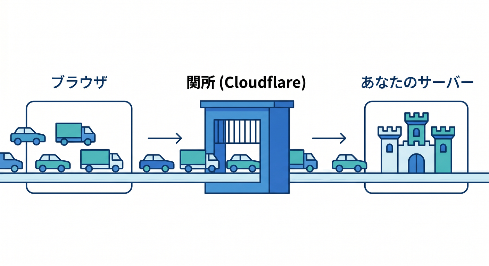
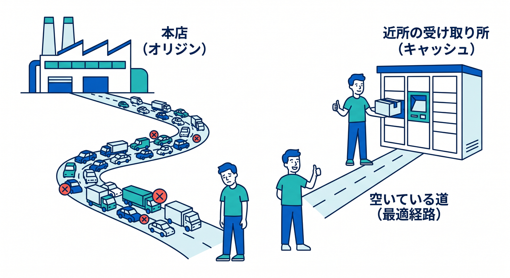
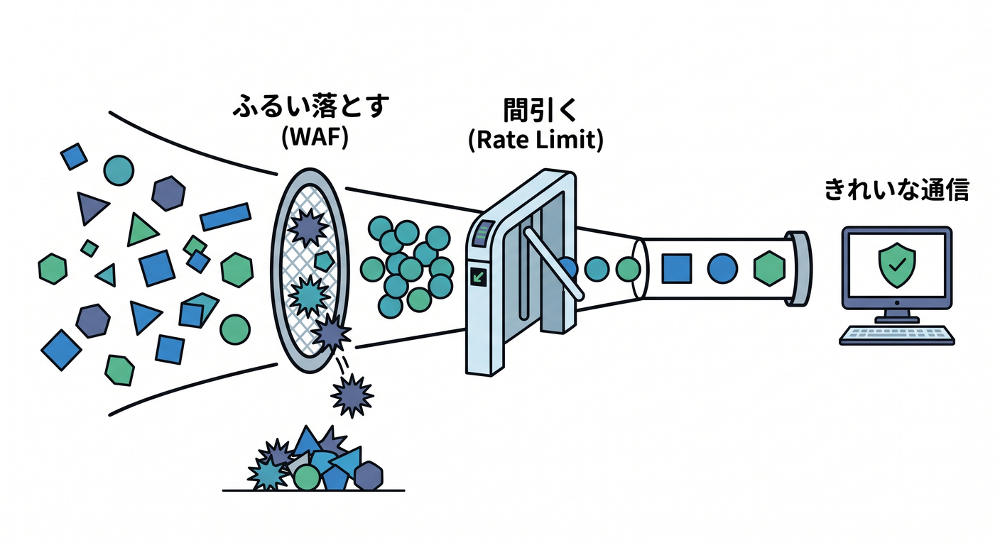
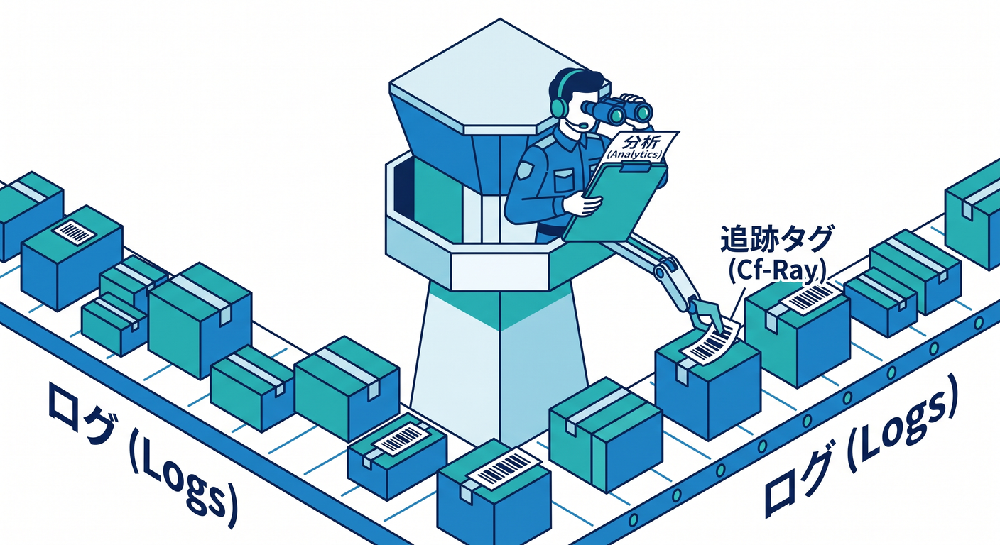
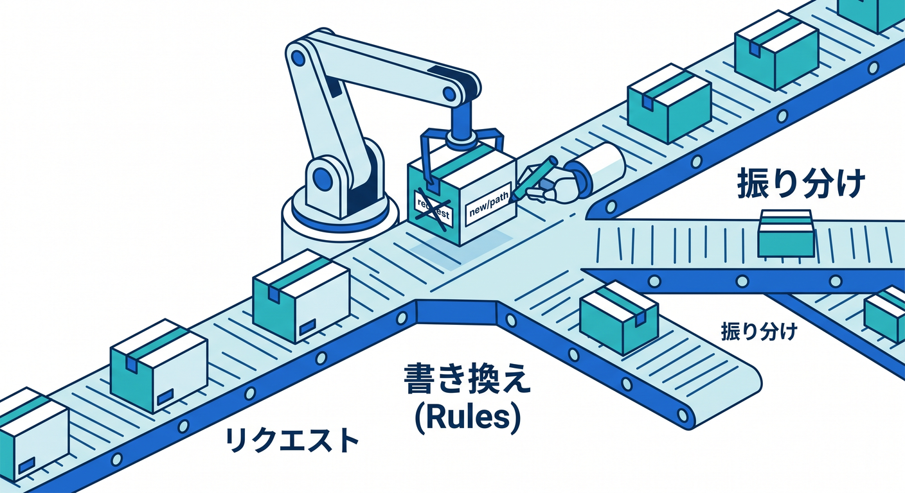
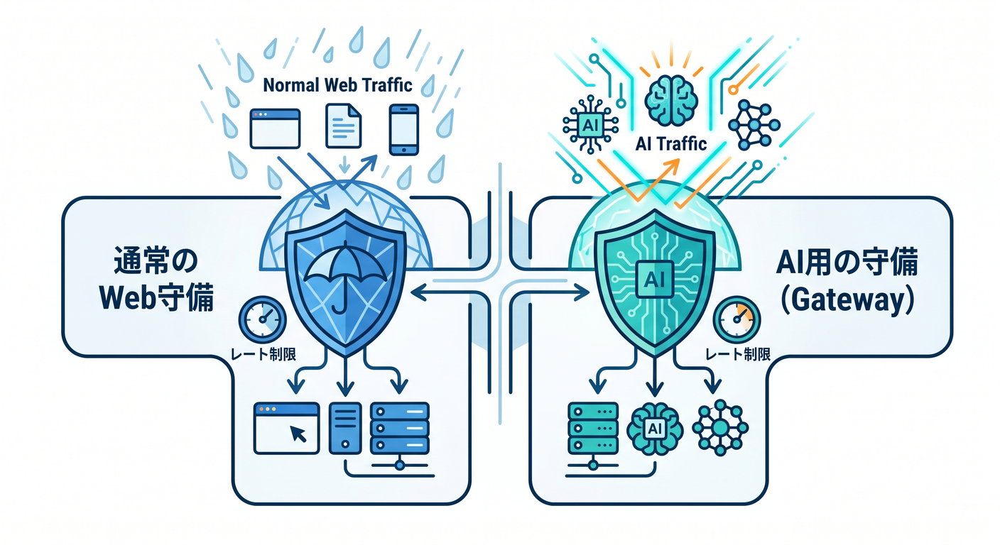

# 第11章：Cloudflareが“間に入る”と何がうれしいの？🛡️

この章では、Cloudflareを「DNSの会社」とだけ見るのをやめて、**サイトやアプリの前に立って交通整理してくれる存在**として見ていきます 😊
Cloudflare公式でも、CloudflareはDNSプロバイダであるだけでなく、**reverse proxy としてWebトラフィックを前で受ける**ことで、セキュリティ・性能・信頼性を高める仕組みとして説明されています。さらに2026年時点の公式ドキュメントでは、そこからWAF、Rate Limiting、Workers、AI Gateway、AI Searchまでが1本の線でつながる形になっています。 ([Cloudflare Docs][1])

## まずは超ざっくりイメージ 🌉

Cloudflareが「間に入る」というのは、**閲覧者がいきなりあなたのサーバーへ直接アクセスするのではなく、いったんCloudflareを通ってから目的地へ向かう**ということです。
Cloudflareのプロキシが有効なDNSレコードでは、利用者にはオリジンサーバーのIPではなくCloudflareのAnycast IPが返され、HTTP/HTTPS通信はCloudflare経由になります。逆にDNS onlyだと、実際のオリジンIPが返され、CloudflareのHTTP/HTTPS保護や分析を十分には使えません。 ([Cloudflare Docs][2])

ここ、かなり大事です ✨
**Cloudflareが前に立つからこそ、速くする・守る・観測する・途中で書き換える・AIの入口にする**がやりやすくなります。Cloudflare Rulesも、対象のDNSレコードが proxied で、トラフィックがCloudflareネットワークを通ることを前提に機能します。 ([Cloudflare Docs][3])

---

## 1. 何が変わるの？を1本の流れで見よう 🚶‍♂️➡️☁️➡️🖥️

Cloudflare公式の説明では、トラフィックがCloudflareに入ることを on-ramp、Cloudflareから先へ出ることを off-ramp と捉えています。CloudflareのグローバルネットワークとAnycastにより、リクエストはできるだけ近いCloudflare拠点で受けられ、必要に応じてキャッシュや最適な経路制御が使われます。つまり「ただの中継」ではなく、**途中に高機能な関所と高速道路が入る**感じです 🚦⚡ ([Cloudflare Docs][4])

イメージとしてはこんな感じです。

ブラウザ 🌍
↓
Cloudflare ☁️
↓
あなたのサーバー / Workers / AIサービス 🖥️🤖

この「真ん中」があるだけで、後ろ側のサーバーはむき出しになりにくく、前側の体験も改善しやすくなります。Cloudflare自身も reverse proxy の主な利点として、**攻撃耐性・キャッシュ・負荷分散・SSL/TLS処理**を挙げています。 ([Cloudflare Docs][1])

---

## 2. うれしいこと① 速くしやすい 🚀🍪

Cloudflareが前に立つと、まず分かりやすいのが**キャッシュ**です。
reverse proxy はレスポンスを一時保存できるので、同じようなリクエストが来たとき、毎回オリジンまで行かずに近くの拠点から返しやすくなります。Cloudflareの公式説明でも、たとえば遠い場所にあるオリジンのコンテンツを近いプロキシ拠点でキャッシュすることで、次の利用者へより速く返せると説明されています。 ([Cloudflare Docs][1])

さらにCloudflareは off-ramp 側の考え方として、**キャッシュでオリジンへ戻る回数を減らす**ことや、Argo Smart Routingで混雑を避けた効率的な経路を使うことも案内しています。つまり、速さは「サーバー性能だけ」で決まらず、**道の選び方と、途中で返せるかどうか**でも大きく変わります 😊 ([Cloudflare Docs][4])

初心者向けに言い換えると、

* 毎回本店まで取りに行かない 🍱
* 近所の受け取り所に置いておける 📦
* 混んでいる道を避けやすい 🛣️

という3つのうれしさがある、ということです。 ([Cloudflare Docs][1])

---

## 3. うれしいこと② 守りやすい 🛡️🔥

Cloudflareが間に入る最大の強みの1つは、**オリジンを直接さらしにくくできる**ことです。
Cloudflare公式は、reverse proxy を使うとオリジンサーバーのIPアドレスを公開せずに済むため、攻撃者がオリジンに直接狙いを定めにくくなると説明しています。DNS only では実IPが返るので、この守りが弱くなります。 ([Cloudflare Docs][1])

さらに、CloudflareのDDoS Protectionは、トラフィックのサンプルを out-of-path で解析し、レイテンシを増やさずに非同期で攻撃検知・緩和する仕組みとして説明されています。HTTPメタデータやレート、オリジンのエラー率などを見ながら、攻撃パターンに合わせたリアルタイムのシグネチャを作って対処する仕組みです。ここは「人が手で見張る」より、**Cloudflareの前段で自動的に受け止めてもらう**ほうが圧倒的に楽な場面です。 ([Cloudflare Docs][5])

その上で、CloudflareのWAFでは custom rules により、条件に一致したリクエストへ Block や Managed Challenge などのアクションを取れます。Rate limiting rules では、一定時間内の過剰アクセスに対して制限をかけられ、ログインへの総当たりやAPIの乱用対策に使えます。 ([Cloudflare Docs][6])

つまり守りの層をやさしく言うと、

* **まず前段で受ける** ☁️
* **怪しいものをふるい落とす** 🧹
* **多すぎるアクセスを間引く** 🚧
* **本当に必要な通信だけ後ろへ流す** ✅

という形です。 ([Cloudflare Docs][1])

---

## 4. うれしいこと③ HTTPSまわりを整理しやすい 🔐✨

Cloudflareが間に入ると、SSL/TLSも理解しやすくなります。
Cloudflareの暗号化モードは、**利用者↔Cloudflare** と **Cloudflare↔オリジン** の2本の接続を分けて考える設計です。公式は可能なら Full か Full (strict) を強く推奨しており、Full (strict) ではオリジン証明書の検証も行います。 ([Cloudflare Docs][7])

ここでの学びポイントは、「HTTPSにした」で終わりではないことです。
Cloudflareが前に立つと、ブラウザ側の暗号化だけでなく、**Cloudflareからオリジンへ向かう区間の安全性も整理しやすい**のが大きいです。reverse proxy の利点として、SSL/TLS の暗号化・復号を前段で扱うことでオリジンの負荷軽減にもつながる、とCloudflareは説明しています。 ([Cloudflare Docs][1])

---

## 5. うれしいこと④ 見える化しやすい 👀📊

Cloudflareが間に入ると、「今どんな通信が来ているか」を観測しやすくなります。
Cloudflare Analytics では、アカウントやゾーンのトラフィック詳細、ネットワーク層の可視化、GraphQL Analytics API などが提供されています。Workers側でも、メトリクス・ログ・トレースが用意されていて、2026年時点のDocsでは Workers Logs は新規Workerで observability がデフォルト有効と案内されています。 ([Cloudflare Docs][8])

また、Cloudflareはオリジンへ `CF-Connecting-IP` や `Cf-Ray` などのヘッダーを渡せます。`Cf-Ray` をオリジンログに入れておくと、Cloudflare側で見えているリクエストとオリジン側のログを突き合わせやすくなります。こういう「前段で受けて、後段のログと結びつけられる」点も、Cloudflareが真ん中にいる価値です 🔎 ([Cloudflare Docs][9])

初心者目線でいうと、
**守るだけじゃなく、状況を見やすくなる**のもかなり大きいです。
運用では「止める」だけでなく「なぜ遅いのか」「どこで失敗しているのか」を見つける力が大事だからです。 ([Cloudflare Docs][8])

---

## 6. 「Cloudflareが間に入る」と、あとでWorkersやRulesが自然につながる ⚙️🌈

Cloudflare Rules は、リダイレクト、URL書き換え、送信先の調整、設定の上書きなどを、**Cloudflareネットワーク上でリクエストごとに変えられる**仕組みです。しかも Rules 機能は proxied なトラフィック、つまりCloudflareを通る通信であることが前提です。 ([Cloudflare Docs][3])

ここで「あ、前段にいるから途中でいじれるんだ」と分かると、Workersも理解しやすくなります。
Cloudflare Vite plugin は、Vite と Workers runtime を統合し、ローカル開発時も production に近い `workerd` 上で動かせると案内されています。つまり後の実装章では、TypeScriptで書いた処理を「サーバーの奥」で動かすというより、**Cloudflareの通り道の中で賢く動かす**感覚が自然になります。 ([Cloudflare Docs][10])

---

## 7. AI時代だと、この「真ん中」がさらに強い 🤖☁️💡

2026年のCloudflare Docsを見ると、AI系も「Cloudflareが前に立つ」発想と相性がかなり良いです。
Workers AI はCloudflareのグローバルネットワーク上でモデルを実行でき、AI Gateway は**キャッシュ・レート制限・リトライ・フォールバック**などでAIアプリを観測・制御できます。AI Search は Workers binding や similarity caching を備え、Vectorize や R2 と組み合わせた検索基盤として整理されています。 ([Cloudflare Docs][11])

ここでのポイントは、AIだけ別世界ではないことです 😊
普通のWeb通信でうれしかった

* 間に入って守る 🛡️
* 間に入って速くする 🚀
* 間に入って見える化する 👀

この考え方が、そのままAI APIや検索にも伸びています。
たとえばAI Gatewayの rate limiting は、通常APIの乱用対策と同じ発想で使えますし、キャッシュやフォールバックはAIアプリの安定性アップに直結します。 ([Cloudflare Docs][12])

---

## 8. GitHub Copilot・VS Codeとの相性もかなり良いです 🧠🛠️✨

学習や実装の補助としても、今のCloudflareはかなりAIフレンドリーです。
Cloudflare Docs 自体が `index.md` や `llms.txt` / `llms-full.txt` でMarkdown供給を整えていて、さらにDocumentation MCP Serverも用意しています。CloudflareのStyle Guideでは、VSCode向けのMCP導線や、GitHub Copilot を含むAIツール向けセットアップにも触れています。 ([Cloudflare Docs][13])

GitHub Copilot側でも、公式Docsで `.github/copilot-instructions.md` を使ったリポジトリ全体のカスタム指示、さらにパス別の instructions を案内しています。Cloudflare学習や開発では、たとえば「WorkersではNodeのサーバー常駐前提で書かない」「Cloudflare Docsを優先参照」「TypeScriptで書く」などを instructions に入れておくと、補助AIの精度をかなり上げやすいです。 ([GitHub Docs][14])

VS Codeまわりでも、Cloudflare Workersのデバッグ導線は公式Docsで案内されています。つまり、これから先の章で実装に入ったときも、**VS Code + Copilot + Cloudflare Docs/MCP + Workers runtime** がかなり自然な組み合わせになります。 ([Cloudflare Docs][15])

---

## 9. 初心者がハマりやすい勘違い 😵‍💫➡️😌

**勘違いその1：Cloudflareを使えば何でも自動で全部速くなる**
実際は、proxied にしてはじめて効く機能が多く、どこをキャッシュするか、どこをオリジンへ通すかの設計も大事です。DNS only ではHTTP/HTTPS分析も限定されます。 ([Cloudflare Docs][2])

**勘違いその2：HTTPSにしたら全部同じ**
Cloudflareは visitor↔Cloudflare と Cloudflare↔origin の2区間を分けて扱います。Full / Full (strict) の考え方を知らないと、「表だけHTTPS」で安心した気になりやすいです。 ([Cloudflare Docs][7])

**勘違いその3：セキュリティ機能はあとで足せばいい**
Cloudflareは前段にいるからこそ、WAF・Rate Limiting・Challenge・Turnstileを入口で使いやすいのが強みです。特にTurnstileはCloudflare CDN必須ではなく、どのサイトにも組み込みやすい CAPTCHA 代替として案内されています。 ([Cloudflare Docs][6])

---

## 10. ミニ演習 📝🎯

次の3つを、自分の言葉で言えたらこの章はかなりOKです ✨

1. **DNS only と Proxied の違いは？**
2. **Cloudflareが前に立つと、なぜ守りやすくなる？**
3. **AI Gateway が「AI版の前段レイヤー」と言えるのはなぜ？**

答えのヒントはこうです。

* Proxied だとCloudflareのAnycast IPが返り、HTTP/HTTPSがCloudflare経由になる ☁️
* 前段で攻撃対策、レート制限、キャッシュ、分析ができる 🛡️📊
* AI Gateway も、AI通信の前でキャッシュ・レート制限・リトライ・フォールバックを扱える 🤖 ([Cloudflare Docs][2])

---

## この章のまとめ 🌟

Cloudflareが“間に入る”うれしさは、ひとことで言うと

**「通り道を自分で賢くできる」**

これです 😊

ただ名前を引くのではなく、Cloudflareが前段に立つことで、

* 近い場所から返しやすい 🚀
* オリジンを隠して守りやすい 🛡️
* 途中でルールをかけられる ⚙️
* ログや分析で見える化しやすい 👀
* AI通信まで同じ発想で制御しやすい 🤖

という価値が生まれます。これはCloudflare公式Docsでも、reverse proxy、Rules、WAF、DDoS Protection、Workers、AI Gateway、AI Searchまで一貫した構造として示されています。 ([Cloudflare Docs][1])

次の章では、この理解を土台にして、**「じゃあ実際にCloudflare上でコードが動くってどういうこと？」**へ入ると、かなりスムーズです ⚡

[1]: https://developers.cloudflare.com/fundamentals/concepts/how-cloudflare-works/ "How Cloudflare DNS works · Cloudflare Fundamentals docs"
[2]: https://developers.cloudflare.com/dns/proxy-status/ "Proxy status · Cloudflare DNS docs"
[3]: https://developers.cloudflare.com/rules/ "Overview · Cloudflare Rules docs"
[4]: https://developers.cloudflare.com/fundamentals/concepts/traffic-flow-cloudflare/ "Traffic flow through Cloudflare · Cloudflare Fundamentals docs"
[5]: https://developers.cloudflare.com/ddos-protection/about/how-ddos-protection-works/ "How DDoS protection works · Cloudflare DDoS Protection docs"
[6]: https://developers.cloudflare.com/waf/custom-rules/ "Custom rules · Cloudflare Web Application Firewall (WAF) docs"
[7]: https://developers.cloudflare.com/ssl/origin-configuration/ssl-modes/?utm_source=chatgpt.com "Encryption modes - SSL/TLS"
[8]: https://developers.cloudflare.com/analytics/ "Analytics · Cloudflare Analytics docs"
[9]: https://developers.cloudflare.com/fundamentals/reference/http-headers/ "Cloudflare HTTP headers · Cloudflare Fundamentals docs"
[10]: https://developers.cloudflare.com/workers/vite-plugin/ "Vite plugin · Cloudflare Workers docs"
[11]: https://developers.cloudflare.com/workers-ai/ "Overview · Cloudflare Workers AI docs"
[12]: https://developers.cloudflare.com/ai-gateway/ "Overview · Cloudflare AI Gateway docs"
[13]: https://developers.cloudflare.com/style-guide/ai-tooling/ "AI tooling · Cloudflare Style Guide"
[14]: https://docs.github.com/copilot/customizing-copilot/adding-custom-instructions-for-github-copilot "Adding repository custom instructions for GitHub Copilot - GitHub Docs"
[15]: https://developers.cloudflare.com/workers/testing/miniflare/developing/debugger/ "Attaching a Debugger · Cloudflare Workers docs"
