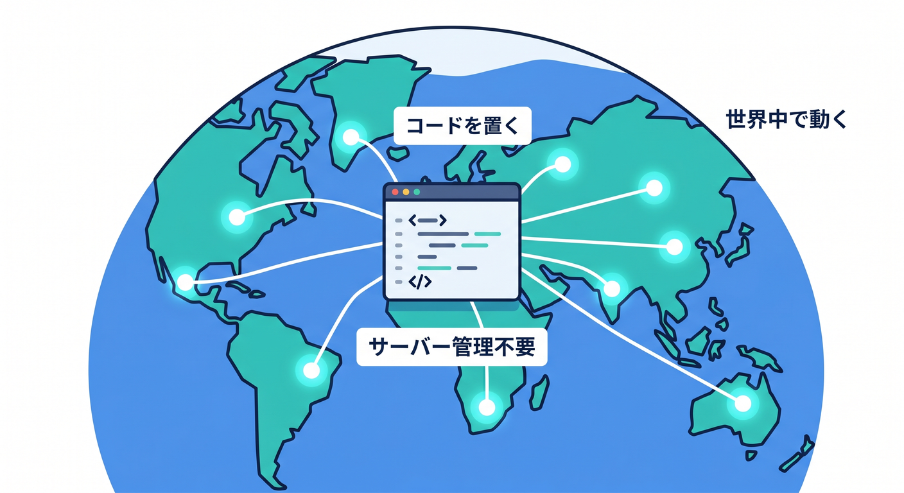
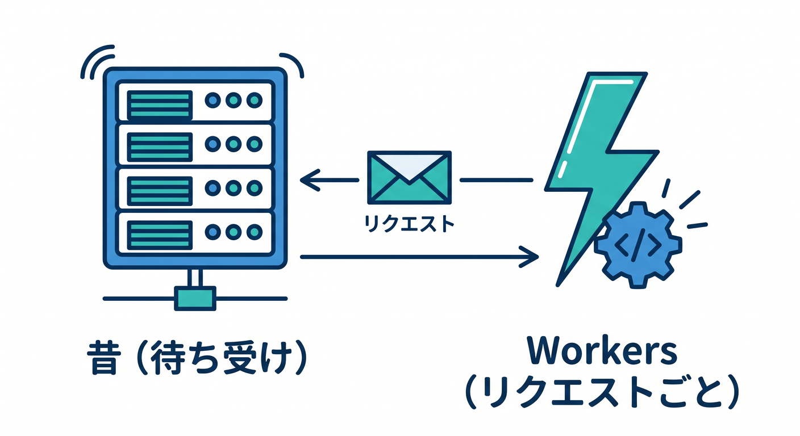
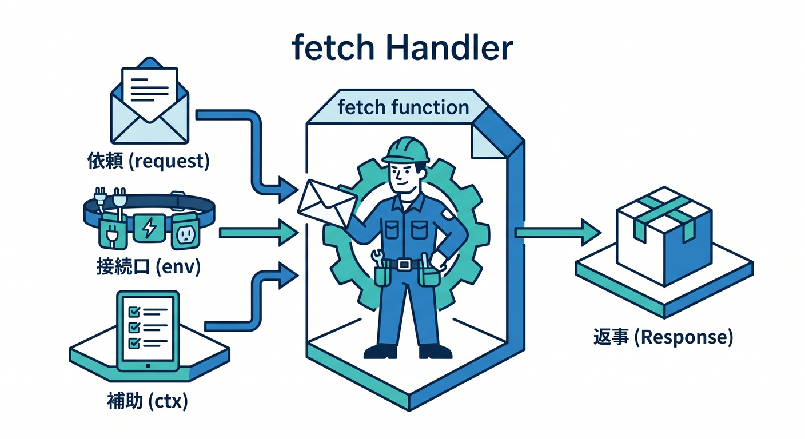
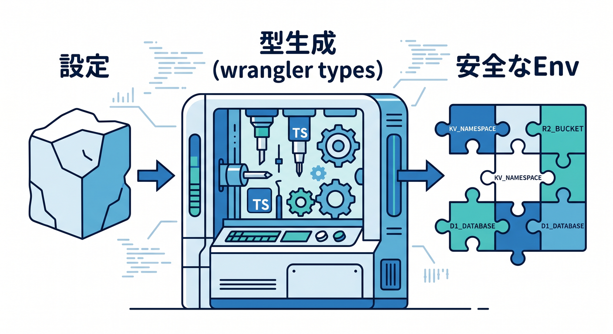
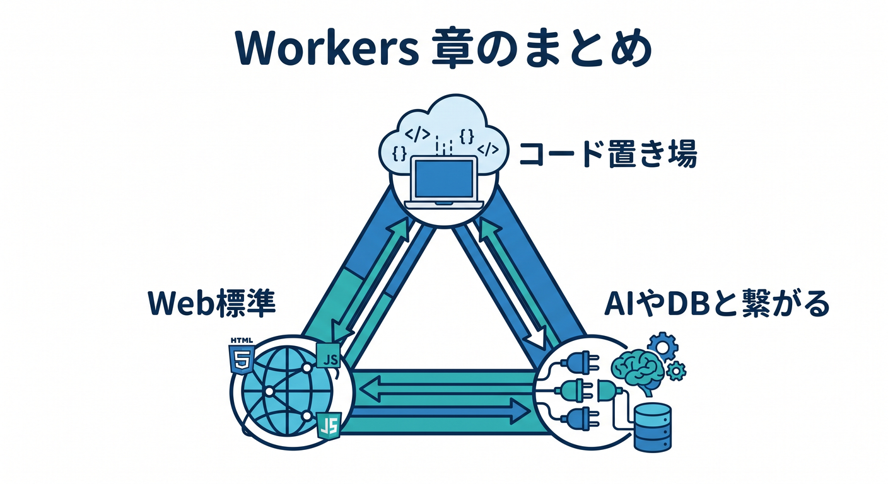

# 第12章：ここで初めてWorkersを見る ⚙️✨

ここまでで、DNS 📚、HTTPS 🔒、Edge 🌐、CDN 🍪 まで見てきました。
この章ではついに、「じゃあ Cloudflare の上でコードが動くってどういうことなの？」をやさしく見ます 👀✨

Cloudflare Workers は、Cloudflare のグローバルネットワーク上でアプリを作成・デプロイ・拡張できるサーバーレス実行基盤です。公式には、単一コマンドで構築・配備・スケールでき、複雑なインフラ管理を強く意識しなくてよい形として案内されています。また、React などのフレームワークや TypeScript を含む複数言語にも対応しています。 ([Cloudflare Docs][1])

この章のゴールはシンプルです 🎯
「Workers は“Cloudflareの中で動くコード置き場”なんだな」と体感し、`fetch` ハンドラ、`wrangler dev`、`wrangler deploy`、`env`、Bindings、そして AI との接続イメージまで、最初の一歩を踏み出せるようになることです。 ([Cloudflare Docs][2])

---

## 1. Workersって、ひとことで言うと何？ ☁️⚡



いちばんやさしく言うと、**「Cloudflare のネットワーク上で、リクエストを受けて処理を返す小さなアプリを動かす仕組み」**です。
たとえば次のようなことができます ✨

* JSON を返す API を作る
* リクエストを見て分岐する
* 認証前の軽いチェックをする
* 静的サイトに API を足す
* AI モデルを呼ぶ入口を作る

Cloudflare 公式でも、Workers は「高速で高信頼」「フルスタックアプリも構築可能」「TypeScript などの好みの言語を使える」「Observability を備える」実行基盤として整理されています。 ([Cloudflare Docs][1])

---

## 2. ふつうの Node サーバーと何が違うの？ 🤔

ここは超大事です 🚨
Workers は **“Node.js サーバーそのもの”** ではありません。考え方としては、ずっと常駐する自前サーバーを運用するより、**HTTP リクエストに対して処理を書く Web 標準寄りの実行環境**に近いです。Workers Runtime は V8 ベースで、Web 互換を重視して設計されており、Fetch API などの Web 標準 API を中心に使います。 ([Cloudflare Docs][3])

ただし、今の Workers は Node 系ともかなり仲良くなっています 😊
`nodejs_compat` を有効にすると、`node:crypto`、`node:buffer`、`node:stream` などの Node.js built-in modules にアクセスしやすくなり、多くの npm パッケージを持ち込みやすくなります。Cloudflare の Best Practices でも、互換日付を新しく保ちつつ `nodejs_compat` を有効にする方針が案内されています。 ([Cloudflare Docs][4])

つまり感覚としてはこうです 💡

* **昔のイメージ**：Node サーバーを立てて待ち受ける 🖥️
* **Workers のイメージ**：Cloudflare 側に処理を置いて、リクエストごとに反応する 🌍⚡



この違いが見えると、Workers を「変わったサーバー」ではなく、「Web と Cloudflare の流れの中で自然に動く処理」として理解しやすくなります。 ([Cloudflare Docs][1])

---

## 3. まずは最小の Hello Worker を作ろう 👋

いまの公式導線では、最初の作成は `create-cloudflare` CLI（C3）から入るのが自然です。Workers AI の最新ガイドでも、C3 で新規プロジェクトを作り、`Hello World example`、`Worker only`、`TypeScript` を選ぶ流れが示されています。 ([Cloudflare Docs][5])

Windows のターミナルで、まずはこんな感じで始めれば OK です ✨

```bash
npm create cloudflare@latest -- hello-worker
cd hello-worker
npx wrangler dev
```

`wrangler dev` を実行するとローカル開発サーバーが立ち上がり、初回は Cloudflare アカウントへのログインがブラウザで案内されます。公式の Get started では、ローカル確認先として `http://localhost:8787` が案内されています。 ([Cloudflare Docs][2])

---

## 4. Worker のコードはどんな形なの？ 🧩

最初の Worker は、まずこれくらいで十分です 😊

```ts
export default {
  async fetch(request: Request): Promise<Response> {
    return new Response("Hello Worker! 👋");
  },
};
```

ここで大事なのは 3 つです ✨

1. `export default` で Worker の入口を定義する
2. `fetch()` が HTTP リクエストを受け取る
3. `Response` を返す

Cloudflare 公式の Get started でも、Worker は default export のオブジェクトを持ち、その `fetch` ハンドラが HTTP リクエスト時に呼ばれ、`Response` か `Response` を返す Promise を返す形として説明されています。また、`fetch` には `request`、`env`、`ctx` の 3 引数が渡されます。 ([Cloudflare Docs][2])

最初はこう覚えるとラクです 🧠✨

* `request` = ブラウザやクライアントから来た依頼 📩
* `env` = KV や D1 や AI などの接続口 🔌
* `ctx` = 非同期タスクや実行文脈の補助 🛠️



---

## 5. `wrangler.jsonc` は“設定の中心”だよ 🗂️

Workers 開発では、`wrangler.jsonc` がかなり大事です。Cloudflare は新規プロジェクトで `wrangler.jsonc` の利用を推奨していて、さらに Worker 設定の **source of truth** として扱うことを勧めています。つまり、「設定の本体はダッシュボードよりコード側」と考えると整理しやすいです。 ([Cloudflare Docs][6])

最初のイメージはこんな感じです 👇

```json
{
  "$schema": "./node_modules/wrangler/config-schema.json",
  "name": "hello-worker",
  "main": "src/index.ts",
  "compatibility_date": "2026-04-14",
  "compatibility_flags": ["nodejs_compat"]
}
```

ここで覚えたいポイントは 2 つです ✨

* `compatibility_date` は、その日時点までの互換ルールを使うための指定
* `nodejs_compat` は Node 系の built-in module 互換を広げるための旗


Cloudflare は、新しく始めるときは `compatibility_date` を現在日にしておくことを推奨しています。また Best Practices では、互換日付を新しく保ちつつ `nodejs_compat` を有効にして、npm パッケージ利用時の import エラーを減らすことも勧めています。 ([Cloudflare Docs][7])

---

## 6. TypeScript はかなり相性がいいです 💙

Cloudflare Workers では TypeScript がかなり扱いやすいです。公式でも TypeScript は first-class language とされていて、Workers API は fully typed、型定義は open-source runtime の `workerd` から直接生成されます。 ([Cloudflare Docs][8])

特に覚えておきたいのが `wrangler types` です ✨

```bash
npx wrangler types
```

このコマンドは、Bindings の `Env` 型や runtime 型を、あなたの Worker 設定に合わせて生成してくれます。Cloudflare の Best Practices でも、**`Env` を手書きせず、`wrangler types` で生成すること**が推奨されています。Bindings を追加・変更したら再実行するのが基本です。 ([Cloudflare Docs][9])

つまり、TypeScript で Workers を触るときは、

* まず動かす
* Binding を足す
* `wrangler types` を回す
* `env` の型付き補完で気持ちよく書く



この流れがすごく自然です 😌✨

---

## 7. ローカル開発は“思ったより本番に近い” 🔬

ここも初心者にうれしいところです 🎉
Cloudflare の Development & testing では、ローカル開発は Miniflare によって支えられていて、**本番と同じ runtime である `workerd` を使って Worker をローカル実行できる**と説明されています。しかも、Bindings はデフォルトではローカルにシミュレートされ、必要なら remote bindings で実リソースへ接続する形にもできます。 ([Cloudflare Docs][10])

さらに、`wrangler dev` や Vite + Cloudflare Vite plugin で動かしていると、Cloudflare 実装の Chrome DevTools が使えます。Wrangler ならターミナルで `D` キーを押すと DevTools を開けます。ログ確認、ブレークポイント、CPU プロファイル、メモリ確認までできます。 ([Cloudflare Docs][11])

VS Code でのデバッグも可能です。Cloudflare docs では、`.vscode/launch.json` を作ってポート `9229` に attach する形の設定例が案内されています。つまり、「Workers はブラックボックスでデバッグ不能」というイメージはかなり古いです 😊 ([Cloudflare Docs][12])

---

## 8. Workers は API 専用ではなく、React 側ともつながる 🌈

Workers を「API だけの箱」と思うと、ちょっともったいないです。
Cloudflare の Static Assets / Vite plugin の公式資料では、Workers は静的アセットと Worker コードを**ひとまとまりで配備**でき、SPA、静的サイト、フルスタックアプリにもつなげられる形で説明されています。Cloudflare Vite plugin は Vite と Workers runtime をしっかり統合し、HMR を活かしながら開発できるのも強みです。 ([Cloudflare Docs][13])

公式の React SPA with API チュートリアルでも、React 側と API Worker 側を一緒に開発し、`npm run dev`、`npm run build`、`npm run preview`、`npm exec wrangler deploy` の流れで進められます。プレビューも Workers runtime で本番に近い形で確認できます。 ([Cloudflare Docs][14])

なので第12章の段階では、**「Workers = APIの入口」でもあり、「フロントを含むアプリの一部」でもある**くらいに捉えておけば十分です 👍✨

---

## 9. AI とつなぐと、Workers の意味が一気に見えてくる 🤖✨

Cloudflare の AI サービスをこの章で少しだけ混ぜると、Workers の役割がかなりわかりやすくなります。
Workers AI の公式ガイドでは、Worker に AI binding を設定すると、コード上で `env.AI` からモデル実行ができる形になっています。 ([Cloudflare Docs][5])

たとえば設定はこんなイメージです 👇

```json
{
  "ai": {
    "binding": "AI"
  }
}
```

すると Worker 側でこんな感じのコードが書けます ✨

```ts
export default {
  async fetch(request: Request, env: Env): Promise<Response> {
    const result = await env.AI.run("@cf/meta/llama-3.1-8b-instruct", {
      prompt: "Cloudflare Workers を一言で説明して",
    });

    return Response.json(result);
  },
};
```

Cloudflare docs では、`env.AI.run()` がモデル名と入力オブジェクトを受け取り、推論を実行する形で説明されています。さらに AI Gateway を組み合わせると、Workers AI へのリクエストに対して analytics、caching、security を載せやすくなります。つまり Workers は、**AI アプリの“入口”や“制御ポイント”としてすごく相性がいい**わけです。 ([Cloudflare Docs][15])

---

## 10. GitHub Copilot と一緒に学ぶときのコツ 🤝🧠

今どきの学び方として、Copilot を遠慮なく使って大丈夫です 😊
GitHub 公式では、Copilot の **agent mode** は、具体的なタスクに対してファイル変更やターミナルコマンド提案まで進める用途に向いていると説明されています。また、リポジトリ custom instructions を使うと、プロジェクトの理解方法やビルド・テスト・検証ルールを Copilot に伝えられます。 ([GitHub Docs][16])

Cloudflare 側もかなり AI フレンドリーです。Workers の Prompting ドキュメントでは、VS Code を含む各種エディタ／エージェントから prompt ベースで Workers アプリを作れること、さらに docs 用 MCP サーバーや observability 用 MCP サーバーを agent に接続できることが案内されています。 ([Cloudflare Docs][17])

この章での Copilot への頼み方は、たとえばこんな感じが使いやすいです 💬

* 「TypeScript の Cloudflare Worker を最小構成で作って」
* 「`fetch(request, env, ctx)` の3引数を初心者向けに解説して」
* 「`wrangler.jsonc` に AI binding を追加して」


* 「この Worker を JSON API に変えて」

この使い方だと、**調べ物 → 生成 → 修正 → 理解** の往復が速くなります 🚀

---

## 11. この章でやってほしいミニ演習 🧪✨

### 演習1：Hello Worker を返す

まずは `"Hello Worker! 👋"` を返すだけの Worker を動かしましょう。
これで「Cloudflare 上でコードが動く」という感覚がつかめます。 ([Cloudflare Docs][2])

### 演習2：文字列ではなく JSON を返す

次に `Response.json({ message: "ok" })` のようにして、API っぽい返し方に変えてみましょう。
Workers は HTTP の入口としてすごく自然に使えると感じられるはずです。 ([Cloudflare Docs][2])

### 演習3：`env` を意識する

今はまだ本物の KV や D1 をつながなくて大丈夫です。
「この `env` に、あとで AI やデータベースやストレージがぶら下がるんだな」とイメージできれば勝ちです。Bindings は Worker が Cloudflare の各種リソースとつながる窓口として整理されています。 ([Cloudflare Docs][10])

### 演習4：AI の入口を想像する

まだ本実装しなくてもいいので、`env.AI.run()` のコード例を眺めて、「この Worker が AI への入口になるのか」と理解してみましょう。Workers AI binding はまさにそのためにあります。 ([Cloudflare Docs][5])

---

## 12. ありがちな勘違いを先に直しておこう 🙈

**勘違い1：Workers は VPS みたいなもの**
ちょっと違います。Workers は Cloudflare のグローバルネットワーク上で動くサーバーレス実行基盤です。自前で OS や常駐プロセスを面倒見る発想ではありません。 ([Cloudflare Docs][1])

**勘違い2：Node.js とまったく同じ**
これも違います。Workers は Web 標準寄りの runtime で、Node 互換は `nodejs_compat` を通して広がっています。Node の一部 API はネイティブ対応、一部は polyfill、一部は未実装です。 ([Cloudflare Docs][4])

**勘違い3：`Env` 型は手で書けばいい**
今は手書きより `wrangler types` が基本です。設定とコードのズレを減らせるので、後でかなり楽になります。 ([Cloudflare Docs][18])

**勘違い4：ローカル確認は本番と全然違う**
Workers はここがかなり強いです。Miniflare と `workerd` によって、本番に近い runtime でローカル開発できます。DevTools も使えます。 ([Cloudflare Docs][10])

---

## まとめ 🌟

この章で覚えてほしいことは、ほんとうにこの3つです ✨

* **Workers は Cloudflare 上で動くコードの置き場**
* **書き味は Web 標準寄りで、TypeScript と相性がいい**
* **AI や KV や D1 などを `env` 経由でつないでいける**



そして今の Cloudflare 開発は、Workers 本体だけでなく、Vite、Wrangler、TypeScript、Copilot、MCP、Workers AI まで自然につながっています。だから Workers は「単なる小さな API 実行環境」ではなく、**Cloudflare の世界に入るための中心ピース**なんです 🧩☁️✨ ([Cloudflare Docs][13])

次の章では、この Workers を **VS Code・Wrangler・Vite・Copilot とどう気持ちよく開発していくか** に進むと、学習の流れがとてもきれいです 😊

必要なら次に、そのまま続けて
**「第12章の末尾に置く確認問題10問＋模範解答」** も作れます。

[1]: https://developers.cloudflare.com/workers/ "Overview · Cloudflare Workers docs"
[2]: https://developers.cloudflare.com/workers/get-started/guide/ "Get started - CLI · Cloudflare Workers docs"
[3]: https://developers.cloudflare.com/workers/runtime-apis/?utm_source=chatgpt.com "Runtime APIs - Workers"
[4]: https://developers.cloudflare.com/workers/runtime-apis/nodejs/ "Node.js compatibility · Cloudflare Workers docs"
[5]: https://developers.cloudflare.com/workers-ai/get-started/workers-wrangler/ "Get started - Workers and Wrangler · Cloudflare Workers AI docs"
[6]: https://developers.cloudflare.com/workers/wrangler/configuration/ "Configuration - Wrangler · Cloudflare Workers docs"
[7]: https://developers.cloudflare.com/workers/configuration/compatibility-dates/ "Compatibility dates · Cloudflare Workers docs"
[8]: https://developers.cloudflare.com/workers/languages/typescript/ "Write Cloudflare Workers in TypeScript · Cloudflare Workers docs"
[9]: https://developers.cloudflare.com/workers/wrangler/commands/general/ "General commands · Cloudflare Workers docs"
[10]: https://developers.cloudflare.com/workers/development-testing/ "Development & testing · Cloudflare Workers docs"
[11]: https://developers.cloudflare.com/workers/observability/dev-tools/ "DevTools · Cloudflare Workers docs"
[12]: https://developers.cloudflare.com/workers/testing/miniflare/developing/debugger/ "Attaching a Debugger · Cloudflare Workers docs"
[13]: https://developers.cloudflare.com/workers/vite-plugin/ "Vite plugin · Cloudflare Workers docs"
[14]: https://developers.cloudflare.com/workers/vite-plugin/tutorial/ "Tutorial - React SPA with an API · Cloudflare Workers docs"
[15]: https://developers.cloudflare.com/workers-ai/configuration/bindings/?utm_source=chatgpt.com "Workers Bindings · Cloudflare Workers AI docs"
[16]: https://docs.github.com/en/copilot/get-started/features "GitHub Copilot features - GitHub Docs"
[17]: https://developers.cloudflare.com/workers/get-started/prompting/ "Prompting · Cloudflare Workers docs"
[18]: https://developers.cloudflare.com/workers/best-practices/workers-best-practices/ "Workers Best Practices · Cloudflare Workers docs"
