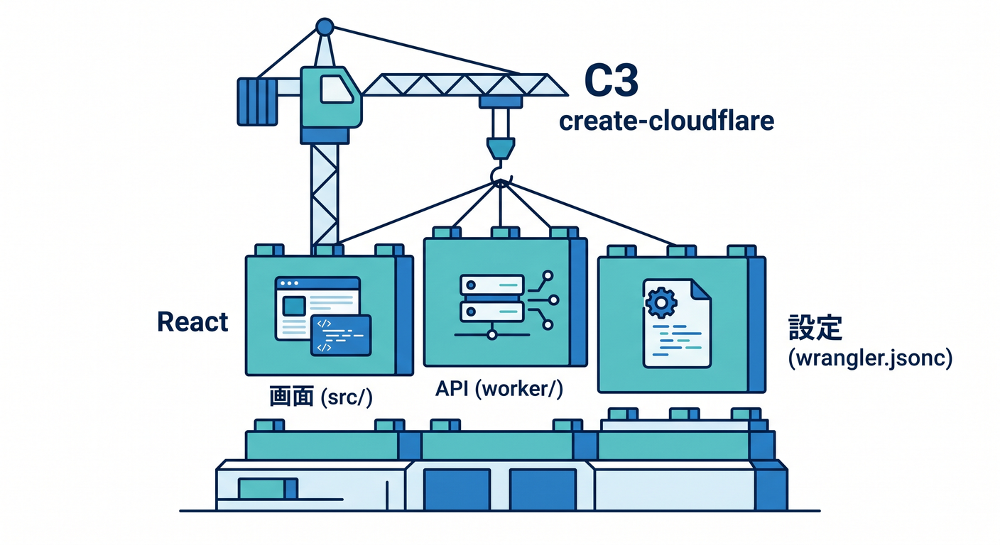
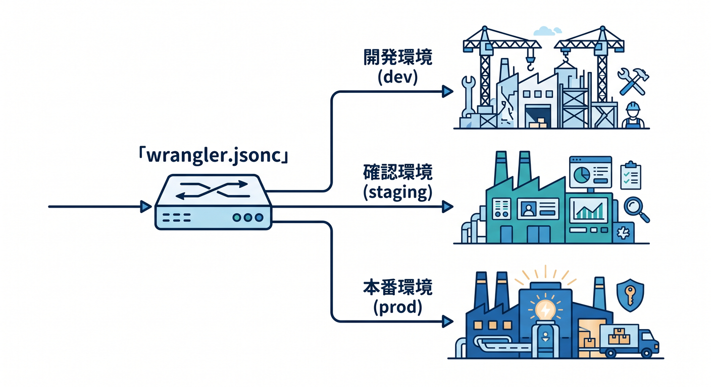
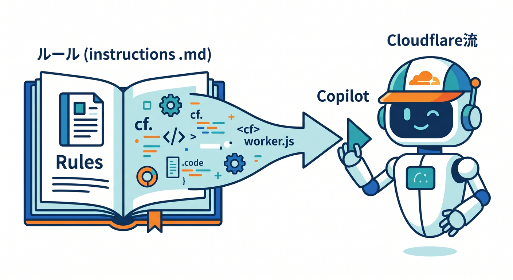
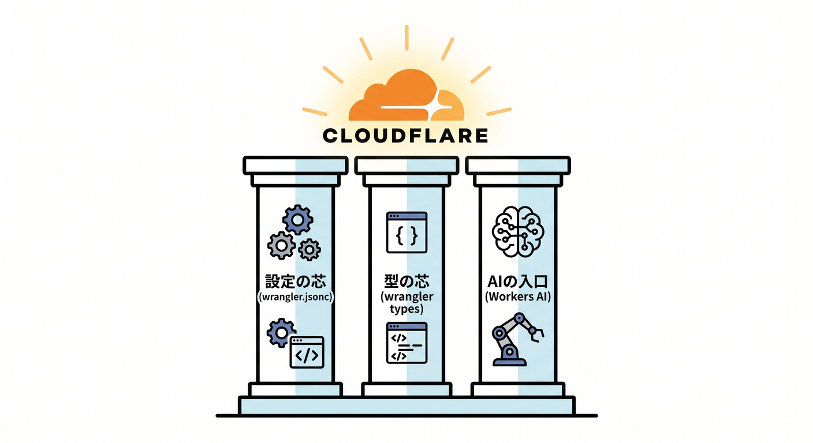

# 第13章：開発の入口はどう変わったの？ VS Code・Vite・Wrangler・Copilot 🛠️🤖

この章では、いまのCloudflare開発の「入り口」をやさしく整理します ✨
ひと昔前みたいに、CLIの呪文をたくさん暗記してから始める感じではありません。2026年4月14日時点の公式導線を見ると、**C3で土台を作る → Vite pluginでローカル開発する → `wrangler.jsonc` で設定を読む → Copilotにプロジェクトのルールを教える → 必要ならWorkers AIやAI Gatewayも最初から組み込む**、という流れがかなり自然です。Cloudflare公式は新規プロジェクトで `wrangler.jsonc` を推奨しており、Wrangler 4.68.0以降では既存フレームワークの自動検出も案内しています。 ([Cloudflare Docs][1])

## この章でつかみたいこと 🎯

* VS Code・Vite・Wrangler・Copilot の役割分担が見える
* 「まず何を触ればいいか」がわかる
* TypeScriptでCloudflareらしい開発の形が見える
* AI機能を後付けではなく、最初から開発導線に入れる感覚がつかめる

---

## 1. いまのCloudflare開発は「道具のチーム戦」になっているよ 🧩

いまの入口をひとことで言うと、**エディタ1本で全部やる**というより、**役割の違う道具をうまくつなぐ**感じです 😊
Cloudflare公式の新規導線では C3（`create-cloudflare`）でプロジェクトを作り、React なら React + Vite 構成をすぐ立ち上げられます。Vite plugin は Workers ランタイムに直接つながる形で動き、Wrangler は開発・設定・デプロイの中心になります。さらに Copilot は `.github/copilot-instructions.md` などの指示ファイルを読ませることで、プロジェクト流儀に寄せた支援がしやすくなっています。 ([Cloudflare Docs][2])

---

## 2. 4つの道具を、まずはこう覚えよう 🗺️


**VS Code** は作業机です 💻
編集、ターミナル、デバッグ、Copilotチャットをまとめて扱えます。VS Code公式は、Copilotのカスタム指示、カスタムエージェント、MCPサーバーなどでAIをワークフローに合わせて調整できる流れを案内しています。 ([Visual Studio Code][3])

**Vite** は「気持ちよく開発する担当」です ⚡
Cloudflare Vite plugin は、Vite と Workers runtime を強く結びつける仕組みで、ローカルでも本番に近い `workerd` 上で動かしやすく、HMR も使えます。しかもデフォルトではほぼ設定不要です。 ([Cloudflare Docs][4])

**Wrangler** は「Cloudflare向けの司令塔」です 🧭
設定ファイルを読み、`dev`・`deploy`・各種リソース操作をまとめて担当します。新規では `wrangler.jsonc` が推奨され、環境別設定やバインディング管理もここが中心です。 ([Cloudflare Docs][1])

**GitHub Copilot** は「コードを書くAI」よりも、「このプロジェクト流に合わせるAI」として使うと強いです 🤖
GitHub Docs では `.github/copilot-instructions.md` に自然言語のルールを書けること、さらに `.github/instructions` 以下でパス別の指示も作れることが案内されています。VS Code 側では `/init` でワークスペースを分析して指示ファイルを作る導線もあります。 ([GitHub Docs][5])

---

## 3. まずは新規プロジェクトを1個作るのが最短ルート 🚀

React中心で始めるなら、いまはこれがかなり素直です ✨

```bash
npm create cloudflare@latest -- my-react-app --framework=react
```

Cloudflare公式の React + Vite ガイドでは、この作り方で **React SPA + Worker API + Cloudflare Vite plugin** をまとめて足場として作れる流れになっています。作られた構成では、`src/` が画面側、`worker/` がAPI側、`vite.config.ts` が開発導線、`wrangler.jsonc` がCloudflare設定、という読み方がしやすいです。 ([Cloudflare Docs][6])

ついでに覚えておくと便利なのが、**C3 は Workers と Pages の両方を作れる**ことです ☁️



ただし公式ドキュメントでは、Pages プロジェクトを作るときは `--platform=pages` を明示しないと、いまは Workers プロジェクトが作られると案内されています。ここ、地味によく混乱します。 ([Cloudflare Docs][7])

---

## 4. `wrangler.jsonc` は「設定ファイル」ではなく「Cloudflareとの約束メモ」📘

`wrangler.jsonc` は、ただのオマケではありません。
**このアプリをCloudflare上でどう扱うかを書く中心ファイル**です。Cloudflare公式は新規プロジェクトに `wrangler.jsonc` を推奨していて、しかも新しめの機能の一部はJSON系設定を前提にしています。 ([Cloudflare Docs][1])

最初は、これくらい読めれば十分です 👇

```json
{
  "$schema": "./node_modules/wrangler/config-schema.json",
  "name": "my-first-cloudflare-app",
  "main": "./worker/index.ts",
  "compatibility_date": "2026-04-14",
  "ai": {
    "binding": "AI"
  },
  "env": {
    "dev": {
      "vars": {
        "APP_ENV": "dev"
      }
    }
  }
}
```

ここで大事なのは、`main` が Worker の入口、`compatibility_date` が実行環境の基準日、`ai.binding` を付けると `env.AI` で Workers AI を呼べること、`env.dev` のように環境ごとの設定を分けられることです。



Wrangler の環境機能では、たとえば `dev` 環境を作るとデプロイ先の Worker 名は `<top-level-name>-dev` の形になります。 ([Cloudflare Docs][8])

---

## 5. ローカル開発は「Viteの速さ」と「Workersの現実感」を両取りする 🎈

React + Vite 構成では、ふだんはこれで進めればOKです。

```bash
npm run dev
```

Cloudflare公式の React + Vite ガイドでは、ローカル開発は Vite のHMRを使いつつ、Cloudflare Vite plugin によって **Workers runtime に近い形**でアプリを動かせると説明されています。つまり「フロントの快適さ」と「Cloudflareらしさ」を、かなり同時に取りにいけます。 ([Cloudflare Docs][6])

そして最初の公開先としては `*.workers.dev` がとても便利です 🌍


Cloudflare公式でも、`workers.dev` サブドメインはドメイン導入前にすぐ始められる入口として案内されています。ただし本番の重要サイトは `workers.dev` より custom domain や route を使うのが推奨です。 ([Cloudflare Docs][9])

---

## 6. VS Codeでのデバッグは、ちゃんと「普通の開発」っぽくできる 🔍

Cloudflare開発は「ログを眺めるだけ」ではありません 😊
公式ドキュメントでは、VS Code の `.vscode/launch.json` を作って `wrangler dev` にアタッチし、ブレークポイントで止める方法が案内されています。ローカルURLは通常 `http://127.0.0.1:8787` で、`--remote` を付けたデバッグは実リソースに触れてコストや使用量に影響しうるため、通常はローカル開発が推奨です。 ([Cloudflare Docs][10])

最初は「Cloudflareってブラウザの向こう側だから、ローカルデバッグしづらそう…😵」と思いがちですが、ここは意外と安心して大丈夫です。

---

## 7. TypeScriptでは `Env` を手で書かないのが、いまの正解 ✍️

ここ、かなり大事です ❗
Cloudflare公式の最新ベストプラクティスでは、**`Env` を手書きしない**ことが強く推奨されています。代わりに `wrangler types` を実行して、実際の `wrangler.jsonc` に合わせた型定義を生成します。さらに TypeScriptガイドでは、`@cloudflare/workers-types` より `wrangler types` を優先することが推奨されています。理由は、**compatibility date と compatibility flags を反映した、今の実行環境に合う型**を作れるからです。 ([Cloudflare Docs][11])

たとえばこんな感じです 👇

```bash
npx wrangler types
```

これで生成された `worker-configuration.d.ts` を `tsconfig.json` の `types` に入れておくと、Copilotがコードを出してきたときも、`env.KV` や `env.AI` の扱いがかなり安定します。AIの補助を使うほど、**型の土台を先に正しておく意味**が大きくなります。 ([Cloudflare Docs][12])

---

## 8. Copilotは「雑に使う」のではなく「Cloudflare流に育てる」🌱🤖

Copilotをそのまま使うと、たまに Node サーバー前提のコードや、Cloudflareではそのまま通らない書き方を出すことがあります。
だから最初から、**このプロジェクトは Cloudflare Workers 用です**と教えておくのが大事です。GitHub Docs では `.github/copilot-instructions.md`、さらにパス別なら `.github/instructions/*.instructions.md` を使う方法が案内されています。VS Code では `/init` でワークスペースを分析し、自動で指示ファイルを作る導線もあります。なお、VS Code公式ではカスタム指示はチャットには効く一方、**インライン補完には反映されない**と明記されています。 ([GitHub Docs][5])

たとえば、最初の指示はこれくらいで十分です 👇

```md
## Cloudflare project rules

- Use TypeScript.
- Prefer Cloudflare Workers patterns over Node-only patterns.
- Read bindings from env.
- Do not hand-write Env types; assume wrangler types is used.
- Prefer fetch-based APIs and Web Standards APIs.
- Keep React UI code in src/ and Worker code in worker/.
- When suggesting AI features, prefer Workers AI and AI Gateway first.
```

この1ファイルがあるだけで、Copilotの返答がかなり「このプロジェクト向け」になります。



VS Code公式でも、カスタム指示はプロジェクトのコーディング規約や構造に合わせるための仕組みとして案内されています。 ([Visual Studio Code][13])

---

## 9. CloudflareのAIサービスは、もう“後で足す機能”ではない 🧠☁️

いまのCloudflareでは、AIもかなり開発導線の中にいます ✨
Workers AI は、Cloudflareのグローバルネットワーク上のサーバーレスGPUでモデルを動かす仕組みで、Workers・Pages・API から呼べます。さらに AI Gateway を組み合わせると、**分析・ログ・キャッシュ・レート制限・リトライ・フォールバック**までまとめて扱えます。 ([Cloudflare Docs][14])

最小の感覚だけつかむなら、Worker側はこういう形です 👇

```ts
export default {
  async fetch(request: Request, env: Env): Promise<Response> {
    const result = await env.AI.run("@cf/meta/llama-3.1-8b-instruct", {
      prompt: "Cloudflare Workers を初心者向けに一言で説明して"
    });

    return Response.json(result);
  }
} satisfies ExportedHandler<Env>;
```

Workers AI の公式ドキュメントでは、`wrangler.jsonc` に `ai.binding` を追加して `env.AI.run()` でモデルを呼ぶ流れが案内されています。さらに AI Gateway 側では Workers AI をそのまま通しつつ、OpenAI互換エンドポイントやゲートウェイ経由の制御も使えます。つまり、**「アプリ本体」と「AIの運用面」を最初から一緒に設計できる**わけです。 ([Cloudflare Docs][15])


---

## 10. Next.js は使えるけど、この章では“紹介まで”で十分 🌿

Next.js もCloudflareでちゃんと扱えます 🙌
公式ガイドでは C3 で `--framework=next` を使って新規作成でき、既存プロジェクトでも `wrangler deploy` による自動検出が案内されています。Next の `dev` は Node.js の開発サーバーで動き、`preview` は `workerd` / `wrangler dev` 側で本番に近い確認をする、という住み分けです。加えて `@opennextjs/cloudflare` 構成では `nodejs_compat` が必要です。 ([Cloudflare Docs][16])

なので学び始めは、**React + Vite か Worker only でCloudflareの芯を掴む → その後に Next.js を触る**、くらいの順番がすごくきれいです 😊

---

## 11. VS Code拡張はどう見るといい？ 🧰

Cloudflareは Visual Studio Marketplace 上で **Cloudflare Workers** 拡張を公開しており、現時点の説明では **Worker の bindings 管理**を目的にした拡張として案内されています。なので、主役は今も C3・Vite plugin・Wrangler で、拡張は補助輪として見るのが自然です。 ([Visual Studio Marketplace][17])

---

## ミニ演習 🏃‍♂️✨

### 演習1　React + Cloudflareの土台を作ろう

1. C3で React プロジェクトを作る
2. `npm run dev` で起動する
3. `src/` と `worker/` の役割を言葉で説明する

### 演習2　Wranglerを読めるようになろう

1. `wrangler.jsonc` を開く
2. `name`、`main`、`compatibility_date` を自分の言葉で説明する
3. `env.dev` を追加して「環境が分かれる」とは何かを説明する

### 演習3　Copilotを“教育”しよう

1. `.github/copilot-instructions.md` を作る
2. 「Workers前提」「TypeScript前提」「Envは手書きしない」を書く
3. Copilotに API 追加を頼んで、返答の変化を見る

### 演習4　AIを1回つないでみよう

1. `ai.binding` を設定する
2. `env.AI.run()` を使う簡単な API を作る
3. AI Gateway を使うと何が増えるか、言葉で整理する

---

## この章のまとめ 📝🌈

この章のいちばん大事なポイントは、**Cloudflare開発の入口は「Wranglerだけ覚える章」ではなくなった**ということです。
いまは **C3で始める、Vite pluginで育てる、`wrangler.jsonc` で支える、Copilotに流儀を教える、必要ならWorkers AIとAI Gatewayを最初から混ぜる**、という形がかなり自然です。Cloudflare公式も VS Code / Copilot 公式も、その方向へきれいに寄っています。 ([Cloudflare Docs][7])

次の章へ進む前に、自分でこの一文が言えればかなり良い感じです 😊
**「Cloudflare開発は、VS Codeの中でVite・Wrangler・Copilotをつないで進める。設定の芯は `wrangler.jsonc`、型の芯は `wrangler types`、AIの入口は Workers AI と AI Gateway」**。 ([Cloudflare Docs][12])



必要なら次に、そのまま続けて
**「第13章の末尾に付ける確認テスト 10問」** か
**「第13章の教材用・実践ハンズオン版」**
の形に整えて出します。

[1]: https://developers.cloudflare.com/workers/wrangler/configuration/ "Configuration - Wrangler · Cloudflare Workers docs"
[2]: https://developers.cloudflare.com/workers/get-started/guide/ "Get started - CLI · Cloudflare Workers docs"
[3]: https://code.visualstudio.com/docs/copilot/overview "GitHub Copilot in VS Code"
[4]: https://developers.cloudflare.com/workers/vite-plugin/ "Vite plugin · Cloudflare Workers docs"
[5]: https://docs.github.com/copilot/customizing-copilot/adding-custom-instructions-for-github-copilot "Adding repository custom instructions for GitHub Copilot - GitHub Docs"
[6]: https://developers.cloudflare.com/workers/framework-guides/web-apps/react/ "React + Vite · Cloudflare Workers docs"
[7]: https://developers.cloudflare.com/pages/get-started/c3/ "Create projects with C3 CLI · Cloudflare Pages docs"
[8]: https://developers.cloudflare.com/workers/vite-plugin/get-started/ "Get started · Cloudflare Workers docs"
[9]: https://developers.cloudflare.com/workers/configuration/routing/workers-dev/ "workers.dev · Cloudflare Workers docs"
[10]: https://developers.cloudflare.com/workers/observability/dev-tools/breakpoints/ "Breakpoints · Cloudflare Workers docs"
[11]: https://developers.cloudflare.com/workers/best-practices/workers-best-practices/ "Workers Best Practices · Cloudflare Workers docs"
[12]: https://developers.cloudflare.com/workers/languages/typescript/ "Write Cloudflare Workers in TypeScript · Cloudflare Workers docs"
[13]: https://code.visualstudio.com/docs/copilot/getting-started "Get started with GitHub Copilot in VS Code"
[14]: https://developers.cloudflare.com/workers-ai/ "Overview · Cloudflare Workers AI docs"
[15]: https://developers.cloudflare.com/workers-ai/configuration/bindings/ "Workers Bindings · Cloudflare Workers AI docs"
[16]: https://developers.cloudflare.com/workers/framework-guides/web-apps/nextjs/ "Next.js · Cloudflare Workers docs"
[17]: https://marketplace.visualstudio.com/items?itemName=cloudflare.cloudflare-workers-bindings-extension "
        Cloudflare Workers - Visual Studio Marketplace
    "
