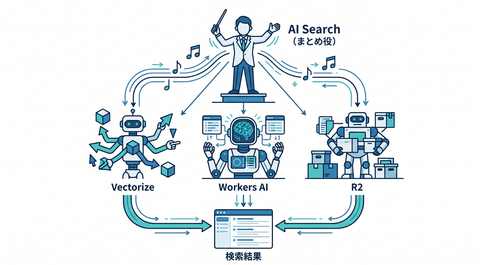
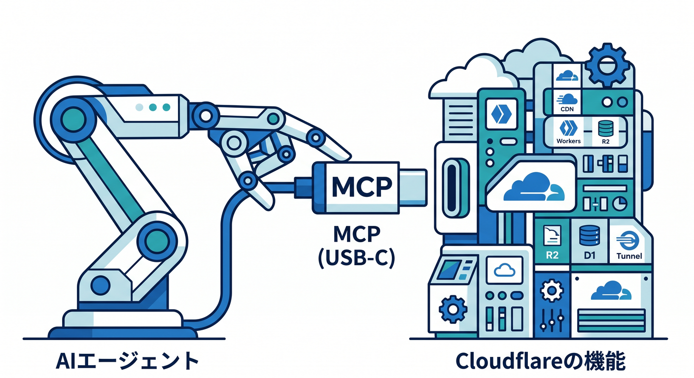
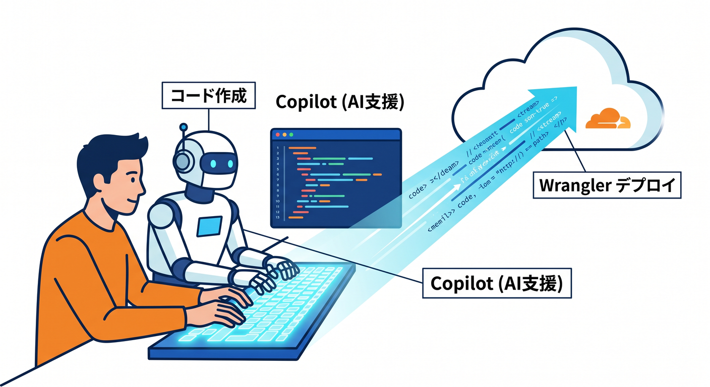
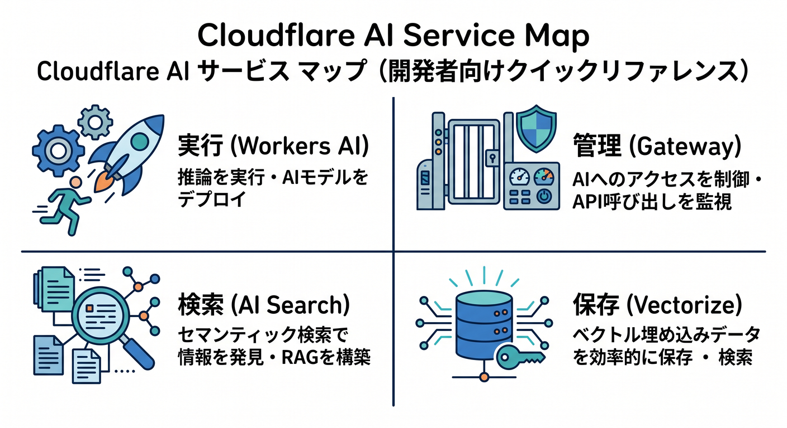
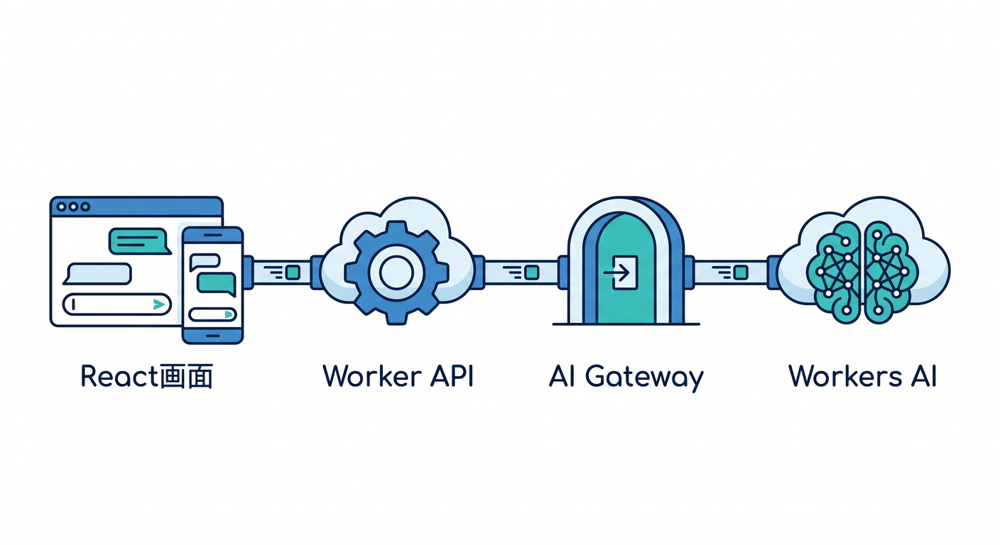
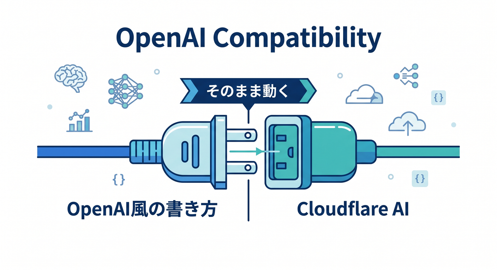
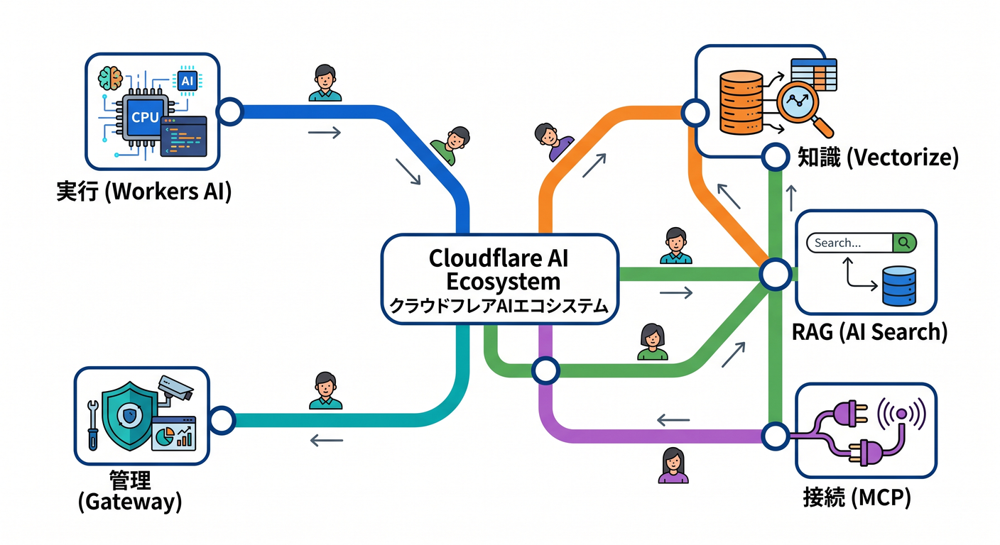

# 第14章：AI時代のWeb基礎：CloudflareのAIサービスを地図で見る 🧠☁️

この章では、「AIを使う」をただの外部API呼び出しで終わらせず、**モデル実行・制御・検索・ベクトル保存・エージェント接続**までを、Cloudflareの上でどう並べるのかをやさしく整理していきます。2026年4月14日時点のCloudflare公式情報では、Workers AI がモデル実行、AI Gateway が観測と制御、Vectorize がベクトルDB、AI Search が管理型検索基盤、Agents / MCP がエージェント接続の入口として案内されています。([Cloudflare Docs][1])

AIは急に別世界が始まるわけではありません😊
これまで学んできた HTTP、API、キャッシュ、データ保存、検索、認証の延長線上にあります。CloudflareのAI系サービスは、その「延長線上の部品」がかなり見やすく分かれているのが強みです。([Cloudflare Docs][2])

## この章の学習目標 🎯

この章を終えるころには、次のことを言えるようになるのが目標です。

* Workers AI は「モデルを動かす場所」だと説明できる
* AI Gateway は「AI通信の見張り役・交通整理役」だと説明できる
* Vectorize は「意味で探すための保存先」だと説明できる
* AI Search は「RAGや検索をかなりおまかせで組める場所」だと説明できる
* Agents / MCP は「AIが外の道具や情報源につながる口」だと説明できる

## 想定学習時間 ⏰

90〜120分くらいがおすすめです。
前半で地図をつかみ、後半で小さな実装イメージまで見る流れがちょうどよいです 😊

## この章のミニ成果物 🧩

章末では、こんな小さな設計図を自分で書ける状態を目指します。

* 「社内FAQ検索」を Cloudflare 上で組むときの構成図
* 「React画面 → Worker → AI Gateway → Workers AI」の基本経路
* 「まずAI Searchで始める / 途中からVectorize自前構成へ寄せる」の使い分けメモ

---

## 1. まずは1枚の地図で全体を見る 🗺️☁️

CloudflareのAIまわりは、まずこう見るとかなり分かりやすいです。
**Workers AI は“頭脳そのもの”を呼ぶ場所、AI Gateway は“通り道の管理”、Vectorize は“意味検索のための倉庫”、AI Search は“検索アプリ一式をかなり自動化した箱”**です。さらに、Agents / MCP は「その検索やツールをAIエージェントから使う入口」と考えると、全体像がスッと入ります。([Cloudflare Docs][1])

```
ブラウザ / React画面
        ↓
   Cloudflare Worker
   ├─ Workers AI …… モデル実行
   ├─ AI Gateway …… ログ / キャッシュ / リトライ / フォールバック
   ├─ Vectorize …… 埋め込みベクトル保存・類似検索
   ├─ AI Search …… 取り込み / 索引 / 検索 / 回答生成
   └─ Agents / MCP …… AIエージェント接続
```

この図のポイントは、「AI」と言っても1個のサービスで全部やるのではない、ということです。
従来のWebでも、画面・API・DB・CDN・認証が分かれていたように、AI時代も**役割ごとに分けて考える**ほうが圧倒的に理解しやすいです。([Cloudflare Docs][2])

---

## 2. Workers AI は「モデルを動かす場所」🤖⚡

Workers AI は、Cloudflare の global network 上で、**サーバーレスにAIモデルを実行できる仕組み**です。公式では、serverless GPUs 上で動く形として説明されていて、Workers や Pages、または Cloudflare API から呼び出せます。さらに、50以上のオープンモデルをカタログとして利用でき、料金も使った分だけの従量型です。([Cloudflare Docs][1])

初心者向けに言い換えると、Workers AI は「ChatGPTっぽい何かを作るときのモデル呼び出し口」です ✨
ただし、ここは**検索の仕組みそのもの**ではありません。あくまで「文章生成」「埋め込み生成」「画像生成」「音声認識」などの処理を担当する場所です。Workers AI のモデル一覧には、Text Generation、Text Embeddings、Text-to-Image、Automatic Speech Recognition、Text-to-Speech、Translation などが並んでいます。([Cloudflare Docs][1])

日本語まわりでもうれしい点があります 🇯🇵
現行のモデルカタログには、日本語テキスト埋め込み向けとして Preferred Networks の「PLaMo-Embedding-1B」も掲載されています。つまり、日本語検索や日本語RAGでも、「Cloudflareだと英語前提すぎるのでは？」と最初から決めつけなくて大丈夫です。([Cloudflare Docs][3])

しかも今の Workers AI は、OpenAI互換エンドポイントも持っています。
公式では、「chat/completions」と「embeddings」を OpenAI 互換形式で呼べると案内されていて、OpenAI SDK の base URL を Cloudflare 側へ差し替える形でも使えます。これはかなり大きくて、**既存のAIコード資産をCloudflareへ寄せやすい**ということです。([Cloudflare Docs][4])

料金面では、2026年4月14日時点で Workers AI は Free / Paid の Workers プランに含まれ、1日 10,000 Neurons までは無料、超過分は 1,000 Neurons あたり 0.011ドルという案内です。ここは今後動く可能性があるので、教材では「最新料金はダッシュボードか公式料金ページで必ず再確認」と添えておくのが親切です。([Cloudflare Docs][5])

---

## 3. AI Gateway は「AI通信の交通整理」🚦📊

AI Gateway は、Cloudflare公式がはっきり「Observe and control your AI applications」と書いている通り、**AIアプリの観測と制御**のためのサービスです。分析、ログ、キャッシュ、レート制御、リトライ、モデルフォールバックなどをまとめて扱えます。([Cloudflare Docs][2])

ここはモデルそのものではありません。
イメージとしては、**AIアプリ専用の“賢い中継所”**です。たとえば同じ質問が何度も来るならキャッシュで返したい、失敗したら自動で再試行したい、重いモデルが遅いなら別モデルへ逃がしたい、どのユーザーがどれだけ使っているか見たい――そういう「運用の現実」を受け持つのが AI Gateway です。([Cloudflare Docs][2])

しかも AI Gateway には OpenAI互換の統一エンドポイントがあります。
公式では「1つのURLで複数のAIプロバイダーを扱いやすくする」ことが案内されていて、モデル切り替え時のコード変更をかなり減らせます。CloudflareのWorkers AIだけでなく、他社モデルを混ぜる構成も考えやすくなります。([Cloudflare Docs][6])

ヘッダーによる細かい制御も今っぽいです 🛠️
例えばキャッシュTTL、最大再試行回数、リクエストタイムアウト、メタデータ付与、キャッシュスキップなどがヘッダーで調整できます。つまり AI Gateway は、AIアプリを「動かす」よりむしろ「壊れにくく・見えやすく・運用しやすくする」部品です。([Cloudflare Docs][7])

---

## 4. Vectorize は「意味で探すための保存先」📚🔎

Vectorize は、Cloudflare の**グローバル分散型ベクトルデータベース**です。
公式では、埋め込みベクトルを保存して類似検索しやすくする仕組みとして説明されていて、Workers と組み合わせてフルスタックAIアプリを作る前提がかなり強いです。([Cloudflare Docs][8])

「ベクトルDBって何？」となりやすいですが、ここは難しく考えなくて大丈夫です 😊
ふつうのデータベースが「完全一致」や「数値条件」で探すのが得意なのに対して、Vectorize は**意味の近さ**で探すのが得意です。FAQ検索、社内文書検索、おすすめ表示、LLMへの追加文脈の注入などに向いています。公式でも、semantic search、recommendation、classification、anomaly detection、LLMへの文脈付与といった用途が挙がっています。([Cloudflare Docs][8])

Workers AI と組み合わせる導線もかなり素直です。
公式ガイドでは、Workers AI で埋め込みを作り、それを Vectorize に保存し、あとで類似検索する流れがそのまま案内されています。つまり Cloudflare の中だけで、**埋め込み生成 → 保存 → 検索**までつながります。([Cloudflare Docs][9])

開発面でも、Wrangler から Vectorize index を作れます。
現行ドキュメントでは、「wrangler vectorize create」に加えて、「--preset」を使うと埋め込みモデルに応じて dimensions や metric を自動設定できる仕組みが案内されています。初心者にはこの「preset がある」のがかなり助かります。([Cloudflare Docs][10])

---

## 5. AI Search は「管理型RAG / 検索の完成度が高い箱」📦🧠

AI Search は、Cloudflare の**managed search service**です。
Webサイトや非構造化データをつなぐと、継続的にインデックスを更新し、自然言語で検索できる形にしてくれます。Cloudflare公式では、Vectorize、AI Gateway、R2、Browser Rendering、Workers AI とのネイティブ統合も案内されています。([Cloudflare Docs][11])

ここがとても大事です。
AI Search は、RAGを「全部自分で配線する」のではなく、**かなり管理してくれる側**です。インデックス更新、検索、生成、キャッシュなどを一から組むより、先に AI Search で全体像をつかむほうが、初心者にはずっと入りやすいです。([Cloudflare Docs][11])

AI Search の中で何が起きるかも、公式がかなり明確です。
インデックス時には、データ取り込み → Workers AI の Markdown Conversion → chunking → embedding → Vectorize への保存、という流れで進みます。問い合わせ時には、必要に応じた query rewriting、同じ埋め込みモデルでのクエリベクトル化、Vectorize 検索、そして生成、という流れになります。つまり、**AI Search は裏側で Workers AI と Vectorize を上手に束ねている**わけです。([Cloudflare Docs][12])

2026年4月14日時点では、AI Search は旧「AutoRAG」からの改名後の名称です。
移行ガイドでは、新しい API が「OpenAI互換フォーマット」に寄せられていることも案内されています。さらに、公開エンドポイント、UI snippets、MCP サポートも追加されていて、Webサイト埋め込みやAIエージェント接続まで視野に入っています。([Cloudflare Docs][13])

料金まわりも少し押さえておきましょう 💰
AI Search 自体は open beta 中は有効化無料ですが、内部では R2、Vectorize、Workers AI、AI Gateway、Browser Rendering などのリソースが動くため、それぞれの使用量はCloudflare利用料として計上されます。つまり「完全無料の魔法箱」ではなく、「かなり便利な管理レイヤー」と見るのが正確です。([Cloudflare Docs][14])



さらに面白いのは、AI Search が外部モデルとも組みやすい点です。
Cloudflareの changelog では、AI Gateway に OpenAI や Anthropic などの provider keys をつなぎ、その Gateway を AI Search に関連付けることで、埋め込みや生成に他社モデルも使える導線が案内されています。([Cloudflare Docs][15])

---

## 6. Agents / MCP は「AIが外の世界につながる口」🔌🤝

Cloudflare の Agents docs では、MCP は AI と外部アプリケーションをつなぐオープン標準として説明されています。
たとえるなら、AI用の USB-C ポートみたいなものです。AI Search も MCP endpoint を持てるので、AIエージェントがあなたの indexed content を「search ツール」として使えるようになります。([Cloudflare Docs][16])



Cloudflare 自身も managed remote MCP servers を持っています。
公式ドキュメントでは、CloudflareのMCPサーバーを OAuth で接続し、アカウント設定の読み取りや提案、場合によっては変更まで行えると案内されています。つまり Cloudflare は、「AIアプリを作る基盤」だけでなく、「AIがCloudflare自体を触る」世界も用意し始めています。([Cloudflare Docs][17])

この章では深追いしませんが、今のWeb基礎を学ぶ意味がここにあります。
これからは、Webアプリを人が使うだけでなく、**AIエージェントも使う**前提の設計が増えていきます。そのとき MCP はかなり重要な接続方式になります。([Cloudflare Docs][16])

---

## 7. VS Code・Copilot・Cloudflare の今どき導線 🛠️🤖✨

Cloudflare公式の Workers ドキュメントには、かなりはっきり「プロンプトから Workers アプリを作れる」と書かれています。
対象として VS Code、Cursor、Windsurf、Claude Code、Codex、OpenCode まで並んでいて、Cloudflare docs 用の MCP サーバー「docs.mcp.cloudflare.com/mcp」や observability 用 MCP サーバーの接続も案内されています。つまりCloudflare側はもう、**AI支援込みの開発体験を正面から前提**にしています。([Cloudflare Docs][18])



GitHub Copilot 側も、プロジェクト文脈を食べさせる仕組みがかなり整っています。
GitHub公式では、リポジトリのルートに「.github/copilot-instructions.md」を置くことで、Copilot に自然言語の指示を自動的に追加できると案内されています。保存後はリクエストへ自動適用され、参照として見えることも説明されています。([GitHub Docs][19])

これは Cloudflare 開発ととても相性がよいです 😊
たとえばそのファイルに、「Workers優先で実装」「React画面は軽め」「AI Gateway 経由を基本」「Vectorize 命名規則」「Wranglerで確認する手順」などを書いておくと、Copilot がかなりぶれにくくなります。これは教材としても実務としても、かなり価値があります。([GitHub Docs][19])

さらに、Cloudflare の Vite plugin は今のReact系導線と噛み合っています。
公式では、Workers runtime と Vite を直接統合し、bindings への直接アクセス、SPA / static site / full-stack app の構築、HMR、React Router v7 や TanStack Start の公式サポートなどが案内されています。AI画面を React で作り、裏側を Worker で受ける、という形がかなり自然です。([Cloudflare Docs][20])

新規作成も「create-cloudflare」から始められます。
Workers AI の getting started でも、C3 こと create-cloudflare を使ってプロジェクトを作り、Wrangler も一緒に導入される流れが案内されています。初心者教材では、まずこの入口に寄せるのが分かりやすいです。([Cloudflare Docs][21])

---

## 8. どれをいつ使うの？ 迷ったときの早見え整理 🧭

迷ったら、まずこの感覚で大丈夫です。

* **モデルを呼びたいだけ**
  → Workers AI

* **使いすぎ監視、ログ、キャッシュ、フォールバックを入れたい**
  → AI Gateway

* **意味検索やRAGの土台を自分で組みたい**
  → Vectorize

* **検索 / RAG をまず速く立ち上げたい**
  → AI Search

* **AIエージェントから検索やツールとして使いたい**
  → MCP / Agents

この整理は、Cloudflare公式の各サービスの役割をそのまま初心者向けに言い換えたものです。特に AI Search は「全部自前で組む前に、完成度高めの入口として使う」と理解しておくと、学習コストをかなり下げられます。([Cloudflare Docs][1])



---

## 9. 典型パターンを3つだけ見よう 👀

## パターンA　まずはAIチャットを1本通す 💬

React画面から Worker に投げて、そこから AI Gateway 経由で Workers AI を呼ぶ形です。
最初の一歩としてはかなりおすすめです。画面、API、モデル呼び出し、ログ、キャッシュの位置関係がきれいに見えます。([Cloudflare Docs][2])



## パターンB　社内FAQや資料検索を作る 📄🔍

文書やWebページを検索対象にしたいなら、まずは AI Search が強いです。
自前構築よりも、取り込み・更新・検索・生成の流れを早く体験できます。必要になったら後で Vectorize を深く触ればOKです。([Cloudflare Docs][11])

## パターンC　AIエージェントから検索させる 🤖🧰

AI Search の MCP endpoint や public endpoint を使うと、エージェントや外部UIから検索機能をつなぎやすくなります。
人間向けの検索画面だけでなく、「AIにも使わせる検索」を作れるのが、今どきっぽいところです。([Cloudflare Docs][22])

---

## 10. TypeScript で見る最小イメージ 💻✨

## 10-1. まずはAI bindingを持つ

```
{
  "ai": {
    "binding": "AI"
  }
}
```

Workers AI も AI Search も、まずは binding を通して Worker から触る形が基本です。Cloudflare公式でも、Workers AI binding と AI Search binding の両方がこの導線で案内されています。([Cloudflare Docs][23])

## 10-2. Workers AI を OpenAI SDK 風に呼ぶ

```ts
import OpenAI from "openai";

export interface Env {
  CLOUDFLARE_API_KEY: string;
  CLOUDFLARE_ACCOUNT_ID: string;
}

export default {
  async fetch(_request: Request, env: Env): Promise<Response> {
    const client = new OpenAI({
      apiKey: env.CLOUDFLARE_API_KEY,
      baseURL: `https://api.cloudflare.com/client/v4/accounts/${env.CLOUDFLARE_ACCOUNT_ID}/ai/v1`,
    });

    const result = await client.chat.completions.create({
      model: "@cf/meta/llama-3.1-8b-instruct",
      messages: [
        { role: "user", content: "Cloudflare AI をやさしく説明して" },
      ],
    });

    return new Response(result.choices[0]?.message?.content ?? "no response");
  },
};
```

これは「CloudflareのAIを、OpenAI SDK風の書き味で呼べる」ことを見るサンプルです。
OpenAI互換 endpoint があるので、学習コストをかなり下げられます。([Cloudflare Docs][4])



## 10-3. AI Search で “検索してから答える”

```ts
export default {
  async fetch(_request: Request, env: any): Promise<Response> {
    const result = await env.AI.autorag("my-search").aiSearch({
      query: "料金ページはどこ？",
      model: "@cf/meta/llama-3.3-70b-instruct-fp8-fast",
      system_prompt: "回答は短く、根拠が弱いときは断定しないでください。"
    });

    return new Response(JSON.stringify(result), {
      headers: { "content-type": "application/json" }
    });
  }
};
```

ここで「autorag」という名前が残っているのは、古いAPI名の名残です。
Cloudflare公式でも、AI Search への改名後も一部の binding や API に AutoRAG 表記が残ること、機能は同じで新名称への移行が段階的に進むことが案内されています。教材では、ここをちゃんと説明しておくと混乱が減ります。([Cloudflare Docs][24])

## 10-4. Vectorize index を作る入口

```bash
npx wrangler vectorize create docs-index --preset <embedding-model-name>
```

現行の Wrangler では、「--preset」を使うと embedding モデルに応じた設定を自動で入れやすいです。
初心者のうちは、dimensions や metric を細かく手で決めるより、この入口を知っておくとかなり楽です。([Cloudflare Docs][10])

---

## 11. この章のおすすめ演習 ✍️🎓

## 演習1　AIの役割分担を言葉にする

次の文を自分の言葉で埋めてみましょう。

* Workers AI は「＿＿＿」
* AI Gateway は「＿＿＿」
* Vectorize は「＿＿＿」
* AI Search は「＿＿＿」

## 演習2　FAQチャット構成図を書く

「React画面」「Worker」「AI Gateway」「Workers AI」の4つだけで、問い合わせ画面の構成図を書いてみましょう。

## 演習3　RAGの2択を比べる

次の2つの違いをメモしてみましょう。

* AI Search で始める
* Workers AI + Vectorize を自前で組む

## 演習4　Copilot を賢くする

「.github/copilot-instructions.md」に何を書くと、この教材向けのCloudflare開発がぶれにくくなるか、5行だけ考えてみましょう。GitHub Copilot はこのファイルを自動でリクエストへ取り込めます。([GitHub Docs][19])

---

## 12. よくある勘違いを先につぶす 🧯

## 「Workers AI があれば検索まで全部できる」

半分だけ正しいです。
Workers AI はモデル実行には強いですが、検索用データの索引や継続更新は別に考える必要があります。その役割を Vectorize や AI Search が補います。([Cloudflare Docs][1])

## 「Vectorize はチャットの完成品」

違います。
Vectorize はベクトルDBです。意味検索の土台にはなりますが、取り込み・回答生成・UIまで自動で全部仕上げる箱ではありません。([Cloudflare Docs][8])

## 「AI Gateway はAIモデルそのもの」

これも違います。
AI Gateway はモデルを動かす場ではなく、AI通信の制御・観測レイヤーです。ログ、分析、キャッシュ、レート制御、リトライ、フォールバックが主役です。([Cloudflare Docs][2])

## 「AI Search はただの検索窓」

それよりずっと広いです。
自動インデックス更新、チャンク化、埋め込み、Vectorize保存、応答生成、公開 endpoint、MCP 接続まで含むので、かなり“検索基盤”寄りです。([Cloudflare Docs][11])

---

## 13. まとめ 🌈

この章でいちばん大事なのは、**AIを1個の黒箱だと思わないこと**です。
CloudflareのAI世界は、かなりきれいに役割分担されています。Workers AI は実行、AI Gateway は管理、Vectorize は意味検索の保存、AI Search は管理型RAG、Agents / MCP はAIエージェント接続――この地図が頭に入るだけで、次の学習がかなり楽になります。([Cloudflare Docs][1])



そして今のCloudflare開発は、VS Code や AIエディタ、MCP、Copilot カスタム指示などを含めた**AI込みの開発導線**へかなり寄っています。だからこそ、これからの入門は「AIを使うかどうか」ではなく、**どう地図として整理して使うか**が本番です。([Cloudflare Docs][18])

次の章では、この地図を踏まえて、実際に「どこから手を付けると迷いにくいか」を、もっと実装寄りに落としていくととても学びやすいです 🚀

必要なら次に、そのまま使える形で
**「第14章の教材用レイアウト版（導入文・本文・図解・演習・小テスト・まとめ付き）」**
として整えてお渡しします。

[1]: https://developers.cloudflare.com/workers-ai/ "Overview · Cloudflare Workers AI docs"
[2]: https://developers.cloudflare.com/ai-gateway/ "Overview · Cloudflare AI Gateway docs"
[3]: https://developers.cloudflare.com/workers-ai/models/ "Models · Cloudflare Workers AI docs"
[4]: https://developers.cloudflare.com/workers-ai/configuration/open-ai-compatibility/ "https://developers.cloudflare.com/workers-ai/configuration/open-ai-compatibility/"
[5]: https://developers.cloudflare.com/workers-ai/platform/pricing/ "Pricing · Cloudflare Workers AI docs"
[6]: https://developers.cloudflare.com/ai-gateway/usage/chat-completion/ "Unified API (OpenAI compat) · Cloudflare AI Gateway docs"
[7]: https://developers.cloudflare.com/ai-gateway/glossary/ "Header Glossary · Cloudflare AI Gateway docs"
[8]: https://developers.cloudflare.com/vectorize/ "Overview · Cloudflare Vectorize docs"
[9]: https://developers.cloudflare.com/vectorize/get-started/embeddings/ "Vectorize and Workers AI · Cloudflare Vectorize docs"
[10]: https://developers.cloudflare.com/workers/wrangler/commands/vectorize/ "Vectorize · Cloudflare Workers docs"
[11]: https://developers.cloudflare.com/ai-search/ "Cloudflare AI Search · Cloudflare AI Search docs"
[12]: https://developers.cloudflare.com/ai-search/concepts/how-ai-search-works/ "https://developers.cloudflare.com/ai-search/concepts/how-ai-search-works/"
[13]: https://developers.cloudflare.com/ai-search/how-to/migrate-from-autorag-api/ "Migrate from AutoRAG Search API · Cloudflare AI Search docs"
[14]: https://developers.cloudflare.com/ai-search/platform/limits-pricing/ "Limits & pricing · Cloudflare AI Search docs"
[15]: https://developers.cloudflare.com/changelog/post/2025-09-25-ai-search-more-models/ "AI Search (formerly AutoRAG) now with More Models To Choose From · Changelog"
[16]: https://developers.cloudflare.com/agents/model-context-protocol/ "Model Context Protocol (MCP) · Cloudflare Agents docs"
[17]: https://developers.cloudflare.com/agents/model-context-protocol/mcp-servers-for-cloudflare/ "https://developers.cloudflare.com/agents/model-context-protocol/mcp-servers-for-cloudflare/"
[18]: https://developers.cloudflare.com/workers/get-started/prompting/ "Prompting · Cloudflare Workers docs"
[19]: https://docs.github.com/ja/copilot/how-tos/configure-custom-instructions/add-repository-instructions "GitHub Copilot用のリポジトリカスタム命令の追加 - GitHubドキュメント"
[20]: https://developers.cloudflare.com/workers/vite-plugin/ "Vite plugin · Cloudflare Workers docs"
[21]: https://developers.cloudflare.com/workers-ai/get-started/workers-wrangler/ "Get started - Workers and Wrangler · Cloudflare Workers AI docs"
[22]: https://developers.cloudflare.com/ai-search/usage/mcp/ "https://developers.cloudflare.com/ai-search/usage/mcp/"
[23]: https://developers.cloudflare.com/workers-ai/configuration/bindings/ "https://developers.cloudflare.com/workers-ai/configuration/bindings/"
[24]: https://developers.cloudflare.com/ai-search/usage/workers-binding/ "https://developers.cloudflare.com/ai-search/usage/workers-binding/"
