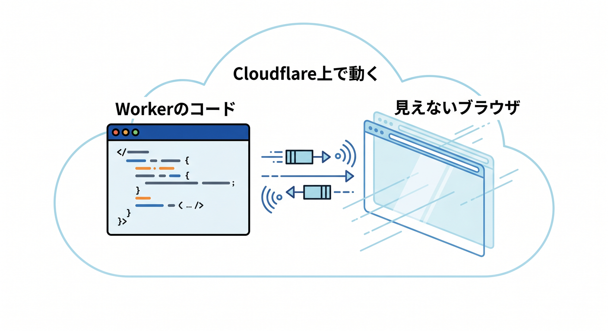
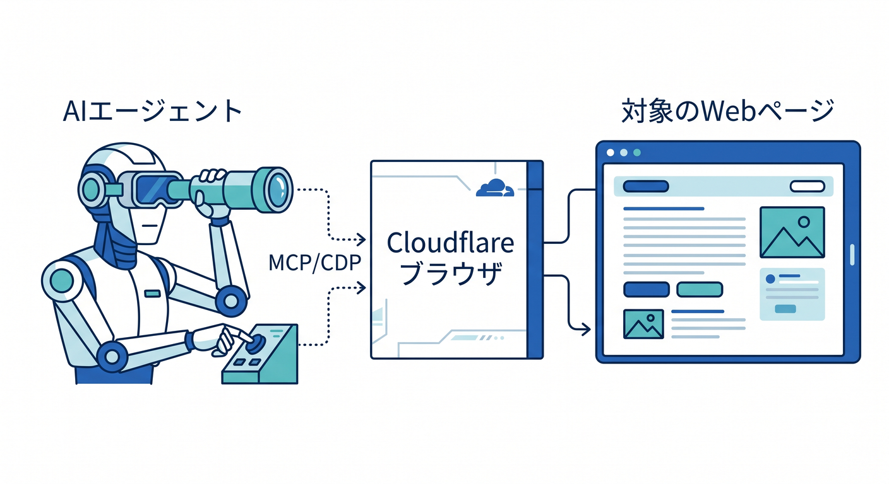
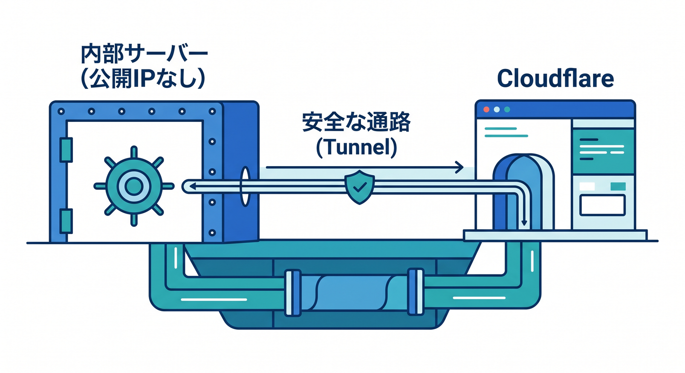
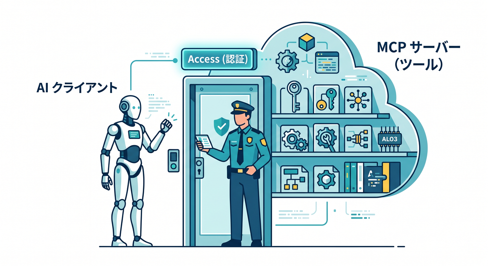
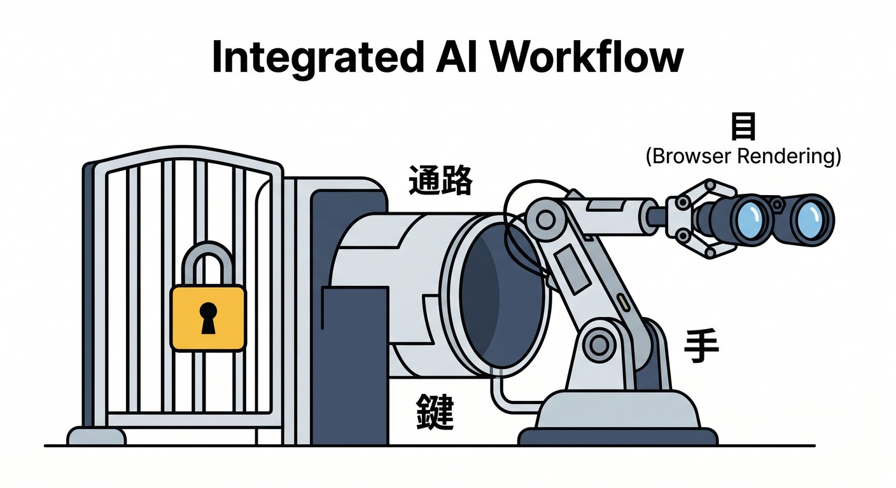
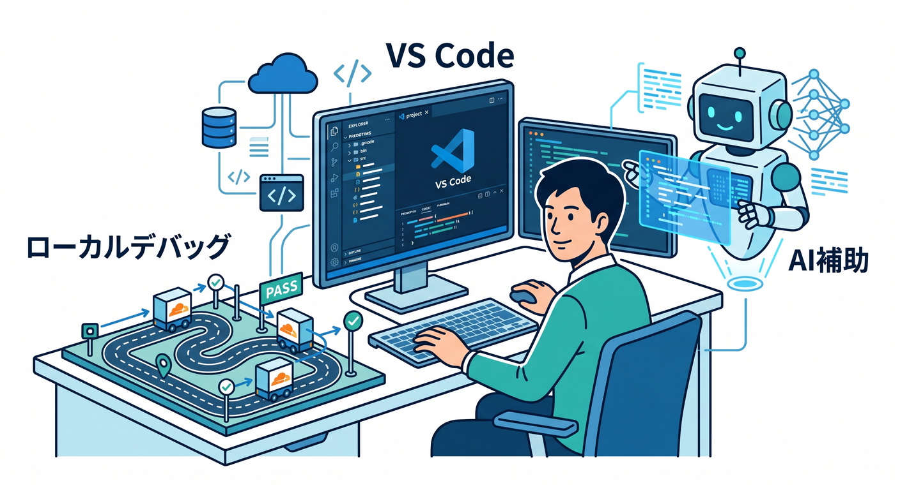
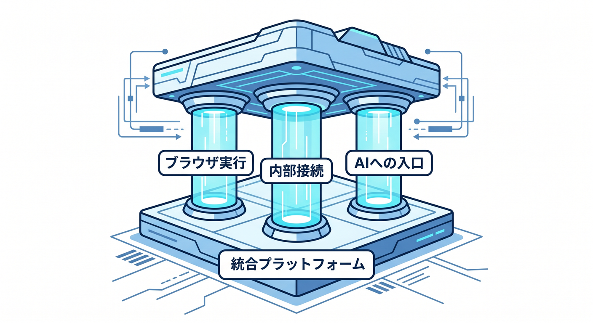

# 第15章：次の時代の入口：Browser Rendering・Tunnel・MCPまで見て終わろう 🚪✨

ここまでで、Webの流れ、DNS、HTTPS、Edge、Cloudflare、Workers まで見てきましたね 😊
この最終章では、その延長線上にある「ちょっと未来っぽい世界」を、むずかしい実装よりも**地図として理解すること**を目標にします。
2026年4月14日時点の Cloudflare 公式DocsとChangelogを確認すると、Cloudflare はもう「速くする会社」や「守る会社」だけではなく、**ブラウザを動かす・安全に内部へつなぐ・AIにツールを渡す**ところまで、かなり一体化してきています。 ([Cloudflare Docs][1])

## この章でつかみたいこと 🎯

この章で大事なのは、用語を全部暗記することではありません 🙌
むしろ、

* Browser Rendering は「Cloudflare上で動く見えないブラウザ」👀
* Tunnel は「内側のサービスを、安全につなぐ通路」🚇
* MCP は「AIに外部ツールを渡すための共通ルール」🧰

として、ざっくり言えるようになることが大事です。

---

## 1. 未来の話に見えるけど、実は“今までの復習”でもあるよ 🧭

この章の内容は急に別世界へ飛ぶ話ではありません。
Browser Rendering は「Edgeでコードが動く」の延長、Tunnel は「公開のしかたを変える」話、MCP は「Workers や Agents の機能を AI から使いやすくする」話です。Cloudflare の Agents docs でも、エージェントはモデル呼び出しだけでなく、**ツール利用、スケジュール実行、headless browser 利用、MCP 公開**まで含めて説明されています。 ([Cloudflare Docs][2])

つまり一言でいうと、
**Cloudflare は “ネットの通り道” だけでなく、“実行環境”“AIの道具箱”“安全な入口” まで持つ平台になってきた**、ということです。 ([Cloudflare Docs][1])

---

## 2. Browser Rendering って何？ 👀🖥️⚡

Browser Rendering は、**Cloudflare の global network 上で headless Chrome を動かす仕組み**です。用途としては、ブラウザ自動操作、スクリーンショット、PDF生成、スクレイピング、テスト、コンテンツ生成などが案内されています。しかも Free / Paid の両プランで利用できます。 ([Cloudflare Docs][1])

初心者目線では、こう考えるとわかりやすいです 😊
ふつうの Workers は「HTTPリクエストを受けて処理するコード」でしたが、Browser Rendering はそこに**“見えないブラウザ”という相棒**が増えた感じです。
だから JavaScript で表示されたページを開いて中身を取ったり、テスト用に操作したり、「人がブラウザで見る」作業に近いことをコードから扱えるようになります。 ([Cloudflare Docs][1])

Cloudflare 公式は Browser Rendering の入口を大きく2つに分けています 🌟

* **Quick Actions**
  スクリーンショット、PDF、Markdown抽出、リンク取得、構造化データ取得、クロールなどの**単発処理向け**。複雑なコードを書かずに扱いやすいです。
* **Browser Sessions**
  Puppeteer / Playwright / CDP / Stagehand で**より細かいブラウザ制御**をする方式です。 ([Cloudflare Docs][3])

この違いは超大事です ✨
「1回だけページを撮りたい」なら Quick Actions、
「ログインしてボタンを押して内容を読む」なら Browser Sessions、
という感じで考えるとかなり整理しやすいです。 ([Cloudflare Docs][3])

---

## 3. いま Browser Rendering が特に面白い理由 🆕🤖

2026年4月の最新情報として、Browser Rendering には **CDP と MCP client support** が追加され、**Puppeteer / Playwright / MCP対応クライアントから、Cloudflare のリモートブラウザへ接続しやすく**なりました。Cloudflare の Changelog では、2026年4月10日付でこの強化が案内されています。 ([Cloudflare Docs][4])

さらに docs では、MCP clients 向けに Browser Rendering を使うページもあり、Claude Desktop / Claude Code / Cursor / OpenCode などの MCP 対応クライアントから接続する構成が説明されています。そこでは Node.js v20.19 以降や Browser Rendering 用の API token なども前提として示されています。 ([Cloudflare Docs][5])

つまり今の Browser Rendering は、
**「自分のコードからブラウザを動かす」だけでなく、「AIエージェントからブラウザを動かす」側にも大きく伸びている**わけです。
これがこの章で “次の時代の入口” と呼んでいる理由です 🚪✨ ([Cloudflare Docs][5])

おまけに 2026年3月には `/crawl` エンドポイントも案内され、サイト全体をたどって HTML / Markdown / JSON などで返す仕組みが open beta として登場しました。しかも Cloudflare は、**robots.txt と AI Crawl Control を既定で尊重する**と説明しています。AI時代らしい機能ですね。 ([Cloudflare Docs][6])

---

## 4. Tunnel って何？ 🚇🔐

Cloudflare Tunnel は、**origin server や API やサービスを、公開IPなしで Cloudflare へつなぐ仕組み**です。docs では、`cloudflared` という軽量デーモンをサーバー側に入れ、**outbound-only** の接続を張る形だと説明されています。さらに Cloudflare はこれを **post-quantum encrypted tunnels** として案内しています。 ([Cloudflare Docs][7])

初心者向けに言い換えるとこうです 😊

昔ながらの発想
→ サーバーのドアを外へ向けて開ける 🚪

Tunnel の発想
→ サーバーの内側から、安全な通路を外へ伸ばす 🚇

この違いがとても大きいです。Cloudflare docs でも、**No open inbound ports. No public IPs.** とはっきり書かれています。 ([Cloudflare Docs][7])

そして Tunnel 単体で終わらず、Cloudflare Access と組み合わせるとさらに意味が強くなります。
Access は **identity-aware proxy** として動き、リクエストごとにポリシーを見て「その人を通してよいか」を判断します。つまり、単に通路を作るだけでなく、**誰を通すか**までコントロールできます。 ([Cloudflare Docs][8])

この考え方は、社内管理画面、検証用ダッシュボード、ローカルで動かしている管理ツールなどにぴったりです。
「とりあえず外へ丸見えで公開」ではなく、**公開面を減らしながら必要な人だけ通す**、という現代的な公開方法なんですね 🛡️✨ ([Cloudflare Docs][7])

---

## 5. MCP って何？ 🧰🤖

MCP は Model Context Protocol のことで、**AIアシスタントが外部ツールやサービスを使うための共通ルール**です。Cloudflare は Agents docs の中で、**remote MCP server を Cloudflare 上にデプロイする方法**をかなりしっかり案内しています。しかも transport は **Streamable HTTP** が現在の標準として説明されています。 ([Cloudflare Docs][9])

Cloudflare の remote MCP server づくりには、大きく分けて2パターンあります。

* 認証なしで公開する
* 認証・認可つきで公開する

後者では、Cloudflare Access を使ってログインとポリシー制御を組み込む流れまで docs で説明されています。つまり、**AIにツールを渡す**だけでなく、**誰のAIに、どの権限で渡すか**まで Cloudflare 側でまとめやすくなっています。 ([Cloudflare Docs][9])

さらに面白いのは、Cloudflare 自身も **managed remote MCP servers のカタログ**を運用していることです。Claude、Windsurf、AI Playground など OAuth 対応クライアントからつなげられる形が案内されていて、Cloudflare API MCP server では DNS、Workers、R2、Zero Trust など広い API 群にアクセスできるとされています。 ([Cloudflare Docs][10])

ここで見えてくるのは、
MCP はただの流行語ではなく、**Cloudflare が本気で “AIに安全に仕事をさせる接続面” として整備している入口**だということです。 ([Cloudflare Docs][10])

---

## 6. Browser Rendering・Tunnel・MCP がつながると何が起きるの？ 🧩✨

この3つを別々に覚えると、ちょっと散らばって見えます。
でも、つなげると一気に意味が出ます。

たとえばこんな構成です 👇

* 管理画面は自宅PCやVPSや社内サーバーで動いている
* それを Cloudflare Tunnel で安全につなぐ
* Access でログイン必須にする
* Cloudflare Workers 上の MCP server が「管理画面を確認する」ツールを提供する
* そのツールの中で Browser Rendering が headless browser を動かして、画面を確認したり、要素を読んだりする
* 必要なら LLM は Workers AI や外部モデルを使い、AI Gateway で利用状況やリトライやフォールバックを制御する

という流れです。
この形になると、**AIがWebを見て、必要な操作をしつつ、安全境界も保つ**という今っぽい構成が見えてきます。 ([Cloudflare Docs][7])

わかりやすくたとえると、

* **Browser Rendering = AIの目** 👀
* **MCP = AIの手に渡す道具箱** 🧰
* **Tunnel = 内部へ入る安全な通路** 🚇
* **Access = 鍵と入館管理** 🔑
* **AI Gateway = AI利用の交通整理** 🚦

です。
この整理ができると、「CloudflareのAI系サービスってバラバラじゃないんだ」と感じやすくなります 😊

---

## 7. Cloudflare のAIサービス全体とも、ちゃんとつながっている 🤝☁️🧠

Cloudflare の Agents docs では、エージェントは **どのモデルでも使える**, **MCPでツール公開できる**, **headless browser を使える**, **スケジュール実行できる** という形で紹介されています。つまり、AI本体・ツール・ブラウザ・自動化が1つの流れで扱われています。 ([Cloudflare Docs][2])

AI Gateway は、AIアプリの **analytics / logging / caching / rate limiting / retries / model fallback** などをまとめて扱うレイヤーとして説明されています。AIを使う量が増えるほど、ここはかなり重要になります。 ([Cloudflare Docs][11])

さらに AI Search は、**Vectorize・AI Gateway・R2・Browser Rendering・Workers AI とネイティブ統合**すると docs にあります。つまり Cloudflare は、検索・取得・推論・ブラウザ読み取りまでを、かなり一枚絵でつなごうとしています。 ([Cloudflare Docs][12])

この章では深掘りしませんが、地図としてはこう覚えるといいです 🗺️

* **Workers AI** → モデルを動かす
* **AI Gateway** → AI利用を見える化・制御する
* **AI Search / Vectorize / R2** → 情報を持つ・探す
* **Browser Rendering** → Webページをちゃんと開いて読む
* **Agents / MCP** → AIに仕事を渡す
* **Tunnel / Access** → それを安全につなぐ

これでもう、Cloudflare を「CDNだけの会社」とは見なくなるはずです 😎

---

## 8. VS Code と AI 支援をどう使うと学びやすい？ 💻✨

この章を学ぶときも、VS Code ベースで進めるのが自然です。Cloudflare の Workers docs には、**Workers アプリを VS Code などのエディタや agent から prompt ベースで作り始められる**という案内があり、さらに Cloudflare Docs MCP や observability MCP をつないで、ドキュメント参照やログ確認を AI に渡す導線も紹介されています。 ([Cloudflare Docs][13])

ローカル開発とデバッグ面でも、Cloudflare docs では **`wrangler dev` や `vite dev` を VS Code の debug terminal や `launch.json` から使う方法**が説明されています。
つまり今の Cloudflare 学習は、CLI をひたすら暗記するより、**VS Code + AI補助 + local debug** の組み合わせで進めるほうがかなり現代的です。 ([Cloudflare Docs][14])

GitHub Copilot についても、Workers の Prompting ページは GitHub の **Copilot Chat 向け prompt engineering guide** を参照先のひとつとして挙げています。なので、Copilot は「Cloudflare学習の相性が悪い道具」ではなく、**むしろ prompt 設計やコードたたき台づくりに自然に使ってよい道具**と考えて大丈夫です。 ([Cloudflare Docs][13])

---

## 9. この章のミニ演習 ✍️🌟

### 演習1：3つを一言で説明しよう

次の3文を、自分の言葉で言い換えてみてください。

* Browser Rendering は何？
* Tunnel は何？
* MCP は何？

この演習の目的は、正確な定義よりも、**人に説明できるレベルまで整理すること**です 😊

### 演習2：1つの構成図を考えよう

「自分だけが見られる管理画面を、AIにも少し手伝わせたい」とします。
そのとき、

* 何を Tunnel に通す？
* どこで Access をかける？
* Browser Rendering は何を見る？
* MCP server は何のツールを出す？

を4行で書いてみましょう。

### 演習3：危ない設計を見抜こう

次のうち危なそうなものを選んでみてください。

* 認証なしの MCP server に強い操作権限を持たせる
* 内部管理画面を public IP でそのまま外へ出す
* Browser Rendering のクロール対象ルールを考えずに広げる

このあたりは、Cloudflare docs の思想ともかなり合っています。**便利さより先に、公開面と認証を考える**のが大事です。 ([Cloudflare Docs][9])

---

## 10. ここだけ注意してね ⚠️🛡️

まず、MCP はかなり勢いのある分野ですが、Cloudflare docs でも **remote, authorized connections はまだ進化中で、すべての MCP client が remote 接続に対応しているわけではない**と説明されています。なので、「MCPなら何でもどのAIでもすぐつながる」と思い込まないほうが安全です。 ([Cloudflare Docs][15])

次に、Browser Rendering は便利だからこそ、**何でも読んでよいわけではない**という感覚も大事です。Cloudflare が `/crawl` で robots.txt や AI Crawl Control を尊重すると案内しているのは、まさにそこを意識しているからです。 ([Cloudflare Docs][6])

そして MCP server は、雑に公開すると「AIに強い権限を丸ごと渡す窓口」になりえます。Cloudflare が Access を使った認証つき構成を案内しているのは、その危険をちゃんと見ているからですね。 ([Cloudflare Docs][16])

---

## 11. この章のまとめ 🏁✨

この章のゴールは、Browser Rendering・Tunnel・MCP を細かく実装できるようになることではありません。
それよりも、

* Cloudflare はブラウザも動かせる 👀
* 内部サービスを安全につなげられる 🚇
* AIにツールを渡す入口まで持っている 🤖
* しかもそれを AI Gateway や AI Search や Agents とつなげられる ☁️

という**次の時代の地図**を持つことでした。 ([Cloudflare Docs][1])

Webの基礎を学ぶと、最終的にここまで見えてきます 🌍➡️☁️➡️🤖
それはつまり、DNS や HTTPS や Edge の勉強が、ちゃんと未来の開発につながっているということです。
この15章を終えたら、もう「Cloudflareって何するもの？」に対してかなり立体的に答えられる状態です 🙌✨

次に進むなら、
**Browser Rendering の超入門ハンズオン** か **Cloudflare Tunnel + Access のやさしい実践編** を作ると、かなりきれいにつながります。

[1]: https://developers.cloudflare.com/browser-rendering/ "Browser Rendering · Cloudflare Browser Rendering docs"
[2]: https://developers.cloudflare.com/agents/ "Agents · Cloudflare Agents docs"
[3]: https://developers.cloudflare.com/browser-rendering/get-started/ "Get started · Cloudflare Browser Rendering docs"
[4]: https://developers.cloudflare.com/changelog/post/2026-04-10-browser-rendering-cdp-endpoint/?utm_source=chatgpt.com "Browser Rendering adds Chrome DevTools Protocol (CDP ..."
[5]: https://developers.cloudflare.com/browser-rendering/cdp/mcp-clients/ "Using with MCP clients (CDP) · Cloudflare Browser Rendering docs"
[6]: https://developers.cloudflare.com/changelog/post/2026-03-10-br-crawl-endpoint/?utm_source=chatgpt.com "Crawl entire websites with a single API call using Browser ..."
[7]: https://developers.cloudflare.com/tunnel/ "Cloudflare Tunnel · Cloudflare Docs"
[8]: https://developers.cloudflare.com/cloudflare-one/access-controls/applications/http-apps/?utm_source=chatgpt.com "Add web applications · Cloudflare One docs"
[9]: https://developers.cloudflare.com/agents/guides/remote-mcp-server/ "Build a Remote MCP server · Cloudflare Agents docs"
[10]: https://developers.cloudflare.com/agents/model-context-protocol/mcp-servers-for-cloudflare/ "Cloudflare's own MCP servers · Cloudflare Agents docs"
[11]: https://developers.cloudflare.com/ai-gateway/ "Overview · Cloudflare AI Gateway docs"
[12]: https://developers.cloudflare.com/ai-search/ "Cloudflare AI Search · Cloudflare AI Search docs"
[13]: https://developers.cloudflare.com/workers/get-started/prompting/ "Prompting · Cloudflare Workers docs"
[14]: https://developers.cloudflare.com/workers/observability/dev-tools/breakpoints/ "Breakpoints · Cloudflare Workers docs"
[15]: https://developers.cloudflare.com/agents/guides/test-remote-mcp-server/?utm_source=chatgpt.com "Test a Remote MCP Server"
[16]: https://developers.cloudflare.com/cloudflare-one/access-controls/ai-controls/saas-mcp/ "Secure MCP servers with Access for SaaS · Cloudflare One docs"
