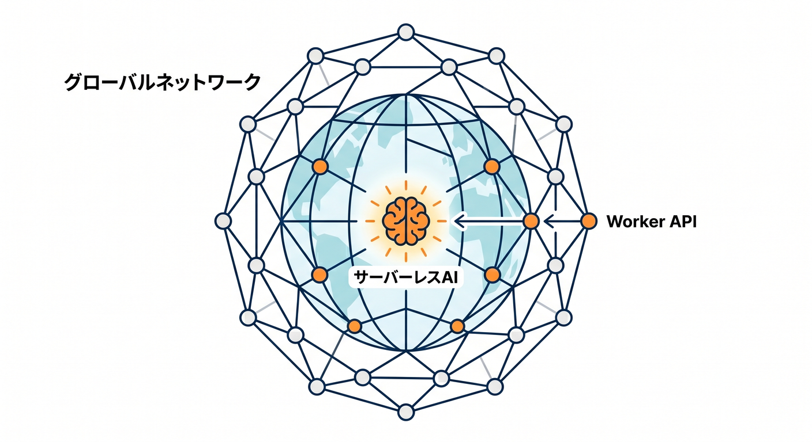
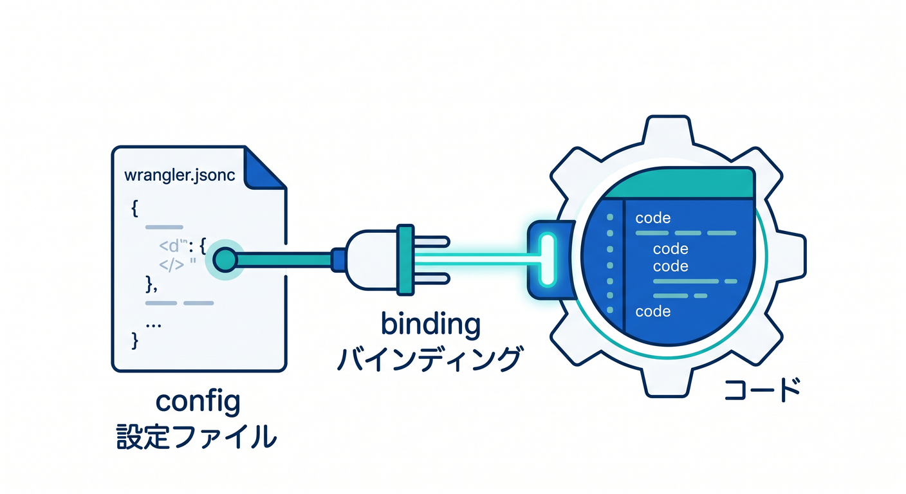
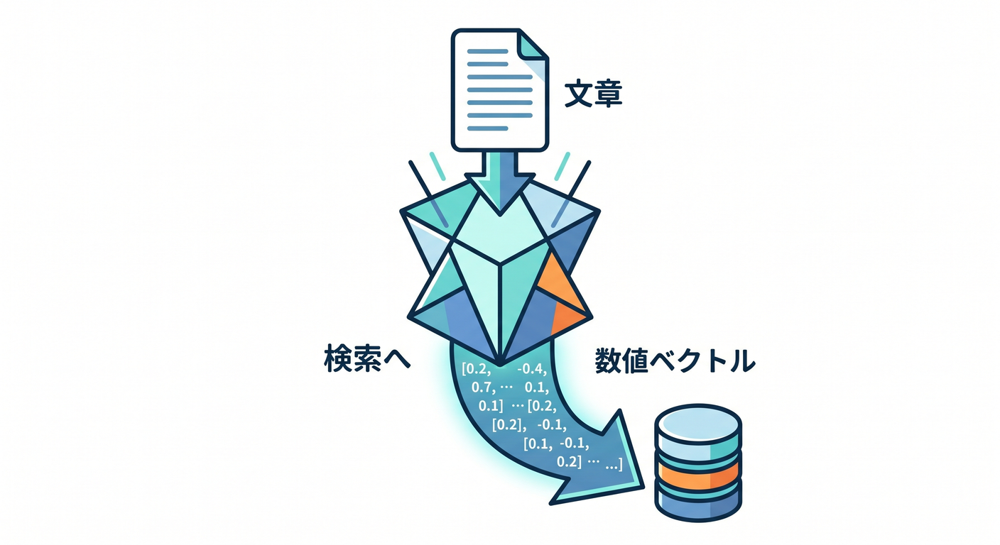
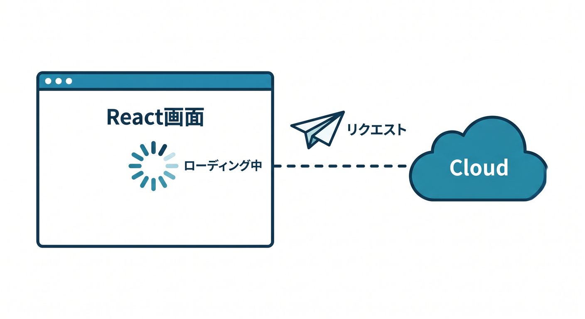
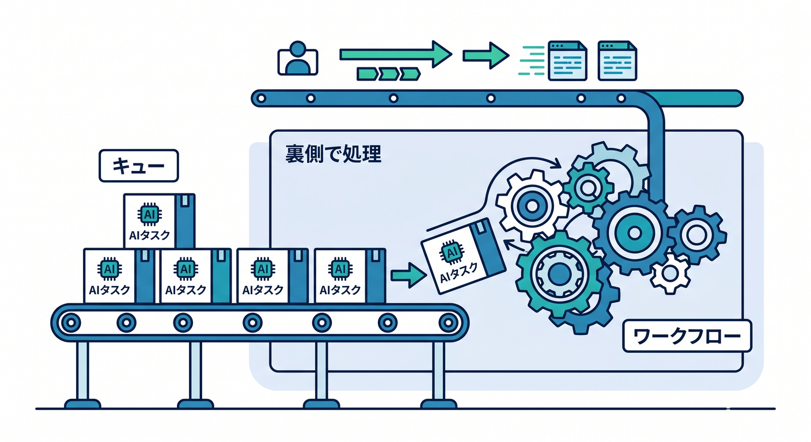
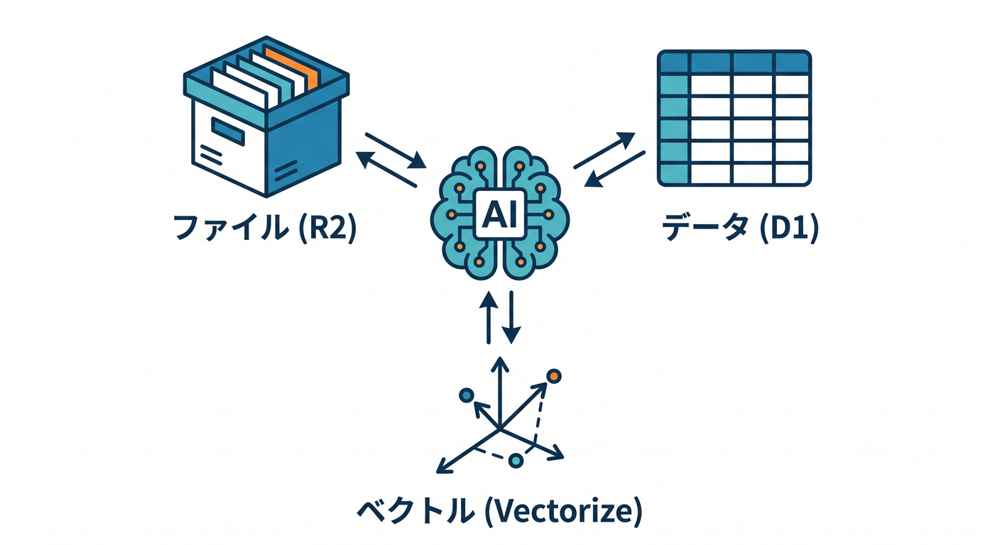

# Cloudflare Workers AIでAI機能を1本入れてみる 15章アウトライン 🤖✨

確認日: 2026-04-24  
主な確認先: Cloudflare Workers AI Overview / Get started with Workers and Wrangler / Workers AI bindings / Models catalog / Text Generation / Text Embeddings / Text Classification / JSON Mode / Prompting / Streaming / Limits / Pricing 公式ドキュメント

## 第1章　Workers AIって何だろう 🤖

Workers AIは、Cloudflareのglobal network上でAIモデルをserverlessに実行できるサービスです。  
サーバーやGPU管理を自分で持たず、Workerから `env.AI.run()` でAIを呼び出せます。  

文章生成、要約、分類、埋め込み、画像関連など、Model Catalogから用途に合うモデルを選びます。  
この章では、AIを「外部の別世界」ではなくCloudflareアプリの一部として見る感覚を育てます 😊  
この章のゴールは、Workers AIでできることをざっくり説明できることです ✅

## 第2章　AI bindingをWorkerに追加しよう 🔌

Workers AIをWorkerから使うには、`wrangler.jsonc` に `ai` bindingを追加します。  
公式のGet startedでは、`"ai": { "binding": "AI" }` を設定し、Worker側で `env.AI` として使う流れが案内されています。  
TypeScriptでは `Env` 型に `AI: Ai` を書きます。  

まずは「Hello AI」として短い質問に答えるAPIを作ります。  
この章のゴールは、WorkerからWorkers AIを呼ぶ準備をすることです 🛠️

## 第3章　最初の文章生成APIを作ろう ✍️

最初はテキスト生成モデルに短いpromptを渡して、回答を返します。  
`env.AI.run("@cf/meta/llama-3.1-8b-instruct", { prompt })` のような形を使います。  
Reactから直接AIへ触らせず、Worker APIを入口にして入力チェックします。  
長すぎるpromptや空文字を止め、JSONで返す基本を学びます 🔐  
この章のゴールは、最小のAI APIをTypeScriptで作れることです。

## 第4章　Promptの書き方を学ぼう 🧠

AIの出力は、promptの書き方で大きく変わります。  
「何をしてほしいか」「どんな形式で返すか」「制約は何か」を明確にします。  
初心者向けには、短く具体的なpromptから始めます。  
Cloudflare WorkersのPrompting関連ドキュメントも参考にしながら、実装しやすいpromptを作ります。  
この章のゴールは、AIに伝わりやすい指示を書けることです。

## 第5章　要約APIを作ろう 📝

長い文章を短くまとめる要約APIを作ります。  
ニュース、議事録、学習メモ、問い合わせ本文などを題材にします。  
Workerで文字数制限を入れ、AIには「3行で要約」「箇条書きで要約」のように形式を指定します。  
ログには本文全文を出さず、requestIdや文字数だけを記録します 🔐  
この章のゴールは、安全な要約APIを作ることです。

## 第6章　分類APIを作ろう 🏷️

分類は、文章をカテゴリへ分けるAI機能です。  
問い合わせを「料金」「不具合」「使い方」へ分けたり、投稿の種類を判定したりできます。  
Model CatalogにはText Classification向けのモデルもあります。  
出力を自由文にしすぎず、許可したカテゴリだけに寄せる設計を学びます。  
この章のゴールは、AI分類をアプリの入力整理に使えることです。

## 第7章　Embeddingsを理解しよう 🧭

Embeddingsは、文章の意味を数字のベクトルに変換する考え方です。  
検索、レコメンド、似ている文章探し、RAGの基礎になります。  

Workers AIにはText Embeddings向けモデルがあります。  
最初は「文章をベクトルにする」だけを体験し、Vectorize連携は次章以降への橋にします。  
この章のゴールは、embeddingsの役割をやさしく説明できることです。

## 第8章　ReactからAI APIを呼ぼう ⚛️

Worker側にAI APIを作ったら、React画面から呼び出します。  
入力欄、実行ボタン、ローディング、エラー表示、結果表示を作ります。  
AI処理は時間がかかることがあるので、送信中状態を丁寧に扱います。  

連打対策、Rate Limiting、Turnstileなども必要に応じて考えます 🔐  
この章のゴールは、AI機能をユーザー画面へ自然に組み込むことです。

## 第9章　Streamingで少しずつ返す体験を知ろう ⚡

AIの回答は長くなることがあります。  
Streamingを使うと、回答を少しずつ画面へ表示する体験を作れます。  
対応モデルやレスポンス形式を確認し、最初は通常レスポンス、発展としてstreamingを学びます。  
React側では、受信中の表示とキャンセルの考え方も出てきます。  
この章のゴールは、AIらしい応答体験の基本を理解することです。

## 第10章　JSON Modeと形式固定を学ぼう 🧾

AIの出力をアプリで使うなら、JSONなど決まった形式で返してほしい場面があります。  
Workers AIにはJSON Modeなど、構造化出力に関係する機能があります。  
ただし、AIの出力は必ず検証してから使います。  
Zodなどでschema validationを入れる発想も学びます 🧪  
この章のゴールは、AI出力をアプリデータとして安全に扱うことです。

## 第11章　AI Gatewayとログ・コスト管理を考えよう 📈

Workers AIを含むAI機能は、使いすぎや失敗の観測が大切です。  
AI Gatewayを使うと、AIリクエストの観測、制御、キャッシュなどを考えやすくなります。  
Workers AIのpricingやlimits、Neuron使用量も確認します。  
requestId、model、durationMs、statusをログへ残し、prompt全文は出しすぎないようにします 🔐  
この章のゴールは、AI機能を運用目線で見ることです。

## 第12章　安全なAI APIにしよう 🔐

AI APIはコストがかかるため、誰でも無制限に使える設計は危険です。  
認証、Rate Limiting、Turnstile、入力長制限、禁止語や用途制限を考えます。  
secretやAPI tokenをブラウザへ出さないのは基本です。  
AIの回答をそのまま信用しすぎず、ユーザーへ注意書きや確認導線を用意します。  
この章のゴールは、AI APIを安全に公開するための基本を理解することです。

## 第13章　Queues・WorkflowsでAI処理を裏側へ逃がそう ⏳

長いAI処理や大量のembeddings生成は、リクエスト中に全部やらない設計が向いています。  
Queuesでjobを分け、Workflowsで多段処理を管理します。  

D1にstatusを保存し、React画面では「処理中」「完了」「失敗」を表示します。  
AI処理のretryや二重実行対策も学びます 🔁  
この章のゴールは、AI処理を安定して非同期化する発想を持つことです。

## 第14章　R2・D1・Vectorizeと組み合わせよう 🧩

AIアプリは、AIだけでは完成しません。  
ファイル本体はR2、履歴やメタデータはD1、意味検索はVectorize、AI推論はWorkers AIのように分けます。  

学習メモ要約、画像説明、FAQ検索などの構成例を見ます。  
第23章のAI Gateway・Vectorize・AI Searchへ自然につながる橋にします。  
この章のゴールは、AI機能と保存先を組み合わせて設計できることです。

## 第15章　小さなAI学習メモアプリを完成させよう 📚

最後はReact + Workers + Workers AIで、小さなAI学習メモアプリを作ります。  
ユーザーがメモを入力し、AIが要約、タグ分類、復習クイズを作ります。  
D1にメモと結果を保存し、必要ならR2やQueuesへ発展させます。  
ログ、Rate Limiting、入力チェック、Copilotレビュー、pricing確認までまとめます ✅  
この章のゴールは、AI機能をCloudflareアプリの一部として組み込めることです。

---

## 参照URL

- https://developers.cloudflare.com/workers-ai/
- https://developers.cloudflare.com/workers-ai/get-started/workers-wrangler/
- https://developers.cloudflare.com/workers-ai/configuration/bindings/
- https://developers.cloudflare.com/workers-ai/models/
- https://developers.cloudflare.com/workers-ai/features/json-mode/
- https://developers.cloudflare.com/workers-ai/configuration/open-ai-compatible-endpoints/
- https://developers.cloudflare.com/workers-ai/platform/limits/
- https://developers.cloudflare.com/workers-ai/platform/pricing/
- https://developers.cloudflare.com/workers-ai/platform/errors/
- https://developers.cloudflare.com/workers-ai/features/prompting/
- https://developers.cloudflare.com/ai-gateway/
- https://developers.cloudflare.com/vectorize/
- https://developers.cloudflare.com/queues/
- https://developers.cloudflare.com/workflows/
