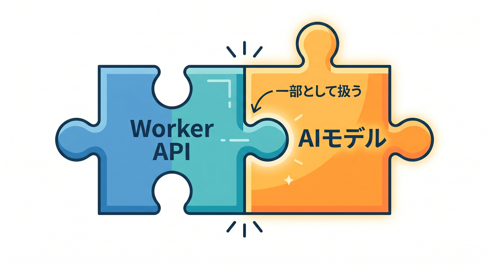
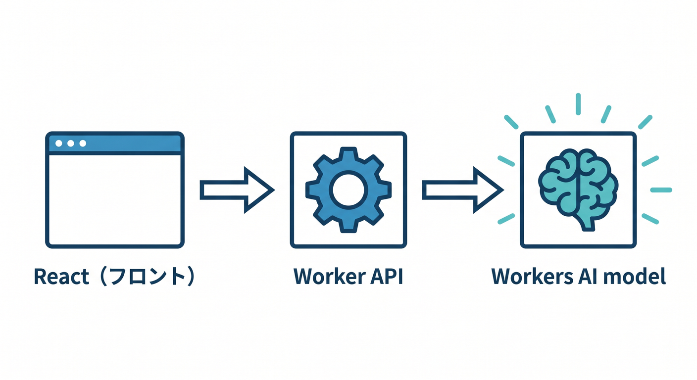
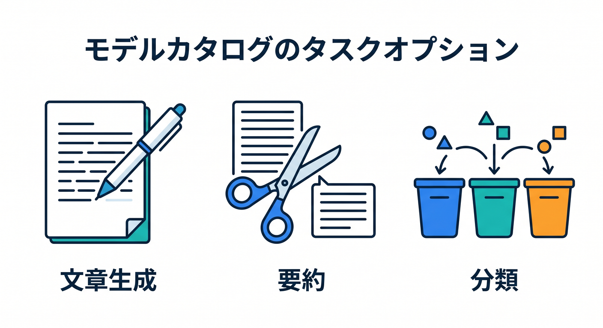
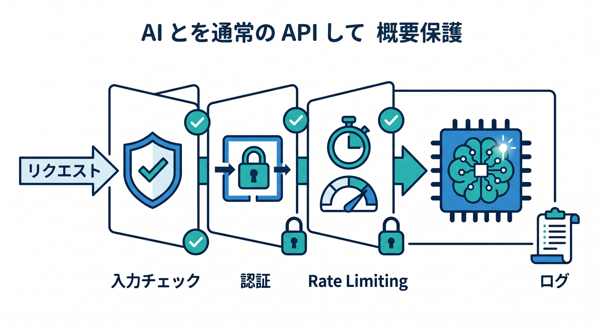
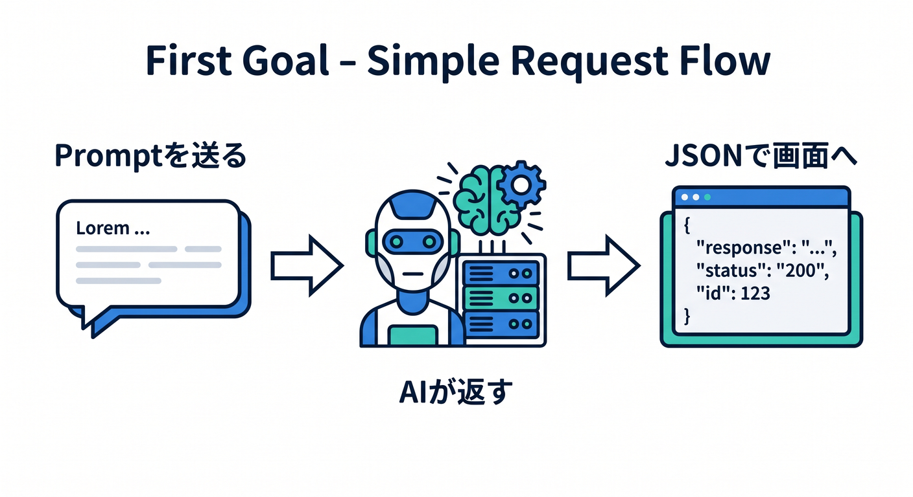

# 第01章：Workers AIって何だろう 🤖

Cloudflare Workers AIは、WorkerからAIモデルを呼び出せるサービスです。  
AIを「別の難しい世界」ではなく、今まで作ってきたWorker APIの一部として扱えるようになります 😊


---

## 1. Workers AIのイメージ 🧭

Workers AIでは、Cloudflareのglobal network上でAIモデルをserverlessに実行できます。  
自分でGPUサーバーを用意したり、モデル配信基盤を管理したりしなくても、Workerから呼び出せます。

```text
React
  ↓ fetch
Worker API
  ↓ env.AI.run()
Workers AI model
```

入口はいつものWorker APIです。


---

## 2. 何ができる？ ✨

Model Catalogには、さまざまなタスクのモデルがあります。

- 文章生成
- 要約
- 分類
- 質問応答
- Text embeddings
- 画像関連
- 音声関連

最初は文章生成、要約、分類から始めると分かりやすいです。


---

## 3. AIもアプリの一部 🧩

AI機能も、普通のAPIと同じように設計します。

```text
入力チェック
認証
Rate Limiting
ログ
エラー処理
コスト確認
```

AIだけ特別扱いしすぎず、Cloudflareアプリの一部として考えます。


---

## 4. 最初のゴール 🎯

この章では、難しいAI理論は扱いません。  
まずは「WorkerからAIを呼んで、結果を返す」感覚をつかみます。

```text
promptを送る
  ↓
AIが返す
  ↓
JSONで画面へ返す
```

これが第一歩です。


---

## 5. 章末チェック ✅

- Workers AIはWorkerからAIモデルを呼べるサービスだと分かる
- GPUサーバー管理なしで使えると分かる
- 文章生成、要約、分類、embeddingsなどがあると分かる
- AIも入力チェックやログが必要だと分かる
- 最初は小さなAI APIから始めればよいと分かる

この章で覚える一言はこれです。  
**Workers AIは、Cloudflare WorkerにAI機能を足すための入口です 🤖**
