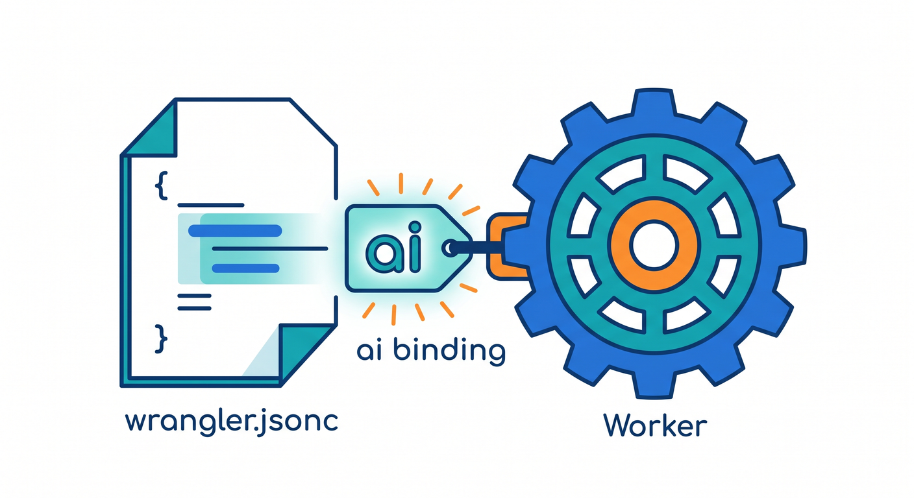
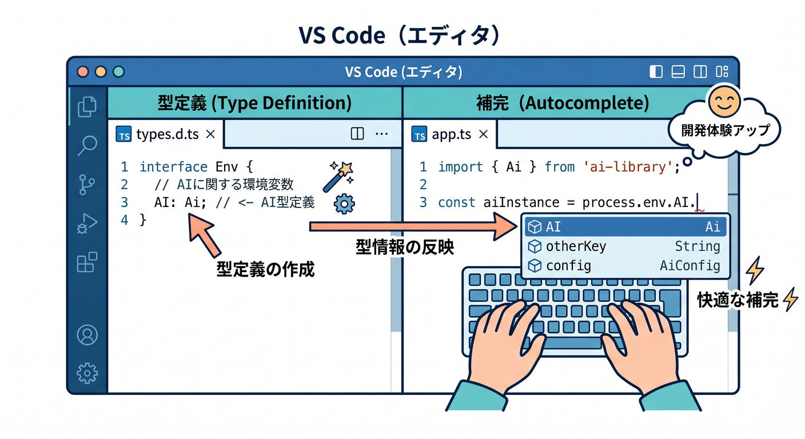
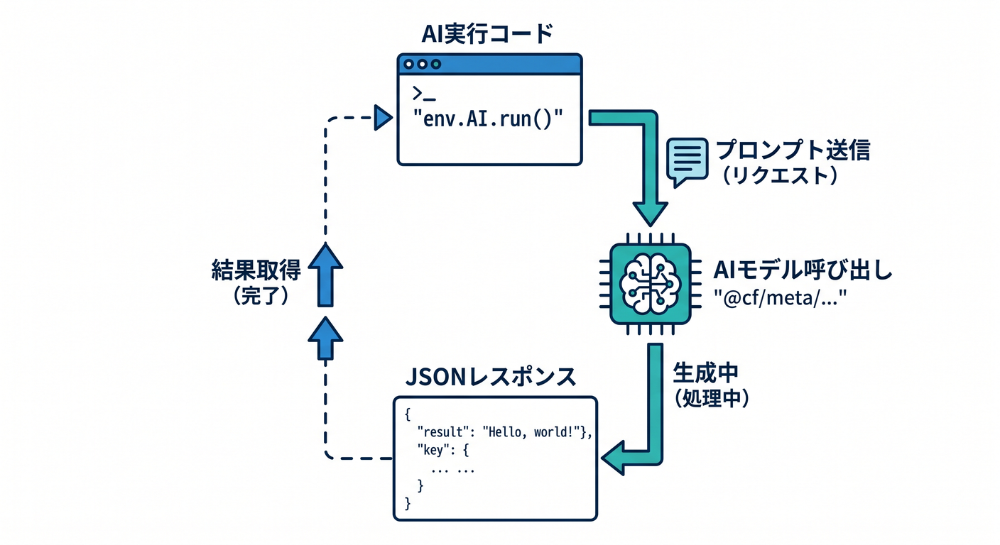
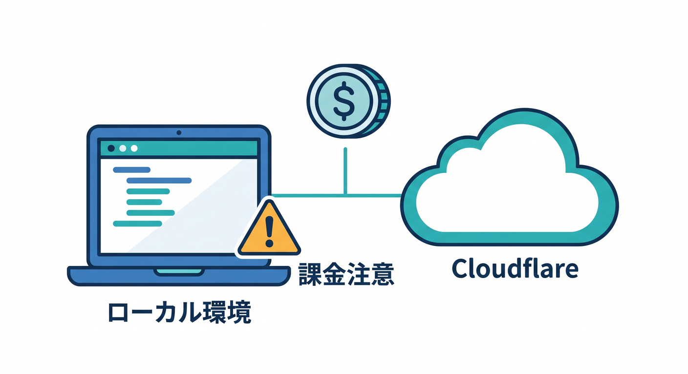
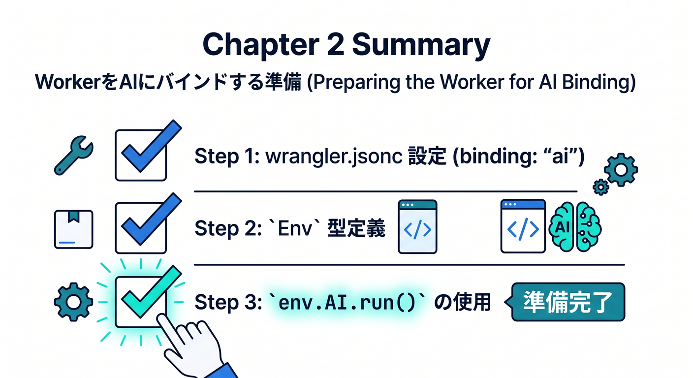

# 第02章：AI bindingをWorkerに追加しよう 🔌

Workers AIを使うには、WorkerへAI bindingを追加します。  
bindingは、WorkerからCloudflareの機能へアクセスするための名前です。

---

## 1. wrangler.jsoncにaiを書く ⚙️

公式Get startedでは、次のように設定します。

```jsonc
{
  "ai": {
    "binding": "AI"
  }
}
```

これでWorkerの中から `env.AI` を使えるようになります。


---

## 2. TypeScriptのEnv型 🧩

TypeScriptでは、Env型も書きます。

```ts
export interface Env {
  AI: Ai;
}
```

型があると、VS CodeやCopilotが `env.AI.run()` を理解しやすくなります。


---

## 3. 最小のAI呼び出し 🚀

まずは短いpromptを固定で送ります。

```ts
export default {
  async fetch(request, env): Promise<Response> {
    const result = await env.AI.run("@cf/meta/llama-3.1-8b-instruct", {
      prompt: "Cloudflare Workers AIを一言で説明して",
    });

    return Response.json(result);
  },
} satisfies ExportedHandler<Env>;
```

動いたら、次の章でユーザー入力を受け取ります。


---

## 4. ローカルでも課金に注意 💰

公式ドキュメントでは、Wranglerのローカル開発でもWorkers AIはCloudflareアカウントへアクセスし、使用量が発生する可能性があると案内されています。  
学習中も、何度も無限に呼ばないようにします。


---

## 5. 章末チェック ✅

- `ai.binding` の設定が分かる
- `env.AI` として使えると分かる
- Env型に `AI: Ai` を書ける
- `env.AI.run()` の最小形が分かる
- ローカル開発でも使用量に注意すると分かる

この章で覚える一言はこれです。  
**Workers AIは、ai bindingを追加してenv.AI.run()で呼び出します 🔌**

