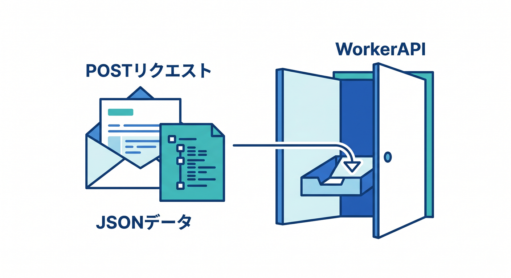
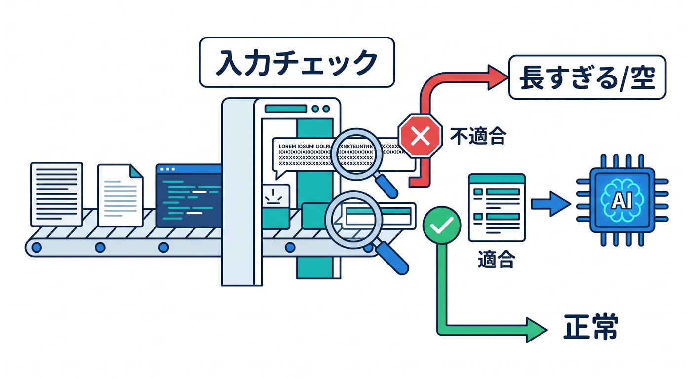
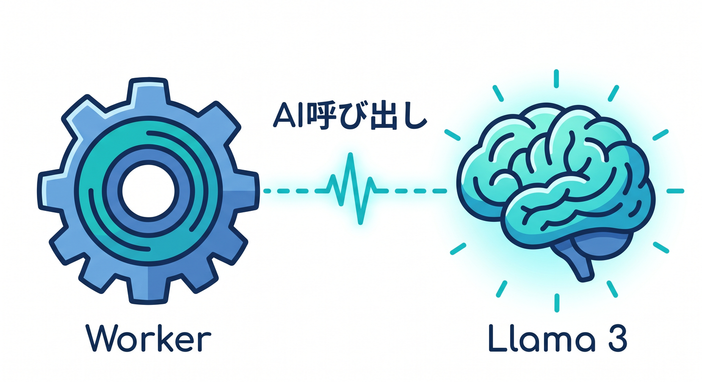
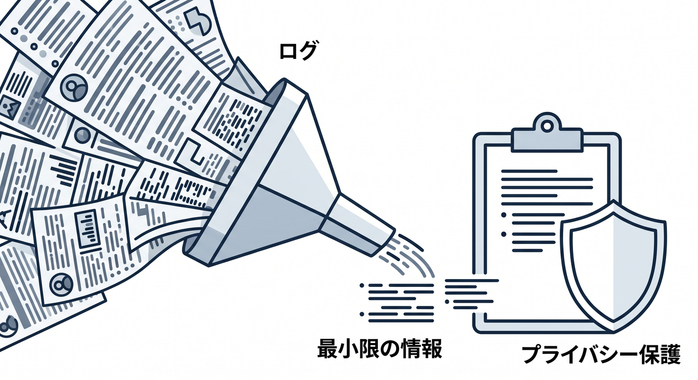
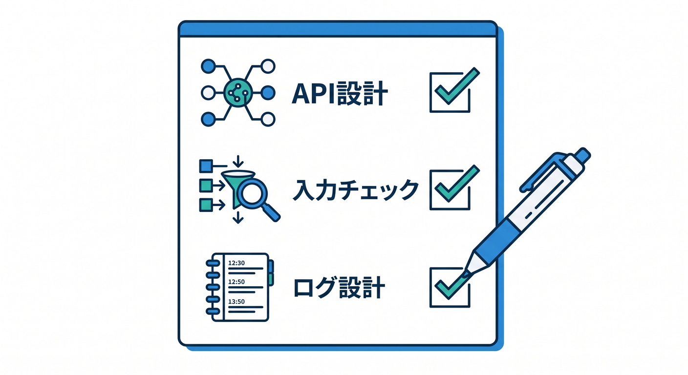

# 第03章：最初の文章生成APIを作ろう ✍️

ここでは、ユーザーが送った文章をもとにAIが返事をするAPIを作ります。  
Reactから直接AIへ触らせず、Worker APIを入口にします。

---

## 1. POSTでpromptを受け取る 🚪



WorkerでJSONを受け取ります。

```ts
type GenerateRequest = {
  prompt?: string;
};

export default {
  async fetch(request, env): Promise<Response> {
    if (request.method !== "POST") {
      return new Response("Method Not Allowed", { status: 405 });
    }

    const body = await request.json<GenerateRequest>();
    return handleGenerate(body, env);
  },
} satisfies ExportedHandler<Env>;
```

まずWorkerで受けてからAIへ渡します。

---

## 2. 入力チェックする 🔐



AI APIはコストがかかるので、入力チェックが大切です。

```ts
if (!body.prompt || body.prompt.trim().length === 0) {
  return Response.json({ error: "prompt is required" }, { status: 400 });
}

if (body.prompt.length > 1000) {
  return Response.json({ error: "prompt is too long" }, { status: 400 });
}
```

空文字や長すぎる入力を止めます。

---

## 3. AIへ渡す 🤖



チェック後に `env.AI.run()` を呼びます。

```ts
async function handleGenerate(
  body: GenerateRequest,
  env: Env
): Promise<Response> {
  const result = await env.AI.run("@cf/meta/llama-3.1-8b-instruct", {
    prompt: body.prompt,
  });

  return Response.json({ result });
}
```

最初はモデル名を1つ決めて試します。

---

## 4. ログは最小限に 📝



prompt全文をログに出しすぎないようにします。

```ts
console.log("ai generate requested", {
  promptLength: body.prompt.length,
});
```

調査に必要な情報だけを残します。

---

## 5. 章末チェック ✅



- POST APIでpromptを受け取れる
- Reactから直接AIへ触らせないと分かる
- 空文字や長すぎるpromptを止められる
- `env.AI.run()` で文章生成できる
- prompt全文をログへ出しすぎないと分かる

この章で覚える一言はこれです。  
**AI APIも普通のAPIと同じく、入力チェックとログ設計が大切です ✍️**
