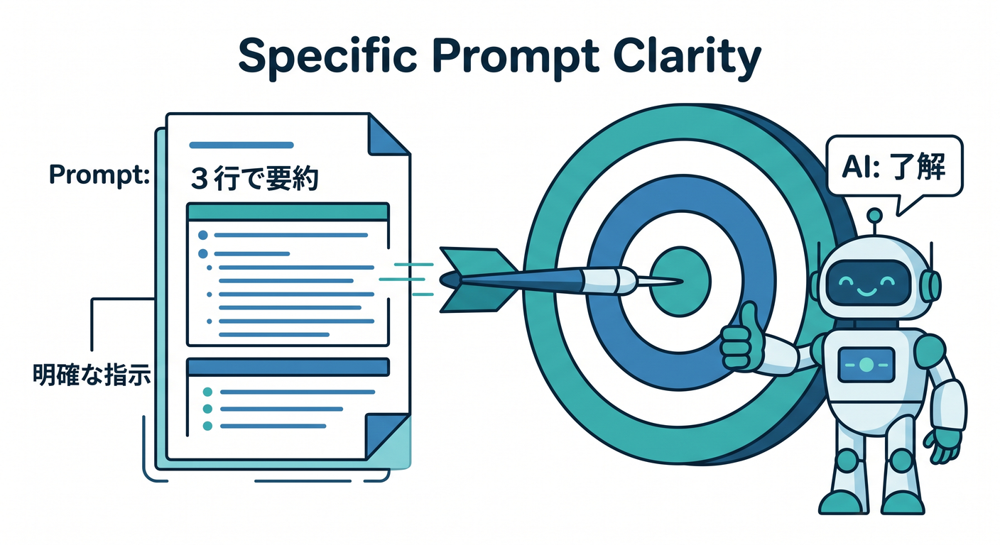
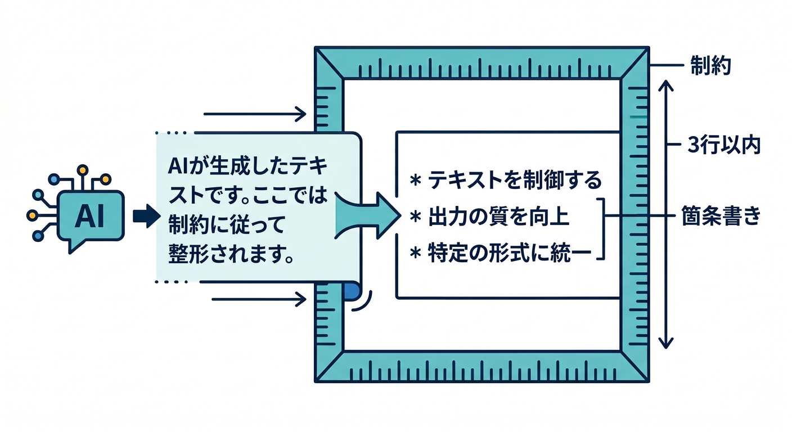

# 第04章：Promptの書き方を学ぼう 🧠

AIの出力は、promptの書き方でかなり変わります。  
難しく考えすぎず、「何を、どんな形で、どんな条件で」を伝えるところから始めます。

---

## 1. あいまいなprompt 😵


次のpromptは少しあいまいです。

```text
これをいい感じにして
```

AIは何をすればよいか迷います。  
要約なのか、翻訳なのか、敬語化なのか分かりません。

---

## 2. 具体的なprompt ✅



目的と形式を入れます。

```text
次の文章を、初心者向けに3行で要約してください。
専門用語はできるだけ避けてください。
```

こうすると、出力の方向が安定しやすくなります。

---

## 3. アプリ用promptの型 🧩


アプリでは、テンプレート化すると便利です。

```ts
function createSummaryPrompt(text: string): string {
  return `
次の文章を、文系大学生にも分かるように3行で要約してください。

文章:
${text}
`;
}
```

毎回同じルールでAIへ依頼できます。

---

## 4. 制約を入れる 🔐



出力形式や禁止事項も書きます。

```text
条件:
- 3行以内
- 箇条書き
- 推測で断定しない
- 分からない場合は「分かりません」と書く
```

AIに期待する振る舞いを具体的に伝えます。

---

## 5. 章末チェック ✅


- あいまいなpromptの問題が分かる
- 目的と形式を入れると分かる
- promptを関数化できる
- 出力条件を明確にできる
- AIに推測で断定させない工夫が分かる

この章で覚える一言はこれです。  
**Promptは、AIに渡す“作業依頼書”です 🧠**
