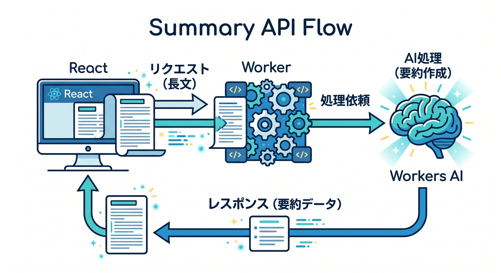
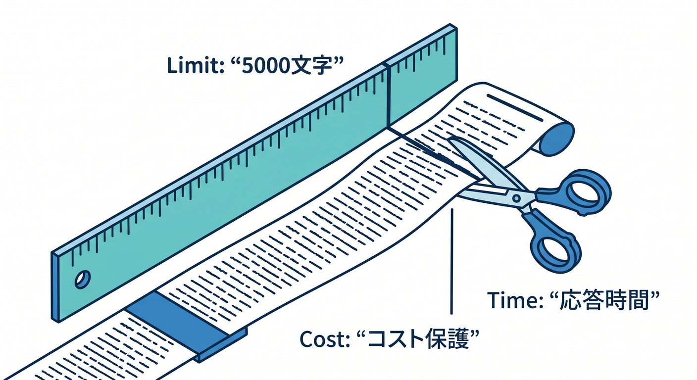
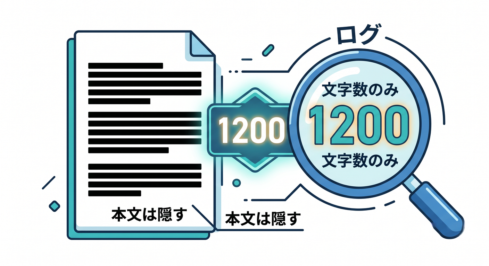

# 第05章：要約APIを作ろう 📝

要約は、AI機能の中でも分かりやすい題材です。  
長い文章を短く整理して、ユーザーが読みやすい形にします。

---

## 1. 要約APIの流れ 🧭



構成はこうです。

```text
React
  ↓ POST /api/summarize
Worker
  ↓ env.AI.run()
Workers AI
  ↓
JSONで要約を返す
```

まずは短い学習メモを要約する例で進めます。

---

## 2. 入力制限を入れる 🔐



長すぎる文章は止めます。

```ts
if (!body.text || body.text.length > 5000) {
  return Response.json({ error: "Invalid text" }, { status: 400 });
}
```

AI APIのコストや応答時間を守るためです。

---

## 3. 要約promptを作る ✍️


形式を指定します。

```ts
const prompt = `
次の文章を3行で要約してください。
初心者にも分かる言葉を使ってください。

文章:
${body.text}
`;
```

「3行」「初心者向け」のように条件を入れます。

---

## 4. ログは本文ではなく長さ 📝



本文全文をログに出すと、個人情報が混ざる可能性があります。

```ts
console.log("summary requested", {
  textLength: body.text.length,
});
```

ログには調査に必要な最小限の情報だけを残します。

---

## 5. 章末チェック ✅


- 要約APIの流れが分かる
- 入力文字数制限を入れられる
- 要約promptを作れる
- 本文全文をログへ出しすぎない
- Reactから使いやすいJSONで返せる

この章で覚える一言はこれです。  
**要約APIは、長い情報をユーザーが読みやすい形にするAI機能です 📝**
