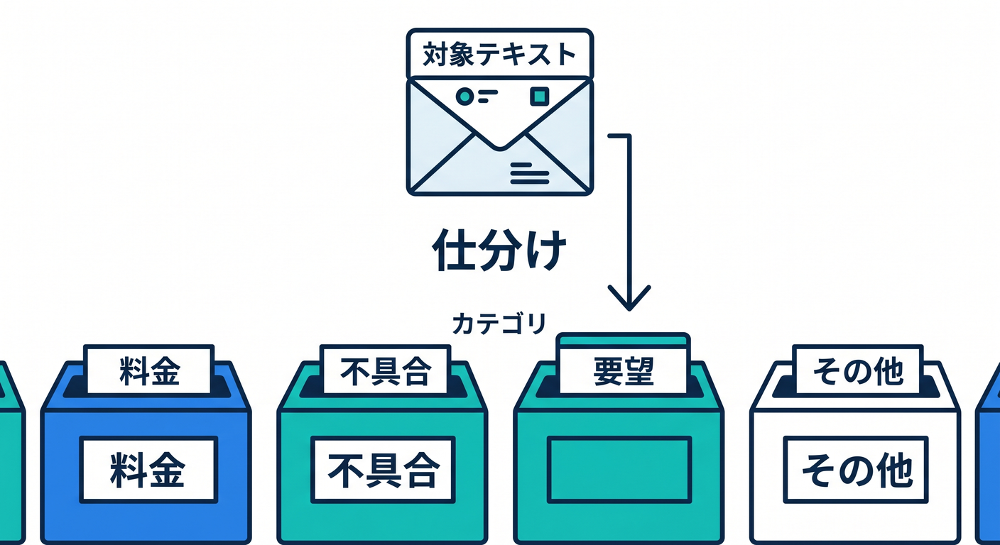
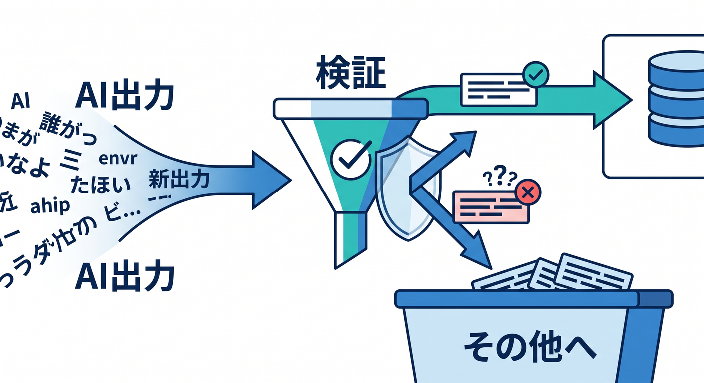
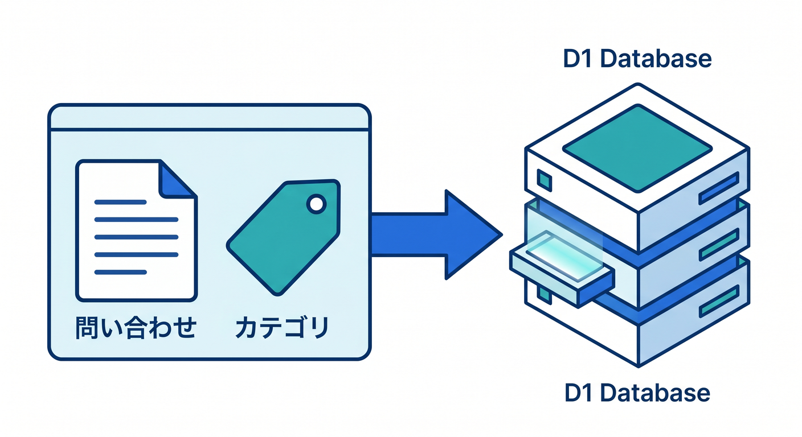
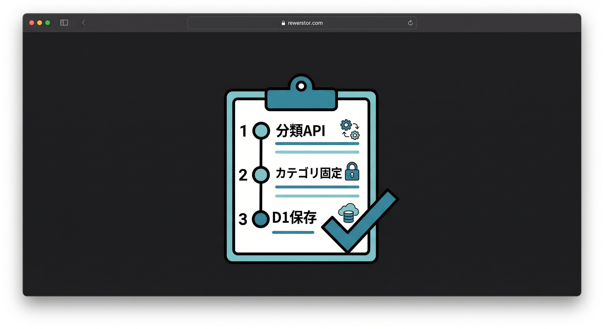

# 第06章：分類APIを作ろう 🏷️

分類APIは、文章をカテゴリへ分けるAI機能です。  
問い合わせ管理や投稿整理など、実務でも使いやすい題材です。

---

## 1. 分類の例 📋



たとえば、お問い合わせを分類します。

```text
料金
不具合
使い方
解約
その他
```

人が毎回読んで分ける前に、AIで候補を付けられます。

---

## 2. カテゴリを固定する 🧭


自由に答えさせると、カテゴリが増えすぎます。

```text
次のカテゴリのどれか1つだけで答えてください。
料金 / 不具合 / 使い方 / 解約 / その他
```

アプリで扱うなら、許可カテゴリを固定するのが大切です。

---

## 3. Workerで検証する 🧪



AIの返答も検証します。

```ts
const allowed = ["料金", "不具合", "使い方", "解約", "その他"];

if (!allowed.includes(category)) {
  return Response.json({ category: "その他" });
}
```

AIの出力をそのまま信用しすぎません。

---

## 4. D1に保存する 🗄️



分類結果は、問い合わせと一緒にD1へ保存できます。

```sql
CREATE TABLE contacts (
  id TEXT PRIMARY KEY,
  message TEXT NOT NULL,
  category TEXT NOT NULL,
  created_at TEXT NOT NULL
);
```

あとで管理画面で絞り込みやすくなります。

---

## 5. 章末チェック ✅



- 分類APIの使いどころが分かる
- カテゴリを固定する理由が分かる
- AIの出力を検証できる
- D1へ分類結果を保存できる
- 問い合わせ整理にAIを使える

この章で覚える一言はこれです。  
**分類APIは、文章をアプリで扱いやすいカテゴリへ整理する機能です 🏷️**
