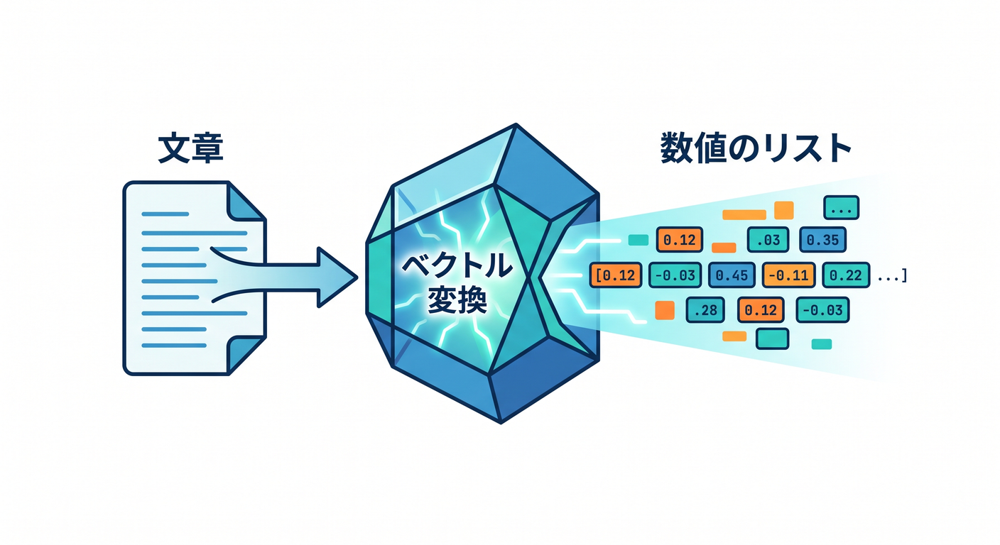
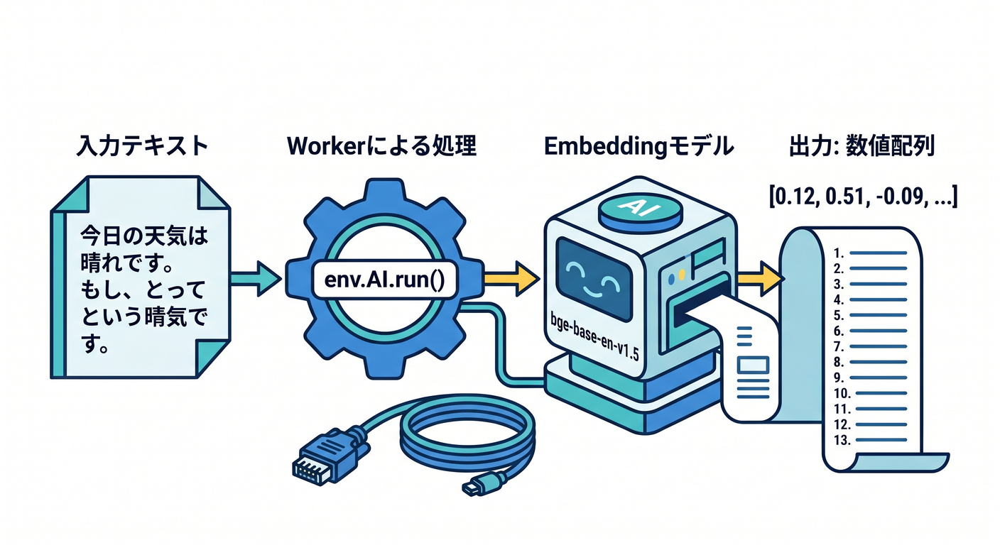
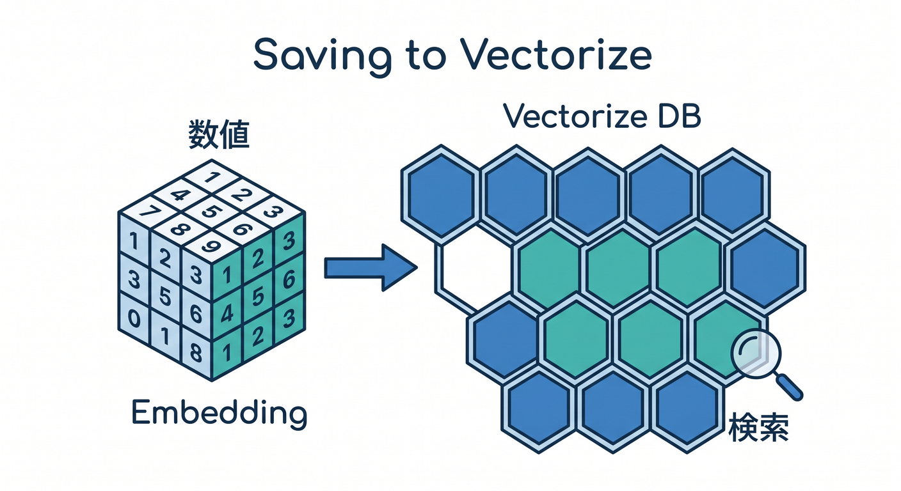
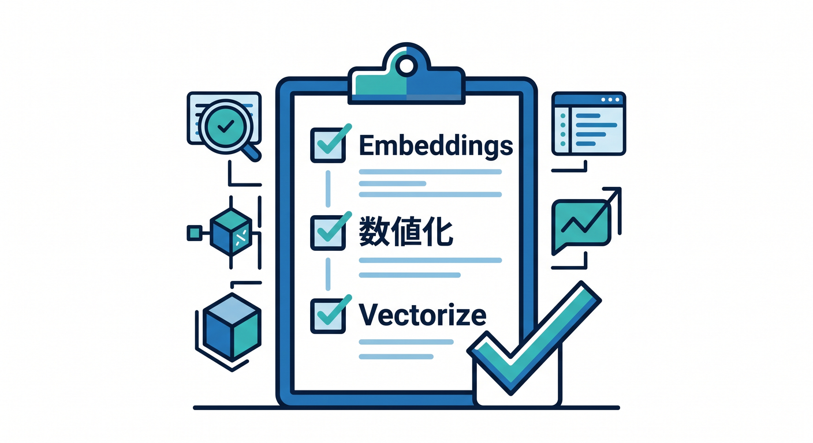

# 第07章：Embeddingsを理解しよう 🧭

Embeddingsは、AI検索やRAGに進むための大事な考え方です。  
最初は「文章の意味を数字にする」と理解すれば大丈夫です。

---

## 1. 文章を数字にする 🔢



コンピューターは、文章の意味をそのまま比べるのが苦手です。  
そこで、文章を数値のリストに変換します。

```text
"Cloudflare Workersを学ぶ"
  ↓
[0.12, -0.03, 0.91, ...]
```

この数値のリストがembeddingです。

---

## 2. 何に使う？ 🔎


Embeddingsは、意味の近さを扱うのに使います。

- 似ている文章を探す
- FAQ検索
- 学習メモ検索
- レコメンド
- RAG

キーワードが完全一致しなくても、意味が近いものを探せます。

---

## 3. Workers AIでembeddingを作る 🤖



Workers AIにはText Embeddings向けモデルがあります。

```ts
const result = await env.AI.run("@cf/baai/bge-base-en-v1.5", {
  text: ["Cloudflare Workersを学ぶ"],
});
```

使うモデルや入力形式は、Model Catalogで確認します。

---

## 4. 保存先はVectorizeへ 🧩



embeddingを検索に使うなら、Vectorizeが候補になります。

```text
文章 → Workers AIでembedding → Vectorizeへ保存 → 意味検索
```

この章では入口だけ学び、詳しいVectorizeは次のAI発展章につなげます。

---

## 5. 章末チェック ✅



- embeddingsは文章を数字にする考え方だと分かる
- 似ている文章探しに使えると分かる
- Workers AIでembeddingを作れる
- Vectorizeと組み合わせる発想が分かる
- RAGの基礎につながると分かる

この章で覚える一言はこれです。  
**Embeddingsは、文章の意味を検索しやすい数字に変える技術です 🧭**
