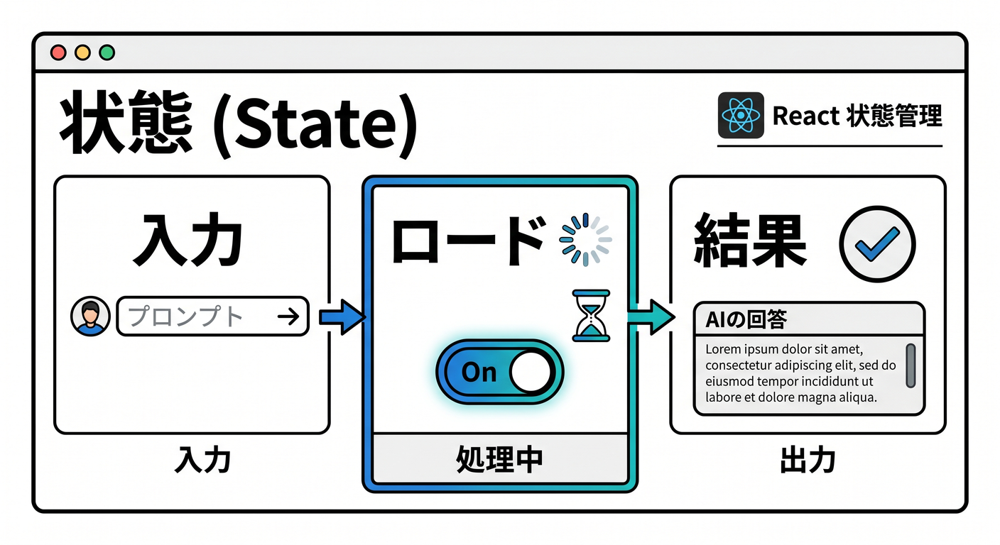
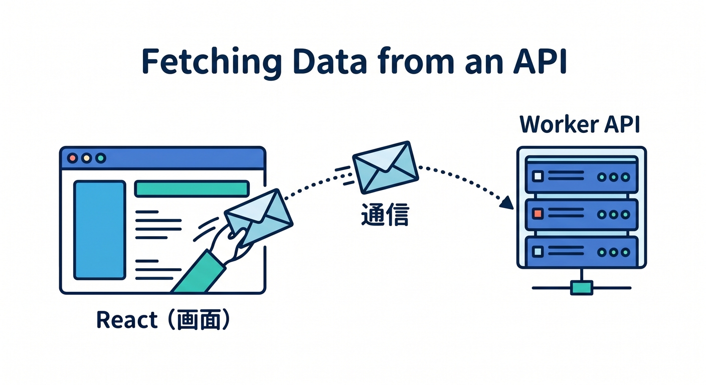
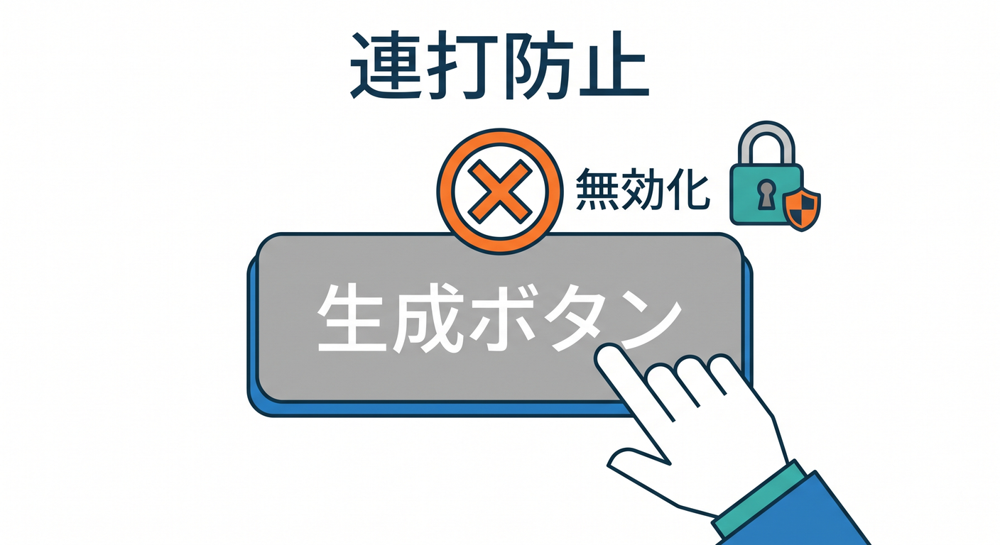
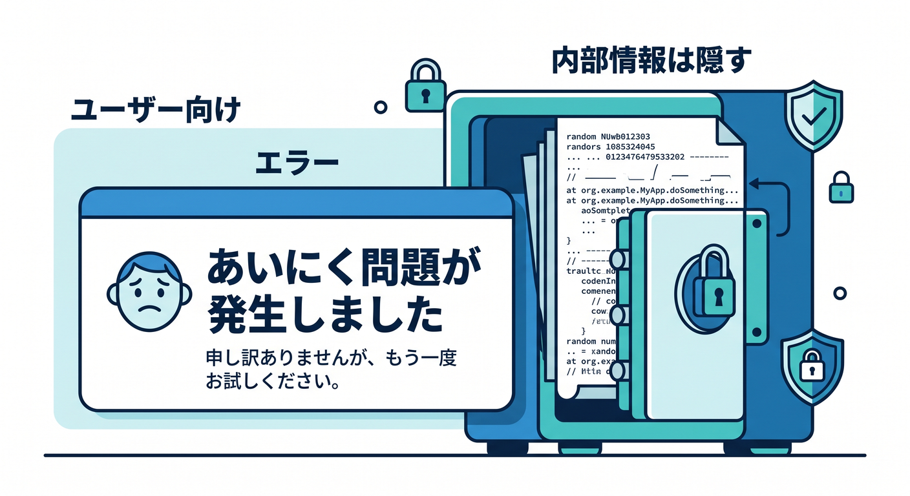
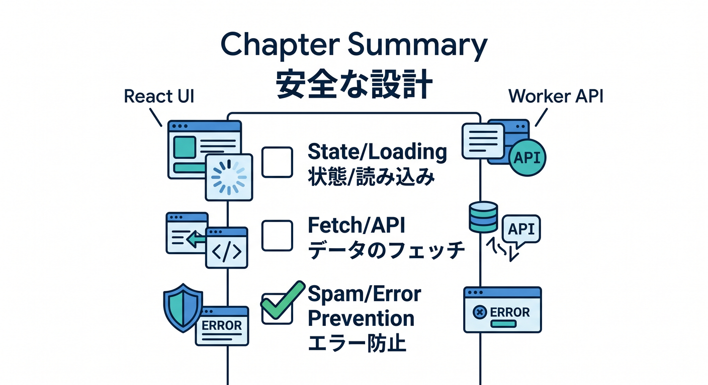

# 第08章：ReactからAI APIを呼ぼう ⚛️

WorkerにAI APIを作ったら、React画面から使えるようにします。  
ユーザーが入力し、AIの結果を画面で見られる形にします。

---

## 1. 画面に必要な状態 🧩



React側では、最低限この状態を持ちます。

```ts
const [prompt, setPrompt] = useState("");
const [result, setResult] = useState("");
const [loading, setLoading] = useState(false);
const [error, setError] = useState("");
```

AI処理は少し時間がかかるので、`loading` が大切です。

---

## 2. fetchで呼び出す 📞



Worker APIへPOSTします。

```ts
async function runAi() {
  setLoading(true);
  setError("");

  const response = await fetch("/api/generate", {
    method: "POST",
    headers: { "Content-Type": "application/json" },
    body: JSON.stringify({ prompt }),
  });

  const data = await response.json();
  setResult(data.result?.response ?? "");
  setLoading(false);
}
```

実際には `try/catch` で通信失敗も扱います。

---

## 3. 連打対策 🔐



AI APIはコストがかかるため、連打対策をします。

```tsx
<button disabled={loading || prompt.trim() === ""} onClick={runAi}>
  {loading ? "生成中..." : "生成する"}
</button>
```

サーバー側でもRate Limitingを入れると安心です。

---

## 4. エラー表示 🧯



ユーザーには、分かりやすいエラーを出します。

```tsx
{error && <p role="alert">{error}</p>}
```

内部エラーやstack traceは画面に出しません。

---

## 5. 章末チェック ✅



- ReactからWorker AI APIを呼べる
- loading状態を扱える
- 連打対策が必要だと分かる
- 通信エラーを画面に出せる
- 内部情報を画面へ出さないと分かる

この章で覚える一言はこれです。  
**ReactからはWorker APIを呼び、AI処理中の状態を丁寧に見せます ⚛️**
