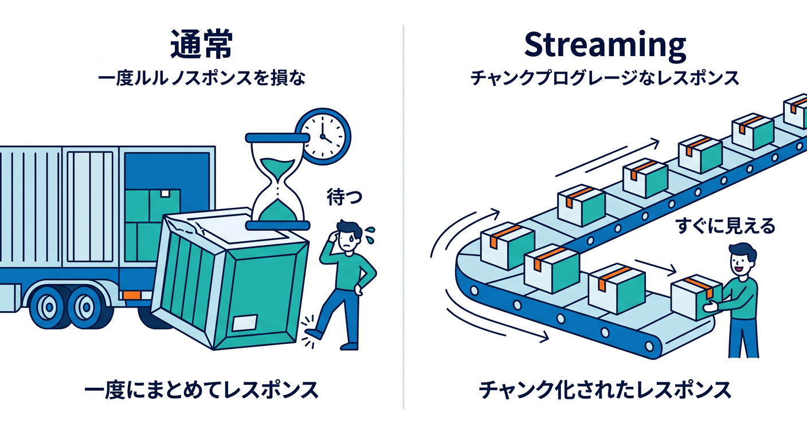
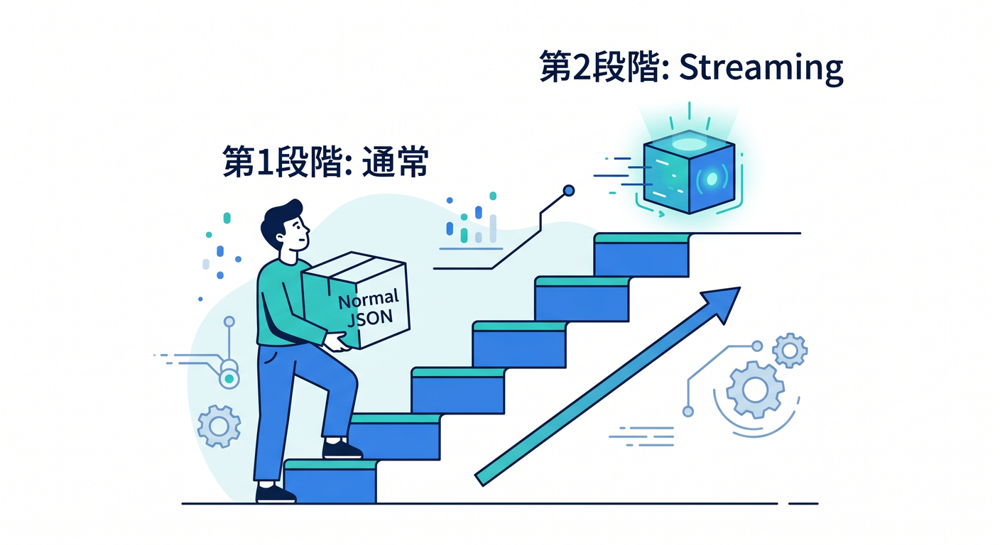
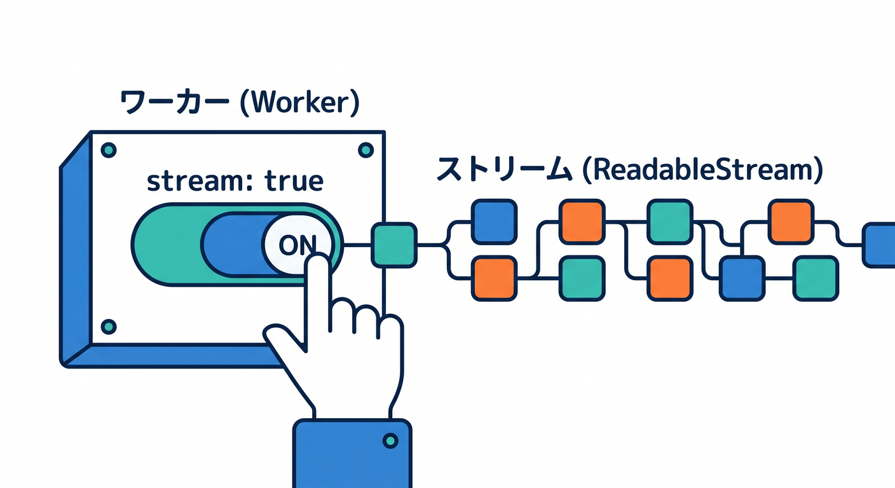
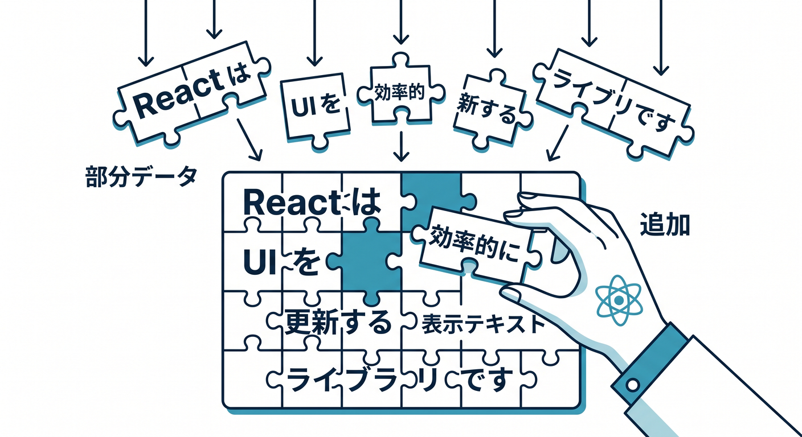
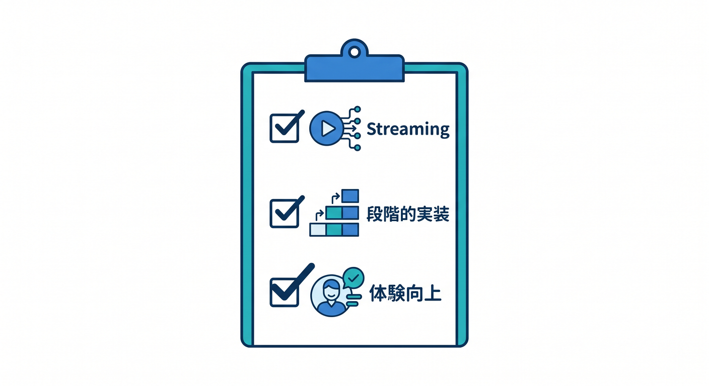

# 第09章：Streamingで少しずつ返す体験を知ろう ⚡

AIの回答が長いと、全部できるまで待つのは少し退屈です。  
Streamingを使うと、回答を少しずつ表示できます。

---

## 1. 通常レスポンスとStreaming 🧭



通常は、全部できてから返します。

```text
AIが全部生成
  ↓
まとめて画面に表示
```

Streamingでは、生成された部分から順に返します。

```text
少し生成 → 表示
少し生成 → 表示
少し生成 → 表示
```

チャットらしい体験になります。

---

## 2. まずは通常で十分 🌱



初心者は、まず通常レスポンスでAI APIを作れば大丈夫です。  
Streamingは、画面体験をよくする発展機能として考えます。

```text
第1段階: 通常JSON
第2段階: Streaming
```

段階的に進めると混乱しにくいです。

---

## 3. Worker側の考え方 🧩



対応モデルやAPI形式を確認し、streaming用のレスポンスを返します。  
実装するときは、Cloudflare WorkersのStreams APIやWorkers AIの対応形式を確認します。

```text
env.AI.run(..., { stream: true })
  ↓
ReadableStreamとして返す
```

モデルによって対応状況が違うため、Model Catalogを見ます。

---

## 4. React側の考え方 ⚛️



Reactでは、受信したchunkを少しずつstateへ追加します。

```text
chunkを受け取る
  ↓
表示テキストへ追加
  ↓
次のchunkを待つ
```

キャンセルや再送信も考えると、少し高度になります。

---

## 5. 章末チェック ✅



- Streamingは少しずつ返す体験だと分かる
- 最初は通常レスポンスでよいと分かる
- 対応モデルの確認が必要だと分かる
- React側ではchunkを追加表示すると分かる
- チャット体験がよくなると分かる

この章で覚える一言はこれです。  
**Streamingは、AIの返事を“できたところから見せる”ための発展機能です ⚡**
