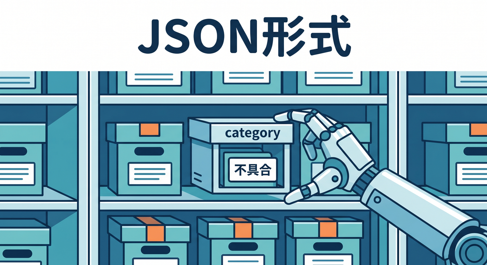
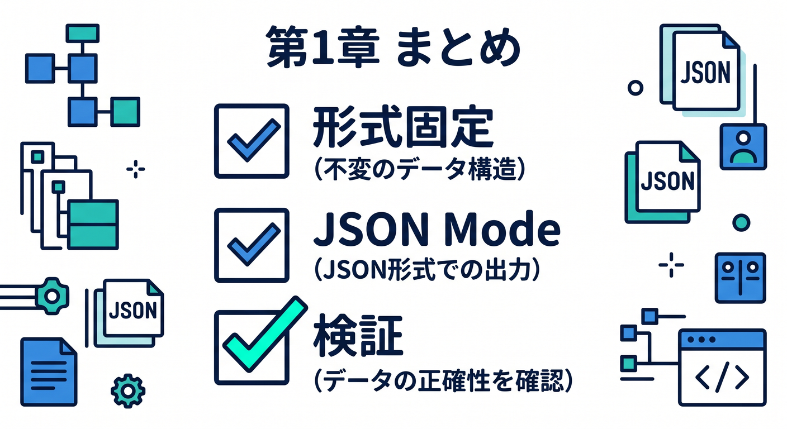

# 第10章：JSON Modeと形式固定を学ぼう 🧾

AIの出力をアプリで使うなら、決まった形式で返してほしい場面があります。  
たとえば、タグ分類やクイズ生成ではJSONが便利です。

---

## 1. 自由文は扱いにくい 😵


AIが自由に文章で返すと、アプリ側で扱いにくいことがあります。

```text
これはたぶん「不具合」カテゴリですね。緊急度は高めです。
```

人間には読めますが、プログラムで処理するには曖昧です。

---

## 2. JSONで返してもらう ✅



形式を指定します。

```json
{
  "category": "不具合",
  "priority": "high",
  "summary": "ログインできない問い合わせ"
}
```

Workers AIにはJSON Modeなど、構造化出力に関係する機能があります。

---

## 3. promptでも形式を指定する 🧠


promptにもルールを書きます。

```text
次の文章を分類し、必ずJSONだけで返してください。
categoryは「料金」「不具合」「使い方」「その他」のどれかです。
```

ただし、promptだけに頼りすぎないようにします。

---

## 4. 必ず検証する 🧪


AIの出力は、アプリで使う前に検証します。

```ts
if (!["料金", "不具合", "使い方", "その他"].includes(data.category)) {
  throw new Error("Invalid category");
}
```

Zodなどのschema validationを使うのもよいです。

---

## 5. 章末チェック ✅



- 自由文出力はアプリで扱いにくいと分かる
- JSON形式の出力が便利だと分かる
- JSON Modeの存在を知っている
- promptで形式を指定できる
- AI出力は必ず検証すると分かる

この章で覚える一言はこれです。  
**AIの出力をアプリで使うなら、形式固定と検証をセットで考えます 🧾**
