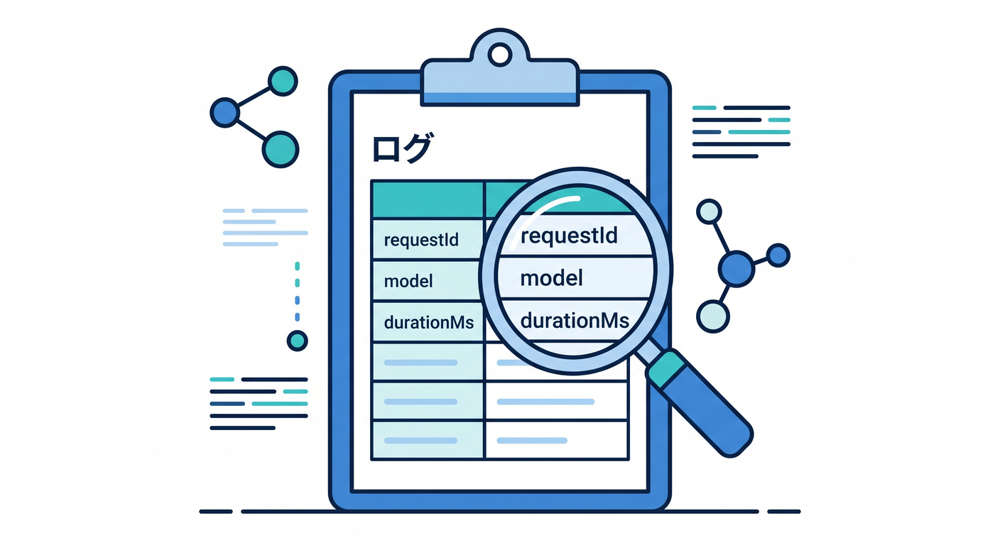
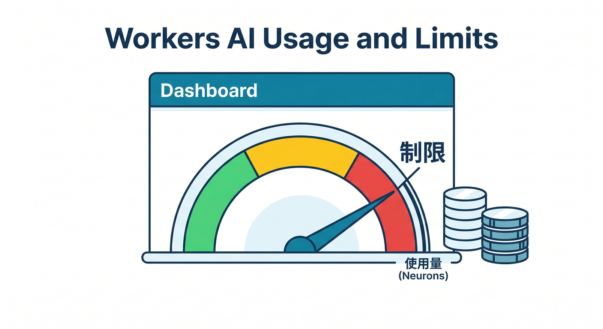
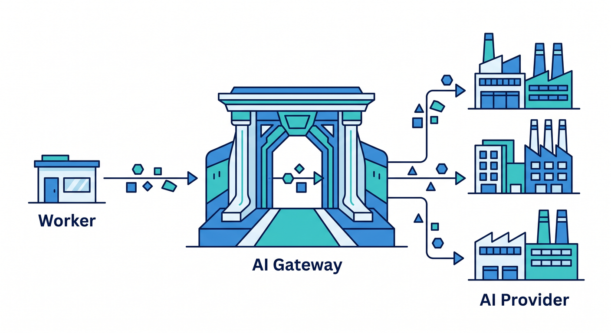
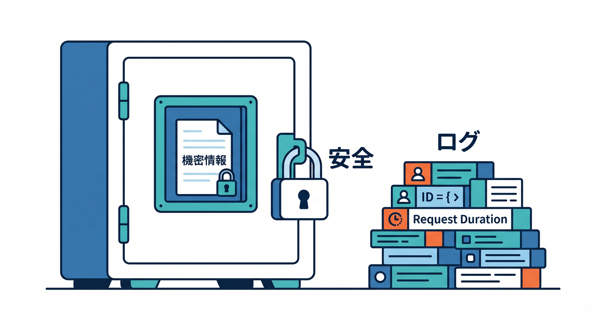
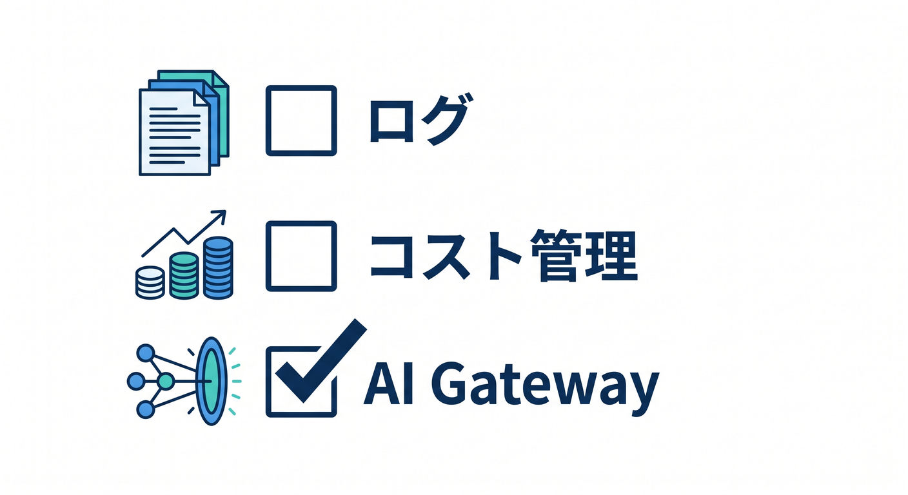

# 第11章：AI Gatewayとログ・コスト管理を考えよう 📈

AI機能は楽しいですが、運用ではログとコストが大切です。  
使われ方を見ないまま公開すると、失敗や使いすぎに気づきにくくなります。

---

## 1. 見たい情報 👀



AI APIでは、次の情報を見ます。

- model
- status
- durationMs
- requestId
- userId
- promptLength
- error type
- 使用量

prompt全文ではなく、長さやIDを記録するのが安全です。

---

## 2. Workers AIの使用量 💰



Workers AIにはpricingとlimitsがあります。  
公式ドキュメントでは、Neuron使用量をDashboardで確認でき、日次resetの情報も案内されています。

学習中でも、ループで大量実行しないようにします。

---

## 3. AI Gatewayの役割 🌉



AI Gatewayは、AIリクエストの観測や制御、キャッシュなどを考える入口になります。

```text
Worker
  ↓
AI Gateway
  ↓
AI provider / Workers AI
```

外部AI APIも含めて運用したいときに役立ちます。

---

## 4. ログ例 📝



安全寄りのログ例です。

```ts
console.log("ai request completed", {
  requestId,
  model: "@cf/meta/llama-3.1-8b-instruct",
  promptLength,
  durationMs,
  status: "ok",
});
```

本文やsecretは出しません。

---

## 5. 章末チェック ✅



- AI APIで見るべき情報が分かる
- Workers AIのpricingとlimitsを確認すると分かる
- Neuron使用量に注意すると分かる
- AI Gatewayの役割が分かる
- prompt全文をログへ出しすぎない

この章で覚える一言はこれです。  
**AI機能は、動かすだけでなく使用量・失敗・速度を見守ります 📈**
