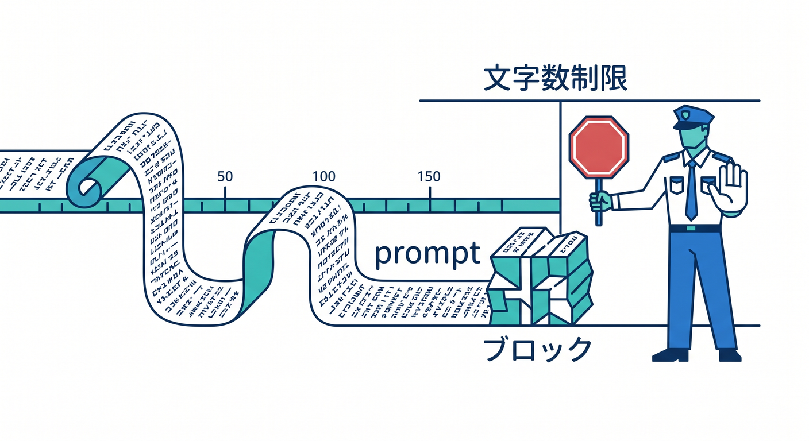
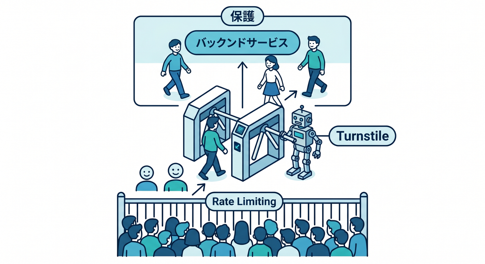
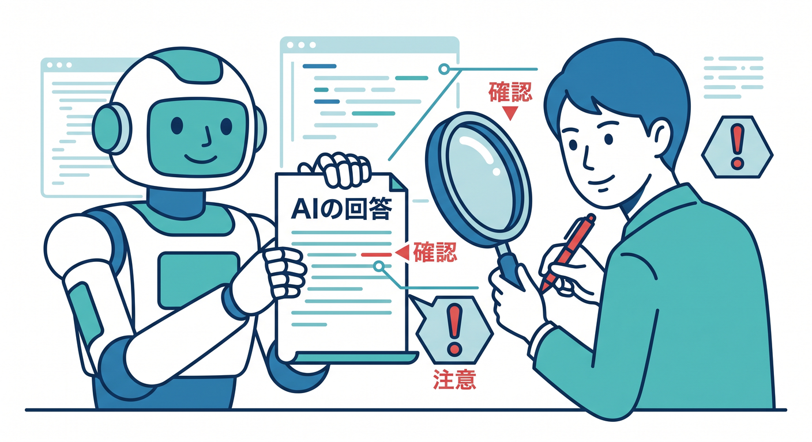
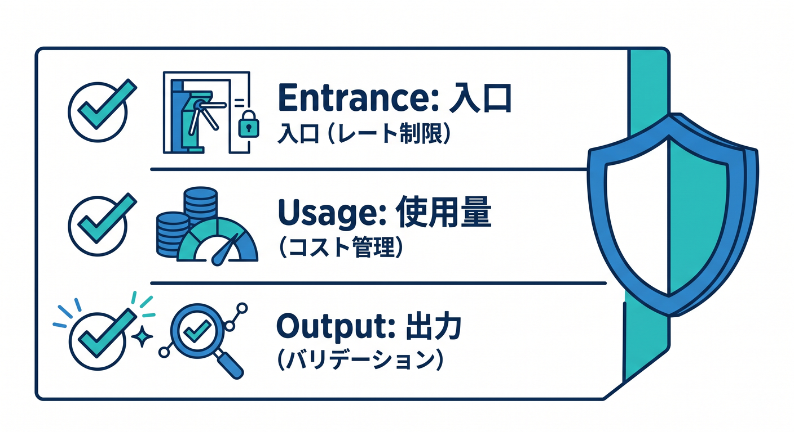

# 第12章：安全なAI APIにしよう 🔐

AI APIは、普通のAPIよりもコストや悪用に注意が必要です。  
安全に公開するための基本を整理します。

---

## 1. 無制限公開は危険 🚨


誰でも無制限に呼べるAI APIは危険です。

- コストが増える
- 大量アクセスされる
- 不適切な入力が来る
- 外部API制限に当たる
- ログに個人情報が増える

小さなアプリでも、入口を守ります。

---

## 2. 入力を制限する 🧪



promptやtextには制限を入れます。

```ts
if (prompt.length > 1000) {
  return Response.json({ error: "Prompt too long" }, { status: 400 });
}
```

文字数、回数、ファイルサイズ、Content-Typeなどを確認します。

---

## 3. Rate LimitingとTurnstile 🛡️



必要に応じて、CloudflareのRate Limiting RulesやTurnstileを使います。

```text
短時間に大量リクエスト → Rate Limiting
フォームのbot対策 → Turnstile
ログインユーザーだけ → 認証
```

AI APIの入口は特に守りたい場所です。

---

## 4. AIの回答を信用しすぎない 🧠



AIは間違えることがあります。  
重要な判断をAIだけに任せないようにします。

```text
医療・法律・金融 → 注意表示や専門家確認
分類結果 → ユーザーや管理者が修正可能に
JSON出力 → schema validation
```

AIの出力も、普通の外部入力として検証します。

---

## 5. 章末チェック ✅



- AI APIの無制限公開が危険だと分かる
- 入力長制限を入れられる
- Rate LimitingやTurnstileを検討できる
- AIの回答を信用しすぎないと分かる
- 出力検証が必要だと分かる

この章で覚える一言はこれです。  
**AI APIは、入口・使用量・出力の3つを守って公開します 🔐**
