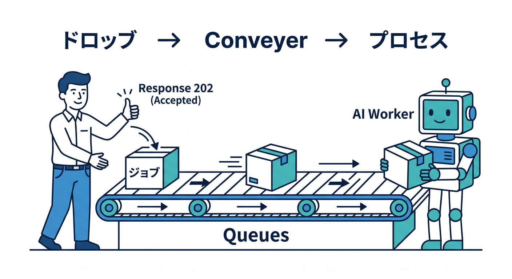
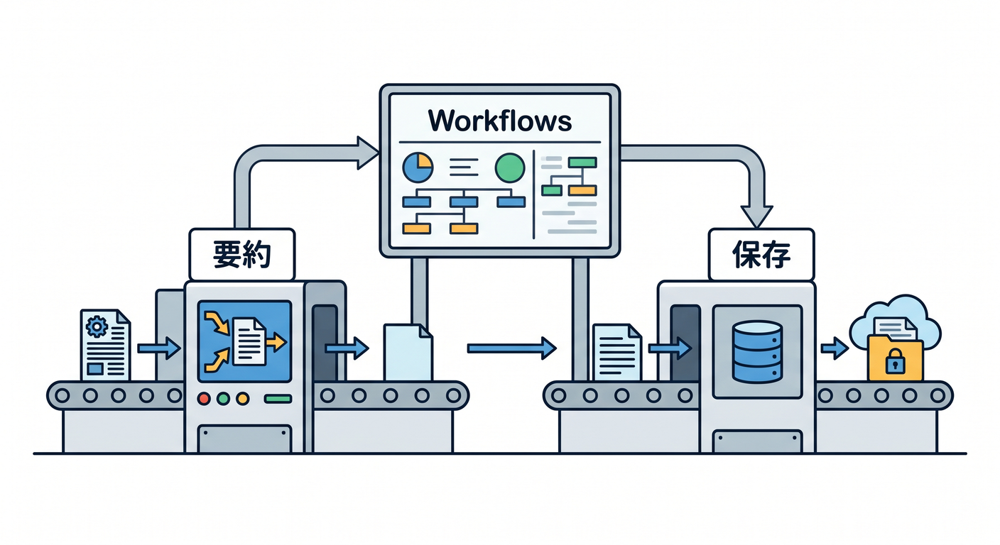
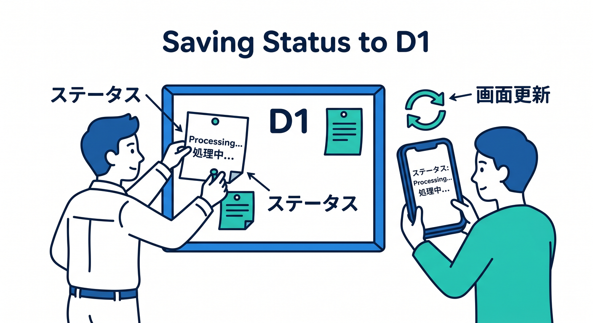
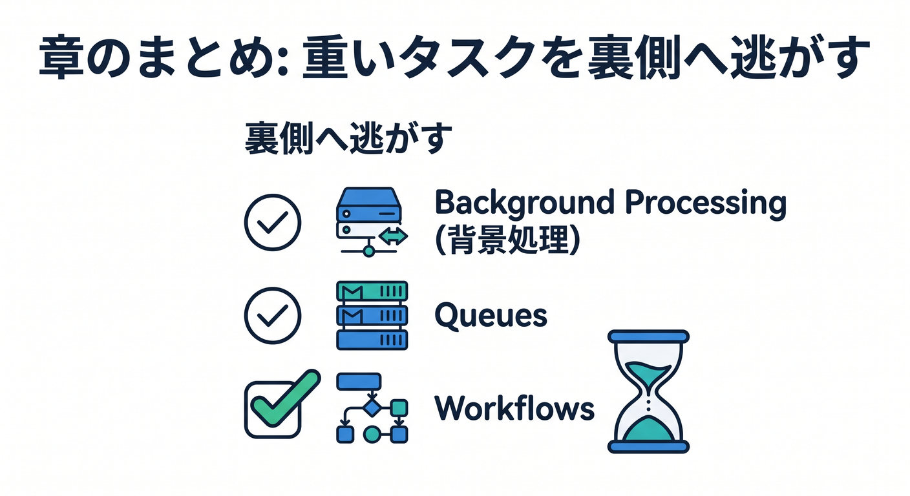

# 第13章：Queues・WorkflowsでAI処理を裏側へ逃がそう ⏳

AI処理は時間がかかることがあります。  
長い処理や大量処理は、リクエスト中に全部やらず、裏側へ逃がす設計が向いています。

---

## 1. 同期処理のつらさ 🐢


ユーザーのリクエスト中に全部やると、画面が待たされます。

```text
送信
  ↓
AI要約
  ↓
embedding生成
  ↓
D1保存
  ↓
レスポンス
```

途中でAI APIが遅いと、ユーザー体験も悪くなります。

---

## 2. Queuesへjobを入れる 📬



Producer Workerは、jobだけ入れてすぐ返します。

```ts
await env.AI_QUEUE.send({
  jobId,
  type: "memo.summarize",
  memoId,
  userId,
});

return Response.json({ accepted: true, jobId }, { status: 202 });
```

ConsumerがあとでWorkers AIを呼びます。

---

## 3. Workflowsで多段処理 🔁



要約、embedding、保存、通知のように段階がある場合はWorkflowsも候補です。

```text
step 1: D1から本文取得
step 2: Workers AIで要約
step 3: Workers AIでembedding
step 4: D1 / Vectorizeへ保存
```

失敗時のretryや進行状況を扱いやすくなります。

---

## 4. statusを保存する 🗄️



D1に処理状態を保存します。

```text
queued
processing
completed
failed
```

React画面は、jobIdで状態を確認して表示できます。

---

## 5. 章末チェック ✅



- 長いAI処理を同期でやる問題が分かる
- QueuesへAI jobを入れる流れが分かる
- Workflowsで多段処理を管理できる
- D1にstatusを保存すると分かる
- Reactで処理状態を表示できる

この章で覚える一言はこれです。  
**重いAI処理は、QueuesやWorkflowsで裏側へ逃がすと安定します ⏳**
