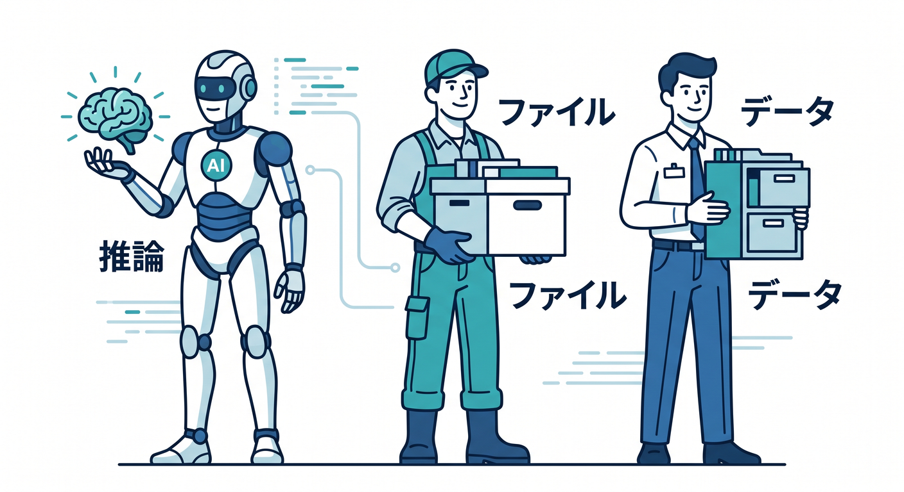
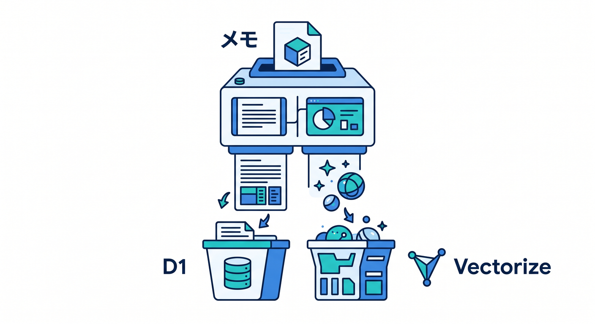
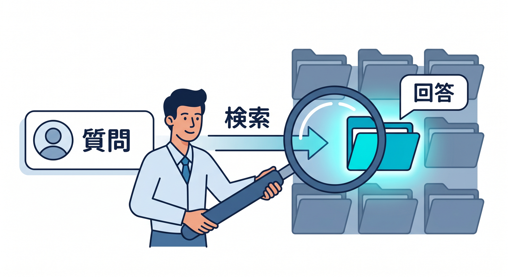
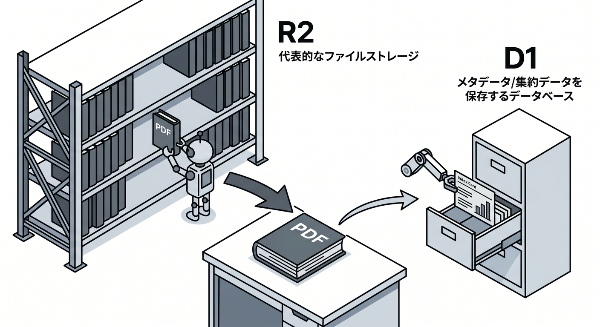
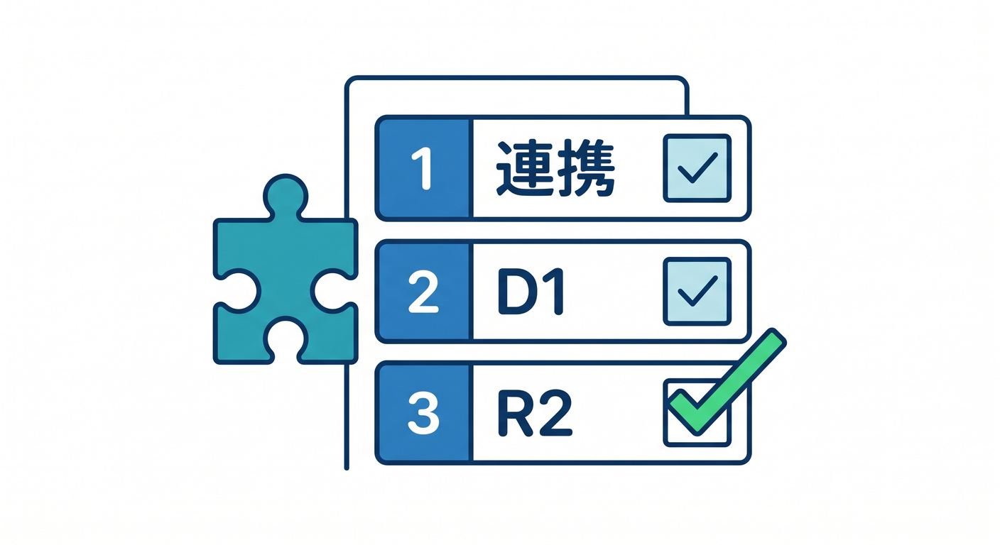

# 第14章：R2・D1・Vectorizeと組み合わせよう 🧩

AIアプリは、AIだけでは完成しません。  
データを保存したり、検索したり、ファイルを扱ったりする場所も必要です。

---

## 1. 役割分担 🗺️



ざっくり分けるとこうです。

```text
Workers AI → 推論する
D1 → メタデータや履歴を保存
R2 → ファイル本体を保存
Vectorize → embedding検索
Queues → 重い処理をあとで実行
AI Gateway → AIリクエストの観測や制御
```

AIだけに全部を任せないのが設計のコツです。

---

## 2. 学習メモアプリの例 📚



メモを保存し、AIで要約とタグを作ります。

```text
本文 → D1
要約 → D1
タグ → D1
embedding → Vectorize
添付PDF → R2
```

どこに何を置くかを分けると、あとで検索や一覧が作りやすいです。

---

## 3. FAQ検索の例 🔎



FAQ検索では、embeddingが役立ちます。

```text
FAQ本文
  ↓ Workers AIでembedding
  ↓ Vectorizeへ保存
  ↓ ユーザー質問もembedding
  ↓ 近いFAQを検索
```

これがRAGやAI Searchの入口になります。

---

## 4. 画像やPDFの例 🖼️



ファイル本体はR2へ置きます。  
AIで要約や説明を作る場合、処理結果だけD1へ保存します。

```text
PDF本体 → R2
PDFのタイトル → D1
AI要約 → D1
処理job → Queues
```

R2、D1、Workers AIを分けて使います。

---

## 5. 章末チェック ✅



- AIアプリにも保存先設計が必要だと分かる
- D1、R2、Vectorizeの役割が分かる
- 学習メモアプリの構成を説明できる
- FAQ検索とembeddingの関係が分かる
- 第23章のAI発展機能につながると分かる

この章で覚える一言はこれです。  
**AIアプリは、Workers AI・D1・R2・Vectorizeを役割分担して作ります 🧩**
