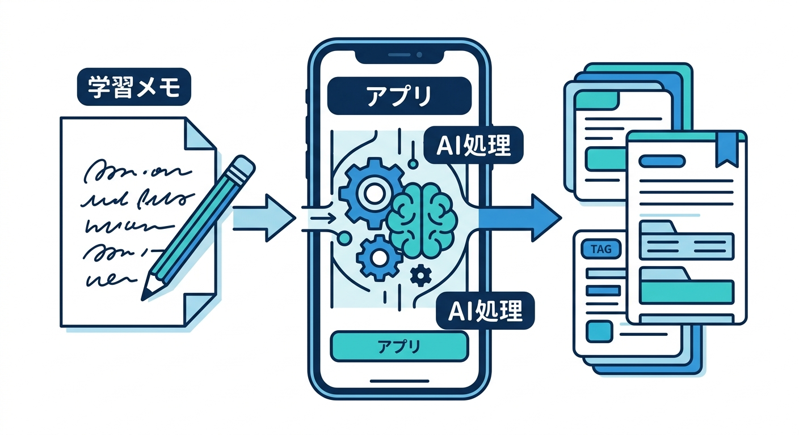
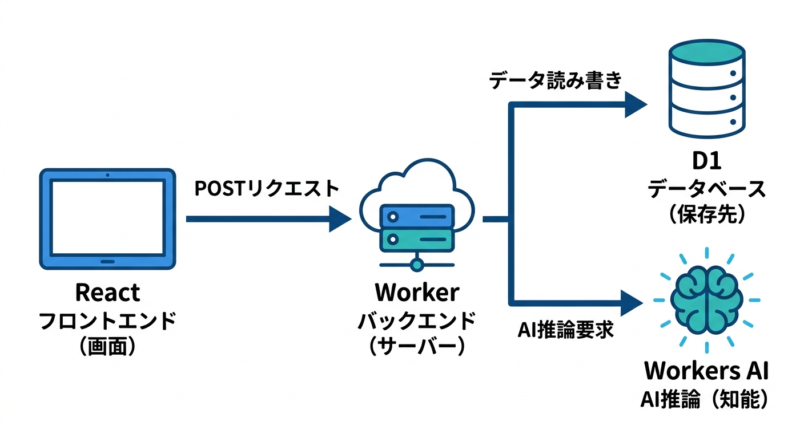
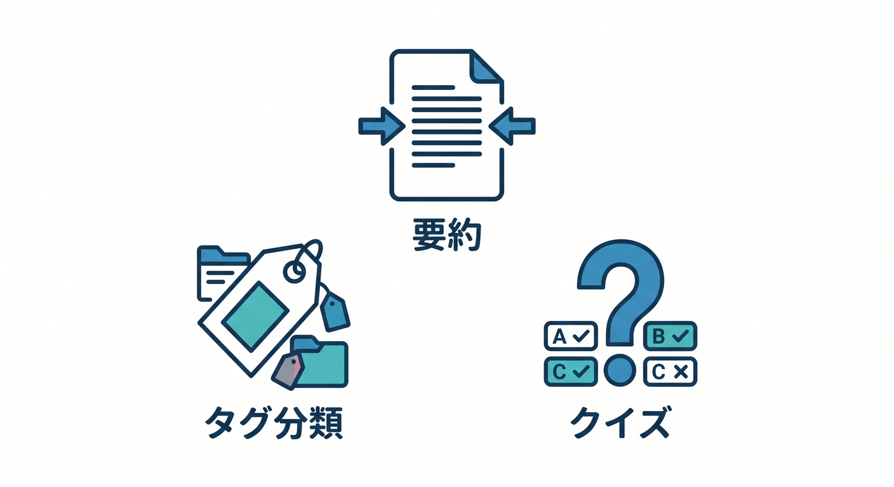
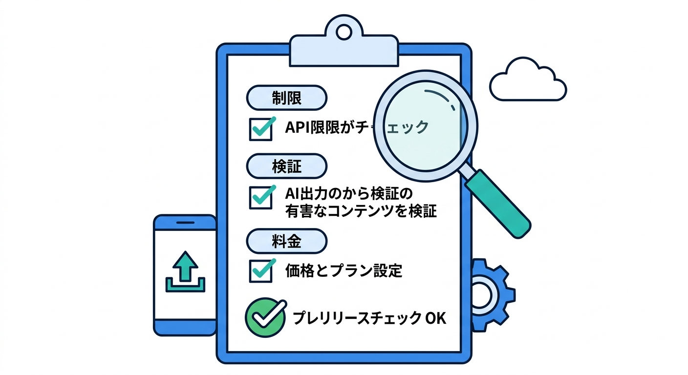
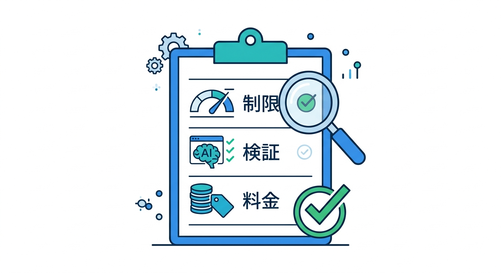

# 第15章：小さなAI学習メモアプリを完成させよう 📚

最後は、ここまで学んだWorkers AIを小さなアプリにまとめます。  
題材は、学習メモをAIが要約し、タグを付け、復習クイズを作るアプリです。

---

## 1. 完成イメージ 🧭



構成はこうです。

```text
React
  ↓ POST /api/memos
Worker
  ├─ D1へメモ保存
  ├─ Workers AIで要約
  ├─ Workers AIでタグ分類
  └─ D1へ結果保存
```

最初は同期処理で小さく作り、重くなったらQueuesへ分けます。



---

## 2. 必要な機能 📋



最小構成はこれです。

- メモ入力
- AI要約
- AIタグ分類
- 復習クイズ生成
- D1保存
- 結果一覧
- エラー表示

最初から完璧にせず、1本ずつ動かします。

---

## 3. 安全チェック 🔐



公開前に確認します。

- 入力文字数制限があるか
- Rate Limitingを検討したか
- prompt全文をログへ出していないか
- AI出力を検証しているか
- Workers AIのpricingとlimitsを確認したか
- D1に保存する個人情報を絞っているか

AI機能は楽しいぶん、入口とログに注意します。

---

## 4. Copilotレビュー例 🤖

実装後、Copilotにこう聞けます。

```text
Cloudflare Workers + Workers AI + D1で学習メモAIアプリを作りました。
入力チェック、AI prompt、JSON出力検証、ログ、Rate Limiting、pricing、D1保存設計をレビューしてください。
```

実データやsecretは貼らず、必要ならダミー値に置き換えます。

---

## 5. 章末チェック ✅



- React + Workers + Workers AIの構成を説明できる
- 要約、分類、クイズ生成を組み合わせられる
- D1へAI結果を保存できる
- 安全チェックを自分でできる
- AIをCloudflareアプリの一部として扱える

この章で覚える一言はこれです。  
**Workers AIを使うと、学習メモのような身近なアプリにもAI機能を自然に組み込めます 📚**
