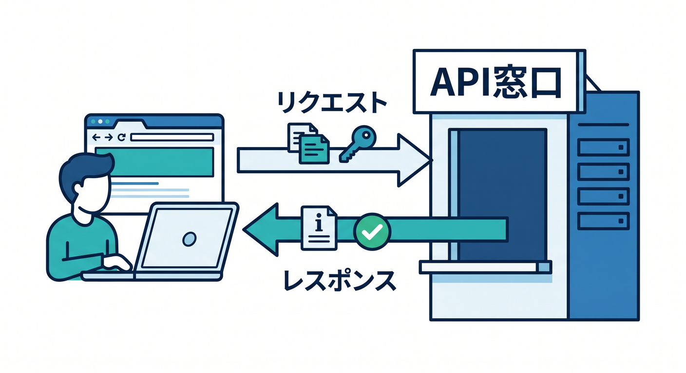
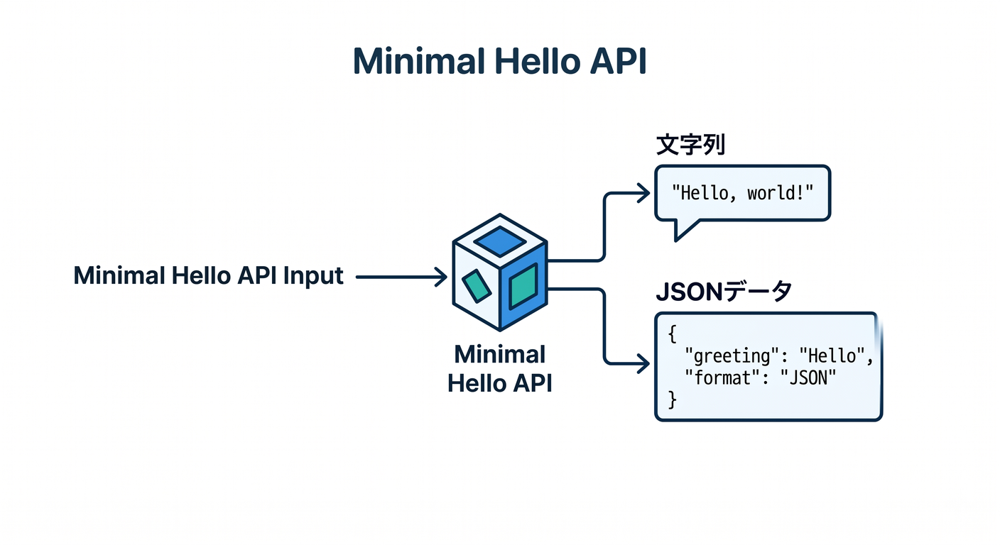
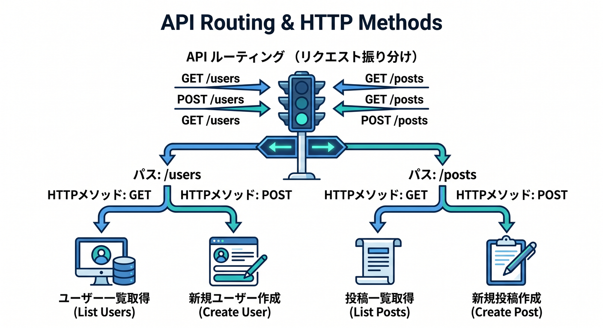
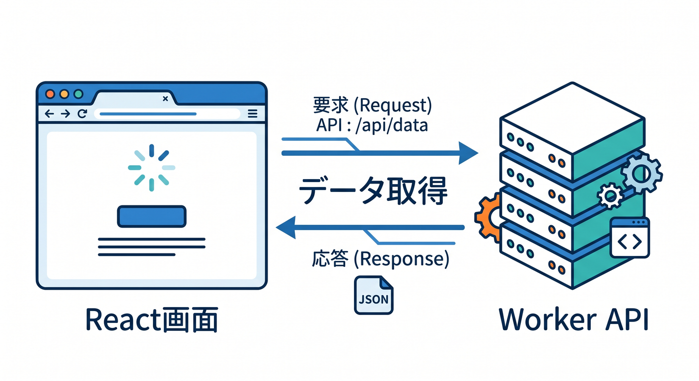
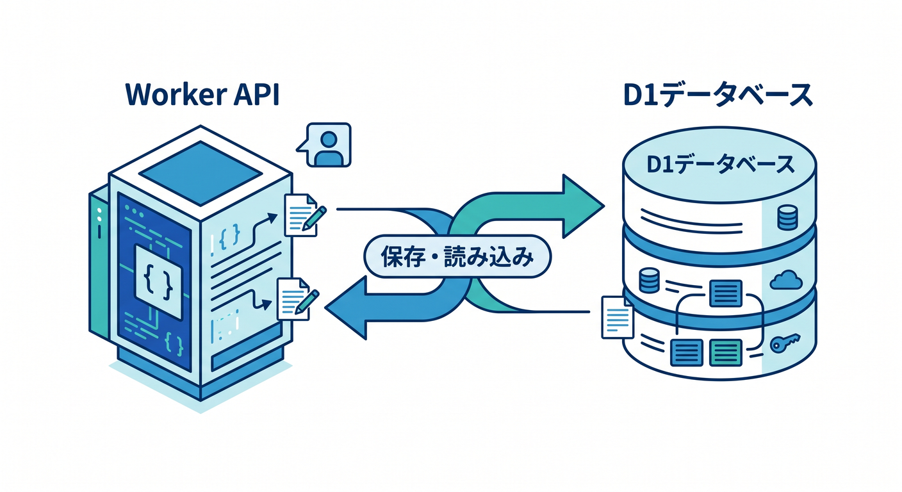
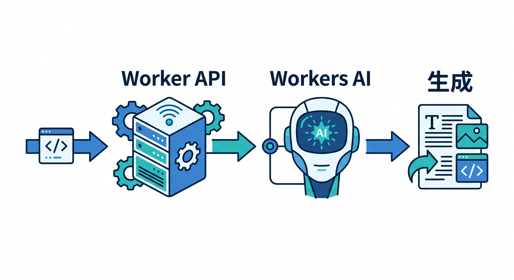
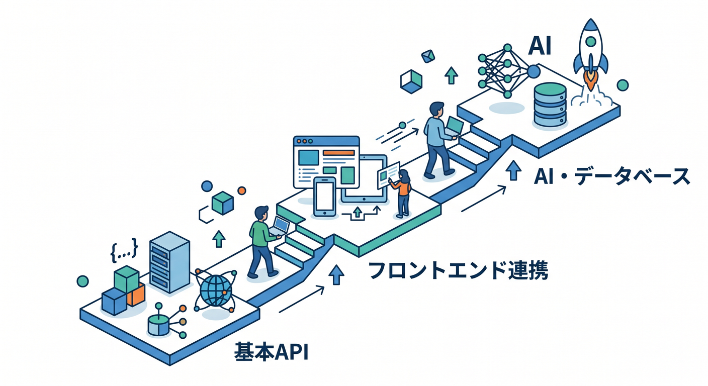

# WorkersでAPIを作る基本を身につけよう 15章アウトライン🔗

## 第1章　CloudflareでAPIを作るってどういうこと？🌍📡

最初は、APIという言葉そのものをやさしく整理します。
「画面の裏でデータを返す窓口」が API なんだ、とまずつかめるようにします。
そのうえで、Cloudflare Workers では **Request を受けて Response を返す** という、とてもシンプルな形で API を作れることを体感できる導入章にします。
Cloudflare公式でも Workers はアプリや API をグローバルに動かす中核基盤として案内されています。 ([Cloudflare Docs][3])

## 第2章　開発スタート！C3・Wrangler・VS Codeをやさしく動かそう 🛠️✨

ここでは最初のプロジェクトを作って、フォルダの中身をのぞきます。
`wrangler dev` でローカル確認し、`wrangler deploy` で公開する流れを、難しい説明より先に体験します。
「Cloudflare開発って、思ったより始めやすいんだな」と感じてもらう章です。
C3 は Workers プロジェクト作成の公式導線で、Wrangler は開発・テスト・デプロイの中心CLIです。 ([Cloudflare Docs][1])

## 第3章　最初のAPIを作ろう！Hello APIで流れをつかもう 🚀💬

ここではいちばん小さい API を作ります。
ブラウザや `fetch` でアクセスすると、文字列や JSON を返すだけの最小構成です。
でもこの章があると、「Cloudflareの上で自分のAPIが動いた！」という手応えが一気に出ます。
Workers は Request/Response ベースなので、API学習の入口として非常にわかりやすいです。 ([Cloudflare Docs][1])

## 第4章　GETを使いこなそう！URL・パス・クエリの読み方を覚えよう 🔍🛣️

APIらしさが出てくる最初の山です。
URL のパスで動きを変える、クエリ文字列を読む、条件ごとに返事を変える、という基本を学びます。
ここで「URLによって処理が変わる」感覚をしっかり持てるようにします。
Cloudflare の Routes は URL パターンに Worker を割り当てる考え方で、API公開の理解にもつながります。 ([Cloudflare Docs][4])

## 第5章　POSTとJSONを覚えよう！データを受け取るAPIへ 📮📦

ここでは POST リクエストと JSON 入出力を扱います。
フォームやフロント画面から送られてきたデータを受け取り、加工して返す流れを練習します。
この章から「ただ返すだけ」ではなく、**受け取って処理して返す** API になって、一気にアプリ感が増します。
Cloudflare Workers は外部 API 連携も `fetch` を使って組み立てるのが基本で、JSON を扱う力がそのまま実力になります。 ([Cloudflare Docs][5])

## 第6章　分岐・ルーティング・HTTPメソッド整理で“APIっぽさ”を固めよう 🚦🔀

GET と POST がわかったら、次はルーティング整理です。
`/users`、`/posts`、`/contact` みたいに役割を分け、メソッドごとに処理を分ける考え方を学びます。
最初は素の Workers で書き、必要に応じてあとで Hono の便利さに触れる構成にすると理解しやすいです。
Hono は Cloudflare Workers と相性のよい軽量フレームワークとして公式ガイドでも扱われています。 ([Cloudflare Docs][6])

## 第7章　エラーを怖がらない！ステータスコードと失敗時の返し方を覚えよう ⚠️🧯

APIは成功だけでなく、失敗の返し方も大切です。
`200 OK`、`400 Bad Request`、`404 Not Found`、`500 Internal Server Error` などを、やさしい実例で覚えます。
「とりあえず動く」から一歩進んで、「使いやすいAPI」の入口に入る章です。
このあと React や他サービスとつなぐときに、ここでの設計がかなり効いてきます。 API の基本構造は Workers の Request/Response モデルに自然に乗せられます。 ([Cloudflare Docs][1])

## 第8章　ReactからAPIを呼んでみよう！画面と裏側をつなぐ体験 ⚛️🌈

ここでは React を使って、Cloudflare API を画面から呼びます。
入力欄、ボタン、送信、結果表示という王道の流れで、「APIってこう使うのか」が体でわかる章です。
Cloudflareの現行導線では React + Vite + Workers API の組み合わせがかなり扱いやすく、SPAとAPIを1つの流れで学べます。
Workers Assets と Vite plugin により、静的フロントと API Worker の組み合わせも自然です。 ([Cloudflare Docs][7])

## 第9章　CORSをやさしく理解しよう！“つながらない理由”を見抜けるようにする 🌐🧩

フロントとAPIを分けると、かなりの確率で CORS が出てきます。
この章では「なぜブラウザが止めるのか」をふわっとではなく理解し、必要なヘッダーをどこで付けるのかを学びます。
CORS を知らないと、APIは動いているのに画面から呼べない、という初学者あるあるで詰まりやすいです。
Cloudflare公式でも Worker で CORS ヘッダーを付与する方法や、Cloudflare製品で CORS を設定する考え方が案内されています。 ([Cloudflare Docs][8])

## 第10章　外部APIとつないでみよう！fetchで世界を広げよう 🌍🔗

ここでは自作APIの中から外部APIを呼びます。
たとえば天気、ニュース、辞書、ダミーデータなど、わかりやすい題材を使って「Workerが中継役になる」感覚を学びます。
この章で、Cloudflare Workers が単なる返答装置ではなく、他サービスを束ねるハブになれることが見えてきます。
Cloudflare公式でも、外部API連携は `fetch` を使う形で案内されています。 ([Cloudflare Docs][5])

## 第11章　D1とつないで“保存できるAPI”へ進もう 🧾💾

APIが本格的に楽しくなる章です。
一覧取得、追加、更新、削除の入口を、D1 を使ったシンプルな例で学びます。
「メモ帳API」「問い合わせ一覧API」みたいな小さな題材で、CRUD の基本をやさしく体験します。
D1 は Cloudflare の serverless SQL database で、Worker からは binding 経由で扱うのが基本です。公式でも D1 を Worker API から扱う手順が案内されています。 ([Cloudflare Docs][9])

## 第12章　APIを守ろう！Secrets・Turnstile・Rate Limitingの入口 🔐🛡️

ここでは「公開したAPIをどう安全に使うか」を学びます。
秘密情報はコードに直書きしない、フォーム送信は Turnstile で守る、乱打対策の考え方を持つ、という基本を整理します。
初学者向け教材でも、この章を入れておくと“本番っぽさ”がぐっと増します。
Cloudflare は bindings を通じた安全な接続を強く推しており、Workers AI や D1 なども binding 利用が自然です。Turnstile はサーバー側検証が前提の設計です。 ([Cloudflare Docs][10])

## 第13章　Workers AIでAI APIを1本作ろう 🤖✨

ここで Cloudflare の AI をしっかり入れます。
たとえば、文章要約API、分類API、説明文生成APIなど、見て楽しい題材が向いています。
普通の API 学習の延長で「AIつきAPI」が作れると、Cloudflareの面白さが一気に伝わります。
Workers AI は Workers と binding でつないで使う公式導線があり、AI Gateway や Vectorize とも連携しやすい構成です。 ([Cloudflare Docs][11])

## 第14章　Hono・Service Bindings・RPCで“整理されたAPI”へ進もう 🧱🧠

最初は素の Workers で十分ですが、少し育ってくると API の整理がしたくなります。
この章では Hono を軽く紹介しつつ、さらに一歩進んで **Service Bindings** と **type-safe RPC** の考え方も見せます。
「Worker 同士で話すときは public URL に投げず、内部接続のほうがきれい」という設計感覚を持てると、とても今っぽいです。
Cloudflare公式でも、Worker間通信には service bindings が推奨され、zero-cost・public internet を通らない・type-safe RPC をサポートすると案内されています。 ([Cloudflare Docs][12])

## 第15章　仕上げ！公開・観測・Next.js紹介までつないで作品にしよう 🏁🎉

最後は、小さな完成作品にまとめます。
React の画面、Workers API、D1 や AI、簡単な保護、ログ確認までつないで「ちゃんと動くアプリ」にします。
そのうえで、Next.js は深掘りしすぎず、「Cloudflare Workers では OpenNext adapter の道がある」と紹介する程度にとどめます。
Cloudflareでは Workers の observability や versions/deployments も整っており、Next.js は Workers 上に OpenNext adapter で載せる案内になっています。 ([Cloudflare Docs][13])

## この15章構成のねらい 🎯📘

この構成は、ただAPI文法を並べるのではなく、

**最小API**
→ **GET/POST/JSON**
→ **React連携**
→ **保存と保護**
→ **AI API**
→ **Worker間連携と運用**

という順で、少しずつ「アプリ開発の手応え」が増えるように作っています。現行のCloudflare公式でも、Workersは API・フルスタック・AI・observability を一体で学びやすい形に整理されており、Vite plugin や Static Assets、framework guides がその流れを支えています。 ([Cloudflare Docs][14])

さらに、Copilot と MCP を学習支援に組み込むとかなり相性がいいです。
たとえば「この Worker のルーティングを説明して」「この CORS エラーの原因を考えて」「公式 docs MCP を見て D1 binding の書き方を要約して」みたいな進め方ができるので、2026年らしい学習体験にしやすいです。 ([Cloudflare Docs][2])

[1]: https://developers.cloudflare.com/workers/get-started/guide/?utm_source=chatgpt.com "Get started - CLI · Cloudflare Workers docs"
[2]: https://developers.cloudflare.com/workers/get-started/prompting/?utm_source=chatgpt.com "Prompting - Workers"
[3]: https://developers.cloudflare.com/workers/get-started/?utm_source=chatgpt.com "Getting started · Cloudflare Workers docs"
[4]: https://developers.cloudflare.com/workers/configuration/routing/routes/?utm_source=chatgpt.com "Routes - Workers"
[5]: https://developers.cloudflare.com/workers/configuration/integrations/apis/?utm_source=chatgpt.com "APIs - Workers"
[6]: https://developers.cloudflare.com/workers/framework-guides/web-apps/more-web-frameworks/hono/?utm_source=chatgpt.com "Hono · Cloudflare Workers docs"
[7]: https://developers.cloudflare.com/workers/framework-guides/web-apps/react/?utm_source=chatgpt.com "React + Vite · Cloudflare Workers docs"
[8]: https://developers.cloudflare.com/workers/examples/cors-header-proxy/?utm_source=chatgpt.com "CORS header proxy · Cloudflare Workers docs"
[9]: https://developers.cloudflare.com/d1/get-started/?utm_source=chatgpt.com "Getting started · Cloudflare D1 docs"
[10]: https://developers.cloudflare.com/workers/runtime-apis/bindings/?utm_source=chatgpt.com "Bindings (env) - Workers"
[11]: https://developers.cloudflare.com/workers-ai/get-started/workers-wrangler/?utm_source=chatgpt.com "Get started - Workers and Wrangler"
[12]: https://developers.cloudflare.com/workers/runtime-apis/bindings/service-bindings/?utm_source=chatgpt.com "Service bindings - Runtime APIs · Cloudflare Workers docs"
[13]: https://developers.cloudflare.com/workers/configuration/versions-and-deployments/?utm_source=chatgpt.com "Versions & Deployments - Workers"
[14]: https://developers.cloudflare.com/workers/vite-plugin/?utm_source=chatgpt.com "Vite plugin · Cloudflare Workers docs"
