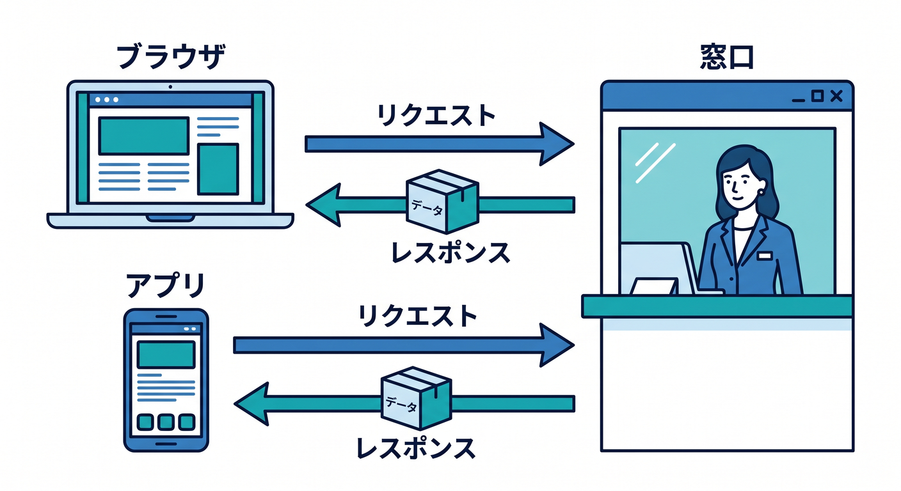
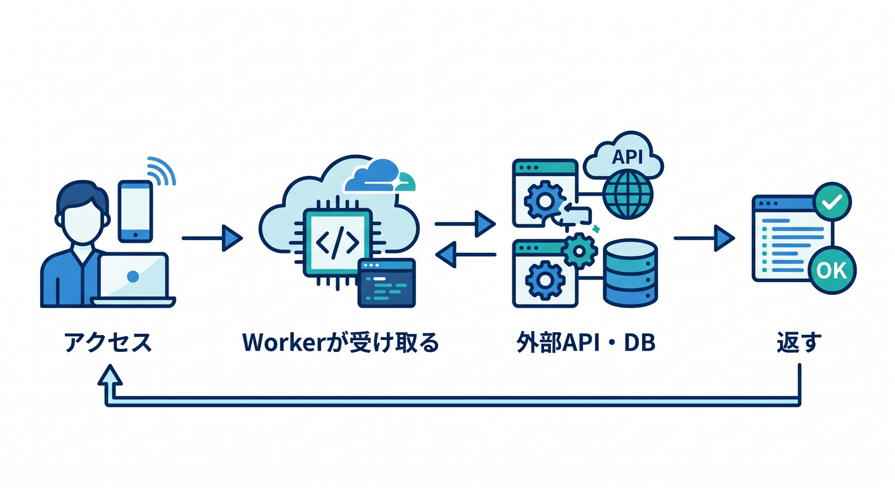
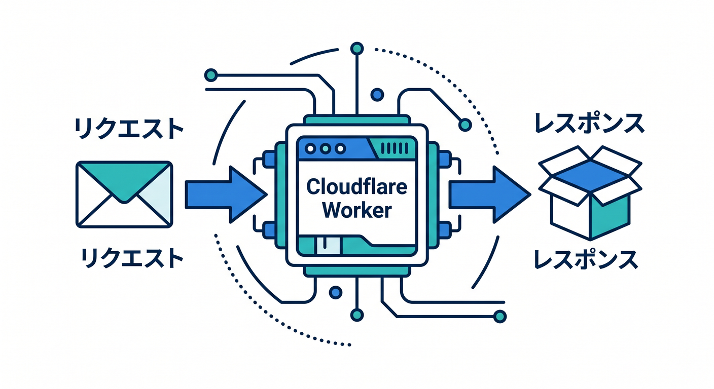
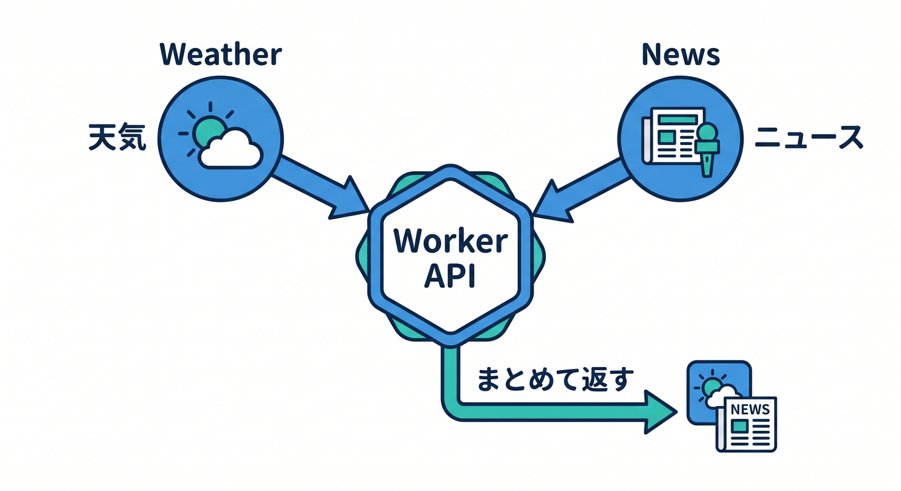
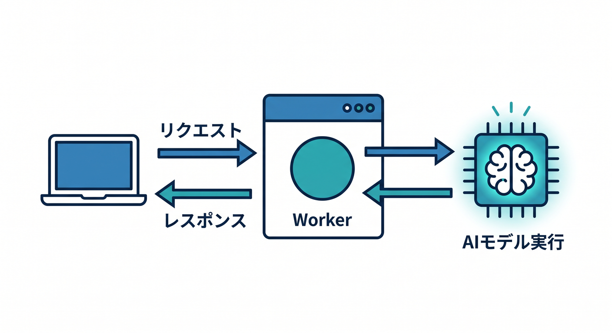

# 第01章：CloudflareでAPIを作るってどういうこと？🌍📡

この章では、まず「APIって何？」をふんわりではなく、でもむずかしくしすぎずに理解していきます 😊
そして最後に、「Cloudflare Workers では API をどう考えればいいのか」が、頭の中でスッとつながる状態を目指します。Cloudflare Workers は、Cloudflare のグローバルネットワーク上でアプリや API を作って動かせる serverless platform として案内されていて、React や Next などのフレームワーク、JavaScript / TypeScript などの言語、observability までまとめて扱えるのが今の公式の立ち位置です。 ([Cloudflare Docs][1])

## この章のゴール 🎯

この章でつかみたいのは、次の3つです。

* API は「画面そのもの」ではなく、「データや結果を返す窓口」だとわかること 😊
* Cloudflare Workers では「Request を受けて Response を返す」と考えればよいとわかること 📬➡️📦
* その先で、外部API連携や AI API に自然につながるとイメージできること 🤖✨

Cloudflare の公式ドキュメントでも、Workers の基本は fetch ハンドラーに入ってきた `Request` を受け取り、`Response` を返す形として説明されています。さらに Workers runtime は Web 標準寄りで、クライアントとサーバーのあいだで考え方をそろえやすく、Node.js API も一部互換があります。 ([Cloudflare Docs][2])

---

## 1. APIって、結局なに？🤔



すごくざっくり言うと、API は**「お願いを受け取って、結果を返してくれる窓口」**です。
ブラウザに HTML を返せば「Webページ」っぽく見えますし、JSON を返せば「API」っぽく見えます。中でやっていることはどちらも「リクエストを受けて、レスポンスを返す」です。ここが最初の大事ポイントです 🌱

たとえば、こんな感じです。

* 画面用の窓口
  → HTML を返す
* アプリ用の窓口
  → JSON を返す
* AI用の窓口
  → 要約結果や分類結果を返す

つまり API は、**見た目を返すより、データや処理結果を返すことが多い窓口**だと思えば大丈夫です 😊

---

## 2. CloudflareでAPIを作ると、何がうれしいの？☁️⚡



Cloudflare Workers は、インフラ管理をあまり前に出さずに、API をすばやく公開しやすいのが魅力です。公式 overview でも、Workers は Cloudflare のグローバルネットワーク上でアプリを build / deploy / scale でき、複雑な構成をあまり意識せず始めやすいと案内されています。さらに、バックエンド用途として API やデータストア接続、AI 推論、ログや分析まで一体で扱える設計になっています。 ([Cloudflare Docs][1])

ここではまだ「すごい仕組み全部」を覚える必要はありません 🙆
最初は次のイメージだけ持てば十分です。

**ユーザーや画面からアクセス**
→ **Cloudflare Worker が受け取る**
→ **必要なら外部APIやDBやAIを呼ぶ**
→ **結果を Response として返す**

この流れが見えれば、もう第1章としてはかなり良いスタートです 🚀

---

## 3. Workersの考え方は、びっくりするほどシンプル ✨



Cloudflare Workers の公式 fetch handler では、HTTP リクエストは `fetch()` ハンドラーに `Request` として渡され、返事は `Response` を return すればよいと説明されています。つまり Workers の基本形は、**Request in / Response out** です。 ([Cloudflare Docs][2])

この考え方を、まずは頭に焼きつけましょう 🔥

**Request**
「こういうURLにアクセスしました」「GETです」「POSTです」「このデータを送りました」

**Response**
「はい、結果はこちらです」「成功です」「エラーです」「JSONを返します」

この2つだけで、かなり多くの API を説明できます 😊

イメージ図にすると、こうです。

**ブラウザ / React / 他サービス**
→ **Request**
→ **Cloudflare Worker**
→ **Response(JSON / text / error など)**

---

## 4. 最初の“頭の中サンプル”を見てみよう 👀

まだ環境構築の章ではないので、ここでは「こういう形なんだな」と見るだけでOKです。Workers の基本は fetch handler で `Request` を受け、`Response` を返す形です。 ([Cloudflare Docs][2])

```ts
export default {
  async fetch(request: Request): Promise<Response> {
    const url = new URL(request.url);

    const body = {
      message: "こんにちは！Cloudflare APIです 👋",
      path: url.pathname,
      method: request.method,
    };

    return new Response(JSON.stringify(body), {
      headers: {
        "content-type": "application/json; charset=UTF-8",
      },
    });
  },
};
```

このコードでやっていることは、たったこれだけです。

1. アクセスしてきた内容を受け取る
2. URL や HTTP メソッドを読む
3. JSON を返す

この時点で、もう立派な API の入口です 🎉
「え、これだけでいいの？」と思ったら、その感覚で合っています。Cloudflare Workers は、最初の一歩がかなり軽いです。CLI ガイドでも、Wrangler を使って最初の Worker を作成・開発・デプロイする流れが公式の基本導線になっています。 ([Cloudflare Docs][3])

---

## 5. Node.jsの人がここで安心してよいポイント 🧡

Node.js を少し触ったことがある人は、「Express みたいな `req`, `res` じゃないの？」と感じるかもしれません。そこは自然な反応です 👍

Workers runtime は Web 標準に寄せて設計されていて、`Request`、`Response`、`fetch` などの Web Platform API を中心にしています。そのため、**ブラウザ側の `fetch` と考え方がかなり近い**です。一方で、Node.js API についても一部互換があり、完全に別世界というわけではありません。 ([Cloudflare Docs][4])

なので、この教材ではこう考えるのがおすすめです。

* Node.js の「サーバーを書く感覚」は活かせる 😊
* でも Workers では「Web標準っぽい考え方」に寄せる 🌐
* そのほうが React 側ともつながりやすい ⚛️

この感覚は、あとで GET、POST、JSON、CORS を学ぶときにかなり効きます 💡

---

## 6. APIは“自分で全部抱えるもの”ではない 🔗



Cloudflare Workers では、外部 API 連携も基本は `fetch` です。公式 docs でも、サードパーティ API と連携するときは `fetch API` を使って取得し、そのレスポンスを加工して返す流れが案内されています。 ([Cloudflare Docs][5])

つまり、自分の API はこんな役にもなれます。

* 天気APIの結果を受け取って、必要な形だけ返す ☀️
* ニュースAPIの結果をまとめて返す 📰
* 複数サービスのデータを1つにまとめて返す 🧩
* あとで AI に要約させて返す 🤖

この「中継役」「整理役」「まとめ役」になれるのが、API の面白いところです。
第1章ではまだ実装しませんが、**APIは“何かを返す箱”ではなく、“処理の窓口”**でもある、と覚えておくと強いです 💪

---

## 7. CloudflareのAIも、同じ流れの中で考えられる 🤖🌈



Cloudflare Workers AI は、Cloudflare のグローバルネットワーク上で serverless GPUs により AI モデルを実行できる仕組みとして提供されていて、現在の overview では 50 以上のオープンモデル、従量ベースの serverless な利用、AI Gateway や Vectorize などとの連携が案内されています。 ([Cloudflare Docs][6])

そして Workers から使うときは、Workers AI binding を設定して `env.AI` 経由でモデルを呼ぶのが公式導線です。Workers AI の getting started でも、Worker に AI binding を追加して `env.AI.run()` を使う流れが案内されています。 ([Cloudflare Docs][7])

ここで大事なのは、「AI だけ別物」と考えなくていいことです 😊

**普通のAPI**
Request → 処理 → Response

**AI API**
Request → AIモデル実行 → Response

結局、流れはほぼ同じです。
だからこの教材では、まず普通の API を理解して、その延長として AI API に進みます。この順番がかなり自然です 🌱

---

## 8. VS Code × Copilot で、この章をどう学ぶと効率いい？🧠✨

今の Cloudflare 公式 docs には、AI エージェント向けに `cloudflare-docs` MCP と `cloudflare-observability` MCP を使う案内があります。前者は Workers の知識をエージェントに与える用途、後者はログ確認や例外確認の支援用途として説明されています。 ([Cloudflare Docs][8])

一方で GitHub Copilot の公式 docs では、MCP を使うには MCP 対応 IDE が必要で、その例として Visual Studio Code が挙げられています。さらに VS Code の agent docs では、ローカルエージェントが特定の MCP サーバーを使えること、エージェントが計画・編集・コマンド実行・自己修正まで行えることが説明されています。 ([GitHub Docs][9])

なので、この教材との相性がいい使い方はこんな感じです 💡

* 「この Worker コードを中学生向けに説明して」
* 「Request と Response の違いを図っぽく説明して」
* 「この API はブラウザ向け？ React向け？ 他サービス向け？」
* 「Cloudflare公式の考え方に沿って、このコードをやさしく言い換えて」

つまり Copilot は、**答えを丸投げする相手**というより、**理解の言い換え役・整理役・伴走役**として使うとかなり強いです 🚶‍♂️🤝🤖

---

## 9. この章で覚えるべき“たった一文” 📌

この章の核心は、これです。

**Cloudflare Workers で API を作るとは、Request を受け取り、必要な処理をして、Response を返す窓口を作ること。**

本当にまずはこれだけでOKです 😊
Cloudflare の公式 fetch handler も、Workers の基本をまさにその形で示しています。 ([Cloudflare Docs][2])

---

## 10. 初学者がここで混乱しやすいポイント ⚠️

### 「APIって画面がないの？」

画面がないことも多いですが、本質はそこではありません。
**データや結果を返す窓口**であることが本質です。

### 「サーバーを立てる感じ？」

感覚としては近いです。
ただし Workers は serverless platform として提供され、インフラ管理の重さをかなり減らして始めやすいのがポイントです。 ([Cloudflare Docs][1])

### 「Node.jsの知識はムダ？」

ムダではありません 🙅
でも Workers では Web標準寄りの `Request` / `Response` / `fetch` の感覚に慣れると、かなり楽になります。 ([Cloudflare Docs][4])

### 「AIは後で別に学ぶもの？」

別章で本格的にやりますが、考え方は同じ流れです。
Workers AI も Worker から binding 経由で呼ぶので、「APIの延長」として理解できます。 ([Cloudflare Docs][7])

---

## 章末ミニまとめ 📝🎉

* API は「お願いを受けて、結果を返す窓口」📮
* Workers の基本は **Request を受けて Response を返す** こと 📬➡️📦
* Workers は Cloudflare のグローバルネットワーク上で API を動かしやすい ☁️⚡ ([Cloudflare Docs][1])
* 外部API連携も AI 連携も、結局はこの基本形の延長で考えられる 🔗🤖 ([Cloudflare Docs][5])
* VS Code + Copilot + MCP を使うと、理解補助や公式情報の取り込みがしやすい 🧠✨ ([Cloudflare Docs][8])

---

## 練習問題 ✍️🌟

1. API をひとことで言うと、どんな存在ですか？
2. Cloudflare Workers の基本形を、「○○を受けて、○○を返す」の形で書いてみてください。
3. 「天気情報を返す」「文章を要約して返す」は、どちらも API と言えますか？ なぜですか？
4. 画面を返す処理と JSON を返す処理の違いを、自分の言葉で説明してみてください。
5. 「AI API も普通の API の延長」と言える理由を考えてみてください。

---

## 次章への橋わたし 🌉✨

次の章では、いよいよ実際にプロジェクトを作り、C3・Wrangler・VS Code で「動く最初の Worker」に触れていきます。
第1章でつかんだ **Request → Response** の感覚があると、次章のコマンドやファイル構成がグッと理解しやすくなります 😊

必要なら次に、そのまま続けて
**「第2章　開発スタート！C3・Wrangler・VS Codeをやさしく動かそう 🛠️✨」**
も同じテンションで詳細化します。

[1]: https://developers.cloudflare.com/workers/ "Overview · Cloudflare Workers docs"
[2]: https://developers.cloudflare.com/workers/runtime-apis/handlers/fetch/ "Fetch Handler · Cloudflare Workers docs"
[3]: https://developers.cloudflare.com/workers/get-started/guide/ "Get started - CLI · Cloudflare Workers docs"
[4]: https://developers.cloudflare.com/workers/runtime-apis/ "Runtime APIs · Cloudflare Workers docs"
[5]: https://developers.cloudflare.com/workers/configuration/integrations/apis/ "APIs · Cloudflare Workers docs"
[6]: https://developers.cloudflare.com/workers-ai/ "Overview · Cloudflare Workers AI docs"
[7]: https://developers.cloudflare.com/workers-ai/get-started/workers-wrangler/ "Get started - Workers and Wrangler · Cloudflare Workers AI docs"
[8]: https://developers.cloudflare.com/workers/get-started/prompting/ "Prompting · Cloudflare Workers docs"
[9]: https://docs.github.com/en/copilot/tutorials/enhance-agent-mode-with-mcp "Enhancing GitHub Copilot agent mode with MCP - GitHub Docs"
