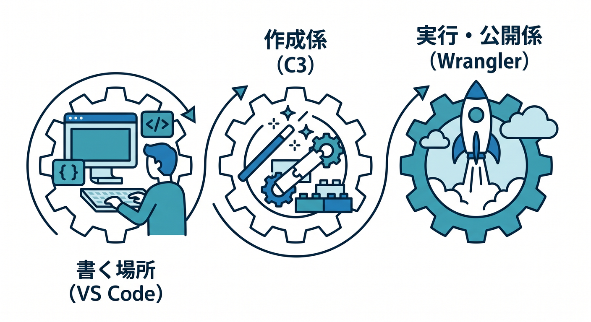
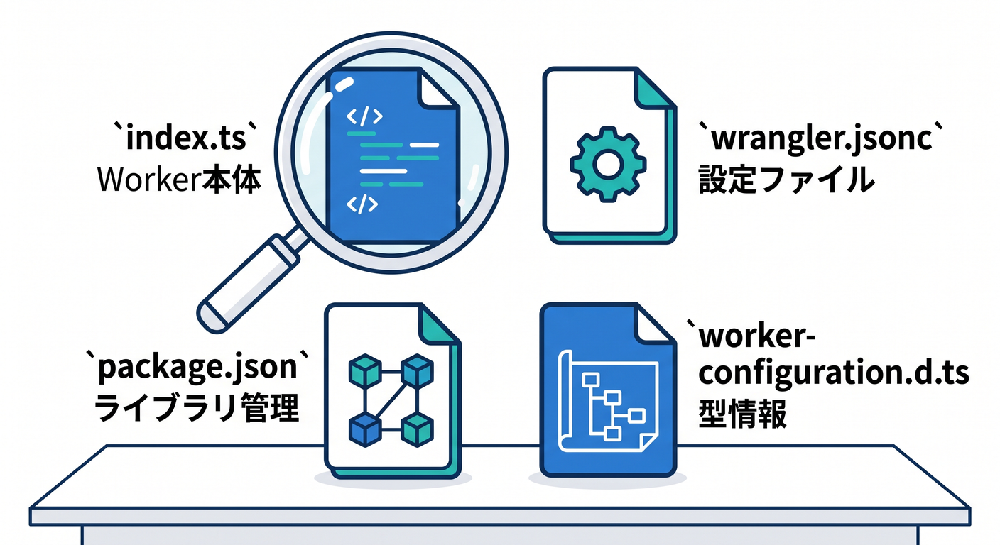
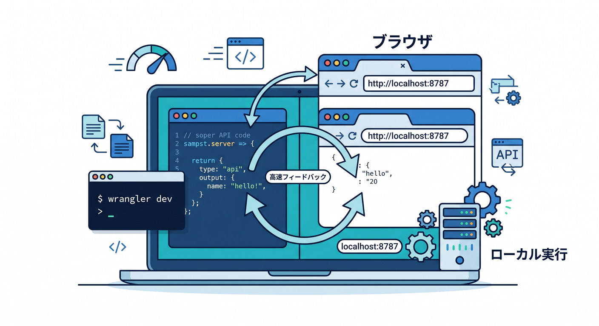
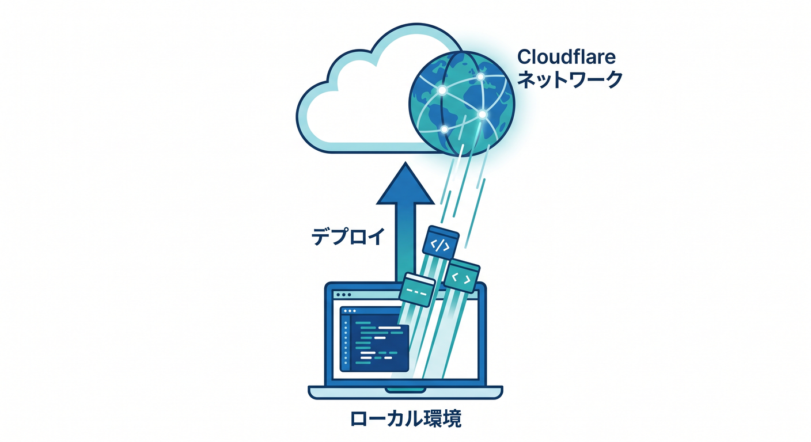

# 第02章：開発スタート！C3・Wrangler・VS Codeをやさしく動かそう 🛠️✨

この章では、CloudflareでAPI開発を始めるための「最初の一歩」を、できるだけ迷わず踏めるようにしていきます😊
主役は3つです。**C3** で土台を作り、**Wrangler** で動かし、**VS Code** で中身を読みながら育てていきます。C3 は `create-cloudflare` CLI で、Cloudflare公式テンプレートやフレームワーク別セットアップを使って新しいプロジェクトを作るための入口です。Wrangler は Workers の作成・開発・デプロイを扱う中心CLIです。([Cloudflare Docs][1])

この章が終わるころには、こんな状態を目指します🎯

* C3で最初のWorkersプロジェクトを作れる
* `wrangler dev` でローカル確認できる
* `wrangler deploy` で公開の流れを理解できる
* `wrangler.jsonc` や `src/index.ts` の役割がわかる
* VS Code と Copilot を使って、コードの意味を読み解ける
* これから先の D1 や Workers AI を入れる準備が整う

---

## 1. まずは全体像をつかもう 👀🌍



Cloudflareの開発を最初に見ると、英単語が多くて少し身構えがちです😅
でも、実際の役割分担はかなりシンプルです。

**C3 = 新規作成係** ✨
新しいプロジェクトを作るときに使います。公式テンプレートを選びながら、Workers向けの初期構成をまとめて用意してくれます。([Cloudflare Docs][1])

**Wrangler = 実行係・公開係** 🚀
ローカル起動、デプロイ、設定反映、型生成など、日々の作業の中心になります。Cloudflare公式のコマンド体系でも、`wrangler dev`、`wrangler deploy`、`wrangler versions` などが中核として案内されています。さらに、Cloudflareは Wrangler をグローバルではなく**プロジェクトローカル**で使うことを勧めています。([Cloudflare Docs][2])

**VS Code = 見る・書く・直す場所** 🧠💻
VS Code は JavaScript / TypeScript のサポートが標準で強く、Node.js のデバッグや統合ターミナルも使えます。TypeScriptのデバッグも、組み込みの Node.js デバッガなどで扱えます。([Visual Studio Code][3])

つまり、感覚としてはこうです👇

**C3で箱を作る → Wranglerで動かす → VS Codeで読む・書く → またWranglerで確認する** 🔁

この流れに慣れるだけで、Cloudflare学習のハードルはかなり下がります 🙌

---

## 2. 最初のプロジェクトを作ろう 🧪📦

まずは PowerShell を開いて、C3 で新しい Worker プロジェクトを作ります。Cloudflare の公式ガイドでは、`npm create cloudflare@latest -- <プロジェクト名>` で開始する形が基本導線です。TypeScript の Worker only 構成も、公式の各種チュートリアルで使われています。([Cloudflare Docs][4])

```bash
npm create cloudflare@latest -- my-api-study
```

途中でいくつか質問されます。最初の学習では、こんな選び方がわかりやすいです 😊

* What would you like to start with? → `Hello World example`
* Which template would you like to use? → `Worker only`
* Which language do you want to use? → `TypeScript`
* Do you want to use git for version control? → `Yes`
* Do you want to deploy your application? → `No`

この選び方は、Cloudflare公式の D1 / KV / Workflows などの最新チュートリアルでも繰り返し使われている、かなり王道の入り方です。([Cloudflare Docs][5])

作成できたら、フォルダへ入ります📁

```bash
cd my-api-study
```

---

## 3. 何が作られたのか見てみよう 🔎📂



C3 で作った直後のフォルダには、だいたい次のようなものが入ります。Cloudflare の TypeScript 系チュートリアルでは、`src/index.ts`、`package.json`、`tsconfig.json`、`wrangler.jsonc` などが並ぶ構成になっています。`test/` や `vitest.config.mts` が入るテンプレートもあります。([Cloudflare Docs][5])

```text
my-api-study/
├─ src/
│  └─ index.ts
├─ package.json
├─ tsconfig.json
├─ wrangler.jsonc
├─ worker-configuration.d.ts
├─ test/
└─ vitest.config.mts
```

ここで特に大事なのは4つです ✨

**`src/index.ts`**
Worker の本体です。第3章以降でAPI本体を書いていく中心ファイルです。([Cloudflare Docs][6])

**`wrangler.jsonc`**
Wrangler の設定ファイルです。Worker名、互換日付、Binding、各種機能の接続先などをここで管理します。Cloudflare は新規プロジェクトでは `wrangler.jsonc` の利用を推奨していて、新しい機能の一部は JSON 系設定ファイルでのみ利用できます。([Cloudflare Docs][7])

**`package.json`**
Node系プロジェクトのおなじみの管理ファイルです。依存ライブラリや scripts をここで扱います。C3 で作った Workers プロジェクトにも入っています。([Cloudflare Docs][4])

**`worker-configuration.d.ts`**
Worker の環境に合った型情報です。Cloudflare は TypeScript を first-class に扱っており、`wrangler types` で Worker 設定に合った型を生成することを推奨しています。設定を変えたあとに型も追従させる、という習慣はかなり大事です。([Cloudflare Docs][8])

---

## 4. `wrangler.jsonc` は「Cloudflareとの約束メモ」だと思おう 📝☁️

初学者が最初に戸惑いやすいのが `wrangler.jsonc` です。でも難しく考えなくて大丈夫です😊
これはざっくり言うと、**「この Worker をどういう条件で動かすか」** を書く設定ファイルです。

Cloudflare 公式では、Wrangler は JSON / JSONC / TOML に対応していますが、新規プロジェクトでは `wrangler.jsonc` を推奨しています。さらに、Bindings や compatibility flags、compatibility date など、Worker の型や実行環境に関わる情報もここに集まります。([Cloudflare Docs][7])

イメージはこんな感じです👇

```jsonc
{
  "$schema": "./node_modules/wrangler/config-schema.json",
  "name": "my-api-study",
  "main": "src/index.ts",
  "compatibility_date": "2026-04-17"
}
```

この段階では、**中身を全部覚える必要はありません** 🙆
最初は、

* Worker の名前
* 入口ファイル
* compatibility date
* あとで D1 や KV や AI をつなぐ場所

このくらいの認識で十分です。

---

## 5. まずはローカルで動かそう！ `wrangler dev` 🌱▶️



Cloudflare 学習で最初の感動ポイントはここです 🎉
作った Worker を、いきなり本番公開せずにローカルで確認できます。

Wrangler の中核コマンドとして `wrangler dev` が公式に案内されており、初回は Cloudflare アカウント認証のためにブラウザが開くことがあります。公式ガイドでは、そのあと `http://localhost:8787` で Worker を確認する流れになっています。([Cloudflare Docs][2])

```bash
npx wrangler dev
```

起動できたら、ブラウザでローカルURLを開いてみましょう 👇

```text
http://localhost:8787
```

ここで大事なのは、**「Cloudflareのコードなのに、手元ですぐ試せる」** という感覚です ✨
この体験があると、クラウド開発が急に身近になります。

---

## 6. ローカル実行って、実はかなり本番に近い 🧠⚙️

「ローカルで動く」と言っても、ただの雑な疑似環境ではありません。Cloudflare の開発・テスト導線では、Miniflare が production で使われる `workerd` と同じランタイム系統で Worker を実行します。さらに、Bindings もデフォルトではローカルにシミュレートされた資源につながります。([Cloudflare Docs][9])

つまり、感覚としてはこうです👇

* **Worker本体** はローカルで試せる
* **KV / D1 / R2 などの資源** もローカル版が自動で用意される
* しかも変更は **本番データに直接は影響しない**

Cloudflare公式でも、`wrangler dev` や Vite 実行時には Miniflare がローカル版の KV / D1 / R2 などを自動で作成し、変更は production data に影響しないと説明されています。([Cloudflare Docs][10])

これはかなり安心材料です 😊
最初のうちは「壊したらどうしよう…😨」がつきものですが、ローカル確認をちゃんと挟めば、落ち着いて学べます。

---

## 7. いよいよ公開！ `wrangler deploy` 🚀🌍



ローカル確認ができたら、次は公開です。Workers の主要コマンドとして `wrangler deploy` が公式に案内されており、`package.json` の scripts に登録して `npm run deploy` のように使う構成も Cloudflare 公式で紹介されています。([Cloudflare Docs][2])

```bash
npx wrangler deploy
```

慣れてきたら、`package.json` にこう書いておくと便利です 👍

```json
{
  "scripts": {
    "dev": "wrangler dev",
    "deploy": "wrangler deploy",
    "cf-typegen": "wrangler types"
  }
}
```

こうしておくと、毎回長いコマンドを打たなくて済みます 😊

```bash
npm run dev
npm run deploy
npm run cf-typegen
```

Cloudflare公式でも、Wrangler コマンドは scripts に寄せる使い方が案内されています。([Cloudflare Docs][2])

---

## 8. TypeScript では `wrangler types` がかなり大事 🧷📘

TypeScript を使うなら、**型の更新** を軽く見ないのがコツです。
Cloudflare Workers では TypeScript が first-class に扱われていて、Worker の型は `compatibility_date`、compatibility flags、bindings などの設定に依存します。そのため Cloudflare は `wrangler types` で現在の設定に合った型を生成することを推奨しています。([Cloudflare Docs][8])

```bash
npx wrangler types
```

特にあとで、

* D1 をつなぐ
* KV をつなぐ
* R2 をつなぐ
* Workers AI をつなぐ
* `nodejs_compat` を足す

みたいな変更をしたあとに、`wrangler types` を回す癖をつけると、補完もエラー表示もかなり気持ちよくなります✨
Cloudflare公式でも、設定ファイルを変更したあとに `wrangler types` を実行するよう案内しています。([Cloudflare Docs][8])

---

## 9. VS Codeでは何を見ればいいの？ 👓💡

VS Code を開いたら、最初に注目するのはこの3か所で十分です 😊

## ① `src/index.ts`

ここが Worker 本体です。最初は「Request を受けて Response を返す」最小コードが入っています。第3章でここを使って、最初の API を作ります。([Cloudflare Docs][6])

## ② `wrangler.jsonc`

Cloudflare との接続設定です。あとで D1 や Workers AI の binding を足すときも、ここを触ることになります。Workers AI も Wrangler ファイルに binding を書いて使います。([Cloudflare Docs][11])

## ③ 統合ターミナル

VS Code には統合ターミナルがあり、エディタを離れずに Node / npm / CLI を実行できます。Node.js 開発やデバッグの流れとも相性がよいです。([Visual Studio Code][3])

「どこを見ればいいかわからない😵‍💫」となったら、まずはこの3つだけでOKです。

---

## 10. Copilot を“答えを丸投げする道具”ではなく“理解を早める道具”として使おう 🤖✨


GitHub Copilot を入れた VS Code では、補完に加えて Copilot Chat も使えます。GitHub 公式では、VS Code で Copilot を使うと入力中の提案を受けられ、Copilot Chat も利用できると案内しています。さらに Copilot Chat は、コードの説明、修正提案、テスト生成、コード修正の提案などに使えます。([GitHub Docs][12])

第2章の段階では、こんな聞き方がかなりおすすめです👇

* 「この `wrangler.jsonc` の各項目を中学生向けに説明して」
* 「`src/index.ts` の処理を1行ずつ説明して」
* 「Cloudflare Worker と Node.js サーバーの違いをやさしく教えて」
* 「このプロジェクトで次に追加しそうな binding の候補を教えて」
* 「`wrangler dev` と `wrangler deploy` の違いを短く整理して」

GitHub 公式の Copilot Chat ドキュメントでも、プロジェクトについて質問したり、ファイルを開いて文脈を与えたり、`@project` やファイル参照でコード理解を深める流れが紹介されています。([GitHub Docs][13])

ここでのコツはひとつだけです 🌟
**「作らせる」より先に「説明させる」** です。

最初から全部生成させると、動いても理解が残りにくいです。
でも、今ある `index.ts` や `wrangler.jsonc` を説明させると、理解のスピードがぐっと上がります。

---

## 11. Cloudflare × AI 時代っぽい学び方も知っておこう 🧠☁️🤖

Cloudflare は Workers の学習支援向けに、**cloudflare-docs MCP サーバー** と **cloudflare-observability MCP サーバー** を案内しています。前者は Workers の知識をAIエージェントに教える用途、後者はログや例外確認などの観測用途です。([Cloudflare Docs][14])

ここは少し先の話ですが、方向性としてはかなり大事です✨

* 公式ドキュメントをAIに読ませながら学ぶ
* ログをAIに見せながら原因を探る
* エラー文だけでなく、設定と実行結果の両方をAIに渡す

こういう流れが、2026年のCloudflare学習ではかなり自然になっています。
ただしこの章では、まずは **C3 / Wrangler / VS Code を自分で触ること** が最優先です 🙆

---

## 12. これから先の章につながる「仕込み」もしておこう 🌱

第2章は準備章ですが、実はこの時点で先の章の土台がかなりできています。

## D1 や KV につながる土台 🗃️

Worker only + TypeScript + `wrangler.jsonc` という形にしておくと、あとから binding を足しやすいです。Bindings は `env` 経由で Worker から Cloudflare リソースに触る基本の仕組みです。([Cloudflare Docs][9])

## Workers AI につながる土台 🤖

Workers AI は Worker から binding でつなぐ形が公式導線です。つまり、今やっている Wrangler 設定や `env` の考え方は、そのまま AI API 作成にも直結します。([Cloudflare Docs][11])

## React 連携につながる土台 ⚛️

後の章で React とつなぐときも、Cloudflare公式は React + Vite + Workers API + Cloudflare Vite plugin という流れを用意しています。Vite plugin は workerd 上での開発に寄せてくれるので、今の Worker 学習とつながりやすいです。([Cloudflare Docs][15])

ここ、かなり大事です 😊
第2章は単なる「環境構築」ではなく、**この先の全部の章に共通する土台作り** なんです。

---

## 13. この章でやってほしい実習 ✍️🎓

ここまで読んだら、ぜひ次の3つをやってみてください。

## 実習1　C3で `my-api-study` を作る

まずは実際に C3 を1回回してみましょう。
手で作るよりずっと早く、Cloudflare流の基本構成を体験できます。([Cloudflare Docs][1])

## 実習2　`wrangler dev` でローカル起動する

ローカルURLが開いて、レスポンスが返るところまで確認しましょう。
この瞬間に「Cloudflare開発、意外といけるかも😊」となる人が多いです。([Cloudflare Docs][4])

## 実習3　Copilot Chat に説明させる

`src/index.ts` を開いたまま、Copilot Chat にこう聞いてみましょう。

```text
この Worker の処理を、初心者向けに1行ずつ説明して
```

理解が浅い状態で次へ行くより、ここで一度「説明してもらう」ほうが、あとがかなり楽になります。([GitHub Docs][13])

---

## 14. よくあるつまずきポイント ⚠️🧯

## つまずき1　`wrangler dev` が動かない

初回は認証でブラウザが開くことがあります。まずは Cloudflare にログインできているかを見ましょう。必要なら `wrangler login` も使えます。([Cloudflare Docs][4])

## つまずき2　設定を変えたのに型が古い

`wrangler.jsonc` を編集したあとに `wrangler types` を忘れると、補完や型エラーがずれることがあります。([Cloudflare Docs][8])

## つまずき3　ローカルで動いたのに本番で違う

Cloudflare のローカル開発はかなり本番に近いですが、bindings の接続先や設定差分は意識したほうが安全です。特に local simulated resources と remote bindings の違いは、あとで D1 や KV を使うときに効いてきます。([Cloudflare Docs][9])

---

## 15. この章のまとめ 🎉📘

この章でいちばん大事なのは、**Cloudflare開発の基本ループ** を体に入れることです。

**C3で作る** 📦
**Wranglerで動かす** ▶️
**VS Codeで読む・直す** ✍️
**Copilotで理解を深める** 🤖
**必要に応じて型を再生成する** 🧷
**最後に deploy する** 🚀

Cloudflare の最新公式導線でも、C3 が新規作成の入口、Wrangler が開発と公開の中心、`wrangler.jsonc` が設定の中核、TypeScript では `wrangler types` が重要、React 系では Cloudflare Vite plugin が有力、そして Workers AI は binding で自然に組み込める、という流れになっています。([Cloudflare Docs][1])

次の第3章では、いよいよこの `src/index.ts` を使って、**最初のAPI** を作っていきます 🚀💬

必要なら次に、そのまま続けて
**「第2章の最後に載せる確認テスト10問」** や
**「第2章の練習問題＋模範解答」** の形にも整えられます。

[1]: https://developers.cloudflare.com/learning-paths/workers/get-started/c3-and-wrangler/ "C3 & Wrangler · Cloudflare Learning Paths"
[2]: https://developers.cloudflare.com/workers/wrangler/commands/ "Commands - Wrangler · Cloudflare Workers docs"
[3]: https://code.visualstudio.com/docs/nodejs/nodejs-tutorial "Node.js tutorial in Visual Studio Code"
[4]: https://developers.cloudflare.com/workers/get-started/guide/ "Get started - CLI · Cloudflare Workers docs"
[5]: https://developers.cloudflare.com/d1/get-started/ "Getting started · Cloudflare D1 docs"
[6]: https://developers.cloudflare.com/workflows/get-started/guide/ "Build your first Workflow · Cloudflare Workflows docs"
[7]: https://developers.cloudflare.com/workers/wrangler/configuration/ "Configuration - Wrangler · Cloudflare Workers docs"
[8]: https://developers.cloudflare.com/workers/languages/typescript/ "Write Cloudflare Workers in TypeScript · Cloudflare Workers docs"
[9]: https://developers.cloudflare.com/workers/development-testing/ "Development & testing · Cloudflare Workers docs"
[10]: https://developers.cloudflare.com/workers/development-testing/local-data/ "Adding local data · Cloudflare Workers docs"
[11]: https://developers.cloudflare.com/workers-ai/configuration/bindings/ "Workers Bindings · Cloudflare Workers AI docs"
[12]: https://docs.github.com/copilot/managing-copilot/configure-personal-settings/installing-the-github-copilot-extension-in-your-environment "Installing the GitHub Copilot extension in your environment - GitHub Docs"
[13]: https://docs.github.com/ja/copilot/how-tos/chat-with-copilot/get-started-with-chat "GitHub Copilot ChatのプロンプトをIDEで開始する方法 - GitHubドキュメント"
[14]: https://developers.cloudflare.com/workers/get-started/prompting/ "Prompting · Cloudflare Workers docs"
[15]: https://developers.cloudflare.com/workers/framework-guides/web-apps/react/ "React + Vite · Cloudflare Workers docs"
